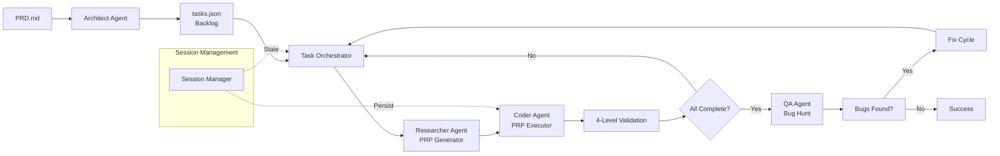

# PRP Pipeline

<p align="center">
  <a href="https://github.com/YOUR_USERNAME/hacky-hack/actions/workflows/ci.yml">
    
  </a>
  <a href="https://codecov.io/gh/YOUR_USERNAME/hacky-hack">
    
  </a>
  <a href="https://badge.fury.io/js/hacky-hack">
    
  </a>
  <a href="https://github.com/YOUR_USERNAME/hacky-hack/blob/main/LICENSE">
    
  </a>
  <br/>
  <a href="https://github.com/YOUR_USERNAME/hacky-hack">
    
  </a>
  <a href="https://github.com/YOUR_USERNAME/hacky-hack">
    
  </a>
</p>

Autonomous AI-powered development pipeline that transforms Product Requirement
Documents (PRDs) into implemented code through multi-agent orchestration.

## What is PRP Pipeline?

PRP Pipeline is an autonomous software development system that transforms
Product Requirement Documents (PRDs) into working code through AI agent
orchestration.

At its core is the **Product Requirement Prompt (PRP)** - a structured prompt
that provides AI agents with complete context, clear objectives, and
validation criteria for implementing work units correctly in a single pass.

**Why PRP Pipeline?**

- **Autonomous Development**: Transform requirements into working code automatically
- **Context-Dense Prompts**: Every PRP contains everything needed for one-pass implementation
- **Progressive Validation**: 4-level quality gates catch defects early
- **Resumable Sessions**: Pause and resume with state persistence
- **Delta Sessions**: Only re-execute changed tasks when PRDs are updated



See [PROMPTS.md](PROMPTS.md) for the complete PRP concept definition.

## Quick Start

Get running in under 2 minutes:

### Prerequisites

- Node.js >= 20.0.0
- npm >= 10.0.0
- Git
- Anthropic API key (via `ANTHROPIC_API_KEY` or `ANTHROPIC_AUTH_TOKEN`)

### Installation

```bash
# Clone the repository
git clone https://github.com/YOUR_USERNAME/hacky-hack.git
cd hacky-hack

# Install dependencies
npm install
```

### Run Your First Pipeline

```bash
# Run with the example PRD
npm run dev -- --prd ./PRD.md

# See what would happen without executing
npm run dev -- --prd ./PRD.md --dry-run
```

That's it! The pipeline will analyze your PRD, generate tasks, and implement them through AI agents.

**Next Steps**: Check out [Usage Examples](#usage-examples) or [Configuration](#configuration).

## Features

- **4 AI Engines**: Specialized agents for Architecture, Research, Implementation, and QA
- **Hierarchical Task Decomposition**: Organize work into Phases → Milestones → Tasks → Subtasks
- **Delta Sessions**: Automatically detect PRD changes and only execute affected tasks
- **QA Bug Hunt**: 3-phase testing (syntax, unit, integration, creative)
- **Scoped Execution**: Run specific phases, milestones, or tasks
- **Resumable Sessions**: Pause and resume with Ctrl+C graceful shutdown
- **4-Level Validation**: Syntax, unit tests, integration tests, and manual validation gates
- **Smart Git Integration**: Automatic commits with generated messages
- **Performance Optimizations**: PRP caching, I/O batching, and parallel research

## Usage Examples

### Basic Pipeline Execution

```bash
# Run full pipeline with your PRD
npm run dev -- --prd ./PRD.md

# Run with verbose output
npm run dev -- --prd ./PRD.md --verbose
```

### Scoped Execution

Execute specific portions of your project:

```bash
# Run specific phase
npm run dev -- --prd ./PRD.md --scope P3

# Run specific milestone
npm run dev -- --prd ./PRD.md --scope P3.M4

# Run specific task
npm run dev -- --prd ./PRD.md --scope P3.M4.T2

# Run single subtask
npm run dev -- --prd ./PRD.md --scope P3.M4.T2.S1
```

### Delta Session (PRD Changes)

When you modify your PRD, run in delta mode to only execute changed tasks:

```bash
# Run in delta mode (only execute changed tasks)
npm run dev -- --prd ./PRD.md --mode delta
```

### Bug Hunt Mode

Run QA bug hunt even with incomplete tasks:

```bash
# Run QA bug hunt mode
npm run dev -- --prd ./PRD.md --mode bug-hunt
```

### Resume Interrupted Session

```bash
# Continue from previous session
npm run dev -- --prd ./PRD.md --continue
```

### Dry Run

```bash
# See what would happen without executing
npm run dev -- --prd ./PRD.md --dry-run
```

### Bypass Cache

```bash
# Bypass PRP cache and regenerate all PRPs
npm run dev -- --prd ./PRD.md --no-cache
```

## CLI Options

| Option               | Alias | Type    | Default    | Description                                               |
| -------------------- | ----- | ------- | ---------- | --------------------------------------------------------- |
| `--prd <path>`       | `-p`  | string  | `./PRD.md` | Path to PRD file                                          |
| `--scope <scope>`    | `-s`  | string  | -          | Execute specific scope (e.g., `P3.M4`)                    |
| `--mode <mode>`      | `-m`  | string  | `normal`   | Execution mode: `normal`, `delta`, `bug-hunt`, `validate` |
| `--continue`         | `-c`  | boolean | false      | Resume from previous session                              |
| `--dry-run`          | `-d`  | boolean | false      | Show plan without executing                               |
| `--verbose`          | `-v`  | boolean | false      | Enable debug logging                                      |
| `--machine-readable` | -     | boolean | false      | Enable machine-readable JSON output                       |
| `--no-cache`         | -     | boolean | false      | Bypass PRP cache and regenerate all PRPs                  |
| `--help`             | `-h`  | boolean | false      | Show help                                                 |

## Configuration

### Environment Variables

| Variable                         | Required | Default                          | Description                                                 |
| -------------------------------- | -------- | -------------------------------- | ----------------------------------------------------------- |
| `ANTHROPIC_AUTH_TOKEN`           | Yes*     | -                                | API authentication token (mapped to `ANTHROPIC_API_KEY`)    |
| `ANTHROPIC_API_KEY`              | Yes*     | -                                | API key (mapped from `ANTHROPIC_AUTH_TOKEN` if not set)     |
| `ANTHROPIC_BASE_URL`             | No       | `https://api.z.ai/api/anthropic` | API endpoint (z.ai required, not Anthropic)                 |
| `ANTHROPIC_DEFAULT_OPUS_MODEL`   | No       | `GLM-4.7`                        | Model for Architect agent (highest quality)                 |
| `ANTHROPIC_DEFAULT_SONNET_MODEL` | No       | `GLM-4.7`                        | Model for Researcher/Coder agents (balanced)                |
| `ANTHROPIC_DEFAULT_HAIKU_MODEL`  | No       | `GLM-4.5-Air`                    | Model for simple operations (fastest)                       |

*Note: Either `ANTHROPIC_AUTH_TOKEN` or `ANTHROPIC_API_KEY` is required.*

### Setup

```bash
# Option 1: Use .env file (recommended)
cp .env.example .env
# Edit .env with your API credentials

# Option 2: Set environment variables directly
export ANTHROPIC_AUTH_TOKEN="your-api-key-here"

# Option 3: Or set API_KEY directly (AUTH_TOKEN takes precedence if both set)
export ANTHROPIC_API_KEY="your-api-key-here"
```

### Model Tiers

- **Opus** (GLM-4.7): Highest quality, used for Architect agent
- **Sonnet** (GLM-4.7): Balanced quality/speed, default for most agents
- **Haiku** (GLM-4.5-Air): Fastest, used for simple operations

### How It Works

The PRP Pipeline uses **z.ai** as a compatible proxy for the Anthropic API. This requires special environment variable configuration:

**Variable Mapping:**
- Shell environment convention: `ANTHROPIC_AUTH_TOKEN`
- SDK expectation: `ANTHROPIC_API_KEY`
- The pipeline automatically maps `AUTH_TOKEN` to `API_KEY` on startup

**Configuration Flow:**
```typescript
// 1. configureEnvironment() is called on startup
configureEnvironment();

// 2. If AUTH_TOKEN is set and API_KEY is not, map it
if (process.env.ANTHROPIC_AUTH_TOKEN && !process.env.ANTHROPIC_API_KEY) {
  process.env.ANTHROPIC_API_KEY = process.env.ANTHROPIC_AUTH_TOKEN;
}

// 3. Set default BASE_URL if not provided
if (!process.env.ANTHROPIC_BASE_URL) {
  process.env.ANTHROPIC_BASE_URL = 'https://api.z.ai/api/anthropic';
}
```

**Idempotency:**
- Multiple calls to `configureEnvironment()` are safe
- If `API_KEY` is already set, `AUTH_TOKEN` will not override it
- Explicit `API_KEY` values take precedence

### API Safeguards

The pipeline includes safeguards to prevent accidental usage of Anthropic's official API, which could result in massive unexpected charges.

**Test Setup Safeguard** (`tests/setup.ts`):
- Blocks: `api.anthropic.com` (all variants)
- Allows: `localhost`, `127.0.0.1`, `mock`, `test` endpoints
- Warns: Non-z.ai endpoints with console warning
- Runs: On test file load and before each test

**Validation Script Safeguard** (`src/scripts/validate-api.ts`):
- Checks: `ANTHROPIC_BASE_URL` before any API calls
- Exits: With code 1 if Anthropic API detected
- Tests: z.ai endpoint with `/v1/messages`
- Validates: Response structure (id, type, role, content)

**What Gets Blocked:**
```
https://api.anthropic.com
http://api.anthropic.com
api.anthropic.com (any variant)
```

**What's Allowed:**
```
https://api.z.ai/api/anthropic (recommended)
http://localhost:3000 (local testing)
http://127.0.0.1:8080 (local testing)
http://mock-api (mock testing)
```

### z.ai Configuration

The PRP Pipeline uses **z.ai** as the API endpoint, not Anthropic's official API.

**Why z.ai?**
- Compatible with Anthropic API v1 specification
- Cost control and usage monitoring
- Prevents unexpected production API charges

**Model Tiers:**

| Tier    | Model        | Use Case                              |
| ------- | ------------ | ------------------------------------- |
| Opus    | GLM-4.7      | Architect agent (complex reasoning)   |
| Sonnet  | GLM-4.7      | Researcher/Coder agents (default)     |
| Haiku   | GLM-4.5-Air  | Simple operations (fastest)           |

**Example .env File:**
```bash
# .env - API Configuration for PRP Pipeline

# Required: API authentication
ANTHROPIC_AUTH_TOKEN=your-zai-api-token-here

# Optional: API endpoint (defaults to z.ai)
# ANTHROPIC_BASE_URL=https://api.z.ai/api/anthropic

# Optional: Model overrides
# ANTHROPIC_DEFAULT_OPUS_MODEL=GLM-4.7
# ANTHROPIC_DEFAULT_SONNET_MODEL=GLM-4.7
# ANTHROPIC_DEFAULT_HAIKU_MODEL=GLM-4.5-Air

# Optional: Request timeout (milliseconds)
# API_TIMEOUT_MS=300000
```

### Troubleshooting

**"Tests fail with 'Anthropic API detected' error"**

The test setup safeguards prevent using Anthropic's official API.

```bash
# Fix: Set BASE_URL to z.ai endpoint
export ANTHROPIC_BASE_URL="https://api.z.ai/api/anthropic"

# Or add to .env file
echo "ANTHROPIC_BASE_URL=https://api.z.ai/api/anthropic" >> .env
```

**"ANTHROPIC_API_KEY not found" error**

The environment configuration hasn't been run or variables aren't set.

```bash
# Fix: Set AUTH_TOKEN (will be mapped to API_KEY)
export ANTHROPIC_AUTH_TOKEN="your-api-key-here"

# Or set API_KEY directly
export ANTHROPIC_API_KEY="your-api-key-here"
```

**"Model not found: GLM-4.7" error**

The z.ai endpoint may not support the configured model.

```bash
# Fix: Verify model name or override with supported model
export ANTHROPIC_DEFAULT_SONNET_MODEL="supported-model-name"

# Check z.ai documentation for available models
```

**"Connection timeout" errors**

The API timeout may be too short for complex requests.

```bash
# Fix: Increase timeout (default is 60 seconds)
export API_TIMEOUT_MS=120000
```

## Architecture Overview

### System Flow


### Core Components

#### Session Manager

Handles state persistence, session directories (`plan/{sequence}_{hash}/`), and PRD change detection. Creates delta sessions when PRDs are modified.

#### Task Orchestrator

Manages task hierarchy traversal (depth-first, pre-order), dependency resolution, and scope-based execution. Coordinates the flow from PRD to implemented code.

#### Agent Factory

Creates specialized AI agents:

- **Architect**: Decomposes PRDs into hierarchical task backlogs
- **Researcher**: Generates PRPs from subtasks through codebase research
- **Coder**: Implements PRPs with validation gates
- **QA**: Performs bug hunts and generates test reports

#### PRP Runtime

Executes Product Requirement Prompts with 4-level validation:

1. **Level 1**: Syntax & Style (linting, type check)
2. **Level 2**: Unit Tests (component validation)
3. **Level 3**: Integration Tests (system validation)
4. **Level 4**: Manual/E2E (creative validation)

See [PROMPTS.md](PROMPTS.md) for complete PRP concept definition.

**For comprehensive architecture documentation**, see:

- **[Architecture Documentation](docs/architecture.md)** - Detailed system architecture with Mermaid diagrams, component interactions, extensibility patterns, and API references
- **[TypeDoc API Reference](docs/api/index.html)** - Complete API documentation for all modules, classes, and types (run `npm run docs` to generate)

## AI Agent System

The PRP Pipeline uses specialized AI agents for each stage of development:

| Agent          | Purpose                  | Input           | Output          | Invoked When       |
| -------------- | ------------------------ | --------------- | --------------- | ------------------ |
| **Architect**  | Decompose PRD into tasks | PRD.md          | tasks.json      | New session        |
| **Researcher** | Generate PRPs            | Subtask context | PRP.md          | Subtask starts     |
| **Coder**      | Implement PRPs           | PRP.md          | Code changes    | PRP generated      |
| **QA**         | Find bugs                | Completed code  | TEST_RESULTS.md | All tasks complete |

### PRP Concept

A **Product Requirement Prompt (PRP)** is a structured prompt containing:

- **Goal**: What to build (feature goal, deliverable, success criteria)
- **Context**: Complete context (file paths, patterns, gotchas, docs)
- **How**: Step-by-step implementation tasks
- **Validation**: 4-level quality gate system

PRPs enable one-pass implementation by providing AI agents with everything
they need - no guessing, no missing context.

## Pipeline Workflow

### Phase 1: Session Initialization

Computes SHA-256 hash of PRD.md to detect new vs existing sessions:

- **New session**: Creates `plan/{sequence}_{hash}/` directory
- **Existing session**: Loads tasks.json and resumes execution
- **Delta session**: When PRD changes, creates linked session for incremental updates

### Phase 2: PRD Decomposition

Architect Agent analyzes PRD and generates task hierarchy:

- Phase → Milestone → Task → Subtask (4 levels)
- Each Subtask includes context_scope, dependencies, and story_points
- Persists to `tasks.json`

### Phase 3: Backlog Execution

Task Orchestrator traverses hierarchy (depth-first, pre-order):

1. Check dependencies (wait if blocking)
2. Generate PRP (Product Requirement Prompt) via Researcher agent
3. Execute PRP with Coder agent
4. Validate through 4-level gate system
5. Commit changes to Git

Supports graceful shutdown (Ctrl+C preserves state).

### Phase 4: QA Cycle

Runs when all tasks are Complete:

- QA Agent performs bug hunt (3-phase testing)
- Generates TEST_RESULTS.md
- If bugs found: triggers bug-fix sub-pipeline
- If no bugs: pipeline succeeds

## Project Structure

```
hacky-hack/
├── src/
│   ├── agents/              # AI agent implementations
│   │   ├── prompts/         # Agent prompt templates
│   │   ├── agent-factory.ts # Agent creation factory
│   │   ├── prp-generator.ts # PRP Generator agent
│   │   ├── prp-executor.ts  # PRP Executor agent
│   │   └── prp-runtime.ts   # PRP Runtime orchestrator
│   ├── cli/                 # Command-line interface
│   │   └── index.ts         # CLI argument parser
│   ├── config/              # Configuration modules
│   │   ├── constants.ts     # Constants
│   │   ├── environment.ts   # Environment setup
│   │   └── types.ts         # Type definitions
│   ├── core/                # Core business logic
│   │   ├── index.ts         # Core module exports
│   │   ├── models.ts        # Task hierarchy types
│   │   ├── prd-differ.ts    # PRD diffing utilities
│   │   ├── scope-resolver.ts # Scope parsing
│   │   ├── session-manager.ts # Session state management
│   │   ├── session-utils.ts # Session utilities
│   │   └── task-orchestrator.ts # Task execution orchestrator
│   ├── tools/               # MCP tool integrations
│   │   ├── bash-mcp.ts      # Bash MCP tool
│   │   ├── filesystem-mcp.ts # Filesystem MCP tool
│   │   └── git-mcp.ts       # Git MCP tool
│   ├── utils/               # Utility functions
│   │   ├── git-commit.ts    # Smart commit utility
│   │   ├── logger.ts        # Logging utilities
│   │   ├── progress.ts      # Progress tracking
│   │   └── task-utils.ts    # Task utilities
│   ├── workflows/           # Pipeline orchestration
│   │   ├── prp-pipeline.ts  # Main PRP Pipeline workflow
│   │   ├── delta-analysis-workflow.ts # Delta session workflow
│   │   ├── bug-hunt-workflow.ts # QA bug hunt workflow
│   │   └── fix-cycle-workflow.ts # Bug fix workflow
│   └── scripts/             # Standalone scripts
│       └── validate-api.ts  # API validation script
├── plan/                    # Session directories
│   └── 001_14b9dc2a33c7/    # Example session
│       ├── PRP/             # Generated PRPs
│       ├── research/        # Research findings
│       ├── architecture/    # Architectural research
│       ├── tasks.json       # Task hierarchy
│       └── prd_snapshot.md  # PRD snapshot
├── PRD.md                   # Master product requirements
├── PROMPTS.md               # System prompts
├── package.json             # npm configuration
├── tsconfig.json            # TypeScript configuration
├── vitest.config.ts         # Test configuration
├── .eslintrc.json           # ESLint configuration
└── .prettierrc              # Prettier configuration
```

## Development

### Prerequisites

- Node.js >= 20.0.0
- npm >= 10.0.0
- Git

### Setup

```bash
# Clone the repository
git clone https://github.com/YOUR_USERNAME/hacky-hack.git
cd hacky-hack

# Install dependencies
npm install

# Verify installation
npm run typecheck
```

### Available Scripts

| Script                  | Description                     |
| ----------------------- | ------------------------------- |
| `npm run dev`           | Run pipeline with PRD           |
| `npm run dev:watch`     | Run with hot reload             |
| `npm run dev:debug`     | Run with debug inspector        |
| `npm run build`         | Build the project               |
| `npm run typecheck`     | Type check without compilation  |
| `npm test`              | Run tests in watch mode         |
| `npm run test:run`      | Run tests once                  |
| `npm run test:coverage` | Generate coverage report        |
| `npm run lint`          | Run ESLint                      |
| `npm run format`        | Format code with Prettier       |
| `npm run validate`      | Run all validation checks       |
| `npm run fix`           | Auto-fix linting and formatting |

### Running Tests

```bash
# Run all tests
npm test

# Run specific test file
npm test -- path/to/test.test.ts

# Run with coverage
npm run test:coverage

# Run tests in watch mode
npm test
```

### Building

```bash
# Type check
npm run typecheck

# Build for production
npm run build

# Build with watch mode
npm run build:watch
```

## Contributing

We welcome contributions! See [docs/contributing.md](docs/contributing.md) for complete contributor guidelines, including:

- Development setup instructions
- Code organization overview
- Testing guide (100% coverage requirement)
- Code style (ESLint, Prettier, TypeScript)
- Adding new agent personas
- Adding new MCP tools
- Pull request process
- Release process

## License

MIT License

Copyright (c) 2026

Permission is hereby granted, free of charge, to any person obtaining a copy
of this software and associated documentation files (the "Software"), to deal
in the Software without restriction, including without limitation the rights
to use, copy, modify, merge, publish, distribute, sublicense, and/or sell
copies of the Software, and to permit persons to whom the Software is
furnished to do so, subject to the following conditions:

The above copyright notice and this permission notice shall be included in all
copies or substantial portions of the Software.

THE SOFTWARE IS PROVIDED "AS IS", WITHOUT WARRANTY OF ANY KIND, EXPRESS OR
IMPLIED, INCLUDING BUT NOT LIMITED TO THE WARRANTIES OF MERCHANTABILITY,
FITNESS FOR A PARTICULAR PURPOSE AND NONINFRINGEMENT. IN NO EVENT SHALL THE
AUTHORS OR COPYRIGHT HOLDERS BE LIABLE FOR ANY CLAIM, DAMAGES OR OTHER
LIABILITY, WHETHER IN AN ACTION OF CONTRACT, TORT OR OTHERWISE, ARISING FROM,
OUT OF OR IN CONNECTION WITH THE SOFTWARE OR THE USE OR OTHER DEALINGS IN THE
SOFTWARE.
