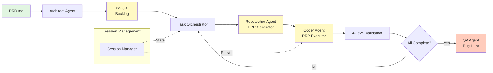
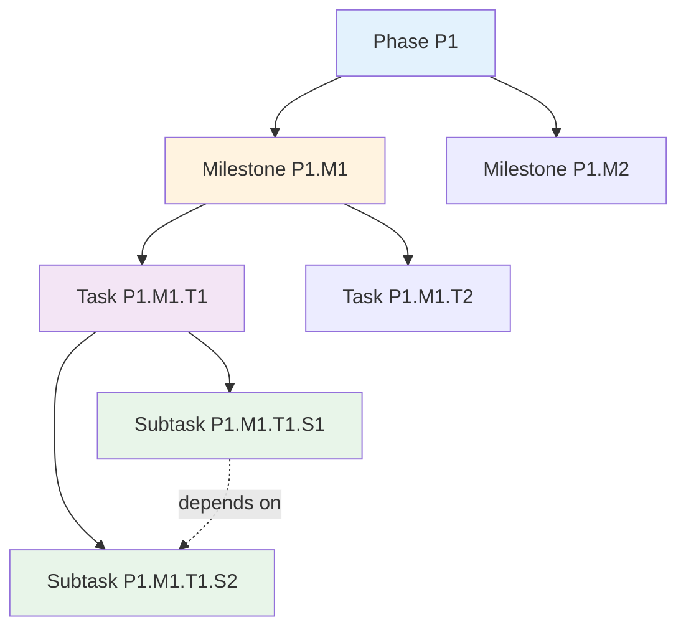
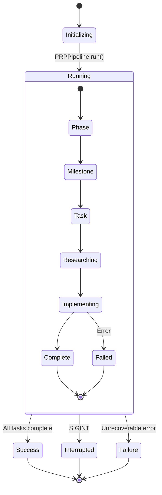
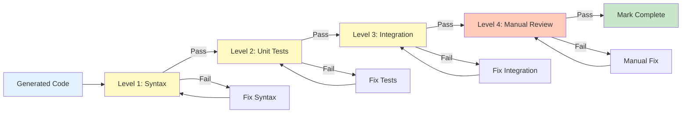
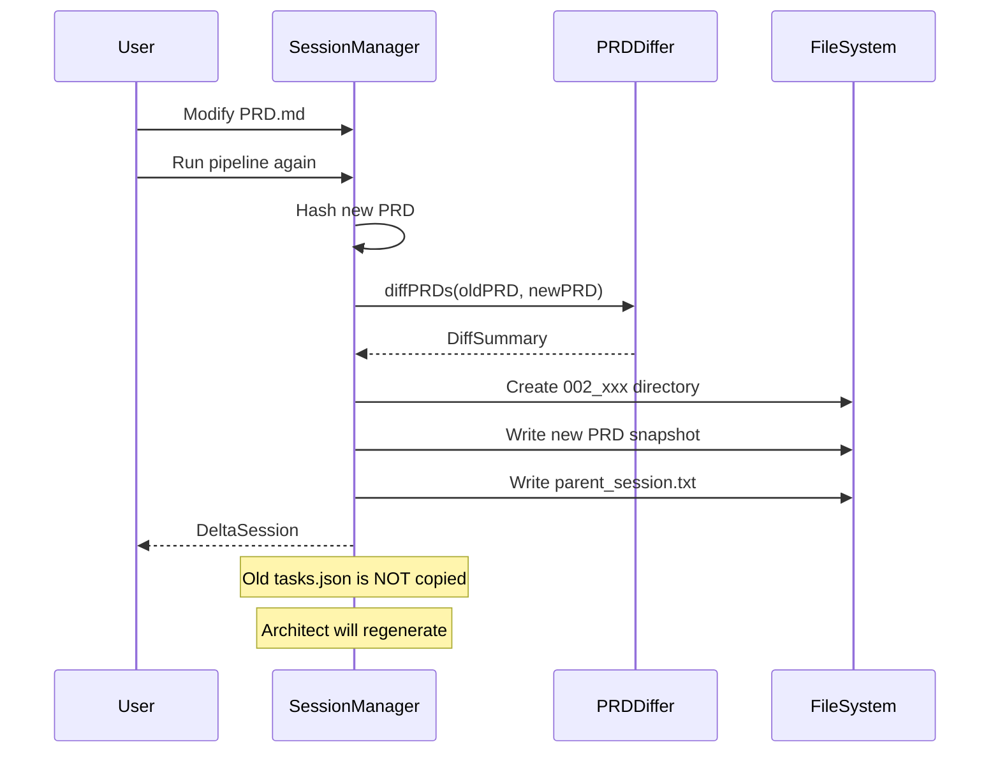
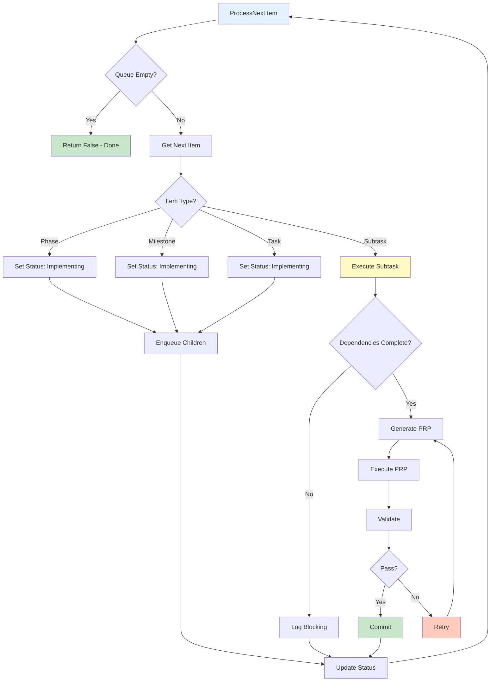
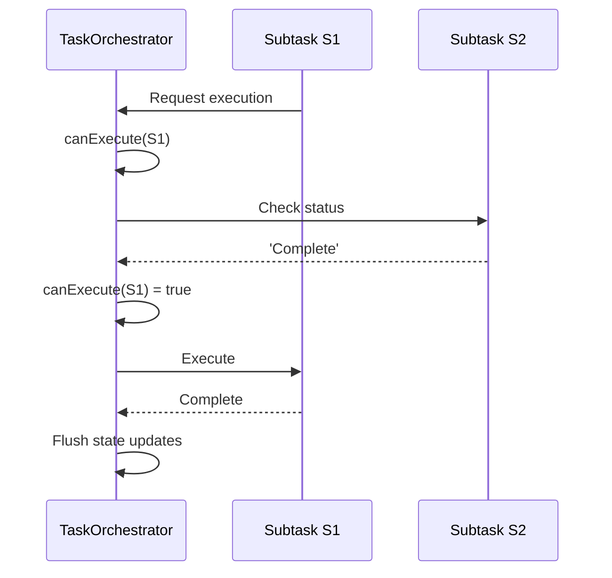
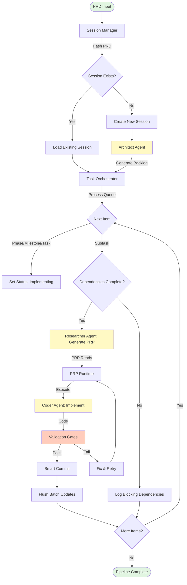

# Architecture Overview

> Comprehensive overview of the PRP Pipeline architecture, including system design, component interactions, Groundswell framework integration, multi-agent system, state management, and task execution flow.

**Status**: Published
**Last Updated**: 2026-01-23
**Version**: 1.0.0

---

## Table of Contents

- [System Overview](#system-overview)
- [Four Core Processing Engines](#four-core-processing-engines)
- [Groundswell Framework Integration](#groundswell-framework-integration)
- [Multi-Agent Architecture](#multi-agent-architecture)
- [State Management and Persistence](#state-management-and-persistence)
- [Task Hierarchy and Execution Flow](#task-hierarchy-and-execution-flow)
- [See Also](#see-also)

---

## System Overview

The PRP Pipeline is an **autonomous AI-powered software development framework** that transforms Product Requirement Documents (PRDs) into implemented, tested, and polished codebases through agentic orchestration.

### Design Philosophy

The pipeline operates on four core principles:

1. **Structured Decomposition**: PRDs are decomposed into a four-level hierarchy (Phase > Milestone > Task > Subtask)
2. **Context-Dense Prompts**: Each subtask receives a focused Product Requirement Prompt (PRP) containing all necessary context
3. **Progressive Validation**: 4-level validation gates catch defects early (Syntax → Unit → Integration → Manual)
4. **Self-Healing**: Iterative bug hunting and fix cycles ensure quality

### High-Level Architecture



### System Flow Description

The PRP Pipeline follows a systematic flow from requirements to implementation:

1. **PRD Input**: A Product Requirement Document (PRD.md) provides the high-level requirements
2. **Architect Phase**: The Architect Agent analyzes the PRD and generates a hierarchical task backlog (tasks.json)
3. **Task Orchestration**: The Task Orchestrator manages the execution queue, traversing tasks in depth-first order
4. **Research Phase**: For each subtask, the Researcher Agent generates a comprehensive PRP with all necessary context
5. **Implementation Phase**: The Coder Agent executes the PRP, implementing the required code changes
6. **Validation**: Each implementation passes through 4-level validation gates (Syntax, Unit, Integration, Manual)
7. **QA Phase**: Once all tasks complete, the QA Agent performs a comprehensive bug hunt
8. **Fix Cycle**: If bugs are found, they trigger a fix cycle that re-executes affected tasks

Throughout the process, the Session Manager maintains state persistence, enabling resumable sessions and delta workflows.

---

## Four Core Processing Engines

The PRP Pipeline's architecture is built around four interconnected processing engines that handle different aspects of the development lifecycle.

### 1. Session Manager

**Location**: [`src/core/session-manager.ts`](../src/core/session-manager.ts)

The Session Manager provides centralized state management, PRD hash-based initialization, and delta session capabilities.

#### Responsibilities

- **Session State Management**: Maintains immutable `SessionState` with metadata, PRD snapshot, and task registry
- **PRD Hashing**: Computes SHA-256 hashes for change detection
- **Session Discovery**: Finds existing sessions by hash or creates new ones
- **Delta Sessions**: Creates linked sessions when PRDs are modified
- **Atomic Persistence**: Batch writes with dirty flag for efficient state updates

#### Key Methods

```typescript
// Initialize session (new or load existing)
async initialize(): Promise<SessionState>

// Create delta session for PRD changes
async createDeltaSession(newPRDPath: string): Promise<DeltaSession>

// Update item status with batching
async updateItemStatus(itemId: string, status: Status): Promise<Backlog>

// Flush accumulated updates atomically
async flushUpdates(): Promise<void>
```

#### Session Directory Structure

```
plan/
├── 001_14b9dc2a33c7/
│   ├── prd_snapshot.md          # Original PRD content
│   ├── tasks.json               # Task backlog registry
│   └── parent_session.txt       # Parent reference (delta sessions only)
├── 002_a1b2c3d4e5f6/
│   └── ...
```

---

### 2. Task Orchestrator

**Location**: [`src/core/task-orchestrator.ts`](../src/core/task-orchestrator.ts)

The Task Orchestrator manages backlog processing with recursive depth-first traversal (DFS) and dependency-aware execution.

#### Responsibilities

- **Backlog Traversal**: DFS pre-order traversal (Phase → Milestone → Task → Subtask)
- **Dependency Resolution**: Ensures subtasks execute only after dependencies complete
- **Scope Support**: Executes subsets of the backlog (milestone, task, subtask scope)
- **Status Management**: Transitions items through lifecycle states
- **Smart Commits**: Creates git commits after each successful subtask

#### Key Methods

```typescript
// Process next item from execution queue
async processNextItem(): Promise<boolean>

// Check if subtask can execute (dependencies satisfied)
canExecute(subtask: Subtask): boolean

// Get blocking dependencies
getBlockingDependencies(subtask: Subtask): Subtask[]

// Wait for dependencies to complete
async waitForDependencies(subtask: Subtask, options?: { timeout?: number; interval?: number }): Promise<void>
```

#### Task Hierarchy



#### Dependency Resolution

Subtasks declare dependencies using the `dependencies` array:

```typescript
interface Subtask {
  readonly dependencies: string[]; // e.g., ['P1.M1.T1.S1', 'P1.M1.T1.S2']
}
```

The orchestrator validates dependencies before execution and blocks execution if prerequisites are not complete.

---

### 3. Agent Runtime

**Location**: [`src/agents/prp-runtime.ts`](../src/agents/prp-runtime.ts)

The Agent Runtime manages LLM agent creation, configuration, and execution with tool registration and context injection.

#### Responsibilities

- **Agent Factory**: Creates agents for different personas (Architect, Researcher, Coder, QA)
- **Tool Registration**: Provides file I/O, shell, search, and web research tools
- **Context Injection**: Injects relevant codebase context into agent prompts
- **PRP Execution**: Orchestrates PRP generation and execution
- **Validation Gates**: Manages 4-level validation process

#### Agent Types

| Agent          | Persona               | Responsibility                  | Token Limit |
| -------------- | --------------------- | ------------------------------- | ----------- |
| **Architect**  | System Designer       | Generates task backlog from PRD | 8192        |
| **Researcher** | Context Gatherer      | Generates PRPs for subtasks     | 4096        |
| **Coder**      | Implementation Expert | Executes PRPs to produce code   | 4096        |
| **QA**         | Quality Assurance     | Finds and fixes bugs            | 4096        |

#### Tool System

```typescript
interface MCPTool {
  name: string;
  description: string;
  inputSchema: z.ZodType<any>;
  handler: (input: unknown) => Promise<ToolResult>;
}
```

Available tools:

- **BashMCP**: Execute shell commands
- **FilesystemMCP**: Read/write files
- **GitMCP**: Git operations
- **SearchMCP**: Codebase search
- **WebFetch**: Web research

---

### 4. Pipeline Controller

**Location**: [`src/workflows/prp-pipeline.ts`](../src/workflows/prp-pipeline.ts)

The Pipeline Controller orchestrates the entire development lifecycle from PRD to implemented code.

#### Responsibilities

- **Workflow Orchestration**: Coordinates all processing engines
- **Error Recovery**: Handles failures gracefully with retry logic
- **Graceful Shutdown**: Responds to SIGINT (Ctrl+C) with state preservation
- **Progress Tracking**: Reports completion metrics and duration
- **Session Resumption**: Continues interrupted sessions

#### Execution Flow



---

## Groundswell Framework Integration

The PRP Pipeline is built on the **Groundswell Framework**, which provides agentic workflow primitives.

### @Workflow Decorator

The main pipeline workflow extends the Groundswell `Workflow` class:

```typescript
import { Workflow, Step, ObservedState } from 'groundswell';

class PRPPipeline extends Workflow {
  @ObservedState()
  currentPhase: string = 'init';

  @Step({ trackTiming: true, snapshotState: true })
  async initializeSession(): Promise<SessionConfig> {
    this.currentPhase = 'initializing';
    return sessionConfig;
  }
}
```

The `@Workflow` decorator provides:

- **Automatic state observation**: Track workflow state changes
- **Step timing**: Measure execution time for each step
- **State snapshots**: Save state at key points for recovery
- **Error handling**: Built-in retry and failure handling

### @Step Decorator

Individual workflow steps use the `@Step` decorator:

```typescript
@Step({ trackTiming: true, snapshotState: true })
async executePhase(): Promise<void> {
  // Step implementation
}
```

Step decorator options:

- `trackTiming`: Record execution time for performance analysis
- `snapshotState`: Save state before/after step execution
- `retry`: Number of retry attempts on failure
- `timeout`: Maximum execution time before aborting

### @ObservedState Pattern

State properties use the `@ObservedState()` decorator:

```typescript
@ObservedState()
currentItemId: string | null = null;

@ObservedState()
totalItems: number = 0;
```

Observed state provides:

- **Automatic persistence**: State changes are persisted automatically
- **Change detection**: Framework detects when state changes
- **Recovery support**: State can be restored after interruption

### Agent Creation

Agents are created using Groundswell's `createAgent` function:

```typescript
import { createAgent } from 'groundswell';

const coderAgent = createAgent({
  apiKey: process.env.ANTHROPIC_API_KEY!,
  model: 'claude-opus-4-5-20251101',
  maxTokens: 8192,
  systemPrompt: CODER_SYSTEM_PROMPT,
});

const response = await coderAgent.generate({
  prompt: 'Implement the PRP',
  tools: [bashTool, fileTool, gitTool],
  responseFormat: { type: 'text' },
});
```

### Tool Registration

MCP tools are registered with agents through Groundswell:

```typescript
import { MCPHandler } from 'groundswell';

const mcp = new MCPHandler();

// Register custom tools
mcp.registerTool({
  name: 'execute_command',
  description: 'Execute shell command',
  inputSchema: z.object({
    command: z.string(),
  }),
  handler: async input => {
    return { output: await exec(input.command) };
  },
});

// Use with agent
const response = await agent.generate({
  prompt: 'List files',
  tools: mcp.getTools(),
});
```

### Groundswell Caching

Groundswell provides automatic SHA-256 based caching:

```
Cache Key = SHA-256(system prompt + user prompt + responseFormat)
```

**Performance Impact**:

- **Cache Hit**: <10ms, 0 API calls
- **Cache Miss**: 1-5 seconds, 1 API call
- **Typical Hit Rate**: 80-95% on subsequent runs

---

## Multi-Agent Architecture

The PRP Pipeline uses specialized AI agents for each stage of development, with distinct personas and responsibilities.

### Agent Personas

| Agent          | Persona               | Purpose                  | Input           | Output          | Invoked When       |
| -------------- | --------------------- | ------------------------ | --------------- | --------------- | ------------------ |
| **Architect**  | System Designer       | Decompose PRD into tasks | PRD.md          | tasks.json      | New session        |
| **Researcher** | Context Gatherer      | Generate PRPs            | Subtask context | PRP.md          | Subtask starts     |
| **Coder**      | Implementation Expert | Implement PRPs           | PRP.md          | Code changes    | PRP generated      |
| **QA**         | Quality Assurance     | Find bugs                | Completed code  | TEST_RESULTS.md | All tasks complete |

### Prompt Engineering

Each agent has a specialized system prompt that defines its persona and approach:

**Architect Prompt** (from PROMPTS.md):

```
# LEAD TECHNICAL ARCHITECT & PROJECT SYNTHESIZER

> ROLE: Act as a Lead Technical Architect and Project Management Synthesizer.
> CONTEXT: You represent the rigorous, unified consensus of a senior panel (Security, DevOps, Backend, Frontend, QA).
> GOAL: Validate the PRD through research, document findings, and decompose the PRD into a strict hierarchy: Phase > Milestone > Task > Subtask.
```

**Researcher Prompt**:

Focused on codebase analysis and context gathering for PRP generation. Spawns subagents for parallel research.

**Coder Prompt**:

Executes PRPs with strict adherence to validation gates and existing codebase patterns.

**QA Prompt**:

Performs comprehensive bug hunting with creative testing approaches.

### Tool System (MCP)

Agents interact with the codebase through Model Context Protocol (MCP) tools:

#### BashMCP

Execute shell commands for build, test, and git operations:

```typescript
await bashTool.execute({
  command: 'npm test',
  timeout: 30000,
});
```

#### FilesystemMCP

Read and write files with path validation:

```typescript
const content = await fileTool.read({ path: 'src/index.ts' });
await fileTool.write({ path: 'src/new-file.ts', content: '...' });
```

#### GitMCP

Git operations for commit and diff:

```typescript
const status = await gitTool.status({ path: '.' });
await gitTool.commit({ message: 'Implement feature X' });
```

### Validation Gates

Each PRP execution goes through 4 validation gates:



**Level 1: Syntax & Style**

- Linting (ESLint)
- Type checking (TypeScript)
- Code formatting (Prettier)

**Level 2: Unit Tests**

- Component-level tests
- Edge case coverage
- Mock external dependencies

**Level 3: Integration Tests**

- Service startup validation
- Endpoint testing
- Database operations

**Level 4: Manual/E2E**

- User workflow testing
- Creative edge cases
- Adversarial testing

---

## State Management and Persistence

The PRP Pipeline uses a robust state management system with immutable data structures and atomic persistence.

### Session Directory Structure

```
plan/
├── 001_14b9dc2a33c7/              # First session (sequence + hash)
│   ├── prd_snapshot.md             # Original PRD content
│   ├── tasks.json                  # Task backlog registry
│   └── parent_session.txt          # Parent reference (delta sessions only)
├── 002_a1b2c3d4e5f6/              # Delta session (PRD modified)
│   ├── prd_snapshot.md             # Updated PRD
│   ├── tasks.json                  # New task registry
│   ├── parent_session.txt          # "001_14b9dc2a33c7"
│   └── subtasks/                   # Generated PRPs (optional)
│       ├── P1.M1.T1.S1.md
│       ├── P1.M1.T1.S2.md
│       └── ...
└── .gitignore                      # Exclude generated files
```

### tasks.json Format

The task registry is a JSON document representing the four-level hierarchy:

```json
{
  "backlog": [
    {
      "type": "Phase",
      "id": "P1",
      "title": "Foundation",
      "status": "Complete",
      "description": "Core infrastructure and documentation",
      "milestones": [
        {
          "type": "Milestone",
          "id": "P1.M1",
          "title": "Project Setup",
          "status": "Complete",
          "description": "Initialize project structure",
          "tasks": [
            {
              "type": "Task",
              "id": "P1.M1.T1",
              "title": "Developer Documentation",
              "status": "Complete",
              "description": "Create comprehensive developer docs",
              "subtasks": [
                {
                  "type": "Subtask",
                  "id": "P1.M1.T1.S1",
                  "title": "Create Architecture Overview",
                  "status": "Complete",
                  "story_points": 2,
                  "dependencies": [],
                  "context_scope": "Create docs/ARCHITECTURE.md with system overview..."
                }
              ]
            }
          ]
        }
      ]
    }
  ]
}
```

### PRD Hash-Based Change Detection

The pipeline uses SHA-256 hashing to detect PRD changes:

```typescript
import { createHash } from 'crypto';

function computePRDHash(prdPath: string): string {
  const content = fs.readFileSync(prdPath, 'utf-8');
  return createHash('sha256').update(content).digest('hex').substring(0, 12);
}
```

**Session ID Format**: `{sequence}_{hash}`

- `sequence`: Auto-incrementing number (001, 002, 003, ...)
- `hash`: First 12 characters of SHA-256 hash

**Behavior**:

- Same hash → Load existing session
- Different hash → Create new session
- Modified PRD → Create delta session with parent reference

### Delta Sessions

When a PRD is modified, the pipeline creates a delta session linked to the original:



**Delta Session Properties**:

- **Linked**: Contains `parent_session.txt` with parent path
- **Incremental**: Only executes tasks affected by PRD changes
- **Efficient**: Skips completed work unaffected by changes

### State Persistence Patterns

**Immutable State with Batch Updates**:

```typescript
interface SessionState {
  readonly metadata: SessionMetadata;
  readonly prdSnapshot: string;
  readonly taskRegistry: Backlog;
  currentItemId: string | null; // Mutable for batching
}
```

**Update Pattern**:

```typescript
// 1. Accumulate updates in memory
sessionManager.updateItemStatus('P1.M1.T1.S1', 'Implementing');
sessionManager.updateItemStatus('P1.M1.T1.S1', 'Complete');

// 2. Flush atomically
await sessionManager.flushUpdates();
```

**Atomic Persistence**:

- All changes batched in memory
- Single write operation on flush
- Prevents partial state corruption

---

## Task Hierarchy and Execution Flow

The PRP Pipeline uses a four-level task hierarchy with depth-first traversal and dependency-aware execution.

### Four-Level Hierarchy

```
Phase (P1)
└── Milestone (P1.M1)
    └── Task (P1.M1.T1)
        └── Subtask (P1.M1.T1.S1) ← Atomic unit of work
```

**Hierarchy Levels**:

| Level         | ID Format    | Duration     | Purpose                       |
| ------------- | ------------ | ------------ | ----------------------------- |
| **Phase**     | P1, P2, P3   | Weeks-months | Project-scope goals           |
| **Milestone** | P1.M1, P1.M2 | 1-12 weeks   | Key objectives within a Phase |
| **Task**      | P1.M1.T1     | Days-weeks   | Complete features             |
| **Subtask**   | P1.M1.T1.S1  | 0.5-2 SP     | Atomic implementation steps   |

**Story Points**:

- 1 SP: ~2-4 hours of focused work
- 2 SP: ~4-8 hours of focused work
- Maximum: 2 SP per subtask (enforces atomicity)

### DFS Traversal Algorithm

The Task Orchestrator uses recursive depth-first traversal (DFS) with pre-order visiting:



### Dependency Resolution

Subtasks can declare dependencies on other subtasks:

```typescript
interface Subtask {
  readonly id: string; // "P1.M1.T1.S2"
  readonly dependencies: string[]; // ["P1.M1.T1.S1"]
  readonly title: string;
  readonly story_points: number;
  readonly context_scope: string;
}
```

**Dependency Rules**:

1. **Within Task Only**: Dependencies cannot cross task boundaries
2. **No Circular Dependencies**: Detected and rejected at generation time
3. **Blocking**: Subtask waits until all dependencies are "Complete"

**Execution Flow with Dependencies**:



### Execution Flow Diagram

Complete execution flow from PRD to implementation:



---

## See Also

### Project Documentation

- **[README.md](../README.md)** - Project overview and quick start guide
- **[Detailed Architecture](./api/media/architecture.md)** - Complete technical architecture with API references
- **[CLI Reference](./CLI_REFERENCE.md)** - Command-line interface documentation
- **[Workflows](./WORKFLOWS.md)** - Pipeline workflow documentation
- **[Installation Guide](./INSTALLATION.md)** - Setup and installation instructions
- **[Configuration Guide](./CONFIGURATION.md)** - Environment variables and configuration

### System Prompts

- **[PROMPTS.md](../PROMPTS.md)** - System prompts, PRP concept definition, and agent personas

### API Documentation

- **[TypeDoc API Reference](./api/index.html)** - Complete API documentation for all modules, classes, and types

### External References

- [Groundswell Framework](https://github.com/anthropics/groundswell) - Agentic workflow primitives
- [Anthropic Claude API](https://docs.anthropic.com/claude/reference/) - LLM API documentation
- [TypeScript Documentation](https://www.typescriptlang.org/docs/) - TypeScript language reference
- [Mermaid Diagrams](https://mermaid-js.github.io/) - Diagram syntax reference

---

**Document Version**: 1.0.0
**Last Updated**: 2026-01-23
**Maintainer**: PRP Pipeline Team
