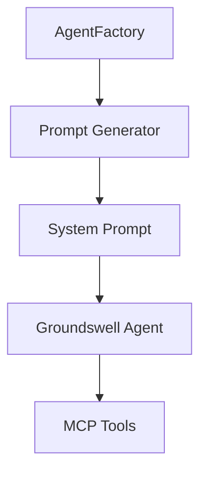

# Custom Agent Development Guide

> Comprehensive guide for creating new agent types, defining agent personas and system prompts, configuring model selection and token limits, registering custom MCP tools, and adding agents to the factory.

**Status**: Published
**Last Updated**: 2026-01-23
**Version**: 1.0.0

---

## Table of Contents

- [Overview](#overview)
- [Agent Architecture](#agent-architecture)
- [Four Built-in Agents](#four-built-in-agents)
- [System Prompt Engineering](#system-prompt-engineering)
- [Model Selection and Token Limits](#model-selection-and-token-limits)
- [MCP Tool Creation and Registration](#mcp-tool-creation-and-registration)
- [Agent Factory Extension](#agent-factory-extension)
- [Step-by-Step Guide](#step-by-step-guide)
- [Complete Example: SecurityAuditor](#complete-example-securityauditor)
- [Testing Custom Agents](#testing-custom-agents)
- [See Also](#see-also)

---

## Overview

The PRP Pipeline's multi-agent architecture is built on the Groundswell framework, which provides a factory pattern for creating specialized AI agents with distinct personas. Each agent is optimized for specific tasks in the software development lifecycle: PRD analysis, PRP generation, code implementation, and quality assurance.

This guide provides comprehensive documentation for creating custom agent types, extending the agent factory, and integrating domain-specific tools.

### Why Create Custom Agents?

Custom agents enable:

- **Domain Specialization**: Agents with deep expertise in specific domains (e.g., security, performance optimization)
- **Workflow Integration**: Agents designed for specific stages of your development process
- **Tool Customization**: Agents with specialized MCP tools for their domain
- **Persona Optimization**: Tailored system prompts for consistent behavior

### Use Cases

- **SecurityAuditor**: Automated vulnerability scanning and security report generation
- **PerformanceOptimizer**: Code performance analysis and optimization recommendations
- **DocumentationGenerator**: Automated documentation from code comments and types
- **TestGenerator**: Unit test generation from implementation code

---

## Agent Architecture

The PRP Pipeline uses a four-tier architecture for agent creation:



### Groundswell Framework Integration

The agent architecture is built on the **Groundswell Framework**, which provides the core primitives for agent creation:

#### createAgent() API

```typescript
import { createAgent, type Agent } from 'groundswell';

const agent: Agent = createAgent({
  name: string;           // Agent identifier for logging
  system: string;         // System prompt defining agent persona
  model: string;          // Model identifier (e.g., 'GLM-4.7')
  enableCache: boolean;    // LLM response caching
  enableReflection: boolean; // Error recovery with reflection
  maxTokens: number;       // Maximum tokens in response
  mcps: MCPServer[];      // MCP tools for agent capabilities
  env: {                 // Environment variable configuration
    ANTHROPIC_API_KEY: string;
    ANTHROPIC_BASE_URL: string;
  };
});
```

#### createPrompt() for Structured Output

```typescript
import { createPrompt, type Prompt } from 'groundswell';

const prompt: Prompt<Backlog> = createPrompt({
  user: 'User prompt content',
  system: 'System prompt persona',
  responseFormat: BacklogSchema, // Ensures type-safe JSON output
  enableReflection: true, // For complex task reliability
});
```

#### MCPHandler Extension

```typescript
import { MCPHandler, type Tool, type ToolExecutor } from 'groundswell';

export class CustomMCP extends MCPHandler {
  public readonly name = 'custom';
  public readonly transport = 'inprocess' as const;
  public readonly tools = [tool1, tool2];

  constructor() {
    super();
    this.registerServer({
      name: this.name,
      transport: this.transport,
      tools: this.tools,
    });
    this.registerToolExecutor('custom', 'tool1', executor as ToolExecutor);
  }
}
```

### Agent Factory Pattern

The [`AgentFactory`](../src/agents/agent-factory.ts) provides centralized agent creation:

```typescript
// src/agents/agent-factory.ts (lines 150-176)
export function createBaseConfig(persona: AgentPersona): AgentConfig {
  const model = getModel('sonnet'); // All personas use sonnet → GLM-4.7
  const name = `${persona.charAt(0).toUpperCase() + persona.slice(1)}Agent`;

  return {
    name,
    system: `You are a ${persona} agent.`,
    model,
    enableCache: true,
    enableReflection: true,
    maxTokens: PERSONA_TOKEN_LIMITS[persona],
    env: {
      ANTHROPIC_API_KEY: process.env.ANTHROPIC_API_KEY ?? '',
      ANTHROPIC_BASE_URL: process.env.ANTHROPIC_BASE_URL ?? '',
    },
  };
}

export function createArchitectAgent(): Agent {
  const baseConfig = createBaseConfig('architect');
  const config = {
    ...baseConfig,
    system: TASK_BREAKDOWN_PROMPT,
    mcps: MCP_TOOLS,
  };
  return createAgent(config);
}
```

**PATTERN**: All agents follow this structure:

1. Base configuration from `createBaseConfig()`
2. Agent-specific system prompt
3. Shared MCP tools array
4. Groundswell `createAgent()` call

---

## Four Built-in Agents

The PRP Pipeline includes four built-in agent personas, each optimized for their role:

| Agent          | System Prompt           | Token Limit | Purpose                              |
| -------------- | ----------------------- | ----------- | ------------------------------------ |
| **Architect**  | `TASK_BREAKDOWN_PROMPT` | 8192        | PRD analysis and task breakdown      |
| **Researcher** | `PRP_BLUEPRINT_PROMPT`  | 4096        | PRP generation and context gathering |
| **Coder**      | `PRP_BUILDER_PROMPT`    | 4096        | Code implementation from PRPs        |
| **QA**         | `BUG_HUNT_PROMPT`       | 4096        | Validation and bug hunting           |

### Architect Agent

**Location**: [`src/agents/agent-factory.ts:195-204`](../src/agents/agent-factory.ts#L195-L204)

```typescript
export function createArchitectAgent(): Agent {
  const baseConfig = createBaseConfig('architect');
  const config = {
    ...baseConfig,
    system: TASK_BREAKDOWN_PROMPT,
    mcps: MCP_TOOLS,
  };
  logger.debug({ persona: 'architect', model: config.model }, 'Creating agent');
  return createAgent(config);
}
```

**Persona**: Lead Technical Architect & Project Synthesizer

**Responsibilities**:

- Analyze PRDs for technical requirements
- Decompose requirements into hierarchical task structures
- Spawn subagents for codebase research before planning
- Generate structured Backlog JSON (Phase → Milestone → Task → Subtask)

**System Prompt**: [`TASK_BREAKDOWN_PROMPT`](../PROMPTS.md#L54-L169) - LEAD TECHNICAL ARCHITECT persona

**Token Limit**: 8192 (higher limit for complex analysis tasks)

### Researcher Agent

**Location**: [`src/agents/agent-factory.ts:223-235`](../src/agents/agent-factory.ts#L223-L235)

```typescript
export function createResearcherAgent(): Agent {
  const baseConfig = createBaseConfig('researcher');
  const config = {
    ...baseConfig,
    system: PRP_BLUEPRINT_PROMPT,
    mcps: MCP_TOOLS,
  };
  logger.debug(
    { persona: 'researcher', model: config.model },
    'Creating agent'
  );
  return createAgent(config);
}
```

**Persona**: Research & Context Gatherer

**Responsibilities**:

- Analyze codebase for patterns and conventions
- Generate comprehensive PRPs with all necessary context
- Research external documentation and examples
- Store findings for use by Coder agent

**System Prompt**: [`PRP_BLUEPRINT_PROMPT`](../PROMPTS.md#L189-L638)

**Token Limit**: 4096

### Coder Agent

**Location**: [`src/agents/agent-factory.ts:254-263`](../src/agents/agent-factory.ts#L254-L263)

```typescript
export function createCoderAgent(): Agent {
  const baseConfig = createBaseConfig('coder');
  const config = {
    ...baseConfig,
    system: PRP_BUILDER_PROMPT,
    mcps: MCP_TOOLS,
  };
  logger.debug({ persona: 'coder', model: config.model }, 'Creating agent');
  return createAgent(config);
}
```

**Persona**: Implementation Expert

**Responsibilities**:

- Execute PRPs to implement features
- Follow existing codebase patterns and conventions
- Run 4-level validation gates (syntax, unit, integration, manual)
- Generate git commits for completed subtasks

**System Prompt**: [`PRP_BUILDER_PROMPT`](../PROMPTS.md#L641-L713)

**Token Limit**: 4096

### QA Agent

**Location**: [`src/agents/agent-factory.ts:282-291`](../src/agents/agent-factory.ts#L282-L291)

```typescript
export function createQAAgent(): Agent {
  const baseConfig = createBaseConfig('qa');
  const config = {
    ...baseConfig,
    system: BUG_HUNT_PROMPT,
    mcps: MCP_TOOLS,
  };
  logger.debug({ persona: 'qa', model: config.model }, 'Creating agent');
  return createAgent(config);
}
```

**Persona**: Quality Assurance Specialist

**Responsibilities**:

- Perform comprehensive end-to-end validation
- Execute creative bug hunting with adversarial mindset
- Generate structured bug reports
- Drive fix cycles for critical/major issues

**System Prompt**: [`BUG_HUNT_PROMPT`](../PROMPTS.md#L862-L980)

**Token Limit**: 4096

### Shared MCP Tools

All agents share the same MCP tool set:

```typescript
// src/agents/agent-factory.ts (lines 56-68)
const BASH_MCP = new BashMCP();
const FILESYSTEM_MCP = new FilesystemMCP();
const GIT_MCP = new GitMCP();

const MCP_TOOLS: MCPServer[] = [BASH_MCP, FILESYSTEM_MCP, GIT_MCP];
```

**Tools Available**:

- **BashMCP**: Shell command execution ([`src/tools/bash-mcp.ts`](../src/tools/bash-mcp.ts))
- **FilesystemMCP**: File I/O operations ([`src/tools/filesystem-mcp.ts`](../src/tools/filesystem-mcp.ts))
- **GitMCP**: Git operations ([`src/tools/git-mcp.ts`](../src/tools/git-mcp.ts))

---

## System Prompt Engineering

System prompts define the agent's persona, expertise, and behavioral patterns. Well-structured prompts ensure consistent, predictable agent behavior.

### Prompt Structure Components

Every system prompt should include these components:

```markdown
# PERSONA_NAME

> **ROLE:** Clear statement of who the agent is
> **CONTEXT:** What expertise and perspective the agent brings
> **GOAL:** What the agent should accomplish

## CRITICAL CONSTRAINTS

- Must-do rules and limitations
- Quality standards and output requirements

## PROCESS

- Step-by-step workflow for the agent
- Tools available and when to use them

## OUTPUT FORMAT

- Exact structure for agent responses
- Examples of valid output
```

### Prompt Creation Workflow

**STEP 1: Define in PROMPTS.md** (for source documentation)

Edit [`PROMPTS.md`](../PROMPTS.md) to add the markdown version of your system prompt. This is the source of truth for prompt content.

```markdown
# YOUR AGENT NAME

> **ROLE:** Act as...
> **CONTEXT:** You have expertise in...
> **GOAL**: Your goal is to...

## CRITICAL CONSTRAINTS

...
```

**STEP 2: Export to prompts.ts** (for TypeScript usage)

Add the constant to [`src/agents/prompts.ts`](../src/agents/prompts.ts) with the template literal string:

```typescript
/**
 * Your Agent System Prompt
 *
 * @remarks
 * Brief description of the prompt's purpose.
 *
 * Source: PROMPTS.md lines X-Y
 */
export const YOUR_AGENT_PROMPT = `
# YOUR AGENT NAME

> **ROLE:** Act as...
...
` as const;
```

**CRITICAL**: The template literal syntax (backticks) preserves exact formatting including line breaks, markdown headers, and code blocks.

**STEP 3**: Import in agent-factory.ts

```typescript
import { YOUR_AGENT_PROMPT } from './prompts.js';
```

### Persona Definition Patterns

#### Pattern 1: Role-Based Persona

Define the agent's expertise and perspective:

```markdown
> **ROLE:** Act as a Senior Security Architect with 15+ years of experience
> **CONTEXT:** You are certified in CISSP, CEH, and OSCP
> **GOAL**: Analyze code for security vulnerabilities and provide remediation guidance
```

#### Pattern 2: Constraint-Based Persona

Define explicit behavioral rules and constraints:

```markdown
## CRITICAL CONSTRAINTS

1. **BE CONSERVATIVE**: When in doubt, flag it. Better to review false positives than miss vulnerabilities.
2. **BE SPECIFIC**: Provide exact file paths, line numbers, and code snippets.
3. **BE ACTIONABLE**: Every finding must include clear remediation steps.
4. **PRIORITIZE**: Focus on findings that have actual security impact.
```

#### Pattern 3: Output Format Specification

Define exact output structure with JSON schemas:

```markdown
## OUTPUT FORMAT

**CONSTRAINT:** You MUST write the report to the file `./$OUTPUT_FILE`.

Use this JSON structure:
\`\`\`json
{
"metadata": { ... },
"findings": [ ... ]
}
\`\`\`
```

#### Pattern 4: Tool Usage Instructions

Specify which MCP tools the agent should use:

```markdown
## TOOL USAGE

1. **USE SECURITY_SCANNER_MCP TOOL** to scan the codebase
   - Scan for hardcoded secrets (API keys, passwords, tokens)
   - Detect SQL injection patterns
   - Find XSS vulnerabilities

2. **USE FILESYSTEM_MCP** to read file contents for analysis
```

### Prompt Generator Pattern

For agents that need dynamic context injection, create a prompt generator module:

```typescript
// src/agents/prompts/custom-prompt.ts
import { createPrompt, type Prompt } from 'groundswell';
import { YourAgentSchema } from '../../core/models.js';
import { YOUR_AGENT_PROMPT } from '../prompts.js';

export function createCustomAgentPrompt(
  context: CustomContext
): Prompt<YourResult> {
  const userPrompt = buildUserPrompt(context);

  return createPrompt({
    user: userPrompt,
    system: YOUR_AGENT_PROMPT,
    responseFormat: YourAgentSchema,
    enableReflection: true,
  });
}
```

**Example**: See [`src/agents/prompts/architect-prompt.ts`](../src/agents/prompts/architect-prompt.ts) and [`src/agents/prompts/prp-blueprint-prompt.ts`](../src/agents/prompts/prp-blueprint-prompt.ts)

### Prompt Quality Checklist

- [ ] **Role Clarity**: Agent persona is clearly defined
- [ ] **Context Statement**: Expertise and perspective are explained
- [ ] **Goal Specification**: Clear statement of what the agent accomplishes
- [ ] **Constraints Section**: Critical rules and limitations are listed
- [ ] **Output Format**: Exact output structure is specified with examples
- [ ] **Tool References**: MCP tools are mentioned when relevant
- [ ] **Example-Based**: Includes examples of good/bad outputs

---

## Model Selection and Token Limits

### Model Tier System

The PRP Pipeline uses a tiered model system via `getModel()`:

```typescript
// src/config/environment.ts
export function getModel(tier: ModelTier): string {
  const MODEL_MAP: Record<ModelTier, string> = {
    opus: 'claude-opus-4-5',
    sonnet: 'claude-sonnet-4-5',
    haiku: 'claude-haiku-4-5',
  };
  return process.env[`CLAUDE_${tier.toUpperCase()}_MODEL`] ?? MODEL_MAP[tier];
}
```

**Current Configuration**: All agents use the `sonnet` tier (maps to `GLM-4.7`).

### Token Limit Guidelines

Token limits control the maximum response size from the agent. Choose based on:

1. **Task Complexity**: More complex tasks need more tokens
2. **Input Size**: Larger inputs require more output tokens
3. **Cost Constraints**: Higher limits increase API costs

#### Decision Matrix

| Agent Type        | Task Complexity | Input Size | Output Size | Recommended Max Tokens |
| ----------------- | --------------- | ---------- | ----------- | ---------------------- |
| Architect         | High            | Medium     | Large       | 8,192                  |
| Researcher        | Medium          | Large      | Medium      | 4,096                  |
| Coder             | Medium          | Medium     | Medium      | 4,096                  |
| QA                | Low-Medium      | Small      | Small       | 4,096                  |
| Custom (Security) | Medium          | Medium     | Medium      | 6,144                  |

#### PERSONA_TOKEN_LIMITS Constant

```typescript
// src/agents/agent-factory.ts (lines 118-123)
const PERSONA_TOKEN_LIMITS = {
  architect: 8192, // Complex task breakdown needs more tokens
  researcher: 4096, // Codebase research
  coder: 4096, // Code implementation
  qa: 4096, // Validation and bug hunting
} as const;
```

**Adding a Custom Agent Token Limit**:

```typescript
// Extend the AgentPersona type
export type AgentPersona =
  | 'architect'
  | 'researcher'
  | 'coder'
  | 'qa'
  | 'custom';

// Add to PERSONA_TOKEN_LIMITS
const PERSONA_TOKEN_LIMITS = {
  architect: 8192,
  researcher: 4096,
  coder: 4096,
  qa: 4096,
  custom: 6144, // Medium token limit for custom agent
} as const;
```

### Token Limit Selection Heuristics

```
Simple tasks (2,000-4,000 tokens):
- Classification, simple analysis
- Single-purpose tools
- Quick status checks

Medium tasks (4,000-8,000 tokens):
- Code generation with examples
- Multi-step analysis
- Standard reports

Complex tasks (8,000-16,000 tokens):
- Architectural design
- Multi-file refactoring
- Comprehensive reports
```

### Performance Considerations

- **Caching**: Groundswell caches responses based on prompt hash (system + user + responseFormat)
- **Cost Optimization**: Use the smallest token limit that accomplishes the task
- **Quality vs Speed**: Larger limits don't always improve quality; use task-appropriate limits

---

## MCP Tool Creation and Registration

MCP (Model Context Protocol) tools enable agents to interact with external systems. This section covers creating custom MCP tools and registering them with agents.

### MCP Tool Architecture

Each MCP tool consists of three components:

1. **Tool Schema**: JSON Schema definition for input validation
2. **Tool Executor**: Async function that implements the tool's behavior
3. **MCP Server**: Class extending MCPHandler that manages tools

### Tool Schema Definition

Tool schemas define the input interface using JSON Schema:

```typescript
const toolSchema: Tool = {
  name: 'tool_name', // Required: snake_case identifier
  description: 'Clear description of what the tool does and when to use it',
  input_schema: {
    type: 'object',
    properties: {
      requiredParam: {
        type: 'string',
        description: 'Description of what this parameter does',
      },
      optionalParam: {
        type: 'boolean',
        description: 'Description of optional parameter',
      },
    },
    required: ['requiredParam'],
  },
};
```

**Tool Schema Examples** from the codebase:

#### File Read Tool

```typescript
// src/tools/filesystem-mcp.ts (lines 163-183)
const fileReadTool: Tool = {
  name: 'file_read',
  description: 'Read file contents with optional encoding.',
  input_schema: {
    type: 'object',
    properties: {
      path: {
        type: 'string',
        description: 'File path to read',
      },
      encoding: {
        type: 'string',
        description: 'Encoding (default: utf-8)',
        enum: ['utf-8', 'utf16le', 'latin1', 'base64', 'hex'],
      },
    },
    required: ['path'],
  },
};
```

#### Bash Execute Tool

```typescript
// src/tools/bash-mcp.ts (lines 82-108)
const bashTool: Tool = {
  name: 'execute_bash',
  description:
    'Execute shell commands with optional working directory and timeout.',
  input_schema: {
    type: 'object',
    properties: {
      command: {
        type: 'string',
        description: 'The shell command to execute',
      },
      cwd: {
        type: 'string',
        description: 'Working directory (optional)',
      },
      timeout: {
        type: 'number',
        description: 'Timeout in milliseconds (default: 30000)',
        minimum: 1000,
        maximum: 300000,
      },
    },
    required: ['command'],
  },
};
```

### TypeScript Interfaces for Type Safety

Define TypeScript interfaces alongside tool schemas:

```typescript
// Input interface
interface BashToolInput {
  /** The shell command to execute */
  command: string;
  /** Working directory (optional, defaults to process.cwd()) */
  cwd?: string;
  /** Timeout in milliseconds (optional, defaults to 30000) */
  timeout?: number;
}

// Result interface
interface BashToolResult {
  /** True if command succeeded (exit code 0) */
  success: boolean;
  /** Standard output from command */
  stdout: string;
  /** Standard error from command */
  stderr: string;
  /** Exit code from process */
  exitCode: number | null;
  /** Error message if spawn failed or timed out */
  error?: string;
}
```

### Tool Executor Pattern

Tool executors follow a consistent pattern for validation and error handling:

```typescript
async function executeTool(input: ToolInput): Promise<ToolResult> {
  try {
    // 1. Validate inputs
    if (!input.requiredField) {
      return { success: false, error: 'Required field is missing' };
    }

    // 2. Perform operation
    const result = await performOperation(input);

    // 3. Return success
    return { success: true, data: result };
  } catch (error) {
    // 4. Handle errors with specific messages
    const errno = (error as NodeJS.ErrnoException).code;

    if (errno === 'ENOENT') {
      return { success: false, error: `File not found: ${input.path}` };
    }

    return {
      success: false,
      error: error instanceof Error ? error.message : String(error),
    };
  }
}
```

**Key Error Patterns**:

| Error Code | Description       | Example Message                    |
| ---------- | ----------------- | ---------------------------------- |
| `ENOENT`   | Entity not found  | `File not found: path/to/file`     |
| `EACCES`   | Permission denied | `Permission denied: path/to/file`  |
| `EISDIR`   | Is a directory    | `Path is a directory: path/to/dir` |
| `ENOTDIR`  | Not a directory   | `Not a directory: path/to/file`    |

### MCPHandler Extension Pattern

All MCP servers extend MCPHandler and register in the constructor:

```typescript
export class CustomMCP extends MCPHandler {
  // Server metadata (required for MCPServer interface)
  public readonly name = 'custom';
  public readonly transport = 'inprocess' as const;
  public readonly tools = [tool1, tool2];

  constructor() {
    super();

    // PATTERN: Register server in constructor
    this.registerServer({
      name: this.name,
      transport: this.transport,
      tools: this.tools,
    });

    // PATTERN: Register tool executors
    this.registerToolExecutor('custom', 'tool1', executor1 as ToolExecutor);
    this.registerToolExecutor('custom', 'tool2', executor2 as ToolExecutor);
  }
}
```

**Complete Example**: [`src/tools/bash-mcp.ts`](../src/tools/bash-mcp.ts) (lines 251-277)

### Multi-Tool MCP Server

Multiple tools can be registered in a single MCP server:

```typescript
// src/tools/filesystem-mcp.ts (lines 487-533)
export class FilesystemMCP extends MCPHandler {
  public readonly name = 'filesystem';
  public readonly transport = 'inprocess' as const;
  public readonly tools = [
    fileReadTool,
    fileWriteTool,
    globFilesTool,
    grepSearchTool,
  ];

  constructor() {
    super();
    this.registerServer({
      name: this.name,
      transport: this.transport,
      tools: this.tools,
    });

    this.registerToolExecutor(
      'filesystem',
      'file_read',
      readFile as ToolExecutor
    );
    this.registerToolExecutor(
      'filesystem',
      'file_write',
      writeFile as ToolExecutor
    );
    this.registerToolExecutor(
      'filesystem',
      'glob_files',
      globFiles as ToolExecutor
    );
    this.registerToolExecutor(
      'filesystem',
      'grep_search',
      grepSearch as ToolExecutor
    );
  }
}
```

**Tool Naming Convention**: Groundswell prefixes tool names with the server name:

- Tool schema name: `file_read`
- Server name: `filesystem`
- Final tool name: `filesystem__file_read`

### Security Considerations

#### Path Traversal Prevention

```typescript
// ❌ BAD: Allows path traversal
async function badReadFile(path: string) {
  return await fs.readFile(path); // ../../../etc/passwd
}

// ✅ GOOD: Resolves and validates paths
async function goodReadFile(path: string) {
  const safePath = resolve(path);

  // Validate path is within allowed directory
  if (!safePath.startsWith(normalizedBase)) {
    throw new Error('Path traversal detected');
  }

  return await fs.readFile(safePath);
}
```

#### Command Injection Prevention

```typescript
// ❌ BAD: Shell interpretation allows injection
function badExecute(command: string) {
  return exec(`git ${command}`); // command could be "; rm -rf /"
}

// ✅ GOOD: Use argument arrays with shell: false
function goodExecute(args: string[]) {
  return spawn('git', args, {
    shell: false, // Critical: no shell interpretation
  });
}
```

#### Git Argument Sanitization

```typescript
// src/tools/git-mcp.ts (lines 377-398)
async function gitAdd(input: GitAddInput): Promise<GitAddResult> {
  const files = input.files ?? ['.'];

  if (files.length === 1 && files[0] === '.') {
    await git.add('.');
  } else {
    // CRITICAL: Use '--' to prevent files starting with '-' from being flags
    await git.add(['--', ...files]);
  }

  return { success: true, stagedCount: files.length };
}
```

#### Resource Limits and Timeouts

```typescript
const DEFAULT_TIMEOUT = 30000; // 30 seconds
const MIN_TIMEOUT = 1000; // 1 second
const MAX_TIMEOUT = 300000; // 5 minutes

async function executeWithTimeout(input: ToolInput): Promise<ToolResult> {
  const timeout = Math.min(
    Math.max(input.timeout || DEFAULT_TIMEOUT, MIN_TIMEOUT),
    MAX_TIMEOUT
  );

  let timedOut = false;
  const timeoutId = setTimeout(() => {
    timedOut = true;
    child.kill('SIGTERM');
    // Force kill after grace period
    setTimeout(() => {
      if (!child.killed) {
        child.kill('SIGKILL');
      }
    }, 2000);
  }, timeout);

  // ... execute command

  if (timedOut) {
    result.error = `Command timed out after ${timeout}ms`;
  }
}
```

### Tool Registration with Agents

#### Step 1: Create MCP Instance

```typescript
// src/agents/agent-factory.ts (lines 56-58)
const CUSTOM_MCP = new CustomMCP();
```

#### Step 2: Add to MCP_TOOLS Array

```typescript
// src/agents/agent-factory.ts (lines 60-68)
const MCP_TOOLS: MCPServer[] = [
  BASH_MCP,
  FILESYSTEM_MCP,
  GIT_MCP,
  CUSTOM_MCP, // Add custom MCP
];
```

#### Step 3: Pass to Agent Configuration

```typescript
export function createCustomAgent(): Agent {
  const baseConfig = createBaseConfig('custom');
  const config = {
    ...baseConfig,
    system: CUSTOM_PROMPT,
    mcps: MCP_TOOLS, // All agents get the same tool set
  };
  return createAgent(config);
}
```

### Direct Method Access

MCP servers can expose direct methods for non-MCP usage:

```typescript
export class BashMCP extends MCPHandler {
  // ... registration code ...

  /**
   * Execute a bash command directly (non-MCP path)
   */
  async execute_bash(input: BashToolInput): Promise<BashToolResult> {
    return executeBashCommand(input);
  }
}
```

This pattern is used by PRPExecutor for validation gates.

---

## Agent Factory Extension

Adding a custom agent involves extending the agent factory with a new persona type, system prompt, and factory function.

### Step 1: Define Agent Persona Type

Add the new persona to the `AgentPersona` type:

```typescript
// src/agents/agent-factory.ts
export type AgentPersona =
  | 'architect'
  | 'researcher'
  | 'coder'
  | 'qa'
  | 'security'; // NEW: Custom agent type
```

### Step 2: Add Token Limit

Add the persona's token limit to `PERSONA_TOKEN_LIMITS`:

```typescript
// src/agents/agent-factory.ts (lines 118-123)
const PERSONA_TOKEN_LIMITS = {
  architect: 8192,
  researcher: 4096,
  coder: 4096,
  qa: 4096,
  security: 6144, // NEW: Medium token limit for security analysis
} as const;
```

**Token Limit Selection Guidelines**:

- **Simple tasks**: 2,000-4,000 tokens
- **Medium tasks**: 4,000-8,000 tokens
- **Complex tasks**: 8,000-16,000 tokens
- Add 20% buffer to estimated needs

### Step 3: Create Factory Function

Follow the existing pattern for agent creation:

````typescript
/**
 * Create a SecurityAuditor agent for security vulnerability analysis
 *
 * @remarks
 * Uses the SECURITY_AUDIT_PROMPT system prompt for comprehensive
 * security scanning including secrets, SQL injection, XSS, and
 * cryptographic vulnerabilities.
 *
 * The SecurityAuditor agent includes the SecurityScannerMCP tool
 * for pattern-based vulnerability detection.
 *
 * @returns Configured Groundswell Agent instance
 *
 * @example
 * ```ts
 * import { createSecurityAuditorAgent } from './agents/agent-factory.js';
 *
 * const auditor = createSecurityAuditorAgent();
 * const report = await auditor.prompt(securityAuditPrompt);
 * ```
 */
export function createSecurityAuditorAgent(): Agent {
  const baseConfig = createBaseConfig('security');
  const config = {
    ...baseConfig,
    system: SECURITY_AUDIT_PROMPT,
    mcps: MCP_TOOLS,
  };
  logger.debug({ persona: 'security', model: config.model }, 'Creating agent');
  return createAgent(config);
}
````

### Factory Function Location

Place new factory functions in [`src/agents/agent-factory.ts`](../src/agents/agent-factory.ts) after the existing agents (after line 291).

### Export Patterns

```typescript
// Re-export MCP tools for external use
export { MCP_TOOLS, SECURITY_SCANNER_MCP };

// Re-export types for type safety
export type { AgentPersona, AgentConfig };
```

---

## Step-by-Step Guide

Follow these seven steps to create a complete custom agent with all components.

### Step 1: Define Agent Persona and Type

**Objective**: Define where your agent fits in the development lifecycle.

**Actions**:

1. Choose a persona name (lowercase, single word)
2. Identify the agent's primary responsibility
3. Select appropriate token limit based on task complexity

**Example**:

```typescript
// Persona type
export type AgentPersona =
  | 'architect'
  | 'researcher'
  | 'coder'
  | 'qa'
  | 'security'; // NEW

// Token limit
const PERSONA_TOKEN_LIMITS = {
  architect: 8192,
  researcher: 4096,
  coder: 4096,
  qa: 4096,
  security: 6144, // NEW: Medium-high for security analysis
} as const;
```

**Gotchas**:

- Use lowercase, single-word persona names
- Token limits should be powers of 2 (2048, 4096, 8192, 16384)
- Consider input size when selecting token limits

### Step 2: Create System Prompt in PROMPTS.md

**Objective**: Define the agent's persona and behavioral patterns.

**Actions**:

1. Open [`PROMPTS.md`](../PROMPTS.md)
2. Add a new section at the end with your system prompt
3. Follow the structure: Role, Context, Goal, Constraints, Process, Output

**Template**:

```markdown
# YOUR AGENT NAME

> **ROLE:** Act as [clear role definition]
> **CONTEXT:** [expertise and perspective]
> **GOAL**: [what the agent accomplishes]

## CRITICAL CONSTRAINTS

1. [Must-do rule]
2. [Must-do rule]
3. [Must-do rule]

## PROCESS

1. [Step 1]
2. [Step 2]

## OUTPUT FORMAT

[Exact output structure specification]
```

**Best Practices**:

- Start with a clear, concise role definition
- Include specific expertise (years of experience, certifications)
- Define behavioral constraints explicitly
- Specify exact output format with examples
- Reference tools that the agent should use

**Gotcha**: This is the source of truth for your prompt. Keep it well-structured and maintain it alongside the code.

### Step 3: Export Prompt in prompts.ts

**Objective**: Make the system prompt available to TypeScript code.

**Actions**:

1. Open [`src/agents/prompts.ts`](../src/agents/prompts.ts)
2. Add the prompt constant following the existing pattern

**Template**:

```typescript
/**
 * Your Agent System Prompt
 *
 * @remarks
 * Brief description of the prompt's purpose.
 *
 * Source: PROMPTS.md lines X-Y
 */
export const YOUR_AGENT_PROMPT = `
# YOUR AGENT NAME

> **ROLE:** Act as...
> **CONTEXT:** ...
> **GOAL**: ...

## CRITICAL CONSTRAINTS
...
` as const;
```

**Gotchas**:

- Use template literal syntax (backticks) to preserve formatting
- Include JSDoc comment with source reference
- Use `as const` for type inference
- The prompt content should match PROMPTS.md exactly

### Step 4: Create Prompt Generator (Optional)

**Objective**: Enable dynamic context injection for your agent.

**When Needed**: Your agent needs runtime context (file paths, task information, etc.)

**Actions**:

1. Create a new file in `src/agents/prompts/` directory
2. Follow the pattern from [`src/agents/prompts/architect-prompt.ts`](../src/agents/prompts/architect-prompt.ts)

**Template**:

```typescript
/**
 * Custom prompt generator module
 *
 * @module agents/prompts/custom-prompt
 *
 * @remarks
 * Provides a type-safe prompt generator for the Custom Agent.
 * Uses Groundswell's createPrompt() with ResultSchema for structured output.
 */

// PATTERN: Import Groundswell prompt creation utilities
import { createPrompt, type Prompt } from 'groundswell';

// CRITICAL: Use .js extension for ES module imports
import type { YourResult } from '../../core/models.js';
import { YourResultSchema } from '../../core/models.js';

// PATTERN: Import system prompt from sibling prompts file
import { YOUR_AGENT_PROMPT } from '../prompts.js';

/**
 * Create a Custom Agent prompt with structured YourResult output
 *
 * @remarks
 * Returns a Groundswell Prompt configured with:
 * - user: The context-specific user prompt
 * - system: YOUR_AGENT_PROMPT (your agent persona)
 * - responseFormat: YourResultSchema (ensures type-safe JSON output)
 * - enableReflection: true (for complex task reliability)
 *
 * @param context - The context for agent execution
 * @returns Groundswell Prompt object configured for Custom Agent
 */
export function createCustomAgentPrompt(
  context: CustomContext
): Prompt<YourResult> {
  const userPrompt = buildUserPrompt(context);

  return createPrompt({
    user: userPrompt,
    system: YOUR_AGENT_PROMPT,
    responseFormat: YourResultSchema,
    enableReflection: true,
  });
}
```

**Gotchas**:

- Use `.js` extensions for ES module imports
- Import the system prompt constant correctly
- Use `createPrompt()` with `responseFormat` for structured output
- Enable reflection for complex tasks

### Step 5: Create MCP Tools (If Needed)

**Objective**: Provide domain-specific capabilities for your agent.

**When Needed**: Your agent needs specialized tools not available in the standard tool set.

**Actions**:

1. Create a new file in `src/tools/` directory
2. Extend `MCPHandler` and register tools
3. Follow the pattern from [`src/tools/bash-mcp.ts`](../src/tools/bash-mcp.ts)

**Template**:

```typescript
/**
 * Custom MCP Tool Module
 *
 * @module tools/custom-mcp
 *
 * @remarks
 * Provides MCP tools for custom domain operations.
 */

import { MCPHandler, type Tool, type ToolExecutor } from 'groundswell';

// ===== INPUT INTERFACES =====
interface CustomToolInput {
  /** Required input parameter */
  requiredParam: string;
  /** Optional input parameter */
  optionalParam?: string;
}

// ===== RESULT INTERFACES =====
interface CustomToolResult {
  /** True if operation succeeded */
  success: boolean;
  /** Operation result data */
  data?: unknown;
  /** Error message if operation failed */
  error?: string;
}

// ===== TOOL SCHEMAS =====
const customTool: Tool = {
  name: 'custom_tool',
  description: 'Clear description of what the tool does',
  input_schema: {
    type: 'object',
    properties: {
      requiredParam: {
        type: 'string',
        description: 'Description of required parameter',
      },
    },
    required: ['requiredParam'],
  },
};

// ===== TOOL EXECUTORS =====
async function executeCustomTool(
  input: CustomToolInput
): Promise<CustomToolResult> {
  try {
    // 1. Validate inputs
    if (!input.requiredParam) {
      return { success: false, error: 'Required parameter is missing' };
    }

    // 2. Perform operation
    const result = await performCustomOperation(input);

    // 3. Return success
    return { success: true, data: result };
  } catch (error) {
    // 4. Handle errors
    return {
      success: false,
      error: error instanceof Error ? error.message : String(error),
    };
  }
}

// ===== MCP SERVER =====
export class CustomMCP extends MCPHandler {
  public readonly name = 'custom';
  public readonly transport = 'inprocess' as const;
  public readonly tools = [customTool];

  constructor() {
    super();
    this.registerServer({
      name: this.name,
      transport: this.transport,
      tools: this.tools,
    });
    this.registerToolExecutor(
      'custom',
      'custom_tool',
      executeCustomTool as ToolExecutor
    );
  }
}

// Export types and tools
export type { CustomToolInput, CustomToolResult };
export { customTool, executeCustomTool };
```

**Gotchas**:

- Implement all required MCPServer properties (name, transport, tools)
- Register server and executors in constructor
- Use TypeScript interfaces for type safety
- Handle specific error codes for actionable error messages
- Validate inputs to prevent security issues

### Step 6: Add Agent to Factory

**Objective**: Register your agent with the agent factory.

**Actions**:

1. Open [`src/agents/agent-factory.ts`](../src/agents/agent-factory.ts)
2. Import the system prompt constant at the top
3. Import the MCP tool (if custom)
4. Create MCP singleton instance (if custom)
5. Add MCP to MCP_TOOLS array (if custom)
6. Create factory function

**Complete Example**:

```typescript
// 1. Import system prompt
import { YOUR_AGENT_PROMPT } from './prompts.js';

// 2. Import custom MCP (if needed)
import { CustomMCP } from '../tools/custom-mcp.js';

// 3. Create MCP singleton (if custom)
const CUSTOM_MCP = new CustomMCP();

// 4. Update MCP_TOOLS array
const MCP_TOOLS: MCPServer[] = [
  BASH_MCP,
  FILESYSTEM_MCP,
  GIT_MCP,
  CUSTOM_MCP, // Add custom MCP
];

// 5. Create factory function
/**
 * Create a Custom agent for [specific purpose]
 *
 * @remarks
 * Uses the YOUR_AGENT_PROMPT system prompt for [description].
 *
 * @returns Configured Groundswell Agent instance
 */
export function createCustomAgent(): Agent {
  const baseConfig = createBaseConfig('custom');
  const config = {
    ...baseConfig,
    system: YOUR_AGENT_PROMPT,
    mcps: MCP_TOOLS,
  };
  logger.debug({ persona: 'custom', model: config.model }, 'Creating agent');
  return createAgent(config);
}
```

**Gotchas**:

- Place factory functions after existing agents
- Follow naming convention: `create{Persona}Agent()`
- Include JSDoc comment with example usage
- Log agent creation for debugging

### Step 7: Use the Agent

**Objective**: Integrate your agent into code or workflows.

**Actions**:

1. Import the factory function
2. Create an agent instance
3. Create a prompt (use prompt generator if available)
4. Execute the agent and handle results

**Example**:

```typescript
import { createCustomAgent } from './agents/agent-factory.js';
import { createCustomAgentPrompt } from './agents/prompts/custom-prompt.js';

// Create agent
const agent = createCustomAgent();

// Create prompt
const prompt = createCustomAgentPrompt({
  targetDirectory: './src',
  minSeverity: 'high',
});

// Execute
const result = await agent.prompt(prompt);

// Use results
console.log(`Found ${result.data.count} issues`);
```

**Gotchas**:

- Reuse agent instances when possible (don't create new instances repeatedly)
- Handle errors appropriately (agent calls can fail)
- Validate results against schemas
- Use structured outputs for reliable parsing

---

## Complete Example: SecurityAuditor

This section provides a complete implementation of a SecurityAuditor agent following all patterns from the codebase. The SecurityAuditor analyzes code for security vulnerabilities and generates classified security reports.

### Overview

The SecurityAuditor agent demonstrates:

- Complete agent factory integration
- System prompt engineering for security persona
- MCP tool creation for security scanning
- Prompt generator for context injection
- Data model definitions with Zod schemas

### Implementation

#### 1. System Prompt (PROMPTS.md)

Add to [`PROMPTS.md`](../PROMPTS.md):

```markdown
# SECURITY AUDITOR & VULNERABILITY ANALYZER

> **ROLE:** Act as a Security Auditor and Vulnerability Analyzer.
> **CONTEXT:** You are a security specialist trained in OWASP Top 10, CWE, and secure coding practices.
> **GOAL:** Analyze code for security vulnerabilities, detect anti-patterns, and generate classified security reports.

## SECURITY ANALYSIS FRAMEWORK

### Vulnerability Categories

1. **Injection Attacks**: SQL, NoSQL, OS Command, LDAP
2. **Authentication & Authorization**: Hardcoded credentials, weak policies
3. **Cross-Site Scripting (XSS)**: Unescaped user input, unsafe innerHTML
4. **Cryptographic Issues**: Weak algorithms, hardcoded keys
5. **Configuration & Data Exposure**: Exposed sensitive data, debug information
6. **Dependencies & Supply Chain**: Outdated dependencies, untrusted sources

## SEVERITY CLASSIFICATION

- **CRITICAL** (CVSS 9.0-10.0): Remote code execution, credential exposure
- **HIGH** (CVSS 7.0-8.9): SQL injection, XSS, authentication bypass
- **MEDIUM** (CVSS 4.0-6.9): Information disclosure, weak cryptography
- **LOW** (CVSS 0.1-3.9): Best practice violations

## OUTPUT FORMAT

**CONSTRAINT:** Write security report to `./$SECURITY_REPORT_FILE`.
```

#### 2. Prompt Constant (src/agents/prompts.ts)

Add to [`src/agents/prompts.ts`](../src/agents/prompts.ts):

```typescript
/**
 * Security Audit System Prompt for SecurityAuditor Agent
 *
 * @remarks
 * The SECURITY AUDITOR & VULNERABILITY ANALYZER prompt used for
 * analyzing code for security vulnerabilities and generating
 * classified security reports.
 *
 * Source: PROMPTS.md lines X-Y
 */
export const SECURITY_AUDIT_PROMPT = `
# SECURITY AUDITOR & VULNERABILITY ANALYZER

> **ROLE:** Act as a Security Auditor and Vulnerability Analyzer.
...
[... full prompt from research/security-auditor-example.md lines 79-286 ...]
` as const;
```

#### 3. Prompt Generator (src/agents/prompts/security-audit-prompt.ts)

Create [`src/agents/prompts/security-audit-prompt.ts`](../src/agents/prompts/security-audit-prompt.ts):

```typescript
import { createPrompt, type Prompt } from 'groundswell';
import type { SecurityReport } from '../../core/models.js';
import { SecurityReportSchema } from '../../core/models.js';
import { SECURITY_AUDIT_PROMPT } from '../prompts.js';

export function createSecurityAuditPrompt(
  scanContext: SecurityScanContext
): Prompt<SecurityReport> {
  const userPrompt = buildScanPrompt(scanContext);

  return createPrompt({
    user: userPrompt,
    system: SECURITY_AUDIT_PROMPT,
    responseFormat: SecurityReportSchema,
    enableReflection: true,
  });
}
```

#### 4. Security Scanner MCP Tool (src/tools/security-scanner-mcp.ts)

Create [`src/tools/security-scanner-mcp.ts`](../src/tools/security-scanner-mcp.ts):

```typescript
import { MCPHandler, type Tool, type ToolExecutor } from 'groundswell';

interface ScanSecretsInput {
  path: string;
  filePattern?: string;
  exclude?: string[];
}

interface SecurityScanResult {
  success: boolean;
  findings?: SecurityFinding[];
  statistics?: {
    critical: number;
    high: number;
    medium: number;
    low: number;
  };
  error?: string;
}

const scanSecretsTool: Tool = {
  name: 'scan_secrets',
  description: 'Scan for hardcoded secrets, API keys, passwords, and tokens.',
  input_schema: {
    type: 'object',
    properties: {
      path: { type: 'string', description: 'Path to directory to scan' },
      filePattern: { type: 'string', description: 'File pattern (glob)' },
    },
    required: ['path'],
  },
};

async function scanSecrets(
  input: ScanSecretsInput
): Promise<SecurityScanResult> {
  // Implementation from research/security-auditor-example.md lines 1157-1178
}

export class SecurityScannerMCP extends MCPHandler {
  public readonly name = 'security';
  public readonly transport = 'inprocess' as const;
  public readonly tools = [scanSecretsTool /* ... */];

  constructor() {
    super();
    this.registerServer({
      name: this.name,
      transport: this.transport,
      tools: this.tools,
    });
    this.registerToolExecutor(
      'security',
      'scan_secrets',
      scanSecrets as ToolExecutor
    );
  }
}
```

#### 5. Data Models (src/core/models.ts)

Add to [`src/core/models.ts`](../src/core/models.ts):

```typescript
import { z } from 'zod';

export const SecurityFindingSchema = z.object({
  id: z.string().regex(/^SEC-\d{3,}$/),
  severity: z.enum(['critical', 'high', 'medium', 'low']),
  category: z.enum([
    'secrets',
    'sqli',
    'xss',
    'crypto',
    'auth',
    'config',
    'deps',
  ]),
  title: z.string().min(1),
  description: z.string().min(1),
  location: z.object({
    file: z.string(),
    line: z.number().int().positive(),
    code: z.string(),
  }),
  impact: z.string(),
  remediation: z.object({
    guidance: z.string(),
    codeExample: z.string().optional(),
    references: z.array(z.string().url()).optional(),
  }),
});

export const SecurityReportSchema = z.object({
  metadata: SecurityReportMetadataSchema,
  summary: SecurityReportSummarySchema,
  findings: z.array(SecurityFindingSchema),
  statistics: SecurityReportStatisticsSchema,
});

export type SecurityReport = z.infer<typeof SecurityReportSchema>;
```

#### 6. Agent Factory Extension (src/agents/agent-factory.ts)

Update [`src/agents/agent-factory.ts`](../src/agents/agent-factory.ts):

```typescript
// Add imports
import { SECURITY_AUDIT_PROMPT } from './prompts.js';
import { SecurityScannerMCP } from '../tools/security-scanner-mcp.js';

// Add MCP singleton
const SECURITY_SCANNER_MCP = new SecurityScannerMCP();

// Update MCP_TOOLS
const MCP_TOOLS: MCPServer[] = [
  BASH_MCP,
  FILESYSTEM_MCP,
  GIT_MCP,
  SECURITY_SCANNER_MCP,
];

// Update persona type
export type AgentPersona =
  | 'architect'
  | 'researcher'
  | 'coder'
  | 'qa'
  | 'security';

// Update token limits
const PERSONA_TOKEN_LIMITS = {
  architect: 8192,
  researcher: 4096,
  coder: 4096,
  qa: 4096,
  security: 6144,
} as const;

// Add factory function
export function createSecurityAuditorAgent(): Agent {
  const baseConfig = createBaseConfig('security');
  const config = {
    ...baseConfig,
    system: SECURITY_AUDIT_PROMPT,
    mcps: MCP_TOOLS,
  };
  logger.debug({ persona: 'security', model: config.model }, 'Creating agent');
  return createAgent(config);
}
```

### Usage Example

```typescript
import { createSecurityAuditorAgent } from './agents/agent-factory.js';
import { createSecurityAuditPrompt } from './agents/prompts/security-audit-prompt.js';

// Create agent
const auditor = createSecurityAuditorAgent();

// Create prompt
const prompt = createSecurityAuditPrompt({
  targetDirectory: './src',
  filePatterns: ['**/*.ts', '**/*.js'],
  minSeverity: 'high',
});

// Execute
const report = await auditor.prompt(prompt);

// Access results
console.log(`Found ${report.metadata.totalFindings} findings`);
console.log(`Critical: ${report.metadata.criticalCount}`);
```

---

## Testing Custom Agents

Testing custom agents ensures they work correctly and produce reliable results.

### Unit Testing Agent Factory

Test agent configuration and creation:

```typescript
// tests/unit/agents/agent-factory.test.ts
import { describe, expect, it, beforeEach, afterEach, vi } from 'vitest';
import {
  createBaseConfig,
  createSecurityAuditorAgent,
  type AgentPersona,
} from '../../../src/agents/agent-factory.js';

describe('agents/agent-factory', () => {
  beforeEach(() => {
    vi.stubEnv('ANTHROPIC_AUTH_TOKEN', 'test-token');
    vi.stubEnv('ANTHROPIC_BASE_URL', 'https://api.z.ai/api/anthropic');
  });

  afterEach(() => {
    vi.unstubAllEnvs();
  });

  describe('createBaseConfig', () => {
    it.each([
      'architect',
      'researcher',
      'coder',
      'qa',
      'security',
    ] as AgentPersona[])(
      'should return valid config for %s persona',
      persona => {
        const config = createBaseConfig(persona);
        expect(config).toHaveProperty('name');
        expect(config).toHaveProperty('system');
        expect(config).toHaveProperty('model');
        expect(config).toHaveProperty('maxTokens');
      }
    );
  });

  describe('createSecurityAuditorAgent', () => {
    it('should create agent with security persona', () => {
      const agent = createSecurityAuditorAgent();
      expect(agent).toBeDefined();
    });

    it('should use correct token limit', () => {
      // Access through agent config
      const config = createBaseConfig('security');
      expect(config.maxTokens).toBe(6144);
    });
  });
});
```

### Integration Testing Agent Workflows

Test agent execution with real prompts:

```typescript
// tests/integration/security-auditor-agent.test.ts
import { describe, expect, it, beforeAll } from 'vitest';
import { createSecurityAuditorAgent } from '../../src/agents/agent-factory.js';
import { createSecurityAuditPrompt } from '../../src/agents/prompts/security-audit-prompt.js';

describe('SecurityAuditor Agent Integration', () => {
  let auditorAgent: Agent;

  beforeAll(() => {
    auditorAgent = createSecurityAuditorAgent();
  });

  it('should generate security report', async () => {
    const prompt = createSecurityAuditPrompt({
      targetDirectory: './test/fixtures',
      scanTypes: ['secrets'],
      minSeverity: 'high',
    });

    const report = await auditorAgent.prompt(prompt);

    expect(report).toBeDefined();
    expect(report.metadata).toBeDefined();
    expect(report.findings).toBeInstanceOf(Array);
  });
});
```

### Testing MCP Tools

Test MCP tool functionality independently:

```typescript
// tests/unit/tools/security-scanner-mcp.test.ts
import { SecurityScannerMCP } from '../../src/tools/security-scanner-mcp.js';

describe('SecurityScannerMCP', () => {
  const scanner = new SecurityScannerMCP();

  it('should detect hardcoded passwords', async () => {
    const result = await scanner.scan_secrets({
      path: './test/fixtures/secure-code.ts',
    });

    expect(result.success).toBe(true);
    expect(result.findings).toBeDefined();
    expect(result.findings?.some(f => f.category === 'secrets')).toBe(true);
  });

  it('should respect minimum severity filter', async () => {
    const result = await scanner.comprehensive_security_scan({
      path: './src',
      minSeverity: 'high',
    });

    expect(
      result.findings?.every(f => ['critical', 'high'].includes(f.severity))
    ).toBe(true);
  });
});
```

---

## See Also

### Project Documentation

- **[ARCHITECTURE.md](./ARCHITECTURE.md)** - Multi-agent architecture overview
- **[PROMPT_ENGINEERING.md](./PROMPT_ENGINEERING.md)** - Agent prompt engineering guide
- **[WORKFLOWS.md](./WORKFLOWS.md)** - Pipeline workflow documentation
- **[CLI_REFERENCE.md](./CLI_REFERENCE.md)** - Command-line interface documentation

### System Prompts

- **[PROMPTS.md](../PROMPTS.md)** - System prompts, PRP concept definition, and agent personas

### Source Code

- **[src/agents/agent-factory.ts](../src/agents/agent-factory.ts)** - Agent factory with all four personas
- **[src/agents/prompts.ts](../src/agents/prompts.ts)** - System prompt constants
- **[src/agents/prompts/architect-prompt.ts](../src/agents/prompts/architect-prompt.ts)** - Architect prompt generator
- **[src/agents/prompts/prp-blueprint-prompt.ts](../src/agents/prompts/prp-blueprint-prompt.ts)** - Researcher prompt generator
- **[src/tools/bash-mcp.ts](../src/tools/bash-mcp.ts)** - Bash execution tool example
- **[src/tools/filesystem-mcp.ts](../src/tools/filesystem-mcp.ts)** - Multi-tool MCP server example
- **[src/tools/git-mcp.ts](../src/tools/git-mcp.ts)** - Git operations tool example

### Research Documents

- \*\*[plan/003_b3d3efdaf0ed/P2M2T2S1/research/agent-development-best-practices.md](../plan/003_b3d3efdaf0ed/P2M2T2S1/research/agent-development-best-practices.md) - Agent development best practices
- \*\*[plan/003_b3d3efdaf0ed/P2M2T2S1/research/mcp-tool-development.md](../plan/003_b3d3efdaf0ed/P2M2T2S1/research/mcp-tool-development.md) - MCP tool development guide
- \*\*[plan/003_b3d3efdaf0ed/P2M2T2S1/research/security-auditor-example.md](../plan/003_b3d3efdaf0ed/P2M2T2S1/research/security-auditor-example.md) - Complete SecurityAuditor implementation

### External Resources

- [Groundswell Framework](https://github.com/anthropics/groundswell) - Agentic workflow primitives
- [Anthropic Claude Documentation](https://docs.anthropic.com/) - Official API documentation
- [Model Context Protocol](https://modelcontextprotocol.io/) - MCP specification

---

**Document Version**: 1.0.0
**Last Updated**: 2026-01-23
**Maintainer**: PRP Pipeline Team
