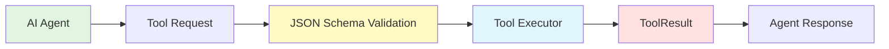

# Custom MCP Tool Development Guide

> Comprehensive guide to creating custom Model Context Protocol (MCP) tools for the PRP Pipeline, including protocol basics, Groundswell MCPHandler integration, tool schema definition, executor patterns, error handling, agent registration, and a complete DockerMCP example.

**Status**: Published
**Last Updated**: 2026-01-23
**Version**: 1.0.0

## Table of Contents

- [Overview](#overview)
- [MCP Protocol Basics](#mcp-protocol-basics)
- [Groundswell MCPHandler Integration](#groundswell-mcphandler-integration)
- [Tool Schema Definition](#tool-schema-definition)
- [Tool Executor Implementation](#tool-executor-implementation)
- [Error Handling and Return Values](#error-handling-and-return-values)
- [Tool Registration with Agents](#tool-registration-with-agents)
- [Step-by-Step Guide](#step-by-step-guide)
- [Complete Example: DockerMCP](#complete-example-dockermcp)
- [Testing Custom Tools](#testing-custom-tools)
- [See Also](#see-also)

---

## Overview

This guide explains how to create custom MCP (Model Context Protocol) tools for use with the PRP Pipeline's AI agents. MCP tools provide structured interfaces for LLM agents to interact with external systems like file systems, version control, databases, and APIs.

**What You'll Learn:**

- What MCP is and how it works
- How to implement the MCPServer interface using Groundswell's MCPHandler
- How to define tool schemas with JSON Schema
- How to write tool executors with proper error handling
- How to register tools with Groundswell agents
- Complete DockerMCP example with 5 working tools

**Prerequisites:**

- TypeScript/JavaScript knowledge
- Understanding of async/await patterns
- Familiarity with Node.js APIs (fs, child_process)
- Basic knowledge of JSON Schema

---

## MCP Protocol Basics

### What is MCP?

The **Model Context Protocol (MCP)** is an open protocol that standardizes how AI assistants interact with external tools and resources. It provides:

1. **Tool Definitions**: Structured schemas for callable functions
2. **Input Validation**: JSON Schema-based parameter validation
3. **Execution Patterns**: Consistent request/response flow
4. **Resource Discovery**: Agents can discover available capabilities

### MCP Components

MCP consists of three main components:

| Component     | Description                             | Example                                   |
| ------------- | --------------------------------------- | ----------------------------------------- |
| **Tools**     | Callable functions that perform actions | `execute_bash`, `file_read`, `git_status` |
| **Resources** | Data sources that can be read           | Files, APIs, database connections         |
| **Prompts**   | Reusable prompt templates               | System prompts, task descriptions         |

**CRITICAL**: This codebase focuses on **Tools** - callable functions that agents can invoke.

### Tool Execution Flow



**Flow Description:**

1. Agent calls tool with input parameters
2. MCP validates input against JSON Schema
3. Tool executor receives validated input
4. Executor performs operation (with error handling)
5. Executor returns structured ToolResult
6. Agent receives result and continues

### JSON Schema for Input Validation

All MCP tools use **JSON Schema** to define their input parameters:

```typescript
const toolSchema: Tool = {
  name: 'file_read',
  description: 'Read file contents with optional encoding',
  input_schema: {
    type: 'object',
    properties: {
      path: { type: 'string', description: 'File path to read' },
      encoding: { type: 'string', description: 'Encoding (default: utf-8)' },
    },
    required: ['path'],
  },
};
```

**Benefits of JSON Schema:**

- **Type Safety**: Ensures correct parameter types
- **Validation**: Catches invalid inputs before execution
- **Documentation**: Self-documenting interface
- **Standard**: Widely-supported specification

---

## Groundswell MCPHandler Integration

### MCPHandler vs FastMCP

**IMPORTANT**: This codebase uses **Groundswell's custom `MCPHandler`**, NOT the standard FastMCP library.

```typescript
// CORRECT: Import from groundswell
import { MCPHandler, type Tool, type ToolExecutor } from 'groundswell';

// INCORRECT: Do NOT use FastMCP
// import { FastMCP } from 'fastmcp'; // ❌ Wrong library
```

### Key Differences

| Feature          | Groundswell MCPHandler          | Standard FastMCP                 |
| ---------------- | ------------------------------- | -------------------------------- |
| **Registration** | Constructor-based               | Decorator-based                  |
| **Transport**    | Primarily 'inprocess'           | Multiple transport types         |
| **Tool Naming**  | Automatic `server__tool` prefix | Manual naming                    |
| **Type Imports** | From 'groundswell' package      | From '@modelcontextprotocol/sdk' |

### MCPHandler Base Class

All MCP servers extend `MCPHandler`:

```typescript
import { MCPHandler, type Tool, type ToolExecutor } from 'groundswell';

export class CustomMCP extends MCPHandler {
  // Server metadata (required for MCPServer interface)
  public readonly name = 'custom';
  public readonly transport = 'inprocess' as const;
  public readonly tools = [tool1, tool2];

  constructor() {
    super();

    // Register server in constructor
    this.registerServer({
      name: this.name,
      transport: this.transport,
      tools: this.tools,
    });

    // Register tool executors
    this.registerToolExecutor('custom', 'tool1', executeTool1 as ToolExecutor);
    this.registerToolExecutor('custom', 'tool2', executeTool2 as ToolExecutor);
  }
}
```

### MCPServer Interface

The `MCPServer` interface requires three properties:

```typescript
interface MCPServer {
  /** Server identifier (used in tool naming) */
  name: string;

  /** Communication transport type */
  transport: 'inprocess' | 'stdio' | 'http';

  /** Array of tool schemas provided by this server */
  tools: Tool[];
}
```

**Transport Types:**

- **`'inprocess'`**: Local execution in same process (used in this codebase)
- **`'stdio'`**: Communication via standard input/output
- **`'http'`**: Communication via HTTP endpoints

**PATTERN**: Always use `'inprocess' as const` for local MCP tools.

### Tool Naming Convention

Groundswell automatically prefixes tool names with the server name:

```
Tool schema name: 'file_read'
Server name: 'filesystem'
Final tool name: 'filesystem__file_read'
```

**Examples:**

- `bash__execute_bash` - Bash command execution
- `filesystem__file_read` - File reading
- `filesystem__file_write` - File writing
- `git__git_status` - Git status
- `git__git_commit` - Git commit

---

## Tool Schema Definition

### Schema Structure

Tool schemas use the `Tool` type from Groundswell:

```typescript
interface Tool {
  /** Tool name in snake_case */
  name: string;

  /** Clear description of what the tool does */
  description: string;

  /** JSON Schema for input validation */
  input_schema: {
    type: 'object';
    properties: Record<
      string,
      {
        type: string;
        description?: string;
        // ... additional JSON Schema keywords
      }
    >;
    required: string[];
  };
}
```

### JSON Schema Type Examples

#### String Properties

```typescript
{
  type: 'string',
  description: 'File path to read',
  minLength: 1,
  maxLength: 1000,
  pattern: '^[\\w\\-./]+$',
  enum: ['utf-8', 'base64', 'hex']
}
```

#### Number Properties

```typescript
{
  type: 'number',
  description: 'Timeout in milliseconds',
  minimum: 1000,
  maximum: 300000,
  default: 30000
}
```

#### Boolean Properties

```typescript
{
  type: 'boolean',
  description: 'Create directories if needed',
  default: false
}
```

#### Array Properties

```typescript
{
  type: 'array',
  description: 'Files to stage',
  items: {
    type: 'string'
  },
  minItems: 1,
  maxItems: 100,
  uniqueItems: true
}
```

### Example: Bash Tool Schema

```typescript
// File: /home/dustin/projects/hacky-hack/src/tools/bash-mcp.ts

const bashTool: Tool = {
  name: 'execute_bash',
  description:
    'Execute shell commands with optional working directory and timeout. ' +
    'Returns stdout, stderr, exit code, and success status. ' +
    'Commands are executed safely using spawn() without shell interpretation.',
  input_schema: {
    type: 'object',
    properties: {
      command: {
        type: 'string',
        description: 'The shell command to execute',
      },
      cwd: {
        type: 'string',
        description: 'Working directory for command execution (optional)',
      },
      timeout: {
        type: 'number',
        description: 'Timeout in milliseconds (default: 30000)',
        minimum: 1000,
        maximum: 300000,
      },
    },
    required: ['command'],
  },
};
```

### Example: File Read Tool Schema

```typescript
// File: /home/dustin/projects/hacky-hack/src/tools/filesystem-mcp.ts

const fileReadTool: Tool = {
  name: 'file_read',
  description:
    'Read file contents with optional encoding. ' +
    'Returns file content as string or error message.',
  input_schema: {
    type: 'object',
    properties: {
      path: {
        type: 'string',
        description: 'File path to read',
      },
      encoding: {
        type: 'string',
        description: 'Encoding (default: utf-8)',
        enum: ['utf-8', 'utf16le', 'latin1', 'base64', 'hex'],
      },
    },
    required: ['path'],
  },
};
```

### Schema Best Practices

1. **Use snake_case for tool names**: `file_read`, not `fileRead`
2. **Write clear descriptions**: Explain what the tool does and when to use it
3. **Validate constraints**: Use `minimum`, `maximum`, `enum` for limits
4. **Make parameters optional when sensible**: Use `default` values
5. **Document all properties**: Every property needs a `description`

---

## Tool Executor Implementation

### ToolExecutor Type

Tool executors use the `ToolExecutor` type from Groundswell:

```typescript
type ToolExecutor = (input: unknown) => Promise<ToolResult>;
```

**Key Points:**

- Input is typed as `unknown` (validated by JSON Schema before calling)
- Returns a Promise that resolves to `ToolResult`
- Must be cast to `ToolExecutor` when registering

### Executor Pattern

```typescript
async function executeTool(input: ToolInput): Promise<ToolResult> {
  try {
    // 1. Validate inputs (early validation for better UX)
    if (!input.requiredParam) {
      return {
        success: false,
        error: 'Required parameter missing',
      };
    }

    // 2. Perform operation
    const result = await performOperation(input);

    // 3. Return success
    return {
      success: true,
      ...result,
    };
  } catch (error) {
    // 4. Handle errors
    return {
      success: false,
      error: error instanceof Error ? error.message : String(error),
    };
  }
}
```

### Example: File Read Executor

```typescript
// File: /home/dustin/projects/hacky-hack/src/tools/filesystem-mcp.ts

async function readFile(input: FileReadInput): Promise<FileReadResult> {
  const { path, encoding = DEFAULT_ENCODING } = input;

  try {
    // PATTERN: Validate and normalize path
    const safePath = resolve(path);

    // PATTERN: Read file with encoding
    const content = await fs.readFile(safePath, { encoding });

    return { success: true, content };
  } catch (error) {
    const errno = (error as NodeJS.ErrnoException).code;

    // PATTERN: Handle specific error codes
    if (errno === 'ENOENT') {
      return { success: false, error: `File not found: ${path}` };
    }
    if (errno === 'EACCES') {
      return { success: false, error: `Permission denied: ${path}` };
    }
    if (errno === 'EISDIR') {
      return { success: false, error: `Path is a directory: ${path}` };
    }

    return {
      success: false,
      error: error instanceof Error ? error.message : String(error),
    };
  }
}
```

### Example: Bash Command Executor

```typescript
// File: /home/dustin/projects/hacky-hack/src/tools/bash-mcp.ts

async function executeBashCommand(
  input: BashToolInput
): Promise<BashToolResult> {
  const { command, cwd, timeout = DEFAULT_TIMEOUT } = input;

  // PATTERN: Validate working directory exists
  const workingDir =
    typeof cwd === 'string'
      ? (() => {
          const absoluteCwd = resolve(cwd);
          if (!existsSync(absoluteCwd)) {
            throw new Error(`Working directory does not exist: ${absoluteCwd}`);
          }
          return realpathSync(absoluteCwd);
        })()
      : undefined;

  // PATTERN: Parse command into executable and arguments
  const args = command.split(' ');
  const executable = args[0] ?? '';
  const commandArgs = args.slice(1);

  return new Promise(resolve => {
    let stdout = '';
    let stderr = '';

    // CRITICAL: Use spawn with shell: false to prevent injection
    const child = spawn(executable, commandArgs, {
      cwd: workingDir,
      stdio: ['ignore', 'pipe', 'pipe'],
      shell: false, // SECURITY: Critical for preventing command injection
    });

    // PATTERN: Set up timeout handler
    const timeoutId = setTimeout(() => {
      child.kill('SIGTERM');
      setTimeout(() => {
        if (!child.killed) {
          child.kill('SIGKILL');
        }
      }, 2000);
    }, timeout);

    // PATTERN: Capture stdout and stderr
    if (child.stdout) {
      child.stdout.on('data', (data: Buffer) => {
        stdout += data.toString();
      });
    }

    if (child.stderr) {
      child.stderr.on('data', (data: Buffer) => {
        stderr += data.toString();
      });
    }

    // PATTERN: Handle process completion
    child.on('close', exitCode => {
      clearTimeout(timeoutId);

      const result: BashToolResult = {
        success: exitCode === 0,
        stdout,
        stderr,
        exitCode,
      };

      if (exitCode !== 0) {
        result.error = `Command failed with exit code ${exitCode}`;
      }

      resolve(result);
    });

    // PATTERN: Handle spawn errors
    child.on('error', (error: Error) => {
      clearTimeout(timeoutId);
      resolve({
        success: false,
        stdout,
        stderr,
        exitCode: null,
        error: error.message,
      });
    });
  });
}
```

### External Dependency Handling

Tool executors often interact with external Node.js APIs:

```typescript
// File system operations
import { promises as fs } from 'node:fs';
import { resolve } from 'node:path';

// Child process execution
import { spawn } from 'node:child_process';

// Git operations
import { simpleGit } from 'simple-git';

// Pattern matching
import fg from 'fast-glob';
```

**Best Practices:**

1. Use `promises` API for async fs operations
2. Use `spawn()` with `shell: false` for command execution
3. Handle specific error codes from Node.js APIs
4. Validate paths before operations

---

## Error Handling and Return Values

### Standard Result Structure

All MCP tools should return structured results:

```typescript
interface ToolResult {
  /** True if operation succeeded */
  success: boolean;

  /** Error message if operation failed */
  error?: string;

  /** Additional result-specific properties */
  [key: string]: unknown;
}
```

### Error Handling Patterns

#### Pattern 1: Try-Catch with Error Code Handling

```typescript
async function readFile(input: FileReadInput): Promise<FileReadResult> {
  try {
    const safePath = resolve(input.path);
    const content = await fs.readFile(safePath, {
      encoding: input.encoding || 'utf-8',
    });
    return { success: true, content };
  } catch (error) {
    const errno = (error as NodeJS.ErrnoException).code;

    // Handle specific error codes
    if (errno === 'ENOENT') {
      return { success: false, error: `File not found: ${input.path}` };
    }
    if (errno === 'EACCES') {
      return { success: false, error: `Permission denied: ${input.path}` };
    }
    if (errno === 'EISDIR') {
      return { success: false, error: `Path is a directory: ${input.path}` };
    }

    // Generic error fallback
    return {
      success: false,
      error: error instanceof Error ? error.message : String(error),
    };
  }
}
```

#### Pattern 2: Early Validation with Structured Errors

```typescript
async function gitCommit(input: GitCommitInput): Promise<GitCommitResult> {
  // Validate message before path validation (better UX)
  if (!input.message || input.message.trim() === '') {
    return {
      success: false,
      error: 'Commit message is required and cannot be empty',
    };
  }

  try {
    const safePath = await validateRepositoryPath(input.path);
    const git = simpleGit(safePath);

    const result = await git.commit(input.message);
    return {
      success: true,
      commitHash: result.commit ?? undefined,
    };
  } catch (error) {
    // Handle specific git errors
    const msg = error instanceof Error ? error.message : String(error);
    if (msg.includes('nothing to commit')) {
      return {
        success: false,
        error:
          'No changes staged for commit. Use git_add to stage files first.',
      };
    }
    if (msg.includes('merge conflict')) {
      return {
        success: false,
        error: 'Cannot commit with unresolved merge conflicts',
      };
    }
    return { success: false, error: msg };
  }
}
```

### Common Error Codes

| Error Code | Description       | Example Usage                    |
| ---------- | ----------------- | -------------------------------- |
| `ENOENT`   | Entity not found  | File or directory does not exist |
| `EACCES`   | Permission denied | Insufficient permissions         |
| `EISDIR`   | Is a directory    | Path is directory, not file      |
| `ENOTDIR`  | Not a directory   | Path component not a directory   |
| `EEXIST`   | File exists       | Directory/file already exists    |
| `EINVAL`   | Invalid argument  | Invalid input parameter          |

**GOTCHA**: Access error codes via `(error as NodeJS.ErrnoException).code`

### Error Message Best Practices

```typescript
// ❌ BAD: Vague error messages
return { success: false, error: 'Operation failed' };
return { success: false, error: 'Error occurred' };

// ✅ GOOD: Specific, actionable error messages
return { success: false, error: `File not found: ${path}` };
return {
  success: false,
  error: `Permission denied: ${path}. Check file permissions.`,
};
return {
  success: false,
  error: `Invalid timeout: ${timeout}. Must be between 1000-300000ms.`,
};
return {
  success: false,
  error: `Not a git repository: ${repoPath}. Initialize with 'git init'.`,
};
```

**Good Error Messages Should:**

1. **Be specific**: Identify exactly what went wrong
2. **Provide context**: Include the relevant value/path
3. **Suggest action**: Tell user how to fix it
4. **Be concise**: One line is usually enough

---

## Tool Registration with Agents

### MCP Server Class Pattern

```typescript
import { MCPHandler, type Tool, type ToolExecutor } from 'groundswell';

export class CustomMCP extends MCPHandler {
  public readonly name = 'custom';
  public readonly transport = 'inprocess' as const;
  public readonly tools = [tool1, tool2, tool3];

  constructor() {
    super();

    // PATTERN: Register server in constructor
    this.registerServer({
      name: this.name,
      transport: this.transport,
      tools: this.tools,
    });

    // PATTERN: Register tool executors
    this.registerToolExecutor('custom', 'tool1', executeTool1 as ToolExecutor);
    this.registerToolExecutor('custom', 'tool2', executeTool2 as ToolExecutor);
    this.registerToolExecutor('custom', 'tool3', executeTool3 as ToolExecutor);
  }
}
```

### Agent Factory Integration

```typescript
// File: /home/dustin/projects/hacky-hack/src/agents/agent-factory.ts

// Import MCP servers
import { BashMCP } from '../tools/bash-mcp.js';
import { FilesystemMCP } from '../tools/filesystem-mcp.js';
import { GitMCP } from '../tools/git-mcp.js';
import { CustomMCP } from '../tools/custom-mcp.js'; // Your custom tool

// Singleton MCP server instances
const BASH_MCP = new BashMCP();
const FILESYSTEM_MCP = new FilesystemMCP();
const GIT_MCP = new GitMCP();
const CUSTOM_MCP = new CustomMCP(); // Your custom instance

// Combined array of all MCP tools for agent integration
const MCP_TOOLS: MCPServer[] = [
  BASH_MCP,
  FILESYSTEM_MCP,
  GIT_MCP,
  CUSTOM_MCP, // Add your tool here
];

export function createCoderAgent(): Agent {
  const baseConfig = createBaseConfig('coder');
  const config = {
    ...baseConfig,
    system: PRP_BUILDER_PROMPT,
    mcps: MCP_TOOLS, // Inject MCP servers
  };
  return createAgent(config);
}
```

**Key Points:**

- **Singleton Pattern**: Create one instance of each MCP server
- **Shared Array**: All agents share the same `MCP_TOOLS` array
- **Constructor Registration**: Tools register themselves in constructor

### Tool Naming Convention Explained

Groundswell automatically prefixes tool names with the server name:

```
Tool schema:  name = 'file_read'
Server:       name = 'filesystem'
Final tool:   'filesystem__file_read'
```

**This happens automatically** - you don't need to manually prefix names.

### Complete FilesystemMCP Example

```typescript
// File: /home/dustin/projects/hacky-hack/src/tools/filesystem-mcp.ts

export class FilesystemMCP extends MCPHandler {
  public readonly name = 'filesystem';
  public readonly transport = 'inprocess' as const;
  public readonly tools = [
    fileReadTool,
    fileWriteTool,
    globFilesTool,
    grepSearchTool,
  ];

  constructor() {
    super();

    // Register server
    this.registerServer({
      name: this.name,
      transport: this.transport,
      tools: this.tools,
    });

    // Register tool executors
    this.registerToolExecutor(
      'filesystem',
      'file_read',
      readFile as ToolExecutor
    );
    this.registerToolExecutor(
      'filesystem',
      'file_write',
      writeFile as ToolExecutor
    );
    this.registerToolExecutor(
      'filesystem',
      'glob_files',
      globFiles as ToolExecutor
    );
    this.registerToolExecutor(
      'filesystem',
      'grep_search',
      grepSearch as ToolExecutor
    );
  }
}
```

**Result**: Tools are accessible as:

- `filesystem__file_read`
- `filesystem__file_write`
- `filesystem__glob_files`
- `filesystem__grep_search`

---

## Step-by-Step Guide

Follow these six steps to create a custom MCP tool:

### Step 1: Define Input and Result Interfaces

```typescript
// src/tools/database-mcp.ts

/**
 * Input schema for database_query tool
 */
interface DatabaseQueryInput {
  /** Path to SQLite database file */
  databasePath: string;
  /** SQL query to execute (SELECT only) */
  query: string;
  /** Query parameters for prepared statements */
  params?: unknown[];
}

/**
 * Result from database_query operation
 */
interface DatabaseQueryResult {
  /** True if query executed successfully */
  success: boolean;
  /** Query result rows */
  rows?: unknown[];
  /** Number of rows affected (for INSERT/UPDATE) */
  changes?: number;
  /** Error message if operation failed */
  error?: string;
}
```

**Best Practices:**

- Use TypeScript interfaces for type safety
- Document each property with JSDoc comments
- Mark optional properties with `?`
- Include `success: boolean` in result interfaces

### Step 2: Create Tool Schema with JSON Schema

```typescript
const databaseQueryTool: Tool = {
  name: 'database_query',
  description:
    'Execute SQL query on SQLite database. ' +
    'Only SELECT queries are allowed for security. ' +
    'Returns query results as array of rows.',
  input_schema: {
    type: 'object',
    properties: {
      databasePath: {
        type: 'string',
        description: 'Path to SQLite database file',
      },
      query: {
        type: 'string',
        description: 'SQL query to execute (SELECT only)',
      },
      params: {
        type: 'array',
        description: 'Query parameters for prepared statements',
        items: {},
      },
    },
    required: ['databasePath', 'query'],
  },
};
```

**Best Practices:**

- Use snake_case for tool names
- Write comprehensive descriptions
- Use `required` array for mandatory parameters
- Include validation constraints (min, max, enum)

### Step 3: Implement Tool Executor Function

```typescript
import Database from 'better-sqlite3';

async function databaseQuery(
  input: DatabaseQueryInput
): Promise<DatabaseQueryResult> {
  try {
    // Validate database path exists
    const safePath = resolve(input.databasePath);
    if (!existsSync(safePath)) {
      return {
        success: false,
        error: `Database not found: ${input.databasePath}`,
      };
    }

    // SECURITY: Only allow SELECT queries
    const trimmedQuery = input.query.trim().toUpperCase();
    if (!trimmedQuery.startsWith('SELECT')) {
      return {
        success: false,
        error: 'Only SELECT queries are allowed',
      };
    }

    // Open database in read-only mode
    const db = new Database(safePath, { readonly: true });
    const stmt = db.prepare(input.query);

    // Execute query with parameters
    let rows: unknown[];
    if (input.params && input.params.length > 0) {
      rows = stmt.all(...input.params);
    } else {
      rows = stmt.all();
    }

    db.close();

    return { success: true, rows };
  } catch (error) {
    return {
      success: false,
      error: error instanceof Error ? error.message : String(error),
    };
  }
}
```

**Best Practices:**

- Validate inputs before processing
- Handle specific error codes
- Use try-catch for error handling
- Close resources (database connections, file handles)
- Return structured results

### Step 4: Create MCP Server Class

```typescript
export class DatabaseMCP extends MCPHandler {
  public readonly name = 'database';
  public readonly transport = 'inprocess' as const;
  public readonly tools = [databaseQueryTool];

  constructor() {
    super();

    // Register server
    this.registerServer({
      name: this.name,
      transport: this.transport,
      tools: this.tools,
    });

    // Register tool executor
    this.registerToolExecutor(
      'database',
      'database_query',
      databaseQuery as ToolExecutor
    );
  }
}
```

**Best Practices:**

- Extend `MCPHandler`
- Set `transport = 'inprocess' as const`
- Register in constructor
- Cast executor to `ToolExecutor`

### Step 5: Register with Agent Factory

```typescript
// File: src/agents/agent-factory.ts

import { DatabaseMCP } from '../tools/database-mcp.js';

const DATABASE_MCP = new DatabaseMCP();

const MCP_TOOLS: MCPServer[] = [
  BASH_MCP,
  FILESYSTEM_MCP,
  GIT_MCP,
  DATABASE_MCP, // Add your custom tool
];
```

**Best Practices:**

- Use singleton pattern (one instance)
- Import with `.js` extension (ES modules)
- Add to `MCP_TOOLS` array

### Step 6: Export for Testing

```typescript
// Export types for external use
export type { DatabaseQueryInput, DatabaseQueryResult };

// Export tool schema and executor for testing
export { databaseQueryTool, databaseQuery };
```

**Best Practices:**

- Export input/result interfaces
- Export tool schema for validation tests
- Export executor function for unit tests

---

## Complete Example: DockerMCP

This section provides a complete, production-ready example of a custom MCP tool with 5 Docker management tools.

### Overview

**DockerMCP** provides tools for managing Docker containers and images:

- `container_ps` - List running containers
- `container_logs` - Get container logs
- `container_exec` - Execute command in container
- `image_build` - Build Docker image
- `image_rm` - Remove Docker image

**Dependencies:**

```bash
npm install dockerode
npm install --save-dev @types/dockerode
```

### Complete Implementation

````typescript
/**
 * Docker MCP Tool Module
 *
 * @module tools/docker-mcp
 *
 * @remarks
 * Provides MCP tools for Docker container and image management.
 * Implements container operations (ps, logs, exec) and image operations (build, rm).
 *
 * @example
 * ```ts
 * import { DockerMCP } from './tools/docker-mcp.js';
 *
 * const dockerMCP = new DockerMCP();
 * const result = await dockerMCP.executeTool('docker__container_ps', {});
 * ```
 */

import Docker from 'dockerode';
import { MCPHandler, type Tool, type ToolExecutor } from 'groundswell';

// Docker client singleton
let dockerClient: Docker | null = null;

function getDockerClient(): Docker {
  if (!dockerClient) {
    dockerClient = new Docker({ socketPath: '/var/run/docker.sock' });
  }
  return dockerClient;
}

// ===== INPUT INTERFACES =====

interface ContainerPsInput {
  /** Show all containers (default: false - only running) */
  all?: boolean;
}

interface ContainerLogsInput {
  /** Container ID or name */
  container: string;
  /** Number of lines to show from the end (default: 100) */
  tail?: number;
}

interface ContainerExecInput {
  /** Container ID or name */
  container: string;
  /** Command to execute */
  command: string;
  /** Command arguments */
  args?: string[];
}

interface ImageBuildInput {
  /** Path to Docker build context */
  context: string;
  /** Dockerfile path (relative to context) */
  dockerfile?: string;
  /** Image tag */
  tag: string;
}

interface ImageRmInput {
  /** Image ID or name */
  image: string;
  /** Force removal (default: false) */
  force?: boolean;
}

// ===== RESULT INTERFACES =====

interface ContainerPsResult {
  success: boolean;
  containers?: Array<{
    id: string;
    image: string;
    command: string;
    status: string;
    names: string[];
  }>;
  error?: string;
}

interface ContainerLogsResult {
  success: boolean;
  logs?: string;
  error?: string;
}

interface ContainerExecResult {
  success: boolean;
  output?: string;
  exitCode?: number;
  error?: string;
}

interface ImageBuildResult {
  success: boolean;
  imageId?: string;
  error?: string;
}

interface ImageRmResult {
  success: boolean;
  error?: string;
}

// ===== TOOL SCHEMAS =====

const containerPsTool: Tool = {
  name: 'container_ps',
  description:
    'List Docker containers. Returns container information including ID, image, command, status, and names.',
  input_schema: {
    type: 'object',
    properties: {
      all: {
        type: 'boolean',
        description: 'Show all containers (default: false - only running)',
      },
    },
  },
};

const containerLogsTool: Tool = {
  name: 'container_logs',
  description:
    'Get logs from a Docker container. Returns the log output as a string.',
  input_schema: {
    type: 'object',
    properties: {
      container: {
        type: 'string',
        description: 'Container ID or name',
      },
      tail: {
        type: 'number',
        description: 'Number of lines to show from the end (default: 100)',
        minimum: 1,
        maximum: 10000,
      },
    },
    required: ['container'],
  },
};

const containerExecTool: Tool = {
  name: 'container_exec',
  description:
    'Execute a command in a running Docker container. Returns command output and exit code.',
  input_schema: {
    type: 'object',
    properties: {
      container: {
        type: 'string',
        description: 'Container ID or name',
      },
      command: {
        type: 'string',
        description: 'Command to execute',
      },
      args: {
        type: 'array',
        items: { type: 'string' },
        description: 'Command arguments',
      },
    },
    required: ['container', 'command'],
  },
};

const imageBuildTool: Tool = {
  name: 'image_build',
  description:
    'Build a Docker image from a Dockerfile. Returns the built image ID on success.',
  input_schema: {
    type: 'object',
    properties: {
      context: {
        type: 'string',
        description: 'Path to Docker build context',
      },
      dockerfile: {
        type: 'string',
        description:
          'Dockerfile path relative to context (default: Dockerfile)',
      },
      tag: {
        type: 'string',
        description: 'Image tag (e.g., myapp:latest)',
      },
    },
    required: ['context', 'tag'],
  },
};

const imageRmTool: Tool = {
  name: 'image_rm',
  description: 'Remove a Docker image. Returns success on removal.',
  input_schema: {
    type: 'object',
    properties: {
      image: {
        type: 'string',
        description: 'Image ID or name',
      },
      force: {
        type: 'boolean',
        description: 'Force removal (default: false)',
      },
    },
    required: ['image'],
  },
};

// ===== TOOL EXECUTORS =====

async function containerPs(
  input: ContainerPsInput
): Promise<ContainerPsResult> {
  try {
    const docker = getDockerClient();
    const containers = await docker.listContainers({ all: input.all ?? false });

    const result = containers.map(c => ({
      id: c.Id.substring(0, 12),
      image: c.Image,
      command: c.Command,
      status: c.Status,
      names: c.Names,
    }));

    return { success: true, containers: result };
  } catch (error) {
    return {
      success: false,
      error: error instanceof Error ? error.message : String(error),
    };
  }
}

async function containerLogs(
  input: ContainerLogsInput
): Promise<ContainerLogsResult> {
  try {
    const docker = getDockerClient();
    const container = docker.getContainer(input.container);

    const logs = await container.logs({
      stdout: true,
      stderr: true,
      tail: input.tail ?? 100,
    });

    return { success: true, logs: logs.toString('utf-8') };
  } catch (error) {
    const msg = error instanceof Error ? error.message : String(error);
    if (msg.includes('No such container')) {
      return {
        success: false,
        error: `Container not found: ${input.container}`,
      };
    }
    return { success: false, error: msg };
  }
}

async function containerExec(
  input: ContainerExecInput
): Promise<ContainerExecResult> {
  try {
    const docker = getDockerClient();
    const container = docker.getContainer(input.container);

    const exec = await container.exec({
      Cmd: [input.command, ...(input.args ?? [])],
      AttachStdout: true,
      AttachStderr: true,
    });

    const stream = await exec.start({ Detach: false });
    const chunks: Buffer[] = [];

    return new Promise((resolve, reject) => {
      stream.on('data', (chunk: Buffer) => chunks.push(chunk));
      stream.on('error', reject);
      stream.on('end', async () => {
        const output = Buffer.concat(chunks).toString('utf-8');
        const info = await exec.inspect();
        resolve({
          success: info.ExitCode === 0,
          output,
          exitCode: info.ExitCode,
        });
      });
    });
  } catch (error) {
    const msg = error instanceof Error ? error.message : String(error);
    if (msg.includes('No such container')) {
      return {
        success: false,
        error: `Container not found: ${input.container}`,
      };
    }
    return { success: false, error: msg };
  }
}

async function imageBuild(input: ImageBuildInput): Promise<ImageBuildResult> {
  try {
    const docker = getDockerClient();

    const stream = await docker.buildImage(
      {
        context: await docker.getContext(input.context),
        src: ['Dockerfile'],
      },
      {
        dockerfile: input.dockerfile ?? 'Dockerfile',
        t: input.tag,
      }
    );

    return new Promise((resolve, reject) => {
      docker.modem.followProgress(stream, (err, res) => {
        if (err) {
          reject(err);
        } else {
          const imageId = res?.aux?.ID;
          if (imageId) {
            resolve({ success: true, imageId });
          } else {
            resolve({
              success: false,
              error: 'Build failed - no image ID returned',
            });
          }
        }
      });
    });
  } catch (error) {
    return {
      success: false,
      error: error instanceof Error ? error.message : String(error),
    };
  }
}

async function imageRm(input: ImageRmInput): Promise<ImageRmResult> {
  try {
    const docker = getDockerClient();
    const image = docker.getImage(input.image);

    await image.remove({ force: input.force ?? false });

    return { success: true };
  } catch (error) {
    const msg = error instanceof Error ? error.message : String(error);
    if (msg.includes('No such image')) {
      return { success: false, error: `Image not found: ${input.image}` };
    }
    return { success: false, error: msg };
  }
}

// ===== MCP SERVER =====

/**
 * Docker MCP Server
 *
 * @remarks
 * Groundswell MCP server providing Docker container and image management.
 * Extends MCPHandler and registers five tools: container_ps, container_logs,
 * container_exec, image_build, and image_rm.
 */
export class DockerMCP extends MCPHandler {
  public readonly name = 'docker';
  public readonly transport = 'inprocess' as const;
  public readonly tools = [
    containerPsTool,
    containerLogsTool,
    containerExecTool,
    imageBuildTool,
    imageRmTool,
  ];

  constructor() {
    super();

    this.registerServer({
      name: this.name,
      transport: this.transport,
      tools: this.tools,
    });

    this.registerToolExecutor(
      'docker',
      'container_ps',
      containerPs as ToolExecutor
    );
    this.registerToolExecutor(
      'docker',
      'container_logs',
      containerLogs as ToolExecutor
    );
    this.registerToolExecutor(
      'docker',
      'container_exec',
      containerExec as ToolExecutor
    );
    this.registerToolExecutor(
      'docker',
      'image_build',
      imageBuild as ToolExecutor
    );
    this.registerToolExecutor('docker', 'image_rm', imageRm as ToolExecutor);
  }
}

// Export types and tools for external use
export type {
  ContainerPsInput,
  ContainerLogsInput,
  ContainerExecInput,
  ImageBuildInput,
  ImageRmInput,
  ContainerPsResult,
  ContainerLogsResult,
  ContainerExecResult,
  ImageBuildResult,
  ImageRmResult,
};

export {
  containerPsTool,
  containerLogsTool,
  containerExecTool,
  imageBuildTool,
  imageRmTool,
  containerPs,
  containerLogs,
  containerExec,
  imageBuild,
  imageRm,
};
````

### Integration Instructions

**1. Install dependencies:**

```bash
npm install dockerode
npm install --save-dev @types/dockerode
```

**2. Add to agent factory:**

```typescript
// File: src/agents/agent-factory.ts

import { DockerMCP } from '../tools/docker-mcp.js';

const DOCKER_MCP = new DockerMCP();

const MCP_TOOLS: MCPServer[] = [
  BASH_MCP,
  FILESYSTEM_MCP,
  GIT_MCP,
  DOCKER_MCP, // Add DockerMCP here
];
```

**3. Usage examples:**

```typescript
// List running containers
await dockerMCP.executeTool('docker__container_ps', {});

// Get container logs
await dockerMCP.executeTool('docker__container_logs', {
  container: 'my-container',
  tail: 50,
});

// Execute command in container
await dockerMCP.executeTool('docker__container_exec', {
  container: 'my-container',
  command: 'ls',
  args: ['-la', '/app'],
});

// Build Docker image
await dockerMCP.executeTool('docker__image_build', {
  context: './myapp',
  tag: 'myapp:latest',
});

// Remove Docker image
await dockerMCP.executeTool('docker__image_rm', {
  image: 'myapp:latest',
  force: true,
});
```

---

## Testing Custom Tools

### Unit Testing Pattern

```typescript
// File: tests/unit/tools/custom-mcp.test.ts

import { afterEach, beforeEach, describe, expect, it, vi } from 'vitest';

// Mock external dependencies
vi.mock('dockerode', () => ({
  default: vi.fn(),
}));

import Docker from 'dockerode';
import { CustomMCP, executeTool } from '../../../src/tools/custom-mcp.js';

const mockDocker = vi.mocked(Docker);

describe('tools/custom-mcp', () => {
  afterEach(() => {
    vi.clearAllMocks();
  });

  describe('toolSchema', () => {
    it('should have correct tool name', () => {
      expect(toolSchema.name).toBe('tool_name');
    });

    it('should require required_property', () => {
      expect(toolSchema.input_schema.required).toContain('required_property');
    });
  });

  describe('executeTool', () => {
    describe('successful operations', () => {
      it('should execute with valid input', async () => {
        // SETUP
        const mockContainer = {
          listContainers: vi
            .fn()
            .mockResolvedValue([
              { Id: 'abc123', Image: 'nginx', Status: 'running' },
            ]),
        };
        mockDocker.mockImplementation(() => mockContainer as any);

        // EXECUTE
        const result = await executeTool({ param: 'value' });

        // VERIFY
        expect(result.success).toBe(true);
      });
    });

    describe('error handling', () => {
      it('should handle resource not found', async () => {
        // SETUP
        const mockContainer = {
          getContainer: vi.fn().mockReturnValue({
            logs: vi.fn().mockRejectedValue(new Error('No such container')),
          }),
        };
        mockDocker.mockImplementation(() => mockContainer as any);

        // EXECUTE
        const result = await executeTool({ container: 'missing' });

        // VERIFY
        expect(result.success).toBe(false);
        expect(result.error).toContain('not found');
      });
    });
  });

  describe('CustomMCP class', () => {
    it('should instantiate and register server', () => {
      const mcp = new CustomMCP();
      expect(mcp).toBeInstanceOf(CustomMCP);
    });

    it('should register all tools', () => {
      const mcp = new CustomMCP();
      expect(mcp.tools).toHaveLength(5);
    });
  });
});
```

### Integration Testing Pattern

```typescript
describe('MCP Integration', () => {
  it('should register and execute tool', async () => {
    const mcp = new CustomMCP();

    const result = await mcp.executeTool('custom__tool_name', {
      param: 'value',
    });

    expect(result.success).toBe(true);
  });
});
```

### Testing Best Practices

1. **Mock external dependencies**: Use `vi.mock()` for databases, APIs, file systems
2. **Test error paths**: Verify all error code handling
3. **Test validation**: Ensure invalid inputs are rejected
4. **Use clear test names**: Describe what is being tested
5. **Arrange-Act-Assert**: Structure tests clearly (SETUP, EXECUTE, VERIFY)

---

## See Also

### Project Documentation

- **[ARCHITECTURE.md](ARCHITECTURE.md)** - Multi-agent architecture overview and tool system
- **[CUSTOM_AGENTS.md](CUSTOM_AGENTS.md)** - Custom agent development guide with MCP tool registration
- **[WORKFLOWS.md](WORKFLOWS.md)** - Pipeline workflow documentation
- **[CLI_REFERENCE.md](CLI_REFERENCE.md)** - Command-line interface reference

### Source Code

- **[src/tools/](../src/tools/)** - MCP tool implementations
  - [bash-mcp.ts](../src/tools/bash-mcp.ts) - Bash command execution
  - [filesystem-mcp.ts](../src/tools/filesystem-mcp.ts) - File system operations
  - [git-mcp.ts](../src/tools/git-mcp.ts) - Git version control
- **[src/agents/agent-factory.ts](../src/agents/agent-factory.ts)** - Agent factory with MCP tool registration

### Research Documents

- **[MCP Protocol Research](../plan/003_b3d3efdaf0ed/P2M2T2S2/research/mcp-protocol-research.md)** - MCP official documentation and protocol basics
- **[Codebase Patterns Research](../plan/003_b3d3efdaf0ed/P2M2T2S2/research/codebase-patterns-research.md)** - Existing tool patterns and security considerations
- **[MCP Tool Development Research](../plan/003_b3d3efdaf0ed/P2M2T2S1/research/mcp-tool-development.md)** - Comprehensive tool development guide

### External Resources

- **[MCP Specification](https://spec.modelcontextprotocol.io/specification/)** - Official MCP protocol specification
- **[MCP Tools Guide](https://spec.modelcontextprotocol.io/specification/tools/)** - Tool schema and implementation guide
- **[TypeScript SDK](https://github.com/modelcontextprotocol/typescript-sdk)** - Official TypeScript MCP SDK
- **[MCP Servers](https://github.com/modelcontextprotocol/servers)** - Reference MCP server implementations

### Testing

- **[tests/unit/tools/](../tests/unit/tools/)** - Unit tests for MCP tools
  - [bash-mcp.test.ts](../tests/unit/tools/bash-mcp.test.ts) - Bash tool tests
  - [filesystem-mcp.test.ts](../tests/unit/tools/filesystem-mcp.test.ts) - Filesystem tool tests
  - [git-mcp.test.ts](../tests/unit/tools/git-mcp.test.ts) - Git tool tests

---

**Document Version**: 1.0.0
**Last Updated**: 2026-01-23
**Maintainer**: PRP Pipeline Team
