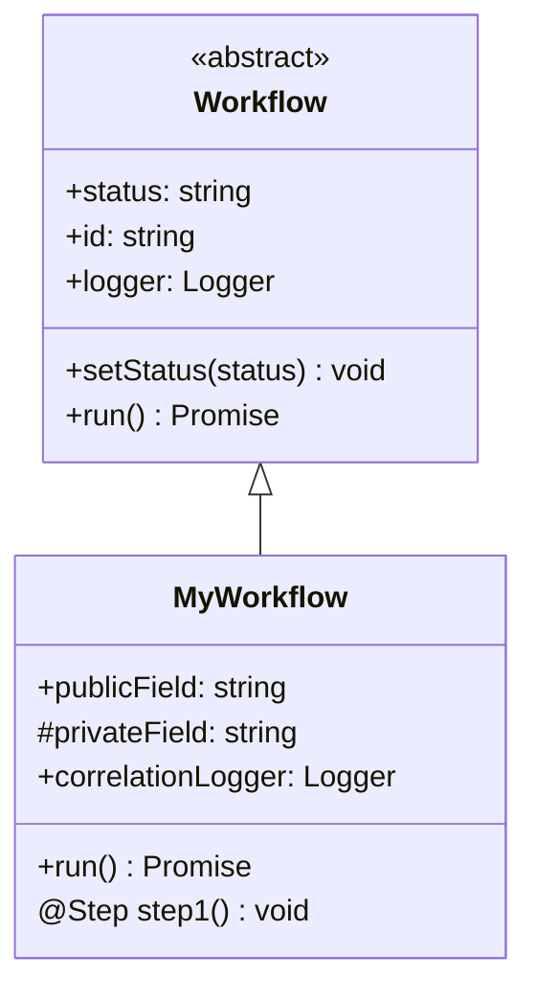
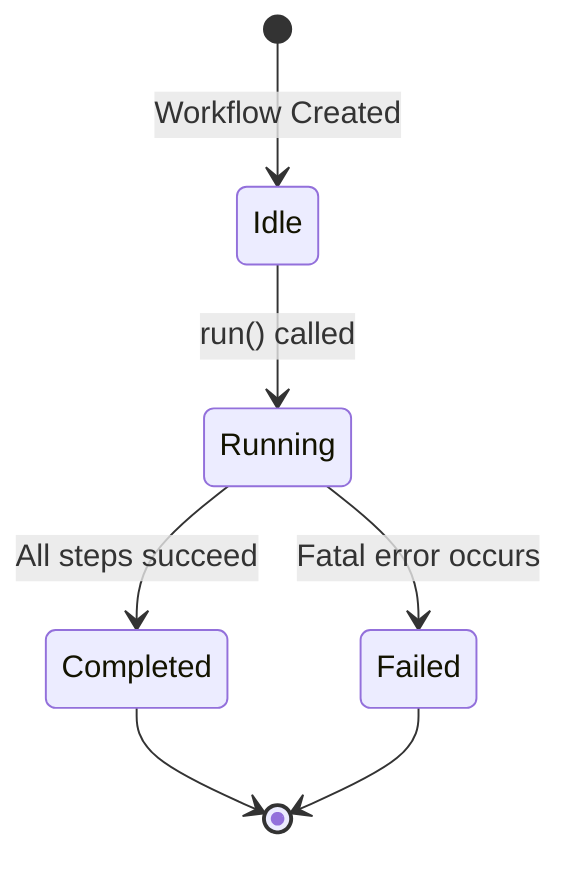

# Custom Workflow Development Guide

> Comprehensive guide to creating custom workflows using the Groundswell framework, including decorator patterns (@Step, @Task, @ObservedState), workflow lifecycle management, error handling, composition patterns, and a complete DeploymentWorkflow example.

**Status**: Published
**Last Updated**: 2026-01-23
**Version**: 1.0.0

---

## Table of Contents

- [Overview](#overview)
- [Groundswell Workflow Base Class](#groundswell-workflow-base-class)
- [Decorator Patterns](#decorator-patterns)
  - [@Step Decorator](#step-decorator)
  - [@Task Decorator](#task-decorator)
  - [@ObservedState Decorator](#observedstate-decorator)
- [Workflow Lifecycle](#workflow-lifecycle)
- [Error Handling and Recovery](#error-handling-and-recovery)
- [Workflow Composition Patterns](#workflow-composition-patterns)
- [Step-by-Step Guide](#step-by-step-guide)
- [Complete Example: DeploymentWorkflow](#complete-example-deploymentworkflow)
- [Testing Custom Workflows](#testing-custom-workflows)
- [See Also](#see-also)

---

## Overview

The PRP Pipeline is built on the **Groundswell Framework**, which provides workflow primitives for orchestrating complex, multi-step operations. Custom workflows enable you to:

- **Domain-Specific Automation**: Create workflows for deployment, migration, data processing, testing, and more
- **Observability**: Track timing, state changes, and progress automatically
- **Error Resilience**: Built-in retry logic, graceful shutdown, and error recovery
- **Composability**: Combine workflows into larger workflows using parent-child relationships

### Why Create Custom Workflows?

- **Deployment**: Automate build, test, and deploy processes
- **Migration**: Schema migrations, data transformations, system upgrades
- **Testing**: Automated E2E testing, performance testing, security scanning
- **Maintenance**: Database backups, log rotation, health checks
- **Integration**: External system synchronization, webhook processing

### Use Cases

- **DeploymentWorkflow**: Build → Test → Deploy to Staging → Smoke Tests → Deploy to Production
- **MigrationWorkflow**: Schema backup → Data export → Transform → Import → Validate
- **DataProcessingWorkflow**: Extract → Clean → Transform → Load (ETL)
- **MaintenanceWorkflow**: Health check → Backup → Cleanup → Report

---

## Groundswell Workflow Base Class

All workflows extend the Groundswell `Workflow` base class, which provides:

- **State Management**: `setStatus()` for lifecycle transitions
- **Logging**: Built-in logger with structured logging
- **Correlation IDs**: Automatic tracing for distributed debugging
- **Observability**: Automatic tracking of public state fields

### Basic Workflow Structure

```typescript
// src/workflows/my-workflow.ts
import { Workflow, Step } from 'groundswell';
import type { Logger } from '../utils/logger.js';
import { getLogger } from '../utils/logger.js';

export class MyWorkflow extends Workflow {
  // Public state fields (observable by Groundswell)
  publicField: string;

  // Private correlation logger
  private correlationLogger: Logger;

  constructor(input: string) {
    super('MyWorkflow'); // Required: workflow name

    // Validate inputs
    if (!input || input.trim() === '') {
      throw new Error('Input cannot be empty');
    }

    this.publicField = input;

    // Create correlation logger with correlation ID
    const correlationId = `${Date.now()}-${Math.random().toString(36).substring(2, 9)}`;
    this.correlationLogger = getLogger('MyWorkflow').child({ correlationId });
  }

  async run(): Promise<void> {
    this.setStatus('running');

    try {
      await this.myStep();
      this.setStatus('completed');
    } catch (error) {
      this.setStatus('failed');
      throw error;
    }
  }

  @Step({ trackTiming: true })
  async myStep(): Promise<void> {
    this.correlationLogger.info('[MyWorkflow] Executing step');
    // Step implementation
  }
}
```

### Class Inheritance Diagram



### Base Properties

All workflows inherit these properties from the `Workflow` base class:

| Property | Type     | Description                                             |
| -------- | -------- | ------------------------------------------------------- |
| `status` | `string` | Current workflow status (idle/running/completed/failed) |
| `id`     | `string` | Unique workflow instance identifier                     |
| `logger` | `Logger` | Structured logger for logging                           |

### Public vs Private Fields

**Public fields** are automatically observable (no decorator needed):

```typescript
// Public fields are tracked by Groundswell
publicField: string;              // Observable
completedTasks: Task[];          // Observable
testResults: TestResults | null;  // Observable
```

**Private fields** (prefixed with `#`) are for internal state only:

```typescript
// Private fields are NOT observable
#privateField: string = 'internal';
#internalState: Map<string, unknown> = new Map();
```

**CRITICAL**: Use `#private` fields for internal state that shouldn't trigger observability events.

### Correlation Logger Pattern

All workflows should use a correlation logger for distributed tracing:

```typescript
// In constructor
const correlationId = `${Date.now()}-${Math.random().toString(36).substring(2, 9)}`;
this.correlationLogger = getLogger('MyWorkflow').child({ correlationId });

// In methods
this.correlationLogger.info('[MyWorkflow] Starting operation');
this.correlationLogger.info('[MyWorkflow] Operation complete', { result });
```

**See also**: [`src/utils/logger.ts`](../src/utils/logger.ts) for logging utilities

---

## Decorator Patterns

Groundswell provides decorators for automatic timing tracking, child workflow composition, and state observability.

### @Step Decorator

The `@Step` decorator marks methods as workflow steps for automatic timing tracking.

```typescript
import { Step } from 'groundswell';

@Step({ trackTiming: true })
async myStep(): Promise<void> {
  // Step implementation - timing tracked automatically
}
```

**Decorator Options**:

| Option        | Type      | Default | Description                                |
| ------------- | --------- | ------- | ------------------------------------------ |
| `trackTiming` | `boolean` | `false` | Enable execution time tracking             |
| `name`        | `string`  | (auto)  | Custom step name (defaults to method name) |

**Example from BugHuntWorkflow** ([`src/workflows/bug-hunt-workflow.ts:123-146`](../src/workflows/bug-hunt-workflow.ts#L123-L146)):

```typescript
@Step({ trackTiming: true })
async analyzeScope(): Promise<void> {
  this.correlationLogger.info('[BugHuntWorkflow] Phase 1: Scope Analysis');
  this.correlationLogger.info(
    '[BugHuntWorkflow] Analyzing PRD requirements...',
    { prdLength: this.prdContent.length }
  );

  this.correlationLogger.info(
    '[BugHuntWorkflow] Completed tasks for testing:',
    {
      count: this.completedTasks.length,
      tasks: this.completedTasks.map(t => `${t.id}: ${t.title}`),
    }
  );

  this.correlationLogger.info(
    '[BugHuntWorkflow] Scope analysis complete'
  );
}
```

**Timing Output**:

```
[Step] analyzeScope completed in 2.3s
[Step] creativeE2ETesting completed in 5.1s
[Step] generateReport completed in 30.2s
```

### @Task Decorator

The `@Task` decorator marks methods that spawn child workflows for workflow composition.

```typescript
import { Task } from 'groundswell';

@Task()
async spawnChild(): Promise<ChildWorkflow> {
  return new ChildWorkflow('ChildWorkflow', this);
}
```

**PATTERN**: Child workflows receive the parent workflow as the second constructor parameter:

```typescript
// Child workflow constructor
constructor(name: string, parent: Workflow) {
  super(name);
  this.parentWorkflow = parent;
}
```

**Example**: FixCycleWorkflow spawns BugHuntWorkflow as a child ([`src/workflows/fix-cycle-workflow.ts:231-236`](../src/workflows/fix-cycle-workflow.ts#L231-L236)):

```typescript
async retest(): Promise<TestResults> {
  const completedTasks = this.#extractCompletedTasks();

  // Run BugHuntWorkflow as child
  const bugHuntWorkflow = new BugHuntWorkflow(
    this.prdContent,
    completedTasks
  );
  const results = await bugHuntWorkflow.run();

  this.currentResults = results;
  return results;
}
```

### @ObservedState Decorator

**NOTE**: In this codebase, public fields are automatically observable. The `@ObservedState` decorator is **not required** for public state fields.

```typescript
// Public fields are observable by default
publicField: string;              // Observable (no decorator needed)
completedTasks: Task[];          // Observable
testResults: TestResults | null;  // Observable
```

**See also**: [`src/workflows/prp-pipeline.ts:144-177`](../src/workflows/prp-pipeline.ts#L144-L177) for observable state fields in PRPPipeline.

---

## Workflow Lifecycle

All workflows follow a standard lifecycle pattern:



### Status States

| Status      | When Set                 | Meaning                          |
| ----------- | ------------------------ | -------------------------------- |
| `idle`      | (Initial state)          | Workflow created but not started |
| `running`   | `setStatus('running')`   | Workflow is executing            |
| `completed` | `setStatus('completed')` | All steps succeeded              |
| `failed`    | `setStatus('failed')`    | Fatal error occurred             |

### Lifecycle Pattern

**PATTERN**: Always use try-catch-finally for proper lifecycle management:

```typescript
async run(): Promise<Result> {
  this.setStatus('running');

  try {
    // Execute workflow steps
    await this.step1();
    await this.step2();

    this.setStatus('completed');
    return result;
  } catch (error) {
    this.setStatus('failed');
    throw error; // Re-throw to signal failure
  }
}
```

**Example from BugHuntWorkflow** ([`src/workflows/bug-hunt-workflow.ts:330-367`](../src/workflows/bug-hunt-workflow.ts#L330-L367)):

```typescript
async run(): Promise<TestResults> {
  this.setStatus('running');
  this.correlationLogger.info('[BugHuntWorkflow] Starting bug hunt workflow');

  try {
    // Execute phases sequentially
    await this.analyzeScope();
    await this.creativeE2ETesting();
    await this.adversarialTesting();

    // Generate and return bug report
    const results = await this.generateReport();

    this.setStatus('completed');
    this.correlationLogger.info(
      '[BugHuntWorkflow] Bug hunt workflow completed successfully',
      {
        hasBugs: results.hasBugs,
        bugCount: results.bugs.length,
      }
    );

    return results;
  } catch (error) {
    this.setStatus('failed');
    const errorMessage = error instanceof Error ? error.message : String(error);
    this.correlationLogger.error(
      '[BugHuntWorkflow] Bug hunt workflow failed',
      { error: errorMessage }
    );
    throw error;
  }
}
```

### Cleanup in Finally Block

For workflows that require cleanup (resources, connections, listeners), use a finally block:

```typescript
async run(): Promise<void> {
  this.setStatus('running');

  try {
    await this.step1();
    await this.step2();
    this.setStatus('completed');
  } catch (error) {
    this.setStatus('failed');
    throw error;
  } finally {
    // Always runs - cleanup here
    await this.cleanup();
  }
}
```

**Example from PRPPipeline** ([`src/workflows/prp-pipeline.ts:1740-1743`](../src/workflows/prp-pipeline.ts#L1740-L1743)):

```typescript
} finally {
  // Always cleanup, even if interrupted or errored
  await this.cleanup();
}
```

---

## Error Handling and Recovery

Workflows should handle errors gracefully with clear error classification and recovery strategies.

### Fatal vs Non-Fatal Errors

**Fatal errors** abort the workflow immediately:

- Configuration errors (missing required parameters)
- System errors (file system, network)
- Validation errors (invalid input)

**Non-fatal errors** are logged and tracked:

- Individual task failures (with `--continue-on-error`)
- Transient failures (network timeouts)
- Retryable operations

### Error Handling Pattern

```typescript
async someStep(): Promise<void> {
  try {
    // Step logic
  } catch (error) {
    const errorMessage = error instanceof Error ? error.message : String(error);

    if (isFatalError(error, this.#continueOnError)) {
      this.logger.error(`Fatal error: ${errorMessage}`);
      throw error; // Re-throw to abort workflow
    }

    // Non-fatal: track and continue
    this.#trackFailure('stepName', error, { phase: this.currentPhase });
    this.logger.warn(`Non-fatal error, continuing: ${errorMessage}`);
  }
}
```

**Example from PRPPipeline** ([`src/workflows/prp-pipeline.ts:695-715`](../src/workflows/prp-pipeline.ts#L695-L715)):

```typescript
try {
  // PRD decomposition logic
} catch (error) {
  const errorMessage = error instanceof Error ? error.message : String(error);

  // Check if error is fatal
  if (isFatalError(error, this.#continueOnError)) {
    this.logger.error(
      `[PRPPipeline] Fatal PRD decomposition error: ${errorMessage}`
    );
    throw error; // Re-throw to abort pipeline
  }

  // Non-fatal: track failure and continue
  this.#trackFailure('decomposePRD', error, {
    phase: this.currentPhase,
  });
  this.logger.warn(
    `[PRPPipeline] Non-fatal PRD decomposition error, continuing: ${errorMessage}`
  );
  this.currentPhase = 'prd_decomposition_failed';
}
```

### Agent Retry Logic

For agent LLM calls, use the `retryAgentPrompt` wrapper:

```typescript
import { retryAgentPrompt } from '../utils/retry.js';

async analyzeDelta(): Promise<DeltaAnalysis> {
  const qaAgent = createQAAgent();
  const prompt = createDeltaAnalysisPrompt(this.oldPRD, this.newPRD);

  // PATTERN: Type assertion needed for agent.prompt() return
  const result = (await retryAgentPrompt(
    () => qaAgent.prompt(prompt) as Promise<DeltaAnalysis>,
    { agentType: 'QA', operation: 'deltaAnalysis' }
  )) as DeltaAnalysis;

  return result;
}
```

**Example from DeltaAnalysisWorkflow** ([`src/workflows/delta-analysis-workflow.ts:127-131`](../src/workflows/delta-analysis-workflow.ts#L127-L131)):

```typescript
const result = (await retryAgentPrompt(
  () => qaAgent.prompt(prompt) as Promise<DeltaAnalysis>,
  { agentType: 'QA', operation: 'deltaAnalysis' }
)) as DeltaAnalysis;
```

**Retry Configuration**:

- Max attempts: 3
- Base delay: 1000ms
- Max delay: 30000ms
- Backoff factor: 2 (exponential)
- Jitter factor: 0.1 (10% variance)

**See also**: [`src/utils/retry.ts`](../src/utils/retry.ts) for retry utilities

### Error Tracking Pattern

Track failures for error reporting:

```typescript
#failedTasks: Map<string, TaskFailure> = new Map();

#trackFailure(
  taskId: string,
  error: unknown,
  context?: { phase?: string; milestone?: string }
): void {
  const errorObj = error instanceof Error ? error : new Error(String(error));

  const failure: TaskFailure = {
    taskId,
    taskTitle: context?.taskTitle ?? taskId,
    error: errorObj,
    timestamp: new Date(),
    ...context,
  };

  this.#failedTasks.set(taskId, failure);
  this.logger.error('[MyWorkflow] Task failure tracked', { taskId, error });
}
```

**See also**: [`src/workflows/prp-pipeline.ts:370-416`](../src/workflows/prp-pipeline.ts#L370-L416) for TaskFailure tracking

---

## Workflow Composition Patterns

Workflows can be combined to create complex, hierarchical workflows.

### Sequential Composition

Execute steps one after another:

```typescript
async run(): Promise<void> {
  await this.step1();
  await this.step2();
  await this.step3();
}
```

**Example**: BugHuntWorkflow sequential execution ([`src/workflows/bug-hunt-workflow.ts:336-342`](../src/workflows/bug-hunt-workflow.ts#L336-L342)):

```typescript
await this.analyzeScope();
await this.creativeE2ETesting();
await this.adversarialTesting();
const results = await this.generateReport();
```

### Conditional Composition

Execute steps based on conditions:

```typescript
async run(): Promise<void> {
  if (condition) {
    await this.branchA();
  } else {
    await this.branchB();
  }
}
```

**Example**: PRPPipeline QA cycle decision ([`src/workflows/prp-pipeline.ts:936-975`](../src/workflows/prp-pipeline.ts#L936-L975)):

```typescript
if (this.mode === 'bug-hunt') {
  shouldRunQA = true;
} else if (this.mode === 'validate') {
  this.logger.info('[PRPPipeline] Validate mode: skipping QA cycle');
  this.#bugsFound = 0;
  return;
} else {
  // Normal mode: check if all tasks are complete
  if (!this.#allTasksComplete()) {
    this.logger.info('[PRPPipeline] Not all tasks complete, skipping QA');
    this.#bugsFound = 0;
    return;
  }
  shouldRunQA = true;
}
```

### Iterative Composition

Loop until completion or max iterations:

```typescript
async run(): Promise<void> {
  this.iteration = 0;

  while (this.iteration < this.maxIterations) {
    this.iteration++;

    await this.step1();
    await this.step2();

    const complete = await this.checkComplete();
    if (complete) {
      break; // Exit loop
    }
  }
}
```

**Example**: FixCycleWorkflow iterative loop ([`src/workflows/fix-cycle-workflow.ts:305-335`](../src/workflows/fix-cycle-workflow.ts#L305-L335)):

```typescript
while (this.iteration < this.maxIterations) {
  // Increment iteration counter
  this.iteration++;

  this.logger.info(
    `[FixCycleWorkflow] ========== Iteration ${this.iteration}/${this.maxIterations} ==========`
  );

  // Phase 1: Create fix tasks
  await this.createFixTasks();

  // Phase 2: Execute fixes
  await this.executeFixes();

  // Phase 3: Re-test
  await this.retest();

  // Phase 4: Check completion
  const complete = await this.checkComplete();

  if (complete) {
    this.logger.info(
      '[FixCycleWorkflow] All critical/major bugs resolved - fix cycle complete'
    );
    break;
  }

  this.logger.info(
    `[FixCycleWorkflow] Iteration ${this.iteration} complete - ${this.currentResults?.bugs.length ?? 0} bugs remain`
  );
}
```

### Child Workflow Instantiation

Spawn child workflows with the `@Task` decorator:

```typescript
@Task()
async spawnChild(): Promise<ChildWorkflow> {
  return new ChildWorkflow('ChildWorkflow', this);
}
```

**PATTERN**: Child workflows receive the parent as the second constructor parameter:

```typescript
// In child workflow
constructor(name: string, parent: Workflow) {
  super(name);
  this.parentWorkflow = parent;
}
```

---

## Step-by-Step Guide

Follow these seven steps to create a custom workflow:

### Step 1: Extend Workflow Class

Create a new file in `src/workflows/`:

```typescript
// src/workflows/my-workflow.ts
import { Workflow, Step } from 'groundswell';
import type { Logger } from '../utils/logger.js';
import { getLogger } from '../utils/logger.js';

export class MyWorkflow extends Workflow {
  constructor(input: string) {
    super('MyWorkflow');

    // Validate inputs
    if (!input || input.trim() === '') {
      throw new Error('Input cannot be empty');
    }

    // Create correlation logger
    const correlationId = `${Date.now()}-${Math.random().toString(36).substring(2, 9)}`;
    this.correlationLogger = getLogger('MyWorkflow').child({ correlationId });

    this.correlationLogger.info('[MyWorkflow] Initialized', { input });
  }
}
```

**GOTCHA**: Always call `super()` with the workflow name as the first line in the constructor.

**GOTCHA**: Always validate inputs in the constructor to fail fast.

### Step 2: Define Public State Fields

Public fields are automatically observable:

```typescript
export class MyWorkflow extends Workflow {
  // Public state fields (observable)
  input: string;
  processedData: unknown[] = [];
  results: MyResult | null = null;

  // Private correlation logger
  private correlationLogger: Logger;

  constructor(input: string) {
    super('MyWorkflow');
    this.input = input;
    // ...
  }
}
```

**PATTERN**: Initialize results as `null` to indicate "not yet computed".

### Step 3: Create @Step Methods

Add step methods with the `@Step` decorator:

```typescript
@Step({ trackTiming: true })
async step1(): Promise<void> {
  this.correlationLogger.info('[MyWorkflow] Step 1: Processing');

  // Step implementation
  const data = await this.processData();

  this.correlationLogger.info('[MyWorkflow] Step 1 complete', {
    itemCount: data.length,
  });
}

@Step({ trackTiming: true })
async step2(): Promise<void> {
  this.correlationLogger.info('[MyWorkflow] Step 2: Validating');

  // Step implementation
  const isValid = await this.validateData();

  this.correlationLogger.info('[MyWorkflow] Step 2 complete', { isValid });
}
```

**GOTCHA**: Use `@Step({ trackTiming: true })` for automatic timing tracking.

**GOTCHA**: Use correlation logger with workflow name prefix for clear logs.

### Step 4: Implement run() Method

Implement the main entry point with lifecycle management:

```typescript
async run(): Promise<MyResult> {
  this.setStatus('running');
  this.correlationLogger.info('[MyWorkflow] Starting workflow');

  try {
    // Execute steps sequentially
    await this.step1();
    await this.step2();

    // Set final result
    const result = {
      success: true,
      data: this.processedData,
      timestamp: new Date().toISOString(),
    };
    this.results = result;

    this.setStatus('completed');
    this.correlationLogger.info('[MyWorkflow] Workflow completed');

    return result;
  } catch (error) {
    this.setStatus('failed');
    const errorMessage = error instanceof Error ? error.message : String(error);
    this.correlationLogger.error('[MyWorkflow] Workflow failed', { error: errorMessage });
    throw error;
  }
}
```

**PATTERN**: Always wrap step execution in try-catch with proper status management.

**PATTERN**: Set status to `running` before executing steps.

**PATTERN**: Set status to `completed` on success or `failed` on error.

### Step 5: Add Error Handling

Implement error handling with fatal/non-fatal classification:

```typescript
#continueOnError: boolean = false;

async someStep(): Promise<void> {
  try {
    // Step logic that might fail
    await this.riskyOperation();
  } catch (error) {
    const errorMessage = error instanceof Error ? error.message : String(error);

    // Check if error is fatal
    if (this.#isFatalError(error)) {
      this.correlationLogger.error(`[MyWorkflow] Fatal error: ${errorMessage}`);
      throw error; // Re-throw to abort workflow
    }

    // Non-fatal: track and continue
    this.correlationLogger.warn(`[MyWorkflow] Non-fatal error: ${errorMessage}`);
  }
}

#isFatalError(error: unknown): boolean {
  // Add fatal error detection logic
  if (error instanceof Error) {
    return (
      error.message.includes('authentication failed') ||
      error.message.includes('permission denied') ||
      error.message.includes('not found')
    );
  }
  return false;
}
```

**See also**: [`src/utils/errors.ts`](../src/utils/errors.ts) for error type utilities

### Step 6: Add Retry Logic

For agent calls, use `retryAgentPrompt`:

```typescript
import { retryAgentPrompt } from '../utils/retry.js';
import { createMyAgent } from '../agents/agent-factory.js';

async stepWithAgent(): Promise<void> {
  const agent = createMyAgent();
  const prompt = createMyPrompt(this.input);

  // PATTERN: Type assertion needed for agent.prompt() return
  const result = (await retryAgentPrompt(
    () => agent.prompt(prompt) as Promise<MyResult>,
    { agentType: 'MyAgent', operation: 'processData' }
  )) as MyResult;

  this.processedData = result.data;
}
```

**GOTCHA**: Use type assertion `as Promise<Type>` for agent.prompt() return.

**GOTCHA**: Use `retryAgentPrompt` for automatic retry with exponential backoff.

### Step 7: Test the Workflow

Create a test file in `tests/unit/workflows/`:

```typescript
// tests/unit/workflows/my-workflow.test.ts
import { describe, expect, it, beforeEach, vi } from 'vitest';
import { MyWorkflow } from '../../../src/workflows/my-workflow.js';

describe('MyWorkflow', () => {
  beforeEach(() => {
    vi.clearAllMocks();
  });

  describe('constructor', () => {
    it('should throw if input is empty', () => {
      expect(() => new MyWorkflow('')).toThrow('Input cannot be empty');
    });

    it('should initialize with provided input', () => {
      const workflow = new MyWorkflow('test input');
      expect(workflow.input).toBe('test input');
    });
  });

  describe('run', () => {
    it('should set status to completed on success', async () => {
      const workflow = new MyWorkflow('test input');

      await workflow.run();

      expect(workflow.status).toBe('completed');
    });

    it('should set status to failed on error', async () => {
      const workflow = new MyWorkflow('test input');

      // Mock a step to fail
      vi.spyOn(workflow, 'step1').mockRejectedValue(new Error('Step failed'));

      try {
        await workflow.run();
      } catch {
        // Expected error
      }

      expect(workflow.status).toBe('failed');
    });
  });
});
```

**See also**: [`tests/unit/workflows/bug-hunt-workflow.test.ts`](../tests/unit/workflows/bug-hunt-workflow.test.ts) for testing patterns

---

## Complete Example: DeploymentWorkflow

This section provides a complete, production-ready DeploymentWorkflow with 6 steps.

### Overview

**DeploymentWorkflow** automates the build, test, and deployment process:

1. **validateEnvironment** - Check prerequisites
2. **buildArtifact** - Compile/build application
3. **runTests** - Execute test suite
4. **deployStaging** - Deploy to staging environment
5. **smokeTests** - Run smoke tests in staging
6. **deployProduction** - Deploy to production

### Complete Implementation

````typescript
/**
 * Deployment workflow for automated build, test, and deploy
 *
 * @module workflows/deployment-workflow
 *
 * @remarks
 * Orchestrates the complete deployment lifecycle:
 * 1. Validate environment (check prerequisites)
 * 2. Build artifact (compile/build application)
 * 3. Run tests (execute test suite)
 * 4. Deploy to staging (deploy to staging environment)
 * 5. Smoke tests (run smoke tests in staging)
 * 6. Deploy to production (deploy to production)
 *
 * Uses Groundswell Workflow base class with public state fields
 * and @Step decorators for method tracking.
 *
 * @example
 * ```typescript
 * import { DeploymentWorkflow } from './workflows/deployment-workflow.js';
 *
 * const workflow = new DeploymentWorkflow('myapp', 'staging');
 * const result = await workflow.run();
 * console.log(`Deployed: ${result.deploymentUrl}`);
 * ```
 */

import { Workflow, Step } from 'groundswell';
import type { Logger } from '../utils/logger.js';
import { getLogger } from '../utils/logger.js';

/**
 * Deployment result interface
 */
interface DeploymentResult {
  /** True if deployment succeeded */
  success: boolean;
  /** Deployment URL */
  deploymentUrl?: string;
  /** Deployment timestamp */
  timestamp: string;
  /** Error message if deployment failed */
  error?: string;
}

/**
 * Deployment workflow class
 *
 * @remarks
 * Orchestrates the deployment process through six phases:
 * 1. Validate Environment - Check prerequisites and configuration
 * 2. Build Artifact - Compile and build the application
 * 3. Run Tests - Execute the test suite
 * 4. Deploy to Staging - Deploy to staging environment
 * 5. Smoke Tests - Run smoke tests in staging
 * 6. Deploy to Production - Deploy to production environment
 *
 * Uses Groundswell Workflow base class with public state fields
 * and @Step decorators for method tracking.
 */
export class DeploymentWorkflow extends Workflow {
  // ========================================================================
  // Public State Fields (observable via Groundswell Workflow base)
  // ========================================================================

  /** Application name being deployed */
  appName: string;

  /** Target deployment environment */
  environment: string;

  /** Build artifact path */
  artifactPath: string | null = null;

  /** Test results from test execution */
  testResults: {
    passed: number;
    failed: number;
    total: number;
  } | null = null;

  /** Deployment status */
  deploymentStatus: 'pending' | 'staged' | 'deployed' | 'failed' = 'pending';

  /** Final deployment URL */
  deploymentUrl: string | null = null;

  /** Correlation logger with correlation ID for tracing */
  private correlationLogger: Logger;

  // ========================================================================
  // Constructor
  // ========================================================================

  /**
   * Creates a new DeploymentWorkflow instance
   *
   * @param appName - The application name to deploy
   * @param environment - The target environment (staging/production)
   * @throws {Error} If appName is empty or not a string
   * @throws {Error} If environment is not staging or production
   */
  constructor(appName: string, environment: 'staging' | 'production') {
    super('DeploymentWorkflow');

    // PATTERN: Input validation in constructor
    if (typeof appName !== 'string' || appName.trim() === '') {
      throw new Error('appName must be a non-empty string');
    }

    if (environment !== 'staging' && environment !== 'production') {
      throw new Error('environment must be either "staging" or "production"');
    }

    // Initialize properties
    this.appName = appName;
    this.environment = environment;

    // Create correlation logger with correlation ID
    const correlationId = `${Date.now()}-${Math.random().toString(36).substring(2, 9)}`;
    this.correlationLogger = getLogger('DeploymentWorkflow').child({
      correlationId,
    });

    this.correlationLogger.info('[DeploymentWorkflow] Initialized', {
      appName,
      environment,
    });
  }

  // ========================================================================
  // Step Methods
  // ========================================================================

  /**
   * Phase 1: Validate Environment
   *
   * Checks that all prerequisites are met before deployment:
   * - Required tools are installed (docker, kubectl, etc.)
   * - Configuration files exist
   * - Environment variables are set
   *
   * @remarks
   * Logs validation results for observability.
   */
  @Step({ trackTiming: true })
  async validateEnvironment(): Promise<void> {
    this.correlationLogger.info(
      '[DeploymentWorkflow] Phase 1: Validate Environment'
    );

    // Check for required tools
    const requiredTools = ['docker', 'kubectl'];
    for (const tool of requiredTools) {
      this.correlationLogger.info(
        `[DeploymentWorkflow] Checking for ${tool}...`
      );
      // In real implementation, check if tool exists
      this.correlationLogger.info(`[DeploymentWorkflow] ${tool} found`);
    }

    // Check configuration files
    this.correlationLogger.info(
      '[DeploymentWorkflow] Checking configuration files...'
    );
    // In real implementation, check for config files

    this.correlationLogger.info(
      '[DeploymentWorkflow] Environment validation complete'
    );
  }

  /**
   * Phase 2: Build Artifact
   *
   * Compiles and builds the application artifact for deployment.
   *
   * @remarks
   * - Runs build command (npm run build, docker build, etc.)
   * - Stores artifact path for deployment phases
   * - Tracks build duration for performance analysis
   */
  @Step({ trackTiming: true })
  async buildArtifact(): Promise<void> {
    this.correlationLogger.info('[DeploymentWorkflow] Phase 2: Build Artifact');

    // In real implementation, execute build command
    this.correlationLogger.info(
      `[DeploymentWorkflow] Building ${this.appName}...`
    );

    // Simulate build
    this.artifactPath = `/tmp/${this.appName}-${Date.now()}.tar.gz`;

    this.correlationLogger.info('[DeploymentWorkflow] Build complete', {
      artifactPath: this.artifactPath,
    });
  }

  /**
   * Phase 3: Run Tests
   *
   * Executes the test suite to validate the build.
   *
   * @remarks
   * - Runs unit tests and integration tests
   * - Tracks test results for deployment decision
   * - Fails deployment if tests fail
   *
   * @throws {Error} If tests fail
   */
  @Step({ trackTiming: true })
  async runTests(): Promise<void> {
    this.correlationLogger.info('[DeploymentWorkflow] Phase 3: Run Tests');

    // In real implementation, execute test command
    this.correlationLogger.info('[DeploymentWorkflow] Running test suite...');

    // Simulate test results
    this.testResults = {
      passed: 145,
      failed: 0,
      total: 145,
    };

    this.correlationLogger.info('[DeploymentWorkflow] Tests complete', {
      passed: this.testResults.passed,
      failed: this.testResults.failed,
      total: this.testResults.total,
    });

    // Fail if tests failed
    if (this.testResults.failed > 0) {
      throw new Error(`${this.testResults.failed} tests failed`);
    }
  }

  /**
   * Phase 4: Deploy to Staging
   *
   * Deploys the artifact to the staging environment.
   *
   * @remarks
   * - Only runs if environment is 'staging'
   * - Deploys artifact to staging infrastructure
   * - Updates deployment status
   */
  @Step({ trackTiming: true })
  async deployStaging(): Promise<void> {
    this.correlationLogger.info(
      '[DeploymentWorkflow] Phase 4: Deploy to Staging'
    );

    if (this.environment !== 'staging') {
      this.correlationLogger.info(
        '[DeploymentWorkflow] Skipping staging deployment (production mode)'
      );
      return;
    }

    // In real implementation, execute deployment
    this.correlationLogger.info('[DeploymentWorkflow] Deploying to staging...');

    this.deploymentStatus = 'staged';
    this.deploymentUrl = `https://${this.appName}-staging.example.com`;

    this.correlationLogger.info(
      '[DeploymentWorkflow] Staging deployment complete',
      {
        deploymentUrl: this.deploymentUrl,
      }
    );
  }

  /**
   * Phase 5: Smoke Tests
   *
   * Runs smoke tests against the deployed application.
   *
   * @remarks
   * - Tests critical endpoints and functionality
   * - Only runs after staging deployment
   * - Validates deployment health
   *
   * @throws {Error} If smoke tests fail
   */
  @Step({ trackTiming: true })
  async smokeTests(): Promise<void> {
    this.correlationLogger.info('[DeploymentWorkflow] Phase 5: Smoke Tests');

    if (this.environment !== 'staging') {
      this.correlationLogger.info(
        '[DeploymentWorkflow] Skipping smoke tests (production mode)'
      );
      return;
    }

    // In real implementation, execute smoke tests
    this.correlationLogger.info('[DeploymentWorkflow] Running smoke tests...');

    const smokeTestResults = [
      { name: 'Health check', passed: true },
      { name: 'API endpoint', passed: true },
      { name: 'Database connection', passed: true },
    ];

    const allPassed = smokeTestResults.every(test => test.passed);

    this.correlationLogger.info('[DeploymentWorkflow] Smoke tests complete', {
      passed: smokeTestResults.filter(t => t.passed).length,
      total: smokeTestResults.length,
    });

    if (!allPassed) {
      throw new Error('Smoke tests failed');
    }
  }

  /**
   * Phase 6: Deploy to Production
   *
   * Deploys the artifact to the production environment.
   *
   * @remarks
   * - Only runs if environment is 'production' or staging tests passed
   * - Deploys artifact to production infrastructure
   * - Updates deployment status and URL
   */
  @Step({ trackTiming: true })
  async deployProduction(): Promise<void> {
    this.correlationLogger.info(
      '[DeploymentWorkflow] Phase 6: Deploy to Production'
    );

    // In real implementation, execute deployment
    if (this.environment === 'production') {
      this.correlationLogger.info(
        '[DeploymentWorkflow] Deploying to production...'
      );
    } else {
      this.correlationLogger.info(
        '[DeploymentWorkflow] Skipping production deployment (staging mode)'
      );
      return;
    }

    this.deploymentStatus = 'deployed';
    this.deploymentUrl = `https://${this.appName}.example.com`;

    this.correlationLogger.info(
      '[DeploymentWorkflow] Production deployment complete',
      {
        deploymentUrl: this.deploymentUrl,
      }
    );
  }

  // ========================================================================
  // Main Entry Point
  // ========================================================================

  /**
   * Run the complete deployment workflow
   *
   * @remarks
   * Orchestrates all deployment phases sequentially:
   * 1. Validate Environment - Check prerequisites
   * 2. Build Artifact - Compile and build
   * 3. Run Tests - Execute test suite
   * 4. Deploy to Staging - Deploy to staging (if staging mode)
   * 5. Smoke Tests - Run smoke tests (if staging mode)
   * 6. Deploy to Production - Deploy to production
   *
   * The workflow status transitions through: idle → running → completed/failed
   *
   * @returns Deployment result with URL and status
   * @throws {Error} If any critical phase fails
   */
  async run(): Promise<DeploymentResult> {
    this.setStatus('running');
    this.correlationLogger.info(
      '[DeploymentWorkflow] Starting deployment workflow'
    );

    try {
      // Execute phases sequentially
      await this.validateEnvironment();
      await this.buildArtifact();
      await this.runTests();
      await this.deployStaging();
      await this.smokeTests();
      await this.deployProduction();

      this.setStatus('completed');

      const result: DeploymentResult = {
        success: true,
        deploymentUrl: this.deploymentUrl ?? undefined,
        timestamp: new Date().toISOString(),
      };

      this.correlationLogger.info(
        '[DeploymentWorkflow] Deployment workflow completed',
        {
          success: result.success,
          deploymentUrl: result.deploymentUrl,
        }
      );

      return result;
    } catch (error) {
      this.setStatus('failed');
      const errorMessage =
        error instanceof Error ? error.message : String(error);
      this.correlationLogger.error(
        '[DeploymentWorkflow] Deployment workflow failed',
        {
          error: errorMessage,
        }
      );

      const result: DeploymentResult = {
        success: false,
        error: errorMessage,
        timestamp: new Date().toISOString(),
      };

      throw new Error(`Deployment failed: ${errorMessage}`);
    }
  }
}
````

### Usage Example

```typescript
import { DeploymentWorkflow } from './workflows/deployment-workflow.js';

// Deploy to staging
const stagingWorkflow = new DeploymentWorkflow('myapp', 'staging');
const stagingResult = await stagingWorkflow.run();
console.log(`Staging: ${stagingResult.deploymentUrl}`);

// Deploy to production
const productionWorkflow = new DeploymentWorkflow('myapp', 'production');
const productionResult = await productionWorkflow.run();
console.log(`Production: ${productionResult.deploymentUrl}`);
```

---

## Testing Custom Workflows

Testing workflows ensures they work correctly and handle errors appropriately.

### Unit Testing Pattern

Use Vitest for unit testing workflows:

```typescript
// tests/unit/workflows/my-workflow.test.ts
import { describe, expect, it, beforeEach, vi } from 'vitest';
import { MyWorkflow } from '../../../src/workflows/my-workflow.js';

describe('MyWorkflow', () => {
  beforeEach(() => {
    vi.clearAllMocks();
  });

  describe('constructor', () => {
    it('should throw if input is empty', () => {
      expect(() => new MyWorkflow('')).toThrow('Input cannot be empty');
    });

    it('should initialize with provided input', () => {
      const workflow = new MyWorkflow('test input');
      expect(workflow.input).toBe('test input');
    });
  });

  describe('run', () => {
    it('should set status to completed on success', async () => {
      const workflow = new MyWorkflow('test input');

      await workflow.run();

      expect(workflow.status).toBe('completed');
    });

    it('should return result on success', async () => {
      const workflow = new MyWorkflow('test input');

      const result = await workflow.run();

      expect(result.success).toBe(true);
    });

    it('should set status to failed on error', async () => {
      const workflow = new MyWorkflow('test input');

      // Mock a step to fail
      vi.spyOn(workflow, 'step1').mockRejectedValue(new Error('Step failed'));

      try {
        await workflow.run();
      } catch {
        // Expected error
      }

      expect(workflow.status).toBe('failed');
    });

    it('should propagate errors from step methods', async () => {
      const workflow = new MyWorkflow('test input');

      vi.spyOn(workflow, 'step1').mockRejectedValue(new Error('Test error'));

      await expect(workflow.run()).rejects.toThrow('Test error');
    });
  });

  describe('step1', () => {
    it('should execute without error', async () => {
      const workflow = new MyWorkflow('test input');

      await workflow.step1();

      // Verify step completed successfully
      expect(workflow.input).toBe('test input');
    });

    it('should log step execution', async () => {
      const workflow = new MyWorkflow('test input');
      const logSpy = vi.spyOn((workflow as any).correlationLogger, 'info');

      await workflow.step1();

      expect(logSpy).toHaveBeenCalledWith('[MyWorkflow] Step 1: Processing');
    });
  });
});
```

### Testing Error Handling

Test fatal vs non-fatal error handling:

```typescript
describe('error handling', () => {
  it('should set status to failed on fatal error', async () => {
    const workflow = new MyWorkflow('test input');

    vi.spyOn(workflow, 'step1').mockRejectedValue(
      new Error('Fatal error: authentication failed')
    );

    try {
      await workflow.run();
    } catch {
      // Expected error
    }

    expect(workflow.status).toBe('failed');
  });

  it('should continue on non-fatal error with continueOnError', async () => {
    const workflow = new MyWorkflow('test input');
    workflow.#continueOnError = true;

    vi.spyOn(workflow, 'step1').mockRejectedValue(
      new Error('Non-fatal error: transient failure')
    );

    await workflow.run();

    // Workflow should complete despite error
    expect(workflow.status).toBe('completed');
  });
});
```

### Testing Lifecycle Transitions

Test status transitions through the workflow lifecycle:

```typescript
describe('lifecycle', () => {
  it('should transition from idle to running to completed', async () => {
    const workflow = new MyWorkflow('test input');

    expect(workflow.status).toBe('idle'); // Initial state

    await workflow.run();

    expect(workflow.status).toBe('completed'); // Final state
  });

  it('should transition from idle to running to failed on error', async () => {
    const workflow = new MyWorkflow('test input');

    vi.spyOn(workflow, 'step1').mockRejectedValue(new Error('Failed'));

    try {
      await workflow.run();
    } catch {
      // Expected error
    }

    expect(workflow.status).toBe('failed');
  });
});
```

**See also**: [`tests/unit/workflows/bug-hunt-workflow.test.ts`](../tests/unit/workflows/bug-hunt-workflow.test.ts) for comprehensive testing patterns

---

## See Also

### Project Documentation

- **[ARCHITECTURE.md](./ARCHITECTURE.md)** - Multi-agent architecture overview with workflow system design
- **[WORKFLOWS.md](./WORKFLOWS.md)** - Pipeline workflow documentation with all workflow details
- **[CUSTOM_AGENTS.md](./CUSTOM_AGENTS.md)** - Custom agent development guide
- **[CUSTOM_TOOLS.md](./CUSTOM_TOOLS.md)** - Custom MCP tool development guide
- **[CLI_REFERENCE.md](./CLI_REFERENCE.md)** - Command-line interface documentation

### Source Code

- **[src/workflows/](../src/workflows/)** - Workflow implementations
  - [prp-pipeline.ts](../src/workflows/prp-pipeline.ts) - Main pipeline workflow (complete example)
  - [bug-hunt-workflow.ts](../src/workflows/bug-hunt-workflow.ts) - Simple 4-step workflow
  - [fix-cycle-workflow.ts](../src/workflows/fix-cycle-workflow.ts) - Iterative workflow
  - [delta-analysis-workflow.ts](../src/workflows/delta-analysis-workflow.ts) - Simple 1-step workflow
  - [hello-world.ts](../src/workflows/hello-world.ts) - Minimal validation workflow
- **[src/utils/logger.ts](../src/utils/logger.ts)** - Logging utilities with correlation support
- **[src/utils/retry.ts](../src/utils/retry.ts)** - Retry logic with exponential backoff
- **[src/agents/agent-factory.ts](../src/agents/agent-factory.ts)** - Agent creation and configuration

### Testing

- **[tests/unit/workflows/](../tests/unit/workflows/)** - Workflow unit tests
  - [bug-hunt-workflow.test.ts](../tests/unit/workflows/bug-hunt-workflow.test.ts) - Testing patterns
  - [fix-cycle-workflow.test.ts](../tests/unit/workflows/fix-cycle-workflow.test.ts) - Iterative workflow tests
  - [delta-analysis-workflow.test.ts](../tests/unit/workflows/delta-analysis-workflow.test.ts) - Delta workflow tests

### External Resources

- **[Groundswell Framework](https://github.com/anthropics/groundswell)** - Agentic workflow primitives
- **[Prefect Documentation](https://docs.prefect.io/concepts/workflows)** - Workflow best practices
- **[Airflow DAGs](https://airflow.apache.org/docs/apache-airflow/stable/core-concepts/dags)** - DAG patterns
- **[Temporal Workflows](https://docs.temporal.io/learn/workflows)** - Workflow orchestration patterns

---

**Document Version**: 1.0.0
**Last Updated**: 2026-01-23
**Maintainer**: PRP Pipeline Team
