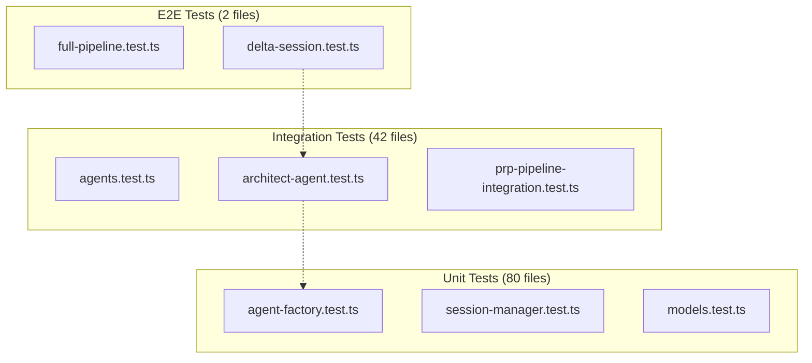

# Testing Strategy

> Comprehensive guide to testing philosophy, structure, and guidelines for the hacky-hack PRP Pipeline codebase.

**Status**: Published
**Last Updated**: 2026-01-23
**Version**: 1.0.0

---

## Table of Contents

- [Testing Philosophy](#testing-philosophy)
- [Test Structure and Organization](#test-structure-and-organization)
- [Unit vs Integration vs E2E Tests](#unit-vs-integration-vs-e2e-tests)
- [Mocking Strategies](#mocking-strategies)
- [Running Tests and Coverage Reports](#running-tests-and-coverage-reports)
- [Test Writing Guidelines](#test-writing-guidelines)
- [See Also](#see-also)

---

## Testing Philosophy

The hacky-hack project follows a rigorous testing approach with the following core principles:

### 100% Coverage Requirement

The project enforces **100% code coverage** for all metrics. This is configured in `vitest.config.ts`:

```typescript
coverage: {
  provider: 'v8',
  thresholds: {
    global: {
      statements: 100,
      branches: 100,
      functions: 100,
      lines: 100,
    },
  },
}
```

**What this means:**

- Every statement must be executed during tests
- Every branch (if/else, switch) must be tested
- Every function must be called
- Every line of code must be covered

If coverage drops below 100% for any metric, the test suite will fail.

### Deterministic Testing

Tests must be **deterministic** with no external dependencies during execution:

- **No real LLM API calls**: All Groundswell agents are mocked
- **No real file system operations**: File I/O is mocked
- **No real git operations**: Git commands are mocked
- **No network requests**: All external APIs are stubbed

This ensures tests run consistently across all environments and execute quickly.

### Test Isolation

Each test must be **completely isolated** from others:

```typescript
// Global setup in tests/setup.ts ensures isolation
beforeEach(() => {
  vi.clearAllMocks(); // Clear mock call histories
  validateApiEndpoint(); // Verify API endpoint configuration
  // Track unhandled promise rejections
});

afterEach(() => {
  vi.unstubAllEnvs(); // Restore environment variables
  if (typeof global.gc === 'function') {
    global.gc(); // Force garbage collection
  }
});
```

### Layered Testing Approach

The project follows the testing pyramid:



- **Unit tests (80 files)**: Fast, isolated tests of individual components
- **Integration tests (42 files)**: Multi-component interaction tests
- **E2E tests (2 files)**: Complete workflow validation

### API Endpoint Enforcement

**CRITICAL**: All tests MUST use the z.ai API endpoint, never Anthropic's official API.

This is enforced globally in `tests/setup.ts`:

```typescript
const ZAI_ENDPOINT = 'https://api.z.ai/api/anthropic';
const BLOCKED_PATTERNS = [
  'https://api.anthropic.com',
  'http://api.anthropic.com',
  'api.anthropic.com',
] as const;

function validateApiEndpoint(): void {
  const baseUrl = process.env.ANTHROPIC_BASE_URL || '';

  // Block Anthropic's official API
  if (BLOCKED_PATTERNS.some(pattern => baseUrl.includes(pattern))) {
    throw new Error('Tests MUST use z.ai endpoint, never Anthropic API');
  }
}
```

If tests attempt to use `api.anthropic.com`, they will fail immediately with a clear error message.

---

## Test Structure and Organization

### Directory Structure

```bash
tests/
├── setup.ts                    # Global test configuration
├── unit/                       # Unit tests (80 files)
│   ├── agents/                 # Agent factory and prompts
│   │   ├── agent-factory.test.ts
│   │   ├── prompts.test.ts
│   │   └── prompts/
│   │       ├── prp-blueprint-prompt.test.ts
│   │       ├── delta-analysis-prompt.test.ts
│   │       └── bug-hunt-prompt.test.ts
│   ├── config/                 # Configuration tests
│   │   └── environment.test.ts
│   ├── core/                   # Core business logic
│   │   ├── session-manager.test.ts
│   │   ├── task-orchestrator.test.ts
│   │   ├── models.test.ts
│   │   └── ...
│   ├── groundswell/            # Groundswell framework tests
│   ├── tools/                  # MCP tool tests
│   │   ├── bash-mcp.test.ts
│   │   ├── filesystem-mcp.test.ts
│   │   └── git-mcp.test.ts
│   ├── utils/                  # Utility function tests
│   ├── workflows/              # Workflow tests
│   └── cli/                    # CLI tests
├── integration/                # Integration tests (42 files)
│   ├── agents.test.ts          # Groundswell integration
│   ├── architect-agent.test.ts
│   ├── coder-agent.test.ts
│   ├── qa-agent.test.ts
│   ├── prp-pipeline-integration.test.ts
│   └── core/
│       ├── session-manager.test.ts
│       └── task-orchestrator.test.ts
├── e2e/                        # End-to-end tests (2 files)
│   ├── full-pipeline.test.ts
│   └── delta-session.test.ts
├── manual/                     # Manual/AI-assisted tests
│   └── bug-hunt-prompt-validation.test.ts
├── fixtures/                   # Reusable test data
│   ├── mock-delta-data.ts
│   ├── prp-samples.ts
│   └── simple-prd.ts
└── validation/                 # Validation tests
```

### File Naming Conventions

- **Unit tests**: `<module>.test.ts` (e.g., `agent-factory.test.ts`)
- **Integration tests**: `<feature>.test.ts` or `<feature>-integration.test.ts`
- **E2E tests**: `<workflow>.test.ts`

### Test Organization Mirroring Source

Tests mirror the source code structure:

```bash
# Source structure
src/
├── agents/
│   ├── agent-factory.ts
│   └── prompts/
├── core/
│   ├── session-manager.ts
│   └── task-orchestrator.ts
└── tools/

# Test structure mirrors source
tests/
├── unit/
│   ├── agents/
│   │   ├── agent-factory.test.ts
│   │   └── prompts/
│   ├── core/
│   │   ├── session-manager.test.ts
│   │   └── task-orchestrator.test.ts
│   └── tools/
```

This organization makes it easy to find tests for any given module.

---

## Unit vs Integration vs E2E Tests

### Unit Tests

**Definition**: Tests that validate a single component or function in isolation.

**Location**: `tests/unit/`

**Characteristics**:

- Fast execution (< 1ms per test)
- No external dependencies (all mocked)
- Test individual functions and methods
- Cover edge cases and error conditions

**Example from `tests/unit/agents/agent-factory.test.ts`**:

```typescript
describe('createBaseConfig', () => {
  const personas: AgentPersona[] = ['architect', 'researcher', 'coder', 'qa'];

  it.each(personas)('should return valid config for %s persona', persona => {
    // EXECUTE
    const config = createBaseConfig(persona);

    // VERIFY: Required properties exist
    expect(config).toHaveProperty('name');
    expect(config).toHaveProperty('system');
    expect(config).toHaveProperty('model');
    expect(config).toHaveProperty('enableCache');
    expect(config).toHaveProperty('enableReflection');
    expect(config).toHaveProperty('maxTokens');
    expect(config).toHaveProperty('env');
  });

  it('should set maxTokens to 8192 for architect persona', () => {
    // EXECUTE
    const config = createBaseConfig('architect');

    // VERIFY: Architect gets larger token limit
    expect(config.maxTokens).toBe(8192);
  });
});
```

**Key patterns**:

- Uses `it.each()` for parameterized tests
- Tests return values and edge cases
- No mocking of the unit under test
- Environment variables stubbed with `vi.stubEnv()`

### Integration Tests

**Definition**: Tests that validate multiple components working together.

**Location**: `tests/integration/`

**Characteristics**:

- Medium execution time (10-100ms per test)
- Tests component interactions
- May use real objects with mocked dependencies
- Validates data flow between components

**Example from `tests/integration/agents.test.ts`**:

```typescript
// =============================================================================
// MOCK PATTERN: Groundswell createAgent and createPrompt
// =============================================================================

// Pattern: Mock at top level before imports (hoisting required by vi.mock)
// Use importOriginal to preserve MCPHandler and other exports needed by MCP tools
vi.mock('groundswell', async () => {
  const actual = await vi.importActual('groundswell');
  return {
    ...actual,
    createAgent: vi.fn(),
    createPrompt: vi.fn(),
  };
});

// Import after mocking - get mocked versions
import { createAgent, createPrompt } from 'groundswell';

// =============================================================================
// MOCK FIXTURES: Reusable test data
// =============================================================================

const mockAgent = {
  prompt: vi.fn(),
};

const mockPrompt = {
  user: '',
  system: '',
  responseFormat: BacklogSchema,
  enableReflection: true,
};

// Setup createAgent to return mock agent
vi.mocked(createAgent).mockReturnValue(mockAgent as never);

// Setup createPrompt to return mock prompt
vi.mocked(createPrompt).mockReturnValue(mockPrompt as never);

describe('createArchitectAgent', () => {
  afterEach(() => {
    vi.clearAllMocks();
  });

  it('should create architect agent with TASK_BREAKDOWN_PROMPT', () => {
    // SETUP: Stub environment variables
    vi.stubEnv('ANTHROPIC_API_KEY', 'test-token');
    vi.stubEnv('ANTHROPIC_BASE_URL', 'https://api.z.ai/api/anthropic');

    // EXECUTE
    const agent = createArchitectAgent();

    // VERIFY: createAgent was called with correct config
    expect(createAgent).toHaveBeenCalledWith(
      expect.objectContaining({
        name: 'ArchitectAgent',
        system: TASK_BREAKDOWN_PROMPT,
        maxTokens: 8192,
        model: 'GLM-4.7',
        enableCache: true,
        enableReflection: true,
      })
    );

    // VERIFY: Agent has prompt method
    expect(agent.prompt).toBeDefined();
  });
});
```

**Key patterns**:

- **Groundswell mocking** with `vi.importActual()` to preserve exports
- **Mock fixtures** for reusable test data
- **AAA pattern** (Arrange-Act-Assert) clearly marked in comments
- Tests the integration between agent factory and Groundswell

### E2E Tests

**Definition**: Tests that validate complete workflows from start to finish.

**Location**: `tests/e2e/`

**Characteristics**:

- Slower execution (1-10 seconds per test)
- Tests complete user workflows
- Minimal mocking (only external services)
- Validates critical paths only

**Example from `tests/e2e/full-pipeline.test.ts`**:

```typescript
describe('Full Pipeline E2E', () => {
  it('should complete PRD to implementation workflow', async () => {
    // This test validates the complete flow:
    // 1. PRD analysis
    // 2. Task generation
    // 3. PRP creation
    // 4. Implementation
    // 5. Validation
    // 6. Bug hunting

    // Setup: Create test PRD
    const testPRD = createTestPRD();

    // Execute: Run full pipeline
    const result = await runPipeline(testPRD);

    // Verify: All tasks completed
    expect(result.tasks).toHaveLength(10);
    expect(result.tasks.every(t => t.status === 'Complete'));

    // Verify: No bugs found
    expect(result.bugHuntResults.bugs).toHaveLength(0);
  });
});
```

**When to use each type**:

| Test Type       | Use When                                                | Examples                                                 |
| --------------- | ------------------------------------------------------- | -------------------------------------------------------- |
| **Unit**        | Testing single functions, edge cases, utility functions | `createBaseConfig()`, `parseTaskId()`, `validatePRD()`   |
| **Integration** | Testing component interactions, data flow               | Agent creation with Groundswell, PRP generation workflow |
| **E2E**         | Testing complete critical workflows                     | Full PRD → Code pipeline, Delta session workflow         |

---

## Mocking Strategies

### Groundswell Agent Mocking Pattern

**CRITICAL PATTERN**: The most important mocking pattern in this codebase.

Groundswell exports must be mocked at the top level before any imports, using `vi.importActual()` to preserve non-mocked exports like `MCPHandler` and `MCPServer`.

```typescript
// =============================================================================
// MOCK PATTERN: Groundswell createAgent and createPrompt
// =============================================================================

// Pattern: Mock at top level before imports (hoisting required by vi.mock)
// Use importOriginal to preserve MCPHandler and other exports needed by MCP tools
vi.mock('groundswell', async () => {
  const actual = await vi.importActual('groundswell');
  return {
    ...actual, // PRESERVE non-mocked exports (MCPHandler, MCPServer)
    createAgent: vi.fn(),
    createPrompt: vi.fn(),
  };
});
// Import AFTER mocking
import { createAgent, createPrompt } from 'groundswell';
```

**Why this pattern is critical:**

- **Hoisting**: `vi.mock()` must be at top level before imports
- **Preserve exports**: `MCPHandler` and `MCPServer` are needed by MCP tools
- **Prevent errors**: Without preserving exports, you get "MCP server 'undefined' is already registered"

**Complete example from `tests/integration/agents.test.ts`**:

```typescript
vi.mock('groundswell', async () => {
  const actual = await vi.importActual('groundswell');
  return {
    ...actual,
    createAgent: vi.fn(),
    createPrompt: vi.fn(),
  };
});

import { createAgent, createPrompt } from 'groundswell';

// Mock Agent with prompt method
const mockAgent = {
  prompt: vi.fn(),
};

// Mock Prompt object (Groundswell Prompt<T> type)
const mockPrompt = {
  user: '',
  system: '',
  responseFormat: BacklogSchema,
  enableReflection: true,
};

// Setup mocks to return predictable values
vi.mocked(createAgent).mockReturnValue(mockAgent as never);
vi.mocked(createPrompt).mockReturnValue(mockPrompt as never);

describe('Agent Integration', () => {
  afterEach(() => {
    vi.clearAllMocks();
  });

  it('should create architect agent with correct config', () => {
    vi.stubEnv('ANTHROPIC_API_KEY', 'test-token');
    vi.stubEnv('ANTHROPIC_BASE_URL', 'https://api.z.ai/api/anthropic');

    const agent = createArchitectAgent();

    expect(createAgent).toHaveBeenCalledWith(
      expect.objectContaining({
        name: 'ArchitectAgent',
        system: TASK_BREAKDOWN_PROMPT,
        maxTokens: 8192,
      })
    );
  });
});
```

### File System Mocking

File system operations should be mocked to avoid side effects:

```typescript
// Mock fs module
vi.mock('node:fs', () => ({
  readFileSync: vi.fn(),
  writeFileSync: vi.fn(),
  existsSync: vi.fn(() => true),
}));

vi.mock('node:fs/promises', () => ({
  readFile: vi.fn(),
  writeFile: vi.fn(),
  mkdir: vi.fn(),
}));

import { readFileSync, writeFileSync, existsSync } from 'node:fs';
import { readFile, writeFile } from 'node:fs/promises';

describe('File operations', () => {
  beforeEach(() => {
    vi.clearAllMocks();
  });

  it('should read file content', () => {
    const mockContent = 'file content';
    vi.mocked(readFileSync).mockReturnValue(mockContent);

    const content = readFileSync('/path/to/file.txt', 'utf-8');

    expect(content).toBe(mockContent);
    expect(readFileSync).toHaveBeenCalledWith('/path/to/file.txt', 'utf-8');
  });

  it('should write file content', () => {
    const content = 'new content';

    writeFileSync('/path/to/file.txt', content, 'utf-8');

    expect(writeFileSync).toHaveBeenCalledWith(
      '/path/to/file.txt',
      content,
      'utf-8'
    );
  });
});
```

### Git Mocking

Git operations should be mocked using `vi.mock()`:

```typescript
vi.mock('simple-git', () => ({
  default: vi.fn(() => ({
    status: vi.fn().mockResolvedValue({
      files: [],
    }),
    add: vi.fn(),
    commit: vi.fn(),
    push: vi.fn(),
  })),
}));

import git from 'simple-git';

describe('Git operations', () => {
  it('should check git status', async () => {
    const mockGit = git() as vi.Mocked<ReturnType<typeof git>>;

    const status = await mockGit.status();

    expect(status.files).toEqual([]);
    expect(mockGit.status).toHaveBeenCalled();
  });
});
```

### Environment Variable Stubbing

Use `vi.stubEnv()` for environment variables:

```typescript
describe('Environment configuration', () => {
  afterEach(() => {
    vi.unstubAllEnvs(); // CRITICAL: Restore after each test
  });

  it('should use test API endpoint', () => {
    vi.stubEnv('ANTHROPIC_BASE_URL', 'https://api.z.ai/api/anthropic');
    vi.stubEnv('ANTHROPIC_API_KEY', 'test-key-123');

    const config = createBaseConfig('architect');

    expect(config.env.ANTHROPIC_BASE_URL).toBe(
      'https://api.z.ai/api/anthropic'
    );
    expect(config.env.ANTHROPIC_API_KEY).toBe('test-key-123');
  });

  it('should handle missing environment variables', () => {
    delete process.env.ANTHROPIC_API_KEY;

    const config = createBaseConfig('architect');

    expect(config.env.ANTHROPIC_API_KEY).toBe('');
  });
});
```

**CRITICAL**: Always call `vi.unstubAllEnvs()` in `afterEach` to prevent test pollution.

### Mock Verification

After mocking, verify the mocks were called correctly:

```typescript
it('should call createAgent with correct parameters', () => {
  createArchitectAgent();

  // Verify called once
  expect(createAgent).toHaveBeenCalledTimes(1);

  // Verify called with specific parameters
  expect(createAgent).toHaveBeenCalledWith(
    expect.objectContaining({
      name: 'ArchitectAgent',
      model: 'GLM-4.7',
      maxTokens: 8192,
    })
  );

  // Verify specific parameter value
  expect(createAgent).toHaveBeenCalledWith(
    expect.objectContaining({
      system: expect.stringContaining('LEAD TECHNICAL ARCHITECT'),
    })
  );
});
```

---

## Running Tests and Coverage Reports

### Test Commands

The project provides several npm scripts for running tests:

```bash
# Run all tests in watch mode (default)
npm test
# or
npm run test:watch

# Run all tests once
npm run test:run
# or
vitest run

# Run tests with coverage report
npm run test:coverage
# or
vitest run --coverage

# Stop after first failure (useful for debugging)
npm run test:bail
# or
vitest run --bail=1
```

### Coverage Reports

Coverage is generated using the `v8` provider and includes multiple report formats:

```typescript
coverage: {
  provider: 'v8',
  reporter: ['text', 'json', 'html'],
  include: ['src/**/*.ts'],
  exclude: ['**/*.test.ts', '**/*.spec.ts', '**/node_modules/**'],
  thresholds: {
    global: {
      statements: 100,
      branches: 100,
      functions: 100,
      lines: 100,
    },
  },
}
```

**Coverage output locations:**

- **Console**: Text summary printed to terminal
- **HTML report**: `coverage/index.html` - Interactive browser report
- **JSON report**: `coverage/coverage-final.json` - Machine-readable data

**Viewing HTML coverage report:**

```bash
# Generate coverage
npm run test:coverage

# Open in browser
open coverage/index.html  # macOS
xdg-open coverage/index.html  # Linux
start coverage/index.html  # Windows
```

### Coverage Thresholds

The project enforces **100% coverage** for all metrics:

- **Statements**: 100% - Every line of code must be executed
- **Branches**: 100% - Every if/else branch must be tested
- **Functions**: 100% - Every function must be called
- **Lines**: 100% - Every line must be covered

**When coverage drops below 100%:**

```bash
% npm run test:coverage

ERROR: Coverage for statements (99.23%) does not meet global threshold (100%)
ERROR: Coverage for branches (98.50%) does not meet global threshold (100%)
```

### Debugging Tests

**Run specific test file:**

```bash
vitest tests/unit/agents/agent-factory.test.ts
```

**Run tests matching pattern:**

```bash
# Run tests with "architect" in the name
vitest -t "architect"

# Run tests with "should create" in the name
vitest -t "should create"
```

**Debug with Node inspector:**

```bash
# Run tests with debugging enabled
node --inspect-brk node_modules/.bin/vitest run

# Then attach debugger in VS Code or Chrome DevTools
```

**Use `.only` to run specific test:**

```typescript
describe('Agent Factory', () => {
  it.only('should create architect agent', () => {
    // Only this test will run
  });

  it('should create coder agent', () => {
    // This test will be skipped
  });
});
```

**Use `.skip` to skip tests:**

```typescript
describe.skip('Flaky tests', () => {
  // These tests will be skipped
});

it.skip('temporarily disabled', () => {
  // This test will be skipped
});
```

---

## Test Writing Guidelines

### AAA Pattern (Arrange-Act-Assert)

All tests should follow the AAA pattern for clarity:

```typescript
describe('createArchitectAgent', () => {
  it('should create architect agent with correct config', () => {
    // ========================================
    // ARRANGE: Set up test data and mocks
    // ========================================
    vi.stubEnv('ANTHROPIC_API_KEY', 'test-token');
    vi.stubEnv('ANTHROPIC_BASE_URL', 'https://api.z.ai/api/anthropic');

    // ========================================
    // ACT: Execute the function under test
    // ========================================
    const agent = createArchitectAgent();

    // ========================================
    // ASSERT: Verify the results
    // ========================================
    expect(createAgent).toHaveBeenCalledWith(
      expect.objectContaining({
        name: 'ArchitectAgent',
        system: TASK_BREAKDOWN_PROMPT,
        maxTokens: 8192,
        model: 'GLM-4.7',
        enableCache: true,
        enableReflection: true,
      })
    );

    // VERIFY: Agent has prompt method
    expect(agent.prompt).toBeDefined();
  });
});
```

**Benefits of AAA pattern:**

- Clear separation of setup, execution, and verification
- Easy to scan and understand
- Consistent structure across all tests

### Test Naming Conventions

Use descriptive test names that follow the "should" pattern:

```typescript
// Good: Descriptive and clear
describe('UserService', () => {
  it('should create user with valid data', async () => {
    // Clear what this test does
  });

  it('should throw error when email is already registered', async () => {
    // Clear about the expected error condition
  });

  it('should return null when user does not exist', async () => {
    // Clear about the expected return value
  });
});

// Avoid: Vague names
describe('UserService', () => {
  it('should work', async () => {
    // What works?
  });

  it('test user', async () => {
    // Test what about user?
  });

  it('returns value', async () => {
    // What value? When?
  });
});
```

### Test File Template

Use this template for new test files:

```typescript
/**
 * Unit/Integration tests for [MODULE NAME]
 *
 * @remarks
 * [Brief description of what is being tested]
 *
 * Test coverage goals:
 * - [Coverage goal 1]
 * - [Coverage goal 2]
 *
 * @see {@link https://vitest.dev/guide/ | Vitest Documentation}
 */

import { afterEach, beforeEach, describe, expect, it, vi } from 'vitest';

// =============================================================================
// MOCK PATTERN: [Description of mocking strategy]
// =============================================================================

// Mock at top level before imports (if needed)
// vi.mock('module-name', async () => {
//   const actual = await vi.importActual('module-name');
//   return {
//     ...actual,
//     functionToMock: vi.fn(),
//   };
// });

// =============================================================================
// IMPORTS
// =============================================================================

import { functionUnderTest } from '../../src/path/to/module.js';

// =============================================================================
// MOCK FIXTURES: Reusable test data
// =============================================================================

const mockData = {
  id: 'test-id',
  name: 'Test Name',
};

// =============================================================================
// TEST SUITES
// =============================================================================

describe('ModuleName', () => {
  // CLEANUP: Clear mocks after each test
  afterEach(() => {
    vi.clearAllMocks();
  });

  describe('functionName', () => {
    it('should do something specific', () => {
      // ARRANGE: Set up test data
      const input = 'test-input';

      // ACT: Execute function
      const result = functionUnderTest(input);

      // ASSERT: Verify results
      expect(result).toBe('expected-output');
    });

    it('should handle edge case', () => {
      // Test edge case handling
    });
  });
});
```

### Best Practices

1. **Test Isolation**

   ```typescript
   // Good: Each test is independent
   it('should create user', () => {
     const user = createUser({ name: 'John' });
     expect(user).toBeDefined();
   });

   it('should delete user', () => {
     const user = createUser({ name: 'Jane' });
     deleteUser(user.id);
     expect(findUser(user.id)).toBeNull();
   });

   // Bad: Tests depend on each other
   it('should create user', () => {
     globalUser = createUser({ name: 'John' });
   });

   it('should delete user', () => {
     deleteUser(globalUser.id); // Depends on previous test
   });
   ```

2. **Clean Up Resources**

   ```typescript
   afterEach(() => {
     vi.clearAllMocks();
     vi.unstubAllEnvs();
   });
   ```

3. **Test Edge Cases**

   ```typescript
   describe('parseInt', () => {
     it('should parse valid numbers', () => {
       expect(parseInt('123')).toBe(123);
     });

     it('should handle zero', () => {
       expect(parseInt('0')).toBe(0);
     });

     it('should handle negative numbers', () => {
       expect(parseInt('-123')).toBe(-123);
     });

     it('should return NaN for invalid input', () => {
       expect(parseInt('abc')).toBeNaN();
     });

     it('should handle empty string', () => {
       expect(parseInt('')).toBeNaN();
     });
   });
   ```

4. **Use Parameterized Tests**

   ```typescript
   const personas: AgentPersona[] = ['architect', 'researcher', 'coder', 'qa'];

   it.each(personas)('should return valid config for %s persona', persona => {
     const config = createBaseConfig(persona);
     expect(config).toHaveProperty('name');
     expect(config).toHaveProperty('model');
   });
   ```

5. **Meaningful Error Messages**
   ```typescript
   it('should throw validation error for invalid email', () => {
     expect(() => createUser({ email: 'invalid' })).toThrow(
       'Email must be a valid email address'
     );
   });
   ```

---

## See Also

### Project Documentation

- **[ARCHITECTURE.md](./ARCHITECTURE.md)** - System architecture and component interactions
- **[INSTALLATION.md](./INSTALLATION.md)** - Development environment setup
- **[CLI_REFERENCE.md](./CLI_REFERENCE.md)** - Command-line interface reference
- **[CUSTOM_AGENTS.md](./CUSTOM_AGENTS.md)** - Creating custom agents with Groundswell

### Research Documentation

- **[LLM Agent Testing Best Practices](./research/llm-agent-testing-best-practices.md)** - Comprehensive testing patterns for LLM agents
- **[Architect Agent Testing Implementation Guide](./research/architect-agent-testing-implementation-guide.md)** - Quick reference templates and patterns

### External Resources

- **[Vitest Documentation](https://vitest.dev/guide/)** - Official Vitest documentation
- **[Vitest Mocking Guide](https://vitest.dev/guide/mocking.html)** - Mocking strategies and patterns
- **[Vitest Coverage Guide](https://vitest.dev/guide/coverage.html)** - Coverage configuration and thresholds
- **[Vitest Configuration](https://vitest.dev/config/)** - Complete vitest.config.ts reference

### Key Files

- **[vitest.config.ts](../vitest.config.ts)** - Test configuration and coverage thresholds
- **[tests/setup.ts](../tests/setup.ts)** - Global test setup and API validation
- **[tests/integration/agents.test.ts](../tests/integration/agents.test.ts)** - Groundswell integration test examples
- **[tests/unit/agents/agent-factory.test.ts](../tests/unit/agents/agent-factory.test.ts)** - Unit test examples with environment mocking
