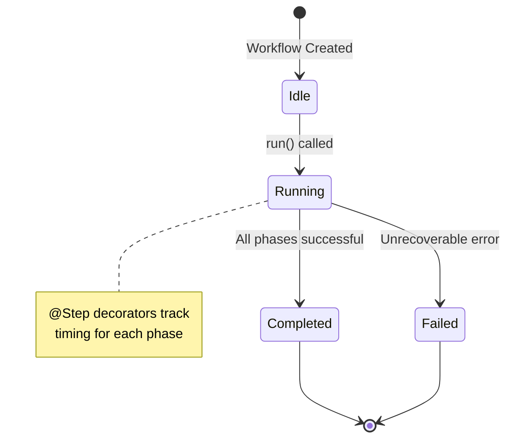
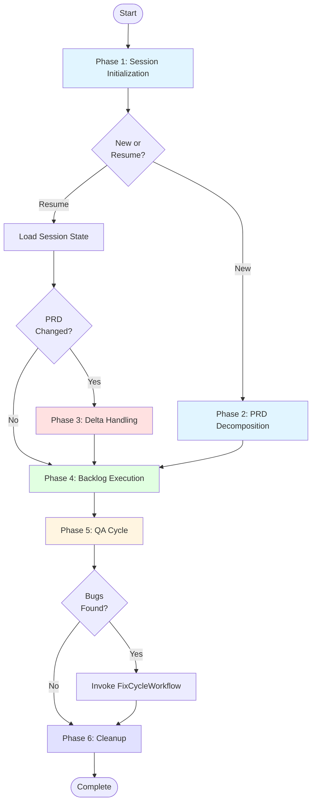
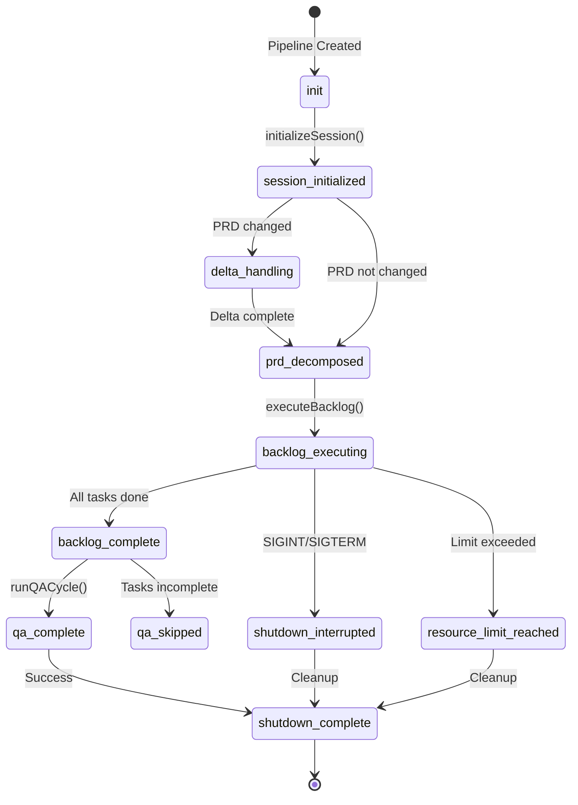
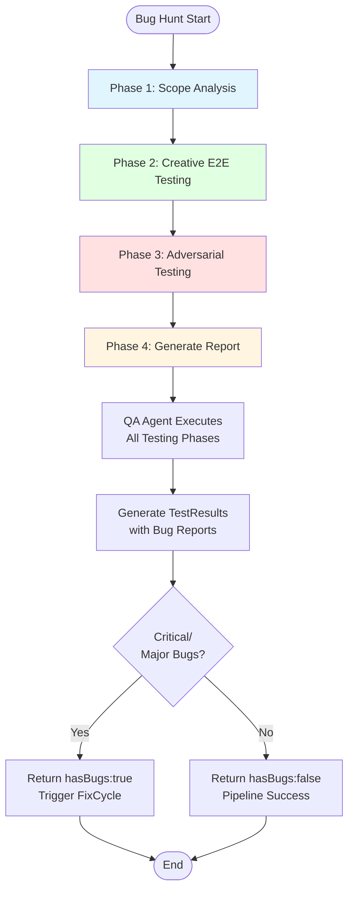
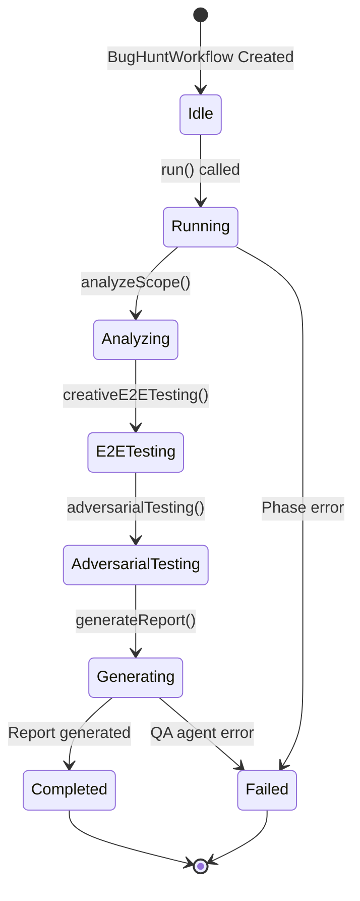
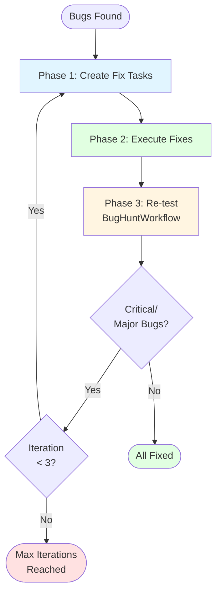
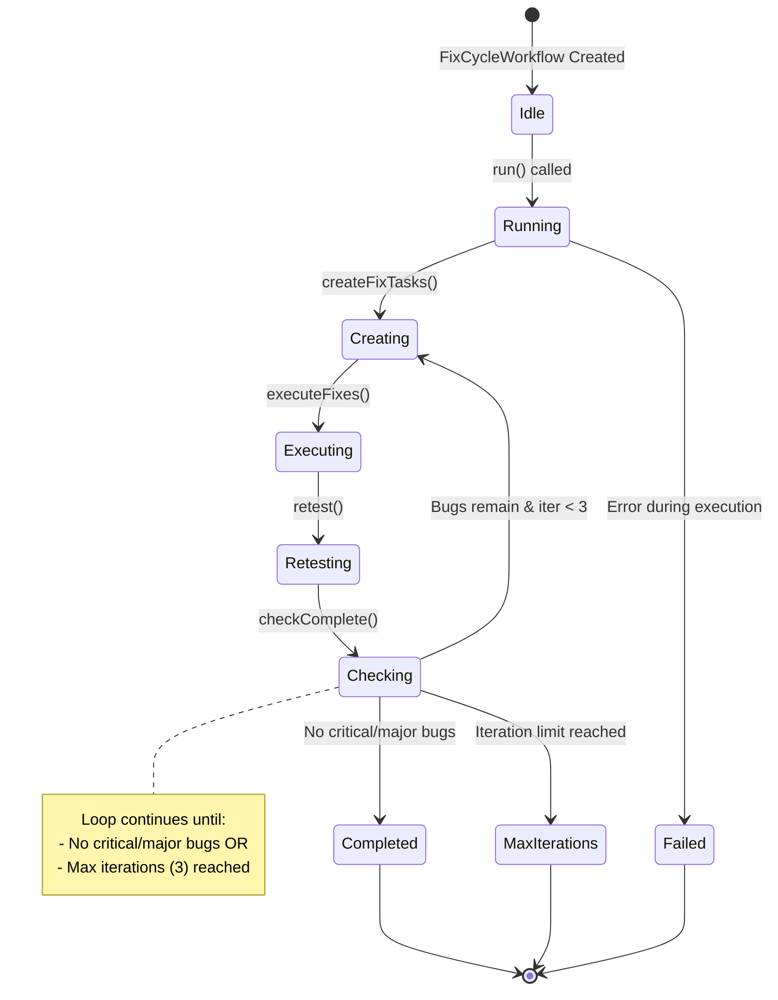
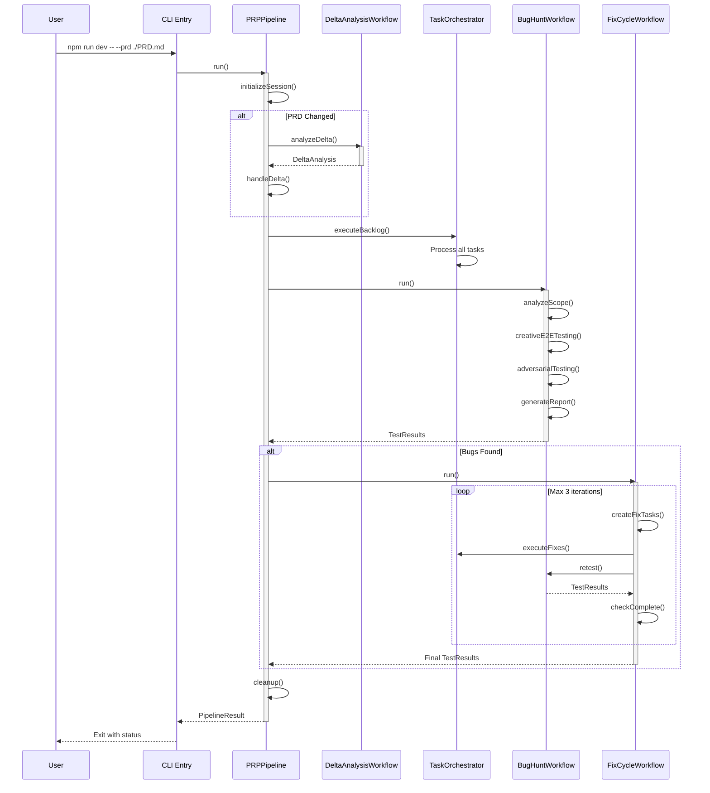
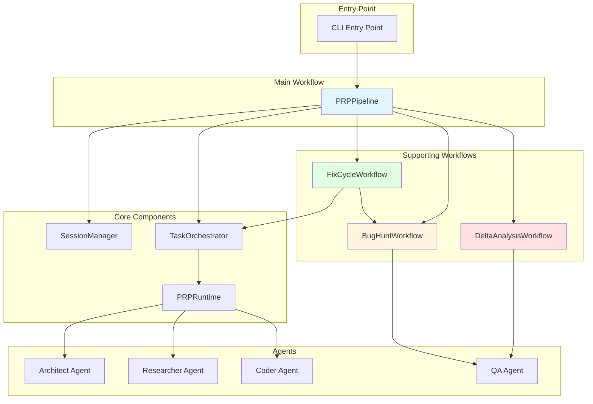

# Workflows

> Complete guide to the PRP Pipeline workflow system, including all workflows, their lifecycles, phases, and integration points.

**Status**: Published
**Last Updated**: 2026-01-23
**Version**: 1.0.0

## Table of Contents

- [Overview](#overview)
- [Workflow Architecture](#workflow-architecture)
  - [Groundswell Workflow Base Class](#groundswell-workflow-base-class)
  - [@Step Decorator Pattern](#step-decorator-pattern)
  - [State Management](#state-management)
  - [Common Workflow Patterns](#common-workflow-patterns)
- [PRPPipeline (Main Workflow)](#prppipeline-main-workflow)
  - [Lifecycle Overview](#lifecycle-overview)
  - [Phase 1: Session Initialization](#phase-1-session-initialization)
  - [Phase 2: PRD Decomposition](#phase-2-prd-decomposition)
  - [Phase 3: Delta Handling](#phase-3-delta-handling)
  - [Phase 4: Backlog Execution](#phase-4-backlog-execution)
  - [Phase 5: QA Cycle](#phase-5-qa-cycle)
  - [Phase 6: Cleanup](#phase-6-cleanup)
  - [State Machine](#state-machine)
  - [Timing Specifications](#timing-specifications)
- [DeltaAnalysisWorkflow](#deltaanalysisworkflow)
  - [Overview](#overview-1)
  - [Delta Session Flow](#delta-session-flow)
  - [PRD Comparison Process](#prd-comparison-process)
  - [DeltaAnalysis Output Structure](#deltaanalysis-output-structure)
  - [Integration with PRPPipeline](#integration-with-prppipeline)
  - [Parent-Child Session Linkage](#parent-child-session-linkage)
- [BugHuntWorkflow](#bughuntworkflow)
  - [Overview](#overview-2)
  - [4-Phase Testing Process](#4-phase-testing-process)
  - [State Machine](#state-machine-1)
  - [TestResults Severity Classification](#testresults-severity-classification)
  - [Bug Report Generation](#bug-report-generation)
  - [Critical File Signaling](#critical-file-signaling)
- [FixCycleWorkflow](#fixcycleworkflow)
  - [Overview](#overview-3)
  - [Iterative Loop Diagram](#iterative-loop-diagram)
  - [4-Step Breakdown](#4-step-breakdown)
  - [State Machine](#state-machine-2)
  - [Integration with TaskOrchestrator](#integration-with-taskorchestrator)
  - [Re-running BugHuntWorkflow](#re-running-bughuntworkflow)
  - [Stopping Condition](#stopping-condition)
- [Workflow Integration](#workflow-integration)
  - [Workflow Coordination](#workflow-coordination)
  - [Data Flow Between Workflows](#data-flow-between-workflows)
  - [Prompt-to-Workflow Mapping](#prompt-to-workflow-mapping)
  - [Component Interaction Diagram](#component-interaction-diagram)
- [Timing and Performance](#timing-and-performance)
  - [Timing Specifications Table](#timing-specifications-table)
  - [Expected Duration Ranges](#expected-duration-ranges)
  - [Timeout Configurations](#timeout-configurations)
  - [Performance Characteristics](#performance-characteristics)
- [Error Handling](#error-handling)
  - [Error Types and Recovery Strategies](#error-types-and-recovery-strategies)
  - [Retry Logic for Workflows](#retry-logic-for-workflows)
  - [State Transitions on Error](#state-transitions-on-error)
  - [Common Workflow Errors and Solutions](#common-workflow-errors-and-solutions)
- [See Also](#see-also)

---

## Overview

The PRP Pipeline uses a **workflow orchestration system** built on Groundswell to manage the complete development lifecycle from PRD to working code. There are **four main workflows** that coordinate to transform requirements into tested, working software.

| Workflow                  | Purpose                     | Phases                                                  |
| ------------------------- | --------------------------- | ------------------------------------------------------- |
| **PRPPipeline**           | Main orchestration workflow | 6 phases (init, breakdown, delta, execute, QA, cleanup) |
| **DeltaAnalysisWorkflow** | Handle PRD changes          | 1 phase (semantic PRD comparison)                       |
| **BugHuntWorkflow**       | QA testing and bug finding  | 4 phases (scope, creative E2E, adversarial, report)     |
| **FixCycleWorkflow**      | Iterative bug fixing        | 4 steps in a loop (create, execute, retest, check)      |

**Key Concepts:**

- **Immutability**: Sessions are immutable audit trails - once created, state never changes
- **Observability**: All phases use `@Step({ trackTiming: true })` decorators for automatic timing
- **Resilience**: Graceful shutdown support with state preservation for resumption
- **Quality**: Built-in QA workflow with adversarial testing mindset

---

## Workflow Architecture

### Groundswell Workflow Base Class

All workflows extend the Groundswell `Workflow` base class, which provides:

- **State Management**: Public state fields observable via the base class
- **Status Tracking**: `setStatus()` method for state transitions (idle → running → completed/failed)
- **Logging**: Built-in logger with structured logging support
- **Correlation IDs**: Automatic correlation ID generation for distributed tracing

```typescript
// Base class pattern used by all workflows
export class PRPPipeline extends Workflow {
  // Public observed state fields
  sessionManager: SessionManager;
  taskOrchestrator: TaskOrchestrator;
  currentPhase: string = 'init';

  constructor(prdPath: string, scope?: Scope) {
    super('PRPPipeline'); // Workflow name for observability
    // Initialize state...
  }
}
```

### @Step Decorator Pattern

The `@Step({ trackTiming: true })` decorator is used on all workflow phases to enable:

- **Automatic Timing**: Each phase's execution time is tracked automatically
- **Observability**: Phase names and durations logged for monitoring
- **Profiling**: Built-in performance profiling for optimization

```typescript
@Step({ trackTiming: true })
async initializeSession(): Promise<void> {
  // Phase implementation
  // Timing automatically tracked by Groundswell
}
```

**Timing Output Example:**

```
[Step] initializeSession completed in 2.3s
[Step] decomposePRD completed in 45.7s
[Step] executeBacklog completed in 312.1s
```

### State Management

All workflows follow the same state transition pattern:



**State Transitions:**

| Current State | Event               | Next State  | Action                     |
| ------------- | ------------------- | ----------- | -------------------------- |
| `idle`        | `run()`             | `running`   | Start phase execution      |
| `running`     | Phase complete      | `running`   | Continue to next phase     |
| `running`     | All phases complete | `completed` | Finalize and return result |
| `running`     | Fatal error         | `failed`    | Log error and cleanup      |

### Common Workflow Patterns

All workflows share these patterns:

1. **Input Validation**: Constructor validates required parameters
2. **Correlation Logging**: Child logger with correlation ID for tracing
3. **Step Methods**: Each phase is a separate method with `@Step` decorator
4. **Status Updates**: `this.setStatus()` for state transitions
5. **Error Handling**: Try-catch blocks with `setStatus('failed')` on error

---

## PRPPipeline (Main Workflow)

### Lifecycle Overview

The PRPPipeline orchestrates the complete development lifecycle from PRD to tested code.



### Phase 1: Session Initialization

**Duration:** ~2-5 seconds

**Purpose:** Create a new session or load an existing one for resumption.

**Entry Conditions:**

- PRD file path provided
- Plan directory exists or can be created
- Configuration loaded

**Process:**

1. Generate unique session ID (timestamp-based hash)
2. Create session directory structure (`plan/{sequence}_{hash}/`)
3. Initialize session state (tasks.json, session state)
4. Calculate PRD hash for change detection
5. Check for PRD changes and trigger delta if needed

**Exit Conditions:**

- Session directory created or loaded
- Session state initialized
- PRD hash calculated

**Output:**

- `plan/{sequence}_{hash}/tasks.json` - Task hierarchy
- `plan/{sequence}_{hash}/session-state.json` - Current session state
- `plan/{sequence}_{hash}/prd_snapshot.md` - PRD content for delta detection

**Decorator Pattern:**

```typescript
@Step({ trackTiming: true })
async initializeSession(): Promise<void> {
  // Session initialization logic
  const session = await this.sessionManager.initialize();
  // Create TaskOrchestrator
  this.taskOrchestrator = new TaskOrchestratorClass(
    this.sessionManager,
    this.#scope,
    this.#noCache
  );
}
```

### Phase 2: PRD Decomposition

**Duration:** ~30-120 seconds (depends on PRD complexity)

**Purpose:** Generate task backlog via Architect agent for new sessions.

**Entry Conditions:**

- Session initialized
- No existing backlog (new session)

**Process:**

1. Check if backlog already exists (skip if resuming)
2. Create Architect agent with task breakdown prompt
3. Call Architect agent to decompose PRD into hierarchy
4. Parse generated backlog from `$TASKS_FILE`
5. Save backlog to session via SessionManager

**Exit Conditions:**

- Task hierarchy generated (Phase > Milestone > Task > Subtask)
- Backlog saved to disk
- Total task count calculated

**Output:**

- `plan/{session}/tasks.json` - Complete task hierarchy
- Total tasks count for progress tracking

**Skip Condition:**

- Existing backlog found → Skip generation, resume execution

### Phase 3: Delta Handling

**Duration:** ~10-40 seconds

**Purpose:** Handle PRD changes via delta workflow when PRD is modified.

**Entry Conditions:**

- Session initialized
- PRD hash changed from previous session

**Process:**

1. Load old PRD from session snapshot
2. Load new PRD from disk
3. Extract completed task IDs
4. Run DeltaAnalysisWorkflow for semantic comparison
5. Apply patches to backlog via TaskPatcher
6. Create delta session with parent linkage
7. Save patched backlog to delta session

**Exit Conditions:**

- Delta session created
- Backlog patched with changes
- Parent session linked

**Output:**

- `plan/{new_session}/parent_session.txt` - Link to parent session
- Patched tasks.json with new/modified tasks

**Integration:**

```typescript
// Uses DeltaAnalysisWorkflow
const workflow = new DeltaAnalysisWorkflow(oldPRD, newPRD, completedTaskIds);
const delta: DeltaAnalysis = await workflow.run();
const patchedBacklog = patchBacklog(backlog, delta);
```

### Phase 4: Backlog Execution

**Duration:** Variable (depends on number of tasks)

**Purpose:** Execute all tasks in backlog via TaskOrchestrator.

**Entry Conditions:**

- Backlog available (from decomposition or delta)
- TaskOrchestrator initialized

**Process:**

1. Initialize progress tracker with backlog
2. Process items via `TaskOrchestrator.processNextItem()`
3. Update completed tasks count after each item
4. Check for resource limits after each task
5. Handle graceful shutdown (SIGINT/SIGTERM)
6. Continue until queue empty or shutdown requested

**Exit Conditions:**

- All tasks processed OR
- Resource limit reached OR
- Shutdown requested

**Output:**

- All subtasks executed (status: Complete or Failed)
- Progress tracked and logged
- State flushed to disk

**Graceful Shutdown:**

```typescript
// Check for shutdown request after each task
if (this.shutdownRequested) {
  this.logger.info('Shutdown requested, finishing current task');
  this.currentPhase = 'shutdown_interrupted';
  break;
}
```

### Phase 5: QA Cycle

**Duration:** ~60-300 seconds

**Purpose:** Run bug hunt and fix cycle to ensure quality.

**Entry Conditions:**

- Backlog execution complete
- Tasks either all Complete or in bug-hunt mode

**Behavior by Mode:**

| Mode       | Condition          | Action                    |
| ---------- | ------------------ | ------------------------- |
| `normal`   | All tasks Complete | Run QA bug hunt           |
| `normal`   | Tasks incomplete   | Skip QA                   |
| `bug-hunt` | Any state          | Run QA immediately        |
| `validate` | Any state          | Skip QA (validation only) |

**Process:**

1. **Bug Hunt Phase:**
   - Run BugHuntWorkflow with PRD + completed tasks
   - Generate TestResults with bug reports
2. **Fix Cycle Phase** (if bugs found):
   - Run FixCycleWorkflow to fix critical/major bugs
   - Iterate up to 3 times
3. **Report Phase:**
   - Write TEST_RESULTS.md if bugs remain
   - Print QA summary to console

**Exit Conditions:**

- QA cycle complete
- TEST_RESULTS.md written (if bugs found)
- Bug count tracked

**Output:**

- `plan/{session}/TEST_RESULTS.md` - Bug report (if bugs found)
- Console summary with bug counts

### Phase 6: Cleanup

**Duration:** ~1-5 seconds

**Purpose:** Preserve state and clean up resources before shutdown.

**Entry Conditions:**

- All phases complete or error occurred
- Runs in `finally` block (always executes)

**Process:**

1. Stop resource monitoring
2. Flush pending updates to disk
3. Save backlog with final state
4. Remove signal listeners (prevent memory leaks)
5. Generate error report if failures occurred
6. Generate resource limit report if triggered

**Exit Conditions:**

- State saved to disk
- Resources cleaned up
- Listeners removed

**Critical Files Never Deleted:**

- `tasks.json` - Single source of truth
- `prd_snapshot.md` - Used for delta detection
- `parent_session.txt` - Links delta sessions
- `TEST_RESULTS.md` - Bug report

**Decorator Pattern:**

```typescript
@Step({ trackTiming: true })
async cleanup(): Promise<void> {
  // Stop resource monitoring
  if (this.#resourceMonitor) {
    this.#resourceMonitor.stop();
  }
  // Flush pending updates
  await this.sessionManager.flushUpdates();
  // Save backlog
  await this.sessionManager.saveBacklog(backlog);
  // Remove signal listeners
  if (this.#sigintHandler) {
    process.off('SIGINT', this.#sigintHandler);
  }
}
```

### State Machine



### Timing Specifications

| Phase                  | Min Duration | Expected | Max Duration | Timeout      |
| ---------------------- | ------------ | -------- | ------------ | ------------ |
| Session Initialization | 2s           | 3s       | 5s           | 10s          |
| PRD Decomposition      | 30s          | 60s      | 120s         | 300s         |
| Delta Handling         | 10s          | 20s      | 40s          | 60s          |
| Backlog Execution      | Variable     | Variable | Variable     | Configurable |
| QA Cycle               | 60s          | 120s     | 300s         | 600s         |
| Cleanup                | 1s           | 2s       | 5s           | 10s          |

---

## DeltaAnalysisWorkflow

### Overview

The DeltaAnalysisWorkflow handles PRD changes by performing semantic comparison between old and new PRD versions. It generates structured patch instructions for updating the task backlog while preserving completed work.

**Key Characteristics:**

- Single-step workflow with `@Step` decorator
- Uses QA agent for semantic PRD comparison
- Returns structured `DeltaAnalysis` with changes
- Enables delta sessions to only re-execute affected tasks

### Delta Session Flow

```mermaid
flowchart LR
    Start([PRD Changed]) --> Load[Load Old PRD<br/>from Session]
    Load --> LoadNew[Load New PRD<br/>from Disk]
    LoadNew --> Extract[Extract Completed<br/>Task IDs]
    Extract --> Analyze[DeltaAnalysisWorkflow.<br/>analyzeDelta]
    Analyze --> Compare[QA Agent Compares<br/>PRDs Semantically]
    Compare --> Generate[Generate DeltaAnalysis<br/>Output]
    Generate --> Patch[Apply Patches to<br/>Backlog]
    Patch --> CreateSession[Create Delta Session<br/>with Parent Link]
    CreateSession --> Save[Save Patched<br/>Backlog]
    Save --> End([Delta Session Ready])

    style Analyze fill:#FFE1E1
    style Compare fill:#FFF5E1
```



### PRD Comparison Process

**Comparison Types:**

1. **New Requirements:** Features added to new PRD
2. **Modified Requirements:** Existing features changed
3. **Removed Requirements:** Features deleted (noted for awareness)

**Semantic Analysis:**

- Uses QA agent with `createDeltaAnalysisPrompt()`
- Compares PRD structure, not just text diff
- Identifies affected tasks based on requirement mapping
- Generates patch instructions for task updates

**DeltaAnalysis Output Structure:**

```typescript
interface DeltaAnalysis {
  changes: Array<{
    type: 'new' | 'modified' | 'removed';
    requirement: string;
    description: string;
  }>;
  taskIds: string[]; // Affected task IDs to re-execute
  patchInstructions: string; // Human-readable patch summary
}
```

### DeltaAnalysis Output Structure

**Example Output:**

```json
{
  "changes": [
    {
      "type": "new",
      "requirement": "User Authentication",
      "description": "Add OAuth2 login support"
    },
    {
      "type": "modified",
      "requirement": "API Endpoints",
      "description": "Add rate limiting to all endpoints"
    }
  ],
  "taskIds": ["P1.M1.T2", "P1.M2.T1.S3"],
  "patchInstructions": "Add OAuth2 login tasks, update API endpoint tasks with rate limiting"
}
```

### Integration with PRPPipeline

The PRPPipeline invokes DeltaAnalysisWorkflow in `handleDelta()` phase:

```typescript
// From PRPPipeline.handleDelta()
const workflow = new DeltaAnalysisWorkflow(oldPRD, newPRD, completedTaskIds);
const delta: DeltaAnalysis = await workflow.run();
const patchedBacklog = patchBacklog(backlog, delta);
await this.sessionManager.createDeltaSession(this.prdPath);
await this.sessionManager.saveBacklog(patchedBacklog);
```

### Parent-Child Session Linkage

Delta sessions maintain linkage to parent sessions via `parent_session.txt`:

```
plan/
├── 001_abc.../          # Parent session (original)
│   ├── tasks.json
│   └── prd_snapshot.md
└── 002_def.../          # Child session (delta)
    ├── parent_session.txt    # Contains "001_abc..."
    ├── tasks.json       # Patched backlog
    └── prd_snapshot.md  # New PRD
```

**Benefits:**

- Clear audit trail of PRD evolution
- Preserves completed work from parent
- Enables session chain navigation
- Supports delta-on-delta (chaining multiple deltas)

---

## BugHuntWorkflow

### Overview

The BugHuntWorkflow performs comprehensive QA testing using an adversarial mindset to find bugs beyond standard validation. It uses AI-powered testing with three distinct phases to uncover issues.

**Key Characteristics:**

- 4-phase workflow (analyze, E2E test, adversarial test, report)
- Uses QA agent with creative testing strategies
- Generates structured `TestResults` for bug fix pipeline
- Drives FixCycleWorkflow when bugs are found

### 4-Phase Testing Process



**Phase 1: Scope Analysis**

- Understand PRD requirements and expected behaviors
- Map requirements to implementation
- Identify user journeys and edge cases

**Phase 2: Creative E2E Testing**

- Happy path testing (primary use cases)
- Edge case testing (boundaries, empty inputs, unicode)
- Workflow testing (complete user journeys)
- Integration testing (component interactions)
- Error handling (graceful failures)
- State testing (transitions and persistence)
- Concurrency testing (parallel operations)

**Phase 3: Adversarial Testing**

- Unexpected inputs (undefined scenarios, malformed data)
- Missing features (PRD requirements not implemented)
- Incomplete features (partial implementations)
- Implicit requirements (obvious but unstated functionality)
- User experience issues (usability, intuitiveness)
- Security concerns (authentication, authorization)
- Performance issues (latency, resource usage)

**Phase 4: Generate Report**

- Execute QA agent with all test scenarios
- Generate structured `TestResults`
- Classify bugs by severity
- Provide fix recommendations

### State Machine



### TestResults Severity Classification

Bugs are classified into four severity levels:

| Severity     | Description               | Action Required           | Example                                 |
| ------------ | ------------------------- | ------------------------- | --------------------------------------- |
| **Critical** | Blocks core functionality | Must fix immediately      | App crashes on startup, data loss       |
| **Major**    | Significant impact on UX  | Should fix before release | Broken user workflow, incorrect results |
| **Minor**    | Small inconvenience       | Nice to fix               | UI glitch, suboptimal error message     |
| **Cosmetic** | Visual issues only        | Optional                  | Inconsistent styling, typo              |

**Severity Mapping in FixCycleWorkflow:**

```typescript
const severityToPoints: Record<Bug['severity'], number> = {
  critical: 13, // Highest priority
  major: 8,
  minor: 3,
  cosmetic: 1, // Lowest priority
};
```

### Bug Report Generation

**Bug Report Structure:**

```typescript
interface Bug {
  id: string; // Unique bug identifier
  severity: 'critical' | 'major' | 'minor' | 'cosmetic';
  title: string; // Brief bug description
  description: string; // Detailed explanation
  reproduction: string; // Steps to reproduce
  location?: string; // File/location of bug
}
```

**TEST_RESULTS.md Format:**

```markdown
# QA Test Results

**Generated**: 2026-01-23T12:34:56Z
**Total Bugs**: 3

## Summary

Found 1 critical bug, 1 major bug, 1 minor bug during comprehensive testing.

## Bug Breakdown

| Severity    | Count |
| ----------- | ----- |
| 🔴 Critical | 1     |
| 🟠 Major    | 1     |
| 🟡 Minor    | 1     |
| ⚪ Cosmetic | 0     |

## Bug Details

### 1. Database Connection Leak

**Severity**: Critical
**ID**: bug-001

Database connections remain open causing connection pool exhaustion.

**Reproduction**:

1. Run pipeline with `--scope P1.M1`
2. Check database connection count
3. Observe 100+ open connections

**Location**: src/services/database.ts:45

## Recommendations

- Fix critical database connection leak immediately
- Address major authentication issue before release
- Consider fixing minor UI issues for better UX
```

### Critical File Signaling

**IMPORTANT:** The presence or absence of `TEST_RESULTS.md` controls the bug fix pipeline:

- **File exists:** Critical/major bugs found → Trigger FixCycleWorkflow
- **File doesn't exist:** No critical/major bugs → Pipeline success

**Implementation:**

```typescript
if (finalResults.bugs.length > 0) {
  // Write TEST_RESULTS.md
  await writeFile(resultsPath, content, 'utf-8');
  this.logger.info(`TEST_RESULTS.md written to ${resultsPath}`);
}
```

---

## FixCycleWorkflow

### Overview

The FixCycleWorkflow orchestrates iterative bug fixing with a maximum of 3 iterations. It converts bugs to fix subtasks, executes them via TaskOrchestrator, and re-runs BugHuntWorkflow to verify fixes.

**Key Characteristics:**

- Loop-based workflow (max 3 iterations)
- Converts bugs to fix subtasks with severity-based story points
- Re-runs BugHuntWorkflow for verification
- Stops when no critical/major bugs remain

### Iterative Loop Diagram



### 4-Step Breakdown

**Phase 1: Create Fix Tasks**

- Convert each bug to a subtask-like fix task
- Assign story points based on severity (critical=13, major=8, minor=3, cosmetic=1)
- Generate ID format: `PFIX.M1.T{index}.S1`
- Include bug details in `context_scope`

**Phase 2: Execute Fixes**

- Execute fix tasks via TaskOrchestrator
- Handle failures gracefully (log error, continue with next fix)
- Track success/failure counts

**Phase 3: Re-test**

- Extract completed tasks from session
- Run BugHuntWorkflow again
- Generate new TestResults

**Phase 4: Check Completion**

- Return `true` if no critical/major bugs remain
- Return `false` if critical/major bugs still exist
- Loop back to Phase 1 if not complete and iterations < 3

### State Machine



### Integration with TaskOrchestrator

Fix tasks are executed via TaskOrchestrator, same as regular subtasks:

```typescript
// From FixCycleWorkflow.executeFixes()
for (const fixTask of this.#fixTasks) {
  try {
    await this.taskOrchestrator.executeSubtask(fixTask);
    successCount++;
  } catch (error) {
    failureCount++;
    // Don't throw - continue with next fix
    // Retest phase will catch remaining bugs
  }
}
```

**Fix Task Structure:**

```typescript
interface FixTask extends Subtask {
  id: string; // PFIX.M1.T{index}.S1
  title: string; // [BUG FIX] {bug.title}
  story_points: number; // Severity-based (13, 8, 3, 1)
  dependencies: string[]; // Empty (fix tasks are independent)
  context_scope: string; // Bug details + fix requirements
}
```

### Re-running BugHuntWorkflow

FixCycleWorkflow re-runs BugHuntWorkflow to verify fixes:

```typescript
// From FixCycleWorkflow.retest()
const bugHuntWorkflow = new BugHuntWorkflow(
  this.prdContent,
  completedTasks // Includes newly fixed tasks
);
const results = await bugHuntWorkflow.run();
this.currentResults = results;
```

**Retest Behavior:**

- Uses updated completed tasks (includes fixes)
- Runs same 4-phase testing process
- Generates new TestResults
- May find new bugs (regression testing)

### Stopping Condition

The fix cycle stops when:

1. **Success:** No critical or major bugs remain
2. **Max Iterations:** 3 iterations reached (regardless of bug state)

**Stopping Logic:**

```typescript
const hasCriticalOrMajor = this.currentResults.bugs.some(
  bug => bug.severity === 'critical' || bug.severity === 'major'
);

if (!hasCriticalOrMajor) {
  this.logger.info('All critical/major bugs resolved - fix cycle complete');
  break; // Exit loop
}

if (this.iteration >= this.maxIterations) {
  this.logger.warn(`Max iterations (${this.maxIterations}) reached`);
  break; // Exit loop with remaining bugs
}
```

**Tolerance:**

- Minor and cosmetic bugs are acceptable (don't trigger another iteration)
- Only critical and major bugs drive the fix cycle

---

## Workflow Integration

### Workflow Coordination

The PRPPipeline coordinates all workflows in a specific sequence:



### Data Flow Between Workflows

**PRPPipeline → DeltaAnalysisWorkflow:**

- Input: Old PRD, new PRD, completed task IDs
- Output: DeltaAnalysis with changes and affected tasks

**PRPPipeline → BugHuntWorkflow:**

- Input: PRD content, completed tasks
- Output: TestResults with bug reports

**BugHuntWorkflow → FixCycleWorkflow:**

- Input: TestResults (from bug hunt)
- Output: Final TestResults (after fixes)

**FixCycleWorkflow → BugHuntWorkflow:**

- Input: PRD content, completed tasks (including fixes)
- Output: New TestResults (verification)

**All Workflows → SessionManager:**

- All workflows save state via SessionManager
- State persisted to `plan/{session}/` directory
- Enables resumption and delta sessions

### Prompt-to-Workflow Mapping

| Prompt                        | Workflow Phase          | Used By                             |
| ----------------------------- | ----------------------- | ----------------------------------- |
| `TASK_BREAKDOWN_PROMPT`       | Phase 1: Task Breakdown | PRPPipeline.decomposePRD()          |
| `PRP_CREATE_PROMPT`           | Phase 2: PRP Generation | TaskOrchestrator (researcher agent) |
| `PRP_EXECUTE_PROMPT`          | Phase 3: Implementation | TaskOrchestrator (coder agent)      |
| `BUG_FINDING_PROMPT`          | Phase 4: Bug Hunt       | BugHuntWorkflow                     |
| `DELTA_PRD_GENERATION_PROMPT` | Delta Session           | DeltaAnalysisWorkflow               |
| `VALIDATION_PROMPT`           | QA Cycle                | PRPPipeline.runQACycle()            |

### Component Interaction Diagram



---

## Timing and Performance

### Timing Specifications Table

| Phase                     | Min Duration | Expected | Max Duration | Timeout      |
| ------------------------- | ------------ | -------- | ------------ | ------------ |
| **PRPPipeline**           |              |          |              |              |
| Session Initialization    | 2s           | 3s       | 5s           | 10s          |
| PRD Decomposition         | 30s          | 60s      | 120s         | 300s         |
| Delta Handling            | 10s          | 20s      | 40s          | 60s          |
| Backlog Execution         | Variable     | Variable | Variable     | Configurable |
| QA Cycle                  | 60s          | 120s     | 300s         | 600s         |
| Cleanup                   | 1s           | 2s       | 5s           | 10s          |
| **DeltaAnalysisWorkflow** |              |          |              |              |
| analyzeDelta              | 5s           | 15s      | 30s          | 60s          |
| **BugHuntWorkflow**       |              |          |              |              |
| Scope Analysis            | 2s           | 5s       | 10s          | 30s          |
| E2E Testing               | 3s           | 10s      | 20s          | 60s          |
| Adversarial Testing       | 3s           | 10s      | 20s          | 60s          |
| Generate Report           | 10s          | 30s      | 60s          | 120s         |
| **FixCycleWorkflow**      |              |          |              |              |
| Create Fix Tasks          | 1s           | 2s       | 5s           | 10s          |
| Execute Fixes             | Variable     | Variable | Variable     | Configurable |
| Re-test                   | 60s          | 120s     | 300s         | 600s         |
| Check Completion          | 1s           | 2s       | 5s           | 10s          |

### Expected Duration Ranges

**Small Project (10-20 subtasks):**

- PRD Decomposition: 30-60s
- Backlog Execution: 5-15 minutes
- QA Cycle: 60-120s
- **Total: 10-20 minutes**

**Medium Project (20-50 subtasks):**

- PRD Decomposition: 60-120s
- Backlog Execution: 20-45 minutes
- QA Cycle: 120-300s
- **Total: 30-60 minutes**

**Large Project (50-100+ subtasks):**

- PRD Decomposition: 120-300s
- Backlog Execution: 60-120+ minutes
- QA Cycle: 300-600s
- **Total: 2-4+ hours**

### Timeout Configurations

Timeouts are configurable via environment variables:

```bash
# API request timeout (default: 60 seconds)
export API_TIMEOUT_MS=120000  # 2 minutes for complex tasks

# Resource limits
# Max tasks to execute
--max-tasks 50

# Max duration in milliseconds
--max-duration 3600000  # 1 hour
```

### Performance Characteristics

**Performance Optimization Features:**

1. **PRP Caching:**
   - Generated PRPs cached and reused
   - Cache key based on task content + dependencies
   - Target: >80% cache hit ratio for re-runs

2. **I/O Batching:**
   - State updates batched in memory
   - Single atomic write to disk
   - Typical efficiency: 95-98% (fewer file operations)

3. **Parallel Research:**
   - Research next task while current executes (N+1 pattern)
   - Max concurrent research: 3 PRP generations
   - Benefit: 30-50% reduction in total time

**Performance Metrics:**

```bash
# Enable verbose mode for metrics
npm run dev -- --prd ./PRD.md --verbose

# Example output:
[TaskOrchestrator] Cache metrics: hits=47, misses=3, hitRatio=94.0%
[SessionManager] Batch write complete: 50 items in 1 operation (98% efficiency)
[ResearchQueue] Stats: queued=2, researching=3, cached=45
```

---

## Error Handling

### Error Types and Recovery Strategies

**PipelineError Hierarchy:**

```typescript
// Base error class
class PipelineError extends Error {
  code: string;
  fatal: boolean;
}

// Error types
class TaskError extends PipelineError     // Task execution failures
class AgentError extends PipelineError    // Agent invocation failures
class ValidationError extends PipelineError // PRD/validation failures
class SessionError extends PipelineError  // Session management failures
```

**Recovery Strategies:**

| Error Type           | Fatal | Recovery Strategy                |
| -------------------- | ----- | -------------------------------- |
| `TaskError`          | No    | Log error, continue to next task |
| `AgentError`         | No    | Retry with exponential backoff   |
| `ValidationError`    | Yes   | Abort pipeline, fix PRD          |
| `SessionError`       | Yes   | Abort pipeline, check filesystem |
| `ResourceLimitError` | No    | Graceful shutdown, save state    |

### Retry Logic for Workflows

**Agent Prompt Retry:**

```typescript
// From utils/retry.ts
async function retryAgentPrompt<T>(
  promptFn: () => Promise<T>,
  context: { agentType: string; operation: string }
): Promise<T> {
  const maxRetries = 3;
  let lastError: Error;

  for (let attempt = 1; attempt <= maxRetries; attempt++) {
    try {
      return await promptFn();
    } catch (error) {
      lastError = error;
      if (attempt < maxRetries) {
        // Exponential backoff
        await delay(Math.pow(2, attempt) * 1000);
      }
    }
  }

  throw new AgentError(
    `${context.agentType} ${context.operation} failed after ${maxRetries} attempts`,
    { cause: lastError }
  );
}
```

**Retry Configuration:**

- Max retries: 3 attempts
- Backoff strategy: Exponential (2^n seconds)
- Applies to: All agent prompt() calls

### State Transitions on Error

**Normal Flow:**

```
idle → running → completed
```

**Error Flow:**

```
idle → running → failed
```

**Error Handling in PRPPipeline:**

```typescript
try {
  await this.initializeSession();
  await this.decomposePRD();
  await this.executeBacklog();
  await this.runQACycle();
  this.setStatus('completed');
} catch (error) {
  this.setStatus('failed');
  await this.#generateErrorReport(); // Always generate report
  return {
    success: false,
    error: error.message,
    // ... other fields
  };
} finally {
  await this.cleanup(); // Always cleanup
}
```

**Continue-on-Error Mode:**

```bash
# Treat all errors as non-fatal
npm run dev -- --prd ./PRD.md --continue-on-error
```

With `--continue-on-error`:

- Task failures tracked but don't abort pipeline
- Error report generated at end
- Useful for gathering maximum feedback

### Common Workflow Errors and Solutions

#### "Session not found"

**What you see:**

```bash
[Session Manager] Session not found
Error: Cannot resume session
```

**Why it happens:**

- Using `--continue` without an existing session
- Session directory was deleted
- PRD hash doesn't match any existing session

**How to fix:**

```bash
# List available sessions
ls plan/

# Use correct PRD path for existing session
npm run dev -- --prd ./PRD.md

# Or start fresh (don't use --continue)
npm run dev -- --prd ./PRD.md
```

#### "PRD hash changed"

**What you see:**

```bash
[Session Manager] PRD hash changed
```

**Why it happens:**

- PRD was modified between runs

**How to fix:**

```bash
# Delta mode runs automatically
# Or explicitly:
npm run dev -- --prd ./PRD.md --mode delta
```

#### "Agent timeout"

**What you see:**

```bash
Error: Agent request timed out after 60000ms
```

**Why it happens:**

- LLM API request took too long
- Complex task requires more time

**How to fix:**

```bash
# Increase timeout
export API_TIMEOUT_MS=120000

# Or simplify PRD/task scope
```

#### "Resource limit reached"

**What you see:**

```bash
[PRPPipeline] Resource limit reached, initiating graceful shutdown
```

**Why it happens:**

- File handle limit exceeded
- Max tasks limit reached
- Max duration limit reached

**How to fix:**

```bash
# Resume from where it stopped
npm run dev -- --prd ./PRD.md --continue

# Or increase limits
npm run dev -- --prd ./PRD.md --max-tasks 100 --max-duration 7200000
```

---

## See Also

- **[README.md](../README.md)** - Project overview and quick start
- **[Installation Guide](./INSTALLATION.md)** - Setup instructions for the development environment
- **[Configuration Reference](./CONFIGURATION.md)** - Environment variables and configuration options
- **[Quick Start Tutorial](./QUICKSTART.md)** - Get started in under 5 minutes
- **[CLI Reference](./CLI_REFERENCE.md)** - Command-line interface for invoking workflows
- **[User Guide](./user-guide.md)** - Comprehensive usage documentation for advanced features
- **[PROMPTS.md](../PROMPTS.md)** - Complete prompt definitions used by workflows
- **[src/workflows/](../src/workflows/)** - Source code for all workflow implementations

**Workflow-Related Documentation:**

- **Session Management** - See [User Guide > Session Management](./user-guide.md#2-session-management)
- **Delta Workflow** - See [User Guide > Delta Workflow](./user-guide.md#3-delta-workflow)
- **QA and Bug Hunt** - See [User Guide > QA and Bug Hunt](./user-guide.md#5-qa-and-bug-hunt)
- **Scope-Based Execution** - See [User Guide > Scope-Based Execution](./user-guide.md#4-scope-based-execution)
