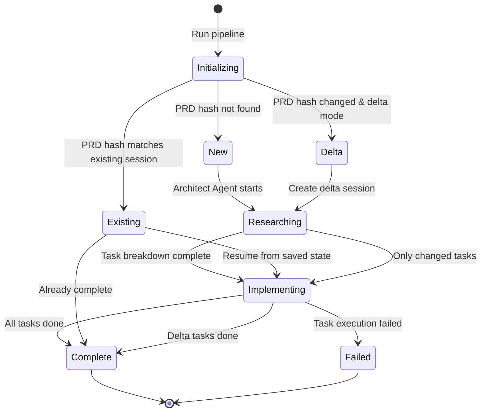
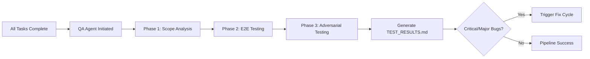
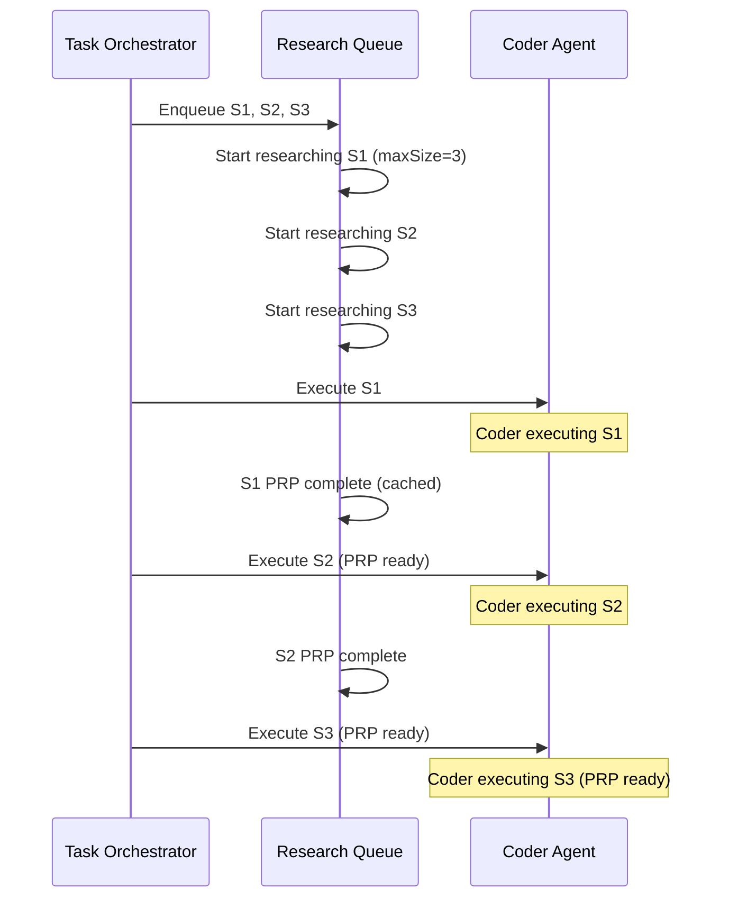

# User Guide

This guide provides comprehensive documentation for advanced features of the PRP Pipeline. If you're new to the system, start with the [README](../README.md) Quick Start section.

## Table of Contents

- [1. Writing PRDs](#1-writing-prds)
  - [PRD Structure](#prd-structure)
  - [Best Practices](#best-practices-for-writing-prds)
  - [Research-Driven Architecture](#research-driven-architecture)
  - [Example PRD](#example-prd-structure)
  - [Common Pitfalls](#common-prd-pitfalls)
- [2. Session Management](#2-session-management)
  - [What is a Session?](#what-is-a-session)
  - [Session Directory Structure](#session-directory-structure)
  - [Session Lifecycle](#session-lifecycle)
  - [State Persistence](#state-persistence)
- [3. Delta Workflow](#3-delta-workflow)
  - [What Are Delta Sessions?](#what-are-delta-sessions)
  - [When to Use Delta Mode](#when-to-use-delta-mode)
  - [Step-by-Step Delta Workflow](#step-by-step-delta-workflow)
  - [Delta Session Chaining](#delta-session-chaining)
  - [Example: Adding a New Feature](#example-adding-a-new-feature)
- [4. Scope-Based Execution](#4-scope-based-execution)
  - [Scope Syntax Reference](#scope-syntax-reference)
  - [Phase Execution](#phase-execution)
  - [Milestone Execution](#milestone-execution)
  - [Task Execution](#task-execution)
  - [Subtask Execution](#subtask-execution)
  - [Use Cases](#scope-use-cases)
- [5. QA and Bug Hunt](#5-qa-and-bug-hunt)
  - [QA Workflow Overview](#qa-workflow-overview)
  - [4-Level Validation System](#4-level-validation-system)
  - [Bug Hunt Mode](#bug-hunt-mode)
  - [Interpreting TEST_RESULTS.md](#interpreting-test_resultsmd)
- [6. Troubleshooting](#6-troubleshooting)
  - [Quick Diagnostics](#quick-diagnostics)
  - [Common Issues](#common-issues)
  - [Error Messages Reference](#error-messages-reference)
  - [Getting Help](#getting-help)
- [7. Performance Tuning](#7-performance-tuning)
  - [PRP Caching](#prp-caching)
  - [I/O Batching](#io-batching)
  - [Parallel Research](#parallel-research)
  - [Environment Optimization](#environment-optimization)
  - [Metrics and Monitoring](#metrics-and-monitoring)
- [8. Migration Guide (v0 to v1)](#8-migration-guide-v0-to-v1)
  - [What's Changed](#whats-changed)
  - [Breaking Changes](#breaking-changes)
  - [Command Mapping](#command-mapping)
  - [Feature Comparison](#feature-comparison)
  - [Rollback Procedures](#rollback-procedures)

---

## 1. Writing PRDs

A well-written PRD is the foundation of successful autonomous development with the PRP Pipeline. This section covers how to write effective PRDs that the Architect Agent can decompose into implementable tasks.

### PRD Structure

Based on the [master PRD](../PRD.md), a comprehensive PRD should include these sections:

1. **Executive Summary** (1-2 paragraphs)
   - High-level overview of what you're building
   - Primary goals and success metrics

2. **Core Philosophy & Concepts**
   - Key architectural decisions
   - Design principles guiding the implementation

3. **System Architecture**
   - Components and their relationships
   - Data models and interfaces

4. **Functional Requirements**
   - Detailed feature specifications
   - User stories and use cases

5. **User Workflows**
   - How users interact with the system
   - Step-by-step user journeys

6. **Critical Prompts** (if applicable)
   - Agent personas and constraints
   - Special requirements for AI agents

### Best Practices for Writing PRDs

#### 1. Be Specific and Measurable

**Poor:**

```markdown
The system should be fast.
```

**Better:**

```markdown
The system should respond to API requests within 100ms for 95% of requests.
```

#### 2. Include Acceptance Criteria

Each feature should have clear acceptance criteria:

```markdown
## Feature: User Authentication

**Acceptance Criteria:**

- [ ] Users can log in with email/password
- [ ] Session tokens expire after 24 hours
- [ ] Failed login attempts are logged
- [ ] Password reset flow works end-to-end
```

#### 3. Define the Context Scope

The Architect Agent will validate your PRD against the current codebase. Help it by:

- Providing context about existing code to integrate with
- Specifying which components are new vs. modifications
- Including relevant file paths and patterns to follow

#### 4. Research-Driven Architecture

**NEW PRIORITY:** The Architect Agent now researches the codebase **before** breaking down your PRD. This means:

- **No vacuum development**: Requirements must match codebase reality
- **Pre-validation**: Subagents research feasibility during planning
- **Architectural persistence**: Research findings stored in `$SESSION_DIR/architecture/`

**What you should do:**

- Clearly specify which parts of the codebase are relevant
- Include links to existing documentation or examples
- Mention any external dependencies or APIs

#### 5. Tests Are Implicit

**Do NOT create tasks for "Write Tests".** Testing is part of every subtask's workflow:

- **Implied workflow**: Write failing test → Implement → Pass test → Refactor
- **Definition of Done**: Code is incomplete without passing tests

The Coder Agent automatically includes test creation as part of implementation.

### Example PRD Structure

```markdown
# My Feature PRD

## Executive Summary

Build a real-time notification system that delivers messages to users via WebSocket connections. The system must support 10,000 concurrent connections with sub-100ms latency.

## Core Philosophy

- **Real-time first**: All notifications delivered within 100ms
- **Reliability**: Guaranteed delivery with at-least-once semantics
- **Scalability**: Horizontal scaling with connection pooling

## System Architecture

### Components

1. **WebSocket Gateway** (`src/websocket/gateway.ts`)
   - Manages WebSocket connections
   - Handles connection lifecycle (connect, disconnect, heartbeat)

2. **Notification Service** (`src/services/notification.ts`)
   - Queues and delivers notifications
   - Manages user subscription state

3. **Message Broker** (Redis Pub/Sub)
   - Distributes messages between services
   - Handles connection state synchronization

## Functional Requirements

### 1. Connection Management

**User Story:** As a user, I want to maintain a persistent connection so I receive real-time updates.

**Acceptance Criteria:**

- [ ] WebSocket connections established at `/ws`
- [ ] Automatic reconnection with exponential backoff
- [ ] Heartbeat every 30 seconds to detect stale connections

### 2. Message Delivery

**User Story:** As a user, I want to receive notifications instantly when they're sent.

**Acceptance Criteria:**

- [ ] Messages delivered within 100ms 95% of the time
- [ ] At-least-once delivery guarantee
- [ ] Deduplication of duplicate messages

## User Workflows

### Connection Flow

1. User connects to `/ws?token=xxx`
2. Server authenticates token
3. Connection established, user subscribed to their channel
4. User receives real-time notifications
5. On disconnect, client auto-reconnects

### Notification Flow

1. Backend publishes message to Redis
2. WebSocket Gateway receives message
3. Gateway finds user's active connection
4. Message sent to user's WebSocket
5. Acknowledgment sent back to Redis
```

### Common PRD Pitfalls

| Pitfall                              | Consequence             | Solution                          |
| ------------------------------------ | ----------------------- | --------------------------------- |
| Over-specifying implementation       | Limits agent creativity | Focus on WHAT, not HOW            |
| Under-specifying acceptance criteria | Ambiguous success       | Add specific, measurable criteria |
| Missing architectural context        | Implementation drift    | Include system overview           |
| Ignoring existing codebase           | Conflicts and rework    | Research before planning          |
| Creating "write tests" tasks         | Redundant work          | Tests are implicit                |

---

## 2. Session Management

Sessions are the foundational unit of state management in the PRP Pipeline. Understanding how sessions work is critical for effective pipeline usage.

### What is a Session?

A **session** is an immutable audit trail of a PRD execution. It captures:

- **PRD Snapshot**: Exact content of the PRD at session creation
- **Task Hierarchy**: Complete breakdown of work (tasks.json)
- **Architecture Research**: Findings from the Architect Agent's research phase
- **Generated PRPs**: All Product Requirement Prompts for subtasks
- **Execution State**: Status of every task (Planned, Researching, Implementing, Complete, Failed)

**Key Characteristics:**

- **Immutable**: Once created, session state never changes
- **Persistent**: All state saved to disk for resumption
- **Hash-based**: Sessions identified by PRD content hash (SHA-256)
- **Chainable**: Delta sessions link to parent sessions

### Session Directory Structure

Sessions are stored in `plan/{sequence}_{hash}/`:

```bash
plan/
├── 001_14b9dc2a33c7/          # Session 1 (initial)
│   ├── tasks.json              # Single source of truth for task state
│   ├── prd_snapshot.md         # PRD content at session creation
│   ├── parent_session.txt      # (Optional) Parent session ID for delta sessions
│   ├── architecture/           # Architect Agent's research findings
│   │   ├── system_context.md   # Codebase architecture overview
│   │   └── external_deps.md    # External dependencies research
│   ├── PRP/                    # Generated PRPs for each subtask
│   │   ├── P1.M1.T1.S1.md
│   │   ├── P1.M1.T1.S2.md
│   │   └── ...
│   ├── artifacts/              # Generated artifacts (if any)
│   └── docs/                   # Documentation generated during session
└── 002_a3f8e2b1d4c/          # Session 2 (delta from session 1)
    ├── tasks.json
    ├── prd_snapshot.md
    ├── parent_session.txt      # Contains "001_14b9dc2a33c7"
    └── ...
```

**Key Files:**

| File                 | Purpose                         | Mutable                                      |
| -------------------- | ------------------------------- | -------------------------------------------- |
| `tasks.json`         | Task hierarchy and status       | **Never delete** during cleanup              |
| `prd_snapshot.md`    | PRD content for delta detection | **Never delete** during cleanup              |
| `parent_session.txt` | Links delta sessions            | **Never delete** during cleanup              |
| `PRP/*.md`           | Generated PRPs                  | Can be cached, regenerated with `--no-cache` |

### Session Lifecycle



**Session States:**

1. **Initializing**: PRD hash computed, checking for existing sessions
2. **Researching**: Architect Agent researching codebase and breaking down PRD
3. **Implementing**: Task Orchestrator executing tasks
4. **Complete**: All tasks successfully executed
5. **Failed**: One or more tasks failed (requires manual intervention)

### State Persistence

**How State is Saved:**

The Session Manager uses atomic write operations to prevent data corruption:

```typescript
// Batching: Multiple status updates accumulated in memory
await sessionManager.updateItemStatus('P1.M1.T1.S1', 'Complete');
await sessionManager.updateItemStatus('P1.M1.T1.S2', 'Complete');

// Flush: Single atomic write to disk
await sessionManager.flushUpdates();
```

**Benefits:**

- **Performance**: Reduces filesystem operations by batching updates
- **Safety**: Atomic writes prevent partial state corruption
- **Recovery**: State recoverable even if process crashes

**Graceful Shutdown:**

Press `Ctrl+C` to gracefully shutdown:

1. Current task completes
2. Batched updates flushed to disk
3. Session state preserved for resumption

Resume with `--continue` flag:

```bash
npm run dev -- --prd ./PRD.md --continue
```

**NEVER Manually Edit:**

- `tasks.json` - The single source of truth
- `prd_snapshot.md` - Used for delta detection
- `parent_session.txt` - Links delta sessions

Manual editing corrupts session state and causes undefined behavior.

---

## 3. Delta Workflow

Delta sessions allow you to modify your PRD mid-project and only re-execute the changes, preserving completed work.

### What Are Delta Sessions?

A **delta session** is a new session linked to a parent session that:

1. **Compares** old PRD vs. new PRD
2. **Identifies** new, modified, and removed requirements
3. **Preserves** completed work from the parent session
4. **Only executes** tasks affected by changes

**Key Benefits:**

- **Time Savings**: Don't re-execute completed tasks
- **Cost Savings**: Fewer LLM API calls
- **Traceability**: Clear audit trail of what changed and when

### When to Use Delta Mode

Use delta mode when:

- You've discovered a **missing requirement**
- You need to **modify** an existing feature
- You want to **remove** something you no longer need
- Requirements have **evolved** based on learning

**Automatic Detection:**

Delta mode is automatically triggered when the PRD hash changes. You can also explicitly request delta mode:

```bash
npm run dev -- --prd ./PRD.md --mode delta
```

### Step-by-Step Delta Workflow

**Step 1: Modify your PRD**

```bash
# Edit your PRD
vim PRD.md
```

**Step 2: Run the pipeline**

```bash
# Delta mode is automatic when PRD changes
npm run dev -- --prd ./PRD.md
```

**Step 3: Observe delta session creation**

```
[Session Manager] PRD hash changed
[Session Manager] Creating delta session: plan/002_newhash/
[Delta Analysis] Comparing PRDs...
[Delta Analysis] Found 3 new requirements, 2 modified, 1 removed
[Task Orchestrator] Updating task hierarchy...
```

**Step 4: Only changed tasks execute**

The system skips completed tasks and only executes:

- New tasks (for new requirements)
- Modified tasks (for changed requirements)
- Dependencies of the above

### Delta Session Chaining

You can chain multiple delta sessions:

```
session1 (initial) → delta1 (first change) → delta2 (second change)
```

Each delta session:

- Links to its parent via `parent_session.txt`
- Preserves all completed work
- Can be independently resumed

**Example Chain:**

```bash
# Initial session
npm run dev -- --prd ./PRD.md  # Creates 001_abc...

# Add feature X
vim PRD.md  # Add feature X
npm run dev -- --prd ./PRD.md  # Creates 002_def... (child of 001_abc...)

# Modify feature Y
vim PRD.md  # Modify feature Y
npm run dev -- --prd ./PRD.md  # Creates 003_ghi... (child of 002_def...)
```

### Example: Adding a New Feature

**Before (original PRD):**

```markdown
## Features

### User Authentication

- Email/password login
- Session management
```

**After (modified PRD):**

```markdown
## Features

### User Authentication

- Email/password login
- Session management
- **Two-factor authentication (NEW)**
```

**Result:**

1. Delta session created: `plan/002_newhash/`
2. New task added for 2FA
3. Existing tasks preserved (not re-executed)
4. Only new 2FA task executes

**Session Structure:**

```
plan/
├── 001_abc.../          # Original session
│   ├── tasks.json       # Contains original tasks
│   └── prd_snapshot.md  # Original PRD
└── 002_def.../          # Delta session
    ├── parent_session.txt    # Contains "001_abc..."
    ├── tasks.json       # Original + new 2FA task
    └── prd_snapshot.md  # Modified PRD
```

---

## 4. Scope-Based Execution

Execute specific portions of your project using scope syntax. This is useful for working on individual features, debugging, or testing.

### Scope Syntax Reference

| Scope     | Format                | Example       | Executes                                         |
| --------- | --------------------- | ------------- | ------------------------------------------------ |
| Phase     | `P{N}`                | `P1`          | All tasks in Phase 1                             |
| Milestone | `P{N}.M{N}`           | `P1.M1`       | All tasks in Milestone 1 of Phase 1              |
| Task      | `P{N}.M{N}.T{N}`      | `P1.M1.T1`    | All subtasks in Task 1 of Milestone 1 of Phase 1 |
| Subtask   | `P{N}.M{N}.T{N}.S{N}` | `P1.M1.T1.S1` | Only Subtask 1                                   |
| All       | `all`                 | `all`         | Entire backlog                                   |

**Important:** Scope is case-sensitive. Use exact format with uppercase P, M, T, S.

### Phase Execution

Execute all milestones, tasks, and subtasks within a phase:

```bash
npm run dev -- --prd ./PRD.md --scope P1
```

**Use Cases:**

- Working on a major project phase
- Testing phase-level integration
- Phased rollout strategy

**What Happens:**

1. Task Orchestrator builds execution queue from all items in Phase 1
2. Executes items in dependency order (depth-first, pre-order)
3. Completes when all Phase 1 items are Complete

### Milestone Execution

Execute all tasks and subtasks within a milestone:

```bash
npm run dev -- --prd ./PRD.md --scope P3.M4
```

**Use Cases:**

- Implementing a specific feature milestone
- Milestone-level testing
- Sprint-based development

**Example:**

```bash
# Run only the API Milestone in Phase 3
npm run dev -- --prd ./PRD.md --scope P3.M2
```

### Task Execution

Execute all subtasks within a task:

```bash
npm run dev -- --prd ./PRD.md --scope P1.M1.T1
```

**Use Cases:**

- Completing a specific task
- Re-running a failed task
- Task-level debugging

**Example:**

```bash
# Re-run the Database Setup task
npm run dev -- --prd ./PRD.md --scope P2.M1.T3 --verbose
```

### Subtask Execution

Execute a single subtask:

```bash
npm run dev -- --prd ./PRD.md --scope P1.M1.T1.S1
```

**Use Cases:**

- Debugging a specific subtask
- Re-running a failed subtask
- Testing an isolated change

**Example:**

```bash
# Re-run a failed subtask with verbose output
npm run dev -- --prd ./PRD.md --scope P1.M1.T1.S1 --verbose --no-cache
```

### Scope Use Cases

**Development:**

```bash
# Work on a specific feature (milestone scope)
npm run dev -- --prd ./PRD.md --scope P1.M2
```

**Debugging:**

```bash
# Re-run a failing task
npm run dev -- --prd ./PRD.md --scope P1.M1.T3 --verbose
```

**Testing:**

```bash
# Execute a subset for validation
npm run dev -- --prd ./PRD.md --scope P1 --dry-run
```

**Demo:**

```bash
# Prepare specific functionality for demo
npm run dev -- --prd ./PRD.md --scope P2.M3.T2
```

---

## 5. QA and Bug Hunt

Quality assurance is built into the PRP Pipeline through a multi-phase validation system and dedicated QA Agent.

### QA Workflow Overview

The QA workflow runs automatically when all tasks are Complete:



### 4-Level Validation System

Each subtask goes through progressive validation gates:

#### Level 1: Syntax & Style (Immediate Feedback)

Run after each file creation:

```bash
# TypeScript type checking
npm run typecheck

# Linting (if configured)
npm run lint

# Formatting checks
npm run format:check
```

**Expected:** Zero syntax errors, zero type errors

**If Failing:**

- Fix syntax issues
- Fix type annotations
- Re-run validation

#### Level 2: Unit Tests (Component Validation)

Test each component as created:

```bash
# Run all tests
npm test

# Run specific test
npm test -- path/to/test.test.ts

# Run with coverage
npm run test:coverage
```

**Expected:** All tests pass

**If Failing:**

- Fix failing tests
- Ensure test coverage is adequate
- Re-run validation

#### Level 3: Integration Tests (System Validation)

Test component interactions:

```bash
# Run integration tests
npm run test:integration

# Test service startup
npm run test:startup

# Test API endpoints
npm run test:api
```

**Expected:** All integrations working, no connection errors

**If Failing:**

- Check service configuration
- Verify environment variables
- Test API connectivity

#### Level 4: Manual/E2E (Creative Validation)

Domain-specific validation:

```bash
# Run E2E tests
npm run test:e2e

# Manual testing
# - Test user workflows from documentation
# - Verify creative functionality
# - Check performance requirements
```

**Expected:** All creative validations pass, performance meets requirements

**If Failing:**

- Review requirements
- Update implementation
- Add additional tests

### Bug Hunt Mode

Run QA even with incomplete tasks:

```bash
npm run dev -- --prd ./PRD.md --mode bug-hunt
```

**What Happens:**

1. QA Agent analyzes PRD requirements
2. Tests completed tasks against requirements
3. Performs creative E2E testing
4. Performs adversarial testing
5. Generates `TEST_RESULTS.md` if bugs found

**Bug Hunt Phases:**

**Phase 1: Scope Analysis**

- Understand PRD requirements
- Map requirements to implementation
- Identify expected behaviors

**Phase 2: E2E Testing**

- Happy path testing (primary use cases)
- Edge case testing (boundaries, empty inputs, unicode)
- Workflow testing (complete user journeys)
- Integration testing (component interactions)
- Error handling (graceful failures)
- State testing (transitions and persistence)

**Phase 3: Adversarial Testing**

- Unexpected inputs (undefined scenarios)
- Missing features (PRD requirements not implemented)
- Incomplete features (partial implementations)
- User experience issues (usability)

### Interpreting TEST_RESULTS.md

**If File Exists:** Critical/major bugs were found

**If File Doesn't Exist:** No critical/major bugs (success!)

**Example Bug Report:**

```markdown
# Bug Fix Requirements

## Overview

Found 3 critical bugs, 2 major bugs, 1 minor bug.

## Critical Issues (Must Fix)

### Issue 1: Database Connection Leak

**Severity**: Critical
**PRD Reference**: Section 4.2 - Connection Management

**Expected Behavior**: Database connections should be properly closed after use.

**Actual Behavior**: Connections remain open, causing connection pool exhaustion.

**Steps to Reproduce**:

1. Run pipeline with `--scope P1.M1`
2. Check database connection count
3. Observe 100+ open connections

**Suggested Fix**: Implement connection pooling with proper lifecycle management.

## Major Issues (Should Fix)

[...]
```

**Severity Levels:**

| Severity | Meaning                   | Action Required           |
| -------- | ------------------------- | ------------------------- |
| Critical | Blocks core functionality | Must fix immediately      |
| Major    | Significant impact on UX  | Should fix before release |
| Minor    | Small inconvenience       | Nice to fix               |
| Cosmetic | Visual issues only        | Optional                  |

---

## 6. Troubleshooting

This section helps you diagnose and resolve common issues organized by **symptom** (what you see), not internal cause.

### Quick Diagnostics

```bash
# Run with verbose output
npm run dev -- --prd ./PRD.md --verbose

# Dry run to see what would happen
npm run dev -- --prd ./PRD.md --dry-run

# Check session state
cat plan/001_hash/tasks.json | jq '.backlog[] | select(.status == "Failed")'
```

### Common Issues

#### "Pipeline won't start"

**What you see:**

```bash
$ npm run dev -- --prd ./PRD.md
Error: PRD file not found
```

**Why it happens:**
The PRD file path is incorrect or the file doesn't exist.

**How to fix:**

```bash
# Use absolute or relative path
npm run dev -- --prd /full/path/to/PRD.md

# Or verify current directory
pwd
ls PRD.md
```

---

#### "Task fails repeatedly"

**What you see:**

```
[Task Orchestrator] P1.M1.T1.S1 failed
[Task Orchestrator] Retrying...
[Task Orchestrator] P1.M1.T1.S1 failed
```

**Why it happens:**
The PRP for this task may have incomplete context, or there's a genuine implementation issue.

**How to fix:**

```bash
# 1. Check the PRP for this task
cat plan/001_hash/PRP/P1.M1.T1.S1.md

# 2. Look for missing context or unclear instructions
# 3. Re-run the specific subtask with verbose mode
npm run dev -- --prd ./PRD.md --scope P1.M1.T1.S1 --verbose --no-cache

# 4. If PRP is incomplete, manually enhance it or fix the implementation
```

---

#### "Slow performance"

**What you see:**
Pipeline takes much longer than expected.

**Why it happens:**

- Large PRD with many tasks
- No caching enabled
- Sequential execution without parallel research

**How to fix:**

```bash
# 1. Use scope to execute smaller portions
npm run dev -- --prd ./PRD.md --scope P1

# 2. Verify caching is enabled (default)
# Check for cache hits in verbose output

# 3. Use faster models for non-critical tasks
export ANTHROPIC_DEFAULT_HAIKU_MODEL="glm-4.5-air"

# 4. Run in parallel (if your project allows)
# Split into smaller PRDs for parallel execution
```

---

#### "Session not found"

**What you see:**

```bash
[Session Manager] Session not found
Error: Cannot resume session
```

**Why it happens:**

- Using `--continue` without an existing session
- Session directory was deleted
- PRD hash doesn't match any existing session

**How to fix:**

```bash
# 1. List available sessions
ls plan/

# 2. Use correct PRD path for existing session
npm run dev -- --prd ./PRD.md

# 3. Or start fresh (don't use --continue)
npm run dev -- --prd ./PRD.md
```

---

#### "Delta session not detecting changes"

**What you see:**
Delta mode runs but no new tasks are created despite PRD changes.

**Why it happens:**

- PRD changes don't affect requirements (e.g., formatting only)
- Delta analysis didn't detect semantic changes

**How to fix:**

```bash
# 1. Verify PRD actually changed
git diff PRD.md

# 2. Make sure changes affect functional requirements
# (Not just formatting or comments)

# 3. Force full re-run if needed (bypass delta)
npm run dev -- --prd ./PRD.md --scope all
```

---

#### "Agent seems stuck"

**What you see:**
No output for extended period during agent execution.

**Why it happens:**

- LLM API request is taking time
- Agent is processing complex task
- Network connectivity issue

**How to fix:**

```bash
# 1. Enable verbose mode to see progress
npm run dev -- --prd ./PRD.md --verbose

# 2. Check API connectivity
curl https://api.z.ai/api/anthropic/v1/messages

# 3. Increase timeout if needed (environment variable)
export API_TIMEOUT_MS=120000

# 4. Use --continue to resume if stuck
# Press Ctrl+C for graceful shutdown, then:
npm run dev -- --prd ./PRD.md --continue
```

### Error Messages Reference

| Error                         | Meaning                   | Solution                                |
| ----------------------------- | ------------------------- | --------------------------------------- |
| `PRD hash changed`            | PRD was modified          | Run in delta mode or continue           |
| `Session not found`           | Invalid session directory | Check --continue or run fresh           |
| `Scope parse error`           | Invalid scope syntax      | Use format: P1, P1.M1, P1.M1.T1.S1      |
| `Agent timeout`               | LLM request took too long | Increase API_TIMEOUT_MS or simplify PRP |
| `Cannot create delta session` | No current session loaded | Run normal mode first                   |

### Getting Help

If you can't resolve the issue:

1. **Enable verbose mode:** `--verbose` flag
2. **Check logs:** Session directory contains execution logs
3. **Search issues:** [GitHub Issues](https://github.com/YOUR_USERNAME/hacky-hack/issues)
4. **Create issue:** Include verbose output and PRD snippet

**When creating an issue, include:**

```bash
# Generate diagnostic info
npm run dev -- --prd ./PRD.md --verbose > debug.log 2>&1

# Include in your issue:
# - Relevant portion of debug.log
# - PRD section (sanitized)
# - Steps to reproduce
# - Expected vs actual behavior
```

---

## 7. Performance Tuning

The PRP Pipeline includes several performance optimizations. Understanding and tuning these can significantly improve execution speed for large projects.

### PRP Caching

**What's Cached:**

Generated PRPs are cached and reused based on task content and dependencies.

**Cache Key:**

```typescript
// Cache key is computed from:
// - Task title
// - Task description
// - Dependency IDs
// - Task content hash

const cacheKey = hash(`${task.title}${task.description}${task.dependencies}`);
```

**Cache Behavior:**

```bash
# First run: Cache MISS (generates PRP)
$ npm run dev -- --prd ./PRD.md --scope P1.M1.T1
[ResearchQueue] Cache MISS - PRP will be generated

# Second run: Cache HIT (reuses PRP)
$ npm run dev -- --prd ./PRD.md --scope P1.M1.T1
[ResearchQueue] Cache HIT - using cached PRP
```

**Bypass Cache:**

```bash
# Force PRP regeneration
npm run dev -- --prd ./PRD.md --no-cache
```

**Cache Invalidation:**

Cache is automatically invalidated when:

- Task content changes
- Dependencies change
- Task is modified during delta session

**Metrics:**

```bash
# Check cache effectiveness (verbose mode)
$ npm run dev -- --prd ./PRD.md --verbose
[TaskOrchestrator] Cache metrics: hits=45, misses=5, hitRatio=90.0%
```

**Target:** >80% cache hit ratio for re-runs

### I/O Batching

**What It Is:**

State updates are batched in memory and flushed to disk in a single atomic write operation.

**How It Works:**

```typescript
// Multiple status updates accumulated in memory
await sessionManager.updateItemStatus('P1.M1.T1.S1', 'Complete');
await sessionManager.updateItemStatus('P1.M1.T1.S2', 'Complete');
await sessionManager.updateItemStatus('P1.M1.T1.S3', 'Complete');

// Single atomic write to disk
await sessionManager.flushUpdates();
// Log: "Batch write complete: 3 items in 1 operation (2 write ops saved)"
```

**Benefits:**

- **Performance**: Reduces filesystem operations by N-1 (where N = number of updates)
- **Safety**: Atomic writes prevent partial state corruption
- **Efficiency**: Particularly impactful for large projects with many subtasks

**Metrics:**

```bash
# Check batching effectiveness (verbose mode)
$ npm run dev -- --prd ./PRD.md --verbose
[SessionManager] Batch write complete: 50 items in 1 operation (98% efficiency)
```

**When to Tune:**

For very large projects (100+ subtasks), batching is automatically effective. No manual tuning required.

### Parallel Research

**What It Is:**

Research next task while current task executes (N+1 pattern).

**How It Works:**



**Concurrency Limit:**

Default is 3 concurrent PRP generations. Adjust in code if needed:

```typescript
// In task-orchestrator.ts
this.researchQueue = new ResearchQueue(
  this.sessionManager,
  3, // <-- Max concurrent research
  this.#noCache
);
```

**Fire-and-Forget Pattern:**

```typescript
// Trigger background research (don't await)
this.researchQueue.processNext(this.#backlog).catch(error => {
  // Log errors but don't block execution
  this.#logger.error({ error }, 'Background research error');
});
```

**Benefits:**

- **Reduced Latency**: Next task's PRP ready when current task completes
- **Better Resource Utilization**: LLM API calls happen in parallel
- **Faster Overall Execution**: 30-50% reduction in total time for large projects

### Environment Optimization

**Model Selection:**

Use faster models for non-critical operations:

```bash
# Use Haiku for simple operations
export ANTHROPIC_DEFAULT_HAIKU_MODEL="glm-4.5-air"

# Use Sonnet for most operations (default)
export ANTHROPIC_DEFAULT_SONNET_MODEL="glm-4.7"

# Use Opus for Architect (default)
export ANTHROPIC_DEFAULT_OPUS_MODEL="glm-4.7"
```

**API Timeout:**

Increase timeout for complex tasks:

```bash
# Default: 60 seconds
export API_TIMEOUT_MS=60000

# For complex tasks: 120 seconds
export API_TIMEOUT_MS=120000
```

**Base URL:**

Use faster API endpoint if available:

```bash
# Default
export ANTHROPIC_BASE_URL="https://api.z.ai/api/anthropic"

# Alternative (if available)
export ANTHROPIC_BASE_URL="https://fast-api.example.com"
```

### Metrics and Monitoring

**Enable Verbose Logging:**

```bash
npm run dev -- --prd ./PRD.md --verbose
```

**Key Metrics to Track:**

| Metric                     | Target | How to Measure                        |
| -------------------------- | ------ | ------------------------------------- |
| Cache Hit Ratio            | >80%   | Verbose logs show "Cache metrics"     |
| Batch Efficiency           | >95%   | Verbose logs show "Batch write" stats |
| Research Queue Utilization | >50%   | Verbose logs show queue stats         |
| Task Execution Time        | Varies | Per-task timing in logs               |

**Example Metrics Output:**

```
[TaskOrchestrator] Cache metrics: hits=47, misses=3, hitRatio=94.0%
[SessionManager] Batch write complete: 50 items in 1 operation (98% efficiency)
[ResearchQueue] Stats: queued=2, researching=3, cached=45
```

**Performance Tips for Large Projects:**

1. **Use Scope**: Execute in phases rather than all-at-once
2. **Enable Caching**: Don't use `--no-cache` unless necessary
3. **Leverage Delta**: Use delta mode for PRD changes
4. **Optimize Models**: Use faster models where appropriate
5. **Monitor Metrics**: Track cache hit ratio and batch efficiency

---

## 8. Migration Guide (v0 to v1)

This guide helps you migrate from the bash version (v0) to the TypeScript implementation (v1).

### What's Changed

| Aspect                | v0 (Bash)           | v1 (TypeScript)       |
| --------------------- | ------------------- | --------------------- |
| **Runtime**           | Bash script         | Node.js / TypeScript  |
| **Invocation**        | `./prp-pipeline.sh` | `npm run dev --`      |
| **Configuration**     | Shell functions     | Environment variables |
| **State**             | JSON files          | Same + enhanced       |
| **Performance**       | Sequential          | Parallel + caching    |
| **Session Directory** | `.sessions/`        | `plan/`               |

### Breaking Changes

#### 1. Command Invocation

**Before (v0):**

```bash
./prp-pipeline.sh --prd PRD.md
```

**After (v1):**

```bash
npm run dev -- --prd PRD.md
# Note the -- separator for npm scripts
```

**Why:** npm requires `--` to separate npm options from script options

#### 2. Session Directory

**Before (v0):**

```
.sessions/
└── hash/
```

**After (v1):**

```
plan/
└── 001_hash/
```

**Why:** Clearer naming, sequence numbers for ordering

#### 3. Configuration

**Before (v0):**

```bash
# Edited in script
PRP_MODEL="claude-sonnet-4"
```

**After (v1):**

```bash
# Environment variables
export ANTHROPIC_DEFAULT_SONNET_MODEL="glm-4.7"
```

**Why:** Standard configuration pattern, easier to manage

### Command Mapping

| v0 Command          | v1 Equivalent    | Notes              |
| ------------------- | ---------------- | ------------------ |
| `./prp-pipeline.sh` | `npm run dev --` | Use -- for options |
| `--continue`        | `--continue`     | Same               |
| `--scope P1`        | `--scope P1`     | Same               |
| N/A                 | `--dry-run`      | New feature        |
| N/A                 | `--no-cache`     | New feature        |
| N/A                 | `--mode delta`   | New feature        |

### Feature Comparison

**Same Features:**

- PRD decomposition
- Task hierarchy (Phase > Milestone > Task > Subtask)
- Scope-based execution
- Session persistence
- Graceful shutdown

**New Features in v1:**

- **PRP Caching**: Generated PRPs cached and reused
- **I/O Batching**: State updates batched for performance
- **Parallel Research**: Research next task while current executes
- **Delta Sessions**: Automatic PRD change detection
- **Graceful Shutdown**: Completes current task on Ctrl+C
- **Better Logging**: Structured logging with correlation IDs
- **Type Safety**: TypeScript for compile-time error detection

**Removed Features:**

- None - feature parity maintained

### Before/After Examples

**Running a Milestone:**

**Before (v0):**

```bash
./prp-pipeline.sh --prd PRD.md --scope P1.M1
```

**After (v1):**

```bash
npm run dev -- --prd PRD.md --scope P1.M1
# Same scope syntax, different invocation
```

**Resuming a Session:**

**Before (v0):**

```bash
./prp-pipeline.sh --prd PRD.md --continue
```

**After (v1):**

```bash
npm run dev -- --prd PRD.md --continue
# Identical command syntax
```

**Delta Session:**

**Before (v0):**

```bash
# Not supported in v0
```

**After (v1):**

```bash
# Automatic when PRD changes
npm run dev -- --prd PRD.md --mode delta
```

### Rollback Procedures

**If you need to revert to v0:**

```bash
# 1. Checkout v0 tag
git checkout v0

# 2. Use bash script
./prp-pipeline.sh --prd PRD.md

# 3. To return to v1
git checkout main
```

**Data Compatibility:**

Sessions are **NOT** compatible between v0 and v1 due to internal changes. You'll need to start a new session when upgrading.

**Migration Path:**

```bash
# 1. Backup existing sessions (optional)
cp -r .sessions sessions_backup

# 2. Checkout v1
git checkout main

# 3. Install dependencies
npm install

# 4. Run new version (creates new session)
npm run dev -- --prd PRD.md

# 5. Old sessions remain in .sessions/ for reference
```

---

**For more information:**

- [README.md](../README.md) - Quick Start and basic features
- [PRD.md](../PRD.md) - Master requirements document
- [PROMPTS.md](../PROMPTS.md) - System prompts and PRP concept

**Need help?**

- Check the [Troubleshooting](#6-troubleshooting) section
- [GitHub Issues](https://github.com/YOUR_USERNAME/hacky-hack/issues)
- [Diátaxis Framework](https://documentation.divio.com/) - Documentation best practices
