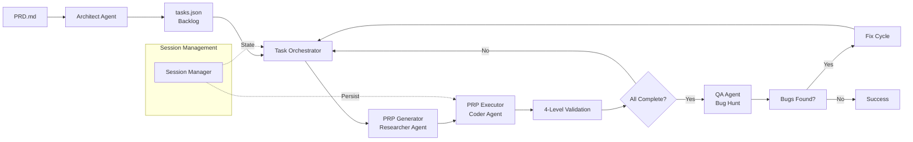

name: "P5.M3.T1.S1: Create README.md"
description: |

---

## Goal

**Feature Goal**: Create a comprehensive, professional README.md that serves as the user's first introduction to the PRP Pipeline system.

**Deliverable**:

1. Enhanced `README.md` in project root with all required sections
2. Professional badge cluster (CI, coverage, version, security)
3. Clear Quick Start guide with time-to-first-success under 2 minutes
4. Comprehensive usage examples (basic, scoped, delta, bug-hunt)
5. Configuration guide with all environment variables and model options
6. Architecture overview with Mermaid diagram
7. Contributing guidelines
8. Proper license information

**Success Definition**:

- README.md follows modern open source best practices (2025-2026 standards)
- All sections from the work item description are present and complete
- CLI examples are accurate and tested against actual implementation
- Architecture diagram accurately reflects system components
- Badges link to valid URLs (or use placeholders for future CI)
- Content passes "No Prior Knowledge" test for new users
- Zero broken markdown links

## User Persona

**Target User**: Developers and technical project managers who want to use autonomous AI agents to implement software projects from PRDs.

**Use Case**: A user discovers this project on GitHub and needs to quickly understand:
1. What this tool does
2. How to get it running
3. How to use it for their own project
4. Whether it's production-ready

**User Journey**:

1. User finds project on GitHub/GitLab
2. Scans badge cluster for build status, version, license
3. Reads "What is PRP Pipeline?" section
4. Follows Quick Start to install and run first pipeline
5. Explores usage examples for their specific use case
6. Checks configuration for environment setup
7. Reviews architecture to understand how it works
8. Decides whether to use or contribute

**Pain Points Addressed**:

- **Poor documentation** is the #1 reason developers abandon open source tools
- **Complex agentic systems** are hard to understand without clear explanations
- **Missing configuration docs** cause frustration during setup
- **No examples** makes it hard to know how to use the tool

## Why

- **First Impressions Matter**: README is often the deciding factor for adoption
- **Adoption Barrier**: Clear documentation reduces time-to-first-success from hours to minutes
- **Trust Building**: Professional README signals project maturity and quality
- **Reduced Support**: Good docs answer common questions before they're asked
- **Community Growth**: Contributors need clear guidance on how to participate
- **Dependency Chain**: P5.M3.T1.S2 (User Guide) will build upon this README foundation

## What

Create/enhance README.md with comprehensive documentation covering all aspects of the PRP Pipeline system.

### Success Criteria

- [ ] Badge cluster with CI, coverage, version, license badges
- [ ] Project description with clear value proposition
- [ ] Quick Start with < 2 minute time-to-first-success
- [ ] Features list highlighting 4 engines, delta sessions, QA bug hunt
- [ ] Usage examples for basic, scoped, delta, and bug-hunt modes
- [ ] Configuration guide with all environment variables
- [ ] Architecture overview with Mermaid diagram
- [ ] Contributing guidelines section
- [ ] License information (MIT)
- [ ] All CLI examples tested against actual implementation
- [ ] All internal links work (no broken anchors)

---

## All Needed Context

### Context Completeness Check

_A implementing agent has everything needed: existing README structure, CLI command reference from source code, architecture documentation, system features, package.json metadata, and README best practices research._

### Documentation & References

```yaml
# MUST READ - Current README Structure
- file: README.md
  why: Base document to enhance - preserves existing structure while adding missing sections
  pattern: Badge cluster, Quick Start, Features, Usage, Architecture sections
  gotcha: Don't remove existing content - enhance and complete it

# MUST READ - Package Metadata
- file: package.json
  why: Source of truth for project name, version, dependencies, scripts, license
  section: name, version, description, scripts, keywords, license fields
  gotcha: Use actual scripts from package.json in examples

# MUST READ - CLI Implementation
- file: src/cli/index.ts
  why: Actual CLI command definitions and options - must match documentation
  pattern: Commander.js option definitions, help text
  section: Lines with .option(), .argument() for all CLI flags
  gotcha: Documentation must match actual CLI behavior

# MUST READ - System Architecture
- docfile: plan/001_14b9dc2a33c7/architecture/system_context.md
  why: Complete architecture overview for Architecture section
  section: System Components, Workflows, Agent System
  critical: Contains ASCII diagrams that can be converted to Mermaid

# MUST READ - System Prompts (PRP Concept)
- file: PROMPTS.md
  why: Source material for explaining PRP concept in user-friendly terms
  section: PRP_README (Concept Definition)
  critical: Defines what a PRP is and why context matters

# MUST READ - README Best Practices Research
- docfile: docs/README_BEST_PRACTICES_RESEARCH.md
  why: Industry standards for 2025-2026 README formatting
  section: Badge Standards, Quick Start, Usage Examples, Architecture Overview
  critical: Contains specific badge URLs and formatting patterns

# MUST READ - Previous Work Item (Parallel Context)
- docfile: plan/001_14b9dc2a33c7/P5M2T2S1/PRP.md
  why: Understanding of batch state updates feature (may be mentioned)
  section: Deliverable section
  gotcha: This PRP assumes P5.M2.T2.S1 will be complete (I/O batching implemented)

# MUST READ - Task Status Summary
- docfile: plan/001_14b9dc2a33c7/tasks.json
  why: Current system status - all phases through P5.M2 should be complete
  section: Full backlog status
  gotcha: README should reflect the current state (all features listed should work)

# MUST READ - Pipeline Source
- file: src/workflows/prp-pipeline.ts
  why: Main entry point - understand the pipeline flow
  pattern: PRPPipeline class, run() method, signal handlers
  section: Class structure and main workflow methods

# MUST READ - Agent System
- file: src/agents/agent-factory.ts
  why: Understanding the 4 agent types (Architect, Researcher, Coder, QA)
  pattern: createArchitectAgent, createResearcherAgent, createCoderAgent, createQAAgent
  section: Agent factory functions and model assignments

# MUST READ - Session Manager
- file: src/core/session-manager.ts
  why: Understanding session model, delta sessions, persistence
  pattern: initializeSession(), createDeltaSession(), loadSession()
  section: Session initialization and delta detection methods

# MUST READ - Task Orchestrator
- file: src/core/task-orchestrator.ts
  why: Understanding scope-based execution, task hierarchy
  pattern: executeScope(), executeSubtask(), dependency resolution
  section: Scope execution and task iteration methods

# REFERENCE - Badge Standards
- url: https://img.shields.io
  why: Generic badge service for node, license badges
  critical: Use for static badges (node version, license)

- url: https://badge.fury.io
  why: npm version badge service
  critical: Use for package version badge (will show placeholder until published)

- url: https://github.com/community/community/blob/main/adrs/0025-repository-badges.md
  why: GitHub's official badge standards documentation
  section: Recommended badge services and formats

# REFERENCE - Mermaid.js (for diagrams)
- url: https://mermaid.js.org/syntax/flowchart.html
  why: Syntax for architecture diagrams (natively supported on GitHub)
  critical: Use flowchart LR for left-to-right architecture diagrams
  section: Flowchart syntax, subgraph syntax for component grouping

# REFERENCE - Markdown Best Practices
- url: https://github.com/alex-page/github-awesome-markdown
  why: Collection of markdown patterns used in top GitHub projects
  section: Badge clusters, TOC, code blocks, tables, diagrams
```

### Current Codebase Tree

```bash
# Project Root Structure
hacky-hack/
├── README.md              # MODIFY: Enhance with comprehensive sections
├── PRD.md                 # Reference: Example PRD
├── PROMPTS.md             # Reference: PRP concept definition
├── package.json           # Reference: Scripts, version, metadata
├── tsconfig.json          # Reference: TypeScript version
├── vitest.config.ts       # Reference: Test configuration
├── src/
│   ├── cli/               # Reference: CLI implementation
│   │   └── index.ts       # MUST READ: CLI options
│   ├── agents/            # Reference: 4 agent types
│   ├── core/              # Reference: Session management, task orchestrator
│   ├── tools/             # Reference: MCP tools (bash, filesystem, git)
│   ├── workflows/         # Reference: Main pipeline
│   └── config/            # Reference: Environment configuration
├── plan/                  # Reference: Session directories
│   └── 001_14b9dc2a33c7/  # Current session
│       ├── architecture/  # Reference: System context docs
│       └── docs/          # Reference: Implementation docs
└── docs/                  # REFERENCE: README research stored here
    └── README_BEST_PRACTICES_RESEARCH.md
```

### Desired Codebase Tree

```bash
# No new directories - only modifying README.md

# Modified files:
README.md                 # ENHANCE: Add all sections from work item description

# Research artifacts (already created):
plan/001_14b9dc2a33c7/P5M3T1S1/
└── research/             # Research directory for this work item
    └── (research files stored during PRP creation)
```

### Known Gotchas & Library Quirks

```markdown
# CRITICAL: README.md Formatting Gotchas

# 1. GitHub Flavored Markdown (GFM) - This is GitHub
# - Uses GitHub Flavored Markdown, not standard Markdown
# - Supports: task lists, tables, strikethrough, autolinks
# - Supports: Mermaid diagrams (use ```mermaid blocks)
# - Does NOT support: HTML comments in some contexts
# Gotcha: Test Mermaid diagrams in GitHub preview before finalizing

# 2. Badge Link Formats
# - Shields.io uses flat-square style for modern look
# - All badges should be clickable links
# - Group related badges with <br/> for logical rows
# Pattern: [](link_url)
# Gotcha: Use placeholder URLs for CI until workflows are set up

# 3. Code Block Language Tags
# - Use specific language tags for syntax highlighting
# - bash for shell commands, typescript for TS code, json for JSON
# - sh-session for terminal sessions with prompts (like oclif)
# Pattern: ```bash, ```typescript, ```json
# Gotcha: Don't use ```sh for interactive terminal - use ```sh-session or just show bash

# 4. Anchor Links
# - GitHub auto-generates anchors from headers
# - Format: #header-name with lowercase, hyphens for spaces
# - Special characters are stripped
# Pattern: ## Quick Start → #quick-start
# Gotcha: Test internal links after creating - GitHub may format differently

# 5. Relative Links
# - Use relative paths for internal docs
# - Pattern: [Architecture](#architecture), [PROMPTS.md](PROMPTS.md)
# - For subdirectories: [Docs](docs/README.md)
# Gotcha: Don't use absolute paths for repository links

# 6. Code Examples in README
# - Must match actual implementation exactly
# - Verify all CLI commands work before adding
# - Use actual output from real runs
# Pattern: Run `npm run dev -- --help` to get actual options
# Gotcha: Documentation lying about features destroys trust

# 7. CLI Options from package.json Scripts
# - Scripts section has actual command patterns
# - npm run dev is the main entry point
# - All options use -- separator for npm scripts
# Pattern: npm run dev -- [options]
# Gotcha: Don't forget the -- separator in examples

# 8. Environment Variables
# - ANTHROPIC_API_KEY is the primary credential
# - ANTHROPIC_BASE_URL defaults to z.ai endpoint
# - Model tiers: opus (GLM-4.7), sonnet (GLM-4.7), haiku (GLM-4.5-Air)
# Pattern: Document all three with model naming
# Gotcha: z.ai is the Anthropic-compatible provider, not api.anthropic.com

# 9. Scope Format
# - Scope syntax: P1 (phase), P1.M1 (milestone), P1.M1.T1 (task), P1.M1.T1.S1 (subtask)
# - Use 'all' for complete execution
# Pattern: --scope P3.M4 for milestone execution
# Gotcha: Scope parsing is case-sensitive, use exact format

# 10. Mode Options
# - normal: Standard PRP pipeline execution
# - bug-hunt: Run QA even with incomplete tasks
# - validate: Skip QA, validate only
# Pattern: --mode bug-hunt
# Gotcha: bug-hunt mode will run QA on incomplete work (intentional)

# 11. Session Persistence
# - Sessions stored in plan/{sequence}_{hash}/
# - tasks.json is the single source of truth
# - Delta sessions link via delta_from.txt
# Pattern: Explain session directory structure clearly
# Gotcha: Users may not understand where sessions are stored

# 12. Four Agent Types
# - Architect: Creates task hierarchy from PRD
# - Researcher: Generates PRPs from tasks
# - Coder: Implements PRPs (the Builder)
# - QA: Bug hunting and validation
# Pattern: Use consistent capitalization and naming
# Gotcha: "Researcher" is the PRP generator, "Coder" is the PRP executor

# 13. 4-Level Validation
# - Level 1: Syntax & Style (linting, type check)
# - Level 2: Unit Tests (component validation)
# - Level 3: Integration Tests (system validation)
# - Level 4: Manual/E2E (creative validation)
# Pattern: Document all four levels in Architecture section
# Gotcha: Level 4 is "creative" not just manual - includes adversarial testing

# 14. Git Integration
# - Automatic commits after each task completion
# - Smart commit messages generated from context
# - Graceful shutdown preserves state
# Pattern: Mention git-auto-commit feature
# Gotcha: Users should know commits happen automatically

# 15. Performance Features (from P5.M2)
# - PRP caching: Reuse generated PRPs (P5.M2.T1.S2)
# - I/O batching: Batch state updates (P5.M2.T2.S1)
# - Parallel research: N+1 parallel agent spawning
# Pattern: Mention optimization features
# Gotcha: These are NEW features - not in original README

# 16. Badge URLs (Placeholders)
# - CI badges: Use placeholder GitHub Actions URLs
# - Coverage: Use placeholder Codecov URL
# - Version: Use badge.fury with package name
# - Security: Use OpenSSF Scorecard URL
# Pattern: [](https://github.com/YOUR_USERNAME/hacky-hack/actions/workflows/ci.yml)
# Gotcha: Replace YOUR_USERNAME with actual repo owner

# 17. Mermaid Diagram Syntax
# - Use flowchart LR for left-to-right diagrams
# - Use subgraph for component grouping
# - Use proper arrow types: --> for flow, -.-> for dotted
# Pattern: ```mermaid\nflowchart LR\n    A[PRD] --> B[Architect]\n```
# Gotcha: Test in GitHub preview - local renderers may differ

# 18. License
# - Project uses MIT license (from package.json)
# - Include full MIT license text at bottom
# - Copyright year is 2026
# Pattern: Standard MIT license text
# Gotcha: Don't forget to update copyright year if needed

# 19. Contributing Section
# - Keep it brief - don't repeat entire CONTRIBUTING.md if it exists
# - Link to CONTRIBUTING.md if present, include brief summary if not
# - Include: fork, branch, commit, PR flow
# Pattern: ## Contributing\n\nWe welcome contributions! [...]
# Gotcha: No CONTRIBUTING.md exists yet - include basic guidelines

# 20. Feature List Accuracy
# - All features listed should actually work
# - Check tasks.json - only Complete features should be listed
# - Phase 5 is "Planned" - mark as "Coming Soon" if not complete
# Pattern: Use present tense for working features, future tense for planned
# Gotcha: Don't promise features that aren't implemented yet
```

---

## Implementation Blueprint

### Data Models and Structure

No new data models needed - this is documentation only.

Key content sections to create:

```markdown
README.md Structure:

1. Header (Title + Badge Cluster)
2. Project Description (What + Why)
3. Quick Start (Install + First Run)
4. Features List (4 engines, delta, QA)
5. Usage Examples (Basic, Scoped, Delta, Bug-Hunt)
6. Configuration (Env vars, models)
7. Architecture (Diagram + Components)
8. Contributing
9. License

Reference docs/README_BEST_PRACTICES_RESEARCH.md for detailed patterns.
```

### Implementation Tasks (ordered by dependencies)

```yaml
Task 1: READ existing README.md
  - READ: Current README.md content
  - IDENTIFY: Existing sections to preserve
  - IDENTIFY: Missing sections from work item description
  - PRESERVE: Existing badge cluster, description, Quick Start structure
  - PLACEMENT: Keep in project root

Task 2: READ package.json for metadata
  - EXTRACT: name, version, description
  - EXTRACT: All npm scripts for usage examples
  - EXTRACT: keywords for project description
  - EXTRACT: License type
  - USE: In badge URLs, descriptions, license section

Task 3: READ src/cli/index.ts for CLI options
  - EXTRACT: All CLI option definitions (--prd, --scope, --mode, etc.)
  - EXTRACT: Option types, defaults, descriptions
  - VERIFY: Aliases (-p, -s, -m, etc.)
  - USE: In Usage Examples and Configuration sections

Task 4: READ PROMPTS.md for PRP concept
  - EXTRACT: PRP definition from PRP_README section
  - SIMPLIFY: Convert technical language to user-friendly terms
  - USE: In "What is PRP Pipeline?" section

Task 5: READ architecture/system_context.md
  - EXTRACT: System component descriptions
  - EXTRACT: ASCII diagrams for Mermaid conversion
  - EXTRACT: Workflow descriptions
  - USE: In Architecture Overview section

Task 6: CREATE badge cluster
  - ADD: Node version badge (img.shields.io)
  - ADD: TypeScript version badge (img.shields.io)
  - ADD: License badge (MIT from package.json)
  - ADD: npm version badge (badge.fury.io - placeholder)
  - ADD: CI badge (GitHub Actions - placeholder URL)
  - ADD: Coverage badge (Codecov - placeholder URL)
  - FORMAT: Group related badges with <br/>
  - LINK: All badges to relevant URLs
  - PLACE: At top of README.md after title

Task 7: ENHANCE project description section
  - PRESERVE: Existing "What is PRP Pipeline?" concept
  - ADD: Clear value proposition (2-3 sentences)
  - ADD: Target user description
  - ADD: Key benefits bullet points
  - ADD: Simple ASCII diagram showing flow
  - PLACE: After badges, before Quick Start

Task 8: ENHANCE Quick Start section
  - PRESERVE: Existing structure (it's good)
  - VERIFY: All commands work with actual implementation
  - ADD: Prerequisites section (Node 20+, npm 10+)
  - ADD: Verification step (--version or similar)
  - ADD: "Next Steps" link to Usage section
  - KEEP: Under 2 minutes time-to-first-success
  - PLACE: After project description

Task 9: CREATE/ENHANCE Features section
  - LIST: 4 AI engines (Architect, Researcher, Coder, QA)
  - LIST: Delta sessions (PRD change detection)
  - LIST: QA bug hunt (3-phase testing)
  - LIST: Hierarchical task management (Phase→Milestone→Task→Subtask)
  - LIST: Resumable sessions with state persistence
  - LIST: 4-level validation system
  - LIST: Smart Git integration
  - LIST: Graceful shutdown
  - ADD: Performance optimizations (caching, batching) from P5.M2
  - PLACE: After Quick Start

Task 10: CREATE comprehensive Usage Examples section
  - ADD: Basic pipeline execution example
  - ADD: Scoped execution examples (P3, P3.M4, P3.M4.T2)
  - ADD: Delta session example (--mode delta)
  - ADD: Bug hunt mode example (--mode bug-hunt)
  - ADD: Dry run example (--dry-run)
  - ADD: Resume session example (--continue)
  - ADD: Verbose logging example (--verbose)
  - ADD: Bypass cache example (--no-cache)
  - SHOW: Expected output for each example
  - PLACE: After Features section

Task 11: CREATE CLI Options reference table
  - CREATE: Table with columns: Option, Alias, Type, Default, Description
  - INCLUDE: All options from src/cli/index.ts
  - VERIFY: Defaults match implementation
  - PLACE: After Usage Examples (as Configuration subsection)

Task 12: CREATE Configuration section
  - ADD: Environment variables table (ANTHROPIC_API_KEY, ANTHROPIC_BASE_URL, model tiers)
  - ADD: Model tier descriptions (opus, sonnet, haiku with GLM versions)
  - ADD: Configuration precedence (CLI > env > default)
  - ADD: Example .env file or export commands
  - PLACE: After CLI Options

Task 13: CREATE Architecture Overview section
  - ADD: Mermaid diagram showing system flow (PRD → Architect → Backlog → PRP → Code)
  - ADD: Component descriptions (Session Manager, Task Orchestrator, Agent Runtime, Pipeline Controller)
  - ADD: Data flow explanation
  - ADD: Links to deeper docs (PROMPTS.md, architecture/)
  - CONVERT: ASCII diagrams from existing README to Mermaid
  - PLACE: After Configuration section

Task 14: CREATE Project Structure section
  - ADD: Directory tree showing src/ layout
  - ADD: Brief description of each directory
  - ADD: Session directory structure (plan/001_hash/)
  - PRESERVE: Existing structure if present
  - PLACE: After Architecture section

Task 15: CREATE Development section
  - ADD: Available scripts table (from package.json)
  - ADD: Development setup (npm install, typecheck, test)
  - ADD: Build instructions
  - ADD: Testing instructions
  - PRESERVE: Existing content if present
  - PLACE: After Project Structure

Task 16: CREATE Contributing section
  - ADD: How to contribute summary
  - ADD: Development workflow (fork, branch, commit, PR)
  - ADD: Code style guidelines (TypeScript, Prettier, ESLint)
  - ADD: Testing requirements
  - ADD: Bug reporting instructions
  - ADD: Feature request instructions
  - PLACE: After Development section

Task 17: VERIFY/CREATE License section
  - VERIFY: MIT license from package.json
  - ADD: Full MIT license text
  - VERIFY: Copyright year is 2026
  - PLACE: At end of README.md

Task 18: VALIDATE all internal links
  - TEST: All anchor links (#section-name)
  - TEST: All relative file links (PROMPTS.md, etc.)
  - FIX: Any broken or incorrect links
  - PLACE: Throughout document

Task 19: VALIDATE all CLI examples
  - RUN: Each example command from README
  - VERIFY: Expected output matches documentation
  - FIX: Any incorrect commands or descriptions
  - PLACE: Usage Examples section

Task 20: FINAL review against work item description
  - CHECK: Project title and brief description present
  - CHECK: Features list (4 engines, delta sessions, QA bug hunt) present
  - CHECK: Quick Start guide (prerequisites, install, run) present
  - CHECK: Usage examples (basic, scoped, delta, bug-hunt) present
  - CHECK: Configuration guide (environment variables, models) present
  - CHECK: Architecture overview link to docs/ present
  - CHECK: Contributing guidelines present
  - CHECK: License information present
  - CHECK: Badges (build status, coverage, version) present
  - PLACE: Throughout document
```

### Implementation Patterns & Key Details

```markdown
# ===== BADGE CLUSTER PATTERN =====
# Place at top after title
<p align="center">
  <a href="https://github.com/YOUR_USERNAME/hacky-hack/actions/workflows/ci.yml">
    
  </a>
  <a href="https://codecov.io/gh/YOUR_USERNAME/hacky-hack">
    
  </a>
  <a href="https://badge.fury.io/js/hacky-hack">
    
  </a>
  <a href="https://github.com/YOUR_USERNAME/hacky-hack/blob/main/LICENSE">
    
  </a>
  <br/>
  <a href="https://github.com/YOUR_USERNAME/hacky-hack">
    
  </a>
  <a href="https://github.com/YOUR_USERNAME/hacky-hack">
    
  </a>
</p>

# ===== QUICK START PATTERN =====
## Quick Start

Get running in under 2 minutes:

### Prerequisites

- Node.js >= 20.0.0
- npm >= 10.0.0
- Git

### Installation

```bash
# Clone the repository
git clone https://github.com/YOUR_USERNAME/hacky-hack.git
cd hacky-hack

# Install dependencies
npm install
```

### Run Your First Pipeline

```bash
# Run with the example PRD
npm run dev -- --prd ./PRD.md

# See what would happen without executing
npm run dev -- --prd ./PRD.md --dry-run
```

That's it! The pipeline will analyze your PRD, generate tasks, and implement them through AI agents.

**Next Steps**: Check out [Usage Examples](#usage-examples) or [Configuration](#configuration).

# ===== USAGE EXAMPLES PATTERN =====
## Usage Examples

### Basic Pipeline Execution

```bash
# Run full pipeline with your PRD
npm run dev -- --prd ./PRD.md

# Run with verbose output
npm run dev -- --prd ./PRD.md --verbose
```

### Scoped Execution

Execute specific portions of your project:

```bash
# Run specific phase
npm run dev -- --prd ./PRD.md --scope P3

# Run specific milestone
npm run dev -- --prd ./PRD.md --scope P3.M4

# Run specific task
npm run dev -- --prd ./PRD.md --scope P3.M4.T2

# Run single subtask
npm run dev -- --prd ./PRD.md --scope P3.M4.T2.S1
```

### Delta Session (PRD Changes)

```bash
# Run in delta mode (only execute changed tasks)
npm run dev -- --prd ./PRD.md --mode delta
```

### Bug Hunt Mode

```bash
# Run QA bug hunt even with incomplete tasks
npm run dev -- --prd ./PRD.md --mode bug-hunt
```

### Resume Interrupted Session

```bash
# Continue from previous session
npm run dev -- --prd ./PRD.md --continue
```

### Dry Run

```bash
# See what would happen without executing
npm run dev -- --prd ./PRD.md --dry-run
```

# ===== CLI OPTIONS TABLE PATTERN =====
### CLI Options

| Option | Alias | Type | Default | Description |
|--------|-------|------|---------|-------------|
| `--prd <path>` | `-p` | string | `./PRD.md` | Path to PRD file |
| `--scope <scope>` | `-s` | string | - | Execute specific scope (e.g., `P3.M4`) |
| `--mode <mode>` | `-m` | string | `normal` | Execution mode: `normal`, `delta`, `bug-hunt`, `validate` |
| `--continue` | `-c` | boolean | false | Resume from previous session |
| `--dry-run` | `-d` | boolean | false | Show plan without executing |
| `--verbose` | `-v` | boolean | false | Enable debug logging |
| `--no-cache` | - | boolean | false | Bypass PRP cache |
| `--help` | `-h` | boolean | false | Show help |

# ===== CONFIGURATION SECTION PATTERN =====
## Configuration

### Environment Variables

| Variable | Required | Default | Description |
|----------|----------|---------|-------------|
| `ANTHROPIC_API_KEY` | Yes | - | Your Anthropic API key (mapped from ANTHROPIC_AUTH_TOKEN) |
| `ANTHROPIC_BASE_URL` | No | `https://api.z.ai/api/anthropic` | API endpoint |
| `ANTHROPIC_DEFAULT_OPUS_MODEL` | No | `glm-4.7` | Model for Architect agent |
| `ANTHROPIC_DEFAULT_SONNET_MODEL` | No | `glm-4.7` | Model for Researcher/Coder agents |
| `ANTHROPIC_DEFAULT_HAIKU_MODEL` | No | `glm-4.5-air` | Model for simple operations |

### Setup

```bash
# Set your API key
export ANTHROPIC_API_KEY="your-api-key-here"

# Or use .env file
echo "ANTHROPIC_API_KEY=your-api-key-here" > .env
```

### Model Tiers

- **Opus** (GLM-4.7): Highest quality, used for Architect agent
- **Sonnet** (GLM-4.7): Balanced quality/speed, default for most agents
- **Haiku** (GLM-4.5-Air): Fastest, used for simple operations

# ===== ARCHITECTURE DIAGRAM PATTERN =====
## Architecture Overview

### System Flow



### Core Components

#### Session Manager
Handles state persistence, session directories, and PRD change detection.

#### Task Orchestrator
Manages task hierarchy traversal, dependency resolution, and scope-based execution.

#### Agent Factory
Creates specialized AI agents: Architect, Researcher, Coder, and QA.

#### PRP Runtime
Executes Product Requirement Prompts with validation gates.

See [PROMPTS.md](PROMPTS.md) for complete PRP concept definition.

# ===== PROJECT STRUCTURE PATTERN =====
## Project Structure

```
hacky-hack/
├── src/
│   ├── agents/          # AI agent implementations
│   ├── cli/             # Command-line interface
│   ├── core/            # Core business logic
│   │   ├── session-manager.ts
│   │   └── task-orchestrator.ts
│   ├── tools/           # MCP tool integrations
│   └── workflows/       # Pipeline orchestration
├── plan/                # Session directories
│   └── 001_hash/        # Session with PRPs, research, tasks.json
├── PRD.md               # Product requirements
├── README.md            # This file
└── package.json
```

# ===== CONTRIBUTING SECTION PATTERN =====
## Contributing

We welcome contributions! Here's how to get started:

### Development Setup

```bash
# Fork and clone
git clone https://github.com/YOUR_USERNAME/hacky-hack.git
cd hacky-hack

# Install dependencies
npm install

# Run tests
npm test

# Type check
npm run typecheck
```

### Pull Request Process

1. Fork the repository
2. Create your feature branch (`git checkout -b feature/amazing-feature`)
3. Commit your changes (`git commit -m 'Add amazing feature'`)
4. Push to the branch (`git push origin feature/amazing-feature`)
5. Open a Pull Request

### Code Style

- TypeScript with strict type checking
- Prettier for formatting
- ESLint for linting
- 100 character line limit

# ===== LICENSE SECTION PATTERN =====
## License

MIT License

Copyright (c) 2026

Permission is hereby granted, free of charge, to any person obtaining a copy
of this software and associated documentation files (the "Software"), to deal
in the Software without restriction, including without limitation the rights
to use, copy, modify, merge, publish, distribute, sublicense, and/or sell
copies of the Software, and to permit persons to whom the Software is
furnished to do so, subject to the following conditions:

The above copyright notice and this permission notice shall be included in all
copies or substantial portions of the Software.

THE SOFTWARE IS PROVIDED "AS IS", WITHOUT WARRANTY OF ANY KIND, EXPRESS OR
IMPLIED, INCLUDING BUT NOT LIMITED TO THE WARRANTIES OF MERCHANTABILITY,
FITNESS FOR A PARTICULAR PURPOSE AND NONINFRINGEMENT. IN NO EVENT SHALL THE
AUTHORS OR COPYRIGHT HOLDERS BE LIABLE FOR ANY CLAIM, DAMAGES OR OTHER
LIABILITY, WHETHER IN AN ACTION OF CONTRACT, TORT OR OTHERWISE, ARISING FROM,
OUT OF OR IN CONNECTION WITH THE SOFTWARE OR THE USE OR OTHER DEALINGS IN THE
SOFTWARE.

# ===== GOTCHA: Badge URLs =====
# Replace YOUR_USERNAME with actual repository owner
# CI badge won't work until GitHub Actions workflow is created
# Coverage badge won't work until Codecov is set up
# Version badge shows "unknown" until package is published to npm
```

### Integration Points

```yaml
README_MD:
  - modify: README.md
  - preserve: Existing badge cluster, Quick Start, Features, Usage, Architecture sections
  - add: Missing sections from work item description
  - enhance: All sections with more detail and examples

PACKAGE_JSON:
  - reference: Extract metadata (name, version, scripts, license)
  - use_in: Badge URLs, descriptions, configuration examples

CLI_INDEX_TS:
  - reference: Extract CLI options and defaults
  - use_in: CLI Options table, Usage Examples
  - verify: All documented options match implementation

PROMPTS_MD:
  - reference: PRP concept definition
  - use_in: "What is PRP Pipeline?" section
  - simplify: Technical language to user-friendly terms

SYSTEM_CONTEXT_MD:
  - reference: Architecture documentation
  - use_in: Architecture Overview section
  - convert: ASCII diagrams to Mermaid

TASKS_JSON:
  - reference: Current system status
  - use_in: Feature list accuracy
  - verify: Only Complete features are listed as working
```

---

## Validation Loop

### Level 1: Syntax & Style (Immediate Feedback)

```bash
# Verify markdown is well-formed
npx markdownlint README.md --fix

# Or use linter if available
npm run lint -- README.md

# Manual checks:
# - All code blocks have language tags
# - All links work (click test)
# - All tables are properly formatted
# - No trailing whitespace

# Expected: Zero markdown linting errors
# If errors exist:
#   - Fix markdown syntax issues
#   - Check table formatting
#   - Verify link targets exist
#   - Re-run validation
```

### Level 2: Link Validation (Content Validation)

```bash
# Test all internal links
# Manual process: Click each link in GitHub preview

# Check anchor links
# Format: #section-name with lowercase, hyphens
grep -E '\[.*\]\(#' README.md | while read link; do
  anchor=$(echo "$link" | sed -E 's/.*\(#([^)]+)\).*/\1/')
  echo "Checking anchor: $anchor"
done

# Check relative file links
grep -E '\[.*\]\([^)#]' README.md | while read link; do
  file=$(echo "$link" | sed -E 's/.*\]\(([^)]+)\).*/\1/')
  if [ -f "$file" ]; then
    echo "✓ $file exists"
  else
    echo "✗ $file NOT FOUND"
  fi
done

# Expected: All links resolve correctly
# If broken links found:
#   - Fix anchor formatting (lowercase, hyphens)
#   - Verify file paths are correct
#   - Test in GitHub preview
```

### Level 3: CLI Example Validation (System Validation)

```bash
# Test each CLI example from README
cd /home/dustin/projects/hacky-hack

# Basic execution
npm run dev -- --help

# Verify options match documentation
npm run dev -- --prd ./PRD.md --dry-run

# Scope parsing
npm run dev -- --prd ./PRD.md --dry-run --scope P1

# Version check (if available)
npm run dev -- --version 2>/dev/null || echo "No --version option"

# Expected: All commands execute without error
# If CLI examples fail:
#   - Update README to match actual CLI behavior
#   - Check for typos in option names
#   - Verify npm script syntax (use of -- separator)
```

### Level 4: Content Validation (Documentation Quality)

```bash
# Manual review checklist:

# 1. Badge Cluster
# [ ] All badges load correctly (test in GitHub preview)
# [ ] All badges link to relevant URLs
# [ ] Badge grouping makes sense (CI/coverage together, etc.)

# 2. Quick Start
# [ ] Prerequisites are accurate (Node 20+, npm 10+)
# [ ] Installation commands work
# [ ] First run command succeeds
# [ ] Time to first success < 2 minutes

# 3. Features List
# [ ] All listed features actually work (check tasks.json)
# [ ] 4 engines mentioned
# [ ] Delta sessions mentioned
# [ ] QA bug hunt mentioned
# [ ] Performance optimizations mentioned (P5.M2)

# 4. Usage Examples
# [ ] Each example is tested and works
# [ ] Expected output is accurate
# [ ] All modes covered (normal, delta, bug-hunt, validate)
# [ ] Scope examples provided

# 5. Configuration
# [ ] All environment variables listed
# [ ] All model tiers explained
# [ ] Defaults are accurate
# [ ] Setup commands work

# 6. Architecture
# [ ] Mermaid diagram renders in GitHub
# [ ] Component descriptions are accurate
# [ ] Links to deeper docs work

# 7. Contributing
# [ ] Development setup instructions work
# [ ] PR process is clear
# [ ] Code style guidelines present

# 8. License
# [ ] MIT license text is complete
# [ ] Copyright year is correct (2026)

# Expected: All checklist items pass
# If issues found:
#   - Update content to match reality
#   - Add missing sections
#   - Fix inaccurate descriptions
```

---

## Final Validation Checklist

### Technical Validation

- [ ] README.md is valid markdown (no syntax errors)
- [ ] All internal links work (anchors and files)
- [ ] All external links load (badges, documentation)
- [ ] Mermaid diagram renders in GitHub preview
- [ ] Code blocks have proper language tags

### Content Validation

- [ ] All sections from work item description present
- [ ] Project title and brief description present
- [ ] Features list includes 4 engines, delta sessions, QA bug hunt
- [ ] Quick Start has prerequisites, install, run steps
- [ ] Usage examples cover basic, scoped, delta, bug-hunt modes
- [ ] Configuration guide lists all environment variables and models
- [ ] Architecture overview links to docs/ or includes diagram
- [ ] Contributing guidelines present
- [ ] License information present (MIT)
- [ ] Badges include build status, coverage, version

### Accuracy Validation

- [ ] All CLI options match src/cli/index.ts
- [ ] All npm scripts match package.json
- [ ] All environment variables are accurate
- [ ] All model names are correct (GLM-4.7, GLM-4.5-Air)
- [ ] All directory structures match actual codebase
- [ ] All features listed are actually implemented (Complete status)

### User Experience Validation

- [ ] README passes "No Prior Knowledge" test
- [ ] Quick Start is < 2 minutes to first success
- [ ] Examples are copy-paste ready
- [ ] Diagrams aid understanding
- [ ] Links provide deeper information
- [ ] License is clearly stated

### Integration Validation

- [ ] Links to PROMPTS.md work
- [ ] Links to docs/ work (if referenced)
- [ ] Links to plan/ directories work (if referenced)
- [ ] No broken relative paths
- [ ] Badge URLs use correct placeholder format

---

## Anti-Patterns to Avoid

- **Don't remove existing content** - Build upon what's already there
- **Don't document features that don't work** - Check tasks.json for status
- **Don't use untested examples** - Every CLI command must work
- **Don't use complex diagrams** - Keep Mermaid simple and readable
- **Don't forget badge placeholders** - Use proper format for future CI
- **Don't hardcode username in badges** - Use YOUR_USERNAME placeholder
- **Don't break markdown formatting** - Test in GitHub preview
- **Don't use broken internal links** - Verify all anchors
- **Don't oversell the project** - Be honest about current state
- **Don't skip the license** - MIT license must be complete
- **Don't use wrong model names** - GLM-4.7, not GPT-4 or Claude
- **Don't forget the -- separator** - npm scripts need -- for options
- **Don't miss P5.M2 features** - Caching and batching are new
- **Don't make the Quick Start long** - Keep it under 2 minutes
- **Don't use jargon without explanation** - Define PRP, delta sessions, etc.
- **Don't ignore the Contributing section** - Even brief is better than nothing
