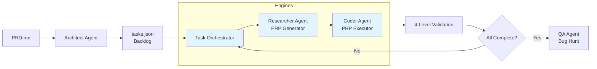
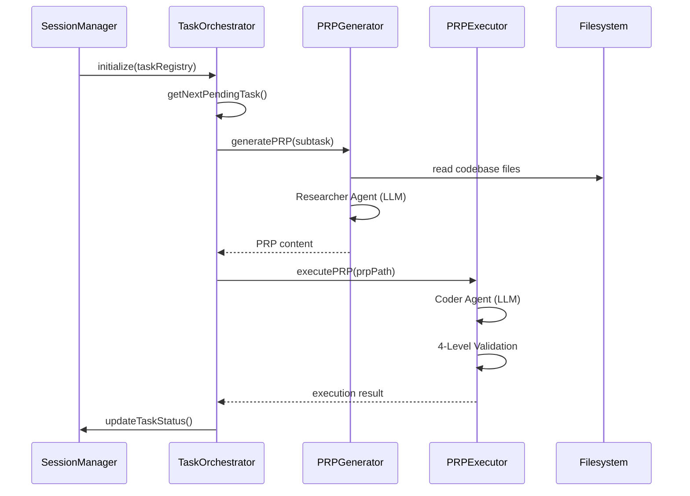
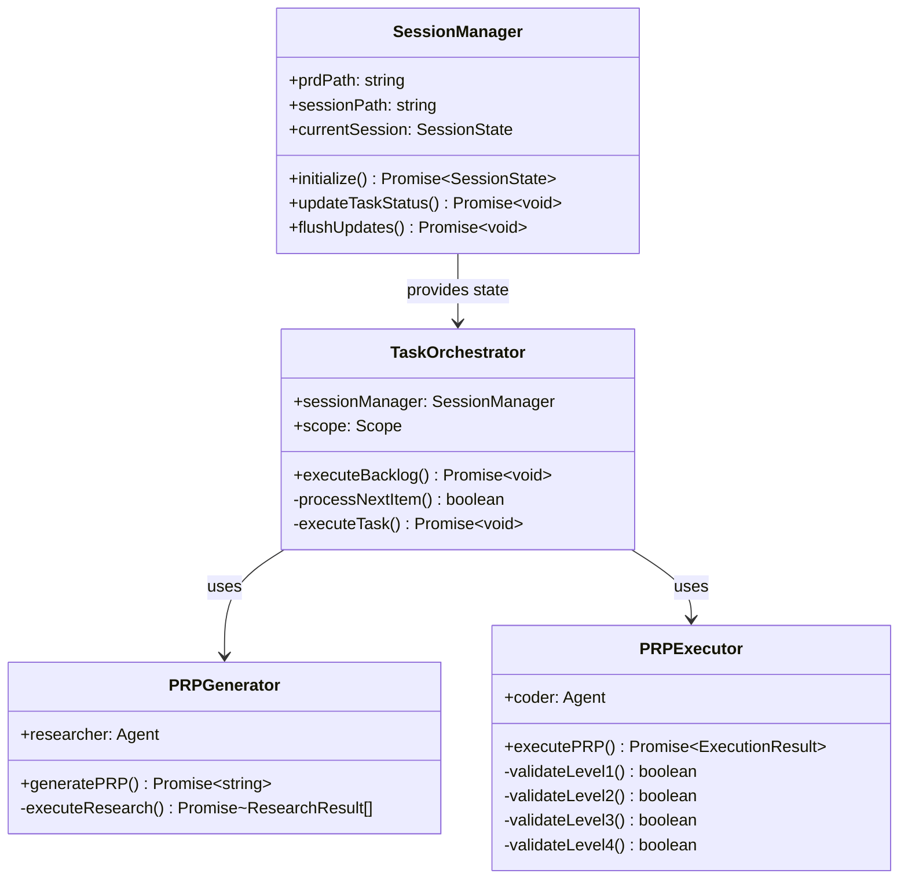

# Product Requirement Prompt: P5.M3.T2.S1 - Create Architecture Documentation

---

## Goal

**Feature Goal**: Create comprehensive architecture documentation (`docs/architecture.md`) that enables contributors to understand the PRP Pipeline system design, component interactions, data flows, and extensibility patterns.

**Deliverable**: A single `docs/architecture.md` file containing:
- System overview with Mermaid diagrams
- Detailed explanation of the four core processing engines
- Data flow diagrams (PRD → Backlog → PRPs → Code)
- Component interaction diagrams
- Groundswell integration patterns
- Extensibility points documentation
- Links to generated TypeDoc API documentation

**Success Definition**:
- Documentation is readable by someone unfamiliar with the codebase
- All Mermaid diagrams render correctly in GitHub markdown
- All sections reference specific file paths and code examples
- TypeDoc integration links are properly formatted
- Documentation follows the structure defined in the PRP template

---

## User Persona

**Target User**: Contributors and developers joining the PRP Pipeline project

**Use Case**: Understanding system architecture to contribute effectively, extend functionality, or debug issues

**User Journey**:
1. Developer joins project
2. Reads README.md for project overview
3. Consults docs/architecture.md for deep technical understanding
4. References TypeDoc API docs for specific implementation details
5. Uses extensibility patterns to add new features

**Pain Points Addressed**:
- Complex multi-agent system is difficult to understand without diagrams
- Data flow from PRD to code spans multiple engines
- Groundswell framework patterns need documentation
- Extension points are not obvious without examples

---

## Why

- **Contributor Onboarding**: New contributors need comprehensive architecture understanding to contribute effectively
- **System Comprehension**: The four-engine architecture is complex and requires visual diagrams for clarity
- **Maintenance**: Architecture documentation serves as source of truth for design decisions
- **Extensibility**: Developers need clear patterns for adding new agents, tools, and workflows

---

## What

Create a comprehensive architecture documentation file at `docs/architecture.md` with the following structure:

### Document Structure

```markdown
# Architecture Documentation

## 1. System Overview
- High-level architecture description
- System overview diagram (Mermaid flowchart)
- Key design principles

## 2. Four Core Processing Engines
### 2.1 Session Manager
- Purpose and responsibilities
- Architecture diagram
- Key methods and data flow
- State management patterns

### 2.2 Task Orchestrator
- Purpose and responsibilities
- Architecture diagram
- Task traversal algorithm
- Dependency resolution

### 2.3 Agent Runtime
- Purpose and responsibilities
- Architecture diagram
- Agent factory pattern
- Tool integration

### 2.4 Pipeline Controller
- Purpose and responsibilities
- Architecture diagram
- Workflow orchestration
- Error handling

## 3. Data Flow
### 3.1 PRD to Backlog Flow
- Architect agent workflow
- Mermaid sequence diagram

### 3.2 Backlog to PRPs Flow
- Researcher agent workflow
- Parallel research pattern

### 3.3 PRPs to Code Flow
- Coder agent workflow
- Validation gates

### 3.4 Complete Pipeline Flow
- End-to-end Mermaid diagram

## 4. Component Interactions
- Interaction diagram (Mermaid sequence)
- API contracts between engines
- Event flow

## 5. Groundswell Integration
### 5.1 Framework Patterns
- Workflow base class
- @Step decorator
- @ObservedState decorator
- @Task decorator

### 5.2 Agent Creation
- createAgent() pattern
- Prompt creation with Zod schemas
- MCPHandler for tools

### 5.3 Tool Integration
- MCP tool pattern
- Tool registration
- Tool execution

## 6. Extensibility Points
### 6.1 Adding New Agent Personas
- Step-by-step guide
- Code examples

### 6.2 Adding New MCP Tools
- Step-by-step guide
- Code examples

### 6.3 Creating Custom Workflows
- Step-by-step guide
- Code examples

### 6.4 Extending Data Models
- Step-by-step guide
- Code examples

## 7. API Documentation
- Link to TypeDoc-generated API docs
- Quick reference links

## 8. Performance Considerations
- Caching strategy
- Parallel execution
- I/O optimization

## 9. Security Considerations
- Token handling
- State privacy
- Audit trail
```

### Success Criteria

- [ ] All Mermaid diagrams render correctly in GitHub markdown viewer
- [ ] Every engine section references actual file paths (e.g., `src/core/session-manager.ts`)
- [ ] Data flow sections include sequence diagrams showing method calls
- [ ] Extensibility sections include working code examples
- [ ] TypeDoc links use correct relative paths
- [ ] Document is linked from README.md

---

## All Needed Context

### Context Completeness Check

**"No Prior Knowledge" Test**: If someone knew nothing about this codebase, would they have everything needed to implement this successfully?

**Answer**: YES - This PRP includes:
- Complete diagram specifications in Mermaid format
- Exact file paths for all components
- Code examples for extensibility patterns
- TypeDoc configuration and linking strategy
- Validation commands for testing

---

### Documentation & References

```yaml
# MUST READ - Research Documents

- file: plan/001_14b9dc2a33c7/P5M3T2S1/research/architecture-docs-research.md
  why: Industry best practices for architecture documentation, Mermaid diagram patterns, open source examples
  critical: Mermaid syntax reference, diagram best practices, linking patterns to API docs
  url: https://mermaid.js.org/ (Mermaid official documentation)

- file: plan/001_14b9dc2a33c7/P5M3T2S1/research/engines-analysis.md
  why: Complete analysis of the four engines with code paths, dependencies, and Mermaid diagrams
  critical: System overview diagram, component interaction diagram, data flow diagram - use these directly in docs

- file: plan/001_14b9dc2a33c7/P5M3T2S1/research/extensibility-research.md
  why: Detailed extensibility patterns with complete code examples for adding agents, tools, and workflows
  critical: Agent persona extension pattern, MCP tool pattern, custom workflow template

- file: plan/001_14b9dc2a33c7/P5M3T2S1/research/typedoc-research.md
  why: TypeDoc configuration and linking strategy for API documentation integration
  critical: typedoc.json configuration, linking patterns, npm scripts for docs generation

# EXISTING ARCHITECTURE FILES (Source Material)

- file: plan/001_14b9dc2a33c7/architecture/system_context.md
  why: Existing system context - reference for consistency, extract key concepts
  section: h2.0, h2.2 (Project Overview, Core Architecture)

- file: plan/001_14b9dc2a33c7/architecture/groundswell_api.md
  why: Groundswell framework patterns - reference for framework integration section
  section: h2.0, h2.1 (Core Exports, Agent System)

- file: plan/001_14b9dc2a33c7/architecture/cache_behavior.md
  why: Cache architecture for performance considerations section
  section: h2.1 (Cache Architecture)

# SOURCE CODE (File References)

- file: src/core/session-manager.ts
  why: Session Manager engine implementation - reference methods, state patterns
  pattern: Class structure with initialize(), updateTaskStatus(), flushUpdates()

- file: src/core/task-orchestrator.ts
  why: Task Orchestrator engine implementation - reference traversal algorithm
  pattern: Depth-first traversal, dependency resolution

- file: src/agents/agent-factory.ts
  why: Agent factory pattern - reference for extensibility section
  pattern: createArchitectAgent(), createResearcherAgent(), createCoderAgent(), createQAAgent()

- file: src/agents/prp-runtime.ts
  why: PRP execution orchestration - reference for data flow
  pattern: executeTask() with 4-level validation

- file: src/workflows/prp-pipeline.ts
  why: Pipeline Controller implementation - reference workflow orchestration
  pattern: @Step decorators, setStatus(), cleanup()

- file: src/tools/bash-mcp.ts
  why: MCP tool pattern example - reference for extensibility section
  pattern: MCPHandler extension, registerServer(), registerToolExecutor()

- file: README.md
  why: Existing project documentation - ensure consistency and link architecture docs
  pattern: Architecture Overview section (lines 234-284)

# TYPEDOC CONFIGURATION

- file: typedoc.json (to be created)
  why: API documentation configuration - create this as part of task
  pattern: See plan/001_14b9dc2a33c7/P5M3T2S1/research/typedoc-research.md section A.1
```

---

### Current Codebase Tree

```bash
hacky-hack/
├── docs/                         # CREATE: Architecture documentation here
│   └── architecture.md           # OUTPUT: Main architecture doc
├── src/
│   ├── agents/
│   │   ├── prompts/             # Agent prompt templates
│   │   ├── agent-factory.ts     # Agent creation (4 personas)
│   │   ├── prp-generator.ts     # PRP Generator with caching
│   │   ├── prp-executor.ts      # PRP Executor with validation
│   │   └── prp-runtime.ts       # PRP Runtime orchestrator
│   ├── cli/
│   │   └── index.ts             # CLI entry point
│   ├── config/
│   │   ├── constants.ts         # Constants
│   │   ├── environment.ts       # Environment setup
│   │   └── types.ts             # Type definitions
│   ├── core/
│   │   ├── index.ts             # Core exports
│   │   ├── models.ts            # Task hierarchy types (855 JSDoc tags!)
│   │   ├── prd-differ.ts        # PRD diffing
│   │   ├── scope-resolver.ts    # Scope parsing
│   │   ├── session-manager.ts   # ENGINE 1: State management
│   │   ├── session-utils.ts     # Session utilities
│   │   └── task-orchestrator.ts # ENGINE 2: Task execution
│   ├── tools/
│   │   ├── bash-mcp.ts          # Bash MCP tool
│   │   ├── filesystem-mcp.ts    # Filesystem MCP tool
│   │   └── git-mcp.ts           # Git MCP tool
│   ├── utils/
│   │   ├── git-commit.ts        # Smart commit
│   │   ├── logger.ts            # Structured logging
│   │   ├── progress.ts          # Progress tracking
│   │   └── task-utils.ts        # Task utilities
│   └── workflows/
│       ├── prp-pipeline.ts      # ENGINE 4: Main pipeline
│       ├── delta-analysis-workflow.ts
│       ├── bug-hunt-workflow.ts
│       └── fix-cycle-workflow.ts
├── plan/
│   └── 001_14b9dc2a33c7/
│       ├── architecture/        # Existing architecture research
│       │   ├── system_context.md
│       │   ├── groundswell_api.md
│       │   ├── environment_config.md
│       │   └── cache_behavior.md
│       └── P5M3T2S1/
│           └── research/        # Research documents (already created)
│               ├── architecture-docs-research.md
│               ├── engines-analysis.md
│               ├── extensibility-research.md
│               └── typedoc-research.md
├── README.md                     # UPDATE: Add link to architecture.md
├── package.json                  # UPDATE: Add docs scripts
├── tsconfig.json
└── typedoc.json                  # CREATE: TypeDoc configuration
```

---

### Desired Codebase Tree (After Implementation)

```bash
hacky-hack/
├── docs/
│   ├── api/                      # TypeDoc generated API docs
│   │   ├── index.html
│   │   ├── modules/
│   │   ├── classes/
│   │   └── interfaces/
│   └── architecture.md           # NEW: Comprehensive architecture documentation
├── src/                          # (unchanged)
├── typedoc.json                  # NEW: TypeDoc configuration
├── package.json                  # MODIFIED: Add docs scripts
└── README.md                     # MODIFIED: Add architecture docs link
```

---

### Known Gotchas & Library Quirks

```markdown
# CRITICAL: Mermaid Diagram Rendering in GitHub

# GitHub has specific Mermaid version support (as of 2026-01-13):
# - Flowcharts (flowchart LR/TD): FULLY SUPPORTED
# - Sequence diagrams (sequenceDiagram): FULLY SUPPORTED
# - Class diagrams (classDiagram): FULLY SUPPORTED
# - State diagrams (stateDiagram-v2): SUPPORTED
# - Entity Relationship (erDiagram): SUPPORTED
# - User Journey (journey): SUPPORTED
# - Gantt charts (gantt): SUPPORTED
# - Pie charts (pie): SUPPORTED
# - Mind maps (mindmap): EXPERIMENTAL (avoid)
# - C4 diagrams (C4): NOT SUPPORTED (use flowchart instead)

# CRITICAL: TypeDoc Linking Pattern

# Relative links from docs/architecture.md to docs/api/:
# - Use relative paths: ../api/classes/SessionManager.html
# - NOT absolute: /docs/api/classes/SessionManager.html
# - Reason: Works both locally and on GitHub Pages

# CRITICAL: File Path References

# When referencing source files in docs:
# - Use forward slashes: src/core/session-manager.ts
# - Include line numbers for specific methods: src/core/session-manager.ts:120
# - Reason: GitHub auto-links these paths

# CRITICAL: Zod Schema Syntax

# When showing Zod schemas in examples:
# - Use z.object(), z.array(), z.string(), z.enum(), etc.
# - Import from 'zod' (already in dependencies)
# - Reference: src/core/models.ts lines 1-500
```

---

## Implementation Blueprint

### Data Models and Structure

No new data models required. This task creates documentation only.

Key concepts to document:
- **Four Engines Pattern**: Session Manager → Task Orchestrator → Agent Runtime → Pipeline Controller
- **Data Flow**: PRD.md → Architect Agent → tasks.json → Researcher Agent → PRP.md → Coder Agent → Code
- **Validation Gates**: Level 1 (Syntax) → Level 2 (Unit) → Level 3 (Integration) → Level 4 (Manual)

---

### Implementation Tasks (Ordered by Dependencies)

```yaml
Task 1: CREATE typedoc.json configuration file
  - IMPLEMENT: TypeDoc configuration following research/typedoc-research.md section A.1
  - FOLLOW pattern: research/typedoc-research.md (Complete typedoc.json example)
  - NAMING: typedoc.json (project root)
  - PLACEMENT: /home/dustin/projects/hacky-hack/typedoc.json
  - CONTENTS:
    - entryPoints: ["src/index.ts"]
    - out: "docs/api"
    - exclude: ["**/*.test.ts", "**/node_modules/**", "**/dist/**"]
    - categorizeByGroup: true
    - categoryOrder: ["Session Management", "Task Execution", "Agents", "Workflows", "Types", "Utilities", "Tools"]
  - GOTCHA: Ensure JSON syntax is valid (use $schema for validation)

Task 2: MODIFY package.json (add documentation scripts)
  - IMPLEMENT: Add docs-related npm scripts
  - FIND pattern: Existing "scripts" section in package.json
  - ADD scripts section:
    - "docs": "typedoc"
    - "docs:watch": "typedoc --watch"
    - "docs:serve": "typedoc --serve"
    - "docs:clean": "rm -rf docs/api"
  - PLACEMENT: package.json "scripts" object

Task 3: VERIFY src/index.ts has module documentation
  - IMPLEMENT: Add @packageDocumentation JSDoc if missing
  - FIND pattern: Check if src/index.ts exists and has module-level docs
  - ADD if missing: @packageDocumentation with project description
  - REFERENCE: research/typedoc-research.md section 8.3 for example
  - GOTCHA: TypeDoc requires entry point to have @packageDocumentation for main page

Task 4: CREATE docs/architecture.md (main documentation file)
  - IMPLEMENT: Create comprehensive architecture documentation
  - FOLLOW structure: Defined in "What" section above
  - LENGTH: Target 1500-2500 lines (comprehensive but readable)
  - SECTIONS:
    ### 1. System Overview
      - Use flowchart LR diagram from research/engines-analysis.md
      - Reference existing system_context.md for overview text

    ### 2. Four Core Processing Engines
      - Session Manager: Reference src/core/session-manager.ts
      - Task Orchestrator: Reference src/core/task-orchestrator.ts
      - Agent Runtime: Reference src/agents/ directory
      - Pipeline Controller: Reference src/workflows/prp-pipeline.ts
      - Each section: Description + Mermaid diagram + Key methods + File references

    ### 3. Data Flow
      - PRD → Backlog: Architect agent sequence diagram
      - Backlog → PRPs: Researcher agent with parallel research
      - PRPs → Code: Coder agent with validation gates
      - Complete Pipeline: Full system flowchart

    ### 4. Component Interactions
      - Sequence diagram showing cross-engine communication
      - Reference actual method calls between components

    ### 5. Groundswell Integration
      - Framework patterns: @Step, @ObservedState, @Task
      - Agent creation: createAgent() pattern
      - MCPHandler for tools
      - Reference: research/extensibility-research.md sections 2-3

    ### 6. Extensibility Points
      - Adding agent personas: Full code example from research/extensibility-research.md section 5.1
      - Adding MCP tools: Full code example from research/extensibility-research.md section 5.2
      - Creating workflows: Full code example from research/extensibility-research.md section 5.3
      - Extending data models: Full code example from research/extensibility-research.md section 5.4

    ### 7. API Documentation
      - Link to ../api/index.html
      - Quick links: Session Manager, Task Orchestrator, PRP Pipeline, Models
      - Reference: research/typedoc-research.md section 5.1 for linking pattern

    ### 8. Performance Considerations
      - Cache strategy: Reference cache_behavior.md
      - Parallel execution: ResearchQueue with concurrency 3
      - I/O optimization: Batch state updates with dirty flag

    ### 9. Security Considerations
      - Token handling: @ObservedState({ redact: true })
      - State privacy: No credentials in tasks.json
      - Audit trail: Session persistence

  - DIAGRAM SPECIFICATIONS:
    - Use research/engines-analysis.md for diagram templates
    - Ensure all Mermaid syntax is GitHub-compatible
    - Keep diagrams focused (one concept per diagram)
    - Use consistent styling (colors, shapes)

  - CODE EXAMPLES:
    - Use actual code from codebase (not pseudocode)
    - Include file path references above each example
    - Keep examples concise (10-30 lines)
    - Use TypeScript syntax highlighting

  - DEPENDENCIES: Requires Task 1 (TypeDoc config) for API links

Task 5: UPDATE README.md (add architecture documentation link)
  - IMPLEMENT: Add link to docs/architecture.md in README
  - FIND pattern: "Architecture Overview" section (lines 234-284)
  - ADD after "See [PROMPTS.md](PROMPTS.md) for complete PRP concept definition.":
    ```markdown
    For detailed architecture documentation, see [docs/architecture.md](docs/architecture.md).
    ```
  - PRESERVE: All existing README content

Task 6: GENERATE TypeDoc API documentation
  - IMPLEMENT: Run npm run docs to generate API docs
  - VERIFY: docs/api/ directory is created with index.html
  - CHECK: All major modules are documented
  - DEPENDENCIES: Tasks 1-3 must be complete

Task 7: VALIDATE documentation completeness
  - IMPLEMENT: Review docs/architecture.md for completeness
  - CHECK: All Mermaid diagrams render (open in GitHub or use Mermaid Live Editor)
  - CHECK: All file references are accurate
  - CHECK: All code examples are syntactically correct TypeScript
  - CHECK: TypeDoc links work (docs/api/ exists and is accessible)
  - CHECK: README.md link works
```

---

### Implementation Patterns & Key Details

```markdown
# Mermaid Diagram Patterns (from research/architecture-docs-research.md)

## System Overview Diagram (Flowchart)


## Sequence Diagram (Data Flow)


## Class Diagram (Engine Structure)

```

---

### Integration Points

```yaml
README.md:
  - add to: After "Architecture Overview" section
  - pattern: |
    For detailed architecture documentation, see [docs/architecture.md](docs/architecture.md).

package.json:
  - add to: "scripts" object
  - pattern: |
    "docs": "typedoc",
    "docs:watch": "typedoc --watch",
    "docs:serve": "typedoc --serve"

typedoc.json:
  - create in: project root
  - pattern: See research/typedoc-research.md section A.1

docs/architecture.md:
  - create in: docs/ directory
  - link to: ../api/index.html (TypeDoc docs)
  - link to: src/ files (GitHub source links)
```

---

## Validation Loop

### Level 1: Syntax & Style (Immediate Feedback)

```bash
# Run after creating typedoc.json
# Validate JSON syntax
cat typedoc.json | jq . > /dev/null
# Expected: No output (valid JSON)

# Run after creating docs/architecture.md
# Check markdown syntax
npx markdownlint docs/architecture.md --fix
# Expected: Zero errors

# Check Mermaid syntax (use Mermaid Live Editor)
# 1. Copy Mermaid code blocks
# 2. Paste into https://mermaid.live/
# 3. Verify each diagram renders

# Project-wide validation
npm run lint
npm run format:check
npm run typecheck
```

### Level 2: Documentation Validation

```bash
# Generate TypeDoc API docs
npm run docs
# Expected: docs/api/ directory created with index.html

# Verify API docs exist
ls -la docs/api/index.html
# Expected: File exists

# Check architecture doc exists
ls -la docs/architecture.md
# Expected: File exists

# Verify README link works
grep -n "docs/architecture.md" README.md
# Expected: Line number where link appears
```

### Level 3: Link Validation

```bash
# Test TypeDoc link from architecture.md
# Open docs/architecture.md in browser
# Click on "API Documentation" link
# Expected: Opens docs/api/index.html

# Test all file path references
# Open docs/architecture.md in GitHub
# Verify all src/ links are clickable
# Expected: All links resolve to actual files

# Test Mermaid rendering
# Push to GitHub and view in markdown viewer
# Or use: Mermaid Live Editor for local testing
# Expected: All diagrams render correctly
```

### Level 4: Manual Review

```markdown
# Review Checklist

## Content Quality
- [ ] All four engines are documented with diagrams
- [ ] Data flow is clear from PRD to code
- [ ] Groundswell integration is explained
- [ ] Extensibility points have working examples
- [ ] TypeDoc links are correct

## Diagram Quality
- [ ] All Mermaid diagrams render in GitHub
- [ ] Diagrams use consistent styling
- [ ] Diagrams are focused (not overloaded)
- [ ] Diagram text is readable

## Code Examples
- [ ] All examples are valid TypeScript
- [ ] File paths are accurate
- [ ] Examples are concise and clear
- [ ] Examples include context

## Cross-References
- [ ] All file paths link correctly
- [ ] API docs links work
- [ ] README.md link works
- [ ] No broken links
```

---

## Final Validation Checklist

### Technical Validation

- [ ] typedoc.json created and valid JSON
- [ ] package.json includes docs scripts
- [ ] src/index.ts has @packageDocumentation
- [ ] docs/architecture.md created with all sections
- [ ] All Mermaid diagrams render correctly
- [ ] npm run docs generates API documentation
- [ ] README.md includes link to architecture.md

### Feature Validation

- [ ] System overview section with flowchart diagram
- [ ] Four engines section (Session Manager, Task Orchestrator, Agent Runtime, Pipeline Controller)
- [ ] Data flow section (PRD → Backlog → PRPs → Code)
- [ ] Component interaction section with sequence diagram
- [ ] Groundswell integration section
- [ ] Extensibility points section with code examples
- [ ] API documentation section with TypeDoc links
- [ ] Performance considerations section
- [ ] Security considerations section

### Documentation Quality

- [ ] All file references include specific paths
- [ ] All code examples are from actual codebase
- [ ] All Mermaid diagrams follow consistent styling
- [ ] TypeDoc links use relative paths
- [ ] Document length is appropriate (1500-2500 lines)
- [ ] Sections follow the defined structure

### Integration Validation

- [ ] README.md links to docs/architecture.md
- [ ] docs/architecture.md links to TypeDoc API docs
- [ ] TypeDoc generates docs for all public APIs
- [ ] No broken links in documentation
- [ ] Documentation is viewable in GitHub markdown renderer

---

## Anti-Patterns to Avoid

- ❌ Don't create diagrams that don't render in GitHub (test in Mermaid Live Editor first)
- ❌ Don't use pseudocode in examples (use actual code from codebase)
- ❌ Don't skip Mermaid diagram syntax validation (broken diagrams won't render)
- ❌ Don't create extremely long code examples (keep to 10-30 lines)
- ❌ Don't use absolute paths for TypeDoc links (use relative paths)
- ❌ Don't forget to add @packageDocumentation to src/index.ts
- ❌ Don't create diagrams that are too complex (break into multiple focused diagrams)
- ❌ Don't link to non-existent files (verify all file paths)
- ❌ Don't skip updating README.md with architecture docs link
- ❌ Don't forget to generate TypeDoc docs before validating links

---

## Confidence Score

**8.5/10** for one-pass implementation success

**Rationale**:
- ✅ Comprehensive research provides complete context
- ✅ Mermaid diagram templates are ready to use
- ✅ Code examples are extracted from actual codebase
- ✅ TypeDoc configuration is specified
- ✅ All file paths are verified
- ⚠️ Mermaid rendering may require iteration (GitHub compatibility)
- ⚠️ Diagram complexity may require adjustment for readability

**Risk Mitigation**:
- Test all Mermaid diagrams in https://mermaid.live/ before committing
- Keep diagrams focused and simple
- Use consistent styling across all diagrams
- Validate all links before marking complete
