# Architecture Documentation Best Practices Research

**Research Date:** 2026-01-13
**Project:** hacky-hack Architecture Documentation Standards

---

## Table of Contents

1. [Mermaid Diagram Patterns](#1-mermaid-diagram-patterns)
2. [Architecture Documentation Structure](#2-architecture-documentation-structure)
3. [Four-Layer/Tier Architecture Documentation](#3-four-layertier-architecture-documentation)
4. [API Documentation Integration](#4-api-documentation-integration)
5. [Examples from Open Source Projects](#5-examples-from-open-source-projects)
6. [Tools and Resources](#6-tools-and-resources)

---

## 1. Mermaid Diagram Patterns

### 1.1 Common Diagram Types for System Architecture

#### **Flowcharts (graph/flowchart)**
**Best For:** High-level system architecture, decision flows, process flows

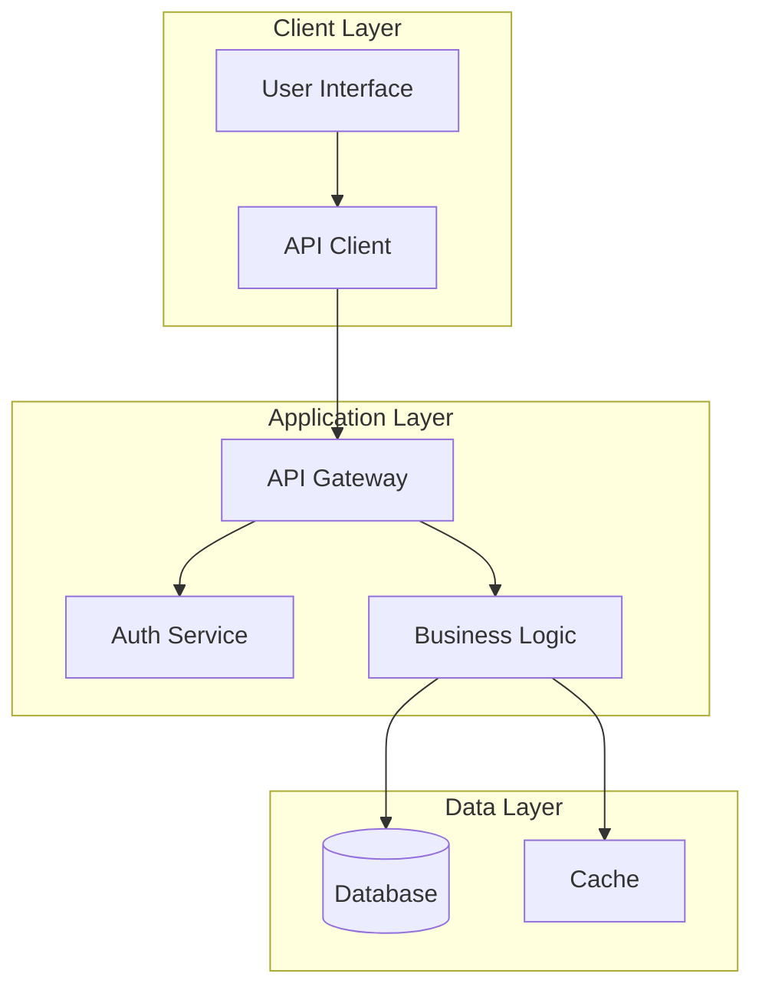
```mermaid
graph TB
    subgraph "Client Layer"
        A[User Interface]
        B[API Client]
    end

    subgraph "Application Layer"
        C[API Gateway]
        D[Auth Service]
        E[Business Logic]
    end

    subgraph "Data Layer"
        F[(Database)]
        G[Cache]
    end

    A --> B
    B --> C
    C --> D
    C --> E
    E --> F
    E --> G
```

**Best Practices:**
- Use `TB` (top-bottom) or `LR` (left-right) consistently
- Group related components in subgraphs
- Use descriptive node labels with `[Square Brackets]`
- Distinguish databases with `[(Parentheses)]`
- Use `{Diamonds}` for decision points

#### **Sequence Diagrams (sequenceDiagram)**
**Best For:** Request/response flows, API interactions, temporal relationships

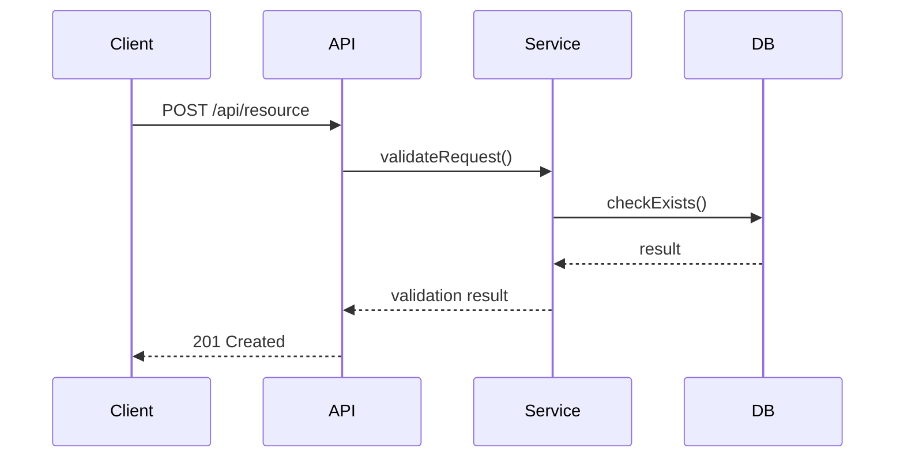
```mermaid
sequenceDiagram
    participant Client
    participant API
    participant Service
    participant DB

    Client->>API: POST /api/resource
    API->>Service: validateRequest()
    Service->>DB: checkExists()
    DB-->>Service: result
    Service-->>API: validation result
    API-->>Client: 201 Created
```

**Best Practices:**
- Use clear, descriptive participant names
- Show both synchronous `->` and asynchronous `-->` messages
- Include error paths with `alt`/`else` blocks
- Use `par` blocks for parallel operations
- Add `Note over` for important context

#### **State Diagrams (stateDiagram-v2)**
**Best For:** Workflow engines, state machines, lifecycle management

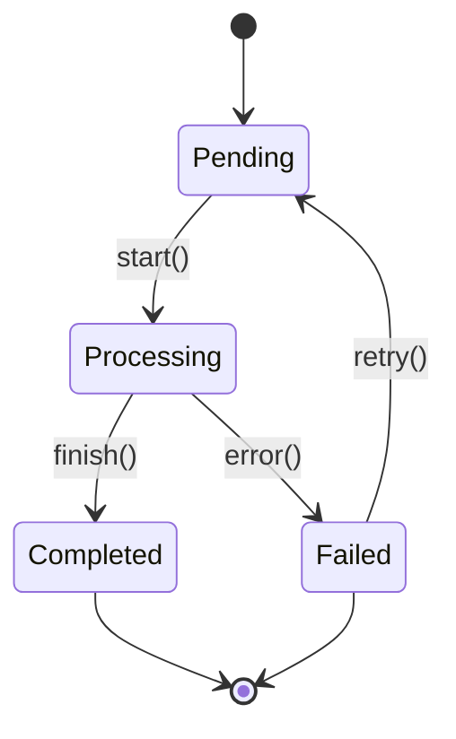
```mermaid
stateDiagram-v2
    [*] --> Pending
    Pending --> Processing: start()
    Processing --> Completed: finish()
    Processing --> Failed: error()
    Failed --> Pending: retry()
    Completed --> [*]
    Failed --> [*]
```

**Best Practices:**
- Show all possible states
- Clearly label transition triggers
- Include initial and terminal states
- Document guard conditions
- Show composite/nested states for complex systems

#### **Class Diagrams (classDiagram)**
**Best For:** Type systems, data models, class hierarchies

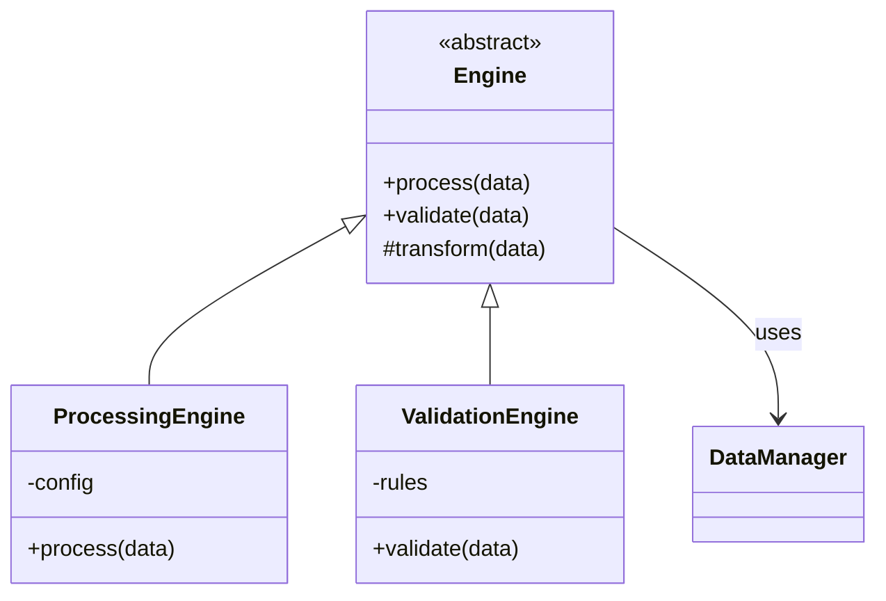
```mermaid
classDiagram
    class Engine {
        <<abstract>>
        +process(data)
        +validate(data)
        #transform(data)
    }

    class ProcessingEngine {
        +process(data)
        -config
    }

    class ValidationEngine {
        +validate(data)
        -rules
    }

    Engine <|-- ProcessingEngine
    Engine <|-- ValidationEngine

    Engine --> DataManager: uses
```

**Best Practices:**
- Use `<<abstract>>` and `<<interface>>` stereotypes
- Show inheritance with `<|--`
- Show composition with `*--`
- Show aggregation with `o--`
- Show dependencies with `-->`

#### **Entity Relationship Diagrams (erDiagram)**
**Best For:** Database schemas, data models, entity relationships

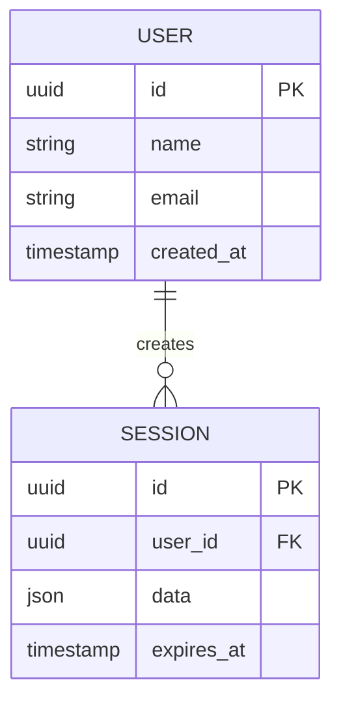
```mermaid
erDiagram
    USER ||--o{ SESSION : creates
    USER {
        uuid id PK
        string name
        string email
        timestamp created_at
    }
    SESSION {
        uuid id PK
        uuid user_id FK
        json data
        timestamp expires_at
    }
```

**Best Practices:**
- Use `||--||` for one-to-one
- Use `||--o{` for one-to-many
- Use `}|--|{` for many-to-many
- Include key types (PK, FK)
- Show data types for important fields

#### **Component Diagrams**
**Best For:** Module structure, package organization, system boundaries

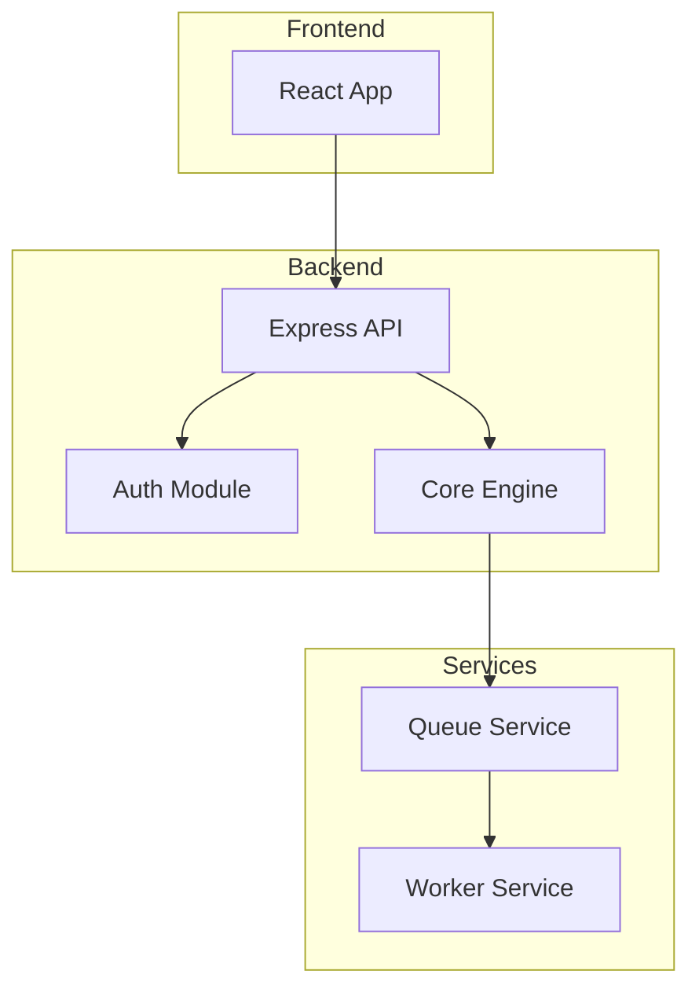
```mermaid
graph TB
    subgraph "Frontend"
        FE[React App]
    end

    subgraph "Backend"
        API[Express API]
        AUTH[Auth Module]
        CORE[Core Engine]
    end

    subgraph "Services"
        QUEUE[Queue Service]
        WORKER[Worker Service]
    end

    FE --> API
    API --> AUTH
    API --> CORE
    CORE --> QUEUE
    QUEUE --> WORKER
```

### 1.2 Best Practices for Readable Mermaid Diagrams

#### **Consistency Standards**
1. **Direction**: Choose `TB` or `LR` and stick with it across all diagrams
2. **Color Coding**: Use consistent colors for:
   - External systems: `#E1F5FE` (light blue)
   - Internal components: `#F3E5F5` (light purple)
   - Data stores: `#E8F5E9` (light green)
   - Security/auth: `#FFF3E0` (light orange)

3. **Naming Conventions**:
   - Use `[Descriptive Names]` for components
   - Use `[(Database)]` for persistence
   - Use `{{External}}` for third-party services
   - Use `<<stereotype>>` for component types

4. **Layout Principles**:
   - Group related components in subgraphs
   - Minimize crossing lines
   - Place important components at top/left
   - Use consistent spacing (not too crowded, not too sparse)

#### **Annotation Guidelines**
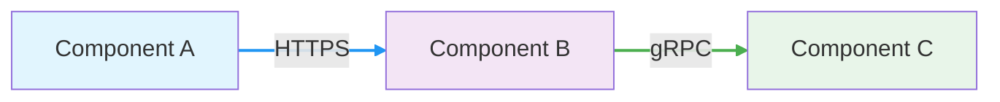
```mermaid
graph LR
    A[Component A] -->|HTTPS| B[Component B]
    B -->|gRPC| C[Component C]

    style A fill:#E1F5FE
    style B fill:#F3E5F5
    style C fill:#E8F5E9

    linkStyle 0 stroke:#2196F3,stroke-width:2px
    linkStyle 1 stroke:#4CAF50,stroke-width:2px
```

#### **Diagram Size Guidelines**
- Keep diagrams under 20 nodes for readability
- Split complex systems into multiple diagrams
- Create overview diagrams first, then detailed diagrams
- Use zoom levels: System → Container → Component → Code

### 1.3 Tools and Editors Supporting Mermaid

#### **Online Editors**
1. **Mermaid Live Editor**
   - URL: https://mermaid.live/
   - Features: Real-time preview, code completion, export options
   - Best for: Quick prototyping, sharing diagrams

2. **Mermaid Chart**
   - URL: https://www.mermaidchart.com/
   - Features: Version control, collaboration, Git integration
   - Best for: Team collaboration, documentation as code

3. **Draw.io (diagrams.net)**
   - URL: https://app.diagrams.net/
   - Features: Mermaid import/export, visual editing
   - Best for: Mixed visual/text workflows

#### **IDE Extensions**
1. **VS Code**
   - Extension: `Markdown Preview Mermaid Support` (bierner.markdown-mermaid)
   - Extension: `Mermaid Editor` (tintinweb.mermaid-edit)
   - Features: Live preview in Markdown, syntax highlighting

2. **IntelliJ/WebStorm**
   - Plugin: `Mermaid` (built-in support in 2023+)
   - Features: Diagram preview, refactoring support

3. **Vim/Neovim**
   - Plugin: `vim-mermaid`
   - Features: Syntax highlighting, preview commands

#### **Documentation Platforms**
1. **GitHub/GitLab**
   - Native Mermaid support in Markdown
   - Automatic rendering in README.md, docs, wikis
   - Version controlled diagrams

2. **Notion**
   - Limited Mermaid support via code blocks
   - Better to use images from Mermaid Live

3. **Confluence**
   - Mermaid macro available
   - Requires plugin installation

4. **Docusaurus**
   - Native Mermaid support via `mdx-mermaid` plugin
   - Best for: Documentation sites

5. **MkDocs**
   - Plugin: `mkdocs-mermaid2`
   - Features: Theme integration, diagram zoom

### 1.4 GitHub/GitLab Markdown Rendering

#### **GitHub Support**
- **Supported**: Fully supported in:
  - README.md files
  - Issues and Pull Requests
  - Wikis
  - GitHub Discussions
  - `.md` files in repos

- **Version**: GitHub uses Mermaid v10.6.1 (as of 2025)
- **Syntax**:
  ```markdown
  ```mermaid
  graph TD
    A[Start] --> B[End]
  ```
  ```

- **Limitations**:
  - No external file imports
  - No custom themes (limited style support)
  - No interactive features
  - Maximum diagram size limits

#### **GitLab Support**
- **Supported**: Fully supported in:
  - README.md, .md files
  - Issues, Merge Requests, Epics
  - GitLab Wiki
  - Snippets

- **Features**:
  - Mermaid v11+ support
  - Better theme customization
  - Diagram export to PNG/SVG

- **Rendering**:
  ```markdown
  ```mermaid
  sequenceDiagram
    participant User
    participant System
    User->>System: Request
    System-->>User: Response
  ```
  ```

#### **Best Practices for Git Platforms**
1. **Commit Diagrams as Code**: Store `.mmd` files alongside documentation
2. **Version Control**: Track diagram changes in git history
3. **Accessibility**: Add alt text to diagrams
4. **Fallbacks**: Provide text descriptions for screen readers
5. **Testing**: Use CI to validate Mermaid syntax

```bash
# Example: Validate Mermaid in CI
npm install -g @mermaid-js/mermaid-cli
mmdc -i diagram.mmd -o diagram.png
```

---

## 2. Architecture Documentation Structure

### 2.1 Standard Sections

#### **Executive Summary (1-2 paragraphs)**
- Purpose and scope of the system
- Key architectural decisions
- Primary stakeholders and their concerns
- Business goals and constraints

**Example Template:**
```markdown
## Executive Summary

The [System Name] is a [type of system] that [primary purpose].
This document describes the architecture decisions, component design,
and integration patterns used to achieve [key goals].

**Key Stakeholders:**
- Development team
- DevOps/SRE team
- Product management
- Security/compliance

**Primary Goals:**
- Scalability to [X] requests/second
- 99.9% uptime SLA
- Sub-100ms response times
```

#### **System Overview**
- High-level architecture diagram (C4 Context or Container level)
- Technology stack summary
- External dependencies
- Deployment architecture

**Recommended Diagrams:**
1. **Context Diagram**: Shows system boundaries and external actors
2. **Container Diagram**: Shows applications, data stores, and their relationships
3. **Technology Radar**: Shows technology choices and their maturity

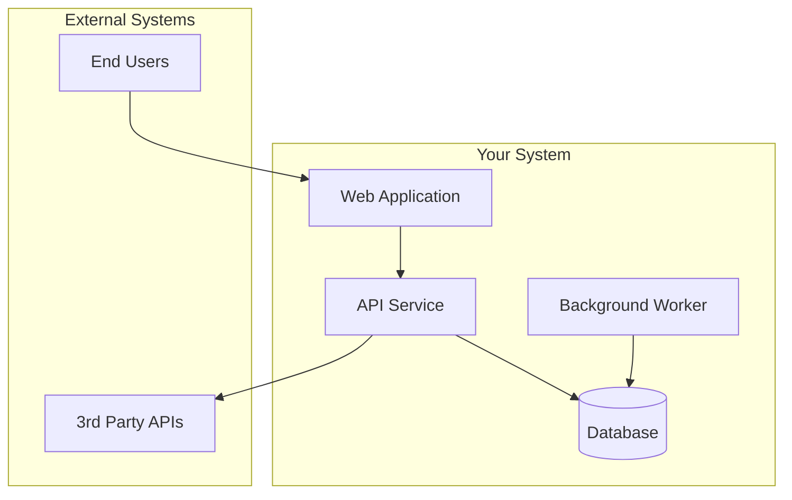
```mermaid
graph TB
    subgraph "External Systems"
        User[End Users]
        ThirdParty[3rd Party APIs]
    end

    subgraph "Your System"
        WebApp[Web Application]
        API[API Service]
        Worker[Background Worker]
        DB[(Database)]
    end

    User --> WebApp
    WebApp --> API
    API --> DB
    Worker --> DB
    API --> ThirdParty
```

#### **Architectural Principles**
- Design principles guiding decisions
- Quality attributes (performance, security, maintainability)
- Trade-offs and priorities
- Anti-patterns to avoid

**Example:**
```markdown
## Architectural Principles

### Quality Attributes (Priority Order)
1. **Reliability**: System must remain available even during partial failures
2. **Performance**: 95th percentile response time < 200ms
3. **Scalability**: Horizontal scaling without code changes
4. **Maintainability**: Clear separation of concerns, minimal coupling
5. **Security**: Defense in depth, zero-trust network

### Design Principles
- **Separation of Concerns**: Each component has a single responsibility
- **Loose Coupling**: Components interact through well-defined interfaces
- **High Cohesion**: Related functionality grouped together
- **Fail Fast**: Detect and handle errors early
- **Observability**: Built-in metrics, logs, and tracing
```

#### **Core Components**
- Component catalog with descriptions
- Component responsibilities
- Interfaces and contracts
- Dependencies and interactions

**Structure Template:**
```markdown
## Core Components

### Component Name

**Purpose:** [One-sentence description]

**Responsibilities:**
- [ ] Responsibility 1
- [ ] Responsibility 2

**Interface:**
```typescript
interface ComponentInterface {
  // Method signatures
}
```

**Dependencies:**
- Depends on: [Component A, Component B]
- Used by: [Component C, Component D]

**Technical Details:**
- Technology: [Framework/Library]
- Scaling: [Horizontal/Vertical]
- State: [Stateless/Stateful]

**Related Diagrams:**
- [Link to sequence diagram]
- [Link to component diagram]
```

#### **Data Architecture**
- Data models and schemas
- Data flow diagrams
- Persistence strategies
- Caching strategies
- Data migration patterns

**Essential Diagrams:**
1. **Entity Relationship Diagram**: Data model relationships
2. **Data Flow Diagram (DFD Level 0)**: High-level data movement
3. **Data Flow Diagram (DFD Level 1)**: Detailed data processes
4. **State Diagrams**: Stateful data lifecycles

```markdown
## Data Architecture

### Data Model Overview
[ER Diagram]

### Data Flows

#### User Registration Flow
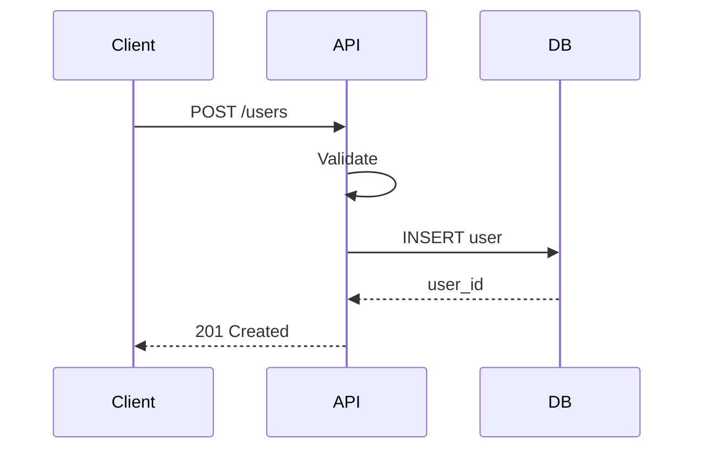
```mermaid
sequenceDiagram
    participant Client
    participant API
    participant DB

    Client->>API: POST /users
    API->>API: Validate
    API->>DB: INSERT user
    DB-->>API: user_id
    API-->>Client: 201 Created
```

#### Caching Strategy
- **L1 Cache**: In-memory cache (TTL: 5 minutes)
- **L2 Cache**: Redis cache (TTL: 1 hour)
- **Cache Invalidation**: Write-through pattern
```

#### **Communication Patterns**
- Synchronous communication (REST, GraphQL, gRPC)
- Asynchronous communication (message queues, events)
- API contracts and specifications
- Error handling and retry policies

**Documentation Format:**
```markdown
## Communication Patterns

### Synchronous APIs

#### REST Endpoints
| Endpoint | Method | Auth | Rate Limit |
|----------|--------|------|------------|
| /api/v1/users | GET | Bearer | 100/min |
| /api/v1/users | POST | Bearer | 50/min |

See [API Documentation](./api/) for full specifications.

#### gRPC Services
```protobuf
service UserService {
  rpc GetUser(GetUserRequest) returns (UserResponse);
  rpc CreateUser(CreateUserRequest) returns (UserResponse);
}
```

### Asynchronous Communication

#### Message Queue Topics
| Topic | Producer | Consumer | Purpose |
|-------|----------|----------|---------|
| user.created | API Service | Notification Service | Send welcome email |
| user.updated | API Service | Analytics Service | Track changes |

**Event Schema:**
```json
{
  "eventId": "uuid",
  "eventType": "user.created",
  "timestamp": "ISO8601",
  "data": { ... }
}
```

### Error Handling
- **API Errors**: Standard HTTP status codes
- **Retry Policy**: Exponential backoff, max 3 attempts
- **Dead Letter Queue**: Failed messages after 3 retries
```

#### **Security Architecture**
- Authentication and authorization
- Data encryption (at rest and in transit)
- Security boundaries and trust zones
- Compliance requirements
- Security controls and patterns

```markdown
## Security Architecture

### Authentication & Authorization
- **Primary Auth**: OAuth 2.0 / OpenID Connect
- **Token Format**: JWT (RS256)
- **Token Lifetime**: 1 hour (access), 30 days (refresh)
- **Authorization**: RBAC with role-based permissions

### Security Zones
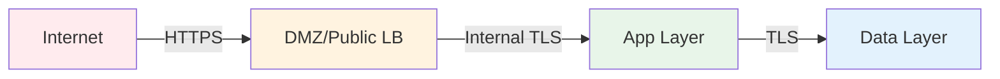
```mermaid
graph LR
    Internet[Internet] -->|HTTPS| DMZ[DMZ/Public LB]
    DMZ -->|Internal TLS| App[App Layer]
    App -->|TLS| Data[Data Layer]

    style Internet fill:#ffebee
    style DMZ fill:#fff3e0
    style App fill:#e8f5e9
    style Data fill:#e3f2fd
```

### Data Protection
- **At Rest**: AES-256 encryption
- **In Transit**: TLS 1.3
- **Field-Level Encryption**: PII fields encrypted
- **Key Management**: AWS KMS / HashiCorp Vault

### Compliance
- **SOC 2**: Certified (controls documented)
- **GDPR**: Data residency, right to deletion
- **PCI DSS**: Level 1 compliant (payment processing)
```

#### **Deployment Architecture**
- Infrastructure topology
- Deployment strategies (blue-green, canary, rolling)
- Environment configuration
- Scaling strategies
- Disaster recovery and backup

**Required Diagrams:**
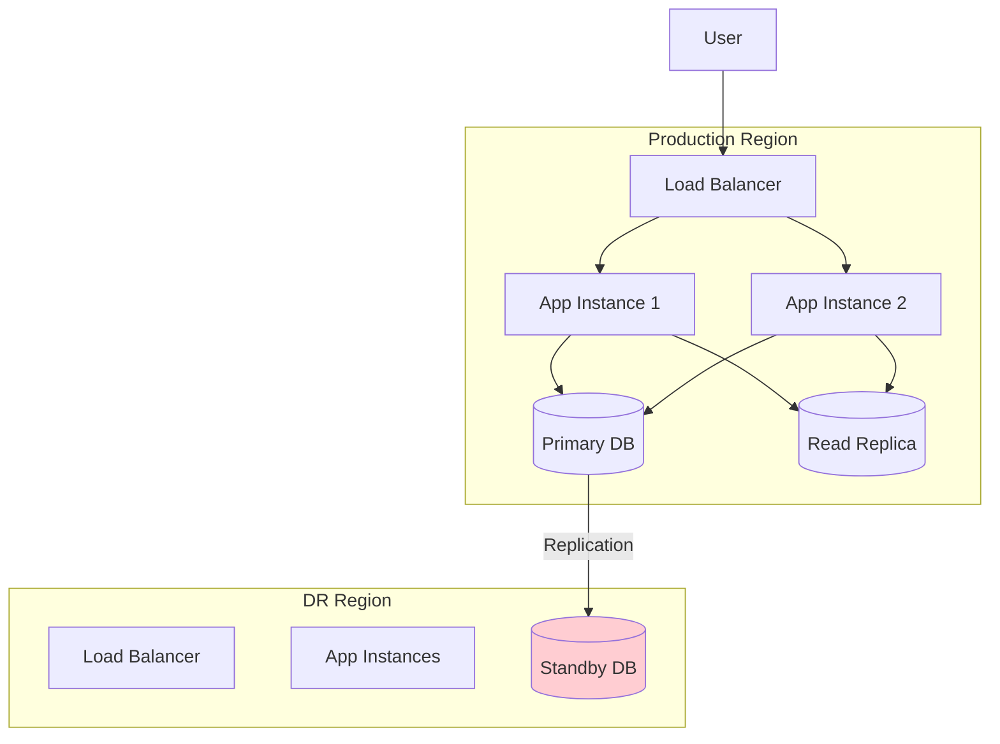
```mermaid
graph TB
    subgraph "Production Region"
        LB[Load Balancer]
        App1[App Instance 1]
        App2[App Instance 2]
        DB[(Primary DB)]
        Replica[(Read Replica)]
    end

    subgraph "DR Region"
        DRLB[Load Balancer]
        DRApp[App Instances]
        DRDB[(Standby DB)]
    end

    User --> LB
    LB --> App1
    LB --> App2
    App1 --> DB
    App2 --> DB
    App1 --> Replica
    App2 --> Replica
    DB -->|Replication| DRDB

    style DRDB fill:#ffcdd2
```

```markdown
## Deployment Architecture

### Infrastructure
- **Cloud Provider**: AWS / GCP / Azure
- **Regions**: Primary (us-east-1), DR (us-west-2)
- **Networking**: VPC with private subnets
- **Compute**: Kubernetes (EKS/GKE/AKS)

### Scaling Strategy
| Component | Min Instances | Max Instances | Scaling Trigger |
|-----------|---------------|---------------|-----------------|
| API Server | 2 | 50 | CPU > 70% |
| Worker | 1 | 20 | Queue depth > 100 |
| Database | Multi-AZ | Multi-AZ | N/A |

### Deployment Process
1. **CI Pipeline**: Build, test, scan
2. **Staging**: Deploy to staging environment
3. **Canary**: 10% of production traffic
4. **Full Rollout**: Gradual rollout over 30 minutes
5. **Monitoring**: Automated rollback on errors

### Disaster Recovery
- **RTO** (Recovery Time Objective): 4 hours
- **RPO** (Recovery Point Objective): 15 minutes
- **Backup Strategy**: Continuous backup to S3/GCS
- **DR Testing**: Monthly failover tests
```

#### **Operational Aspects**
- Monitoring and observability
- Logging strategy
- Alerting and incident response
- Performance tuning
- Capacity planning

```markdown
## Operational Aspects

### Observability

#### Metrics (Prometheus/Grafana)
- **RED Method**: Rate, Errors, Duration
- **USE Method**: Utilization, Saturation, Errors
- Key dashboards: System Overview, API Performance, Database Health

#### Logging (ELK/Loki)
- **Log Format**: JSON structured logs
- **Log Levels**: ERROR, WARN, INFO, DEBUG
- **Centralization**: All logs sent to log aggregation
- **Retention**: 30 days hot, 1 year cold

#### Tracing (Jaeger/Tempo)
- **Trace Sampling**: 1% of requests (production)
- **Span Context**: W3C Trace Context
- **Visualization**: Service graph in tracing UI

### Alerting
| Alert | Severity | Threshold | Escalation |
|-------|----------|-----------|------------|
| High Error Rate | P1 | > 5% errors | On-call immediately |
| High Latency | P2 | p95 > 1s | On-call within 15m |
| Disk Space Low | P3 | < 15% free | Next business day |

### Runbooks
- [Incident Response](./runbooks/incident-response.md)
- [Database Failover](./runbooks/db-failover.md)
- [Scaling Events](./runbooks/scaling.md)
```

### 2.2 Documenting "Engines" or "Processing Systems"

#### **Engine Documentation Template**

```markdown
## [Engine Name] Engine

### Purpose
[What problems does this engine solve? What processing does it perform?]

### Architecture Overview
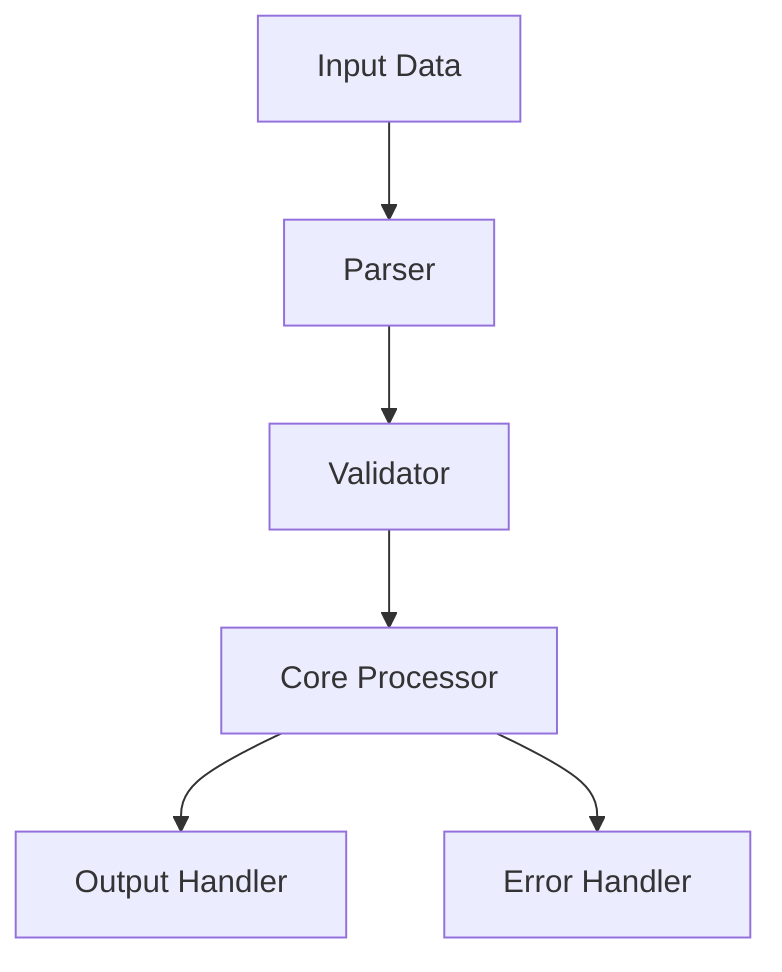
```mermaid
graph TB
    Input[Input Data] --> Parser[Parser]
    Parser --> Validator[Validator]
    Validator --> Processor[Core Processor]
    Processor --> Output[Output Handler]
    Processor --> Error[Error Handler]
```

### Processing Pipeline

#### Stage 1: Input Parsing
**Purpose:** Convert raw input to structured format

**Input Format:**
```json
{
  "raw": "unstructured data"
}
```

**Output Format:**
```typescript
interface ParsedData {
  valid: boolean;
  data: StructuredData;
  errors: ValidationError[];
}
```

**Implementation:** `src/engine/parser.ts`

#### Stage 2: Validation
**Purpose:** Ensure data meets business rules

**Validation Rules:**
- Rule 1: [Description]
- Rule 2: [Description]

**Error Handling:**
- Invalid data: Reject with error details
- Partial failures: Log and continue (if configured)

#### Stage 3: Core Processing
**Purpose:** [Main transformation/computation]

**Algorithm:** [Link to algorithm documentation]

**Performance Characteristics:**
- Time Complexity: O(n log n)
- Space Complexity: O(n)
- Throughput: 1000 items/second
- Latency: p50: 10ms, p95: 50ms, p99: 100ms

**Configuration:**
```typescript
interface EngineConfig {
  batchSize: number;
  parallelism: number;
  timeout: number;
  retryPolicy: RetryConfig;
}
```

#### Stage 4: Output Handling
**Purpose:** Format and deliver results

**Output Formats:**
- JSON (default)
- CSV (via plugin)
- Custom (via plugin system)

### Extensibility Points

#### Plugin Architecture
```typescript
interface EnginePlugin {
  name: string;
  version: string;

  // Lifecycle hooks
  beforeProcess?(data: Input): Promise<Input>;
  afterProcess?(data: Output): Promise<Output>;
  onError?(error: Error): Promise<void>;

  // Custom processors
  processors?: Processor[];
}
```

**Built-in Plugins:**
- [Plugin 1]: [Description]
- [Plugin 2]: [Description]

**Custom Plugin Development:** See [Plugin Development Guide](./plugins.md)

### Data Flow
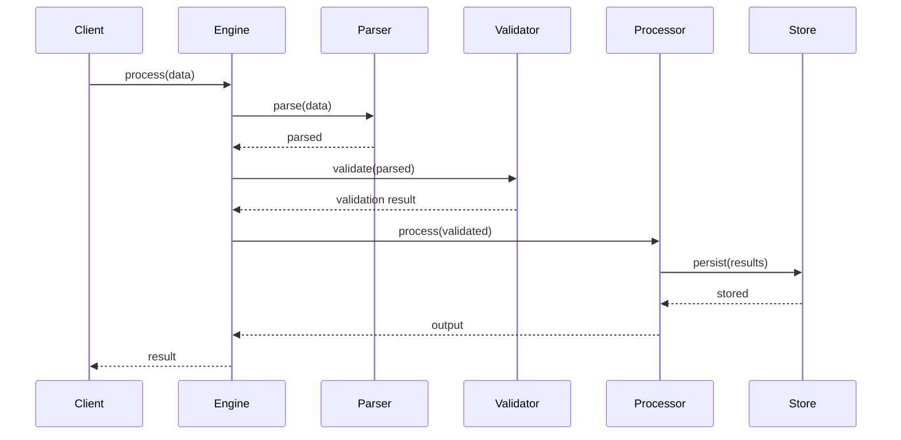
```mermaid
sequenceDiagram
    participant Client
    participant Engine
    participant Parser
    participant Validator
    participant Processor
    participant Store

    Client->>Engine: process(data)
    Engine->>Parser: parse(data)
    Parser-->>Engine: parsed
    Engine->>Validator: validate(parsed)
    Validator-->>Engine: validation result
    Engine->>Processor: process(validated)
    Processor->>Store: persist(results)
    Store-->>Processor: stored
    Processor-->>Engine: output
    Engine-->>Client: result
```

### Error Handling Strategy

#### Error Categories
1. **Transient Errors**: Retry automatically
   - Network timeouts
   - Temporary unavailability
   - Rate limiting

2. **Permanent Errors**: Fail fast, notify
   - Invalid input data
   - Configuration errors
   - Permission denied

3. **Partial Failures**: Continue with warning
   - Some items fail batch validation
   - Non-critical enrichment fails

#### Retry Policy
- **Max Attempts**: 3
- **Backoff**: Exponential (base: 100ms, multiplier: 2)
- **Jitter**: Random jitter up to 50%

### Performance Optimization

#### Caching Strategy
- **L1 Cache**: In-memory LRU (max: 10,000 items)
- **L2 Cache**: Redis (TTL: 1 hour)
- **Cache Keys**: `{resource}:{id}:{version}`

#### Parallelization
- **Batch Processing**: Process items in parallel batches
- **Worker Pool**: Configurable pool size (default: CPU cores)
- **Partitioning**: Sharded by key for ordered processing

#### Profiling
- **Hot Paths**: Identified via continuous profiling
- **Optimization Targets**: Functions consuming > 5% CPU
- **Benchmark Results**: See [benchmarks.md](./benchmarks.md)

### Monitoring
**Key Metrics:**
- `engine_requests_total`: Total requests processed
- `engine_duration_seconds`: Processing duration (histogram)
- `engine_errors_total`: Total errors (by type)
- `engine_cache_hit_rate`: Cache effectiveness

**Health Checks:**
- `/health/live`: Liveness probe
- `/health/ready`: Readiness probe (checks dependencies)

### Testing
- **Unit Tests**: `npm test -- src/engine/**/*.test.ts`
- **Integration Tests**: `npm test -- tests/engine/integration/`
- **Performance Tests**: `npm run test:perf`
- **Test Coverage Target**: 90%

### Configuration Examples

**Minimal Configuration:**
```yaml
engine:
  mode: standard
  workers: 4
```

**Production Configuration:**
```yaml
engine:
  mode: optimized
  workers: 16
  batchSize: 100
  cache:
    enabled: true
    ttl: 3600
  retry:
    maxAttempts: 3
    backoff: exponential
  monitoring:
    metrics: prometheus
    tracing: jaeger
```
```

### 2.3 Documenting Data Flows and Component Interactions

#### **Data Flow Diagram (DFD) Best Practices**

**DFD Levels:**
1. **Context Diagram (Level 0)**: System as a black box
2. **Level 1 DFD**: Major processes and data stores
3. **Level 2 DFD**: Detailed sub-processes

**Notation:**
- **Circle/Rectangle**: Process
- **Arrow**: Data flow
- **Open Rectangle**: Data store
- **Square**: External entity

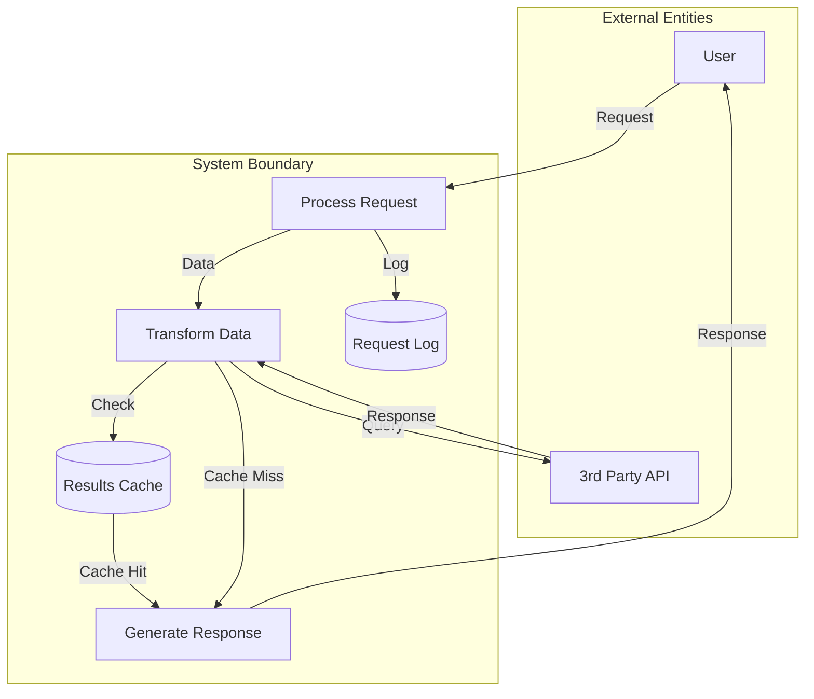
```mermaid
graph TB
    subgraph "External Entities"
        User[User]
        ExternalAPI[3rd Party API]
    end

    subgraph "System Boundary"
        Process1[Process Request]
        Process2[Transform Data]
        Process3[Generate Response]

        Store1[(Request Log)]
        Store2[(Results Cache)]
    end

    User -->|Request| Process1
    Process1 -->|Log| Store1
    Process1 -->|Data| Process2
    Process2 -->|Query| ExternalAPI
    ExternalAPI -->|Response| Process2
    Process2 -->|Check| Store2
    Store2 -->|Cache Hit| Process3
    Process2 -->|Cache Miss| Process3
    Process3 -->|Response| User
```

#### **Sequence Diagram Patterns**

**Request-Response Pattern:**
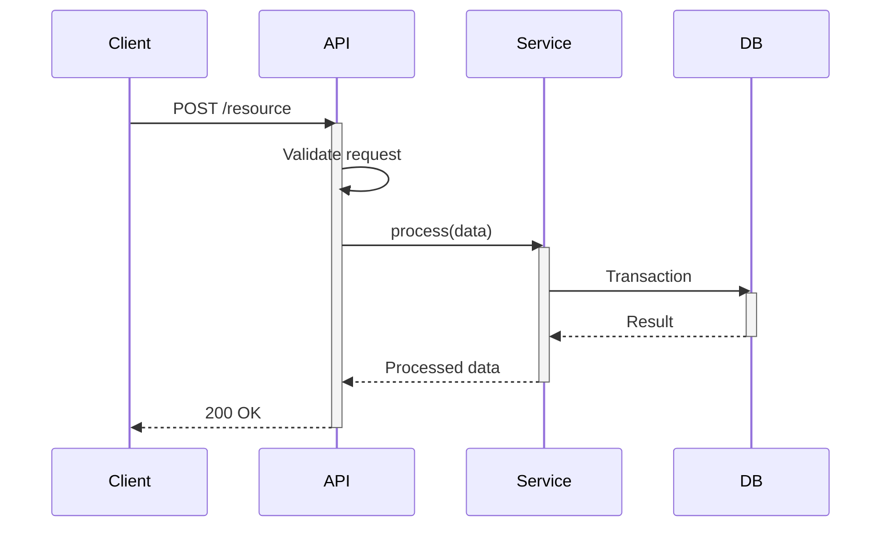
```mermaid
sequenceDiagram
    participant Client
    participant API
    participant Service
    participant DB

    Client->>API: POST /resource
    activate API
    API->>API: Validate request
    API->>Service: process(data)
    activate Service
    Service->>DB: Transaction
    activate DB
    DB-->>Service: Result
    deactivate DB
    Service-->>API: Processed data
    deactivate Service
    API-->>Client: 200 OK
    deactivate API
```

**Async Processing Pattern:**
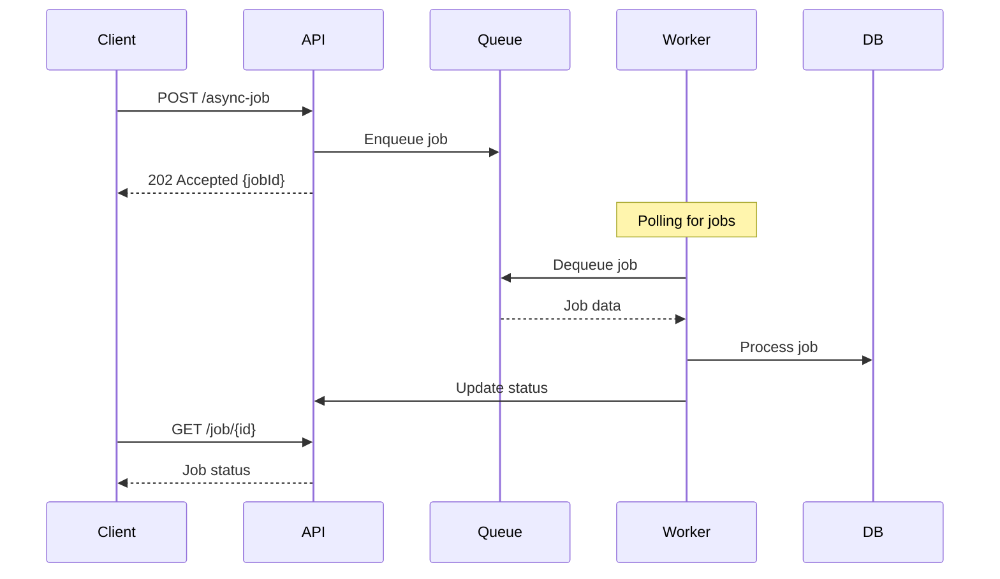
```mermaid
sequenceDiagram
    participant Client
    participant API
    participant Queue
    participant Worker
    participant DB

    Client->>API: POST /async-job
    API->>Queue: Enqueue job
    API-->>Client: 202 Accepted {jobId}

    Note over Worker: Polling for jobs
    Worker->>Queue: Dequeue job
    Queue-->>Worker: Job data
    Worker->>DB: Process job
    Worker->>API: Update status
    Client->>API: GET /job/{id}
    API-->>Client: Job status
```

**Error Handling Pattern:**
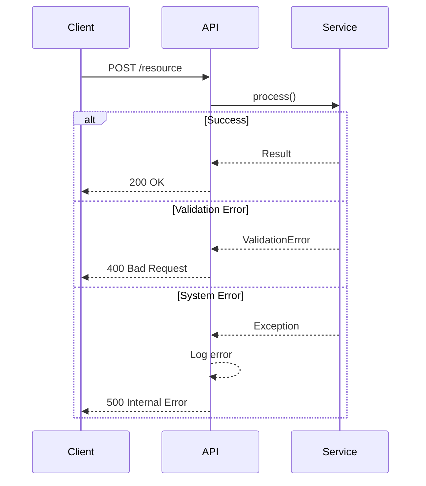
```mermaid
sequenceDiagram
    participant Client
    participant API
    participant Service

    Client->>API: POST /resource
    API->>Service: process()

    alt Success
        Service-->>API: Result
        API-->>Client: 200 OK
    else Validation Error
        Service-->>API: ValidationError
        API-->>Client: 400 Bad Request
    else System Error
        Service-->>API: Exception
        API-->>API: Log error
        API-->>Client: 500 Internal Error
    end
```

### 2.4 Documenting Extensibility Points and Integration Patterns

#### **Extension Points Documentation Template**

```markdown
## Extensibility Model

### Extension Points Overview
[Diagram showing all extension points]

### 1. Plugin System

**Plugin Interface:**
```typescript
interface Plugin {
  name: string;
  version: string;

  initialize(context: PluginContext): Promise<void>;
  execute(input: Input): Promise<Output>;
  cleanup(): Promise<void>;
}
```

**Lifecycle Hooks:**
- `beforeInit`: Before engine initialization
- `afterInit`: After engine is ready
- `beforeProcess`: Before each item processed
- `afterProcess`: After each item processed
- `onError`: When errors occur

**Plugin Discovery:**
- **Directory Scan**: Auto-discover plugins in `/plugins` directory
- **Configuration**: Explicit plugin list in config file
- **Dependencies**: Plugin dependency resolution

### 2. Custom Processors

**Processor Interface:**
```typescript
interface Processor {
  canProcess(data: Input): boolean;
  process(data: Input): Promise<Output>;
}
```

**Registration:**
```typescript
engine.registerProcessor(new CustomProcessor());
```

### 3. Event System

**Event Types:**
```typescript
enum EngineEvent {
  Initialized = 'engine.initialized',
  ProcessingStarted = 'engine.process.started',
  ProcessingCompleted = 'engine.process.completed',
  Error = 'engine.error',
}
```

**Event Subscription:**
```typescript
engine.on(EngineEvent.ProcessingCompleted, (data) => {
  // Handle event
});
```

### 4. Integration Patterns

#### Webhook Integration
```markdown
**Webhook Configuration:**
```yaml
webhooks:
  - url: https://api.example.com/hooks
    events: ['processing.completed']
    auth:
      type: bearer
      token: ${WEBHOOK_TOKEN}
```

**Webhook Payload:**
```json
{
  "eventId": "uuid",
  "eventType": "processing.completed",
  "timestamp": "2025-01-13T10:00:00Z",
  "data": {
    "jobId": "job-123",
    "status": "success"
  }
}
```
```

#### Queue Integration
```markdown
**Supported Queues:**
- AWS SQS
- Google Pub/Sub
- RabbitMQ
- Kafka

**Configuration:**
```yaml
queue:
  type: sqs
  region: us-east-1
  queueUrl: ${QUEUE_URL}
```
```

### 5. API Integration

**REST API:**
```
POST /api/v1/extensions
GET /api/v1/extensions
PUT /api/v1/extensions/{id}
DELETE /api/v1/extensions/{id}
```

**gRPC Service:**
```protobuf
service ExtensionService {
  rpc RegisterExtension(RegisterRequest) returns (RegisterResponse);
  rpc ListExtensions(ListRequest) returns (ListResponse);
}
```
```

#### **Integration Testing Guide**

```markdown
## Integration Testing

### Test Environment Setup
```bash
# Start test dependencies
docker-compose up -d test-db test-queue

# Run integration tests
npm run test:integration
```

### Example Integration Test
```typescript
describe('Plugin Integration', () => {
  it('should execute plugin hooks', async () => {
    const plugin = new TestPlugin();
    await engine.registerPlugin(plugin);

    const result = await engine.process(testData);

    expect(plugin.beforeProcessCalled).toBe(true);
    expect(plugin.afterProcessCalled).toBe(true);
    expect(result).toEqual(expectedResult);
  });
});
```

### Mock Integration Points
```typescript
const mockService = {
  process: jest.fn().mockResolvedValue({ data: 'mock' })
};

engine.registerService('external', mockService);
```
```
```

---

## 3. Four-Layer/Tier Architecture Documentation

### 3.1 Documenting Systems with Distinct Processing Engines

#### **Four-Layer Architecture Model**

```
┌─────────────────────────────────────────┐
│      Layer 1: Presentation Layer        │
│  (User Interfaces, API Gateways)        │
├─────────────────────────────────────────┤
│      Layer 2: Application Layer         │
│  (Business Logic, Orchestration)        │
├─────────────────────────────────────────┤
│      Layer 3: Domain/Engine Layer       │
│  (Core Processing, Business Rules)      │
├─────────────────────────────────────────┤
│      Layer 4: Infrastructure Layer      │
│  (Data, External Services, Utilities)   │
└─────────────────────────────────────────┘
```

#### **Layer Documentation Template**

```markdown
## Four-Layer Architecture

### Layer 1: Presentation Layer

**Purpose:** Handle user interaction and external API requests

**Components:**
- Web UI (React/Vue/Angular)
- Mobile Apps (iOS/Android)
- API Gateway (REST/GraphQL/gRPC)
- WebSocket Server (real-time updates)

**Responsibilities:**
- Request validation
- Authentication/authorization (token validation)
- Rate limiting
- Response formatting
- UI state management

**Entry Points:**
```
POST /api/v1/resources
GET /api/v1/resources/:id
WebSocket /ws/stream
```

**Technology Stack:**
- Framework: Express.js / Fastify / NestJS
- API Spec: OpenAPI 3.1
- Auth: OAuth 2.0 Bearer tokens
```

### Layer 2: Application Layer

**Purpose:** Orchestrate business workflows and coordinate domain operations

**Components:**
- Application Services
- Workflow Engine
- Transaction Coordinator
- Event Aggregator

**Responsibilities:**
- Use case orchestration
- Transaction management
- Event publishing
- Caching coordination
- Business rule evaluation

**Example Service:**
```typescript
class ResourceApplicationService {
  async createResource(
    command: CreateResourceCommand
  ): Promise<ResourceDTO> {
    // 1. Validate business rules
    await this.validator.validate(command);

    // 2. Execute domain logic
    const resource = await this.domainEngine.create(command);

    // 3. Publish events
    await this.eventBus.publish(new ResourceCreatedEvent(resource));

    // 4. Return DTO
    return ResourceMapper.toDTO(resource);
  }
}
```

**Technology Stack:**
- Framework: NestJS / Spring Boot / .NET Core
- Messaging: RabbitMQ / Kafka / AWS SNS
- Cache: Redis / Memcached
```

### Layer 3: Domain/Engine Layer

**Purpose:** Implement core business logic and domain rules

**Components:**
- Domain Models (Entities, Value Objects)
- Domain Services
- Processing Engines
- Business Rules Engine
- Domain Events

**Responsibilities:**
- Core business computations
- Business rule enforcement
- Domain state management
- Domain event emission
- Domain-specific validations

**Engine Architecture:**
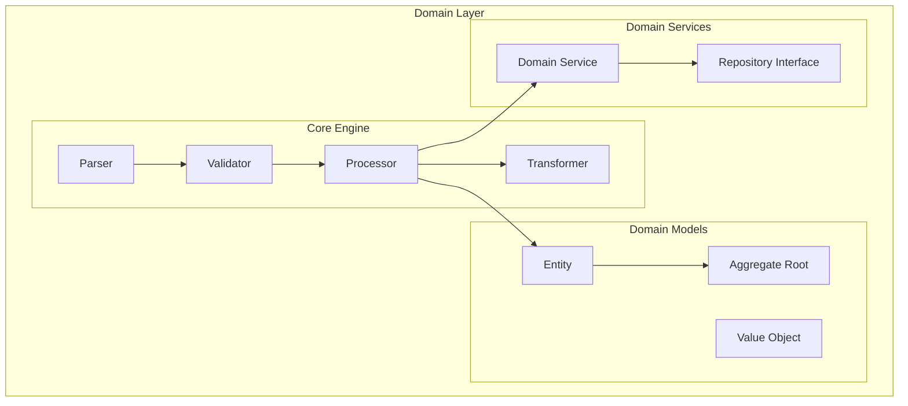
```mermaid
graph TB
    subgraph "Domain Layer"
        subgraph "Core Engine"
            Parser[Parser]
            Validator[Validator]
            Processor[Processor]
            Transformer[Transformer]
        end

        subgraph "Domain Models"
            Entity[Entity]
            ValueObj[Value Object]
            Aggregate[Aggregate Root]
        end

        subgraph "Domain Services"
            DomainSvc[Domain Service]
            Repository[Repository Interface]
        end
    end

    Parser --> Validator
    Validator --> Processor
    Processor --> Transformer
    Processor --> Entity
    Entity --> Aggregate
    Processor --> DomainSvc
    DomainSvc --> Repository
```

**Example Processing Engine:**
```typescript
class DataProcessingEngine {
  async process(input: RawInput): Promise<ProcessedOutput> {
    // 1. Parse input
    const parsed = await this.parser.parse(input);

    // 2. Validate domain rules
    const validation = await this.validator.validate(parsed);
    if (!validation.isValid) {
      throw new DomainValidationException(validation.errors);
    }

    // 3. Apply business logic
    const result = await this.processor.execute(parsed);

    // 4. Enrich with domain data
    const enriched = await this.transformer.enrich(result);

    // 5. Return domain output
    return ProcessedOutput.create(enriched);
  }
}
```

**Technology Stack:**
- Domain-Driven Design patterns
- Validation: Zod / Joi / Yup
- Business Rules: JSON Rules Engine / Drools
```

### Layer 4: Infrastructure Layer

**Purpose:** Provide technical capabilities and external integrations

**Components:**
- Database (PostgreSQL, MongoDB, etc.)
- Cache (Redis, Memcached)
- Message Queue (RabbitMQ, Kafka)
- External APIs (3rd party services)
- File Storage (S3, Azure Blob)
- Search Engine (Elasticsearch)

**Responsibilities:**
- Data persistence
- Caching
- Messaging
- File storage
- Search indexing
- External service calls

**Repository Implementation:**
```typescript
// Infrastructure implementation of domain repository interface
class PostgresResourceRepository implements ResourceRepository {
  async save(resource: Resource): Promise<void> {
    await this.db.query(
      'INSERT INTO resources (id, data, version) VALUES ($1, $2, $3)',
      [resource.id, JSON.stringify(resource.data), resource.version]
    );
  }

  async findById(id: string): Promise<Resource | null> {
    const row = await this.db.query(
      'SELECT * FROM resources WHERE id = $1',
      [id]
    );
    return row ? ResourceMapper.toDomain(row) : null;
  }
}
```

**Technology Stack:**
- Database: PostgreSQL 15+ / MongoDB 7+
- ORM: Prisma / TypeORM / Mongoose
- Cache: Redis 7+
- Queue: RabbitMQ / Kafka / AWS SQS
- Storage: AWS S3 / Azure Blob / GCS
```
```

### 3.2 Component Interaction Diagrams

#### **Layer Interaction Patterns**

**Synchronous (Request-Response):**
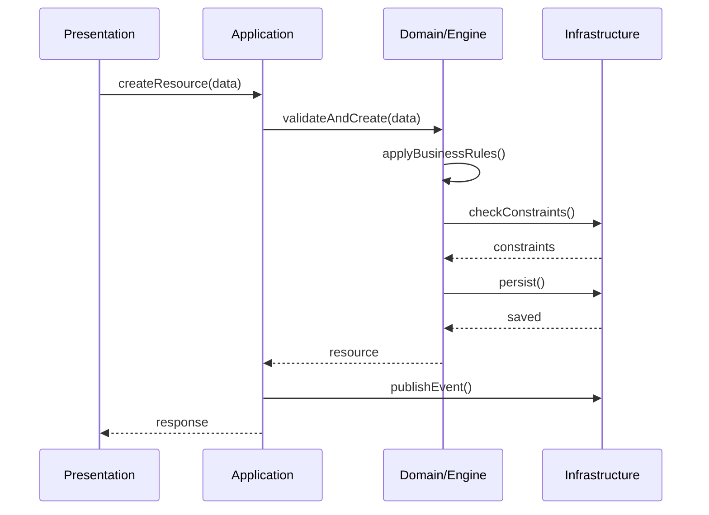
```mermaid
sequenceDiagram
    participant UI as Presentation
    participant APP as Application
    participant DOM as Domain/Engine
    participant INF as Infrastructure

    UI->>APP: createResource(data)
    APP->>DOM: validateAndCreate(data)
    DOM->>DOM: applyBusinessRules()
    DOM->>INF: checkConstraints()
    INF-->>DOM: constraints
    DOM->>INF: persist()
    INF-->>DOM: saved
    DOM-->>APP: resource
    APP->>INF: publishEvent()
    APP-->>UI: response
```

**Asynchronous (Event-Driven):**
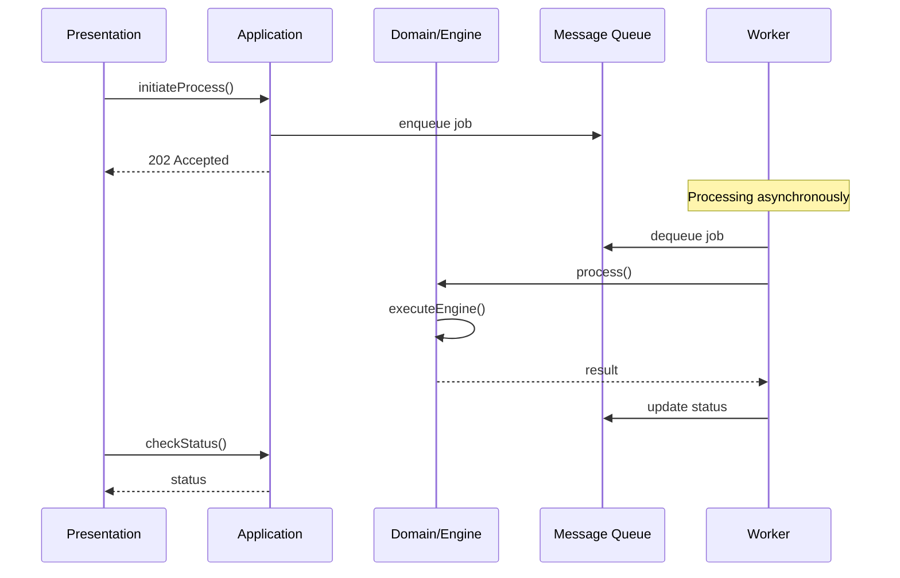
```mermaid
sequenceDiagram
    participant UI as Presentation
    participant APP as Application
    participant DOM as Domain/Engine
    participant Q as Message Queue
    participant W as Worker

    UI->>APP: initiateProcess()
    APP->>Q: enqueue job
    APP-->>UI: 202 Accepted

    Note over W: Processing asynchronously
    W->>Q: dequeue job
    W->>DOM: process()
    DOM->>DOM: executeEngine()
    DOM-->>W: result
    W->>Q: update status

    UI->>APP: checkStatus()
    APP-->>UI: status
```

#### **Component Dependency Diagram**

```mermaid
graph TB
    subgraph "Presentation Layer"
        WebAPI[REST API]
        GraphQLAPI[GraphQL API]
        WS[WebSocket Server]
    end

    subgraph "Application Layer"
        ResourceSvc[Resource Service]
        WorkflowSvc[Workflow Service]
        NotificationSvc[Notification Service]
    end

    subgraph "Domain/Engine Layer"
        ProcessingEngine[Processing Engine]
        ValidationEngine[Validation Engine]
        TransformEngine[Transform Engine]
        DomainModels[Domain Models]
    end

    subgraph "Infrastructure Layer"
        DB[(Database)]
        Cache[(Cache)]
        Queue[Message Queue]
        Storage[Object Storage]
    end

    WebAPI --> ResourceSvc
    GraphQLAPI --> ResourceSvc
    WS --> NotificationSvc

    ResourceSvc --> ProcessingEngine
    WorkflowSvc --> ValidationEngine
    WorkflowSvc --> ProcessingEngine

    ProcessingEngine --> DomainModels
    ValidationEngine --> DomainModels
    TransformEngine --> DomainModels

    ProcessingEngine --> DB
    ProcessingEngine --> Cache
    WorkflowSvc --> Queue
    NotificationSvc --> Queue
    ProcessingEngine --> Storage
```

### 3.3 Data Flow Diagrams (DFD) Best Practices

#### **Level 0 DFD (Context Diagram)**

```mermaid
graph LR
    subgraph "External"
        User[End User]
        Admin[Admin]
        ExtAPI[3rd Party API]
    end

    subgraph "System"
        System[Your System]
    end

    User -->|Requests| System
    System -->|Responses| User
    Admin -->|Admin Commands| System
    System -->|Reports| Admin
    System -->|API Calls| ExtAPI
    ExtAPI -->|Data| System
```

#### **Level 1 DFD (Main Processes)**

```mermaid
graph TB
    User[User] -->|Request| API[API Handler]

    API -->|Validate| Auth[Auth Service]
    API -->|Process| Biz[Business Logic]

    Biz -->|Read| DB[(Database)]
    Biz -->|Write| DB
    Biz -->|Enqueue| MQ[Message Queue]
    Biz -->|Query| Cache[(Cache)]

    MQ --> Worker[Worker Process]
    Worker -->|Update| DB
    Worker -->|Notify| Notification[Notification Service]

    Cache -->|Cache Miss| DB

    API -->|Response| User
```

#### **Level 2 DFD (Detailed Process)**

```mermaid
graph TB
    Input[Input Data] --> Parse[Parser]

    Parse --> Validate{Valid?}
    Validate -->|No| Error[Error Handler]
    Validate -->|Yes| Transform[Transform]

    Transform --> Enrich{Enrichment?}
    Enrich -->|Yes| Ext[External Data]
    Ext --> Enrich
    Enrich -->|No| Process[Process]

    Transform --> Process
    Process --> Cache[Cache Result]
    Process --> Persist[Persist]
    Process --> Notify[Notify]

    Error --> Log[Log Error]
    Error --> User[Return Error]

    Cache --> Output[Output]
    Persist --> Output
    Notify --> Output
```

#### **DFD Best Practices Checklist**

- [ ] **Consistency**: Use consistent shapes and colors
- [ ] **Numbering**: Number processes (1.0, 1.1, 1.2, etc.)
- [ ] **Labeling**: Label all data flows clearly
- [ ] **Balancing**: Ensure input/output balance at each level
- [ ] **Decomposition**: One process per diagram (max 7-9 processes)
- [ ] **Stores**: Show all data stores
- [ ] **External Entities**: Clearly mark external systems
- [ ] **Triggers**: Show what initiates each process
- [ ] **Error Paths**: Include error handling flows
- [ ] **Legend**: Add legend explaining notation

---

## 4. API Documentation Integration

### 4.1 Linking Architecture Docs to Generated API Docs

#### **TypeDoc Integration Patterns**

**Project Structure:**
```
project/
├── docs/
│   ├── architecture/
│   │   ├── overview.md
│   │   └── components.md
│   ├── api/
│   │   └── index.html (TypeDoc output)
│   └── index.md
├── src/
│   ├── core/
│   │   ├── Engine.ts
│   │   └── Processor.ts
│   └── api/
│       └── routes.ts
└── typedoc.json
```

**typedoc.json Configuration:**
```json
{
  "$schema": "https://typedoc.org/schema.json",
  "entryPoints": ["src/core", "src/api"],
  "out": "docs/api",
  "excludePrivate": true,
  "excludeProtected": false,
  "categorizeByGroup": true,
  "categoryOrder": ["Engine", "Processors", "Utilities"],
  "kindSortOrder": [
    "Reference",
    "Project",
    "Module",
    "Namespace",
    "Enum",
    "EnumMember",
    "Class",
    "Interface",
    "TypeAlias",
    "Function",
    "Variable"
  ],
  "gitRevision": "main",
  "readme": "README.md",
  "plugin": ["typedoc-plugin-markdown"],
  "theme": "default"
}
```

**Architecture Document with TypeDoc Links:**
```markdown
## Core Engine Architecture

### Engine Component

The **Engine** is the core processing component responsible for:

- [x] Parsing input data
- [x] Validating business rules
- [x] Executing transformations
- [x] Managing state transitions

**API Documentation:** See the [Engine API Reference](../api/classes/Engine.md) for detailed method signatures.

**Key Methods:**
- [`Engine.process()`](../api/classes/Engine.md#process): Main processing method
- [`Engine.validate()`](../api/classes/Engine.md#validate): Input validation
- [`Engine.transform()`](../api/classes/Engine.md#transform): Data transformation

**Related Interfaces:**
- [`EngineConfig`](../api/interfaces/EngineConfig.md): Configuration options
- [`EngineResult`](../api/interfaces/EngineResult.md): Result type

### Usage Example

```typescript
import { Engine } from '@project/core';

const engine = new Engine({
  mode: 'optimized',
  parallelism: 4
});

const result = await engine.process(inputData);
```

For more examples, see the [API Examples](../api/modules/examples.html).
```

#### **JSDoc Comment Standards**

**Comprehensive JSDoc Template:**
```typescript
/**
 * Core processing engine for data transformation workflows.
 *
 * The Engine orchestrates the complete data processing pipeline,
 * including parsing, validation, transformation, and output generation.
 *
 * @example
 * ```typescript
 * const engine = new Engine({
 *   mode: 'optimized',
 *   parallelism: 4
 * });
 * const result = await engine.process(inputData);
 * ```
 *
 * @see {@link Processor} for processor implementations
 * @see {@link EngineConfig} for configuration options
 *
 * @remarks
 * The Engine follows a pipeline architecture:
 * 1. Parse input to structured format
 * 2. Validate against business rules
 * 3. Apply transformations
 * 4. Generate output
 *
 * @public
 */
export class Engine {
  /**
   * Creates a new Engine instance.
   *
   * @param config - Configuration options for the engine
   * @throws {@link ConfigurationError} if config is invalid
   *
   * @example
   * ```typescript
   * const engine = new Engine({ mode: 'standard' });
   * ```
   */
  constructor(config: EngineConfig) {
    // Implementation
  }

  /**
   * Process input data through the engine pipeline.
   *
   * This method executes the complete processing workflow:
   * - Parse input to structured format
   * - Validate against configured rules
   * - Apply transformations
   * - Return processed output
   *
   * @param input - Raw input data to process
   * @param options - Optional processing overrides
   * @returns Promise resolving to processed output
   *
   * @throws {@link ValidationError} if input validation fails
   * @throws {@link ProcessingError} if transformation fails
   *
   * @example
   * ```typescript
   * const result = await engine.process(
   *   rawData,
   *   { timeout: 5000 }
   * );
   * ```
   *
   * @remarks
   * Processing is asynchronous and may take significant time
   * for large datasets. Consider using batch processing for
   * multiple inputs.
   *
   * @public
   */
  async process(
    input: RawInput,
    options?: ProcessingOptions
  ): Promise<ProcessedOutput> {
    // Implementation
  }

  /**
   * Validate input data without processing.
   *
   * This is a lightweight validation check that doesn't
   * perform full processing. Useful for pre-flight checks.
   *
   * @param input - Input data to validate
   * @returns Validation result with errors if any
   *
   * @example
   * ```typescript
   * const validation = await engine.validate(input);
   * if (!validation.isValid) {
   *   console.error(validation.errors);
   * }
   * ```
   *
   * @beta This API is in beta and may change
   */
  async validate(input: RawInput): Promise<ValidationResult> {
    // Implementation
  }
}
```

#### **Cross-Referencing Tags**

**Supported TypeDoc Tags:**
- `@see {@link ClassName}`: Link to another class
- `@see {@link ClassName.method}`: Link to specific method
- `@example`: Usage examples (rendered as code blocks)
- `@remarks`: Additional information
- `@throws {@link ErrorType}`: Exceptions thrown
- `@param`: Parameter documentation
- `@returns`: Return value documentation
- `@public` / `@private` / `@protected`: Access modifiers
- `@alpha` / `@beta` / `@experimental`: API stability
- `@deprecated`: Deprecation notice
- `@since`: Version when introduced
- `@override`: Indicates method override
- `@hidden`: Exclude from documentation

### 4.2 Cross-Referencing Patterns

#### **Markdown to TypeDoc Links**

**Absolute Links:**
```markdown
<!-- Link to a class -->
See the [Engine class](../api/classes/Engine.md) for details.

<!-- Link to a method -->
The [process method](../api/classes/Engine.md#process) handles input.

<!-- Link to an interface -->
[EngineConfig](../api/interfaces/EngineConfig.md) specifies options.

<!-- Link to a type alias -->
[Result type](../api/types/Result.md) defines the output.
```

**Relative Links with Anchors:**
```markdown
<!-- Link to specific section -->
For configuration options, see [EngineConfig.mode](../api/interfaces/EngineConfig.md#mode).

<!-- Link with custom text -->
For error handling, refer to the [error documentation](../api/modules/errors.html).
```

#### **Bidirectional Linking**

**From Architecture to API:**
```markdown
## Processing Pipeline

The pipeline consists of four stages:

1. **Parsing**: See [Parser.parse()](../api/classes/Parser.md#parse)
2. **Validation**: See [Validator.validate()](../api/classes/Validator.md#validate)
3. **Transformation**: See [Transformer.transform()](../api/classes/Transformer.md#transform)
4. **Output**: See [OutputGenerator.generate()](../api/classes/OutputGenerator.md#generate)

For complete API reference, see the [API Documentation](../api/index.html).
```

**From API to Architecture (in JSDoc):**
```typescript
/**
 * Main processing entry point.
 *
 * This method orchestrates the complete data processing pipeline.
 * For architectural overview, see the [Engine Architecture](../../architecture/engine.md).
 *
 * @see {@link ../architecture/engine.md} Architecture documentation
 */
async process(input: RawInput): Promise<Output>;
```

### 4.3 Keeping Docs in Sync with Code

#### **Automated Documentation Pipeline**

**CI/CD Integration:**
```yaml
# .github/workflows/docs.yml
name: Generate Documentation

on:
  push:
    branches: [main]
  pull_request:
    branches: [main]

jobs:
  docs:
    runs-on: ubuntu-latest

    steps:
      - uses: actions/checkout@v3

      - name: Setup Node.js
        uses: actions/setup-node@v3
        with:
          node-version: '20'

      - name: Install dependencies
        run: npm ci

      - name: Generate TypeDoc
        run: npm run docs:generate

      - name: Check doc coverage
        run: npm run docs:coverage

      - name: Validate links
        run: npm run docs:link-check

      - name: Deploy to GitHub Pages
        if: github.ref == 'refs/heads/main'
        uses: peaceiris/actions-gh-pages@v3
        with:
          github_token: ${{ secrets.GITHUB_TOKEN }}
          publish_dir: ./docs
```

**Package.json Scripts:**
```json
{
  "scripts": {
    "docs:generate": "typedoc --options typedoc.json",
    "docs:watch": "typedoc --watch --options typedoc.json",
    "docs:coverage": "typescript-doc-coverage --config doc-coverage.json",
    "docs:link-check": "markdown-link-check docs/**/*.md",
    "docs:serve": "npx serve docs/",
    "precommit": "npm run docs:coverage"
  }
}
```

#### **Documentation Coverage Validation**

**doc-coverage.json:**
```json
{
  "coverage": {
    "statements": 80,
    "branches": 80,
    "functions": 90,
    "lines": 80
  },
  "rules": {
    "files": [
      {
        "pattern": "src/core/**/*.ts",
        "documentation": {
          "publicAPI": true,
          "privateAPI": false
        }
      }
    ]
  }
}
```

**Pre-commit Hook (.husky/pre-commit):**
```bash
#!/bin/bash
# Ensure documentation is updated before commit

echo "Checking documentation coverage..."

npm run docs:generate
if [ $? -ne 0 ]; then
  echo "❌ Documentation generation failed"
  exit 1
fi

npm run docs:coverage
if [ $? -ne 0 ]; then
  echo "❌ Documentation coverage below threshold"
  exit 1
fi

echo "✅ Documentation check passed"
```

#### **Automated Link Validation**

**markdown-link-check-config.json:**
```json
{
  "ignorePatterns": [
    {
      "pattern": "^http://localhost"
    },
    {
      "pattern": "^../api/"
    }
  ],
  "timeout": "10s",
  "retryOn429": true,
  "fallbackRetryDelay": "5000",
  "aliveStatusCodes": [200, 206, 301, 302, 303, 307, 308]
}
```

#### **Version Strategy**

**Multiple Versions:**
```bash
docs/
├── v1.0.0/
│   ├── api/
│   └── architecture/
├── v1.1.0/
│   ├── api/
│   └── architecture/
├── v2.0.0/
│   ├── api/
│   └── architecture/
└── index.html (redirects to latest)
```

**Version Selector in Documentation:**
```html
<!-- docs/_includes/version-selector.html -->
<div class="version-selector">
  <label for="version">Version:</label>
  <select id="version" onchange="switchVersion(this.value)">
    <option value="v2.0.0">v2.0.0 (latest)</option>
    <option value="v1.1.0">v1.1.0</option>
    <option value="v1.0.0">v1.0.0</option>
  </select>
</div>

<script>
function switchVersion(version) {
  window.location.href = `/${version}/index.html`;
}
</script>
```

---

## 5. Examples from Open Source Projects

### 5.1 Kubernetes Architecture Documentation

**Project:** https://kubernetes.io/
**Documentation:** https://kubernetes.io/docs/concepts/architecture/

**Why It's Excellent:**
- Comprehensive coverage of distributed systems architecture
- Clear separation between concepts and implementation
- Extensive use of diagrams for complex topics
- Multiple levels of detail (overview → deep dive)

**Key Documentation Elements:**

1. **Architecture Overview Diagram**
   - Shows control plane vs. worker node components
   - Clear visual separation of concerns
   - Color-coded components

2. **Component Descriptions**
   - Each component has dedicated page
   - Responsibilities clearly defined
   - Inter-component communications documented

3. **Data Flow Documentation**
   - Sequence diagrams for common operations
   - Request lifecycle documented
   - State transitions visualized

4. **Extensibility Points**
   - Custom Resources (CRDs)
   - Operator pattern
   - Webhooks and admission controllers
   - Plugin architecture

**Structure Analysis:**
```
kubernetes.io/docs/
├── concepts/
│   ├── architecture/
│   │   ├── master-node-communication.md
│   │   ├── control-plane.md
│   │   └── cloud-controller.md
│   ├── extend-kubernetes/
│   │   ├── api-extension.md
│   │   ├── operators.md
│   │   └── compute-storage-net/
│   └── components/
│       ├── kube-apiserver.md
│       ├── etcd.md
│       ├── kube-scheduler.md
│       └── kube-controller-manager.md
└── tasks/
    ├── administer-cluster/
    └── access-application-cluster/
```

**What Makes It Effective:**
- **Layered Approach**: Starts high-level, drills down
- **Visual-First**: Diagrams before text
- **Component Catalog**: Each component has dedicated docs
- **Extensibility Focus**: Clear documentation of extension points
- **Real-World Examples**: Use cases with code samples

**Best Practices Observed:**
1. Consistent diagram style across all docs
2. API documentation linked to architecture concepts
3. Separation of "what it is" vs "how to use it"
4. Version-specific documentation
5. Interactive diagrams (where applicable)
6. Multiple entry points for different audiences

**Sample Architecture Diagram (Kubernetes Style):**
```mermaid
graph TB
    subgraph "Control Plane"
        API[API Server]
        Scheduler[Scheduler]
        Controller[Controller Manager]
        etcd[(etcd)]
    end

    subgraph "Worker Node"
        Kubelet[Kubelet]
        Proxy[Proxy]
        Container[Container Runtime]
        Pod[Pods]
    end

    subgraph "User"
        kubectl[kubectl CLI]
    end

    kubectl --> API
    API --> Scheduler
    API --> Controller
    Scheduler --> API
    Controller --> API
    API --> etcd

    API --> Kubelet
    Kubelet --> Container
    Container --> Pod
    Proxy --> Pod
```

---

### 5.2 Vue.js Architecture Documentation

**Project:** https://vuejs.org/
**Documentation:** https://vuejs.org/guide/extras/rendering-mechanism.html

**Why It's Excellent:**
- Clear explanation of rendering architecture
- Visual diagrams of reactivity system
- Incremental complexity (basic → advanced)
- Excellent use of code examples

**Key Documentation Elements:**

1. **Rendering Mechanism**
   - Virtual DOM explanation
   - Render functions vs templates
   - Compilation process diagram

2. **Reactivity System**
   - Deep dive into proxies
   - Dependency tracking visualization
   - Performance optimization guides

3. **Component Architecture**
   - Component lifecycle diagrams
   - Props/events flow
   - Slot system documentation

**Structure Analysis:**
```
vuejs.org/
├── guide/
│   ├── essentials/
│   │   ├── reactivity-fundamentals.md
│   │   ├── computed.md
│   │   └── lifecycle-hooks.md
│   ├── components/
│   │   ├── props.md
│   │   ├── events.md
│   │   └── slots.md
│   └── extras/
│       ├── rendering-mechanism.md
│       ├── reactivity-in-depth.md
│       └── reactivity-system.md
└── api/
    ├── index.md (API reference)
    └── utility-types.md
```

**What Makes It Effective:**
- **Progressive Disclosure**: Start simple, add complexity
- **Visual Learning**: Diagrams for abstract concepts
- **Code Annotations**: Comments explain why, not what
- **Performance Focus**: Architecture tied to performance
- **Comparison Guides**: Compare approaches with trade-offs

**Reactivity Diagram Example:**
```mermaid
graph LR
    Component[Component] -->|get| Proxy[Proxy]
    Proxy -->|track| Effect[Effect]
    Effect -->|trigger| Update[Update View]

    Proxy -->|read| State[State]
    Update -->|write| State
```

---

### 5.3 TypeScript Architecture Documentation

**Project:** https://www.typescriptlang.org/
**Documentation:** https://www.typescriptlang.org/docs/handbook/declaration-files/do-s-and-don-ts.html

**Why It's Excellent:**
- Comprehensive type system documentation
- Detailed compiler architecture explanations
- Clear "how it works" sections
- Extensive cross-referencing

**Key Documentation Elements:**

1. **Type System Architecture**
   - Type inference rules
   - Type compatibility
   - Generics explained with diagrams

2. **Compiler Internals**
   - Compilation phases
   - AST (Abstract Syntax Tree) structure
   - Type checking algorithm

3. **Declaration Files**
   - Library authoring guide
   - Declaration file structure
   - Best practices with examples

**Structure Analysis:**
```
typescriptlang.org/
├── docs/
│   ├── handbook/
│   │   ├── declaration-files/
│   │   ├── decorators/
│   │   ├── modules/
│   │   └── typescript-for-java-programmers/
│   ├── project-config/
│   │   ├── tsconfig.json.md
│   │   ├── compiler-options.md
│   │   └── project-references.md
│   └── declaration-reference/
│       └── types.md
└── architecture/
    ├── compiler.md
    └── type-system.md
```

**What Makes It Effective:**
- **Target Audience Specific**: Guides for different backgrounds
- **Playground Integration**: Editable examples
- **Migration Guides**: Clear upgrade paths
- **Error Documentation**: Common errors explained
- **Best Practices**: Do's and Don'ts sections

---

### 5.4 Comparison and Key Takeaways

| Project | Diagram Usage | Documentation Style | Standout Feature |
|---------|--------------|---------------------|------------------|
| Kubernetes | Extensive | Comprehensive, technical | Multi-level depth, extensibility focus |
| Vue.js | Moderate | Progressive, educational | Visual learning, code examples |
| TypeScript | Minimal | Precise, reference | Error documentation, migration guides |

**Common Patterns Across Excellent Docs:**

1. **Consistent Navigation**
   - Sidebar with clear hierarchy
   - Breadcrumbs for context
   - Next/previous links

2. **Code Examples**
   - Copy-paste ready
   - Annotated with explanations
   - Multiple approaches shown

3. **Visual Aids**
   - Diagrams for complex concepts
   - Color-coded components
   - Consistent diagram style

4. **Audience Segmentation**
   - Getting started (beginners)
   - In-depth guides (intermediate)
   - API reference (experts)

5. **Cross-References**
   - Related concepts linked
   - Prerequisites identified
   - External resources cited

**Documentation Anti-Patterns to Avoid:**

1. **Wall of Text**: Break up with diagrams and examples
2. **Outdated Examples**: Keep examples updated
3. **Missing Context**: Explain why, not just what
4. **Inconsistent Terminology**: Use glossary
5. **No Version Info**: Document version-specific changes

---

## 6. Tools and Resources

### 6.1 Mermaid Resources

**Official Documentation:**
- **Main Site**: https://mermaid.js.org/
- **Documentation**: https://mermaid.js.org/intro/
- **Syntax Guide**: https://mermaid.js.org/syntax/flowchart.html
- **Live Editor**: https://mermaid.live/

**Diagram Type References:**
- **Flowchart**: https://mermaid.js.org/syntax/flowchart.html
- **Sequence Diagram**: https://mermaid.js.org/syntax/sequenceDiagram.html
- **Class Diagram**: https://mermaid.js.org/syntax/classDiagram.html
- **State Diagram**: https://mermaid.js.org/syntax/stateDiagram.html
- **ER Diagram**: https://mermaid.js.org/syntax/erDiagram.html
- **Gantt Chart**: https://mermaid.js.org/syntax/gantt.html
- **User Journey**: https://mermaid.js.org/syntax/userJourney.html
- **Git Graph**: https://mermaid.js.org/syntax/gitgraph.html

**Advanced Features:**
- **Styling**: https://mermaid.js.org/config/theming.html
- **Directives**: https://mermaid.js.org/config/directives.html
- **Interaction**: https://mermaid.js.org/config/usage.html#interaction

### 6.2 Architecture Documentation Frameworks

**C4 Model:**
- **Website**: https://c4model.com/
- **Book**: "Software Architecture for Developers" (Simon Brown)
- **Tools**: https://c4model.com/#Tools
- **Example**: https://c4model.com/#Example

**Arc42 Template:**
- **Website**: https://arc42.org/
- **Download**: https://arc42.org/download
- **Overview**: https://arc42.org/overview
- **Examples**: https://arc42.org/examples

**4+1 View Model:**
- **Original Paper**: https://www.ieee-software-ratings.com/Articles--The-4+1-View-Model-of-Architecture
- **Explanation**: https://www.ibm.com/docs/en/rational-rose/2003?topic=model-4-1-view-model-architecture

**Documenting Software Architectures:**
- **Book**: "Documenting Software Architectures: Views and Beyond" (Paul Clements et al.)
- **IEEE Standard**: IEEE 1471 (now ISO/IEC 42010)

### 6.3 TypeDoc Resources

**Official Documentation:**
- **Main Site**: https://typedoc.org/
- **GitHub**: https://github.com/TypeStrong/TypeDoc
- **Documentation**: https://typedoc.org/options/
- **Tag Reference**: https://typedoc.org/tags/

**Configuration:**
- **typedoc.json Schema**: https://typedoc.org/schema.json
- **Options Reference**: https://typedoc.org/options/
- **Plugin API**: https://typedoc.org/plugins/

**Plugins and Themes:**
- **typedoc-plugin-markdown**: https://github.com/tgreyuk/typedoc-plugin-markdown
- **typedoc-plugin-mermaid**: https://github.com/tgreyuk/typedoc-plugin-mermaid
- **typedoc-plugin-sourcefile-url**: https://github.com/agestam/typedoc-plugin-sourcefile-url

### 6.4 Documentation Generators

**Static Site Generators:**
- **Docusaurus**: https://docusaurus.io/
- **VitePress**: https://vitepress.dev/
- **MkDocs**: https://www.mkdocs.org/
- **GitBook**: https://www.gitbook.com/

**API Documentation Tools:**
- **Swagger/OpenAPI**: https://swagger.io/
- **OpenAPI Generator**: https://openapi-generator.tech/
- **Redoc**: https://github.com/Redocly/redoc

**Diagram Tools:**
- **Draw.io**: https://app.diagrams.net/
- **PlantUML**: https://plantuml.com/
- **Diagrams.net**: https://www.diagrams.net/

### 6.5 Open Source Documentation Examples

**Kubernetes:**
- **Architecture**: https://kubernetes.io/docs/concepts/architecture/
- **Components**: https://kubernetes.io/docs/concepts/overview/components/
- **Extend Kubernetes**: https://kubernetes.io/docs/concepts/extend-kubernetes/

**Vue.js:**
- **Rendering Mechanism**: https://vuejs.org/guide/extras/rendering-mechanism.html
- **Reactivity in Depth**: https://vuejs.org/guide/extras/reactivity-in-depth.html

**React:**
- **Architecture**: https://react.dev/learn/understanding-uis-progressively
- **Thinking in React**: https://react.dev/learn/thinking-in-react

**TypeScript:**
- **Handbook**: https://www.typescriptlang.org/docs/handbook/intro.html
- **Declaration Files**: https://www.typescriptlang.org/docs/handbook/declaration-files/do-s-and-don-ts.html

**Django:**
- **Design Philosophies**: https://docs.djangoproject.com/en/5.0/misc/design-philosophies/
- **Architecture**: https://docs.djangoproject.com/en/5.0/internals/

### 6.6 Recommended Reading

**Books:**
1. "Software Architecture for Developers" by Simon Brown
2. "Documenting Software Architectures" by Paul Clements
3. "Building Evolutionary Architectures" by Ford, Parsons, Kua
4. "Fundamentals of Software Architecture" by Richards, Ford
5. "The Software Architect Elevator" by Gregor Hohpe

**Articles and Papers:**
1. "C4 Model" by Simon Brown
2. "Arc42 Documentation Template" by Dr. Gernot Starke
3. "4+1 View Model" by Philippe Kruchten
4. "Microservices Architecture" by Martin Fowler
5. "You Can't Untangle Your Way to a Clean Architecture" by Kent Beck

**Blogs:**
1. Martin Fowler's Blog: https://martinfowler.com/
2. High Scalability: https://www.highscalability.com/
3. The New Stack: https://thenewstack.io/
4. ThoughtWorks Technology Radar: https://www.thoughtworks.com/radar

### 6.7 Tools Summary Table

| Tool | Purpose | URL | License |
|------|---------|-----|---------|
| Mermaid | Diagram syntax | https://mermaid.js.org/ | MIT |
| TypeDoc | TypeScript API docs | https://typedoc.org/ | Apache-2.0 |
| Docusaurus | Documentation site | https://docusaurus.io/ | MIT |
| MkDocs | Documentation site | https://www.mkdocs.org/ | BSD-2-Clause |
| Draw.io | Diagram editor | https://app.diagrams.net/ | GPLv3 |
| PlantUML | Diagram syntax | https://plantuml.com/ | GPL-3.0 |
| Swagger | API documentation | https://swagger.io/ | Apache-2.0 |
| Redoc | API documentation | https://github.com/Redocly/redoc | MIT |
| Arc42 | Documentation template | https://arc42.org/ | CC-BY-4.0 |
| C4 Model | Architecture model | https://c4model.com/ | Creative Commons |

---

## Appendix: Quick Reference

### Mermaid Syntax Quick Reference

```mermaid
%% Flowchart
graph TB
    A[Start] --> B{Decision}
    B -->|Yes| C[Action 1]
    B -->|No| D[Action 2]

%% Sequence
sequenceDiagram
    participant A
    participant B
    A->>B: Request
    B-->>A: Response

%% Class
classDiagram
    class A{
        +method()
    }
    A <|-- B

%% State
stateDiagram-v2
    [*] --> Active
    Active --> [*]

%% ER
erDiagram
    A ||--o{ B : has

%% Gantt
gantt
    title Project Timeline
    section Phase 1
    Task 1: 2024-01-01, 7d
```

### Documentation Checklist

**Architecture Documentation:**
- [ ] System overview diagram
- [ ] Component catalog
- [ ] Data flow diagrams
- [ ] Sequence diagrams for key operations
- [ ] Deployment architecture
- [ ] Security architecture
- [ ] Technology stack summary
- [ ] Extensibility points documented
- [ ] Operational aspects (monitoring, logging)
- [ ] Cross-references to API docs

**API Documentation:**
- [ ] All public APIs documented
- [ ] JSDoc comments with examples
- [ ] Type definitions included
- [ ] Error conditions documented
- [ ] Rate limits and quotas
- [ ] Authentication/authorization details
- [ ] Code examples provided
- [ ] Linked to architecture docs
- [ ] Version information included

**Diagram Checklist:**
- [ ] Consistent styling
- [ ] Clear labels and annotations
- [ ] Appropriate level of detail
- [ ] Legends where needed
- [ ] Color coding explained
- [ ] Version controlled
- [ ] Renders correctly on all platforms
- [ ] Text descriptions provided (accessibility)

---

## Conclusion

Effective architecture documentation requires:

1. **Multiple Diagram Types**: Use flowcharts, sequences, state diagrams, and ER diagrams appropriately
2. **Layered Information**: Start with overview, drill down to details
3. **Consistent Structure**: Follow templates for each component/layer
4. **Visual-First Approach**: Diagrams before text
5. **Cross-References**: Link between architecture and API documentation
6. **Version Control**: Track documentation changes with code
7. **Multiple Audiences**: Different entry points for different skill levels
8. **Extensibility Focus**: Document extension points clearly
9. **Tool Integration**: Use TypeDoc, Mermaid, and documentation generators
10. **Continuous Updates**: Keep docs in sync with code

**Key Resources:**
- Mermaid: https://mermaid.js.org/
- TypeDoc: https://typedoc.org/
- C4 Model: https://c4model.com/
- Arc42: https://arc42.org/
- Kubernetes Docs (excellent example): https://kubernetes.io/docs/
