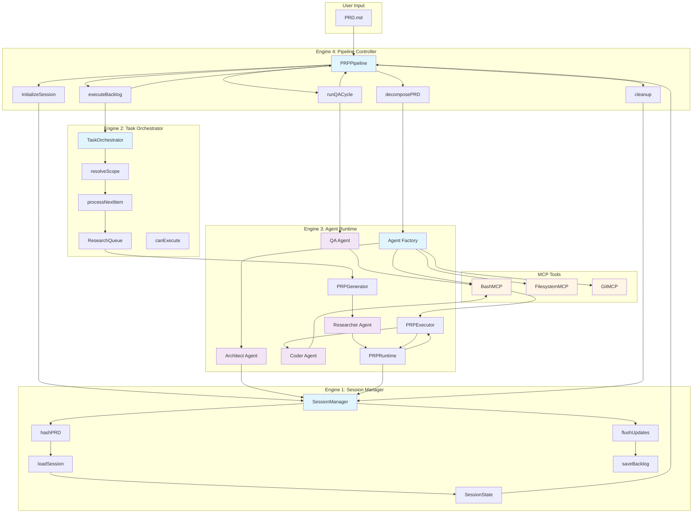
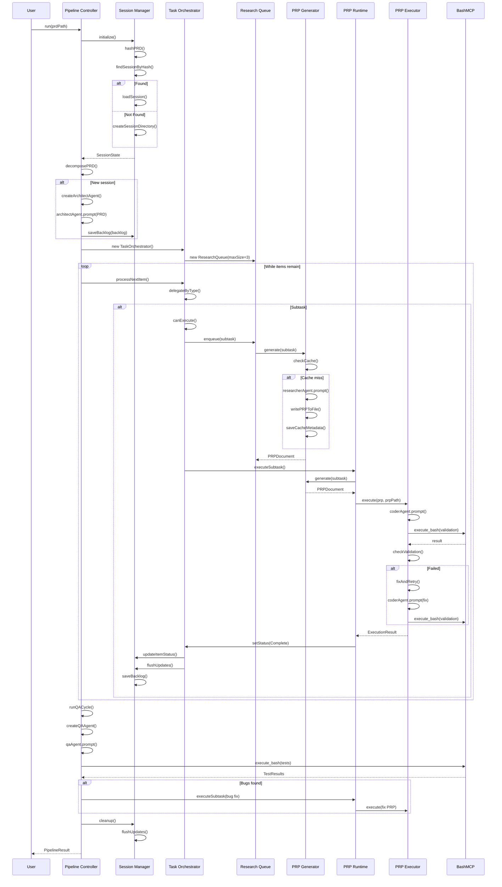
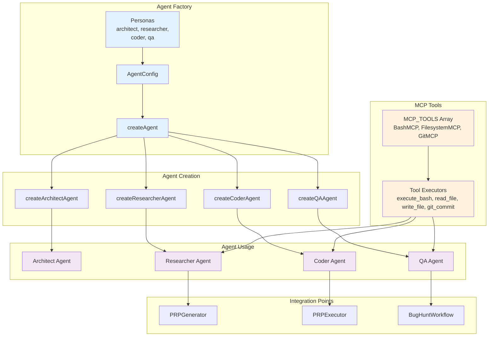

# Four Core Processing Engines - Implementation Analysis

**Date**: 2026-01-13
**Analyzed By**: Claude (GLM-4.7)
**Repository**: /home/dustin/projects/hacky-hack

## Table of Contents

1. [System Overview](#system-overview)
2. [Engine 1: Session Manager](#engine-1-session-manager)
3. [Engine 2: Task Orchestrator](#engine-2-task-orchestrator)
4. [Engine 3: Agent Runtime](#engine-3-agent-runtime)
5. [Engine 4: Pipeline Controller](#engine-4-pipeline-controller)
6. [Data Flow Analysis](#data-flow-analysis)
7. [Component Interactions](#component-interactions)
8. [Diagrams](#diagrams)

---

## System Overview

The PRP Pipeline implements a four-engine architecture that transforms a PRD (Product Requirements Document) into working code through a systematic process. Each engine has specific responsibilities and well-defined interfaces.

```
┌─────────────────────────────────────────────────────────────────┐
│                     PRP Pipeline System                         │
├─────────────────────────────────────────────────────────────────┤
│                                                                  │
│  ┌──────────────┐    ┌──────────────┐    ┌──────────────┐      │
│  │   Pipeline   │───▶│    Task      │───▶│    Agent     │      │
│  │ Controller   │    │ Orchestrator │    │   Runtime    │      │
│  └──────────────┘    └──────────────┘    └──────────────┘      │
│         │                    │                    │             │
│         └────────────────────┴────────────────────┘             │
│                      │                                           │
│                      ▼                                           │
│              ┌──────────────┐                                   │
│              │   Session    │                                   │
│              │   Manager    │                                   │
│              └──────────────┘                                   │
└─────────────────────────────────────────────────────────────────┘
```

---

## Engine 1: Session Manager

**Location**: `/home/dustin/projects/hacky-hack/src/core/session-manager.ts`

### Purpose

Manages development session state, PRD hashing, session discovery/loading, and delta session creation. Provides centralized state management with immutable patterns and atomic write operations.

### Class Structure

```typescript
export class SessionManager {
  readonly #logger: Logger;
  readonly prdPath: string;
  readonly planDir: string;
  #currentSession: SessionState | null = null;
  #prdHash: string | null = null;
  #dirty: boolean = false; // Batching state
  #pendingUpdates: Backlog | null = null; // Batching state
  #updateCount: number = 0; // Batching state
}
```

### Key Methods

| Method                             | Purpose                       | Returns                            |
| ---------------------------------- | ----------------------------- | ---------------------------------- |
| `initialize()`                     | Hash PRD, find/create session | `Promise<SessionState>`            |
| `loadSession(path)`                | Load existing session         | `Promise<SessionState>`            |
| `createDeltaSession(newPRDPath)`   | Handle PRD changes            | `Promise<DeltaSession>`            |
| `saveBacklog(backlog)`             | Persist tasks.json            | `Promise<void>`                    |
| `loadBacklog()`                    | Load tasks.json               | `Promise<Backlog>`                 |
| `updateItemStatus(itemId, status)` | Update task status (batched)  | `Promise<Backlog>`                 |
| `flushUpdates()`                   | Atomic batch write            | `Promise<void>`                    |
| `getCurrentItem()`                 | Get current task              | `HierarchyItem \| null`            |
| `setCurrentItem(itemId)`           | Set current task              | `void`                             |
| `hasSessionChanged()`              | Check PRD modification        | `boolean`                          |
| `listSessions()`                   | List all sessions             | `Promise<SessionMetadata[]>`       |
| `findLatestSession()`              | Find latest session           | `Promise<SessionMetadata \| null>` |
| `findSessionByPRD(prdPath)`        | Find session for PRD          | `Promise<SessionMetadata \| null>` |

### Dependencies

```typescript
// Imports
import { getLogger } from '../utils/logger.js';
import type {
  SessionState,
  SessionMetadata,
  Backlog,
  Status,
} from './models.js';
import {
  hashPRD,
  createSessionDirectory,
  readTasksJSON,
  writeTasksJSON,
} from './session-utils.js';
import { diffPRDs } from './prd-differ.js';
import { updateItemStatus, findItem } from '../utils/task-utils.js';
```

### State Management Patterns

1. **Immutable Properties**: All public fields are `readonly`
2. **Batching with Dirty Flag**: Updates accumulated in memory, flushed atomically

   ```typescript
   async updateItemStatus(itemId: string, status: Status): Promise<Backlog> {
     const updated = updateItemStatusUtil(currentBacklog, itemId, status);
     this.#pendingUpdates = updated;
     this.#dirty = true;
     this.#updateCount++;
     // Not persisted until flushUpdates() called
   }
   ```

3. **Atomic Flush Pattern**:
   ```typescript
   async flushUpdates(): Promise<void> {
     if (!this.#dirty) return;
     await this.saveBacklog(this.#pendingUpdates);
     // Reset batching state
     this.#dirty = false;
     this.#pendingUpdates = null;
     this.#updateCount = 0;
   }
   ```

### Input/Output Data Flow

```
PRD.md (input)
  │
  ├─▶ hashPRD() → SHA-256 hash
  │
  ├─▶ Search plan/ for matching hash
  │   │
  │   ├─ Found? → loadSession() → SessionState
  │   │
  │   └─ Not Found? → createSessionDirectory() → new SessionState
  │
  └─▶ SessionState output:
      ├─ metadata: { id, hash, path, createdAt, parentSession }
      ├─ prdSnapshot: string
      ├─ taskRegistry: Backlog
      └─ currentItemId: string | null
```

### Integration Points

- **Called by**: Pipeline Controller (initialization), Task Orchestrator (state queries)
- **Calls to**: `session-utils.ts` (file operations), `prd-differ.ts` (diffing)
- **Provides**: Session state to all engines

---

## Engine 2: Task Orchestrator

**Location**: `/home/dustin/projects/hacky-hack/src/core/task-orchestrator.ts`

### Purpose

Provides recursive depth-first traversal (DFS) of the task backlog hierarchy with type-specific execution delegation. Orchestrates PRP generation queue and manages dependency resolution.

### Class Structure

```typescript
export class TaskOrchestrator {
  readonly #logger: Logger;
  readonly sessionManager: SessionManager;
  #backlog: Backlog;
  #scope: Scope | undefined;
  #executionQueue: HierarchyItem[];
  readonly researchQueue: ResearchQueue; // Parallel PRP generation
  readonly #prpRuntime: PRPRuntime; // Execution engine
  #cacheHits: number = 0;
  #cacheMisses: number = 0;
  readonly #noCache: boolean;
}
```

### Key Methods

| Method                               | Purpose                               | Returns            |
| ------------------------------------ | ------------------------------------- | ------------------ |
| `processNextItem()`                  | Process next item in queue            | `Promise<boolean>` |
| `setStatus(itemId, status, reason?)` | Update status with logging            | `Promise<void>`    |
| `canExecute(subtask)`                | Check if dependencies satisfied       | `boolean`          |
| `getBlockingDependencies(subtask)`   | Get incomplete dependencies           | `Subtask[]`        |
| `waitForDependencies(subtask, opts)` | Poll for dependency completion        | `Promise<void>`    |
| `setScope(scope)`                    | Change execution scope                | `Promise<void>`    |
| `executePhase(phase)`                | Set phase to Implementing             | `Promise<void>`    |
| `executeMilestone(milestone)`        | Set milestone to Implementing         | `Promise<void>`    |
| `executeTask(task)`                  | Enqueue subtasks for PRP generation   | `Promise<void>`    |
| `executeSubtask(subtask)`            | Execute subtask (main execution unit) | `Promise<void>`    |

### Dependencies

```typescript
// Imports
import type { SessionManager } from './session-manager.js';
import type {
  Backlog,
  Phase,
  Milestone,
  Task,
  Subtask,
  Status,
} from './models.js';
import { getDependencies } from '../utils/task-utils.js';
import type { Scope } from './scope-resolver.js';
import { resolveScope } from './scope-resolver.js';
import { smartCommit } from '../utils/git-commit.js';
import { ResearchQueue } from './research-queue.js';
import { PRPRuntime } from '../agents/prp-runtime.js';
```

### State Management Patterns

1. **DFS Pre-Order Traversal**:

   ```typescript
   async processNextItem(): Promise<boolean> {
     if (this.#executionQueue.length === 0) return false;
     const nextItem = this.#executionQueue.shift()!;
     await this.#delegateByType(nextItem);
     await this.#refreshBacklog();
     return true;
   }
   ```

2. **Type-Safe Dispatch**:

   ```typescript
   async #delegateByType(item: HierarchyItem): Promise<void> {
     switch (item.type) {
       case 'Phase': return this.executePhase(item);
       case 'Milestone': return this.executeMilestone(item);
       case 'Task': return this.executeTask(item);
       case 'Subtask': return this.executeSubtask(item);
       default: const _exhaustive: never = item; throw new Error();
     }
   }
   ```

3. **Dependency Resolution**:
   ```typescript
   public canExecute(subtask: Subtask): boolean {
     const dependencies = getDependencies(subtask, this.#backlog);
     if (dependencies.length === 0) return true;
     return dependencies.every(dep => dep.status === 'Complete');
   }
   ```

### Input/Output Data Flow

```
Backlog (from SessionManager)
  │
  ├─▶ resolveScope(scope) → HierarchyItem[]
  │   │
  │   └─▶ #executionQueue (FIFO)
  │
  └─▶ While queue not empty:
      │
      ├─▶ shift() → nextItem
      │
      ├─▶ #delegateByType(nextItem)
      │   │
      │   ├─ Phase → executePhase() → status = 'Implementing'
      │   ├─ Milestone → executeMilestone() → status = 'Implementing'
      │   ├─ Task → executeTask() → enqueue subtasks to ResearchQueue
      │   └─ Subtask → executeSubtask()
      │       │
      │       ├─ Check dependencies (canExecute)
      │       ├─ Set status 'Researching'
      │       ├─ Set status 'Implementing'
      │       ├─ PRPRuntime.executeSubtask()
      │       ├─ Set status 'Complete' or 'Failed'
      │       ├─ Smart commit
      │       └─ flushUpdates()
      │
      └─▶ Refresh backlog from SessionManager
```

### Integration Points

- **Called by**: Pipeline Controller (main loop)
- **Calls to**: SessionManager (state), PRPRuntime (execution), ResearchQueue (parallel PRP gen)
- **Provides**: Status updates to SessionManager, execution context to PRPRuntime

---

## Engine 3: Agent Runtime

**Location**: `/home/dustin/projects/hacky-hack/src/agents/`

The Agent Runtime consists of three main components:

### 3a. Agent Factory

**File**: `/home/dustin/projects/hacky-hack/src/agents/agent-factory.ts`

#### Purpose

Creates Groundswell agent configurations for four personas (architect, researcher, coder, qa) with optimized token limits and model selection.

#### Class Structure

```typescript
// Module-level singleton MCP instances
const BASH_MCP = new BashMCP();
const FILESYSTEM_MCP = new FilesystemMCP();
const GIT_MCP = new GitMCP();
const MCP_TOOLS = [BASH_MCP, FILESYSTEM_MCP, GIT_MCP];

// Factory functions
export function createArchitectAgent(): Agent;
export function createResearcherAgent(): Agent;
export function createCoderAgent(): Agent;
export function createQAAgent(): Agent;
```

#### Agent Personas

| Persona      | System Prompt         | Token Limit | Purpose                      |
| ------------ | --------------------- | ----------- | ---------------------------- |
| `architect`  | TASK_BREAKDOWN_PROMPT | 8192        | PRD analysis, task breakdown |
| `researcher` | PRP_BLUEPRINT_PROMPT  | 4096        | PRP generation, research     |
| `coder`      | PRP_BUILDER_PROMPT    | 4096        | Code implementation          |
| `qa`         | BUG_HUNT_PROMPT       | 4096        | Validation, bug hunting      |

#### Dependencies

```typescript
import { configureEnvironment, getModel } from '../config/environment.js';
import { createAgent, type Agent } from 'groundswell';
import {
  TASK_BREAKDOWN_PROMPT,
  PRP_BLUEPRINT_PROMPT,
  PRP_BUILDER_PROMPT,
  BUG_HUNT_PROMPT,
} from './prompts.js';
import { BashMCP } from '../tools/bash-mcp.js';
import { FilesystemMCP } from '../tools/filesystem-mcp.js';
import { GitMCP } from '../tools/git-mcp.js';
```

### 3b. PRP Generator

**File**: `/home/dustin/projects/hacky-hack/src/agents/prp-generator.ts`

#### Purpose

Orchestrates the Researcher Agent to generate comprehensive PRPs for any Task or Subtask in the backlog. Handles retry logic, file persistence, and disk-based caching with hash-based validation.

#### Class Structure

```typescript
export class PRPGenerator {
  readonly #logger: Logger;
  readonly sessionManager: SessionManager;
  readonly sessionPath: string;
  #researcherAgent: Agent;
  readonly #noCache: boolean;
  #cacheHits: number = 0;
  #cacheMisses: number = 0;
  readonly CACHE_TTL_MS = 24 * 60 * 60 * 1000; // 24 hours
}
```

#### Key Methods

| Method                                  | Purpose                       | Returns                        |
| --------------------------------------- | ----------------------------- | ------------------------------ |
| `generate(task, backlog)`               | Generate PRP with cache check | `Promise<PRPDocument>`         |
| `getCachePath(taskId)`                  | Get PRP markdown file path    | `string`                       |
| `getCacheMetadataPath(taskId)`          | Get cache JSON path           | `string`                       |
| `#computeTaskHash(task, backlog)`       | Compute SHA-256 hash          | `string`                       |
| `#isCacheRecent(filePath)`              | Check cache age               | `Promise<boolean>`             |
| `#loadCachedPRP(taskId)`                | Load from disk cache          | `Promise<PRPDocument \| null>` |
| `#saveCacheMetadata(taskId, hash, prp)` | Save cache metadata           | `Promise<void>`                |
| `#writePRPToFile(prp)`                  | Write PRP markdown            | `Promise<void>`                |

#### Caching Strategy

```
1. Compute task hash (SHA-256 of task inputs)
2. Check disk cache for existing PRP
3. Verify hash matches (task hasn't changed)
4. Check file age (< 24 hours)
5. If valid cache: return cached PRP (HIT)
6. If invalid/missing: generate new PRP (MISS)
7. Save new PRP to disk with metadata
```

### 3c. PRP Executor

**File**: `/home/dustin/projects/hacky-hack/src/agents/prp-executor.ts`

#### Purpose

Orchestrates the Coder Agent to execute PRPs, runs progressive validation gates (4 levels), and implements fix-and-retry logic for handling validation failures.

#### Class Structure

```typescript
export class PRPExecutor {
  readonly #logger: Logger;
  readonly sessionPath: string;
  readonly #coderAgent: Agent;
  readonly #bashMCP: BashMCP;
}
```

#### Key Methods

| Method                                    | Purpose                             | Returns                               |
| ----------------------------------------- | ----------------------------------- | ------------------------------------- |
| `execute(prp, prpPath)`                   | Execute PRP with validation + retry | `Promise<ExecutionResult>`            |
| `#runValidationGates(prp)`                | Run 4-level validation sequentially | `Promise<ValidationGateResult[]>`     |
| `#fixAndRetry(prp, failedGates, attempt)` | Trigger fix attempt                 | `Promise<void>`                       |
| `#parseCoderResult(response)`             | Parse JSON from agent               | `{ result: string, message: string }` |

#### Validation Gates

| Level | Description         | Command                | Manual? |
| ----- | ------------------- | ---------------------- | ------- |
| 1     | Syntax & Style      | linting, type checking | No      |
| 2     | Unit Tests          | component validation   | No      |
| 3     | Integration Testing | system validation      | No      |
| 4     | Manual/Creative     | end-to-end workflows   | Yes     |

#### Fix-and-Retry Logic

```
1. Execute validation gates sequentially (Level 1 → 2 → 3 → 4)
2. If any gate fails:
   a. Increment fixAttempts (max 2)
   b. Calculate exponential backoff delay (2^n seconds)
   c. Build error context from failed gates
   d. Prompt Coder Agent with fix prompt
   e. Re-run validation gates
3. If all gates pass: return success
4. If exhausted retries: return failure
```

### 3d. PRP Runtime

**File**: `/home/dustin/projects/hacky-hack/src/agents/prp-runtime.ts`

#### Purpose

Orchestrates the complete inner loop workflow: Research → Implementation → Validation → Artifact Collection.

#### Class Structure

```typescript
export class PRPRuntime {
  readonly #logger: Logger;
  readonly #orchestrator: TaskOrchestrator;
  readonly #sessionPath: string;
  readonly #generator: PRPGenerator;
  readonly #executor: PRPExecutor;
}
```

#### Key Methods

| Method                                  | Purpose                   | Returns                    |
| --------------------------------------- | ------------------------- | -------------------------- |
| `executeSubtask(subtask, backlog)`      | Full inner loop execution | `Promise<ExecutionResult>` |
| `#writeArtifacts(artifactsDir, result)` | Write validation results  | `Promise<void>`            |
| `#formatExecutionSummary(result)`       | Format markdown summary   | `string`                   |

#### Execution Flow

```
Subtask Input
  │
  ├─▶ Status: 'Researching'
  │   └─▶ PRPGenerator.generate() → PRPDocument
  │
  ├─▶ Status: 'Implementing'
  │   └─▶ PRPExecutor.execute(prp, prpPath)
  │       │
  │       ├─ Coder Agent prompt
  │       ├─ Parse result
  │       ├─ Run validation gates (Level 1-4)
  │       ├─ Fix-and-retry (if failed)
  │       └─ Return ExecutionResult
  │
  ├─▶ Write artifacts:
  │   ├─ validation-results.json
  │   ├─ execution-summary.md
  │   └─ artifacts-list.json
  │
  └─▶ Status: 'Complete' or 'Failed'
```

### Integration Points

- **Called by**: Task Orchestrator (executeSubtask), Pipeline Controller (decomposePRD)
- **Calls to**: Groundswell agents (createAgent), MCP tools (BashMCP, FilesystemMCP, GitMCP)
- **Provides**: PRP generation, code execution, validation

---

## Engine 4: Pipeline Controller

**Location**: `/home/dustin/projects/hacky-hack/src/workflows/prp-pipeline.ts`

### Purpose

Orchestrates the complete PRP Pipeline lifecycle: Session Initialization → PRD Decomposition → Backlog Execution → QA Cycle. Uses Groundswell Workflow decorators for observability.

### Class Structure

```typescript
export class PRPPipeline extends Workflow {
  // Public Observed State Fields
  sessionManager: SessionManager;
  taskOrchestrator: TaskOrchestrator;
  correlationLogger: Logger;
  runtime: PRPRuntime | null = null;
  currentPhase: string = 'init';
  mode: 'normal' | 'bug-hunt' | 'validate' = 'normal';
  totalTasks: number = 0;
  completedTasks: number = 0;
  shutdownRequested: boolean = false;
  currentTaskId: string | null = null;
  shutdownReason: 'SIGINT' | 'SIGTERM' | null = null;

  // Private Fields
  readonly #prdPath: string;
  readonly #scope?: Scope;
  readonly #noCache: boolean;
  #startTime: number = 0;
  #bugsFound: number = 0;
  readonly #correlationId: string;
  #progressTracker?: ProgressTracker;
}
```

### Key Methods

| Method                   | Purpose               | Returns                   |
| ------------------------ | --------------------- | ------------------------- |
| `run()`                  | Main entry point      | `Promise<PipelineResult>` |
| `initializeSession()`    | Detect/create session | `Promise<void>`           |
| `handleDelta()`          | Handle PRD changes    | `Promise<void>`           |
| `decomposePRD()`         | Generate task backlog | `Promise<void>`           |
| `executeBacklog()`       | Process all tasks     | `Promise<void>`           |
| `runQACycle()`           | QA bug hunt           | `Promise<void>`           |
| `cleanup()`              | State preservation    | `Promise<void>`           |
| `#countTasks()`          | Count total subtasks  | `number`                  |
| `#countCompletedTasks()` | Count completed       | `number`                  |
| `#countFailedTasks()`    | Count failed          | `number`                  |
| `#allTasksComplete()`    | Check completion      | `boolean`                 |
| `#summarizePhases()`     | Build phase summary   | `PhaseSummary[]`          |

### Dependencies

```typescript
import { Workflow, Step } from 'groundswell';
import type { SessionManager } from '../core/session-manager.js';
import type { TaskOrchestrator } from '../core/task-orchestrator.js';
import type { PRPRuntime } from '../agents/prp-runtime.js';
import type { Backlog, Status, DeltaAnalysis } from '../core/models.js';
import { SessionManager as SessionManagerClass } from '../core/session-manager.js';
import { TaskOrchestrator as TaskOrchestratorClass } from '../core/task-orchestrator.js';
import { DeltaAnalysisWorkflow } from './delta-analysis-workflow.js';
import { BugHuntWorkflow } from './bug-hunt-workflow.js';
import { FixCycleWorkflow } from './fix-cycle-workflow.js';
```

### State Management Patterns

1. **Groundswell Workflow Decorators**:

   ```typescript
   @Step({ trackTiming: true, name: 'handleDelta' })
   async handleDelta(): Promise<void> { ... }
   ```

2. **Graceful Shutdown**:

   ```typescript
   #setupSignalHandlers(): void {
     this.#sigintHandler = () => {
       this.#sigintCount++;
       if (this.#sigintCount > 1) return; // Duplicate
       this.shutdownRequested = true;
       this.shutdownReason = 'SIGINT';
     };
     process.on('SIGINT', this.#sigintHandler);
   }
   ```

3. **Progress Tracking**:
   ```typescript
   this.#progressTracker = progressTracker({
     backlog,
     logInterval: 5,
     barWidth: 40,
   });
   this.#progressTracker?.recordComplete(currentItemId);
   ```

### Input/Output Data Flow

```
PRD.md (input)
  │
  ├─▶ PRPPipeline constructor(prdPath, scope?, mode?, noCache?)
  │
  ├─▶ run() → PipelineResult
  │   │
  │   ├─ initializeSession()
  │   │   └─▶ SessionManager.initialize() → SessionState
  │   │
  │   ├─ hasSessionChanged()?
  │   │   └─ Yes → handleDelta()
  │   │       ├─ DeltaAnalysisWorkflow.run()
  │   │       ├─ patchBacklog()
  │   │       └─ createDeltaSession()
  │   │
  │   ├─ decomposePRD()
  │   │   ├─ Existing backlog? → Skip
  │   │   └─ New session? → ArchitectAgent → tasks.json
  │   │
  │   ├─ executeBacklog()
  │   │   └─▶ While !shutdownRequested && items remain:
  │   │       ├─ taskOrchestrator.processNextItem()
  │   │       ├─ Update completed count
  │   │       ├─ Log progress (every 5 tasks)
  │   │       └─ Check shutdown flag
  │   │
  │   ├─ runQACycle()
  │   │   ├─ Mode check (bug-hunt/validate/normal)
  │   │   ├─ BugHuntWorkflow.run() → TestResults
  │   │   ├─ hasBugs? → FixCycleWorkflow.run()
  │   │   └─ Write TEST_RESULTS.md
  │   │
  │   ├─ cleanup()
  │   │   ├─ flushUpdates()
  │   │   ├─ saveBacklog()
  │   │   └─ Remove signal handlers
  │   │
  │   └─ PipelineResult {
  │         success, sessionPath, totalTasks, completedTasks,
  │         failedTasks, finalPhase, duration, phases, bugsFound,
  │         error?, shutdownInterrupted, shutdownReason?
  │       }
```

### Integration Points

- **Called by**: CLI entry point (`src/cli/index.ts`)
- **Calls to**: All engines (SessionManager, TaskOrchestrator, Agent Runtime)
- **Provides**: Main orchestration, signal handling, progress tracking

---

## Data Flow Analysis

### Complete Flow: PRD → Backlog → PRPs → Code

```
┌─────────────────────────────────────────────────────────────────────────┐
│                           PHASE 1: PRD → BACKLOG                         │
├─────────────────────────────────────────────────────────────────────────┤
│                                                                         │
│  PRD.md (User Input)                                                    │
│     │                                                                   │
│     ├─▶ SessionManager.initialize()                                    │
│     │   ├─ hashPRD() → SHA-256 hash                                    │
│     │   ├─ Search plan/ for matching hash                              │
│     │   ├─ Found? → loadSession() → existing SessionState              │
│     │   └─ Not found? → createSessionDirectory() → new SessionState    │
│     │                                                                   │
│     ├─▶ PRPPipeline.decomposePRD()                                     │
│     │   ├─ Existing backlog? → Skip                                    │
│     │   └─ New session? → createArchitectAgent()                      │
│     │       ├─ TASK_BREAKDOWN_PROMPT + PRD content                    │
│     │       └─ Architect Agent generates → Backlog                     │
│     │                                                                   │
│     └─▶ SessionManager.saveBacklog() → tasks.json                      │
│                                                                         │
└─────────────────────────────────────────────────────────────────────────┘

┌─────────────────────────────────────────────────────────────────────────┐
│                         PHASE 2: BACKLOG → PRPS                          │
├─────────────────────────────────────────────────────────────────────────┤
│                                                                         │
│  tasks.json (Backlog)                                                   │
│     │                                                                   │
│     ├─▶ TaskOrchestrator created                                       │
│     │   ├─ resolveScope() → execution queue                            │
│     │   └─ ResearchQueue initialized (concurrency: 3)                  │
│     │                                                                   │
│     ├─▶ TaskOrchestrator.executeTask()                                 │
│     │   └─ Enqueue all subtasks to ResearchQueue                       │
│     │       └─ Parallel PRP generation (up to 3 concurrent)            │
│     │                                                                   │
│     └─▶ ResearchQueue.processNext()                                    │
│         ├─ PRPGenerator.generate(subtask, backlog)                    │
│         │   ├─ Check cache (hash + age)                               │
│         │   ├─ Cache HIT → Return cached PRP                          │
│         │   └─ Cache MISS → Researcher Agent                          │
│         │       ├─ PRP_BLUEPRINT_PROMPT + task context                │
│         │       ├─ Generate PRPDocument                                │
│         │       ├─ Validate schema                                    │
│         │       ├─ Write to disk: prps/{taskId}.md                    │
│         │       └─ Save cache metadata                                │
│         │                                                               │
│         └─ Cache result in ResearchQueue.results                       │
│                                                                         │
└─────────────────────────────────────────────────────────────────────────┘

┌─────────────────────────────────────────────────────────────────────────┐
│                          PHASE 3: PRPS → CODE                            │
├─────────────────────────────────────────────────────────────────────────┤
│                                                                         │
│  PRP.md (from prps/)                                                    │
│     │                                                                   │
│     ├─▶ TaskOrchestrator.executeSubtask()                               │
│     │   ├─ Check dependencies (canExecute)                             │
│     │   ├─ Set status 'Researching'                                    │
│     │   ├─ Check ResearchQueue for cached PRP                          │
│     │   └─ Set status 'Implementing'                                   │
│     │                                                                   │
│     ├─▶ PRPRuntime.executeSubtask(subtask, backlog)                   │
│     │   ├─ Phase 1: Research                                           │
│     │   │   └─ PRPGenerator.generate() → PRPDocument                   │
│     │   │                                                               │
│     │   ├─ Phase 2: Implementation                                     │
│     │   │   └─ PRPExecutor.execute(prp, prpPath)                       │
│     │       ├─ Inject PRP path into PRP_BUILDER_PROMPT                │
│     │       ├─ Coder Agent prompt                                      │
│     │       ├─ Parse JSON result                                       │
│     │       ├─ Run validation gates (Level 1-4)                        │
│     │       │   ├─ Level 1: Syntax & Style (linting)                  │
│     │       │   ├─ Level 2: Unit Tests                                │
│     │       │   ├─ Level 3: Integration Tests                         │
│     │       │   └─ Level 4: Manual Validation                         │
│     │       ├─ All passed? → Success                                   │
│     │       └─ Any failed? → Fix-and-retry (max 2 attempts)           │
│     │           ├─ Build error context                                │
│     │           ├─ Prompt Coder Agent with fix prompt                 │
│     │           ├─ Re-run validation gates                            │
│     │           └─ Repeat until success or max retries                │
│     │       │                                                           │
│     │   ├─ Phase 3: Artifact Collection                               │
│     │   │   ├─ Create artifacts/{taskId}/ directory                   │
│     │   │   ├─ Write validation-results.json                         │
│     │   │   ├─ Write execution-summary.md                            │
│     │   │   └─ Write artifacts-list.json                             │
│     │   │                                                               │
│     │   └─ Phase 4: Status Update                                     │
│     │       ├─ Success? → Set status 'Complete'                       │
│     │       └─ Failed? → Set status 'Failed'                          │
│     │                                                                   │
│     ├─▶ Smart commit (git auto-commit)                                 │
│     └─▶ SessionManager.flushUpdates() → tasks.json                     │
│                                                                         │
└─────────────────────────────────────────────────────────────────────────┘

┌─────────────────────────────────────────────────────────────────────────┐
│                       PHASE 4: QA & BUG HUNTING                           │
├─────────────────────────────────────────────────────────────────────────┤
│                                                                         │
│  All tasks Complete?                                                    │
│     │                                                                   │
│     ├─▶ Yes → PRPPipeline.runQACycle()                                  │
│     │   ├─ BugHuntWorkflow.run()                                       │
│     │   │   ├─ createQAAgent()                                        │
│     │   │   ├─ BUG_HUNT_PROMPT + PRD + completed tasks               │
│     │   │   ├─ QA Agent tests:                                        │
│     │   │   │   ├─ Happy path testing                                │
│     │   │   │   ├─ Edge cases                                        │
│     │   │   │   ├─ Error handling                                    │
│     │   │   │   └─ Adversarial scenarios                             │
│     │   │   └─ Return TestResults                                     │
│     │   │       ├─ hasBugs: boolean                                   │
│     │   │       ├─ bugs: Bug[]                                        │
│     │   │       ├─ summary: string                                    │
│     │   │       └─ recommendations: string[]                          │
│     │   │                                                               │
│     │   ├─ hasBugs? → FixCycleWorkflow.run()                           │
│     │   │   ├─ For each bug:                                           │
│     │   │   │   ├─ Create fix PRP from bug report                    │
│     │   │   │   ├─ PRPRuntime.executeSubtask()                        │
│     │   │   │   └─ Validate fix                                       │
│     │   │   └─ Return updated TestResults                             │
│     │   │                                                               │
│     │   ├─ bugs.length > 0? → Write TEST_RESULTS.md                    │
│     │   └─ Print console summary                                       │
│     │                                                                   │
│     └─▶ No → Skip QA cycle                                             │
│                                                                         │
└─────────────────────────────────────────────────────────────────────────┘
```

### Architect Agent Flow (PRD → tasks.json)

```
Architect Agent (TASK_BREAKDOWN_PROMPT)
  │
  ├─ Input: PRD.md content
  │
  ├─ Processing:
  │   ├─ Parse PRD sections
  │   ├─ Extract features, requirements, constraints
  │   ├─ Design task hierarchy (Phase > Milestone > Task > Subtask)
  │   ├─ Estimate story points
  │   ├─ Define dependencies
  │   └─ Generate context_scope for each subtask
  │
  ├─ Output: Backlog object
  │   └─ {
  │         backlog: [
  │           {
  │             id: 'P1',
  │             type: 'Phase',
  │             title: '...',
  │             status: 'Planned',
  │             description: '...',
  │             milestones: [
  │               {
  │                 id: 'P1.M1',
  │                 type: 'Milestone',
  │                 title: '...',
  │                 status: 'Planned',
  │                 description: '...',
  │                 tasks: [
  │                   {
  │                     id: 'P1.M1.T1',
  │                     type: 'Task',
  │                     title: '...',
  │                     status: 'Planned',
  │                     description: '...',
  │                     subtasks: [
  │                       {
  │                         id: 'P1.M1.T1.S1',
  │                         type: 'Subtask',
  │                         title: '...',
  │                         status: 'Planned',
  │                         story_points: 2,
  │                         dependencies: [],
  │                         context_scope: '...'
  │                       }
  │                     ]
  │                   }
  │                 ]
  │               }
  │             ]
  │           }
  │         ]
  │       }
  │
  └─ Persist: SessionManager.saveBacklog() → tasks.json
```

### Researcher Agent Flow (Task → PRP)

```
Researcher Agent (PRP_BLUEPRINT_PROMPT)
  │
  ├─ Input: Subtask + full Backlog
  │
  ├─ Processing:
  │   ├─ Analyze task context (title, context_scope)
  │   ├─ Search codebase for relevant files
  │   ├─ Analyze dependencies (subtask.dependencies)
  │   ├─ Gather implementation context
  │   ├─ Design validation gates (Level 1-4)
  │   ├─ Define success criteria
  │   └─ Generate implementation steps
  │
  ├─ Output: PRPDocument
  │   └─ {
  │         taskId: 'P1.M1.T1.S1',
  │         objective: 'Feature goal...',
  │         context: '## All Needed Context\n...',
  │         implementationSteps: [
  │           'Step 1...',
  │           'Step 2...'
  │         ],
  │         validationGates: [
  │           { level: 1, description: '...', command: 'npm run lint', manual: false },
  │           { level: 2, description: '...', command: 'npm test', manual: false },
  │           { level: 3, description: '...', command: 'npm run integration', manual: false },
  │           { level: 4, description: '...', command: null, manual: true }
  │         ],
  │         successCriteria: [
  │           { description: '...', satisfied: false },
  │           { description: '...', satisfied: false }
  │         ],
  │         references: ['src/file.ts', 'https://...']
  │       }
  │
  └─ Persist: PRPGenerator.#writePRPToFile() → prps/P1_M1_T1_S1.md
```

### Coder Agent Flow (PRP → Code)

```
Coder Agent (PRP_BUILDER_PROMPT)
  │
  ├─ Input: PRP.md file path
  │
  ├─ Processing:
  │   ├─ Read PRP from disk
  │   ├─ Parse objective, context, implementation steps
  │   ├─ Access context_scope files
  │   ├─ Implement code following steps
  │   ├─ Run validation gates (via BashMCP)
  │   ├─ Fix validation failures (fix-and-retry)
  │   └─ Generate JSON result
  │
  ├─ Validation Loop:
  │   ├─ Level 1: Syntax & Style
  │   │   └─ BashMCP.execute_bash({ command: 'ruff check && mypy' })
  │   │       ├─ Success? → Continue to Level 2
  │   │       └─ Failed? → Fix prompt → Retry
  │   │
  │   ├─ Level 2: Unit Tests
  │   │   └─ BashMCP.execute_bash({ command: 'npm test' })
  │   │       ├─ Success? → Continue to Level 3
  │   │       └─ Failed? → Fix prompt → Retry
  │   │
  │   ├─ Level 3: Integration Tests
  │   │   └─ BashMCP.execute_bash({ command: 'npm run integration' })
  │   │       ├─ Success? → Continue to Level 4
  │   │       └─ Failed? → Fix prompt → Retry
  │   │
  │   └─ Level 4: Manual/Creative
  │       └─ Manual validation required (skipped)
  │
  ├─ Output: JSON result
  │   └─ {
  │         result: 'success' | 'error' | 'issue',
  │         message: 'Detailed explanation'
  │       }
  │
  └─ Artifacts: artifacts/P1.M1.T1.S1/
      ├─ validation-results.json
      ├─ execution-summary.md
      └─ artifacts-list.json
```

### QA Agent Flow (Bug Hunting)

```
QA Agent (BUG_HUNT_PROMPT)
  │
  ├─ Input: PRD + completed tasks
  │
  ├─ Processing:
  │   ├─ Analyze PRD requirements
  │   ├─ Review completed implementations
  │   ├─ Design test scenarios:
  │   │   ├─ Happy path tests
  │   │   ├─ Edge cases
  │   │   ├─ Error handling
  │   │   └─ Adversarial scenarios
  │   ├─ Execute tests (via BashMCP)
  │   ├─ Document bugs found
  │   └─ Generate recommendations
  │
  ├─ Output: TestResults
  │   └─ {
  │         hasBugs: boolean,
  │         bugs: [
  │           {
  │             id: 'BUG-001',
  │             severity: 'critical' | 'major' | 'minor' | 'cosmetic',
  │             title: 'Bug title',
  │             description: 'Detailed explanation',
  │             reproduction: 'Step-by-step...',
  │             location: 'src/file.ts:45'
  │           }
  │         ],
  │         summary: 'High-level summary...',
  │         recommendations: ['Fix recommendation 1', '...']
  │       }
  │
  ├─ hasBugs? → FixCycleWorkflow
  │   └─ For each bug:
  │       ├─ Create fix PRP
  │       ├─ Execute via PRPRuntime
  │       └─ Validate fix
  │
  └─ Persist: TEST_RESULTS.md (if bugs found)
```

---

## Component Interactions

### Engine Call Graph

```
┌─────────────────────────────────────────────────────────────────────────┐
│                          Pipeline Controller                             │
│                         (prp-pipeline.ts)                               │
└─────────────────────────────────────────────────────────────────────────┘
                                  │
         ┌────────────────────────┼────────────────────────┐
         │                        │                        │
         ▼                        ▼                        ▼
┌───────────────────┐  ┌───────────────────┐  ┌───────────────────┐
│  Session Manager   │  │ Task Orchestrator │  │   Agent Runtime   │
│(session-manager.ts)│  │(task-orchestrator)│  │ (agents/ folder)  │
└───────────────────┘  └───────────────────┘  └───────────────────┘
         │                        │                        │
         │                        │         ┌────────────────┤
         │                        │         ▼                ▼
         │                        │  ┌────────────┐  ┌────────────┐
         │                        │  PRP Generator│  PRP Executor│
         │                        │  │(prp-generator)│ │(prp-executor)│
         │                        │  └────────────┘  └────────────┘
         │                        │         │                │
         │                        │         └────────┬───────┘
         │                        │                  ▼
         │                        │          ┌────────────┐
         │                        │          │ PRP Runtime │
         │                        │          │(prp-runtime)│
         │                        │          └────────────┘
         │                        │
         ▼                        ▼
┌───────────────────┐  ┌───────────────────┐
│ Session Utilities  │  │  Research Queue   │
│(session-utils.ts)  │  │(research-queue.ts)│
└───────────────────┘  └───────────────────┘
```

### Tool Integration (MCP Tools)

```
┌─────────────────────────────────────────────────────────────────────────┐
│                          Groundswell MCP Tools                          │
├─────────────────────────────────────────────────────────────────────────┤
│                                                                         │
│  ┌──────────────┐    ┌──────────────┐    ┌──────────────┐             │
│  │   BashMCP    │    │FilesystemMCP │    │    GitMCP    │             │
│  │(bash-mcp.ts) │    │(filesystem-mcp)│   │ (git-mcp.ts) │             │
│  └──────────────┘    └──────────────┘    └──────────────┘             │
│         │                    │                    │                     │
│         └────────────────────┼────────────────────┘                     │
│                              ▼                                         │
│                    ┌───────────────────┐                               │
│                    │   Agent Factory   │                               │
│                    │(agent-factory.ts) │                               │
│                    └───────────────────┘                               │
│                              │                                         │
│         ┌────────────────────┼────────────────────┐                    │
│         │                    │                    │                    │
│         ▼                    ▼                    ▼                    │
│  ┌──────────┐        ┌──────────┐        ┌──────────┐                │
│  │Architect │        │Researcher│        │  Coder   │                │
│  │  Agent   │        │  Agent   │        │  Agent   │                │
│  └──────────┘        └──────────┘        └──────────┘                │
│                                                                   │     │
│                              ┌────────────────┬────────────────┘     │
│                              ▼                ▼                      │
│                      ┌──────────────┐  ┌──────────────┐            │
│                      │ PRPGenerator │  │ PRPExecutor  │            │
│                      │              │  │              │            │
│                      │ Uses:        │  │ Uses:        │            │
│                      │ - Researcher │  │ - Coder      │            │
│                      │ - Filesystem │  │ - Bash (val) │            │
│                      └──────────────┘  └──────────────┘            │
│                                                                         │
└─────────────────────────────────────────────────────────────────────────┘
```

#### BashMCP Usage

- **File**: `/home/dustin/projects/hacky-hack/src/tools/bash-mcp.ts`
- **Purpose**: Execute shell commands safely with timeout protection
- **Used by**: PRPExecutor (validation gates), QA Agent (testing)
- **Key Methods**:
  - `execute_bash(input)`: Execute command with cwd, timeout
  - Returns: `{ success, stdout, stderr, exitCode, error? }`

#### FilesystemMCP Usage

- **Purpose**: Read/write files (via Groundswell agents)
- **Used by**: Architect, Researcher, Coder agents

#### GitMCP Usage

- **Purpose**: Git operations (commit, status, diff)
- **Used by**: Smart commit system, session management

### Groundswell Integration Patterns

```
┌─────────────────────────────────────────────────────────────────────────┐
│                      Groundswell Framework Usage                        │
├─────────────────────────────────────────────────────────────────────────┤
│                                                                         │
│  1. Agent Creation (Agent Factory)                                     │
│     ┌───────────────────────────────────────────────────────────────┐  │
│     │ createAgent(config)                                           │  │
│     │   ├─ name: string                                            │  │
│     │   ├─ system: string (system prompt)                           │  │
│     │   ├─ model: string ('GLM-4.7')                                │  │
│     │   ├─ enableCache: boolean                                     │  │
│     │   ├─ enableReflection: boolean                                │  │
│     │   ├─ maxTokens: number                                        │  │
│     │   ├─ env: { ANTHROPIC_API_KEY, ANTHROPIC_BASE_URL }          │  │
│     │   └─ mcps: [BashMCP, FilesystemMCP, GitMCP]                   │  │
│     └───────────────────────────────────────────────────────────────┘  │
│                                                                         │
│  2. Agent Interaction                                                   │
│     ┌───────────────────────────────────────────────────────────────┐  │
│     │ const agent = createAgent(config);                            │  │
│     │ const response = await agent.prompt(userMessage);            │  │
│     │ // Agent has access to MCP tools via its configuration        │  │
│     └───────────────────────────────────────────────────────────────┘  │
│                                                                         │
│  3. Workflow Decorators (Pipeline Controller)                          │
│     ┌───────────────────────────────────────────────────────────────┐  │
│     │ export class PRPPipeline extends Workflow {                   │  │
│     │   @Step({ trackTiming: true, name: 'handleDelta' })           │  │
│     │   async handleDelta(): Promise<void> { ... }                  │  │
│     │ }                                                              │  │
│     └───────────────────────────────────────────────────────────────┘  │
│                                                                         │
│  4. MCP Tool Registration                                              │
│     ┌───────────────────────────────────────────────────────────────┐  │
│     │ class BashMCP extends MCPHandler {                            │  │
│     │   constructor() {                                             │  │
│     │     this.registerServer({                                     │  │
│     │       name: 'bash',                                           │  │
│     │       transport: 'inprocess',                                 │  │
│     │       tools: [bashTool]                                       │  │
│     │     });                                                        │  │
│     │     this.registerToolExecutor('bash', 'execute_bash', fn);    │  │
│     │   }                                                            │  │
│     │ }                                                              │  │
│     └───────────────────────────────────────────────────────────────┘  │
│                                                                         │
└─────────────────────────────────────────────────────────────────────────┘
```

---

## Diagrams

### System Overview Diagram



### Component Interaction Diagram



### Data Flow Diagram (PRD → Backlog → PRPs → Code)

```mermaid
flowchart LR
    subgraph "Phase 1: PRD → Backlog"
        direction TB
        PRD1[PRD.md]
        Hash[hashPRD<br/>SHA-256]
        Session[SessionState]
        Architect[Architect Agent]
        Tasks[tasks.json]

        PRD1 --> Hash
        Hash --> Session
        Session --> Architect
        Architect --> Tasks
    end

    subgraph "Phase 2: Backlog → PRPs"
        direction TB
        Tasks2[tasks.json]
        Queue[Research Queue<br/>Concurrency: 3]
        Researcher[Researcher Agent]
        PRPs[prps/<br/>P1_M1_T1_S1.md]

        Tasks2 --> Queue
        Queue --> Researcher
        Researcher --> PRPs
    end

    subgraph "Phase 3: PRPs → Code"
        direction TB
        PRPFile[PRP.md]
        Coder[Coder Agent]
        Valid[Validation Gates<br/>Level 1-4]
        Fix[Fix-and-Retry<br/>Max 2 attempts]
        Code[Code Artifacts]

        PRPFile --> Coder
        Coder --> Valid
        Valid -->|Fail| Fix
        Fix --> Coder
        Valid -->|Success| Code
    end

    subgraph "Phase 4: QA & Validation"
        direction TB
        Complete[All Tasks Complete?]
        QAAgent[QA Agent]
        Tests[Test Execution]
        Bugs[Bugs Found?]
        FixCycle[Fix Cycle Workflow]
        Results[TEST_RESULTS.md]

        Complete --> QAAgent
        QAAgent --> Tests
        Tests --> Bugs
        Bugs -->|Yes| FixCycle
        FixCycle --> Results
        Bugs -->|No| Success[Pipeline Complete]
    end

    Tasks --> Tasks2
    PRPs --> PRPFile
    Code --> Complete
```



### Agent Runtime Architecture



---

## Summary

### Key Architectural Patterns

1. **Immutability**: All data structures use `readonly` properties
2. **Batching**: Session Manager accumulates updates, flushes atomically
3. **Type Safety**: Discriminated unions for type narrowing
4. **Caching**: Hash-based PRP caching with TTL expiration
5. **Retry Logic**: Exponential backoff for transient failures
6. **Graceful Shutdown**: Signal handling with state preservation
7. **Progressive Validation**: 4-level validation gates with fix-and-retry
8. **Parallel Processing**: Research Queue for concurrent PRP generation
9. **Dependency Resolution**: Topological ordering via dependency graphs
10. **Observability**: Structured logging with correlation IDs

### Performance Optimizations

1. **PRP Caching**: Disk-based cache with hash validation (24-hour TTL)
2. **Parallel Research**: Research Queue with concurrency limit (3)
3. **Batch Writes**: Atomic flush reduces I/O operations
4. **Smart Commits**: Automatic git commits after successful subtasks
5. **Progress Tracking**: Real-time metrics for monitoring

### Error Handling Strategies

1. **Custom Error Types**: `PRPGenerationError`, `PRPExecutionError`, `ValidationError`
2. **Fix-and-Retry**: Automatic fix attempts for validation failures
3. **Graceful Degradation**: Non-critical failures logged but don't halt execution
4. **State Preservation**: Flush on error to enable recovery
5. **Detailed Logging**: Context-rich error messages for debugging

---

**End of Analysis**
