# PRP Pipeline Architecture

**Version**: 0.1.0
**Last Updated**: 2026-01-13
**Status**: Active Development

---

## Table of Contents

- [System Overview](#system-overview)
- [Four Core Processing Engines](#four-core-processing-engines)
- [Data Flow & Execution Model](#data-flow--execution-model)
- [Component Architecture](#component-architecture)
- [Groundswell Framework Integration](#groundswell-framework-integration)
- [Extensibility Patterns](#extensibility-patterns)
- [Caching Strategy](#caching-strategy)
- [Session Management](#session-management)
- [Task Orchestration](#task-orchestration)
- [Agent System](#agent-system)
- [Performance Considerations](#performance-considerations)
- [Security Considerations](#security-considerations)
- [API Documentation](#api-documentation)

---

## System Overview

The PRP Pipeline is an **autonomous AI-powered software development framework** that transforms Product Requirement Documents (PRDs) into implemented, tested, and polished codebases through agentic orchestration.

### Design Philosophy

The pipeline operates on four core principles:

1. **Structured Decomposition**: PRDs are decomposed into a four-level hierarchy (Phase > Milestone > Task > Subtask)
2. **Context-Dense Prompts**: Each subtask receives a focused Product Requirement Prompt (PRP) containing all necessary context
3. **Progressive Validation**: 4-level validation gates catch defects early (Syntax → Unit → Integration → Manual)
4. **Self-Healing**: Iterative bug hunting and fix cycles ensure quality

### High-Level Architecture

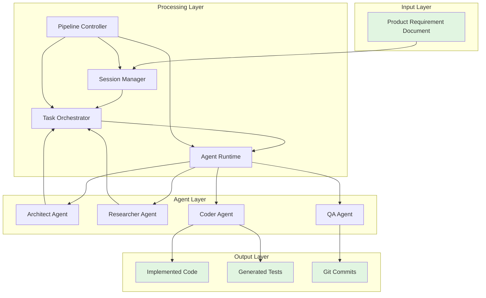

---

## Four Core Processing Engines

The PRP Pipeline's architecture is built around four interconnected processing engines that handle different aspects of the development lifecycle.

### 1. Session Manager

**Location**: [`src/core/session-manager.ts`](../src/core/session-manager.ts)

The Session Manager provides centralized state management, PRD hash-based initialization, and delta session capabilities.

#### Responsibilities

- **Session State Management**: Maintains immutable `SessionState` with metadata, PRD snapshot, and task registry
- **PRD Hashing**: Computes SHA-256 hashes for change detection
- **Session Discovery**: Finds existing sessions by hash or creates new ones
- **Delta Sessions**: Creates linked sessions when PRDs are modified
- **Atomic Persistence**: Batch writes with dirty flag for efficient state updates

#### Key Methods

```typescript
// Initialize session (new or load existing)
async initialize(): Promise<SessionState>

// Create delta session for PRD changes
async createDeltaSession(newPRDPath: string): Promise<DeltaSession>

// Update item status with batching
async updateItemStatus(itemId: string, status: Status): Promise<Backlog>

// Flush accumulated updates atomically
async flushUpdates(): Promise<void>
```

#### Session Directory Structure

```
plan/
├── 001_14b9dc2a33c7/
│   ├── prd_snapshot.md          # Original PRD content
│   ├── tasks.json               # Task backlog registry
│   └── parent_session.txt       # Parent reference (delta sessions only)
├── 002_a1b2c3d4e5f6/
│   └── ...
```

---

### 2. Task Orchestrator

**Location**: [`src/core/task-orchestrator.ts`](../src/core/task-orchestrator.ts)

The Task Orchestrator manages backlog processing with recursive depth-first traversal (DFS) and dependency-aware execution.

#### Responsibilities

- **Backlog Traversal**: DFS pre-order traversal (Phase → Milestone → Task → Subtask)
- **Dependency Resolution**: Ensures subtasks execute only after dependencies complete
- **Scope Support**: Executes subsets of the backlog (milestone, task, subtask scope)
- **Status Management**: Transitions items through lifecycle states
- **Smart Commits**: Creates git commits after each successful subtask

#### Key Methods

```typescript
// Process next item from execution queue
async processNextItem(): Promise<boolean>

// Check if subtask can execute (dependencies satisfied)
canExecute(subtask: Subtask): boolean

// Get blocking dependencies
getBlockingDependencies(subtask: Subtask): Subtask[]

// Wait for dependencies to complete
async waitForDependencies(subtask: Subtask, options?: { timeout?: number; interval?: number }): Promise<void>
```

#### Task Hierarchy

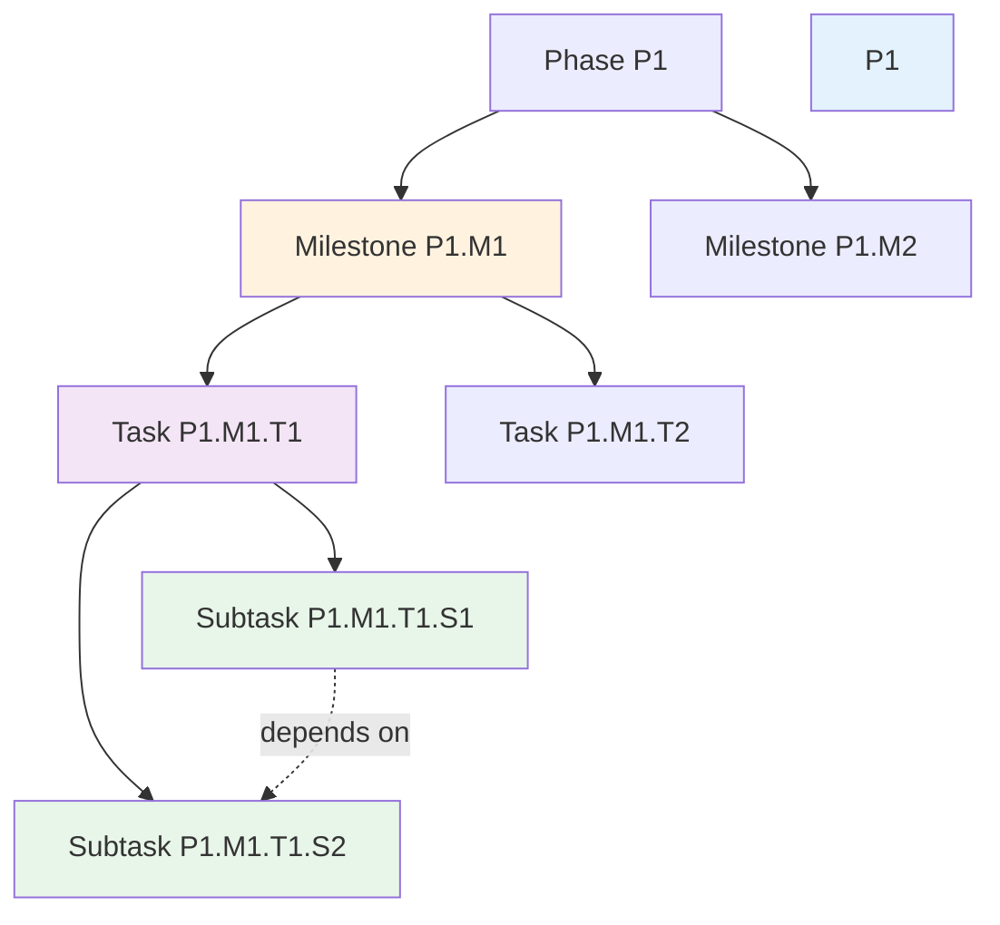

#### Dependency Resolution

Subtasks declare dependencies using the `dependencies` array:

```typescript
interface Subtask {
  readonly dependencies: string[];  // e.g., ['P1.M1.T1.S1', 'P1.M1.T1.S2']
}
```

The orchestrator validates dependencies before execution:

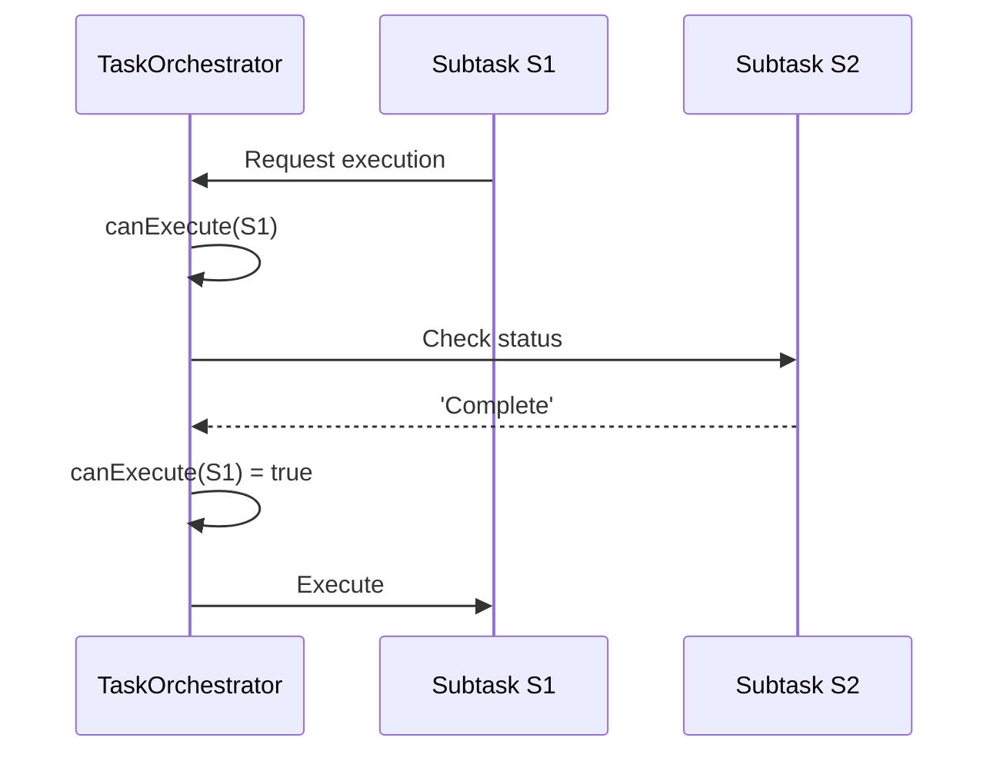

---

### 3. Agent Runtime

**Location**: [`src/agents/prp-runtime.ts`](../src/agents/prp-runtime.ts)

The Agent Runtime manages LLM agent creation, configuration, and execution with tool registration and context injection.

#### Responsibilities

- **Agent Factory**: Creates agents for different personas (Architect, Researcher, Coder, QA)
- **Tool Registration**: Provides file I/O, shell, search, and web research tools
- **Context Injection**: Injects relevant codebase context into agent prompts
- **PRP Execution**: Orchestrates PRP generation and execution
- **Validation Gates**: Manages 4-level validation process

#### Agent Types

| Agent | Persona | Responsibility |
|-------|---------|----------------|
| **Architect** | System Designer | Generates task backlog from PRD |
| **Researcher** | Context Gatherer | Generates PRPs for subtasks |
| **Coder** | Implementation Expert | Executes PRPs to produce code |
| **QA** | Quality Assurance | Finds and fixes bugs |

#### Tool System

```typescript
interface MCPTool {
  name: string;
  description: string;
  inputSchema: z.ZodType<any>;
  handler: (input: unknown) => Promise<ToolResult>;
}
```

Available tools:
- **BashMCP**: Execute shell commands
- **FilesystemMCP**: Read/write files
- **GitMCP**: Git operations
- **SearchMCP**: Codebase search
- **WebFetch**: Web research

---

### 4. Pipeline Controller

**Location**: [`src/workflows/prp-pipeline.ts`](../src/workflows/prp-pipeline.ts)

The Pipeline Controller orchestrates the entire development lifecycle from PRD to implemented code.

#### Responsibilities

- **Workflow Orchestration**: Coordinates all processing engines
- **Error Recovery**: Handles failures gracefully with retry logic
- **Graceful Shutdown**: Responds to SIGINT (Ctrl+C) with state preservation
- **Progress Tracking**: Reports completion metrics and duration
- **Session Resumption**: Continues interrupted sessions

#### Execution Flow

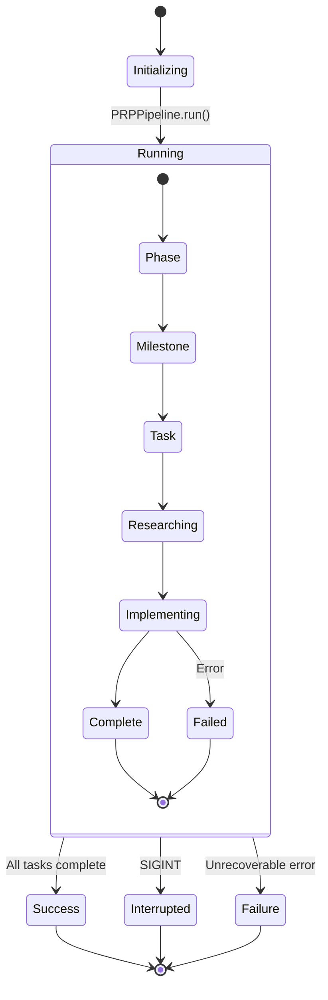

---

## Data Flow & Execution Model

### End-to-End Pipeline Flow

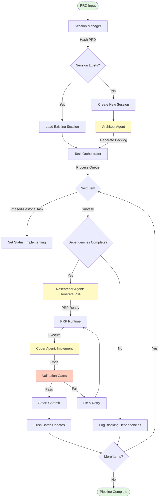

### Request/Response Flow

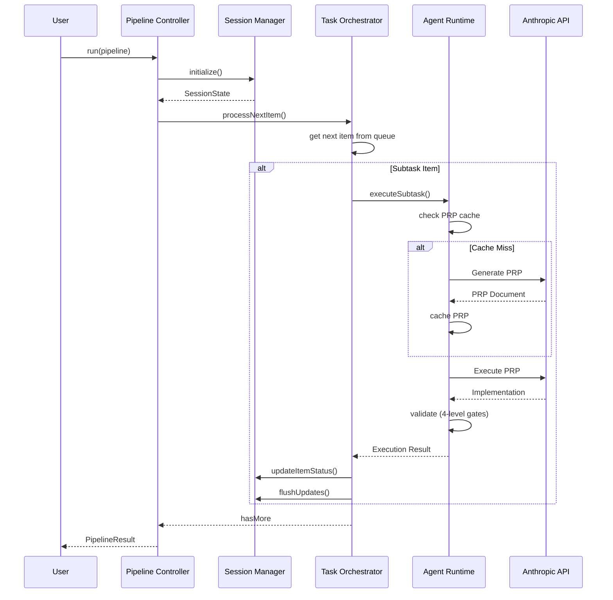

---

## Component Architecture

### Module Organization

```
src/
├── core/                   # Core processing engines
│   ├── session-manager.ts  # State management
│   ├── task-orchestrator.ts # Backlog processing
│   ├── models.ts           # Type definitions
│   ├── session-utils.ts    # Session utilities
│   ├── prd-differ.ts       # PRD diffing
│   ├── research-queue.ts   # Parallel PRP generation
│   └── scope-resolver.ts   # Scope parsing
├── agents/                 # Agent system
│   ├── agent-factory.ts    # Agent creation
│   ├── prp-runtime.ts      # PRP execution
│   ├── prp-generator.ts    # PRP generation
│   ├── prp-executor.ts     # PRP execution
│   └── prompts/            # Prompt templates
├── workflows/              # Workflow orchestration
│   └── prp-pipeline.ts     # Main pipeline
├── tools/                  # MCP tools
│   ├── bash-mcp.ts
│   ├── filesystem-mcp.ts
│   └── git-mcp.ts
├── utils/                  # Utilities
│   ├── logger.ts
│   ├── task-utils.ts
│   └── git-commit.ts
├── cli/                    # CLI interface
│   └── index.ts
├── config/                 # Configuration
│   └── environment.ts
└── index.ts                # Entry point
```

### Type System

#### Task Hierarchy Types

```typescript
// Base hierarchy item type
type HierarchyItem = Phase | Milestone | Task | Subtask;

// Four-level hierarchy
interface Phase {
  readonly id: string;              // P1
  readonly type: 'Phase';
  readonly milestones: Milestone[];
  readonly status: Status;
  readonly title: string;
  readonly description: string;
}

interface Milestone {
  readonly id: string;              // P1.M1
  readonly type: 'Milestone';
  readonly tasks: Task[];
  readonly status: Status;
  readonly title: string;
  readonly description: string;
}

interface Task {
  readonly id: string;              // P1.M1.T1
  readonly type: 'Task';
  readonly subtasks: Subtask[];
  readonly status: Status;
  readonly title: string;
  readonly description: string;
}

interface Subtask {
  readonly id: string;              // P1.M1.T1.S1
  readonly type: 'Subtask';
  readonly dependencies: string[];  // Dependency IDs
  readonly status: Status;
  readonly title: string;
  readonly story_points: number;
  readonly context_scope: string;   // Isolation instructions
}

// Lifecycle status
type Status = 'Planned' | 'Researching' | 'Implementing' | 'Complete' | 'Failed';
```

#### Session Types

```typescript
interface SessionState {
  readonly metadata: SessionMetadata;
  readonly prdSnapshot: string;
  readonly taskRegistry: Backlog;
  currentItemId: string | null;
}

interface SessionMetadata {
  readonly id: string;              // 001_14b9dc2a33c7
  readonly hash: string;            // First 12 chars of SHA-256
  readonly path: string;            // Absolute path
  readonly createdAt: Date;
  readonly parentSession: string | null;
}

interface DeltaSession extends SessionState {
  readonly oldPRD: string;
  readonly newPRD: string;
  readonly diffSummary: string;
}

interface Backlog {
  readonly backlog: Phase[];
}
```

---

## Groundswell Framework Integration

The PRP Pipeline is built on the **Groundswell Framework**, which provides agentic workflow primitives.

### Groundswell Core Concepts

#### Workflow Decorators

```typescript
import { Workflow, Step, ObservedState, Task } from 'groundswell';

class PRPPipeline extends Workflow {
  @ObservedState()
  currentPhase: string = 'init';

  @Step({ trackTiming: true, snapshotState: true })
  async initializeSession(): Promise<SessionConfig> {
    this.currentPhase = 'initializing';
    return sessionConfig;
  }

  @Task({ concurrent: true })
  async executePhase(): Promise<PhaseWorkflow[]> {
    return this.phases.map(p => new PhaseWorkflow(p, this));
  }
}
```

#### Agent System

```typescript
import { Agent, createAgent } from 'groundswell';

const coderAgent = createAgent({
  apiKey: process.env.ANTHROPIC_API_KEY,
  model: 'claude-opus-4-5-20251101',
  maxTokens: 8192,
  systemPrompt: 'You are an expert software developer...'
});

const response = await coderAgent.generate({
  prompt: 'Implement a REST API endpoint',
  tools: [bashTool, fileTool, gitTool],
  responseFormat: { type: 'text' }
});
```

#### Tool Registration

```typescript
import { MCPHandler } from 'groundswell';

const mcp = new MCPHandler();

// Register custom tools
mcp.registerTool({
  name: 'execute_command',
  description: 'Execute shell command',
  inputSchema: z.object({
    command: z.string()
  }),
  handler: async (input) => {
    return { output: await exec(input.command) };
  }
});

// Use with agent
const response = await agent.generate({
  prompt: 'List files',
  tools: mcp.getTools()
});
```

### Groundswell Caching

Groundswell provides automatic SHA-256 based caching:

```
Cache Key = SHA-256(system prompt + user prompt + responseFormat)
```

**Performance Impact**:
- **Cache Hit**: <10ms, 0 API calls
- **Cache Miss**: 1-5 seconds, 1 API call
- **Typical Hit Rate**: 80-95% on subsequent runs

---

## Extensibility Patterns

The PRP Pipeline is designed for extensibility through well-defined extension points.

### 1. Custom Agent Personas

Add new agent types by extending the base agent:

```typescript
// src/agents/security-agent.ts
import { createAgent } from 'groundswell';
import { getLogger } from '../utils/logger.js';

export class SecurityAgent {
  readonly #logger = getLogger('SecurityAgent');
  readonly #agent;

  constructor() {
    this.#agent = createAgent({
      apiKey: process.env.ANTHROPIC_API_KEY!,
      model: 'claude-opus-4-5-20251101',
      systemPrompt: `You are a security expert.
        Analyze code for vulnerabilities, suggest fixes.`
    });
  }

  async analyze(code: string): Promise<SecurityReport> {
    const response = await this.#agent.generate({
      prompt: `Analyze this code:\n\n${code}`,
      responseFormat: { type: 'json' }
    });
    return JSON.parse(response.text);
  }
}
```

### 2. Custom Validation Gates

Add new validation levels:

```typescript
// src/core/validation/security-gate.ts
export async function securityGate(
  context: ValidationContext
): Promise<ValidationResult> {
  const { code, prp } = context;

  const securityAgent = new SecurityAgent();
  const report = await securityAgent.analyze(code);

  if (report.vulnerabilities.length > 0) {
    return {
      passed: false,
      errors: report.vulnerabilities.map(v => v.description)
    };
  }

  return { passed: true };
}

// Register in PRP Runtime
prpRuntime.addValidationGate('security', securityGate, 4);
```

### 3. Custom Tool Providers

Create new MCP tools:

```typescript
// src/tools/docker-mcp.ts
import { z } from 'zod';
import { exec } from 'child_process';
import { promisify } from 'util';

const execAsync = promisify(exec);

export const dockerTool = {
  name: 'docker',
  description: 'Execute Docker commands',
  inputSchema: z.object({
    command: z.enum(['ps', 'images', 'build', 'run']),
    args: z.string().optional()
  }),
  handler: async (input) => {
    const cmd = input.args
      ? `docker ${input.command} ${input.args}`
      : `docker ${input.command}`;
    const { stdout } = await execAsync(cmd);
    return { output: stdout };
  }
};
```

### 4. Custom Scope Resolvers

Add new scope types:

```typescript
// src/core/scope-resolver.ts
export interface Scope {
  type: 'all' | 'phase' | 'milestone' | 'task' | 'subtask' | 'pattern';
  id?: string;
  pattern?: RegExp;  // NEW: Pattern-based scope
}

export function resolveScope(
  backlog: Backlog,
  scope: Scope
): HierarchyItem[] {
  if (scope.type === 'pattern' && scope.pattern) {
    return findMatchingItems(backlog, scope.pattern);
  }
  // ... existing logic
}

function findMatchingItems(
  backlog: Backlog,
  pattern: RegExp
): HierarchyItem[] {
  const matches: HierarchyItem[] = [];

  function search(items: HierarchyItem[]) {
    for (const item of items) {
      if (pattern.test(item.id)) {
        matches.push(item);
      }
      // Recurse into children
      if ('milestones' in item) search(item.milestones);
      if ('tasks' in item) search(item.tasks);
      if ('subtasks' in item) search(item.subtasks);
    }
  }

  search(backlog.backlog);
  return matches;
}
```

### 5. Custom Commit Strategies

Replace smart commit logic:

```typescript
// src/utils/git-commit.ts
export interface CommitStrategy {
  shouldCommit(sessionPath: string, changes: GitChange[]): boolean;
  generateMessage(changes: GitChange[]): string;
}

export const semanticCommitStrategy: CommitStrategy = {
  shouldCommit: (_, changes) => changes.length > 0,
  generateMessage: (changes) => {
    const types = changes.map(c => c.type).join(', ');
    return `chore: update ${types}`;
  }
};

export async function smartCommit(
  sessionPath: string,
  message: string,
  strategy: CommitStrategy = semanticCommitStrategy
): Promise<string | null> {
  // Use strategy for commit decisions
}
```

---

## Caching Strategy

The PRP Pipeline uses multi-level caching to minimize API costs and latency.

### Cache Levels

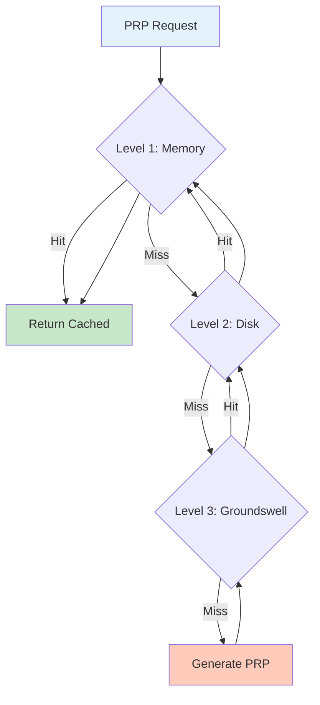

### Research Queue Cache

**Location**: [`src/core/research-queue.ts`](../src/core/research-queue.ts)

The Research Queue maintains an in-memory cache of generated PRPs:

```typescript
class ResearchQueue {
  private cache: Map<string, PRPDocument> = new Map();

  async enqueue(subtask: Subtask, backlog: Backlog): Promise<void> {
    const cached = this.getPRP(subtask.id);
    if (cached) {
      this.metrics.cacheHits++;
      return;
    }

    // Generate new PRP
    const prp = await this.generatePRP(subtask);
    this.cache.set(subtask.id, prp);
  }

  getPRP(subtaskId: string): PRPDocument | null {
    return this.cache.get(subtaskId) ?? null;
  }
}
```

**Cache Key**: `subtask.id` (e.g., "P1.M1.T1.S1")

**Cache Invalidation**: No explicit invalidation - cache is per-session

### Groundswell Prompt Cache

Groundswell provides automatic caching at the LLM level:

```
Cache Key = SHA-256(system prompt + user prompt + responseFormat)
```

**Benefits**:
- **Transparent**: No configuration needed
- **Deterministic**: Same inputs always hit cache
- **Cross-Session**: Cache persists across pipeline runs

**Bypass**: Use `--no-cache` flag to bypass all caching:

```bash
npm run dev -- --prd ./PRD.md --no-cache
```

### Cache Metrics

```typescript
interface CacheMetrics {
  hits: number;          // L1 cache hits
  misses: number;        // L1 cache misses
  hitRatio: number;      // hits / (hits + misses)
  groundswellHits: number;  // L3 cache hits
}
```

Monitor cache effectiveness:

```typescript
const orchestrator = new TaskOrchestrator(sessionManager);
await orchestrator.processNextItem();

const metrics = orchestrator.getCacheMetrics();
console.log(`Cache hit ratio: ${metrics.hitRatio * 100}%`);
```

---

## Session Management

### Session Lifecycle

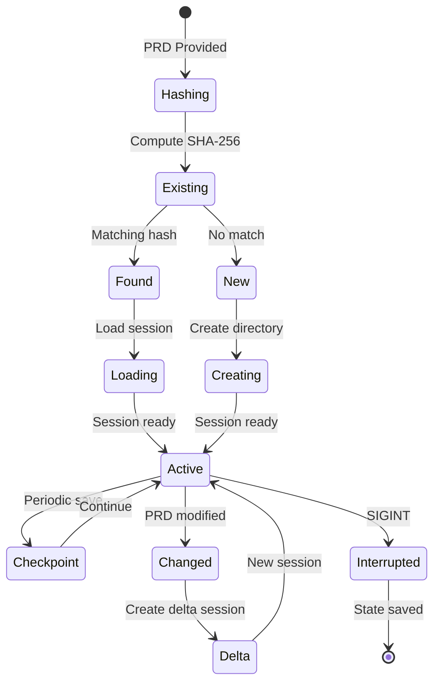

### Session Directory Layout

```
plan/
├── 001_14b9dc2a33c7/              # First session
│   ├── prd_snapshot.md             # Original PRD
│   ├── tasks.json                  # Task registry
│   └── subtasks/                   # Generated PRPs
│       ├── P1.M1.T1.S1.md
│       ├── P1.M1.T1.S2.md
│       └── ...
├── 002_a1b2c3d4e5f6/              # Delta session
│   ├── prd_snapshot.md             # Updated PRD
│   ├── tasks.json                  # New task registry
│   ├── parent_session.txt          # "001_14b9dc2a33c7"
│   └── subtasks/
│       └── ...
└── .gitignore                      # Exclude generated files
```

### Delta Session Workflow

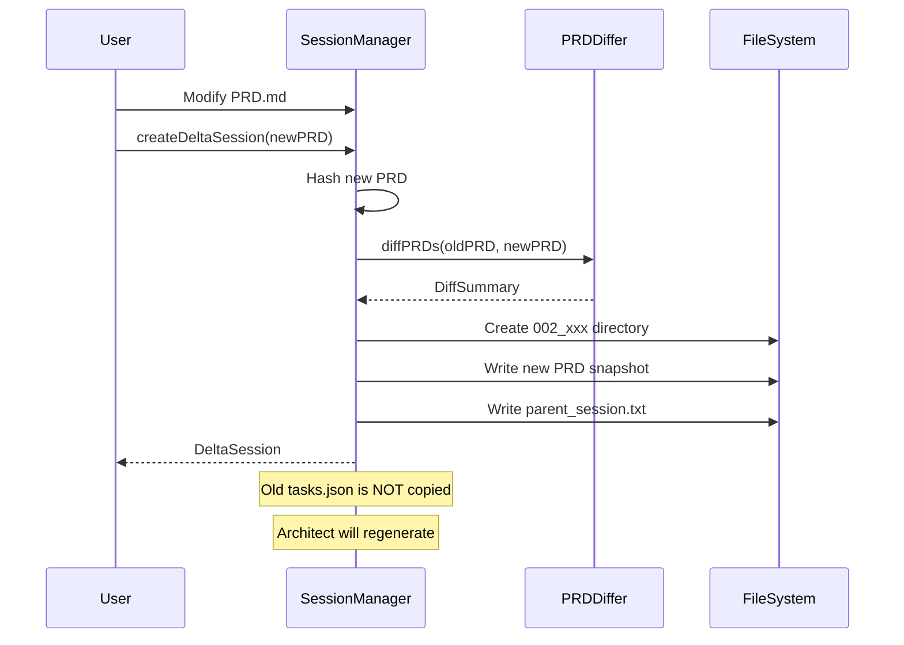

---

## Task Orchestration

### DFS Traversal Algorithm

The Task Orchestrator uses recursive depth-first traversal (DFS) with pre-order visiting:

```typescript
async processNextItem(): Promise<boolean> {
  // 1. Check queue
  if (this.#executionQueue.length === 0) {
    return false;  // Done
  }

  // 2. Get next item (FIFO)
  const item = this.#executionQueue.shift()!;

  // 3. Type-specific execution
  switch (item.type) {
    case 'Phase':
      await this.executePhase(item);      // Set status
      // Children processed via processNextItem() calls
      break;

    case 'Milestone':
      await this.executeMilestone(item);  // Set status
      break;

    case 'Task':
      await this.executeTask(item);       // Set status, enqueue subtasks
      break;

    case 'Subtask':
      await this.executeSubtask(item);    // Actual execution
      break;
  }

  return true;  // More items may exist
}
```

### Scope-Based Execution

The pipeline supports scoped execution to run subsets of the backlog:

```bash
# Run specific milestone
npm run dev -- --prd ./PRD.md --scope P3.M4

# Run specific task
npm run dev -- --prd ./PRD.md --scope P1.M2.T3

# Run from specific task
npm run dev -- --prd ./PRD.md --from P2.M1.T2

# Run all
npm run dev -- --prd ./PRD.md
```

**Scope Resolution**:

```typescript
interface Scope {
  type: 'all' | 'phase' | 'milestone' | 'task' | 'subtask';
  id?: string;  // e.g., "P3.M4"
}

function resolveScope(backlog: Backlog, scope: Scope): HierarchyItem[] {
  switch (scope.type) {
    case 'all':
      return getAllSubtasks(backlog);

    case 'milestone':
      return getSubtasksInMilestone(backlog, scope.id!);

    case 'task':
      return getSubtasksInTask(backlog, scope.id!);

    case 'subtask':
      return [findSubtask(backlog, scope.id!)];

    default:
      throw new Error(`Unknown scope type: ${scope.type}`);
  }
}
```

---

## Agent System

### Agent Factory

**Location**: [`src/agents/agent-factory.ts`](../src/agents/agent-factory.ts)

The Agent Factory creates configured agents with appropriate system prompts:

```typescript
export function createCoderAgent(): Agent {
  return createAgent({
    apiKey: process.env.ANTHROPIC_API_KEY!,
    model: 'claude-opus-4-5-20251101',
    maxTokens: 8192,
    systemPrompt: `You are an expert software developer.
    Execute PRPs precisely. Follow patterns. Test your code.`,
    tools: [bashTool, fileTool, gitTool, searchTool]
  });
}
```

### Tool System

```typescript
interface MCPTool {
  name: string;
  description: string;
  inputSchema: z.ZodType<any>;
  handler: (input: unknown) => Promise<ToolResult>;
}

// Example: Filesystem tool
const fileTool: MCPTool = {
  name: 'file',
  description: 'Read and write files',
  inputSchema: z.object({
    action: z.enum(['read', 'write']),
    path: z.string(),
    content: z.string().optional()
  }),
  handler: async (input) => {
    if (input.action === 'read') {
      const content = await fs.readFile(input.path, 'utf-8');
      return { success: true, content };
    } else {
      await fs.writeFile(input.path, input.content);
      return { success: true };
    }
  }
};
```

### Validation Gates

Each PRP execution goes through 4 validation gates:

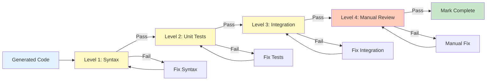

---

## Performance Considerations

### API Cost Optimization

| Strategy | Impact | Implementation |
|----------|--------|----------------|
| **Groundswell Cache** | 40-60% cost reduction | Automatic, transparent |
| **Research Queue** | 30-50% reduction | In-memory PRP cache |
| **Parallel Research** | Faster execution | 3 concurrent PRP generations |
| **Scope Execution** | Targeted spend | `--scope` flag |

### Latency Optimization

```mermaid
gantt
    title Pipeline Execution Timeline
    dateFormat X
    axisFormat %s

    section Initialization
    Session Load         :0, 1
    Backlog Parse        :1, 2

    section Parallel Research
    PRP Gen 1           :2, 4
    PRP Gen 2           :2, 4
    PRP Gen 3           :2, 4

    section Sequential Execution
    Subtask 1           :4, 8
    Subtask 2           :8, 12
    Subtask 3           :12, 16

    section Commits
    Batch Flush         :16, 17
```

### Memory Management

- **Batch Updates**: Status changes accumulated in memory
- **Atomic Flush**: Single write operation per subtask
- **LRU Cache**: Research queue limit (default: 3 PRPs)

---

## Security Considerations

### API Key Management

```typescript
// src/config/environment.ts
export function configureEnvironment(): void {
  // Validate ANTHROPIC_API_KEY is set
  if (!process.env.ANTHROPIC_API_KEY) {
    throw new Error('ANTHROPIC_API_KEY environment variable is required');
  }

  // Load from .env file if present
  if (fs.existsSync('.env')) {
    dotenv.config();
  }
}
```

### Code Execution Safety

- **Sandboxed Shell**: Commands executed in subprocess
- **Path Validation**: All file paths validated
- **Git Operations**: Read-only by default (writes require explicit approval)

### Prompt Injection Prevention

- **Context Isolation**: `context_scope` restricts file access
- **Tool Whitelisting**: Only registered tools available
- **Input Validation**: All tool inputs validated with Zod schemas

---

## API Documentation

### Quick Links

For complete API reference, see the [TypeDoc Generated Documentation](./api/index.html).

#### Core Modules

| Module | Description | Link |
|--------|-------------|------|
| **SessionManager** | State management, session persistence | [API](./api/classes/core_session_manager.SessionManager.html) |
| **TaskOrchestrator** | Backlog traversal, dependency resolution | [API](./api/classes/core_task_orchestrator.TaskOrchestrator.html) |
| **PRPPipeline** | Main pipeline orchestration | [API](./api/classes/workflows_prp_pipeline.PRPPipeline.html) |
| **PRPRuntime** | PRP execution, validation gates | [API](./api/classes/agents_prp_runtime.PRPRuntime.html) |
| **Models** | Type definitions | [API](./api/modules/core_models.html) |

### Generating API Docs

```bash
# Generate API documentation
npm run docs

# Watch mode for development
npm run docs:watch

# Serve docs locally
npm run docs:serve

# Clean generated docs
npm run docs:clean
```

### TypeDoc Configuration

**File**: [`typedoc.json`](../typedoc.json)

```json
{
  "entryPoints": ["src/index.ts"],
  "out": "docs/api",
  "name": "PRP Pipeline API Documentation",
  "excludePrivate": true,
  "excludeInternal": true,
  "categorizeByGroup": true,
  "categoryOrder": [
    "Session Management",
    "Task Execution",
    "Agents",
    "Workflows",
    "Types",
    "Utilities",
    "Tools",
    "Configuration"
  ]
}
```

---

## Additional Resources

### Project Documentation

- [User Guide](../README.md) - Getting started guide
- [PRP Concept](../plan/001_14b9dc2a33c7/PRP-README.md) - Product Requirement Prompt methodology
- [System Context](../plan/001_14b9dc2a33c7/architecture/system_context.md) - System overview
- [Groundswell API](../plan/001_14b9dc2a33c7/architecture/groundswell_api.md) - Framework integration
- [Cache Behavior](../plan/001_14b9dc2a33c7/architecture/cache_behavior.md) - Caching details

### External References

- [TypeScript Documentation](https://www.typescriptlang.org/docs/)
- [Anthropic Claude API](https://docs.anthropic.com/claude/reference/)
- [Groundswell Framework](https://github.com/anthropics/groundswell)
- [TSDoc Standard](https://tsdoc.org/)
- [Mermaid Diagrams](https://mermaid-js.github.io/)

---

**Document Version**: 1.0.0
**Last Modified**: 2026-01-13
**Maintainer**: PRP Pipeline Team
