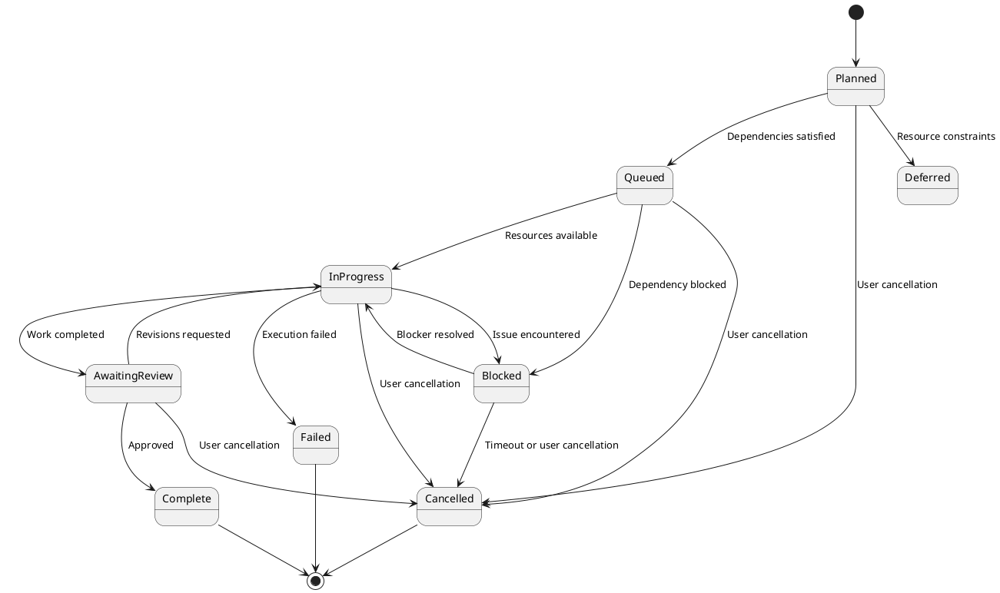

# State Machine Patterns for Task Status Progression - Research Findings

## Overview
State machines are essential for managing task lifecycle and ensuring valid status transitions. This document covers patterns, implementations, and best practices for state machines in task orchestration systems.

## Core Concepts

### 1. Finite State Machine (FSM) Basics

```typescript
// Define states for task lifecycle
enum TaskStatus {
  // Initial states
  PLANNED = 'planned',
  QUEUED = 'queued',

  // Active states
  RESEARCHING = 'researching',
  IN_PROGRESS = 'in_progress',
  BLOCKED = 'blocked',
  AWAITING_REVIEW = 'awaiting_review',

  // Terminal states
  COMPLETE = 'complete',
  CANCELLED = 'cancelled',
  FAILED = 'failed',

  // Special states
  SKIPPED = 'skipped',
  DEFERRED = 'deferred'
}

// Define state transitions
interface StateTransition {
  from: TaskStatus;
  to: TaskStatus;
  guard?: (context: TransitionContext) => boolean;
  action?: (context: TransitionContext) => Promise<void>;
  sideEffects?: SideEffect[];
}

interface TransitionContext {
  taskId: string;
  timestamp: Date;
  actor: string;
  metadata?: Record<string, unknown>;
  previousStatus: TaskStatus;
  newStatus: TaskStatus;
}
```

### 2. State Machine Implementation Patterns

#### Pattern 1: Table-Driven State Machine

**Description**: Use a lookup table to define valid transitions.

```typescript
class TableDrivenStateMachine {
  private transitions: Map<TaskStatus, TaskStatus[]> = new Map();

  constructor() {
    this.initializeTransitions();
  }

  private initializeTransitions(): void {
    this.transitions.set(TaskStatus.PLANNED, [
      TaskStatus.QUEUED,
      TaskStatus.CANCELLED,
      TaskStatus.DEFERRED
    ]);

    this.transitions.set(TaskStatus.QUEUED, [
      TaskStatus.RESEARCHING,
      TaskStatus.IN_PROGRESS,
      TaskStatus.CANCELLED,
      TaskStatus.BLOCKED
    ]);

    this.transitions.set(TaskStatus.RESEARCHING, [
      TaskStatus.IN_PROGRESS,
      TaskStatus.BLOCKED,
      TaskStatus.FAILED,
      TaskStatus.CANCELLED
    ]);

    this.transitions.set(TaskStatus.IN_PROGRESS, [
      TaskStatus.AWAITING_REVIEW,
      TaskStatus.COMPLETE,
      TaskStatus.BLOCKED,
      TaskStatus.FAILED,
      TaskStatus.CANCELLED
    ]);

    // Terminal states - no transitions out
    this.transitions.set(TaskStatus.COMPLETE, []);
    this.transitions.set(TaskStatus.CANCELLED, []);
    this.transitions.set(TaskStatus.FAILED, []);
  }

  canTransition(from: TaskStatus, to: TaskStatus): boolean {
    const allowed = this.transitions.get(from);
    return allowed ? allowed.includes(to) : false;
  }

  transition(
    currentStatus: TaskStatus,
    newStatus: TaskStatus,
    context: TransitionContext
  ): TransitionResult {
    if (!this.canTransition(currentStatus, newStatus)) {
      return {
        success: false,
        error: `Invalid transition from ${currentStatus} to ${newStatus}`
      };
    }

    // Execute transition
    return this.executeTransition(newStatus, context);
  }
}
```

**Advantages:**
- Easy to understand and maintain
- Simple to add new states/transitions
- Fast lookups
- Clear visualization of state machine

**Use Cases:**
- Simple state machines
- Static state definitions
- When transitions don't depend on complex conditions

#### Pattern 2: State Pattern (Gang of Four)

**Description**: Encapsulate state-specific behavior in separate classes.

```typescript
interface TaskState {
  status: TaskStatus;
  enter(context: TransitionContext): Promise<void>;
  exit(context: TransitionContext): Promise<void>;
  canTransitionTo(status: TaskStatus): boolean;
}

abstract class BaseTaskState implements TaskState {
  abstract status: TaskStatus;

  async enter(context: TransitionContext): Promise<void> {
    // Default implementation
    await this.logEntry(context);
  }

  async exit(context: TransitionContext): Promise<void> {
    // Default implementation
    await this.logExit(context);
  }

  canTransitionTo(status: TaskStatus): boolean {
    return false;
  }

  private async logEntry(context: TransitionContext): Promise<void> {
    console.log(`Entering ${this.status} for task ${context.taskId}`);
  }

  private async logExit(context: TransitionContext): Promise<void> {
    console.log(`Exiting ${this.status} for task ${context.taskId}`);
  }
}

class PlannedState extends BaseTaskState {
  status = TaskStatus.PLANNED;

  canTransitionTo(status: TaskStatus): boolean {
    return [
      TaskStatus.QUEUED,
      TaskStatus.CANCELLED,
      TaskStatus.DEFERRED
    ].includes(status);
  }

  async enter(context: TransitionContext): Promise<void> {
    await super.enter(context);
    // Initialize task resources
    await this.initializeResources(context);
  }

  private async initializeResources(
    context: TransitionContext
  ): Promise<void> {
    // Task-specific initialization
  }
}

class InProgressState extends BaseTaskState {
  status = TaskStatus.IN_PROGRESS;

  canTransitionTo(status: TaskStatus): boolean {
    return [
      TaskStatus.AWAITING_REVIEW,
      TaskStatus.COMPLETE,
      TaskStatus.BLOCKED,
      TaskStatus.FAILED,
      TaskStatus.CANCELLED
    ].includes(status);
  }

  async enter(context: TransitionContext): Promise<void> {
    await super.enter(context);
    // Start execution timer
    await this.startTimer(context);
  }

  async exit(context: TransitionContext): Promise<void> {
    await super.exit(context);
    // Stop execution timer
    await this.stopTimer(context);
  }

  private async startTimer(context: TransitionContext): Promise<void> {
    // Start tracking execution time
  }

  private async stopTimer(context: TransitionContext): Promise<void> {
    // Stop tracking execution time
  }
}

class TaskStateMachine {
  private currentState: TaskState;
  private history: StateTransition[] = [];

  constructor(initialState: TaskState) {
    this.currentState = initialState;
  }

  async transition(
    newState: TaskState,
    context: TransitionContext
  ): Promise<TransitionResult> {
    // Check if transition is allowed
    if (!this.currentState.canTransitionTo(newState.status)) {
      return {
        success: false,
        error: `Cannot transition from ${this.currentState.status} to ${newState.status}`
      };
    }

    // Execute exit action
    await this.currentState.exit(context);

    // Record transition
    this.recordTransition({
      from: this.currentState.status,
      to: newState.status,
      timestamp: context.timestamp,
      context
    });

    // Change state
    this.currentState = newState;

    // Execute enter action
    await this.currentState.enter(context);

    return { success: true };
  }

  getCurrentStatus(): TaskStatus {
    return this.currentState.status;
  }

  getHistory(): StateTransition[] {
    return [...this.history];
  }

  private recordTransition(transition: StateTransition): void {
    this.history.push(transition);
  }
}
```

**Advantages:**
- Encapsulates state-specific behavior
- Easy to add new states
- Follows Open/Closed principle
- Clean separation of concerns

**Use Cases:**
- Complex state-specific behavior
- When states have significant logic
- When you need to add states frequently

#### Pattern 3: Statechart (Hierarchical State Machine)

**Description**: Support hierarchical states and orthogonal regions.

```typescript
interface StatechartConfig {
  initial: string;
  states: Record<string, StateDefinition>;
}

interface StateDefinition {
  on?: Record<string, string>; // Event -> target state
  initial?: string; // For compound states
  states?: Record<string, StateDefinition>; // Nested states
  parallel?: Record<string, StateDefinition>; // Orthogonal regions
  entry?: (context: TransitionContext) => Promise<void>;
  exit?: (context: TransitionContext) => Promise<void>;
}

class TaskStatechart {
  private config: StatechartConfig;
  private currentStates: Set<string> = new Set();

  constructor(config: StatechartConfig) {
    this.config = config;
    this.initialize();
  }

  private initialize(): void {
    // Start at initial state
    this.currentStates.add(this.config.initial);
  }

  async sendEvent(
    event: string,
    context: TransitionContext
  ): Promise<void> {
    const transitions: Array<{ from: string; to: string }> = [];

    // Find transitions for current states
    for (const state of this.currentStates) {
      const transition = this.findTransition(state, event);
      if (transition) {
        transitions.push({ from: state, to: transition });
      }
    }

    // Execute transitions
    for (const { from, to } of transitions) {
      await this.executeTransition(from, to, context);
    }
  }

  private findTransition(state: string, event: string): string | null {
    const stateDef = this.findStateDefinition(state);
    return stateDef?.on?.[event] || null;
  }

  private findStateDefinition(state: string): StateDefinition | null {
    // Traverse state hierarchy to find definition
    // Implementation depends on how you store state definitions
    return null;
  }

  private async executeTransition(
    from: string,
    to: string,
    context: TransitionContext
  ): Promise<void> {
    // Exit old state
    const fromDef = this.findStateDefinition(from);
    if (fromDef?.exit) {
      await fromDef.exit(context);
    }

    // Update current state
    this.currentStates.delete(from);
    this.currentStates.add(to);

    // Enter new state
    const toDef = this.findStateDefinition(to);
    if (toDef?.entry) {
      await toDef.entry(context);
    }
  }
}
```

**Advantages:**
- Supports complex state hierarchies
- Can model concurrent states
- Reduces state explosion
- More expressive than flat FSM

**Use Cases:**
- Complex workflows with sub-states
- Parallel execution tracking
- When states share common behavior

### 3. Guard Conditions

**Description**: Conditions that must be met for a transition to occur.

```typescript
interface Guard {
  name: string;
  evaluate(context: TransitionContext): boolean | Promise<boolean>;
  errorMessage?: string;
}

class GuardedTransition {
  constructor(
    private from: TaskStatus,
    private to: TaskStatus,
    private guards: Guard[]
  ) {}

  async canExecute(context: TransitionContext): Promise<{
    allowed: boolean;
    reason?: string;
  }> {
    for (const guard of this.guards) {
      const result = await guard.evaluate(context);
      if (!result) {
        return {
          allowed: false,
          reason: guard.errorMessage || `Guard ${guard.name} failed`
        };
      }
    }
    return { allowed: true };
  }
}

// Example guards
class DependenciesSatisfiedGuard implements Guard {
  name = 'dependencies_satisfied';
  errorMessage = 'All dependencies must be satisfied';

  constructor(private dependencyChecker: DependencyChecker) {}

  async evaluate(context: TransitionContext): Promise<boolean> {
    return this.dependencyChecker.areDependenciesSatisfied(
      context.taskId
    );
  }
}

class ResourceAvailableGuard implements Guard {
  name = 'resource_available';
  errorMessage = 'Required resources are not available';

  constructor(private resourceManager: ResourceManager) {}

  async evaluate(context: TransitionContext): Promise<boolean> {
    return this.resourceManager.areResourcesAvailable(
      context.taskId
    );
  }
}

class PermissionsGuard implements Guard {
  name = 'permissions';
  errorMessage = 'User does not have permission for this transition';

  constructor(private permissionChecker: PermissionChecker) {}

  async evaluate(context: TransitionContext): Promise<boolean> {
    return this.permissionChecker.hasPermission(
      context.actor,
      context.previousStatus,
      context.newStatus
    );
  }
}
```

### 4. State Persistence and Recovery

#### Pattern: Event Sourcing for State Machines

```typescript
interface StateEvent {
  eventType: string;
  taskId: string;
  timestamp: Date;
  data: unknown;
}

class EventSourcedStateMachine {
  private eventLog: StateEvent[] = [];

  async transition(
    event: StateEvent,
    context: TransitionContext
  ): Promise<void> {
    // Apply event to current state
    await this.applyEvent(event);

    // Persist event
    await this.persistEvent(event);
  }

  private async applyEvent(event: StateEvent): Promise<void> {
    // Update state based on event
  }

  private async persistEvent(event: StateEvent): Promise<void> {
    this.eventLog.push(event);
    // Write to durable storage
  }

  async rebuildState(): Promise<TaskStatus> {
    let currentState = TaskStatus.PLANNED;

    for (const event of this.eventLog) {
      currentState = await this.applyEventToState(
        currentState,
        event
      );
    }

    return currentState;
  }

  private async applyEventToState(
    currentState: TaskStatus,
    event: StateEvent
  ): Promise<TaskStatus> {
    // Apply event to state and return new state
    return currentState;
  }
}
```

### 5. Distributed State Machines

#### Pattern: Distributed Lock for State Transitions

```typescript
class DistributedStateMachine {
  constructor(
    private lockManager: DistributedLockManager,
    private stateStorage: StateStorage
  ) {}

  async transition(
    taskId: string,
    newStatus: TaskStatus,
    context: TransitionContext
  ): Promise<TransitionResult> {
    // Acquire distributed lock
    const lock = await this.lockManager.acquireLock(taskId);

    try {
      // Get current state
      const currentStatus = await this.stateStorage.getState(taskId);

      // Validate transition
      if (!this.isValidTransition(currentStatus, newStatus)) {
        return {
          success: false,
          error: `Invalid transition from ${currentStatus} to ${newStatus}`
        };
      }

      // Execute transition
      await this.stateStorage.setState(taskId, newStatus);

      // Publish state change event
      await this.publishStateChange(taskId, currentStatus, newStatus);

      return { success: true };
    } finally {
      // Release lock
      await lock.release();
    }
  }

  private isValidTransition(from: TaskStatus, to: TaskStatus): boolean {
    // Implementation
    return true;
  }

  private async publishStateChange(
    taskId: string,
    from: TaskStatus,
    to: TaskStatus
  ): Promise<void> {
    // Publish to message bus
  }
}
```

### 6. State Machine Testing Patterns

#### Pattern 1: State Coverage Testing

```typescript
class StateMachineTester {
  async testAllTransitions(
    machine: StateMachine,
    states: TaskStatus[]
  ): Promise<void> {
    for (const from of states) {
      for (const to of states) {
        await this.testTransition(machine, from, to);
      }
    }
  }

  private async testTransition(
    machine: StateMachine,
    from: TaskStatus,
    to: TaskStatus
  ): Promise<void> {
    const context = this.createMockContext();

    if (machine.canTransition(from, to)) {
      // Should succeed
      const result = await machine.transition(from, to, context);
      expect(result.success).toBe(true);
    } else {
      // Should fail
      const result = await machine.transition(from, to, context);
      expect(result.success).toBe(false);
    }
  }
}
```

#### Pattern 2: State Transition Matrix

```typescript
interface TransitionMatrix {
  [from: string]: {
    [to: string]: {
      allowed: boolean;
      guards?: string[];
      description?: string;
    };
  };
}

const TASK_TRANSITION_MATRIX: TransitionMatrix = {
  planned: {
    queued: {
      allowed: true,
      guards: ['dependencies_satisfied'],
      description: 'Queue task when dependencies are met'
    },
    in_progress: { allowed: false },
    complete: { allowed: false }
  },
  in_progress: {
    complete: { allowed: true, description: 'Task completed successfully' },
    failed: { allowed: true, description: 'Task execution failed' },
    blocked: { allowed: true, guards: ['blocking_condition'], description: 'Task is blocked' }
  }
  // ... more transitions
};

// Generate tests from matrix
function generateTransitionTests(
  matrix: TransitionMatrix
): void {
  for (const [from, transitions] of Object.entries(matrix)) {
    for (const [to, config] of Object.entries(transitions)) {
      test(`Transition ${from} -> ${to}: ${config.allowed ? 'allowed' : 'disallowed'}`, async () => {
        // Test implementation
      });
    }
  }
}
```

### 7. State Machine Visualization

#### PlantUML State Diagram



### 8. State Machine Patterns for Hierarchical Tasks

#### Composite State Machine

```typescript
class HierarchicalStateMachine {
  private phaseMachines = new Map<string, StateMachine>();
  private milestoneMachines = new Map<string, StateMachine>();
  private taskMachines = new Map<string, StateMachine>();

  async transitionSubtask(
    subtaskId: string,
    newStatus: TaskStatus,
    context: TransitionContext
  ): Promise<void> {
    // Transition subtask
    await this.taskMachines.get(subtaskId)!.transition(newStatus, context);

    // Check if parent task should transition
    await this.propagateToParent(subtaskId, newStatus);
  }

  private async propagateToParent(
    itemId: string,
    newStatus: TaskStatus
  ): Promise<void> {
    const parent = await this.getParent(itemId);
    const siblings = await this.getSiblings(parent.id);

    // Determine parent status based on children
    const parentStatus = this.calculateParentStatus(siblings);

    if (parentStatus !== parent.status) {
      await this.transitionItem(parent.id, parentStatus, context);
    }
  }

  private calculateParentStatus(
    children: HierarchicalItem[]
  ): TaskStatus {
    const allComplete = children.every(c => c.status === TaskStatus.COMPLETE);
    const anyInProgress = children.some(c => c.status === TaskStatus.IN_PROGRESS);
    const anyFailed = children.some(c => c.status === TaskStatus.FAILED);

    if (anyFailed) return TaskStatus.FAILED;
    if (anyInProgress) return TaskStatus.IN_PROGRESS;
    if (allComplete) return TaskStatus.COMPLETE;
    return TaskStatus.PLANNED;
  }
}
```

## Key Resources

### Documentation
- **Statecharts**: https://statecharts.github.io/
- **XState (JavaScript)**: https://xstate.js.org/docs/
- **AWS Step Functions**: https://docs.aws.amazon.com/step-functions/latest/dg/amazon-states-language-state-machine-structure.html

### Libraries and Frameworks
- **XState**: State machines and statecharts for JavaScript/TypeScript
- **Spring State Machine (Java)**: https://spring.io/projects/spring-statemachine
- **Transitions (Python)**: https://github.com/pytransitions/transitions
- **Stateless (C#/.NET)**: https://github.com/dotnet-state-machine/stateless

### Books and Papers
- "Practical UML Statecharts in C/C++" by Miro Samek
- "Design Patterns: Elements of Reusable Object-Oriented Software" (Gang of Four)
- "Statecharts: A Visual Formalism for Complex Systems" by David Harel

### Blog Posts
- Martin Fowler: "State Machine"
- Microsoft: "State Machine Pattern"
- "The Tao of State Machines" (various authors)

## Best Practices

### Design Principles
1. **Keep states simple**: Each state should have a single responsibility
2. **Explicit transitions**: All transitions should be explicitly defined
3. **Guard conditions**: Use guards to enforce business rules
4. **State immutability**: States should be immutable
5. **Event-driven**: Use events to trigger transitions
6. **Logging**: Log all state transitions for debugging

### Implementation Guidelines
1. **Type safety**: Use enums or string literals for states
2. **Validation**: Always validate transitions before executing
3. **Error handling**: Comprehensive error handling in actions
4. **Testing**: Test all possible transitions
5. **Documentation**: Document state machine diagram
6. **Monitoring**: Track state transitions in production

### Performance Considerations
1. **Caching**: Cache state machine instances
2. **Lazy loading**: Load state definitions on demand
3. **Batch processing**: Batch state updates
4. **Async operations**: Use async/await for I/O
5. **Connection pooling**: Reuse database connections

## Common Pitfalls

1. **State explosion**: Too many states making machine complex
2. **Missing transitions**: Not defining all possible transitions
3. **Side effects**: Side effects in state machine logic
4. **Tight coupling**: State machine coupled to business logic
5. **Missing guards**: Not validating preconditions
6. **No recovery**: No mechanism to recover from errors
7. **Poor testing**: Not testing all state combinations
8. **Complex transitions**: Transitions too complex to understand
