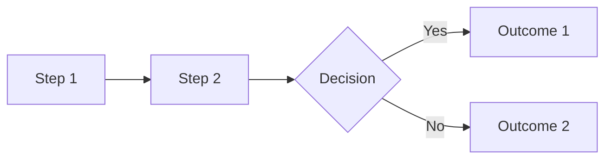
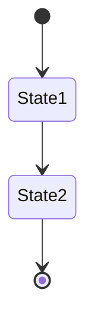

# Codebase Documentation Patterns - Research Summary

## Existing Documentation Patterns in hacky-hack

### README.md (Project Root)

- **Status Badge**: CI, Coverage, npm version
- **What is PRP Pipeline**: Brief description with Mermaid diagram
- **Quick Start**: Prerequisites table, Installation, First Run
- **Features**: Bullet list of capabilities
- **Usage Examples**: Code blocks with commands
- **CLI Options**: Table format
- **Configuration**: Environment variables table
- **Architecture Overview**: System flow diagram, component descriptions
- **Project Structure**: Tree view of codebase

### docs/INSTALLATION.md (P2.M1.T1.S1 Output)

- **Document Header**: Status, Last Updated, Version
- **Table of Contents**: Auto-generated with anchor links
- **Quick Start**: 5-minute setup checklist
- **Prerequisites**: Section per dependency (Node.js, npm, Git)
- **Installation**: Numbered steps (Clone, Install, Link)
- **Configuration**: Environment variables table
- **Verification**: Test, validation, build commands
- **Troubleshooting**: Organized by symptom/error message
- **Platform-Specific Notes**: Windows, macOS, Linux sections
- **Next Steps**: Links to related docs

### docs/CONFIGURATION.md (P2.M1.T1.S2 Output - Parallel)

- **Document Header**: Status, Last Updated, Version
- **Quick Reference**: Table of required variables only
- **Environment Variables**: Detailed sections with tables
- **CLI Options**: Grouped by category (Required, Execution Mode, Boolean Flags)
- **Model Selection**: Tier explanations with use cases
- **Configuration Priority**: Visual hierarchy (shell > .env > runtime)
- **Security**: API key warnings, .gitignore guidance
- **Example Configuration**: Complete .env with inline comments
- **Common Gotchas**: Organized by symptom
- **See Also**: Cross-references to related docs

### docs/user-guide.md

- **Introduction**: Brief description with link to README
- **Table of Contents**: Comprehensive, multi-level
- **Numbered Sections**: 1. Writing PRDs, 2. Session Management, etc.
- **Subsections**: H3 headings for specific topics
- **Code Blocks**: Syntax-highlighted with language tags
- **Tables**: Used for CLI options, scope reference, etc.
- **Mermaid Diagrams**: State diagrams, flowcharts
- **Examples**: Full code examples with explanations
- **Best Practices**: Tables showing "Poor" vs "Better" examples
- **Common Pitfalls**: Tables with Pitfall → Consequence → Solution
- **Cross-References**: Links to other docs and related sections

## Formatting Patterns

### Heading Hierarchy

```markdown
# Main Title (H1)

## Section (H2)

### Subsection (H3)

#### Sub-subsection (H4 - rarely used)
```

### Code Blocks

```bash
# Language tag required
npm run dev -- --prd ./PRD.md
```

### Tables

| Column 1 | Column 2 | Column 3 |
| -------- | -------- | -------- |
| Data     | Data     | Data     |

### Callout Quotes

> Brief description and purpose

### Horizontal Rules

---

### Links

- **Absolute**: `https://github.com/...`
- **Relative sibling**: `[Link](./other-file.md)`
- **Relative parent**: `[Link](../README.md)`
- **Section anchor**: `[Link](#section-name)`

### Emphasis

- **Bold**: `**text**` or `__text__`
- **Italic**: `*text*` or `_text_`
- **Code**: `` `text` ``

## Tone and Style

1. **Professional but approachable**: Clear language, minimal jargon
2. **Action-oriented**: Use imperatives ("Run this", "Create that")
3. **Concise**: Get to the point quickly
4. **Example-driven**: Show, don't just tell
5. **Progressive**: Start simple, add complexity gradually

## Section Organization Pattern

```markdown
# Document Title

> Brief description

**Status**: Published
**Last Updated**: YYYY-MM-DD
**Version**: X.Y.Z

## Table of Contents

## Section 1: Overview

- High-level introduction
- Why this matters

## Section 2: Detailed Content

- Step-by-step instructions
- Code examples
- Tables and diagrams

## Section 3: Examples

- Real-world usage
- Expected outputs

## Section 4: Troubleshooting

- Common issues
- Solutions

## Section 5: Next Steps / See Also

- Links to related docs
- Further reading
```

## Diagram Patterns

### Mermaid Flowcharts



### Mermaid State Diagrams



## Key Files to Reference

- `README.md`: Quick Start and overview
- `docs/INSTALLATION.md`: Setup instructions
- `docs/CONFIGURATION.md`: All configuration options
- `docs/user-guide.md`: Advanced usage
- `PRD.md`: Product requirements document
- `PROMPTS.md`: PRP concept and agent prompts
