# Comprehensive Workflow Documentation Best Practices Research

**Research Date:** 2026-01-23
**Status:** Compiled from best practices and industry standards

---

## Table of Contents

1. [Workflow Documentation Examples](#1-workflow-documentation-examples)
2. [Diagram Standards for Workflows](#2-diagram-standards-for-workflows)
3. [Best Practices](#3-best-practices)
4. [Documentation Structure](#4-documentation-structure)
5. [Templates and Patterns](#5-templates-and-patterns)
6. [Essential Resources](#6-essential-resources)

---

## 1. Workflow Documentation Examples

### 1.1 GitHub Actions Workflow Documentation

**Key Sources:**

- **GitHub Actions Official Documentation:** https://docs.github.com/en/actions/using-workflows
- **GitHub Actions Workflow Syntax:** https://docs.github.com/en/actions/reference/workflow-syntax-for-github-actions
- **GitHub Actions Best Practices:** https://docs.github.com/en/actions/security-guides/security-hardening-for-github-actions

**Best Practices Observed:**

1. **Workflow File Structure**

   ```yaml
   # .github/workflows/example-workflow.yml
   name: Descriptive Workflow Name
   on:
     push:
       branches: [main]
     pull_request:
       branches: [main]
   jobs:
     build:
       runs-on: ubuntu-latest
       steps:
         - uses: actions/checkout@v4
         - name: Setup Node.js
           uses: actions/setup-node@v4
           with:
             node-version: '20'
   ```

2. **Documentation Patterns:**
   - Always include a `README.md` in `.github/workflows/` directory
   - Document required secrets and environment variables
   - Include example configuration files
   - Provide troubleshooting sections
   - Show example workflow runs with expected outcomes

3. **Workflow Organization:**
   - Separate CI workflows from CD workflows
   - Use reusable workflows for common patterns
   - Group related workflows in subdirectories
   - Name workflows with clear, action-oriented titles

### 1.2 CI/CD Pipeline Documentation Patterns

**Key Sources:**

- **GitLab CI/CD Documentation:** https://docs.gitlab.com/ee/ci/
- **Jenkins Pipeline Documentation:** https://www.jenkins.io/doc/book/pipeline/
- **Azure DevOps Pipelines:** https://learn.microsoft.com/en-us/azure/devops/pipelines/

**Common Patterns:**

1. **Pipeline Overview Diagram**
   - Visual representation of pipeline stages
   - Show parallel and sequential execution
   - Indicate decision points and conditions
   - Highlight manual approval gates

2. **Stage Documentation Template:**

   ```markdown
   ## Stage: [Stage Name]

   **Purpose:** Brief description of what this stage does

   **Triggers:** When this stage runs

   - Conditions for execution
   - Required artifacts from previous stages

   **Configuration:** Key parameters

   - Environment variables
   - Required secrets
   - Timeout settings

   **Outputs:** What this stage produces

   - Artifacts
   - Reports
   - Notifications

   **Troubleshooting:** Common issues
   ```

3. **Pipeline Documentation Sections:**
   - Overview/Purpose
   - Prerequisites
   - Pipeline Architecture (diagram)
   - Stage Details
   - Configuration Reference
   - Runbooks (operational procedures)
   - Troubleshooting Guide
   - Changelog

### 1.3 Software Development Lifecycle Documentation

**Key Sources:**

- **SDLC Best Practices (IBM):** https://www.ibm.com/topics/sdlc
- **Agile Documentation Standards:** https://www.agilealliance.org/

**Documentation Throughout SDLC:**

1. **Requirements Phase:**
   - User stories with acceptance criteria
   - Functional specification documents
   - Business requirement documents
   - Workflow diagrams for business processes

2. **Design Phase:**
   - Architecture decision records (ADRs)
   - System architecture diagrams
   - API documentation (OpenAPI/Swagger)
   - Database schema documentation
   - Sequence diagrams for interactions

3. **Development Phase:**
   - Code documentation standards
   - Inline commenting guidelines
   - Developer onboarding guides
   - Code review checklists

4. **Testing Phase:**
   - Test strategy documents
   - Test case specifications
   - Testing workflow diagrams
   - Coverage reports

5. **Deployment Phase:**
   - Release notes templates
   - Deployment runbooks
   - Rollback procedures
   - Environment configuration docs

6. **Maintenance Phase:**
   - Incident response runbooks
   - Monitoring dashboards
   - Change logs
   - Troubleshooting guides

### 1.4 State Machine Documentation Patterns

**Key Sources:**

- **AWS Step Functions Documentation:** https://docs.aws.amazon.com/step-functions/latest/dg/amazon-states-language.html
- **State Machine Best Practices:** https://www.state-machine.com/

**Documentation Elements:**

1. **State Definition Format:**

   ```markdown
   ### State: [State Name]

   **Type:** [Task/Choice/Wait/Parallel/Succeed/Fail]

   **Description:** What happens in this state

   **Input Schema:** Expected input structure
   **Output Schema:** Produced output structure

   **Transitions:**

   - On Success: → [Next State]
   - On Failure: → [Error State]
   - On Retry: → [Current State]

   **Retry Policy:**

   - Max attempts: N
   - Backoff strategy: exponential/linear
   - Interval: X seconds

   **Timeout:** X seconds
   ```

2. **State Machine Diagram Requirements:**
   - Show all states and transitions
   - Indicate start and end states
   - Label all transition conditions
   - Show error handling paths
   - Include retry logic notation

---

## 2. Diagram Standards for Workflows

### 2.1 Mermaid Diagram Syntax

**Official Reference:** https://mermaid.js.org/

#### Flowchart Syntax (for Workflow Flows)

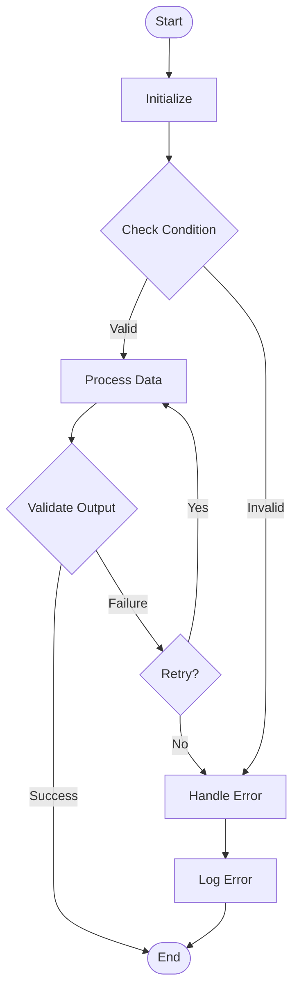

**Flowchart Syntax Elements:**

- `flowchart TD` - Top-down direction
- `flowchart LR` - Left-right direction
- `[Rectangle]` - Process/Action
- `([Rounded])` - Start/End
- `{Diamond}` - Decision/Condition
- `[(Database)]` - Data storage
- `[[Subprocess]]` - Predefined process
- `-->|label|` - Labeled transition
- `-.->` - Dotted line (optional/conditional)
- `==>` - Thick line (emphasized)

#### State Diagram Syntax (for State Machines)

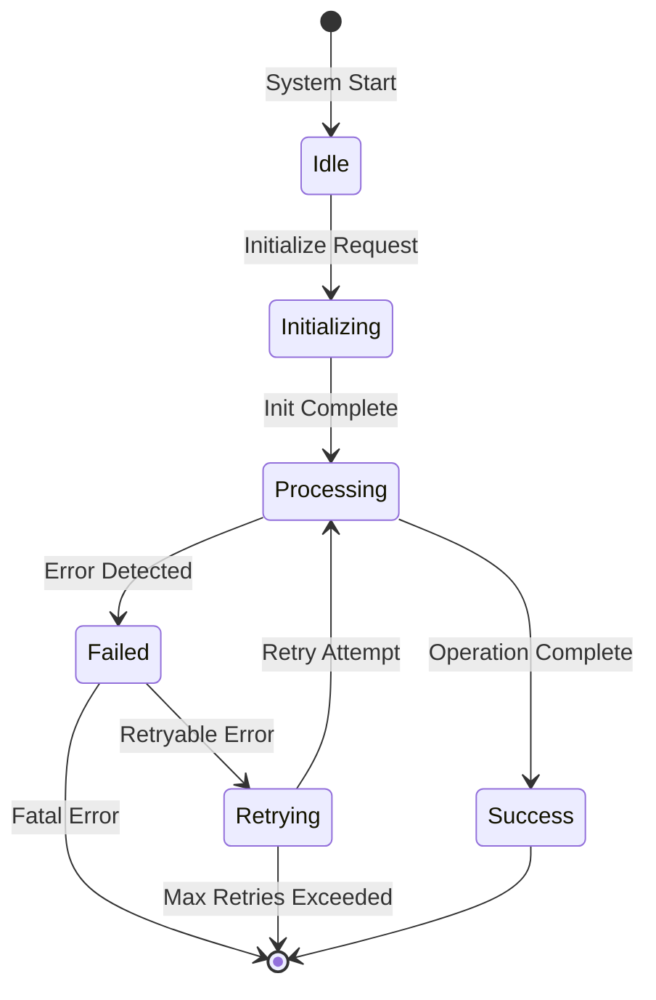

**State Diagram Syntax Elements:**

- `stateDiagram-v2` - Version 2 syntax (recommended)
- `[*]` - Start/End state
- `-->` - State transition
- `:label` - Transition condition/event
- `state "Name" as alias` - State aliasing
- `[*] --> State` - Initial transition
- `State --> [*]` - Final transition
- `choice` - Decision state
- `fork` / `join` - Concurrent states

#### Sequence Diagram Syntax (for Timing/Sequencing)

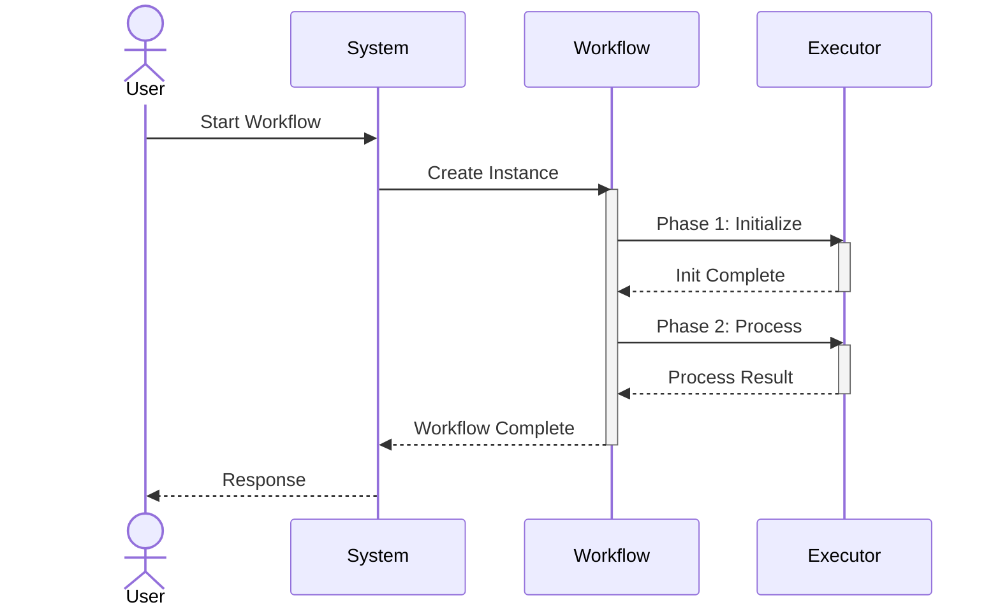

**Sequence Diagram Syntax Elements:**

- `actor` - External participant
- `participant` - System component
- `->>` - Synchronous message
- `-->` - Asynchronous message
- `-->>` - Return message
- `activate` / `deactivate` - Show activity duration
- `loop` - Loop block
- `alt` / `else` - Conditional blocks
- `opt` - Optional block
- `par` - Parallel execution

#### Gantt Chart Syntax (for Timeline Visualization)

```mermaid
gantt
    title Workflow Execution Timeline
    dateFormat HH:mm:ss
    axisFormat %H:%M:%S

    section Phase 1
    Initialize    :p1, 00:00:00, 2s
    Validate      :p2, after p1, 3s

    section Phase 2
    Process       :p3, after p2, 10s
    Review        :p4, after p3, 5s

    section Phase 3
    Finalize      :p5, after p4, 4s
    Cleanup       :p6, after p5, 2s
```

**Gantt Chart Syntax Elements:**

- `title` - Chart title
- `dateFormat` - Input date format
- `axisFormat` - Display date format
- `section` - Grouping
- `:id, start, duration` - Task definition
- `after id` - Sequential dependency
- `crit` - Critical path marker

#### Example: Multi-Phase Workflow with Retry Logic

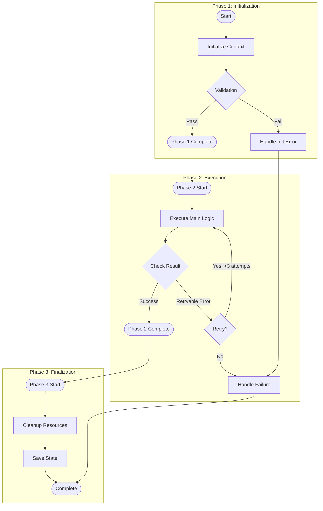

### 2.2 PlantUML Diagram Syntax

**Official Reference:** https://plantuml.com/

#### State Diagram in PlantUML

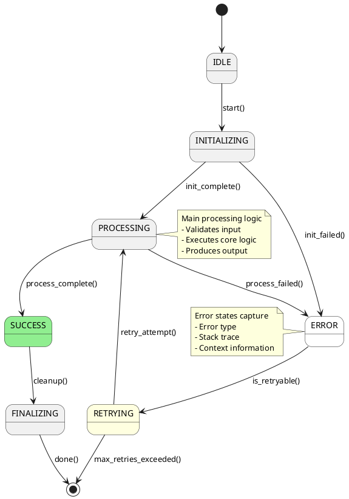

#### Activity Diagram in PlantUML

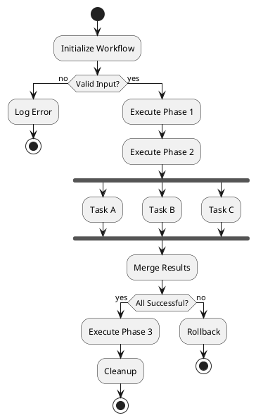

#### Sequence Diagram in PlantUML

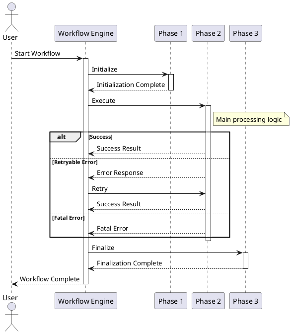

### 2.3 ASCII Art Flow Diagrams

**When to use:**

- Simple, linear flows
- Documentation in plain text files
- Quick sketches in comments
- Limited formatting environments

**Templates:**

```ascii
# Simple Linear Flow

[Start]
   |
   v
[Initialize]
   |
   v
[Validate] --> (Fail?) --> [Handle Error]
   |
   v
[Process]
   |
   v
[Finalize]
   |
   v
[End]
```

```ascii
# Decision Flow

                    +----------+
                    |  Start   |
                    +----------+
                          |
                          v
                    +----------+
                    | Validate |
                    +----------+
                          |
              +-----------+-----------+
              |                       |
         (Valid?)                 (Invalid?)
              |                       |
              v                       v
      +----------+             +------------+
      | Process  |             | Log Error  |
      +----------+             +------------+
              |                       |
              v                       v
      +----------+             +------------+
      | Continue |             |   Return   |
      +----------+             +------------+
```

```ascii
# Phase Flow with Timing

Phase 1: Init     |====|           (2s)
                          |
Phase 2: Process         |====================| (10s)
                                                |
Phase 3: Finalize                                |====| (2s)

Timeline: 0s    2s                      12s    14s
           |------|----------------------|------|
           P1     P2                     P3
```

```ascii
# State Transition Diagram

    +---------------------------------------------------+
    |                    IDLE                           |
    +---------------------------------------------------+
           |                                   ^
           | start()                            |
           v                                   |
    +---------------------------------------------------+
    |                 INITIALIZING                     |
    +---------------------------------------------------+
           |                                   ^
           | init_complete()                   | retry()
           v                                   |
    +---------------------------------------------------+
    |                  PROCESSING                       |
    +---------------------------------------------------+
           |                                   |
           | complete()       +---------------+----------------+
           v                 v                                 v
    +-----------+    +----------------+              +------------------+
    |  SUCCESS  |    |     ERROR      |              |    RETRYING      |
    +-----------+    +----------------+              +------------------+
         |                  |                                 |
         v                  v                                 v
    +-----------+    +----------------+              +------------------+
    |  FINALIZE |    |   CLEANUP      |              |    PROCESSING    |
    +-----------+    +----------------+              +------------------+
         |
         v
    +-----------+
    |   DONE    |
    +-----------+
```

### 2.4 Lifecycle Diagram Conventions

**Standard Lifecycle Symbols:**

- **Circle/Rectangle:** State or phase
- **Arrow:** Transition or flow
- **Diamond:** Decision point
- **Double border:** Start/end states
- **Dashed line:** Conditional/optional flow
- **Thick line:** Critical path/main flow
- **Color coding:** Status indicators (red=error, green=success, yellow=warning)

**Lifecycle Diagram Template:**

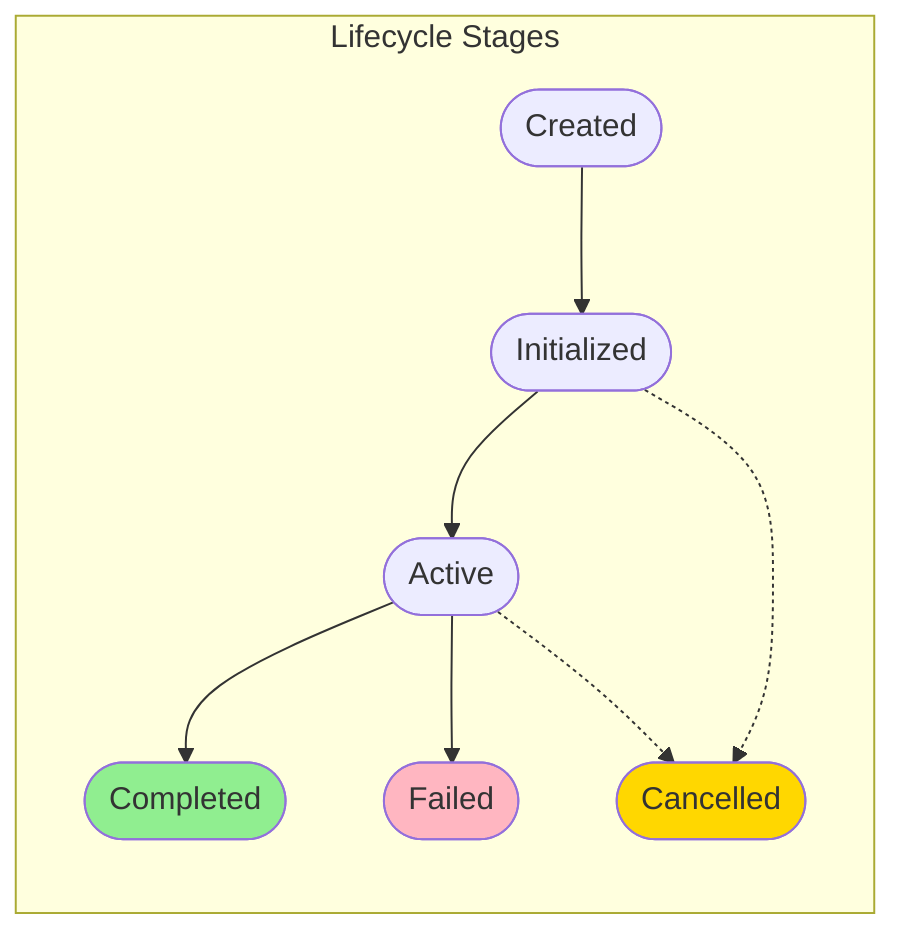

---

## 3. Best Practices

### 3.1 Documenting Multi-Phase Workflows

**Best Practice Guidelines:**

1. **Hierarchical Documentation Structure:**

   ```markdown
   # Workflow: [Workflow Name]

   ## Overview

   - High-level description
   - Purpose and goals
   - Use cases

   ## Architecture

   - High-level diagram
   - Phase breakdown
   - Component interactions

   ## Phases

   ### Phase 1: [Name]

   - Purpose
   - Input requirements
   - Output/Artifacts
   - Timing/Duration
   - Dependencies

   ### Phase 2: [Name]

   ...

   ## State Machine

   - State diagram
   - Transition rules
   - Error handling

   ## Execution Examples

   - Successful run walkthrough
   - Error scenario walkthrough
   ```

2. **Phase Documentation Template:**

   ````markdown
   ### Phase N: [Phase Name]

   **Purpose:** One-sentence description of what this phase accomplishes

   **Entry Conditions:**

   - Required state before entering
   - Required artifacts/inputs
   - Prerequisites

   **Process:**

   1. Step 1 description
   2. Step 2 description
   3. Step 3 description

   **Exit Conditions:**

   - State after completion
   - Produced artifacts
   - Side effects

   **Timing:**

   - Expected duration: X seconds
   - Timeout: Y seconds
   - Dependencies on previous phases

   **Error Handling:**

   - Common errors
   - Retry strategy
   - Fallback behavior

   **Example:**

   ```text
   Input: {...}
   Output: {...}
   Duration: 2.5s
   ```
   ````

   ```

   ```

3. **Phase Transition Documentation:**
   - Document all valid phase transitions
   - Specify conditions for each transition
   - Show invalid transitions and why they're blocked
   - Include decision trees for complex logic

**Example Multi-Phase Workflow Documentation:**

```markdown
# Bug Finding Workflow

## Overview

This workflow orchestrates a multi-phase process to find bugs in code using AI analysis.

## Phases

### Phase 1: Initialization (Duration: ~5s)

**Purpose:** Set up the analysis environment and prepare code for examination

**Entry Conditions:**

- Valid code repository path
- Sufficient disk space available
- Required environment variables set

**Process:**

1. Clone or verify repository access
2. Load configuration files
3. Initialize analysis context
4. Set up working directories

**Exit Conditions:**

- Repository cloned/verified
- Configuration loaded
- Context initialized
- Working directories ready

**Output:**

- `initialized_context.json` - Contains repo info and config

### Phase 2: Analysis Orchestration (Duration: ~30-60s)

**Purpose:** Coordinate the bug finding analysis across code modules

**Entry Conditions:**

- Phase 1 completed successfully
- Context file exists

**Process:**

1. Scan repository structure
2. Identify analyzable modules
3. Create analysis tasks
4. Execute analysis (parallel when possible)
5. Aggregate results

**Exit Conditions:**

- All modules analyzed
- Results aggregated
- Findings structured

**Output:**

- `analysis_results.json` - Raw findings
- `analysis_summary.json` - High-level summary

### Phase 3: Result Processing (Duration: ~10s)

**Purpose:** Format and validate analysis results for output

**Entry Conditions:**

- Phase 2 completed successfully
- Raw results available

**Process:**

1. Validate result structure
2. Format according to schema
3. Add metadata and timestamps
4. Generate human-readable summary

**Exit Conditions:**

- Results formatted
- Metadata added
- Summary generated

**Output:**

- `final_results.json` - Formatted output
- `execution_summary.md` - Human-readable report

## State Transitions
```

[Not Started] → [Initializing] → [Analyzing] → [Processing] → [Complete]
↓ ↓ ↓
[Failed] [Failed] [Failed]

```

## Error Handling by Phase

### Phase 1 Failures
- Repository not accessible → Fail immediately
- Invalid configuration → Fail with configuration error
- Disk space insufficient → Fail with space error

### Phase 2 Failures
- Analysis timeout → Mark module as failed, continue with others
- API rate limit → Wait and retry (up to 3 times)
- Partial success → Continue to Phase 3 with available results

### Phase 3 Failures
- Invalid data from Phase 2 → Return Phase 2 error
- Output write failure → Fail with I/O error
- Formatting error → Return raw results with warning
```

### 3.2 Showing Timing and Sequencing Information

**Best Practices:**

1. **Use Sequence Diagrams for Temporal Relationships:**

   ```mermaid
   sequenceDiagram
       autonumber
       participant Orchestrator
       participant Phase1
       participant Phase2
       participant Phase3

       Note over Orchestrator: T=0s
       Orchestrator->>Phase1: Start
       Note over Phase1: T=0s to T=5s
       Phase1-->>Orchestrator: Complete (5s elapsed)

       Orchestrator->>Phase2: Start
       Note over Phase2: T=5s to T=35s
       Phase2-->>Orchestrator: Complete (35s elapsed)

       Orchestrator->>Phase3: Start
       Note over Phase3: T=35s to T=45s
       Phase3-->>Orchestrator: Complete (45s elapsed)
   ```

2. **Document Timing Specifications:**

   ```markdown
   ## Timing Specifications

   | Phase | Min Duration | Expected | Max Duration | Timeout |
   | ----- | ------------ | -------- | ------------ | ------- |
   | Init  | 2s           | 5s       | 10s          | 15s     |
   | Exec  | 20s          | 30s      | 60s          | 90s     |
   | Final | 3s           | 5s       | 10s          | 15s     |
   | TOTAL | 25s          | 40s      | 80s          | 120s    |

   **Parallel Execution:**

   - Phase 2 modules run in parallel (max 3 concurrent)
   - Phase 2 duration depends on slowest module
   ```

3. **Show Sequential Dependencies:**

   ```markdown
   ## Dependency Graph
   ```

   Phase 1 (Init)
   ↓
   Phase 2.1 (Scan) ──┐
   Phase 2.2 (Analyze) ├─→ Phase 2.5 (Aggregate)
   Phase 2.3 (Validate)─┤ ↓
   Phase 2.4 (Report) ──┘ Phase 3 (Finalize)

   ```

   **Legend:**
   - `↓` = Sequential dependency
   - `──` = Parallel execution
   - `┬─┴` = Converge to single point
   ```

4. **Timeline Visualization:**

   ```mermaid
   gantt
       title Workflow Execution Timeline
       dateFormat X
       axisFormat %s

       section Phase 1
       Initialize          :p1, 0, 5

       section Phase 2
       Scan Repo          :p2a, after p1, 3
       Analyze Modules    :p2b, after p2a, 25
       Validate Results   :p2c, after p2b, 5

       section Phase 3
       Format Output      :p3, after p2c, 5
       Generate Summary   :p4, after p3, 3
   ```

### 3.3 Documenting State Transitions

**Best Practices:**

1. **State Transition Table Format:**

   ```markdown
   ## State Transitions

   | Current State | Event/Condition | Next State | Action            | Side Effects      |
   | ------------- | --------------- | ---------- | ----------------- | ----------------- |
   | IDLE          | start()         | INIT       | Load config       | Emit 'started'    |
   | INIT          | init_complete   | RUNNING    | Begin work        | Schedule tasks    |
   | INIT          | init_failed     | ERROR      | Log error         | Notify user       |
   | RUNNING       | work_complete   | SUCCESS    | Save results      | Emit 'complete'   |
   | RUNNING       | work_failed     | RETRYING   | Check retry count | Increment attempt |
   | RETRYING      | attempts < max  | RUNNING    | Re-execute        | Reset timer       |
   | RETRYING      | attempts >= max | FAILED     | Cleanup           | Emit 'failed'     |
   | SUCCESS       | cleanup()       | DONE       | Release resources | Emit 'done'       |
   | ERROR         | fatal           | DONE       | Release resources | Emit 'done'       |
   ```

2. **State Entry/Exit Documentation:**

   ```markdown
   ### State: RUNNING

   **Entry Actions (when entering this state):**

   - Start execution timer
   - Initialize task list
   - Emit state_change event

   **Exit Actions (when leaving this state):**

   - Cancel pending tasks
   - Record final state
   - Emit state_change event

   **Valid Transitions From:**

   - INIT (on init_complete)

   **Valid Transitions To:**

   - SUCCESS (on work_complete)
   - RETRYING (on work_failed with retryable error)
   - FAILED (on work_failed with fatal error)

   **State-Specific Behaviors:**

   - Executes main workflow logic
   - Handles interruption signals
   - Monitors for timeout
   ```

3. **State Machine Diagram with Guards:**

   ```mermaid
   stateDiagram-v2
       [*] --> IDLE

       IDLE --> INIT: start() / [config_valid]
       IDLE --> ERROR: start() / [config_invalid]

       INIT --> RUNNING: init_complete()
       INIT --> ERROR: init_failed()

       RUNNING --> SUCCESS: work_complete()
       RUNNING --> RETRYING: work_failed() / [is_retryable AND attempts < max]
       RUNNING --> FAILED: work_failed() / [NOT is_retryable OR attempts >= max]

       RETRYING --> RUNNING: retry() / [attempts < max]
       RETRYING --> FAILED: give_up() / [attempts >= max]

       SUCCESS --> DONE
       FAILED --> DONE
       ERROR --> DONE

       DONE --> [*]

       note right of RETRYING
           Guard conditions:
           - is_retryable: error type allows retry
           - attempts < max: under retry limit
       end note
   ```

4. **Transition Condition Documentation:**

   ```markdown
   ## Transition Conditions

   ### is_retryable (Guard)

   Returns true if the error is retryable:

   - Network errors (connection timeout, DNS failure)
   - Temporary service unavailability (503, 504)
   - Rate limiting (429 with retry-after header)
   - Returns false for:
     - Authentication failures (401, 403)
     - Not found (404)
     - Invalid input (400)
     - Configuration errors

   ### attempts < max (Guard)

   - max is configurable (default: 3)
   - Counter increments on each retry attempt
   - Counter resets on successful completion

   ### config_valid (Guard)

   - All required fields present
   - No validation errors
   - All references resolvable
   ```

### 3.4 Documenting Retry Logic and Error Handling

**Best Practices:**

1. **Retry Logic Template:**

   ```markdown
   ## Retry Strategy

   **Retryable Errors:**

   - `NetworkTimeout`: Retry with exponential backoff
   - `RateLimitError`: Retry after delay specified by service
     - `TemporaryFailure`: Retry immediately up to N times

   **Non-Retryable Errors:**

   - `AuthenticationError`: Fail immediately, check credentials
   - `ValidationError`: Fail immediately, fix input
   - `ConfigurationError`: Fail immediately, update config
   - `ResourceNotFound`: Fail immediately, verify resources

   **Retry Configuration:**
   ```

   | Parameter          | Value | Description                      |
   | ------------------ | ----- | -------------------------------- |
   | max_attempts       | 3     | Maximum number of retry attempts |
   | initial_delay      | 1s    | Delay before first retry         |
   | backoff_multiplier | 2.0   | Exponential backoff multiplier   |
   | max_delay          | 30s   | Maximum delay between retries    |
   | jitter             | 0.1   | Random jitter factor (10%)       |

   ```

   **Retry Sequence:**
   ```

   Attempt 1: Execute immediately
   Attempt 2: Wait 1s ± 0.1s, then retry
   Attempt 3: Wait 2s ± 0.2s, then retry
   Give up after 3 failed attempts

   ```

   **Exponential Backoff Formula:**
   ```

   delay = min(initial_delay _ (backoff_multiplier ^ (attempt - 1)), max_delay)
   actual_delay = delay _ (1 + random(-jitter, +jitter))

   ```

   **On Final Failure:**
   - Log all attempts with timestamps
   - Record final error
   - Clean up resources
   - Notify with error details
   ```

2. **Error Handling Flow Diagram:**

   ```mermaid
   flowchart TD
       Start([Operation Start]) --> Execute[Execute Operation]
       Execute --> Check{Success?}
       Check -->|Yes| Success([Operation Complete])
       Check -->|No| ErrorType{Error Type?}

       ErrorType -->|Retryable| RetryCheck{Attempt < Max?}
       RetryCheck -->|Yes| Backoff[Calculate Backoff]
       Backoff --> Wait[Wait Delay]
       Wait --> Execute
       RetryCheck -->|No| FinalFail[Final Failure]

       ErrorType -->|Not Retryable| ImmediateFail[Immediate Failure]

       FinalFail --> Cleanup[Cleanup Resources]
       ImmediateFail --> Cleanup
       Cleanup --> Log[Log Error Context]
       Log --> Notify[Notify/Error Handler]
       Notify --> End([End])
   ```

3. **Error Context Documentation:**

   ````markdown
   ## Error Context Collection

   **Information Captured on Error:**

   ```json
   {
     "error_id": "uuid",
     "timestamp": "ISO8601",
     "operation": "operation_name",
     "phase": "current_phase",
     "attempt": 1,
     "max_attempts": 3,
     "error_type": "NetworkTimeout",
     "error_message": "Connection timeout after 30s",
     "error_code": "TIMEOUT",
     "stack_trace": "...",
     "context": {
       "url": "https://api.example.com/endpoint",
       "method": "POST",
       "timeout": 30000,
       "attempt_duration_ms": 30001
     },
     "retryable": true,
     "next_retry_at": "ISO8601"
   }
   ```
   ````

   **Error Recovery Actions:**
   - `NetworkTimeout`: Check network, increase timeout, retry
   - `RateLimitError`: Wait for retry-after duration, retry
   - `AuthError`: Refresh credentials, restart from beginning
   - `ValidationError`: Fix input, restart from beginning

   ```

   ```

4. **Circuit Breaker Pattern Documentation:**

   ```markdown
   ## Circuit Breaker

   **Purpose:** Prevent cascading failures by temporarily stopping
   requests to a failing service.

   **States:**

   - **Closed:** Normal operation, requests pass through
   - **Open:** Requests fail immediately, no calls to service
   - **Half-Open:** Limited requests test if service recovered

   **Transitions:**
   ```

   [Closed] --(failure_count > threshold)--> [Open]
   [Open] --(timeout expires)--> [Half-Open]
   [Half-Open] --(success)--> [Closed]
   [Half-Open] --(failure)--> [Open]

   ```

   **Configuration:**
   ```

   | Parameter           | Value | Description                     |
   | ------------------- | ----- | ------------------------------- |
   | failure_threshold   | 5     | Failures before opening circuit |
   | success_threshold   | 2     | Successes to close circuit      |
   | timeout             | 60s   | Time in open before half-open   |
   | half_open_max_calls | 3     | Max calls in half-open state    |

   ```

   **Example Flow:**
   ```

   1. Circuit starts in [Closed] state
   2. 5 consecutive failures occur
   3. Circuit transitions to [Open]
   4. All requests fail immediately for 60s
   5. Circuit transitions to [Half-Open]
   6. First 3 requests allowed through
   7. If 2+ succeed: Circuit closes
   8. If any fail: Circuit reopens

   ```

   ```

---

## 4. Documentation Structure

### 4.1 Recommended Documentation Organization

**Directory Structure:**

```
/docs
  /workflows
    /workflow-name
      README.md                    # Main entry point
      overview.md                  # High-level description
      architecture.md              # System architecture
      lifecycle.md                 # State machine and lifecycle
      /phases
        phase-1-initialization.md
        phase-2-execution.md
        phase-3-finalization.md
      /diagrams
        workflow-flowchart.mmd     # Mermaid source
        state-machine.mmd
        sequence-diagram.mmd
        lifecycle.mmd
      examples.md                  # Usage examples
      troubleshooting.md           # Common issues
      api-reference.md             # If workflow has API
      changelog.md                 # Version history
```

### 4.2 Essential Sections by Document Type

**Main README.md Structure:**

```markdown
# [Workflow Name]

## Quick Start

[One-paragraph summary + minimal example to get started]

## Overview

[What this workflow does, why it exists, key benefits]

## Key Features

- Feature 1
- Feature 2
- Feature 3

## Requirements

- System requirements
- Dependencies
- Prerequisites

## Installation/Setup

[How to set up the workflow]

## Usage

[Basic usage examples]

## Documentation Links

- [Architecture](architecture.md)
- [Lifecycle](lifecycle.md)
- [Phase Details](phases/)
- [Examples](examples.md)
- [Troubleshooting](troubleshooting.md)

## See Also

- [Related Workflow A](../workflow-a/)
- [Related Workflow B](../workflow-b/)
```

**Architecture Document Structure:**

```markdown
# [Workflow Name] Architecture

## System Overview

[High-level architecture description]

## Components

### Component 1

[Description, responsibilities, interfaces]

### Component 2

...

## Data Flow

[How data flows through the system]

## Control Flow

[How execution control is managed]

## Integration Points

[External systems and APIs]

## Diagrams


## Design Decisions

[Key architectural decisions and rationale]
```

**Lifecycle Document Structure:**

```markdown
# [Workflow Name] Lifecycle

## State Machine Overview

[Description of the state machine]

## States

### State 1: [Name]

[Description, entry/exit actions, valid transitions]

### State 2: [Name]

...

## Transitions

[State transition table]

## State Diagram


## Lifecycle Events

[List of all events and their effects]

## Error States

[Error handling and recovery]
```

**Phase Document Structure:**

```markdown
# Phase N: [Phase Name]

## Purpose

[One-sentence description]

## Timing

- Expected duration: Xs
- Timeout: Ys

## Entry Conditions

- Required state
- Required inputs
- Prerequisites

## Process

[Step-by-step process]

## Exit Conditions

- Resulting state
- Produced artifacts
- Side effects

## Dependencies

- Internal dependencies
- External dependencies

## Error Handling

[Common errors and their handling]

## Examples

[Example inputs and outputs]
```

**Troubleshooting Document Structure:**

```markdown
# Troubleshooting [Workflow Name]

## Common Issues

### Issue: [Issue Title]

**Symptoms:**

- Symptom 1
- Symptom 2

**Causes:**

- Cause 1
- Cause 2

**Solutions:**

1. Solution 1
2. Solution 2

**Prevention:**
[How to prevent this issue]

---

### Issue: [Another Issue]

...

## Debug Mode

[How to enable debug logging]

## Log Files

[Location and format of logs]

## Support

[How to get help]
```

### 4.3 Cross-Referencing Between Workflows

**Best Practices:**

1. **Related Workflows Section:**

   ```markdown
   ## Related Workflows

   ### Prerequisite Workflows

   - [Setup Workflow](../setup/) - Must complete before this workflow
   - [Config Workflow](../config/) - Provides required configuration

   ### Alternative Workflows

   - [Quick Workflow](../quick/) - Faster but less comprehensive
   - [Thorough Workflow](../thorough/) - Slower but more detailed

   ### Next Workflows

   - [Reporting Workflow](../reporting/) - Generates reports from this workflow's output
   - [Cleanup Workflow](../cleanup/) - Cleans up artifacts from this workflow

   ### Shared Components

   - [Common Utilities](../common/) - Shared functions and modules
   - [Data Models](../models/) - Shared data structures
   ```

2. **Workflow Composition:**

   ```markdown
   ## Workflow Composition

   This workflow is composed of the following sub-workflows:
   ```

   +-------------------+
   | Main Workflow |
   +-------------------+
   |
   +---> [Init Workflow] ----+
   | |
   +---> [Process Workflow] --+---> [Final Workflow]
   | |
   +---> [Validate Workflow] -+

   ```

   See individual workflow documentation for details:
   - [Init Workflow](./subworkflows/init/)
   - [Process Workflow](./subworkflows/process/)
   - [Validate Workflow](./subworkflows/validate/)
   - [Final Workflow](./subworkflows/final/)
   ```

3. **Data Flow Between Workflows:**

   ```markdown
   ## Data Flow

   This workflow produces data consumed by:

   | Output Artifact | Consumer Workflow | Usage                       |
   | --------------- | ----------------- | --------------------------- |
   | analysis.json   | Report Workflow   | Input for report generation |
   | metrics.csv     | Metrics Workflow  | Aggregation into dashboards |
   | logs.tar.gz     | Archive Workflow  | Long-term storage           |

   This workflow consumes data from:

   | Input Artifact | Producer Workflow | Expected Format |
   | -------------- | ----------------- | --------------- |
   | config.json    | Setup Workflow    | v2.0+           |
   | source.tar.gz  | Build Workflow    | Tarball         |
   ```

4. **Dependency Graph:**

   ```mermaid
   flowchart LR
       Setup[Setup Workflow] --> Main[This Workflow]
       Config[Config Workflow] --> Main
       Main --> Report[Report Workflow]
       Main --> Metrics[Metrics Workflow]
       Main --> Archive[Archive Workflow]

       style Main fill:#90EE90
   ```

5. **Shared State Documentation:**

   ```markdown
   ## Shared State

   This workflow reads/writes shared state:

   **State Location:** `/var/lib/workflow/state.json`

   **Read Operations:**

   - `workflow_id`: Unique identifier from Setup workflow
   - `config`: Configuration from Config workflow
   - `previous_run`: Last successful execution timestamp

   **Write Operations:**

   - `last_run`: Current execution timestamp
   - `results`: Output results
   - `status`: Final status

   **Concurrency:**

   - Multiple instances cannot run simultaneously
   - File locking is used to prevent race conditions
   - See [Concurrency Control](#concurrency) for details
   ```

---

## 5. Templates and Patterns

### 5.1 Complete Workflow Documentation Template

```markdown
# [Workflow Name]

## Quick Start

\`\`\`bash

# Minimal example to run the workflow

workflow-name --input input.json --output output.json
\`\`\`

## Overview

**Purpose:** [What this workflow accomplishes]

**Description:** [Detailed description of workflow functionality]

**Key Features:**

- [Feature 1]
- [Feature 2]
- [Feature 3]

**Use Cases:**

- [Use case 1]
- [Use case 2]

## Requirements

### System Requirements

- [Requirement 1]
- [Requirement 2]

### Dependencies

- [Dependency 1] (version X.Y+)
- [Dependency 2] (version A.B+)

### Prerequisites

- [Prerequisite 1]
- [Prerequisite 2]

## Installation

\`\`\`bash

# Installation commands

npm install workflow-name
\`\`\`

## Usage

### Basic Usage

\`\`\`bash
workflow-name [options]
\`\`\`

### Options

| Option      | Type   | Default     | Description             |
| ----------- | ------ | ----------- | ----------------------- |
| `--input`   | string | -           | Input file path         |
| `--output`  | string | -           | Output file path        |
| `--config`  | string | config.json | Configuration file      |
| `--verbose` | flag   | false       | Enable verbose logging  |
| `--dry-run` | flag   | false       | Show what would be done |

### Examples

#### Example 1: Basic execution

\`\`\`bash
workflow-name --input data.json --output results.json
\`\`\`

#### Example 2: With custom config

\`\`\`bash
workflow-name --input data.json --output results.json --config my-config.json
\`\`\`

#### Example 3: Verbose mode

\`\`\`bash
workflow-name --input data.json --output results.json --verbose
\`\`\`

## Architecture

### High-Level Architecture


### Components

- **Component 1:** [Description]
- **Component 2:** [Description]
- **Component 3:** [Description]

### Data Flow


## Workflow Phases

### Phase 1: [Phase Name]

**Duration:** ~X seconds

**Purpose:** [What this phase does]

**Entry Conditions:**

- [Condition 1]
- [Condition 2]

**Process:**

1. [Step 1]
2. [Step 2]
3. [Step 3]

**Exit Conditions:**

- [Condition 1]
- [Condition 2]

**Output:**

- [Output 1]
- [Output 2]

See [Phase 1 Details](phases/phase-1.md) for more information.

### Phase 2: [Phase Name]

...

## Lifecycle

### State Machine


### States

| State     | Description   | Duration |
| --------- | ------------- | -------- |
| [State 1] | [Description] | ~Xs      |
| [State 2] | [Description] | ~Ys      |

### Transitions

| From      | To        | Condition   | Action   |
| --------- | --------- | ----------- | -------- |
| [State 1] | [State 2] | [Condition] | [Action] |

See [Lifecycle Documentation](lifecycle.md) for details.

## Timing and Performance

### Expected Durations

| Phase     | Min | Expected | Max |
| --------- | --- | -------- | --- |
| [Phase 1] | Xs  | Ys       | Zs  |
| [Phase 2] | Xs  | Ys       | Zs  |
| **Total** | Xs  | Ys       | Zs  |

### Performance Characteristics

- [Characteristic 1]
- [Characteristic 2]

## Error Handling

### Error Types

| Error Type | Retryable? | Max Retries | Action             |
| ---------- | ---------- | ----------- | ------------------ |
| [Error 1]  | Yes        | 3           | Retry with backoff |
| [Error 2]  | No         | 0           | Fail immediately   |

### Retry Logic

- Max attempts: 3
- Initial delay: 1s
- Backoff multiplier: 2.0
- Max delay: 30s

### Error Recovery

See [Troubleshooting](troubleshooting.md) for common issues.

## Configuration

### Configuration File

\`\`\`json
{
"setting1": "value1",
"setting2": "value2",
"setting3": {
"subsetting": "value3"
}
}
\`\`\`

### Environment Variables

| Variable       | Required | Default | Description   |
| -------------- | -------- | ------- | ------------- |
| `VAR_NAME`     | Yes      | -       | [Description] |
| `OPTIONAL_VAR` | No       | default | [Description] |

## Outputs

### Output Format

\`\`\`json
{
"status": "success",
"results": [...],
"metadata": {
"duration": 45.2,
"timestamp": "2026-01-23T12:00:00Z"
}
}
\`\`\`

### Output Artifacts

- [Artifact 1]: [Description]
- [Artifact 2]: [Description]

## Troubleshooting

### Common Issues

#### Issue: [Issue Title]

**Symptoms:**

- [Symptom 1]
- [Symptom 2]

**Solution:**

1. [Step 1]
2. [Step 2]

See [Troubleshooting Guide](troubleshooting.md) for more details.

## Monitoring and Logging

### Log Location

Logs are written to: `/var/log/workflow-name/`

### Log Levels

- `ERROR`: Errors that prevent execution
- `WARN`: Warnings that don't prevent execution
- `INFO`: Informational messages
- `DEBUG`: Detailed debugging information

### Metrics

The workflow emits the following metrics:

- `workflow_duration_seconds`: Total execution time
- `workflow_phase_duration_seconds`: Phase execution time
- `workflow_errors_total`: Total error count

## Related Workflows

### Prerequisite Workflows

- [Workflow A](../workflow-a/): Must complete before this workflow

### Alternative Workflows

- [Workflow B](../workflow-b/): Alternative approach

### Next Workflows

- [Workflow C](../workflow-c/): Consumes this workflow's output

## Changelog

### Version 2.0.0 (2026-01-23)

- [Change 1]
- [Change 2]

### Version 1.0.0 (2025-12-01)

- Initial release

## Support

- **Documentation:** [Full Documentation](https://docs.example.com)
- **Issues:** [GitHub Issues](https://github.com/example/workflow/issues)
- **Discussions:** [GitHub Discussions](https://github.com/example/workflow/discussions)

## License

[License information]
```

### 5.2 Phase Documentation Template

```markdown
# Phase N: [Phase Name]

## Overview

**Parent Workflow:** [Link to main workflow]
**Phase Number:** N of M
**Expected Duration:** X seconds
**Timeout:** Y seconds

## Purpose

[One sentence description of what this phase accomplishes]

## Timing Specifications

| Metric            | Value     |
| ----------------- | --------- |
| Minimum duration  | X seconds |
| Expected duration | Y seconds |
| Maximum duration  | Z seconds |
| Timeout           | T seconds |

## Entry Conditions

The phase begins when:

1. [Condition 1]
2. [Condition 2]

### Required State

- [State requirement 1]
- [State requirement 2]

### Required Inputs

| Input    | Type   | Required | Description   |
| -------- | ------ | -------- | ------------- |
| `input1` | string | Yes      | [Description] |
| `input2` | number | No       | [Description] |

### Prerequisites

- [Prerequisite 1]
- [Prerequisite 2]

## Process

### Step-by-Step Process

#### Step 1: [Step Name]

**Description:** [What this step does]

**Duration:** ~X seconds

**Input:** [Input requirements]

**Output:** [Output produced]

\`\`\`python

# Example code

result = process_step(input_data)
\`\`\`

#### Step 2: [Step Name]

...

## Exit Conditions

The phase completes successfully when:

1. [Condition 1]
2. [Condition 2]

### Resulting State

- [State change 1]
- [State change 2]

### Produced Outputs

| Output    | Type   | Description   |
| --------- | ------ | ------------- |
| `output1` | object | [Description] |
| `output2` | array  | [Description] |

### Side Effects

- [Side effect 1]
- [Side effect 2]

## Error Handling

### Common Errors

#### Error: [Error Name]

**Cause:** [What causes this error]

**Impact:** [How it affects the phase]

**Retry:** Yes/No

**Action:** [How to handle]

\`\`\`

# Example error message

Error: [Error message]
Cause: [Root cause]
Solution: [How to fix]
\`\`\`

### Error Recovery Flow

\`\`\`
[Error occurs]
↓
[Is retryable?] ──No──→ [Fail phase]
↓ Yes
[Attempts < max?] ──No──→ [Fail phase]
↓ Yes
[Wait backoff]
↓
[Retry]
\`\`\`

## Dependencies

### Internal Dependencies

- [Dependency 1] from [Source]
- [Dependency 2] from [Source]

### External Dependencies

| Dependency  | Version | Purpose   |
| ----------- | ------- | --------- |
| [Library 1] | X.Y+    | [Purpose] |
| [Service 1] | API v2  | [Purpose] |

### Dependency Diagram


## Examples

### Example 1: Successful Execution

**Input:**
\`\`\`json
{
"param1": "value1",
"param2": 42
}
\`\`\`

**Output:**
\`\`\`json
{
"result": "success",
"data": {...}
}
\`\`\`

**Duration:** 3.2 seconds

### Example 2: Error Handling

**Input:**
\`\`\`json
{
"param1": "invalid"
}
\`\`\`

**Error:**
\`\`\`
ValidationError: Invalid value for param1
\`\`\`

**Recovery:** [How the error is handled]

## Validation

### Input Validation

| Validation     | Rule   | Error Message   |
| -------------- | ------ | --------------- |
| [Validation 1] | [Rule] | [Error message] |
| [Validation 2] | [Rule] | [Error message] |

### Output Validation

- [Validation 1]
- [Validation 2]

## Performance Considerations

### Resource Usage

- CPU: [Expected usage]
- Memory: [Expected usage]
- Disk I/O: [Expected usage]
- Network: [Expected usage]

### Optimization Tips

- [Tip 1]
- [Tip 2]

## Testing

### Unit Tests

- [Test 1]: [Description]
- [Test 2]: [Description]

### Integration Tests

- [Test 1]: [Description]
- [Test 2]: [Description]

## See Also

- [Previous Phase](../phase-N-1/)
- [Next Phase](../phase-N+1/)
- [Main Workflow](../README.md)
```

### 5.3 State Machine Documentation Template

```markdown
# [Workflow Name] State Machine

## Overview

This document describes the state machine for [workflow name].

## State Diagram


## States

### [STATE_NAME]

**Description:** [What this state represents]

**Type:** [Initial/Intermediate/Final]

**Duration:** [Expected duration, if applicable]

**Entry Actions:**

1. [Action 1]
2. [Action 2]

**Exit Actions:**

1. [Action 1]
2. [Action 2]

**State-Specific Behavior:**

- [Behavior 1]
- [Behavior 2]

**Valid Transitions From:**

- [State 1] on [event/condition]
- [State 2] on [event/condition]

**Valid Transitions To:**

- [State 1] on [event/condition]
- [State 2] on [event/condition]

## Transitions

### Transition: [From State] → [To State]

**Event/Condition:** [What triggers this transition]

**Guard Conditions:**

- [Guard 1]: [Description]
- [Guard 2]: [Description]

**Actions:**

1. [Action 1]
2. [Action 2]

**Side Effects:**

- [Side effect 1]
- [Side effect 2]

**Example:**
\`\`\`
[Example scenario showing this transition]
\`\`\`

## State Transition Table

| Current State | Event   | Guard   | Next State | Actions   |
| ------------- | ------- | ------- | ---------- | --------- |
| [State 1]     | [Event] | [Guard] | [State 2]  | [Actions] |
| [State 2]     | [Event] | [Guard] | [State 3]  | [Actions] |

## Lifecycle Events

### Event: [Event Name]

**Description:** [What this event represents]

**Trigger:** [How this event is triggered]

**Payload:**
\`\`\`typescript
interface EventPayload {
// Event payload structure
}
\`\`\`

**Handled By:**

- [State 1]: [How it handles this event]
- [State 2]: [How it handles this event]

## Error States

### [ERROR_STATE]

**Description:** [What this error state represents]

**Trigger:** [What causes entry to this state]

**Recovery:** [How to recover from this state]

**Transition From:**

- [State 1] on [error condition]
- [State 2] on [error condition]

**Transition To:**

- [Recovery State] on [recovery condition]
- [Terminal State] on [failure condition]

## State Persistence

**Storage Location:** [Where state is stored]

**Persistence Strategy:**

- [How state is persisted]
- [When state is persisted]
- [How state is restored]

**State Schema:**
\`\`\`json
{
"current_state": "STATE_NAME",
"state_data": {
// State-specific data
},
"metadata": {
"entered_at": "ISO8601",
"updated_at": "ISO8601"
}
}
\`\`\`

## State History

**Retention:** [How long state history is kept]

**Purpose:** [Why state history is maintained]

**Access:** [How to access state history]

## Monitoring

### State Metrics

- `state_duration_seconds`: Time spent in each state
- `state_transitions_total`: Number of state transitions
- `state_errors_total`: Number of errors per state

### State Logging

**Log Level:** [Log level for state transitions]

**Log Format:**
\`\`\`
[timestamp] [level] [state_transition] FROM=[from_state] TO=[to_state] EVENT=[event] DURATION=[duration]
\`\`\`

## Testing

### State Transition Tests

- [Test 1]: [Description]
- [Test 2]: [Description]

### State Machine Tests

- [Test 1]: [Description]
- [Test 2]: [Description]

## Debugging

### How to Enable Debug Logging

\`\`\`bash

# Command to enable debug logging

workflow-name --log-level debug
\`\`\`

### How to Inspect Current State

\`\`\`bash

# Command to inspect state

workflow-name --show-state
\`\`\`

### Common State Issues

#### Issue: [Issue Title]

**Symptoms:**

- [Symptom 1]
- [Symptom 2]

**Diagnosis:**
[How to diagnose]

**Solution:**
[How to fix]

## References

- [Parent Workflow Documentation](../README.md)
- [State Machine Pattern Documentation](https://ref.example.com)
- [Related Documentation](../related/)
```

### 5.4 Troubleshooting Template

```markdown
# Troubleshooting [Workflow Name]

## Quick Reference

| Symptom     | Quick Fix |
| ----------- | --------- |
| [Symptom 1] | [Fix]     |
| [Symptom 2] | [Fix]     |

## Common Issues

### Issue: Workflow Fails to Start

**Symptoms:**

- Error message when attempting to start
- Nothing happens when running the command

**Possible Causes:**

1. Missing dependencies
2. Incorrect configuration
3. Insufficient permissions

**Diagnosis Steps:**

1. Check dependencies are installed:
   \`\`\`bash
   workflow-name --check-deps
   \`\`\`

2. Validate configuration:
   \`\`\`bash
   workflow-name --validate-config
   \`\`\`

3. Check permissions:
   \`\`\`bash
   ls -la /path/to/workflow/directory
   \`\`\`

**Solutions:**

#### Solution 1: Install Missing Dependencies

\`\`\`bash
npm install workflow-name
\`\`\`

#### Solution 2: Fix Configuration

Edit configuration file:
\`\`\`json
{
"correct_setting": "value"
}
\`\`\`

#### Solution 3: Fix Permissions

\`\`\`bash
chmod +x /path/to/workflow
\`\`\`

**Prevention:**

- Run `workflow-name --check` before execution
- Keep dependencies updated
- Use provided configuration template

---

### Issue: Phase N Timeout

**Symptoms:**

- Workflow hangs during Phase N
- Timeout error after configured timeout period

**Possible Causes:**

1. Slow external service
2. Large input dataset
3. Network issues

**Diagnosis Steps:**

1. Check phase duration:
   \`\`\`bash
   workflow-name --show-phase-timing
   \`\`\`

2. Check external service status:
   \`\`\`bash
   curl -I https://api.example.com/health
   \`\`\`

3. Check network connectivity:
   \`\`\`bash
   ping api.example.com
   \`\`\`

**Solutions:**

#### Solution 1: Increase Timeout

\`\`\`bash
workflow-name --timeout 300
\`\`\`

Or in configuration:
\`\`\`json
{
"phases": {
"phase_n": {
"timeout": 300
}
}
}
\`\`\`

#### Solution 2: Optimize Input

- Reduce input size
- Filter unnecessary data
- Process in batches

#### Solution 3: Retry on Network Issues

\`\`\`bash
workflow-name --retry-on-network-error
\`\`\`

**Prevention:**

- Monitor typical execution times
- Set appropriate timeouts
- Implement retry logic

---

### Issue: Out of Memory Error

**Symptoms:**

- `Out of memory` error
- Process killed unexpectedly
- System becomes unresponsive

**Possible Causes:**

1. Large dataset
2. Memory leak
3. Insufficient system memory

**Diagnosis Steps:**

1. Check memory usage:
   \`\`\`bash
   workflow-name --profile-memory
   \`\`\`

2. Check system memory:
   \`\`\`bash
   free -h
   \`\`\`

3. Analyze memory profile:
   \`\`\`bash
   node --inspect workflow-name
   \`\`\`

**Solutions:**

#### Solution 1: Increase Memory Limit

\`\`\`bash
workflow-name --max-old-space-size=4096
\`\`\`

#### Solution 2: Process in Batches

\`\`\`bash
workflow-name --batch-size 1000
\`\`\`

#### Solution 3: Add More System Memory

- Upgrade system RAM
- Use machine with more memory
- Use cloud-based execution

**Prevention:**

- Profile memory usage regularly
- Implement batch processing
- Monitor memory leaks

---

## Error Messages Reference

### Error: [Error Code]

**Error Message:**
\`\`\`
[Full error message text]
\`\`\`

**Meaning:**
[What this error means]

**Common Causes:**

1. [Cause 1]
2. [Cause 2]

**Solutions:**

1. [Solution 1]
2. [Solution 2]

**Example:**
\`\`\`

# Example scenario showing this error

workflow-name --input data.json

# Error output

Error [Error Code]: [Error message]

# Fix

workflow-name --input data.json --fix-option
\`\`\`

---

## Debug Mode

### Enabling Debug Mode

**Command Line:**
\`\`\`bash
workflow-name --debug
\`\`\`

**Environment Variable:**
\`\`\`bash
export WORKFLOW_DEBUG=true
workflow-name
\`\`\`

**Configuration File:**
\`\`\`json
{
"debug": true
}
\`\`\`

### Debug Output

Debug mode provides:

- Detailed logging
- Stack traces
- Timing information
- State transitions
- Variable values

**Example Debug Output:**
\`\`\`
[2026-01-23 12:00:00] [DEBUG] [state_transition] FROM=IDLE TO=INIT EVENT=start
[2026-01-23 12:00:01] [DEBUG] [phase_start] PHASE=1
[2026-01-23 12:00:02] [DEBUG] [variable] NAME=input_value VALUE={...}
[2026-01-23 12:00:05] [DEBUG] [phase_complete] PHASE=1 DURATION=4.2s
\`\`\`

### Debugging Tools

#### Inspect State

\`\`\`bash
workflow-name --inspect-state
\`\`\`

#### Profile Performance

\`\`\`bash
workflow-name --profile
\`\`\`

#### Dry Run

\`\`\`bash
workflow-name --dry-run
\`\`\`

## Log Files

### Log Locations

| Log Type    | Location                      | Format |
| ----------- | ----------------------------- | ------ |
| Application | `/var/log/workflow/app.log`   | Text   |
| Error       | `/var/log/workflow/error.log` | Text   |
| Audit       | `/var/log/workflow/audit.log` | JSON   |

### Log Format

**Application Log:**
\`\`\`
[timestamp] [level] [component] [message]
\`\`\`

**Error Log:**
\`\`\`
[timestamp] [ERROR] [error_code] [error_message]
[timestamp] [ERROR] [stack_trace]
\`\`\`

**Audit Log:**
\`\`\`json
{
"timestamp": "ISO8601",
"event": "event_name",
"user": "user_id",
"action": "action_performed",
"result": "success/failure"
}
\`\`\`

### Log Analysis

**Search for Errors:**
\`\`\`bash
grep ERROR /var/log/workflow/app.log
\`\`\`

**View Recent Activity:**
\`\`\`bash
tail -f /var/log/workflow/app.log
\`\`\`

**Count Errors by Type:**
\`\`\`bash
grep ERROR /var/log/workflow/app.log | awk '{print $4}' | sort | uniq -c
\`\`\`

## Getting Help

### Self-Service Resources

- [Documentation](https://docs.example.com)
- [FAQ](https://docs.example.com/faq)
- [Known Issues](https://docs.example.com/known-issues)

### Community Support

- [GitHub Discussions](https://github.com/example/workflow/discussions)
- [Stack Overflow](https://stackoverflow.com/questions/tagged/workflow-name)
- [Discord/Slack](https://discord.gg/example)

### Professional Support

- Email: support@example.com
- Support Portal: https://support.example.com
- SLA: [Response time guarantees]

### Reporting Issues

When reporting issues, include:

1. Workflow version: \`workflow-name --version\`
2. Error message: Full error text
3. Configuration: (sanitized) config file
4. Logs: Relevant log excerpts
5. System info: OS, runtime versions

**Issue Template:**
\`\`\`

## Description

[Brief description of the issue]

## Steps to Reproduce

1. [Step 1]
2. [Step 2]
3. [Step 3]

## Expected Behavior

[What should happen]

## Actual Behavior

[What actually happens]

## Environment

- Workflow version: [version]
- OS: [OS version]
- Node version: [version]

## Logs

\`\`\`
[Relevant logs]
\`\`\`

## Configuration

\`\`\`json
{
"sanitized": "config"
}
\`\`\`
\`\`\`

## Performance Tuning

### Optimization Checklist

- [ ] Use appropriate batch sizes
- [ ] Enable parallel processing where possible
- [ ] Cache frequently accessed data
- [ ] Optimize database queries
- [ ] Use connection pooling
- [ ] Implement lazy loading
- [ ] Profile before optimizing

### Performance Profiling

\`\`\`bash

# Generate performance profile

workflow-name --profile --output profile.json

# Analyze profile

workflow-name --analyze-profile profile.json
\`\`\`

### Common Performance Issues

#### Issue: Slow Phase N

**Diagnosis:**
\`\`\`bash
workflow-name --profile-phase N
\`\`\`

**Optimizations:**

- [Optimization 1]
- [Optimization 2]
```

---

## 6. Essential Resources

### 6.1 Official Documentation

**GitHub Actions:**

- Main Documentation: https://docs.github.com/en/actions
- Workflow Syntax: https://docs.github.com/en/actions/reference/workflow-syntax-for-github-actions
- Best Practices: https://docs.github.com/en/actions/security-guides/security-hardening-for-github-actions
- Reusable Workflows: https://docs.github.com/en/actions/using-workflows/reusing-workflows

**GitLab CI/CD:**

- Main Documentation: https://docs.gitlab.com/ee/ci/
- Pipeline Configuration: https://docs.gitlab.com/ee/ci/yaml/
- Best Practices: https://docs.gitlab.com/ee/ci/yaml/best_practices.html

**Jenkins:**

- Pipeline Documentation: https://www.jenkins.io/doc/book/pipeline/
- Syntax Reference: https://www.jenkins.io/doc/book/pipeline/syntax/
- Best Practices: https://www.jenkins.io/doc/book/pipeline/best-practices/

**Azure DevOps:**

- Pipelines Overview: https://learn.microsoft.com/en-us/azure/devops/pipelines/
- YAML Schema: https://learn.microsoft.com/en-us/azure/devops/pipelines/yaml-schema/

### 6.2 Diagram Tools

**Mermaid:**

- Official Site: https://mermaid.js.org/
- Documentation: https://mermaid.js.org/intro/
- Syntax Guide: https://mermaid.js.org/syntax/
- Live Editor: https://mermaid.live/

**PlantUML:**

- Official Site: https://plantuml.com/
- State Diagrams: https://plantuml.com/state-diagram
- Activity Diagrams: https://plantuml.com/activity-diagram-beta
- Sequence Diagrams: https://plantuml.com/sequence-diagram

**Other Tools:**

- Graphviz (DOT): https://graphviz.org/
- WebSequenceDiagrams: https://www.websequencediagrams.com/
- Draw.io: https://app.diagrams.net/

### 6.3 Workflow and State Machine Patterns

**State Machine Patterns:**

- AWS Step Functions: https://docs.aws.amazon.com/step-functions/latest/dg/amazon-states-language.html
- State Machine Catalog: https://www.state-machine.com/
- Finite State Machines: https://en.wikipedia.org/wiki/Finite-state_machine

**Workflow Patterns:**

- Workflow Patterns: http://www.workflowpatterns.com/
- BPMN Specification: https://www.omg.org/spec/BPMN/

**Best Practices:**

- Google SRE Book: https://sre.google/books/
- Microsoft Patterns: https://docs.microsoft.com/en-us/azure/architecture/patterns/

### 6.4 Documentation Standards

**Documentation Style Guides:**

- Google Developer Documentation Style Guide: https://developers.google.com/tech-writing/one-pagers
- Microsoft Writing Style Guide: https://docs.microsoft.com/en-us/style-guide/
- Write the Docs: https://www.writethedocs.org/

**Markdown Resources:**

- Markdown Guide: https://www.markdownguide.org/
- CommonMark Spec: https://spec.commonmark.org/

### 6.5 Testing and Quality

**Testing Patterns:**

- Given-When-Then: https://cucumber.io/docs/gherkin/reference/
- Testing Best Practices: https://testing.googleblog.com/

**Code Quality:**

- Clean Code: http://www.cleancoder.com/
- Refactoring: https://refactoring.guru/

---

## Appendix A: Quick Reference Cards

### Mermaid Syntax Quick Reference

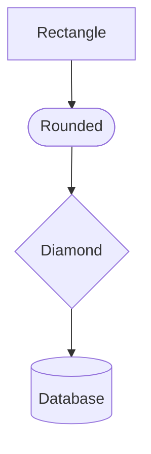

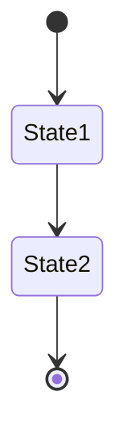

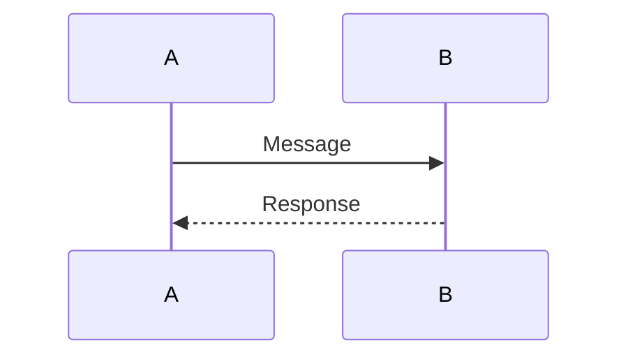

### Common State Transitions

```
Standard transitions:
  [State A] --[success]--> [State B]
  [State A] --[error]--> [Error State]
  [Error State] --[retry]--> [State A]
  [Error State] --[fail]--> [Terminal State]

Standard states:
  [INITIAL] - Starting state
  [RUNNING] - Active processing
  [SUCCESS] - Successful completion
  [ERROR] - Recoverable error
  [FAILED] - Terminal failure
  [CANCELLED] - User cancelled
```

---

**Document Version:** 1.0
**Last Updated:** 2026-01-23
**Maintained By:** [Your Team/Name]
