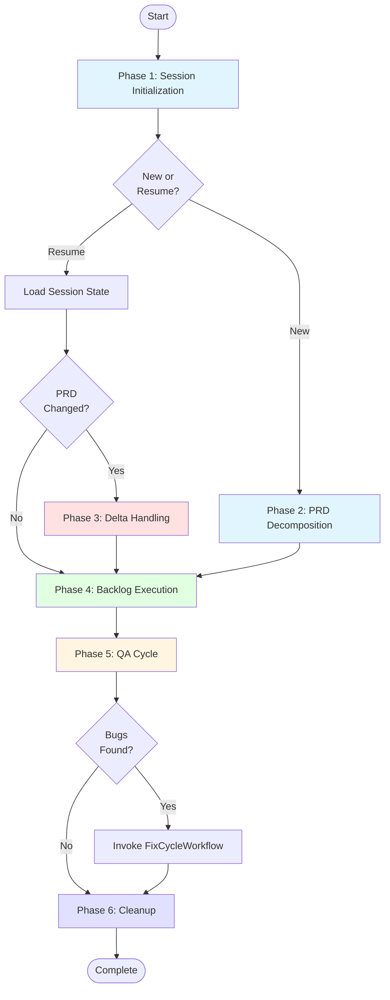
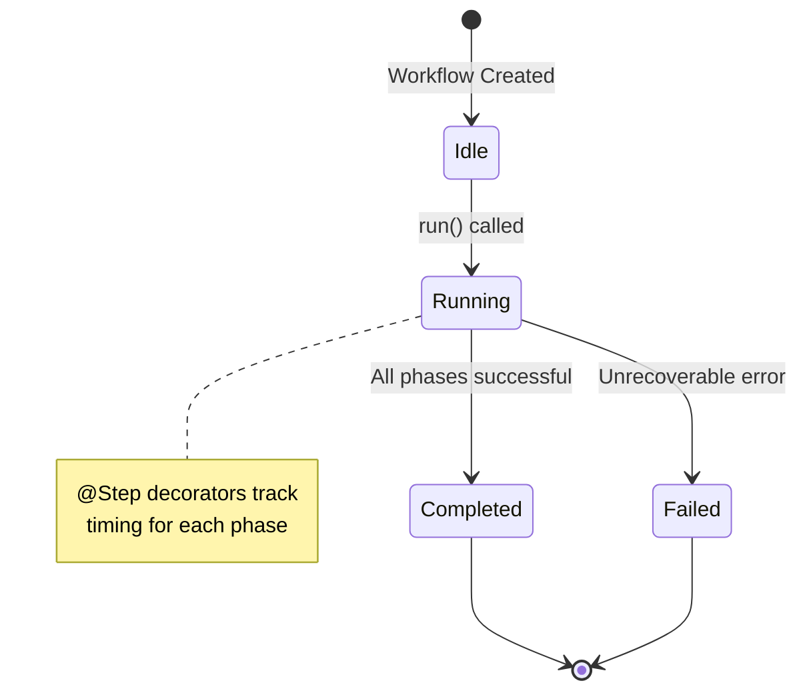
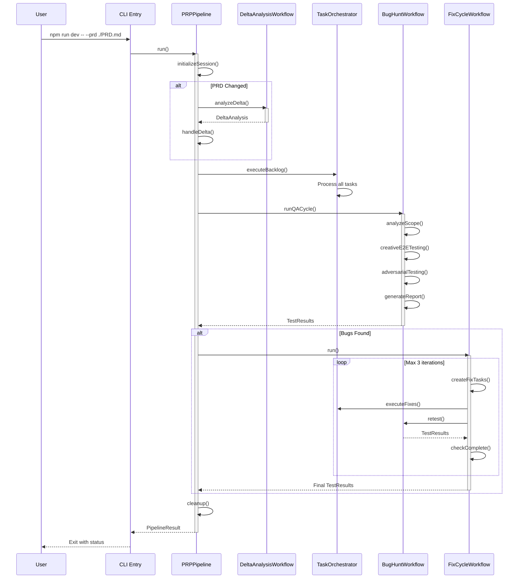

# Product Requirement Prompt (PRP): Create Workflow Documentation

> Transform PRD into working code with complete context, clear objectives, and validation criteria

**Status**: Ready for Implementation
**Last Updated**: 2026-01-23
**Work Item**: P2.M1.T2.S2 - Create workflow documentation

---

## Goal

**Feature Goal**: Create a comprehensive workflow documentation (`docs/WORKFLOWS.md`) that documents all four workflows (PRPPipeline, DeltaAnalysisWorkflow, BugHuntWorkflow, FixCycleWorkflow) with lifecycle diagrams, timing information, phase breakdowns, state machines, and integration points

**Deliverable**: Documentation file `docs/WORKFLOWS.md` containing complete workflow documentation with:

- Overview of all 4 workflows and their purposes
- Main pipeline lifecycle (init → breakdown → execute → QA)
- Delta session workflow (PRD change detection → patching → resume)
- Bug hunt workflow (3-phase testing → bug report → fix cycle)
- Fix cycle workflow (self-contained bugfix sessions)
- Mermaid diagrams for workflows (flowcharts, state machines, sequence diagrams)
- Timing information for each phase
- Cross-references to related documentation

**Success Definition**:

- A developer can understand the complete workflow architecture from this document
- All 4 workflows are documented with their lifecycles and phases
- Mermaid diagrams show workflow flows, state transitions, and component interactions
- Timing information helps users understand expected durations
- The document follows patterns from docs/INSTALLATION.md, docs/CONFIGURATION.md, and docs/CLI_REFERENCE.md
- Cross-references link to related documentation appropriately

## User Persona

**Target User**: Developer or technical user who needs to understand:

- How the PRP Pipeline orchestrates the complete development workflow
- How delta sessions handle PRD changes
- How QA and bug hunting workflows find and fix bugs
- How to debug workflow issues
- The interaction between different workflow components

**Use Case**: User needs to:

- Understand the complete workflow architecture
- Debug workflow execution issues
- Understand how PRD changes are handled
- Understand the QA and bug fixing process
- Extend or modify existing workflows

**User Journey**:

1. User opens WORKFLOWS.md to understand workflow architecture
2. User reads the overview to understand all 4 workflows
3. User navigates to specific workflow sections for details
4. User studies diagrams to visualize workflow flows
5. User cross-references other docs for implementation details

**Pain Points Addressed**:

- "How does the pipeline actually work?" - Overview and lifecycle diagrams
- "What happens when I change the PRD?" - Delta session workflow
- "How are bugs found and fixed?" - Bug hunt and fix cycle workflows
- "Why is this phase taking so long?" - Timing information
- "How do these workflows interact?" - Integration points and sequence diagrams

## Why

- **Architecture Understanding**: Developers need to understand the complete workflow system to work effectively
- **Debugging Support**: Clear workflow documentation helps diagnose execution issues
- **Onboarding**: New users learn the workflow architecture systematically
- **Extension Guide**: Understanding workflows enables custom workflow development
- **Transparency**: Visible workflow processes build trust in the system

## What

Create docs/WORKFLOWS.md with complete workflow documentation:

### Success Criteria

- [ ] File created at docs/WORKFLOWS.md
- [ ] Document header follows pattern (Status, Last Updated, Version)
- [ ] Table of Contents included with anchor links
- [ ] Overview section introduces all 4 workflows
- [ ] PRPPipeline (main) workflow documented with lifecycle phases
- [ ] DeltaAnalysisWorkflow documented with delta session flow
- [ ] BugHuntWorkflow documented with 3-phase testing process
- [ ] FixCycleWorkflow documented with iterative bug fixing
- [ ] Mermaid flowchart diagrams for each workflow
- [ ] Mermaid state machine diagrams showing state transitions
- [ ] Mermaid sequence diagrams showing component interactions
- [ ] Timing information for each phase
- [ ] Integration points documented between workflows
- [ ] Cross-references to CLI_REFERENCE.md, user-guide.md, etc.
- [ ] All diagrams use Mermaid syntax (existing codebase pattern)

## All Needed Context

### Context Completeness Check

_If someone knew nothing about this codebase, would they have everything needed to implement this successfully?_

**Yes** - This PRP provides:

- Exact workflow file locations and class definitions from src/workflows/
- Complete documentation formatting patterns from existing docs
- Detailed workflow lifecycle information from codebase analysis
- External research on workflow documentation best practices
- Mermaid diagram syntax examples
- Groundswell Workflow patterns (@Step decorator usage)
- Prompt-to-workflow mapping from PROMPTS.md analysis

### Documentation & References

```yaml
# MUST READ - Workflow implementations
- file: src/workflows/index.ts
  why: Central export point for all workflow classes
  pattern: Export declarations for PRPPipeline, DeltaAnalysisWorkflow, BugHuntWorkflow, FixCycleWorkflow
  gotcha: All workflows extend Groundswell Workflow base class

- file: src/workflows/prp-pipeline.ts
  why: Main workflow implementation - source of truth for pipeline lifecycle
  pattern: @Step({ trackTiming: true }) decorator usage, 6-phase lifecycle (init, breakdown, delta, execute, QA, cleanup)
  gotcha: 59,177 bytes - large file with complete orchestration logic

- file: src/workflows/delta-analysis-workflow.ts
  why: Delta session implementation for PRD change handling
  pattern: Single-step workflow with semantic PRD comparison
  gotcha: Uses QA agent for comparing PRD versions

- file: src/workflows/bug-hunt-workflow.ts
  why: QA testing workflow with 3-phase adversarial testing
  pattern: Four phases (analyzeScope, creativeE2ETesting, adversarialTesting, generateReport)
  gotcha: Generates structured TestResults with severity classification

- file: src/workflows/fix-cycle-workflow.ts
  why: Iterative bug fixing workflow with max 3 iterations
  pattern: Loop-based workflow (createFixTasks → executeFixes → retest → checkComplete)
  gotcha: Re-runs BugHuntWorkflow for verification

- file: PROMPTS.md
  why: Workflow prompt definitions that map to workflow phases
  pattern: TASK_BREAKDOWN_PROMPT, PRP_CREATE_PROMPT, PRP_EXECUTE_PROMPT, BUG_FINDING_PROMPT, DELTA_PRD_GENERATION_PROMPT
  gotcha: Prompts are chained: Task Breakdown → PRP Creation → PRP Execution → Validation

- file: docs/INSTALLATION.md
  why: Follow header format, section organization, troubleshooting pattern
  pattern: Document header (Status, Last Updated, Version), numbered sections
  gotcha: Uses ** for bold emphasis on important variables/commands

- file: docs/CONFIGURATION.md
  why: Follow table formatting, quick reference section pattern
  pattern: Quick Reference table at top, detailed sections with tables
  gotcha: Environment variable names use ALL_CAPS with backticks

- file: docs/CLI_REFERENCE.md
  why: Reference for linking workflow documentation to CLI commands
  pattern: Scope syntax, execution modes, command examples
  gotcha: Being implemented in parallel - will exist when this PRP executes

- file: docs/user-guide.md
  why: Reference for linking workflow documentation to user guide
  pattern: Advanced usage patterns, workflow examples
  gotcha: Contains existing workflow-related content to reference

- docfile: plan/003_b3d3efdaf0ed/P2M1T2S2/research/workflow_implementations.md
  why: Internal research on workflow implementations
  section: Complete workflow file analysis with lifecycle phases
  gotcha: Contains exact method names and @Step decorator patterns

- docfile: plan/003_b3d3efdaf0ed/P2M1T2S2/research/workflow_prompts.md
  why: Internal research on prompt-to-workflow mapping
  section: Prompt definitions and workflow phase associations
  gotcha: Contains complete prompt catalog with validation logic

- docfile: plan/003_b3d3efdaf0ed/P2M1T2S2/research/documentation_patterns.md
  why: Internal research on existing documentation patterns
  section: Header format, table patterns, Mermaid diagram usage
  gotcha: Contains exact formatting patterns to follow

- docfile: plan/003_b3d3efdaf0ed/P2M1T2S2/research/external_research.md
  why: External research on workflow documentation best practices
  section: Mermaid syntax, phase documentation templates, best practices
  gotcha: Contains ready-to-use Mermaid diagram templates

- url: https://mermaid.js.org/syntax/
  why: Official Mermaid syntax reference for diagram creation
  critical: Flowchart, stateDiagram-v2, sequenceDiagram syntax

- url: https://docs.github.com/en/actions/using-workflows
  why: Example of well-structured workflow documentation
  critical: Section organization, phase breakdown patterns
```

### Current Codebase Tree (relevant subset)

```bash
hacky-hack/
├── PRD.md                          # Main product requirements
├── README.md                       # Project overview
├── docs/
│   ├── INSTALLATION.md             # Installation guide (P2.M1.T1.S1)
│   ├── CONFIGURATION.md            # Configuration reference (P2.M1.T1.S2)
│   ├── QUICKSTART.md               # Quick start tutorial (P2.M1.T1.S3)
│   ├── user-guide.md               # User guide with advanced usage
│   ├── CLI_REFERENCE.md            # CLI command reference (P2.M1.T2.S1)
│   └── WORKFLOWS.md                # TARGET FILE - TO BE CREATED
├── src/
│   ├── workflows/
│   │   ├── index.ts                # Workflow exports
│   │   ├── prp-pipeline.ts         # Main pipeline workflow
│   │   ├── delta-analysis-workflow.ts  # Delta session workflow
│   │   ├── bug-hunt-workflow.ts    # QA testing workflow
│   │   ├── fix-cycle-workflow.ts   # Bug fixing workflow
│   │   └── hello-world.ts          # Simple validation workflow
│   ├── core/
│   │   ├── session-manager.ts      # Session state management
│   │   ├── task-orchestrator.ts    # Task execution orchestration
│   │   └── scope-resolver.ts       # Scope format validation
│   └── agents/
│       ├── architect-agent.ts      # Task breakdown agent
│       ├── researcher-agent.ts     # PRP generation agent
│       ├── coder-agent.ts          # PRP execution agent
│       └── qa-agent.ts             # QA and bug hunting agent
└── PROMPTS.md                      # Workflow prompt definitions
```

### Desired Codebase Tree with Files to be Added

```bash
hacky-hack/
├── docs/
│   ├── INSTALLATION.md             # (existing)
│   ├── CONFIGURATION.md            # (existing)
│   ├── QUICKSTART.md               # (existing)
│   ├── CLI_REFERENCE.md            # (existing - from P2.M1.T2.S1)
│   ├── user-guide.md               # (existing)
│   └── WORKFLOWS.md                # NEW FILE - Workflow documentation
│       ├── Overview (all 4 workflows)
│       ├── PRPPipeline (main workflow)
│       │   ├── Lifecycle diagram
│       │   ├── Phase breakdown (6 phases)
│       │   ├── State machine
│       │   └── Timing information
│       ├── DeltaAnalysisWorkflow
│       │   ├── Delta session flow
│       │   ├── PRD comparison process
│       │   └── Integration points
│       ├── BugHuntWorkflow
│       │   ├── 3-phase testing process
│       │   ├── State machine
│       │   └── Bug report generation
│       ├── FixCycleWorkflow
│       │   ├── Iterative fixing process
│       │   ├── Loop logic
│       │   └── Integration with BugHuntWorkflow
│       ├── Workflow Integration
│       │   ├── Sequence diagrams
│       │   ├── Data flow
│       │   └── Timing specifications
│       └── See Also (cross-references)
```

### Known Gotchas of Our Codebase & Library Quirks

```bash
# CRITICAL: All workflows extend Groundswell Workflow base class
# Base class provides: setStatus(), logger, correlation ID, decorator support

# CRITICAL: @Step({ trackTiming: true }) decorator is used on all workflow phases
# This enables automatic timing tracking and observability

# CRITICAL: State transitions follow: idle → running → completed/failed
# Use this.setStatus('running'), this.setStatus('completed'), this.setStatus('failed')

# CRITICAL: Workflow file sizes vary significantly
# prp-pipeline.ts is 59,177 bytes (main orchestration logic)
# delta-analysis-workflow.ts is 6,133 bytes (single step)

# CRITICAL: Prompts are chained in specific order
# Task Breakdown → PRP Creation → PRP Execution → Validation → Bug Hunt

# CRITICAL: BugHuntWorkflow is called by both PRPPipeline and FixCycleWorkflow
# Fix cycle re-runs bug hunt to verify fixes

# CRITICAL: Delta sessions create parent-child session linkage
# Delta sessions reference previous session for context

# CRITICAL: The docs/INSTALLATION.md, docs/CONFIGURATION.md, docs/CLI_REFERENCE.md are the style guide
# Match header format, table formatting, section organization exactly

# CRITICAL: Use Mermaid diagrams - existing codebase uses them extensively
# Flowcharts for workflow flows, stateDiagram-v2 for state machines, sequenceDiagram for interactions

# CRITICAL: Cross-reference links use relative paths
# Use [CLI Reference](./CLI_REFERENCE.md) format

# CRITICAL: Timing information should be included for each phase
# Use sequence diagrams with timing annotations

# CRITICAL: Document the @Step decorator pattern
# It's the key observability feature of the workflow system

# CRITICAL: Groundswell Workflow provides the base infrastructure
# Document what the base class provides vs what each workflow implements
```

## Implementation Blueprint

### Document Structure

Create docs/WORKFLOWS.md following established documentation patterns:

```markdown
# Workflows

> Complete guide to the PRP Pipeline workflow system, including all workflows, their lifecycles, phases, and integration points.

**Status**: Published
**Last Updated**: [DATE]
**Version**: 1.0.0

## Table of Contents

## Overview

## Workflow Architecture

## PRPPipeline (Main Workflow)

## DeltaAnalysisWorkflow

## BugHuntWorkflow

## FixCycleWorkflow

## Workflow Integration

## Timing and Performance

## Error Handling

## See Also
```

### Implementation Tasks (ordered by dependencies)

```yaml
Task 1: PREPARE - Review existing documentation patterns
  - READ: docs/INSTALLATION.md for header format, table patterns, troubleshooting
  - READ: docs/CONFIGURATION.md for quick reference pattern, option tables
  - READ: docs/CLI_REFERENCE.md for linking patterns to CLI documentation
  - READ: docs/user-guide.md for existing workflow content to reference
  - EXTRACT: Document header template (Status, Last Updated, Version)
  - EXTRACT: Table formatting patterns (column alignment, spacing)
  - EXTRACT: Mermaid diagram patterns from existing docs

Task 2: CREATE - Document header and Overview section
  - CREATE: File docs/WORKFLOWS.md
  - ADD: Document header (Status: Published, Last Updated, Version: 1.0.0)
  - ADD: Brief description "Complete guide to the PRP Pipeline workflow system..."
  - ADD: Table of Contents with anchor links
  - ADD: Overview section introducing all 4 workflows
  - ADD: High-level architecture diagram showing all 4 workflows
  - FOLLOW: Pattern from docs/CONFIGURATION.md Quick Reference section

Task 3: WRITE - Workflow Architecture section
  - ADD: Groundswell Workflow base class description
  - ADD: @Step decorator explanation with timing tracking
  - ADD: State management (idle → running → completed/failed)
  - ADD: Workflow coordination overview
  - INCLUDE: How workflows extend the base class
  - INCLUDE: Common patterns shared across workflows

Task 4: WRITE - PRPPipeline (Main Workflow) section
  - ADD: Workflow overview and purpose
  - ADD: Lifecycle flowchart diagram (init → breakdown → execute → QA → cleanup)
  - ADD: 6-phase breakdown with timing:
    - Phase 1: Session Initialization
    - Phase 2: PRD Decomposition (if new session)
    - Phase 3: Delta Handling (if PRD changed)
    - Phase 4: Backlog Execution
    - Phase 5: QA Cycle
    - Phase 6: Cleanup
  - ADD: State machine diagram
  - ADD: Timing information table
  - ADD: Entry/exit conditions for each phase
  - INCLUDE: @Step decorator usage examples
  - FORMAT: Mermaid flowchart and stateDiagram-v2

Task 5: WRITE - DeltaAnalysisWorkflow section
  - ADD: Workflow overview and purpose
  - ADD: Delta session flow diagram
  - ADD: PRD comparison process (old vs new)
  - ADD: DeltaAnalysis output structure
  - ADD: Integration with PRPPipeline
  - ADD: Parent-child session linkage
  - INCLUDE: How delta sessions resume from previous work
  - FORMAT: Mermaid flowchart showing delta detection flow

Task 6: WRITE - BugHuntWorkflow section
  - ADD: Workflow overview and purpose
  - ADD: 4-phase breakdown:
    - Phase 1: Scope Analysis
    - Phase 2: Creative E2E Testing
    - Phase 3: Adversarial Testing
    - Phase 4: Generate Report
  - ADD: State machine diagram
  - ADD: TestResults severity classification
  - ADD: Bug report generation process
  - ADD: Timing information for each phase
  - INCLUDE: Critical file presence/absence signaling
  - FORMAT: Mermaid flowchart and sequenceDiagram

Task 7: WRITE - FixCycleWorkflow section
  - ADD: Workflow overview and purpose
  - ADD: Iterative loop diagram (max 3 iterations)
  - ADD: 4-step breakdown:
    - Step 1: Create Fix Tasks
    - Step 2: Execute Fixes
    - Step 3: Re-test
    - Step 4: Check Completion
  - ADD: State machine showing loop logic
  - ADD: Integration with TaskOrchestrator
  - ADD: Re-running BugHuntWorkflow for verification
  - ADD: Stopping condition (no critical/major bugs)
  - FORMAT: Mermaid flowchart with loop logic

Task 8: WRITE - Workflow Integration section
  - ADD: Sequence diagram showing workflow interactions
  - ADD: Data flow between workflows
  - ADD: Prompt-to-workflow mapping table
  - ADD: Component interaction diagram
  - INCLUDE: How PRPPipeline coordinates other workflows
  - INCLUDE: How BugHuntWorkflow integrates with FixCycleWorkflow
  - FORMAT: Mermaid sequenceDiagram with participants

Task 9: WRITE - Timing and Performance section
  - ADD: Timing specifications table for all workflows
  - ADD: Expected duration ranges
  - ADD: Timeout configurations
  - ADD: Performance characteristics
  - INCLUDE: @Step timing tracking explanation
  - FORMAT: Table with Phase, Min Duration, Expected, Max, Timeout columns

Task 10: WRITE - Error Handling section
  - ADD: Error types and recovery strategies
  - ADD: Retry logic for workflows
  - ADD: State transitions on error
  - ADD: Common workflow errors and solutions
  - FOLLOW: Pattern from docs/INSTALLATION.md Troubleshooting section
  - FORMAT: Error description with symptoms, causes, solutions

Task 11: WRITE - See Also section
  - ADD: Cross-references to related documentation
  - INCLUDE: CLI_REFERENCE.md (for invoking workflows)
  - INCLUDE: user-guide.md (for advanced usage)
  - INCLUDE: INSTALLATION.md (for setup)
  - INCLUDE: CONFIGURATION.md (for environment variables)
  - INCLUDE: README.md (for project overview)
  - INCLUDE: PROMPTS.md (for prompt definitions)
  - FORMAT: Unordered list with descriptive links

Task 12: VALIDATE - Review against success criteria
  - CHECK: Document header follows pattern
  - CHECK: All 4 workflows documented (PRPPipeline, DeltaAnalysisWorkflow, BugHuntWorkflow, FixCycleWorkflow)
  - CHECK: Mermaid diagrams present (flowcharts, state machines, sequence diagrams)
  - CHECK: Timing information included
  - CHECK: Integration points documented
  - CHECK: Cross-references link appropriately
  - CHECK: All diagrams use valid Mermaid syntax
  - CHECK: @Step decorator pattern documented
  - CHECK: Groundswell Workflow base class documented
```

### Implementation Patterns & Key Details

````markdown
<!-- Header Pattern (from INSTALLATION.md) -->

# Workflows

> Complete guide to the PRP Pipeline workflow system, including all workflows, their lifecycles, phases, and integration points.

**Status**: Published
**Last Updated**: 2026-01-23
**Version**: 1.0.0

---

<!-- Overview Pattern -->

## Overview

The PRP Pipeline uses a **workflow orchestration system** built on Groundswell to manage the complete development lifecycle from PRD to working code. There are **four main workflows**:

| Workflow                  | Purpose                     | Phases                                                  |
| ------------------------- | --------------------------- | ------------------------------------------------------- |
| **PRPPipeline**           | Main orchestration workflow | 6 phases (init, breakdown, delta, execute, QA, cleanup) |
| **DeltaAnalysisWorkflow** | Handle PRD changes          | 1 phase (semantic PRD comparison)                       |
| **BugHuntWorkflow**       | QA testing and bug finding  | 4 phases (scope, creative E2E, adversarial, report)     |
| **FixCycleWorkflow**      | Iterative bug fixing        | 4 steps in a loop (create, execute, retest, check)      |

---

<!-- Mermaid Flowchart Pattern for Workflow Lifecycle -->

## PRPPipeline (Main Workflow)

### Lifecycle Overview


````

---

<!-- Phase Documentation Pattern -->

### Phase 1: Session Initialization

**Duration:** ~2-5 seconds

**Purpose:** Create a new session or load an existing one for resumption.

**Entry Conditions:**

- PRD file path provided
- Plan directory exists or can be created
- Configuration loaded

**Process:**

1. Generate unique session ID (timestamp-based)
2. Create session directory structure (`plan/{session_hash}/`)
3. Initialize session state (tasks.json, session state)
4. Calculate PRD hash for change detection

**Exit Conditions:**

- Session directory created
- Session state initialized
- PRD hash calculated

**Output:**

- `plan/{session_hash}/tasks.json` - Task hierarchy
- `plan/{session_hash}/session-state.json` - Current session state

**Decorator Pattern:**

```typescript
@Step({ trackTiming: true })
async initializeSession(): Promise<SessionState> {
  // Session initialization logic
}
```

---

<!-- State Machine Pattern -->

### State Machine



**State Transitions:**

| Current State | Event               | Next State  | Action                     |
| ------------- | ------------------- | ----------- | -------------------------- |
| `idle`        | `run()`             | `running`   | Start phase execution      |
| `running`     | Phase complete      | `running`   | Continue to next phase     |
| `running`     | All phases complete | `completed` | Finalize and return result |
| `running`     | Fatal error         | `failed`    | Log error and cleanup      |

---

<!-- Timing Information Pattern -->

### Timing Specifications

| Phase                  | Min Duration | Expected | Max Duration | Timeout      |
| ---------------------- | ------------ | -------- | ------------ | ------------ |
| Session Initialization | 2s           | 3s       | 5s           | 10s          |
| PRD Decomposition      | 30s          | 60s      | 120s         | 300s         |
| Delta Handling         | 10s          | 20s      | 40s          | 60s          |
| Backlog Execution      | Variable     | Variable | Variable     | Configurable |
| QA Cycle               | 60s          | 120s     | 300s         | 600s         |
| Cleanup                | 1s           | 2s       | 5s           | 10s          |

**Note:** The `@Step({ trackTiming: true })` decorator automatically tracks actual execution time for each phase.

---

<!-- Sequence Diagram Pattern for Workflow Integration -->

## Workflow Integration

### Workflow Coordination



---

<!-- Prompt Mapping Pattern -->

### Prompt-to-Workflow Mapping

| Prompt                        | Workflow Phase          | Used By                         |
| ----------------------------- | ----------------------- | ------------------------------- |
| `TASK_BREAKDOWN_PROMPT`       | Phase 1: Task Breakdown | PRPPipeline.initializeSession() |
| `PRP_CREATE_PROMPT`           | Phase 2: PRP Generation | PRPPipeline.executeBacklog()    |
| `PRP_EXECUTE_PROMPT`          | Phase 3: Implementation | PRPPipeline.executeBacklog()    |
| `BUG_FINDING_PROMPT`          | Phase 4: Bug Hunt       | BugHuntWorkflow                 |
| `DELTA_PRD_GENERATION_PROMPT` | Delta Session           | DeltaAnalysisWorkflow           |
| `VALIDATION_PROMPT`           | QA Cycle                | PRPPipeline.runQACycle()        |

---

<!-- See Also Pattern -->

## See Also

- **[CLI Reference](./CLI_REFERENCE.md)** - Command-line interface for invoking workflows
- **[User Guide](./user-guide.md)** - Advanced usage patterns and examples
- **[Installation Guide](./INSTALLATION.md)** - Setup instructions for the development environment
- **[Configuration Reference](./CONFIGURATION.md)** - Environment variables and configuration options
- **[Quick Start Tutorial](./QUICKSTART.md)** - Get started in under 5 minutes
- **[README](../README.md)** - Project overview and architecture
- **[PROMPTS.md](../PROMPTS.md)** - Complete prompt definitions used by workflows

````

### Integration Points

```yaml
INSTALLATION.md:
  - reference: "For installation instructions, see [Installation Guide](./INSTALLATION.md)"
  - assume: User has pipeline installed
  - link: Installation troubleshooting

CONFIGURATION.md:
  - reference: "For environment variables and configuration, see [Configuration Reference](./CONFIGURATION.md)"
  - assume: User knows environment variables
  - link: Model selection, API configuration, timeout settings

CLI_REFERENCE.md:
  - reference: "For CLI commands to invoke workflows, see [CLI Reference](./CLI_REFERENCE.md)"
  - assume: User knows CLI syntax
  - link: --scope, --mode, --continue flags

user-guide.md:
  - reference: "For advanced usage patterns, see [User Guide](./user-guide.md)"
  - placement: See Also section
  - context: Beyond workflow documentation to full usage guide

PROMPTS.md:
  - reference: "For prompt definitions, see [PROMPTS.md](../PROMPTS.md)"
  - placement: Prompt-to-workflow mapping section
  - context: Understanding what prompts drive each workflow phase

README.md:
  - reference: "For project overview, see [README](../README.md)"
  - placement: See Also section
  - context: Architecture overview, not workflow details
````

## Validation Loop

### Level 1: Syntax & Style (Immediate Feedback)

````bash
# Check markdown syntax
npm run check-docs 2>/dev/null || echo "Verify markdown links are valid"

# Manual validation checklist
- [ ] All markdown links resolve (./, ../ paths correct)
- [ ] All code blocks have language tags (```mermaid, ```bash)
- [ ] Table formatting is aligned (columns line up)
- [ ] No broken internal references (#anchors exist)
- [ ] Document follows established formatting patterns
- [ ] All Mermaid diagrams have valid syntax
- [ ] Document header follows pattern

# Validate Mermaid syntax
# Use https://mermaid.live/ to verify diagrams render correctly

# Expected: Zero formatting errors, all links valid, all diagrams render
````

### Level 2: Content Validation (Completeness)

````bash
# Manual content review checklist
- [ ] All 4 workflows documented (PRPPipeline, DeltaAnalysisWorkflow, BugHuntWorkflow, FixCycleWorkflow)
- [ ] PRPPipeline has all 6 phases documented (init, breakdown, delta, execute, QA, cleanup)
- [ ] DeltaAnalysisWorkflow has delta session flow documented
- [ ] BugHuntWorkflow has 4 phases documented (scope, creative E2E, adversarial, report)
- [ ] FixCycleWorkflow has iterative loop documented
- [ ] Mermaid flowchart diagrams for each workflow
- [ ] Mermaid stateDiagram-v2 for state machines
- [ ] Mermaid sequenceDiagram for workflow interactions
- [ ] Timing information for each phase
- [ ] Integration points documented
- [ ] @Step decorator pattern explained
- [ ] Groundswell Workflow base class explained
- [ ] Cross-references link to appropriate docs

# Verify workflow count
grep -c "##.*Workflow" docs/WORKFLOWS.md  # Should count all workflow sections

# Verify Mermaid diagram count
grep -c "```mermaid" docs/WORKFLOWS.md  # Should count all diagrams

# Expected: All content validation checks pass
````

### Level 3: Link Validation (Connectivity)

```bash
# Verify all internal links resolve
grep -o '\[.*\](\./[^)]*)' docs/WORKFLOWS.md | while read link; do
  target=$(echo "$link" | sed 's/.*(\(.*\))/\1/');
  if [ ! -f "docs/$target" ] && [ ! -f "$target" ]; then
    echo "Broken link: $target";
  fi;
done

# Verify anchor links
grep -o '\[.*\](#[^)]*)' docs/WORKFLOWS.md | while read link; do
  anchor=$(echo "$link" | sed 's/.*(#\(.*\))/\1/');
  if ! grep -q "^##.*$anchor" docs/WORKFLOWS.md; then
    echo "Broken anchor: $anchor";
  fi;
done

# Expected: All links valid, all anchors resolve
```

### Level 4: Diagram Validation (Visual Correctness)

```bash
# Test Mermaid diagram syntax

# Option 1: Use Mermaid CLI (if installed)
mmdc -i docs/WORKFLOWS.md -o /tmp/test.svg 2>&1 | head -20

# Option 2: Copy each diagram to https://mermaid.live/
# and verify it renders correctly

# Option 3: Visual inspection checklist
- [ ] Flowchart diagrams have correct shape syntax ([Rectangle], ([Rounded]), {Diamond})
- [ ] State diagrams use stateDiagram-v2 syntax
- [ ] Sequence diagrams have correct participant syntax
- [ ] All diagram nodes have labels
- [ ] Arrow directions are correct (--> vs ->>)
- [ ] Subgraphs are properly closed
- [ ] Styles are correctly applied

# Expected: All diagrams render without syntax errors
```

## Final Validation Checklist

### Technical Validation

- [ ] File created at docs/WORKFLOWS.md
- [ ] Document header follows pattern (Status, Last Updated, Version)
- [ ] Table of Contents with all sections and anchors
- [ ] All code blocks have syntax highlighting (`mermaid, `bash)
- [ ] All internal links use correct relative paths (./, ../)
- [ ] All external links are valid URLs
- [ ] Markdown syntax is valid (tables, lists, code blocks)
- [ ] Table columns are properly aligned
- [ ] All Mermaid diagrams have valid syntax and render correctly

### Content Validation

- [ ] All 4 workflows documented (PRPPipeline, DeltaAnalysisWorkflow, BugHuntWorkflow, FixCycleWorkflow)
- [ ] PRPPipeline lifecycle documented with 6 phases
- [ ] DeltaAnalysisWorkflow delta session flow documented
- [ ] BugHuntWorkflow 4-phase process documented
- [ ] FixCycleWorkflow iterative loop documented
- [ ] Mermaid flowchart diagrams for each workflow
- [ ] Mermaid stateDiagram-v2 for state transitions
- [ ] Mermaid sequenceDiagram for workflow interactions
- [ ] Timing information for each phase
- [ ] Integration points between workflows documented
- [ ] @Step decorator pattern explained
- [ ] Groundswell Workflow base class explained
- [ ] Prompt-to-workflow mapping included
- [ ] Error handling section present

### Documentation Pattern Compliance

- [ ] Header matches INSTALLATION.md and CONFIGURATION.md format
- [ ] Table formatting follows established patterns
- [ ] Code block language tags match content type (mermaid, bash)
- [ ] Section organization follows logical flow
- [ ] Cross-references use consistent link format
- [ ] Tone matches existing documentation (professional, approachable)
- [ ] Overview section provides high-level introduction
- [ ] Each workflow has consistent structure (overview, lifecycle, phases, state machine)

### Usability Validation

- [ ] User can understand the complete workflow architecture from this document
- [ ] Workflow lifecycles are clear and comprehensive
- [ ] Diagrams help visualize workflow flows
- [ ] Timing information helps set expectations
- [ ] Integration points show how workflows work together
- [ ] Cross-references guide to related documentation
- [ ] New users can learn the workflow system systematically
- [ ] Developers can use this to debug workflow issues

---

## Anti-Patterns to Avoid

- [ ] Don't create new documentation patterns when existing ones work
- [ ] Don't use diagram formats other than Mermaid (codebase standard)
- [ ] Don't skip the @Step decorator explanation (key observability feature)
- [ ] Don't forget to document Groundswell Workflow base class
- [ ] Don't omit timing information (helps set user expectations)
- [ ] Don't skip the prompt-to-workflow mapping (connects prompts to workflows)
- [ ] Don't use inconsistent table formatting across sections
- [ ] Don't create broken internal links (verify all ./ and ../ paths)
- [ ] Don't use invalid Mermaid syntax (test diagrams in https://mermaid.live/)
- [ ] Don't forget to cross-reference CLI_REFERENCE.md (invokes workflows)
- [ ] Don't document workflows in isolation (show integration points)
- [ ] Don't skip state machine diagrams (critical for understanding workflow states)
- [ ] Don't use flowchart for state machines (use stateDiagram-v2)
- [ ] Don't omit the delta session workflow (important for PRD changes)
- [ ] Don't forget BugHuntWorkflow is called by FixCycleWorkflow (re-test integration)
