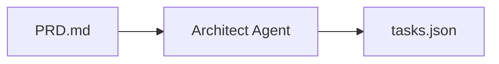
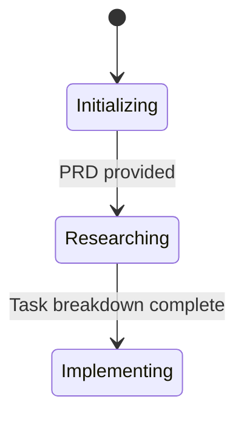
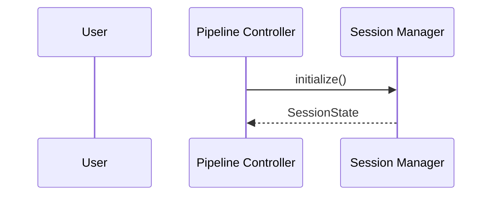

# Documentation Patterns Research

**Research Date:** 2026-01-23
**Work Item:** P2.M1.T2.S2 - Create workflow documentation

## Existing Documentation Structure

### Files in docs/ directory

1. **INSTALLATION.md** - Installation guide (P2.M1.T1.S1 output)
2. **CONFIGURATION.md** - Configuration reference (P2.M1.T1.S2 output)
3. **QUICKSTART.md** - Quick start tutorial (P2.M1.T1.S3 output)
4. **user-guide.md** - User guide with advanced usage
5. **CLI_REFERENCE.md** - CLI command reference (P2.M1.T2.S1 output - being implemented in parallel)

## Header Format Template

All documentation files follow this consistent header format:

```markdown
# Document Title

> Brief description or purpose statement

**Status**: [Draft | Review | Published | Deprecated]
**Last Updated**: YYYY-MM-DD
**Version**: X.Y.Z
**Maintainer**: Team/Person (optional)

## Table of Contents
```

**Examples from existing docs:**
- Status: Published (most common), Active Development, Complete
- Version: 1.0.0 (common)
- Last Updated: 2026-01-XX (follows project date)

## Table of Contents Style

- Auto-generated TOC with Markdown links
- Hierarchical structure with sections, subsections, and detailed topics
- Consistent numbering: H1 (document title) → H2 (main sections) → H3 (subsections) → H4 (detailed topics)

## Section Organization

**Standard Structure:**
1. Overview/Executive Summary (H2)
2. Prerequisites/Requirements (H2)
3. Quick Start/Getting Started (H2)
4. Detailed Guide/Step-by-step (H2)
5. Examples/Practical Use Cases (H2)
6. Troubleshooting/Common Issues (H2)
7. API Reference/Technical Details (H2)
8. See Also/Additional Resources (H2)

## Table Formatting Patterns

**Consistent table structure:**
```markdown
| Variable | Required | Default | Description |
|----------|----------|---------|-------------|
| `VAR_NAME` | Yes | - | Description |
```

- Use pipe `|` tables with consistent alignment
- Include headers with descriptive column names
- Use concise, actionable descriptions
- Environment variable names use ALL_CAPS with backticks

## Code Block Formatting

**Bash commands:**
```markdown
```bash
# Comment explaining the command
npm run dev -- --prd ./PRD.md

# Expected output (indicated with "Expected:")
# Expected:
# ✓ src/core/session-manager.test.ts (5)
```
```

**TypeScript code:**
```markdown
```typescript
// Code with comments
await sessionManager.updateItemStatus('P1.M1.T1.S1', 'Complete');
```
```

## Diagram Styles (Mermaid)

The codebase extensively uses Mermaid diagrams for visualization.

**Flowcharts:**


**State diagrams:**


**Sequence diagrams:**


## Cross-Reference Link Patterns

**Consistent linking style:**
- **Internal links**: `[Document Title](./path/to/document.md)`
- **External links**: `[URL](https://example.com)`
- **Anchor links**: `[Section Title](#section-id)`
- **Code file links**: `src/core/session-manager.ts`

## Special Formatting Conventions

**Status badges:**
```markdown
**Status**: Published | Draft | Review | Deprecated
```

**Callout blocks:**
```markdown
> CRITICAL: Never commit your `.env` file to version control.
```

**Checklists:**
```markdown
- [ ] All 4 validation levels completed successfully
- [ ] All tests pass: `uv run pytest src/ -v`
```

## Content Organization Patterns

**Guiding principle:** Progressive disclosure - start with quick start, then detailed guides, then advanced topics.

**Common sections:**
1. Quick Start - Minimal steps to get started
2. Overview - What is it and why use it
3. Prerequisites - What's needed to use it
4. Detailed Guide - Step-by-step instructions
5. Examples - Practical use cases
6. Troubleshooting - Common issues and solutions
7. API Reference - Technical details
8. Additional Resources - Links to related content

## File Naming Conventions

- **kebab-case** for filenames: `quick-start-guide.md`
- **PascalCase** for internal documentation: `UserGuide.md`
- **consistent extensions**: `.md` for all markdown files

## Tone and Voice

- Professional but approachable
- Clear and concise
- Action-oriented
- Uses **bold** for important variables/commands
- Uses `code font` for technical terms

## Documentation Quality Indicators

From existing docs:
- Use of "Expected:" labels for command output
- "What you see" / "Why it happens" / "How to fix" pattern for troubleshooting
- Progressive complexity in examples
- Clear visual hierarchy with headers
- Consistent formatting across all docs
