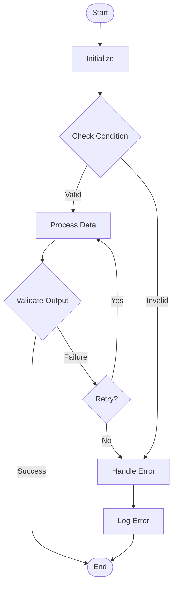
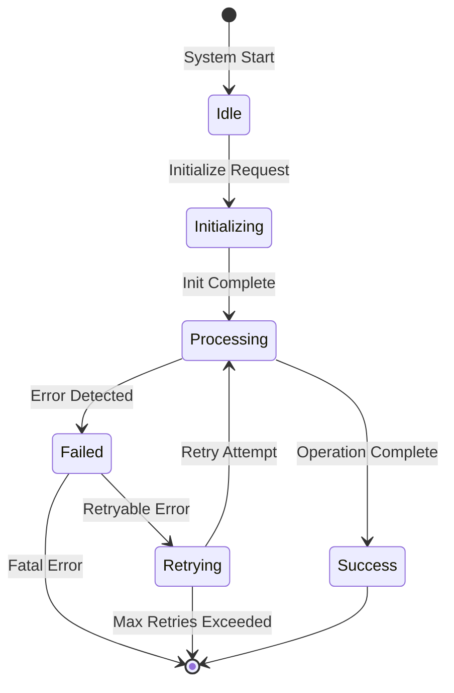
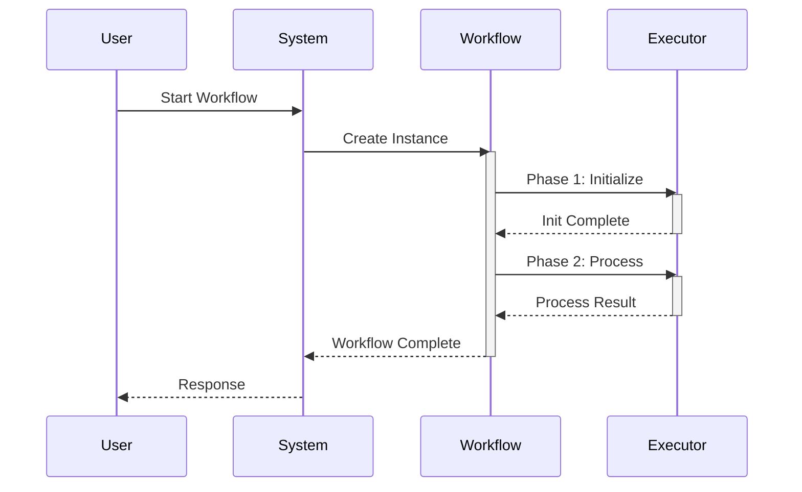

# External Workflow Documentation Research

**Research Date:** 2026-01-23
**Work Item:** P2.M1.T2.S2 - Create workflow documentation

## Key URLs Referenced

### Official Documentation
- **GitHub Actions:** https://docs.github.com/en/actions/using-workflows
- **GitHub Actions Syntax:** https://docs.github.com/en/actions/reference/workflow-syntax-for-github-actions
- **GitLab CI/CD:** https://docs.gitlab.com/ee/ci/
- **Jenkins Pipelines:** https://www.jenkins.io/doc/book/pipeline/
- **Azure DevOps:** https://learn.microsoft.com/en-us/azure/devops/pipelines/

### Diagram Tools
- **Mermaid Official:** https://mermaid.js.org/
- **Mermaid Live Editor:** https://mermaid.live/
- **Mermaid Syntax Guide:** https://mermaid.js.org/syntax/
- **PlantUML:** https://plantuml.com/

### Workflow Patterns
- **AWS Step Functions:** https://docs.aws.amazon.com/step-functions/latest/dg/amazon-states-language.html
- **Workflow Patterns:** http://www.workflowpatterns.com/
- **State Machine Catalog:** https://www.state-machine.com/

## Mermaid Diagram Syntax for Workflows

### Flowchart Syntax (for Workflow Flows)



**Flowchart Syntax Elements:**
- `flowchart TD` - Top-down direction
- `flowchart LR` - Left-right direction
- `[Rectangle]` - Process/Action
- `([Rounded])` - Start/End
- `{Diamond}` - Decision/Condition
- `-->|label|` - Labeled transition
- `-.->` - Dotted line (optional/conditional)

### State Diagram Syntax (for State Machines)



**State Diagram Syntax Elements:**
- `stateDiagram-v2` - Version 2 syntax (recommended)
- `[*]` - Start/End state
- `-->` - State transition
- `:label` - Transition condition/event

### Sequence Diagram Syntax (for Timing/Sequencing)



**Sequence Diagram Syntax Elements:**
- `participant` - System component
- `->>` - Synchronous message
- `-->` - Asynchronous message
- `-->>` - Return message
- `activate` / `deactivate` - Show activity duration

### Gantt Chart Syntax (for Timeline Visualization)

```mermaid
gantt
    title Workflow Execution Timeline
    dateFormat HH:mm:ss
    axisFormat %H:%M:%S

    section Phase 1
    Initialize    :p1, 00:00:00, 2s
    Validate      :p2, after p1, 3s

    section Phase 2
    Process       :p3, after p2, 10s
    Review        :p4, after p3, 5s

    section Phase 3
    Finalize      :p5, after p4, 4s
    Cleanup       :p6, after p5, 2s
```



## Phase Documentation Template

```markdown
### Phase N: [Phase Name]

**Purpose:** One-sentence description of what this phase accomplishes

**Entry Conditions:**
- Required state before entering
- Required artifacts/inputs
- Prerequisites

**Process:**
1. Step 1 description
2. Step 2 description
3. Step 3 description

**Exit Conditions:**
- State after completion
- Produced artifacts
- Side effects

**Timing:**
- Expected duration: X seconds
- Timeout: Y seconds
- Dependencies on previous phases

**Error Handling:**
- Common errors
- Retry strategy
- Fallback behavior
```

## Multi-Phase Workflow Documentation Structure

```markdown
# [Workflow Name]

## Overview
- High-level description
- Purpose and goals
- Use cases

## Architecture
- High-level diagram
- Phase breakdown
- Component interactions

## Phases
### Phase 1: [Name]
- Purpose
- Input requirements
- Output/Artifacts
- Timing/Duration
- Dependencies

### Phase 2: [Name]
...

## State Machine
- State diagram
- Transition rules
- Error handling

## Execution Examples
- Successful run walkthrough
- Error scenario walkthrough
```

## Best Practices for Workflow Documentation

1. **Hierarchical Documentation Structure**
   - Overview → Architecture → Phases → Examples → Troubleshooting

2. **Phase Documentation**
   - Purpose (one sentence)
   - Timing specifications
   - Entry/exit conditions
   - Process (step-by-step)
   - Error handling

3. **Timing and Sequencing**
   - Use sequence diagrams for temporal relationships
   - Document timing specifications in tables
   - Show sequential dependencies clearly

4. **State Transitions**
   - State transition tables (current state → event → next state → action)
   - State entry/exit documentation
   - Guard conditions with detailed explanations

5. **Retry Logic and Error Handling**
   - Retry strategy templates (max attempts, backoff, jitter)
   - Retryable vs non-retryable error classification
   - Error context collection schemas

## Documentation Structure Template

```markdown
# Workflow Name

## Quick Start
[Brief introduction + minimal example]

## Overview
[Purpose, description, key features, use cases]

## Architecture
[System overview, components, data flow]

## Workflow Phases
[Phase-by-phase breakdown]

## Lifecycle
[State machine, states, transitions]

## Timing and Performance
[Expected durations, performance characteristics]

## Error Handling
[Error types, retry logic, recovery]

## Configuration
[Configuration file, environment variables]

## Outputs
[Output format, artifacts]

## Troubleshooting
[Common issues, solutions]

## Related Workflows
[Prerequisites, alternatives, next workflows]
```

## Key Takeaways for PRP Implementation

1. **Use Mermaid diagrams** - The codebase already uses Mermaid extensively
2. **Follow header format** - Status, Last Updated, Version
3. **Phase-by-phase documentation** - Each workflow phase needs detailed breakdown
4. **State machine diagrams** - Show workflow states and transitions
5. **Timing information** - Include expected durations for each phase
6. **Sequence diagrams** - Show interactions between workflows and components
7. **Cross-references** - Link to related docs (CLI_REFERENCE.md, user-guide.md, etc.)
