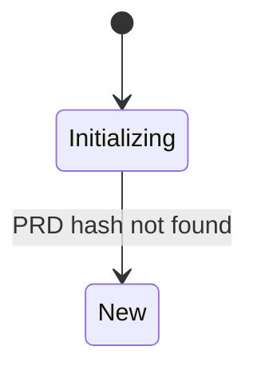
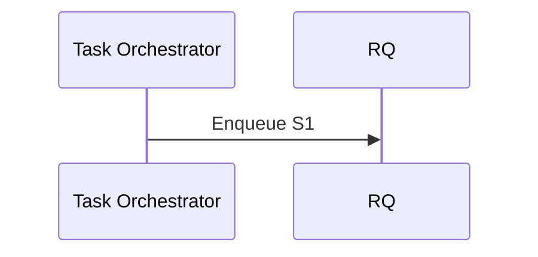

# Documentation Patterns Analysis

## Header Format (from INSTALLATION.md, CONFIGURATION.md, CLI_REFERENCE.md)

```markdown
# Title

> Brief description of the document's purpose and scope.

**Status**: Published
**Last Updated**: 2026-01-23
**Version**: 1.0.0

## Table of Contents
```

### Header Components
- **Title**: H1 level (`# Title`)
- **Description**: Blockquote (`> `) with brief purpose statement
- **Metadata**: Bold status fields (`**Status**: Published`)
- **Table of Contents**: H2 with all sections formatted as links

## Table Formatting

### Standard Table Format
```markdown
| Column Header 1 | Column Header 2 | Column Header 3 |
| -------------- | --------------- | --------------- |
| Value 1        | Value 2         | Value 3         |
```

### Column Alignment
- Default: Left-aligned for all columns
- Multi-line content: Place newlines within the same cell

## Code Block Formatting

### Language Tags
- `bash` for shell commands
- `typescript` for TS code
- `json` for JSON content
- `markdown` for markdown examples
- `powershell` for PowerShell scripts
- `mermaid` for diagrams

### Example Patterns
```bash
# Standard bash command
npm run dev -- --prd ./PRD.md
```

```typescript
// TypeScript code with comments
interface Example {
  name: string;
  version: number;
}
```

## Cross-Reference Linking

### Internal Document Links
```markdown
- **[INSTALLATION.md](./INSTALLATION.md)** - Setup instructions
- **[Configuration Reference](./CONFIGURATION.md)** - Environment variables
```

### Relative Path Conventions
- Same directory: `./FILENAME.md`
- Parent directory: `../FILENAME.md`
- Subdirectories: `PATH/TO/FILE.md`

## Section Organization

### Hierarchy Structure
1. H1: `# Title`
2. H2: `## Section`
3. H3: `### Subsection`
4. H4: `#### Sub-subsection`

### Table of Contents Format
```markdown
## Table of Contents

- [Section Name](#section-name)
  - [Subsection](#subsection)
```

### Section Naming Conventions
- Use kebab-case for links (`#quick-reference`)
- Start with main sections, then detailed subsections
- Group related concepts under parent sections

## Special Formatting Patterns

### "What you see/Why it happens/How to fix" Pattern
```markdown
### "Error Message"

**What you see:**
[error output]

**Why it happens:**
[explanation]

**How to fix:**
[solution]
```

### Checklists
```markdown
**Acceptance Criteria:**

- [ ] Users can log in with email/password
- [ ] Session tokens expire after 24 hours
- [ ] Failed login attempts are logged
```

### Numbered Lists
```markdown
1. **Clone the repository**
   ```bash
   git clone https://github.com/...
   ```

2. **Install dependencies**
   ```bash
   npm install
   ```
```

## Mermaid Diagram Usage

### State Diagram


### Flowchart


### Sequence Diagram


## See Also Section Pattern
```markdown
## See Also

- **[README.md](../README.md)** - Project overview
- **[CLI Reference](./CLI_REFERENCE.md)** - Command details
- **[Configuration](./CONFIGURATION.md)** - Environment variables
```
