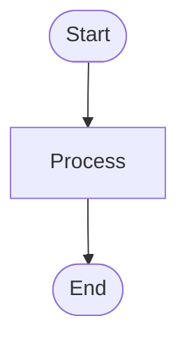
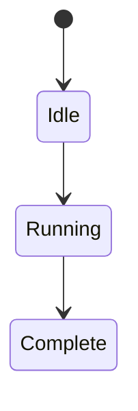
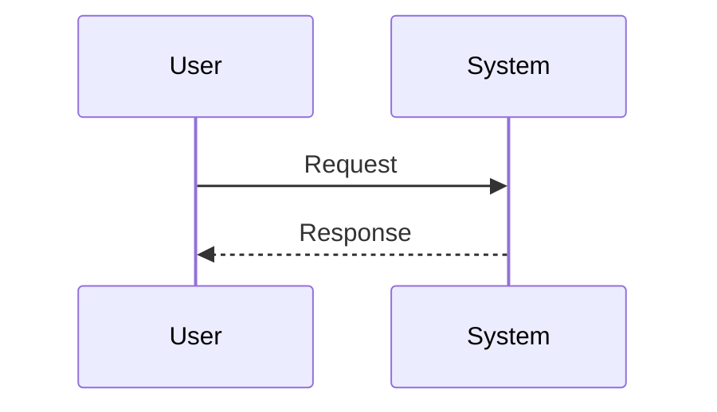

# Documentation Structure and Patterns Research

## Existing Documentation Files

### Main Documentation Directory (`/docs/`)

| File | Purpose | Status |
|------|---------|--------|
| `INSTALLATION.md` | Setup and installation guide | Published |
| `CONFIGURATION.md` | Environment variables reference | Published |
| `CLI_REFERENCE.md` | Command-line interface documentation | Published |
| `WORKFLOWS.md` | Pipeline workflow documentation | Published |
| `user-guide.md` | Comprehensive user guide | Published |

### API Documentation (`/docs/api/`)

| File | Purpose |
|------|---------|
| `index.html` | TypeDoc generated API docs |
| `media/architecture.md` | Complete system architecture reference |
| `media/PROMPTS.md` | System prompts reference |

### Research Documentation (`/docs/research/`)

Collection of technical research documents including best practices.

## Documentation Header Format

**Standard Pattern** (all files follow this):

```markdown
# Document Title

> Brief, descriptive summary of what the document covers. This should be one sentence that clearly explains the document's purpose and scope.

**Status**: Published
**Last Updated**: 2026-01-23
**Version**: 1.0.0
```

**Status Values**:
- `Published` - Stable, production-ready
- `Draft` - Work in progress
- `Review` - Under review

## Table of Contents Pattern

```markdown
## Table of Contents

- [Quick Reference](#quick-reference)
- [Main Section](#main-section)
  - [Subsection](#subsection)
  - [Another Subsection](#another-subsection)
- [Detailed Section](#detailed-section)
  - [Nested Topic](#nested-topic)
- [Examples](#examples)
- [Troubleshooting](#troubleshooting)
- [See Also](#see-also)
```

**TOC Organization Principles**:
1. Start with Quick Reference (essential info)
2. Logical nesting (subsections indented)
3. Alphabetical within subsections when appropriate
4. End with "See Also" (cross-references)

## Section Organization

### Main Section Headers (##)

```markdown
## Quick Reference
## Overview
## Commands
## Configuration
## Examples
## Troubleshooting
## See Also
```

### Subsection Hierarchy

```markdown
## Main Section (##)
### Subsection (###)
#### Detailed Topic (####)
##### Rare - Only for very detailed breakdowns (#####)
```

### Quick Reference Section Pattern

```markdown
## Quick Reference

Essential commands/tables for quick lookup:

| Command/Option | Description |
| -------------- | ----------- |
| `command` | Brief description |
```

## Code Block Patterns

### Language Tags

| Tag | Usage |
|-----|-------|
| `bash` | Shell commands |
| `typescript` | TypeScript code |
| `javascript` | JavaScript code |
| `json` | JSON data |
| `yaml` | YAML configuration |
| `markdown` | Markdown examples |
| `mermaid` | Diagrams |

### Code Block with Title

```markdown
**Basic Command:**

```bash
npm run dev -- --prd ./PRD.md
```

This command:
- Point 1
- Point 2
- Point 3
```

### Comment Styles

**Bash comments**:
```bash
# Single-line comment
npm run dev -- --prd ./PRD.md

# Multi-line
# explanation
# of steps
npm install
```

**TypeScript comments**:
```typescript
// Single-line explanations
const x = 1;

/*
 * Multi-line block comments
 * for detailed explanations
 */
function example() {}
```

## Table Formatting Pattern

```markdown
| Column 1 | Column 2 | Column 3 |
| -------- | -------- | -------- |
| Data 1   | Data 2   | Data 3   |
```

**Table Guidelines**:
- Use consistent alignment
- Include column headers
- Use `---` separator row
- Wrap long text if needed

## Cross-Reference Patterns

### Internal Links (Same Document)

```markdown
See [Configuration](#configuration) for details.
As mentioned in the [Introduction](#introduction)
For more information, see [Best Practices](#best-practices)
```

### Internal Links (Different Documents)

```markdown
See [Getting Started](./INSTALLATION.md) for setup instructions.
For configuration options, see [Configuration Guide](./CONFIGURATION.md).
Related: [Custom Rules](./custom-rules.md)
```

### Relative Link Format

- Use `./` for current directory
- Use `../` for parent directory
- Use descriptive filenames (not numbers)

### "See Also" Section Pattern

```markdown
## See Also

- **[README.md](../README.md)** - Project overview and quick start
- **[Installation Guide](./INSTALLATION.md)** - Setup instructions
- **[Configuration Reference](./CONFIGURATION.md)** - Environment variables
- **[User Guide](./user-guide.md)** - Comprehensive usage documentation
```

**Cross-Referencing Rules**:
1. Group related links together
2. Use descriptive link text (not "click here")
3. Include file paths in parentheses after link
4. Bold document titles for visibility

## Diagram Patterns

### Mermaid Flowchart

```markdown

```

### Mermaid State Diagram

```markdown

```

### Mermaid Sequence Diagram

```markdown

```

### ASCII Art Directory Structure

```markdown
```
project/
├── src/
│   ├── core/
│   └── utils/
└── tests/
```
```

### Diagram Integration

- Place diagrams after introductory text
- Provide context before diagram
- Use `---` horizontal rules to separate
- Add descriptive captions in text above

## Callout Boxes

```markdown
> **[!NOTE]**
> Useful information

> **[!TIP]**
> Helpful suggestion

> **[!IMPORTANT]**
> Important information

> **[!WARNING]**
> Warning caution

> **[!CAUTION]**
> Strong danger warning
```

## Horizontal Rules

Use `---` to separate major sections:

```markdown
## Section 1

Content

---

## Section 2

Content
```

## Emphasis Patterns

- **Bold**: Key terms, important concepts
- _Italic_: Technical terms, variables
- `Code`: Commands, files, code elements
- ~~Strikethrough~~: Deprecated info (rarely used)

## List Patterns

### Unordered List

```markdown
- Unordered list item
  - Nested item
  - Another nested item
```

### Ordered List

```markdown
1. Ordered list item
2. Another item
   1. Nested numbered item
```

### Task List

```markdown
- [ ] Task list item (incomplete)
- [x] Task list item (complete)
```

## Troubleshooting Structure

```markdown
## Troubleshooting

### Common Issues

#### "Error Message"

**What you see:**

```bash
$ command
Error output here
```

**Why it happens:**

Explanation of cause.

**How to fix:**

```bash
# Solution commands
solution here
```
```

## Example Structure

```markdown
## Examples

### Basic Usage

**Simple case:**

```bash
command
```

### Advanced Scenarios

**Complex case:**

```bash
complex command with flags
```

### Common Patterns

**Workflow:**

1. Step 1
2. Step 2
3. Step 3
```

## Tone and Style

### Voice Characteristics

- **Professional yet approachable**: Clear, direct language
- **Technical precision**: Accurate terminology
- **User-focused**: Addresses reader's needs
- **Instructional**: Action-oriented when appropriate

### Detail Level

- **Start simple**: Quick reference first
- **Progressive depth**: Simple → detailed → reference
- **Comprehensive coverage**: Edge cases included
- **Practical examples**: Real-world usage

### Target Audience Level

- Assume **technical proficiency** (developers, DevOps)
- Explain **concepts clearly** even for complex topics
- Provide **context** for decisions/requirements
- Include **rationale** for best practices

## Naming Conventions

### File Naming

| Pattern | Usage | Examples |
|---------|-------|----------|
| **UPPERCASE.md** | Core reference docs | `CLI_REFERENCE.md`, `CONFIGURATION.md` |
| **lowercase.md** | Narrative guides | `user-guide.md` |
| **CamelCase.md** | Workflow/feature docs | `WORKFLOWS.md` |
| **descriptive-name.md** | Research/technical | `technical-documentation-best-practices.md` |

## Versioning

Uses semantic versioning:
- `1.0.0` - Initial release
- `1.1.0` - Minor feature additions
- `1.0.1` - Bug fixes
- `2.0.0` - Major changes

## Recommended Structure for GROUNDSWELL_GUIDE.md

Based on these patterns, the document should follow:

```markdown
# Groundswell Framework Guide

> Comprehensive guide to the Groundswell framework integration in the PRP Pipeline, covering workflow patterns, agent systems, and extensibility.

**Status**: Published
**Last Updated**: 2026-01-23
**Version**: 1.0.0

## Table of Contents

- [Quick Reference](#quick-reference)
- [Overview](#overview)
- [Core Concepts](#core-concepts)
- [Workflow Patterns](#workflow-patterns)
- [Agent System](#agent-system)
- [Tool Registration](#tool-registration)
- [Caching](#caching)
- [Observability](#observability)
- [Examples](#examples)
- [See Also](#see-also)

---

## Quick Reference
[...]
```

## Documentation Quality Checklist

When creating `docs/GROUNDSWELL_GUIDE.md`, ensure you:

- ✅ Use the standard header format (Status, Last Updated, Version)
- ✅ Include a hierarchical Table of Contents
- ✅ Use `##` for main sections, `###` for subsections
- ✅ Provide code examples with appropriate language tags
- ✅ Use Mermaid diagrams where helpful
- ✅ Include a "See Also" section with cross-references
- ✅ Follow the troubleshooting pattern for common issues
- ✅ Use relative links (`./`) for same-directory docs
- ✅ Maintain a professional, technical yet approachable tone
- ✅ Include practical examples throughout

## File Organization Principles

- **By topic/user type**: Reference docs separate from user guides
- **Self-contained**: Each document should be independently readable
- **Progressive complexity**: Quick Start → Detailed Guide → Reference
- **Cross-references**: Link between related documents
