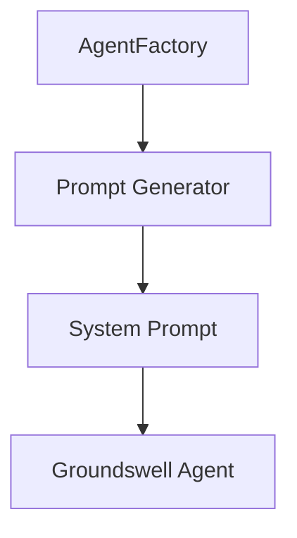

# Product Requirement Prompt (PRP): Create Custom Agent Development Guide

> Transform PRD into working code with complete context, clear objectives, and validation criteria

**Status**: Ready for Implementation
**Last Updated**: 2026-01-23
**Work Item**: P2.M2.T2.S1 - Create custom agent development guide

---

## Goal

**Feature Goal**: Create a comprehensive custom agent development guide (`docs/CUSTOM_AGENTS.md`) that documents how to create new agent types, define agent roles and system prompts, configure model selection and token limits, register custom MCP tools, and add agents to the factory.

**Deliverable**: Documentation file `docs/CUSTOM_AGENTS.md` containing:
- Agent architecture overview (AgentFactory, Groundswell integration, four built-in agents)
- Step-by-step guide for creating new agent types with complete examples
- System prompt engineering patterns and persona definition
- Model selection and token limit configuration guidelines
- Custom MCP tool creation and registration patterns
- Agent factory extension patterns
- Complete SecurityAuditor agent example (from concept to implementation)
- Testing patterns for custom agents
- Integration with PRP Pipeline workflow

**Success Definition**:
- A developer can create a new custom agent type following the guide
- The SecurityAuditor example is complete and can be implemented directly
- All patterns reference actual code from the codebase with file paths
- MCP tool registration is clearly documented with examples
- The guide follows the documentation structure and style of existing docs (ARCHITECTURE.md, WORKFLOWS.md, CLI_REFERENCE.md)
- Code examples are accurate and can be copied directly
- Cross-references link to related documentation appropriately

## User Persona

**Target User**: Developer or contributor who needs to:
- Extend the PRP Pipeline with custom agent types
- Understand the agent factory pattern and agent creation
- Create domain-specific agents (e.g., SecurityAuditor, PerformanceOptimizer)
- Register custom MCP tools with agents
- Integrate new agents into the PRP Pipeline workflow

**Use Case**: User needs to understand:
- How are agents structured in this project?
- How do I create a new agent type like SecurityAuditor?
- How do I define agent personas and system prompts?
- How do I register custom MCP tools?
- How do I add the agent to the factory?
- How do I integrate the agent into the pipeline?

**User Journey**:
1. User opens docs/CUSTOM_AGENTS.md to understand agent development
2. User learns about agent architecture and the four built-in agents
3. User studies the system prompt engineering patterns
4. User understands the agent factory pattern
5. User learns MCP tool creation and registration
6. User reviews the complete SecurityAuditor example
7. User follows step-by-step guide to create their own custom agent
8. User can now create and integrate custom agents effectively

**Pain Points Addressed**:
- "How do I create a new agent type?" - Agent creation step-by-step guide
- "What's the agent factory pattern?" - Agent factory architecture section
- "How do I write an agent persona?" - System prompt engineering section
- "How do I register custom tools?" - MCP tool registration section
- "Is there a complete example?" - SecurityAuditor example section

## Why

- **Extensibility**: Developers need to extend the PRP Pipeline with domain-specific agents
- **Customization**: Different projects require specialized agent personas
- **Tool Integration**: Custom MCP tools enable domain-specific capabilities
- **Knowledge Transfer**: Documents critical IP about agent architecture
- **Documentation Coverage**: Completes P2.M2.T2 (Extensibility Documentation) milestone
- **Parallel Work**: Builds upon docs/ARCHITECTURE.md (multi-agent architecture) and docs/PROMPT_ENGINEERING.md (prompt design) with agent-specific implementation guidance

## What

Create docs/CUSTOM_AGENTS.md with comprehensive custom agent development documentation:

### Success Criteria

- [ ] File created at docs/CUSTOM_AGENTS.md
- [ ] Document header follows pattern (Status, Last Updated, Version, See Also)
- [ ] Table of Contents included with anchor links
- [ ] Agent architecture overview section
- [ ] Four built-in agents reference section
- [ ] System prompt engineering section
- [ ] Model selection and token limits section
- [ ] MCP tool creation and registration section
- [ ] Agent factory extension section
- [ ] Step-by-step custom agent creation guide
- [ ] Complete SecurityAuditor example with code
- [ ] Testing patterns section
- [ ] Cross-references to ARCHITECTURE.md, PROMPT_ENGINEERING.md, and GROUNDSWELL_GUIDE.md
- [ ] See Also section with links to related documentation

---

## All Needed Context

### Context Completeness Check

_If someone knew nothing about this codebase, would they have everything needed to implement this successfully?_

**Yes** - This PRP provides:
- Complete agent-factory.ts implementation with all four personas
- All system prompts from PROMPTS.md and prompts.ts
- MCP tool patterns from bash-mcp.ts, filesystem-mcp.ts, git-mcp.ts
- Prompt generator patterns from architect-prompt.ts and prp-blueprint-prompt.ts
- Groundswell integration patterns (createAgent, createPrompt, MCPHandler)
- Documentation formatting conventions from existing docs
- Complete SecurityAuditor example (from research/security-auditor-example.md)
- External research on agent development best practices (from research/ directory)

### Documentation & References

```yaml
# MUST READ - Agent Factory Implementation
- file: /home/dustin/projects/hacky-hack/src/agents/agent-factory.ts
  why: Complete agent factory pattern with createBaseConfig(), four agent creation functions
  pattern: createBaseConfig() for configuration, create*Agent() functions for each persona
  gotcha: Uses .js extension for ES module imports, configureEnvironment() called at module load

- file: /home/dustin/projects/hacky-hack/src/agents/prompts.ts
  why: All system prompt constants with JSDoc comments
  pattern: TASK_BREAKDOWN_PROMPT, PRP_BLUEPRINT_PROMPT, PRP_BUILDER_PROMPT, BUG_HUNT_PROMPT
  section: Lines 24-980 contain all prompt definitions

# MUST READ - Prompt Generator Implementations
- file: /home/dustin/projects/hacky-hack/src/agents/prompts/architect-prompt.ts
  why: Example prompt generator with createPrompt(), responseFormat, enableReflection
  pattern: createArchitectPrompt() function returning Prompt<Backlog>

- file: /home/dustin/projects/hacky-hack/src/agents/prompts/prp-blueprint-prompt.ts
  why: Complex prompt generator with context extraction and placeholder replacement
  pattern: constructUserPrompt(), extractParentContext(), createPRPBlueprintPrompt()

# MUST READ - MCP Tool Implementations
- file: /home/dustin/projects/hacky-hack/src/tools/bash-mcp.ts
  why: MCP tool pattern with BashMCP extending MCPHandler
  pattern: Tool schema definition, executor function, server registration in constructor

- file: /home/dustin/projects/hacky-hack/src/tools/filesystem-mcp.ts
  why: Multi-tool MCP server with file_read, file_write, glob_files, grep_search
  pattern: Multiple tools registered in one MCPHandler class

- file: /home/dustin/projects/hacky-hack/src/tools/git-mcp.ts
  why: Git operations MCP tool with validation patterns
  pattern: validateRepositoryPath(), tool executors with GitError handling

# MUST READ - Research Documents (External Knowledge)
- docfile: /home/dustin/projects/hacky-hack/plan/003_b3d3efdaf0ed/P2M2T2S1/research/agent-development-best-practices.md
  why: Comprehensive research on agent architecture, persona definition, MCP integration, factory patterns
  section: All sections - use as reference for best practices to include

- docfile: /home/dustin/projects/hacky-hack/plan/003_b3d3efdaf0ed/P2M2T2S1/research/mcp-tool-development.md
  why: MCP tool architecture, schema definition, security patterns, registration
  section: Tool Schema Definition, Tool Registration with Groundswell Agents, Security Considerations

- docfile: /home/dustin/projects/hacky-hack/plan/003_b3d3efdaf0ed/P2M2T2S1/research/security-auditor-example.md
  why: Complete SecurityAuditor agent implementation example
  section: All sections - complete working example to include in documentation

# MUST READ - Groundswell Framework (Parallel Work)
- docfile: /home/dustin/projects/hacky-hack/plan/003_b3d3efdaf0ed/P2M2T1S2/research/groundswell-framework.md
  why: Groundswell createAgent() API, createPrompt() usage, MCPHandler extension
  section: Agent Creation, Prompt Creation, MCP Tool Registration

# MUST READ - Documentation Conventions
- file: /home/dustin/projects/hacky-hack/docs/ARCHITECTURE.md
  why: Follow this structure and style (header, TOC, section formatting, code examples)
  pattern: Status block, Table of Contents, section headers with anchor links, See Also section

- file: /home/dustin/projects/hacky-hack/docs/PROMPT_ENGINEERING.md
  why: Reference for prompt engineering patterns (being created in parallel P2.M2.T1.S3)
  gotcha: Reference this doc for prompt design, focus CUSTOM_AGENTS.md on agent implementation

- file: /home/dustin/projects/hacky-hack/docs/WORKFLOWS.md
  why: Follow documentation style for technical guides
  pattern: Overview sections, code examples, table formatting, cross-references

# EXTERNAL RESOURCES - Use for reference only, do not copy
- url: https://docs.anthropic.com/claude/docs/prompt-engineering
  why: Anthropic's official prompt engineering guide for industry best practices
  section: System prompts, role definition

- url: ~/projects/groundswell/docs/agent.md
  why: Groundswell agent creation documentation
  section: createAgent(), tool registration
```

### Current Codebase Tree (Agent-Related Files)

```bash
src/agents/
├── agent-factory.ts                    # Agent creation factory
├── prompts.ts                          # All system prompt constants
├── prompts/
│   ├── index.ts                        # Prompt re-exports
│   ├── architect-prompt.ts             # Task Breakdown prompt generator
│   ├── prp-blueprint-prompt.ts         # PRP Creation prompt generator
│   ├── bug-hunt-prompt.ts              # Bug Finding prompt generator
│   └── delta-analysis-prompt.ts        # Delta Analysis prompt generator
├── prp-generator.ts                    # Researcher agent using PRP_BLUEPRINT_PROMPT
├── prp-runtime.ts                      # Coder agent using PRP_BUILDER_PROMPT
└── prp-executor.ts                     # PRP execution workflow

src/tools/
├── bash-mcp.ts                         # Bash command execution tool
├── filesystem-mcp.ts                   # File system operations tool
└── git-mcp.ts                          # Git operations tool

docs/
├── ARCHITECTURE.md                     # Multi-agent architecture overview (P2.M2.T1.S1)
├── PROMPT_ENGINEERING.md               # Agent prompt engineering guide (P2.M2.T1.S3) - being created in parallel
├── WORKFLOWS.md                        # Workflow documentation
└── CLI_REFERENCE.md                    # CLI reference documentation

PROMPTS.md                              # Original source document for all prompts
```

### Desired Codebase Tree

```bash
docs/
├── ARCHITECTURE.md                     # Multi-agent architecture overview (P2.M2.T1.S1) - Existing
├── PROMPT_ENGINEERING.md               # Agent prompt engineering guide (P2.M2.T1.S3) - Being created in parallel
├── CUSTOM_AGENTS.md                    # Custom agent development guide (P2.M2.T2.S1) - TO BE CREATED
├── WORKFLOWS.md                        # Workflow documentation - Existing
└── CLI_REFERENCE.md                    # CLI reference documentation - Existing
```

### Known Gotchas of Our Codebase & Library Quirks

```typescript
// CRITICAL: Groundswell's createAgent() requires specific configuration shape
// The config must include: name, system, model, enableCache, enableReflection, maxTokens, mcps

// CRITICAL: Prompts are defined in PROMPTS.md as markdown, then exported as TypeScript string constants in src/agents/prompts.ts
// When updating prompts, edit PROMPTS.md first, then copy to src/agents/prompts.ts

// GOTCHA: Use .js extension for ES module imports in TypeScript (e.g., './prompts.js')
// This is required for ES module compatibility

// GOTCHA: Agent personas use PascalCase naming: "ArchitectAgent", "ResearcherAgent", etc.
// Token limits: architect=8192, researcher/coder/qa=4096

// PATTERN: All MCP tools extend MCPHandler and register in constructor
// Tools use 'server__tool' naming convention for registration

// CRITICAL: configureEnvironment() is called at module load time in agent-factory.ts
// This must execute before any agent creation

// PATTERN: All prompt generators follow this structure:
// 1. Import createPrompt and Prompt from 'groundswell'
// 2. Import the system prompt constant from '../prompts.js'
// 3. Define a constructUserPrompt() function to build dynamic content
// 4. Export a create{Agent}Prompt() function that returns Prompt<OutputType>

// CRITICAL: MCP tool schemas use JSON Schema format for input validation
// The input_schema is passed to Groundswell for type-safe tool execution
```

---

## Implementation Blueprint

### Data Models and Structure

No data models needed - this is a documentation-only task. The documentation structure should follow:

```markdown
# Custom Agent Development Guide

> Brief description

**Status**: Published
**Last Updated**: [date]
**Version**: 1.0.0

## Table of Contents

- [Overview](#overview)
- [Agent Architecture](#agent-architecture)
- [Four Built-in Agents](#four-built-in-agents)
- [System Prompt Engineering](#system-prompt-engineering)
- [Model Selection and Token Limits](#model-selection-and-token-limits)
- [MCP Tool Creation and Registration](#mcp-tool-creation-and-registration)
- [Agent Factory Extension](#agent-factory-extension)
- [Step-by-Step Guide](#step-by-step-guide)
- [Complete Example: SecurityAuditor](#complete-example-securityauditor)
- [Testing Custom Agents](#testing-custom-agents)
- [See Also](#see-also)
```

### Implementation Tasks (Ordered by Dependencies)

```yaml
Task 1: CREATE docs/CUSTOM_AGENTS.md with header and structure
  - IMPLEMENT: File header with Status, Last Updated, Version
  - IMPLEMENT: Table of Contents with anchor links
  - IMPLEMENT: Overview section explaining custom agent development
  - FOLLOW pattern: docs/ARCHITECTURE.md (header format, TOC style)
  - NAMING: CUSTOM_AGENTS.md (all caps, underscore separator)
  - PLACEMENT: docs/ directory alongside other documentation

Task 2: WRITE "Agent Architecture" section
  - IMPLEMENT: AgentFactory pattern explanation with code reference
  - IMPLEMENT: Groundswell integration overview (createAgent, createPrompt, MCPHandler)
  - IMPLEMENT: Four-tier architecture (Factory → Generator → Prompt → Agent)
  - IMPLEMENT: Component diagram showing relationships
  - FOLLOW pattern: research/agent-development-best-practices.md section 1
  - CODE EXAMPLE: Use agent-factory.ts lines 150-204 (createBaseConfig, createArchitectAgent)
  - PLACEMENT: After Table of Contents

Task 3: WRITE "Four Built-in Agents" section
  - IMPLEMENT: Reference table for all four agents (Architect, Researcher, Coder, QA)
  - IMPLEMENT: Agent persona descriptions with use cases
  - IMPLEMENT: Token limits and model selection for each
  - IMPLEMENT: System prompt references to PROMPTS.md
  - FOLLOW pattern: docs/ARCHITECTURE.md "Multi-Agent Architecture" section
  - CODE EXAMPLE: Use agent-factory.ts lines 195-291 (all four create*Agent functions)
  - PLACEMENT: After Agent Architecture section

Task 4: WRITE "System Prompt Engineering" section
  - IMPLEMENT: Prompt structure components (role, context, goals, constraints, output)
  - IMPLEMENT: Persona definition patterns with examples
  - IMPLEMENT: System prompt creation workflow (PROMPTS.md → prompts.ts)
  - IMPLEMENT: Cross-reference to PROMPT_ENGINEERING.md for detailed prompt design
  - FOLLOW pattern: research/agent-development-best-practices.md section 2
  - CODE EXAMPLE: Use prompts.ts lines 24-146 (TASK_BREAKDOWN_PROMPT structure)
  - PLACEMENT: After Four Built-in Agents section

Task 5: WRITE "Model Selection and Token Limits" section
  - IMPLEMENT: Model tier explanation (sonnet → GLM-4.7)
  - IMPLEMENT: Token limit guidelines with decision matrix
  - IMPLEMENT: PERSONA_TOKEN_LIMITS constant explanation
  - IMPLEMENT: Guidelines for choosing token limits for new agents
  - FOLLOW pattern: research/agent-development-best-practices.md section 2.3
  - CODE EXAMPLE: Use agent-factory.ts lines 118-123 (PERSONA_TOKEN_LIMITS)
  - PLACEMENT: After System Prompt Engineering section

Task 6: WRITE "MCP Tool Creation and Registration" section
  - IMPLEMENT: MCP tool architecture overview (Tool, Executor, Server)
  - IMPLEMENT: Step-by-step tool creation guide
  - IMPLEMENT: Tool schema definition patterns with JSON Schema examples
  - IMPLEMENT: Tool executor patterns with error handling
  - IMPLEMENT: MCPHandler extension pattern
  - IMPLEMENT: Security considerations (path traversal, injection prevention)
  - FOLLOW pattern: research/mcp-tool-development.md
  - CODE EXAMPLE: Use bash-mcp.ts (complete tool implementation), filesystem-mcp.ts (multi-tool server)
  - PLACEMENT: After Model Selection section

Task 7: WRITE "Agent Factory Extension" section
  - IMPLEMENT: How to extend agent-factory.ts with new agent types
  - IMPLEMENT: createBaseConfig() usage explanation
  - IMPLEMENT: Persona type extension (AgentPersona type)
  - IMPLEMENT: MCP tool integration with new agents
  - IMPLEMENT: Export patterns and module re-exports
  - FOLLOW pattern: agent-factory.ts (factory function pattern)
  - CODE EXAMPLE: Use agent-factory.ts lines 223-235 (createResearcherAgent as template)
  - PLACEMENT: After MCP Tool Creation section

Task 8: WRITE "Step-by-Step Guide" section
  - IMPLEMENT: 7-step process for creating custom agents
  - IMPLEMENT: Step 1: Define agent persona and type
  - IMPLEMENT: Step 2: Create system prompt in PROMPTS.md
  - IMPLEMENT: Step 3: Export prompt in src/agents/prompts.ts
  - IMPLEMENT: Step 4: Create prompt generator (optional)
  - IMPLEMENT: Step 5: Create MCP tools (if needed)
  - IMPLEMENT: Step 6: Add agent creation function to agent-factory.ts
  - IMPLEMENT: Step 7: Use the agent in code or workflow
  - IMPLEMENT: For each step: include code example, file location, gotchas
  - FOLLOW pattern: research/agent-development-best-practices.md section 2
  - PLACEMENT: After Agent Factory Extension section

Task 9: WRITE "Complete Example: SecurityAuditor" section
  - IMPLEMENT: Complete SecurityAuditor agent implementation
  - IMPLEMENT: System prompt (SECURITY_AUDIT_PROMPT)
  - IMPLEMENT: Prompt generator (createSecurityAuditPrompt)
  - IMPLEMENT: MCP tool (SecurityScannerMCP with 5 tools)
  - IMPLEMENT: Agent factory function (createSecurityAuditorAgent)
  - IMPLEMENT: Integration instructions
  - IMPLEMENT: Usage examples
  - USE COMPLETE EXAMPLE: research/security-auditor-example.md
  - REFERENCE: All code examples are production-ready
  - PLACEMENT: After Step-by-Step Guide section

Task 10: WRITE "Testing Custom Agents" section
  - IMPLEMENT: Unit testing patterns for agent factories
  - IMPLEMENT: Integration testing for agent workflows
  - IMPLEMENT: MCP tool testing patterns
  - IMPLEMENT: Test example with Vitest
  - FOLLOW pattern: research/agent-development-best-practices.md section 5
  - CODE EXAMPLE: Create test example following research patterns
  - PLACEMENT: After SecurityAuditor Example section

Task 11: WRITE "See Also" section
  - IMPLEMENT: Links to ARCHITECTURE.md (multi-agent architecture)
  - IMPLEMENT: Links to PROMPT_ENGINEERING.md (prompt design guide)
  - IMPLEMENT: Links to GROUNDSWELL_GUIDE.md (Groundswell integration)
  - IMPLEMENT: Links to WORKFLOWS.md (workflow orchestration)
  - IMPLEMENT: Links to source code (agent-factory.ts, prompts.ts, tools/)
  - IMPLEMENT: Links to external resources
  - FOLLOW pattern: docs/ARCHITECTURE.md See Also section
  - PLACEMENT: End of document

Task 12: VALIDATE documentation quality
  - VERIFY: All code examples are accurate and can be copied
  - VERIFY: All links work (TOC anchors, cross-references, external URLs)
  - VERIFY: Document follows existing doc conventions
  - VERIFY: Content is complete and actionable
  - VERIFY: Parallel work items (PROMPT_ENGINEERING.md, GROUNDSWELL_GUIDE.md) are referenced appropriately
  - VERIFY: SecurityAuditor example is complete and production-ready
```

### Implementation Patterns & Key Details

```markdown
# Documentation Style Guidelines (follow existing patterns)

# Header Pattern
> Brief one-sentence description

**Status**: Published
**Last Updated**: 2026-01-23
**Version**: 1.0.0

# Section Headers
## Section Name
### Subsection Name

# Code Examples
```typescript
// Include file path comment
// src/agents/agent-factory.ts

export function createArchitectAgent(): Agent {
  const baseConfig = createBaseConfig('architect');
  const config = {
    ...baseConfig,
    system: TASK_BREAKDOWN_PROMPT,
    mcps: MCP_TOOLS,
  };
  return createAgent(config);
}
```

# Cross-References
See [Agent Factory](../src/agents/agent-factory.ts) for implementation details.
See [Prompt Engineering Guide](./PROMPT_ENGINEERING.md) for prompt design patterns.

# Tables
| Agent | System Prompt | Token Limit | Purpose |
|-------|--------------|-------------|---------|
| Architect | TASK_BREAKDOWN_PROMPT | 8192 | PRD analysis |

# Diagrams (Mermaid)


# Callouts
> **Note**: Critical information uses blockquote format.

**CRITICAL**: Use emphasis for critical implementation details.

**GOTCHA**: Highlight common pitfalls.

**PATTERN**: Show repeating patterns in code.

# External Links
[Groundswell Framework](https://github.com/anthropics/groundswell)
```

### Integration Points

```yaml
DOCUMENTATION:
  - add to: docs/CUSTOM_AGENTS.md
  - reference: docs/ARCHITECTURE.md (multi-agent overview)
  - reference: docs/PROMPT_ENGINEERING.md (prompt design guide) - being created in parallel
  - reference: docs/GROUNDSWELL_GUIDE.md (Groundswell integration) - being created in parallel
  - reference: docs/WORKFLOWS.md (workflow orchestration)

CROSS-REFERENCES:
  - Link to src/agents/agent-factory.ts for factory pattern
  - Link to src/agents/prompts.ts for system prompts
  - Link to src/agents/prompts/*.ts for generator implementations
  - Link to src/tools/*.ts for MCP tool patterns
  - Link to PROMPTS.md for original prompt definitions
  - Link to research/ directory for best practices

PARALLEL WORK CONSIDERATIONS:
  - PROMPT_ENGINEERING.md (P2.M2.T1.S3) covers prompt design patterns
  - CUSTOM_AGENTS.md should reference PROMPT_ENGINEERING.md for prompt details
  - Focus CUSTOM_AGENTS.md on agent implementation, not prompt design
  - Avoid duplicating prompt engineering content
```

---

## Validation Loop

### Level 1: Syntax & Style (Immediate Feedback)

```bash
# No code to validate - documentation only
# Verify file was created
test -f docs/CUSTOM_AGENTS.md && echo "File exists" || echo "File not found"

# Check markdown syntax (if tools available)
npx markdownlint docs/CUSTOM_AGENTS.md 2>/dev/null || echo "markdownlint not available"

# Expected: File exists, no critical markdown syntax errors
```

### Level 2: Content Validation (Completeness Check)

```bash
# Verify all required sections exist
grep -q "## Agent Architecture" docs/CUSTOM_AGENTS.md && echo "Section 1 OK" || echo "Missing Section 1"
grep -q "## Four Built-in Agents" docs/CUSTOM_AGENTS.md && echo "Section 2 OK" || echo "Missing Section 2"
grep -q "## System Prompt Engineering" docs/CUSTOM_AGENTS.md && echo "Section 3 OK" || echo "Missing Section 3"
grep -q "## Model Selection and Token Limits" docs/CUSTOM_AGENTS.md && echo "Section 4 OK" || echo "Missing Section 4"
grep -q "## MCP Tool Creation and Registration" docs/CUSTOM_AGENTS.md && echo "Section 5 OK" || echo "Missing Section 5"
grep -q "## Agent Factory Extension" docs/CUSTOM_AGENTS.md && echo "Section 6 OK" || echo "Missing Section 6"
grep -q "## Step-by-Step Guide" docs/CUSTOM_AGENTS.md && echo "Section 7 OK" || echo "Missing Section 7"
grep -q "## Complete Example: SecurityAuditor" docs/CUSTOM_AGENTS.md && echo "Section 8 OK" || echo "Missing Section 8"
grep -q "## Testing Custom Agents" docs/CUSTOM_AGENTS.md && echo "Section 9 OK" || echo "Missing Section 9"
grep -q "## See Also" docs/CUSTOM_AGENTS.md && echo "See Also OK" || echo "Missing See Also"

# Verify SecurityAuditor example is complete
grep -q "SECURITY_AUDIT_PROMPT" docs/CUSTOM_AGENTS.md && echo "SecurityAuditor prompt OK" || echo "Missing prompt"
grep -q "SecurityScannerMCP" docs/CUSTOM_AGENTS.md && echo "SecurityAuditor MCP OK" || echo "Missing MCP"
grep -q "createSecurityAuditorAgent" docs/CUSTOM_AGENTS.md && echo "SecurityAuditor factory OK" || echo "Missing factory"

# Verify cross-references to parallel work
grep -q "PROMPT_ENGINEERING.md" docs/CUSTOM_AGENTS.md && echo "PROMPT_ENGINEERING ref OK" || echo "Missing PROMPT_ENGINEERING ref"
grep -q "GROUNDSWELL_GUIDE.md" docs/CUSTOM_AGENTS.md && echo "GROUNDSWELL_GUIDE ref OK" || echo "Missing GROUNDSWELL_GUIDE ref"

# Expected: All sections present, SecurityAuditor example complete, cross-references included
```

### Level 3: Link Validation (Reference Check)

```bash
# Check TOC anchor links work (manual verification required)
echo "Manual check: Click each TOC link and verify it navigates correctly"

# Check cross-references to existing files
grep -q "src/agents/agent-factory.ts" docs/CUSTOM_AGENTS.md && echo "agent-factory ref OK" || echo "Missing agent-factory ref"
grep -q "ARCHITECTURE.md" docs/CUSTOM_AGENTS.md && echo "ARCHITECTURE ref OK" || echo "Missing ARCHITECTURE ref"
grep -q "WORKFLOWS.md" docs/CUSTOM_AGENTS.md && echo "WORKFLOWS ref OK" || echo "Missing WORKFLOWS ref"

# Check code examples reference actual files
echo "Manual check: Verify code examples match actual source files"

# Check research file references
grep -q "research/agent-development-best-practices.md" docs/CUSTOM_AGENTS.md && echo "research ref OK" || echo "Missing research ref"

# Expected: All references point to valid files
```

### Level 4: Documentation Quality (Manual Review)

```bash
# Manual validation checklist
echo "Manual Validation Checklist:"
echo "1. Read the document start to finish - does it make sense?"
echo "2. Check code examples against source files - are they accurate?"
echo "3. Verify TOC links work - do they navigate correctly?"
echo "4. Check cross-references - do they point to valid locations?"
echo "5. Verify external links - do they work?"
echo "6. Compare to existing docs style - is it consistent?"
echo "7. Ask: Can a new developer create a custom agent from this guide?"
echo "8. Verify SecurityAuditor example is complete and working"
echo "9. Check that MCP tool registration is clearly explained"
echo "10. Verify step-by-step guide is actionable and complete"

# Expected: All manual checks pass
```

---

## Final Validation Checklist

### Technical Validation

- [ ] File created at docs/CUSTOM_AGENTS.md
- [ ] Document header follows pattern (Status, Last Updated, Version)
- [ ] Table of Contents included with anchor links
- [ ] All required sections present (9 main sections + See Also)
- [ ] No markdown syntax errors

### Content Validation

- [ ] Agent architecture explained clearly
- [ ] Four built-in agents documented with references
- [ ] System prompt engineering patterns documented
- [ ] Model selection and token limits explained
- [ ] MCP tool creation and registration documented
- [ ] Agent factory extension patterns explained
- [ ] Step-by-step guide is actionable
- [ ] SecurityAuditor example is complete with all code

### Code Quality Validation

- [ ] All code examples are accurate (verified against source files)
- [ ] Code examples include file path references
- [ ] Code examples use proper syntax highlighting
- [ ] TypeScript examples follow codebase conventions
- [ ] SecurityAuditor example is production-ready

### Documentation & Deployment

- [ ] Follows existing documentation style (ARCHITECTURE.md, WORKFLOWS.md)
- [ ] Cross-references link to valid locations
- [ ] External links work (test them)
- [ ] See Also section includes all related docs
- [ ] Parallel work items (PROMPT_ENGINEERING.md, GROUNDSWELL_GUIDE.md) referenced appropriately
- [ ] Research documents referenced with context

---

## Anti-Patterns to Avoid

- Don't duplicate prompt engineering content - reference PROMPT_ENGINEERING.md instead
- Don't duplicate Groundswell framework docs - reference GROUNDSWELL_GUIDE.md instead
- Don't include incomplete code examples - verify all examples work
- Don't skip the SecurityAuditor example - it's the primary reference implementation
- Don't forget MCP tool registration - it's critical for custom agents
- Don't use generic examples - use real examples from the codebase
- Don't make the document too long - be comprehensive but concise
- Don't use external links as primary content - reference them for additional reading
- Don't forget cross-references - link to related documentation
- Don't ignore testing - include testing patterns for custom agents
