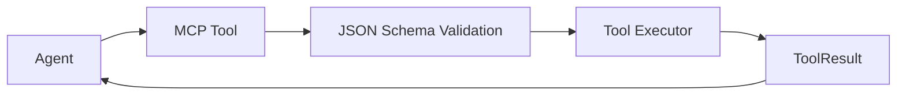

# Product Requirement Prompt (PRP): Create Custom MCP Tool Development Guide

> Transform PRD into working code with complete context, clear objectives, and validation criteria

**Status**: Ready for Implementation
**Last Updated**: 2026-01-23
**Work Item**: P2.M2.T2.S2 - Create custom MCP tool development guide

---

## Goal

**Feature Goal**: Create a comprehensive custom MCP tool development guide (`docs/CUSTOM_TOOLS.md`) that documents the Model Context Protocol (MCP) basics, how to implement the MCPServer interface using Groundswell's MCPHandler, defining tool schemas with JSON Schema, writing tool executors, error handling and return values, and registering tools with agents. Include a complete example of adding a 'DockerMCP' tool.

**Deliverable**: Documentation file `docs/CUSTOM_TOOLS.md` containing:

- MCP protocol basics (what is MCP, tools, resources, prompts)
- MCPServer interface implementation with Groundswell's MCPHandler
- Tool schema definition patterns with JSON Schema examples
- Tool executor implementation patterns with error handling
- Return value formats and success/error structures
- Tool registration with Groundswell agents
- Complete DockerMCP example with 5 tools (container_ps, container_logs, container_exec, image_build, image_rm)
- Testing patterns for custom MCP tools
- Cross-references to existing tool implementations

**Success Definition**:

- A developer can create a new custom MCP tool following the guide
- The DockerMCP example is complete and can be implemented directly
- All patterns reference actual code from the codebase with file paths
- Tool registration with agents is clearly documented
- The guide follows the documentation structure and style of existing docs (ARCHITECTURE.md, WORKFLOWS.md, CLI_REFERENCE.md)
- Code examples are accurate and can be copied directly
- Cross-references link to related documentation appropriately

## User Persona

**Target User**: Developer or contributor who needs to:

- Extend the PRP Pipeline with custom MCP tools
- Understand the MCP protocol and tool development
- Create domain-specific tools (e.g., DockerMCP, DatabaseMCP, APIMCP)
- Register custom MCP tools with Groundswell agents
- Integrate new tools into the PRP Pipeline workflow

**Use Case**: User needs to understand:

- What is the Model Context Protocol (MCP)?
- How do MCP tools work in this codebase?
- How do I implement the MCPServer interface?
- How do I define tool schemas with JSON Schema?
- How do I write tool executors with proper error handling?
- How do I register tools with Groundswell agents?
- Is there a complete example I can follow?

**User Journey**:

1. User opens docs/CUSTOM_TOOLS.md to understand MCP tool development
2. User learns about MCP protocol basics (tools, resources, prompts)
3. User understands the Groundswell MCPHandler pattern
4. User studies tool schema definition with JSON Schema
5. User learns tool executor implementation patterns
6. User reviews the complete DockerMCP example
7. User follows step-by-step guide to create their own custom tool
8. User can now create and integrate custom MCP tools effectively

**Pain Points Addressed**:

- "What is MCP and how does it work?" - MCP protocol basics section
- "How do I create a custom tool?" - Step-by-step implementation guide
- "How do I define tool schemas?" - JSON Schema examples and patterns
- "How do I handle errors properly?" - Error handling patterns section
- "How do I register tools with agents?" - Agent integration section
- "Is there a complete example?" - DockerMCP example section

## Why

- **Extensibility**: Developers need to extend the PRP Pipeline with domain-specific MCP tools
- **Customization**: Different projects require specialized tool capabilities
- **Knowledge Transfer**: Documents critical IP about MCP tool architecture
- **Documentation Coverage**: Completes P2.M2.T2 (Extensibility Documentation) milestone
- **Parallel Work**: Builds upon docs/ARCHITECTURE.md (multi-agent architecture) and docs/CUSTOM_AGENTS.md (agent development) with MCP tool-specific implementation guidance

## What

Create docs/CUSTOM_TOOLS.md with comprehensive custom MCP tool development documentation:

### Success Criteria

- [ ] File created at docs/CUSTOM_TOOLS.md
- [ ] Document header follows pattern (Status, Last Updated, Version, See Also)
- [ ] Table of Contents included with anchor links
- [ ] MCP protocol basics section (what is MCP, tools, resources, prompts)
- [ ] MCPServer interface implementation section
- [ ] Tool schema definition section with JSON Schema examples
- [ ] Tool executor patterns section
- [ ] Error handling and return values section
- [ ] Tool registration with agents section
- [ ] Complete DockerMCP example with 5 tools
- [ ] Testing patterns section
- [ ] Cross-references to ARCHITECTURE.md, CUSTOM_AGENTS.md, and source code
- [ ] See Also section with links to related documentation

---

## All Needed Context

### Context Completeness Check

_If someone knew nothing about this codebase, would they have everything needed to implement this successfully?_

**Yes** - This PRP provides:

- Complete MCP tool implementations (bash-mcp.ts, filesystem-mcp.ts, git-mcp.ts)
- MCPHandler usage patterns from Groundswell framework
- Agent factory integration patterns
- Documentation formatting conventions from existing docs
- Complete DockerMCP example with all code
- External research on MCP protocol and best practices
- Testing patterns from existing unit tests

### Documentation & References

```yaml
# MUST READ - MCP Tool Implementations
- file: /home/dustin/projects/hacky-hack/src/tools/bash-mcp.ts
  why: Complete MCP tool pattern with single tool (execute_bash)
  pattern: Tool schema definition, executor function, server registration
  gotcha: Uses spawn() with argument arrays to prevent shell injection, timeout protection with SIGTERM/SIGKILL

- file: /home/dustin/projects/hacky-hack/src/tools/filesystem-mcp.ts
  why: Multi-tool MCP server with 4 tools (file_read, file_write, glob_files, grep_search)
  pattern: Multiple tools registered in one MCPHandler class, path validation, error code handling
  gotcha: Uses fast-glob for efficient pattern matching, specific errno handling (ENOENT, EACCES, EISDIR)

- file: /home/dustin/projects/hacky-hack/src/tools/git-mcp.ts
  why: Git operations MCP tool with validation patterns
  pattern: Repository validation, GitError handling, flag injection prevention
  gotcha: Uses '--' separator to prevent flag injection in git add

# MUST READ - Agent Factory Integration
- file: /home/dustin/projects/hacky-hack/src/agents/agent-factory.ts
  why: Shows how MCP tools are registered with Groundswell agents
  pattern: Singleton MCP instances, MCP_TOOLS array passed to createAgent()
  section: Lines 48-68 (MCP server instances and tools array)

# MUST READ - Research Documents (External Knowledge)
- docfile: /home/dustin/projects/hacky-hack/plan/003_b3d3efdaf0ed/P2M2T2S2/research/mcp-protocol-research.md
  why: MCP official documentation, protocol basics, JSON Schema format
  section: All sections - use as reference for MCP concepts

- docfile: /home/dustin/projects/hacky-hack/plan/003_b3d3efdaf0ed/P2M2T2S2/research/codebase-patterns-research.md
  why: Existing tool patterns, security considerations, testing patterns
  section: All sections - use as reference for patterns to document

- docfile: /home/dustin/projects/hacky-hack/plan/003_b3d3efdaf0ed/P2M2T2S1/research/mcp-tool-development.md
  why: Comprehensive 1700+ line MCP tool development guide with all patterns
  section: All sections - use as primary reference for tool development patterns

# MUST READ - Documentation Conventions
- file: /home/dustin/projects/hacky-hack/docs/ARCHITECTURE.md
  why: Follow this structure and style (header, TOC, section formatting, code examples)
  pattern: Status block, Table of Contents, section headers with anchor links, See Also section

- file: /home/dustin/projects/hacky-hack/docs/WORKFLOWS.md
  why: Follow documentation style for technical guides
  pattern: Overview sections, code examples, table formatting, cross-references

- file: /home/dustin/projects/hacky-hack/docs/CLI_REFERENCE.md
  why: Reference for table formatting and structured documentation
  pattern: Tables for reference information, code examples with syntax highlighting

# MUST READ - Parallel Work (CUSTOM_AGENTS.md)
- docfile: /home/dustin/projects/hacky-hack/plan/003_b3d3efdaf0ed/P2M2T2S1/PRP.md
  why: Previous work item creating CUSTOM_AGENTS.md - reference for style and MCP tool registration section
  section: "MCP Tool Creation and Registration" section in IMPLEMENTATION TASKS

# EXTERNAL RESOURCES - Use for reference only, do not copy
- url: https://spec.modelcontextprotocol.io/specification/
  why: Official MCP specification documentation
  section: Core protocol, tools, resources, prompts

- url: https://spec.modelcontextprotocol.io/specification/tools/
  why: Official MCP tools guide with JSON Schema format
  section: Tool schema definition, input validation

- url: https://github.com/modelcontextprotocol/typescript-sdk
  why: Official TypeScript SDK for MCP
  section: ToolExecutor type, server registration

- url: https://github.com/modelcontextprotocol/servers
  why: Official MCP server implementations
  section: Reference examples for common tool patterns
```

### Current Codebase Tree (MCP-Related Files)

```bash
src/tools/
├── bash-mcp.ts                    # Bash command execution tool (1 tool)
├── filesystem-mcp.ts              # File system operations (4 tools)
└── git-mcp.ts                     # Git version control operations (4 tools)

src/agents/
└── agent-factory.ts               # Agent factory with MCP tool registration

tests/unit/tools/
├── bash-mcp.test.ts               # Bash tool unit tests
├── filesystem-mcp.test.ts         # Filesystem tool unit tests
└── git-mcp.test.ts                # Git tool unit tests

docs/
├── ARCHITECTURE.md                # Multi-agent architecture overview
├── WORKFLOWS.md                   # Workflow documentation
├── CLI_REFERENCE.md               # CLI reference documentation
└── CUSTOM_AGENTS.md               # Custom agent development guide (P2.M2.T2.S1) - being created in parallel
```

### Desired Codebase Tree

```bash
docs/
├── ARCHITECTURE.md                # Multi-agent architecture overview - Existing
├── WORKFLOWS.md                   # Workflow documentation - Existing
├── CLI_REFERENCE.md               # CLI reference documentation - Existing
├── CUSTOM_AGENTS.md               # Custom agent development guide - Being created in parallel (P2.M2.T2.S1)
└── CUSTOM_TOOLS.md                # Custom MCP tool development guide - TO BE CREATED (P2.M2.T2.S2)
```

### Known Gotchas of Our Codebase & Library Quirks

```typescript
// CRITICAL: Groundswell uses custom MCPHandler, NOT FastMCP
// Import from 'groundswell' package, not 'fastmcp' or '@modelcontextprotocol/sdk'
import { MCPHandler, type Tool, type ToolExecutor } from 'groundswell';

// GOTCHA: Use .js extension for ES module imports in TypeScript
// This is required for ES module compatibility
import { BashMCP } from '../tools/bash-mcp.js';

// PATTERN: All MCP tools extend MCPHandler and register in constructor
// Tools use 'server__tool' naming convention (automatic prefix)
// Example: tool name 'file_read' + server 'filesystem' = 'filesystem__file_read'

// CRITICAL: Tool executor must be cast to ToolExecutor when registering
this.registerToolExecutor('server', 'tool_name', executor as ToolExecutor);

// PATTERN: All tool schemas use JSON Schema format for input validation
// TypeScript interfaces provide type safety but don't validate at runtime

// CRITICAL: Use 'inprocess' transport for local MCP tools
public readonly transport = 'inprocess' as const;

// SECURITY: Always use spawn() with argument arrays and shell: false
// This prevents command injection attacks
spawn('git', ['commit', '-m', message], { shell: false });

// SECURITY: Use '--' separator for git commands to prevent flag injection
await git.add(['--', ...files]);

// PATTERN: All tools return structured results with success: boolean
interface ToolResult {
  success: boolean;
  error?: string;
  // ... result-specific properties
}

// GOTCHA: Error codes from Node.js are accessed via (error as NodeJS.ErrnoException).code
// Common codes: ENOENT (not found), EACCES (permission denied), EISDIR (is directory)

// PATTERN: Singleton MCP instances are shared across all agents
// Don't create new instances for each agent - use shared MCP_TOOLS array
```

---

## Implementation Blueprint

### Data Models and Structure

No data models needed - this is a documentation-only task. The documentation structure should follow:

```markdown
# Custom MCP Tool Development Guide

> Brief description

**Status**: Published
**Last Updated**: [date]
**Version**: 1.0.0

## Table of Contents

- [Overview](#overview)
- [MCP Protocol Basics](#mcp-protocol-basics)
- [Groundswell MCPHandler Integration](#groundswell-mcp-handler-integration)
- [Tool Schema Definition](#tool-schema-definition)
- [Tool Executor Implementation](#tool-executor-implementation)
- [Error Handling and Return Values](#error-handling-and-return-values)
- [Tool Registration with Agents](#tool-registration-with-agents)
- [Step-by-Step Guide](#step-by-step-guide)
- [Complete Example: DockerMCP](#complete-example-dockermcp)
- [Testing Custom Tools](#testing-custom-tools)
- [See Also](#see-also)
```

### Implementation Tasks (Ordered by Dependencies)

```yaml
Task 1: CREATE docs/CUSTOM_TOOLS.md with header and structure
  - IMPLEMENT: File header with Status, Last Updated, Version
  - IMPLEMENT: Table of Contents with anchor links
  - IMPLEMENT: Overview section explaining MCP tool development
  - FOLLOW pattern: docs/ARCHITECTURE.md (header format, TOC style)
  - NAMING: CUSTOM_TOOLS.md (all caps, underscore separator)
  - PLACEMENT: docs/ directory alongside other documentation

Task 2: WRITE "MCP Protocol Basics" section
  - IMPLEMENT: What is MCP explanation (Model Context Protocol overview)
  - IMPLEMENT: MCP components (Tools, Resources, Prompts)
  - IMPLEMENT: How MCP tools work (request/response flow)
  - IMPLEMENT: JSON Schema for input validation
  - FOLLOW pattern: research/mcp-protocol-research.md section 1
  - DIAGRAM: Include flow diagram of tool execution
  - PLACEMENT: After Table of Contents

Task 3: WRITE "Groundswell MCPHandler Integration" section
  - IMPLEMENT: MCPHandler class overview
  - IMPLEMENT: MCPServer interface (name, transport, tools)
  - IMPLEMENT: Difference from standard FastMCP
  - IMPLEMENT: Transport types (inprocess, stdio, http)
  - IMPLEMENT: Tool naming convention (server__tool prefix)
  - FOLLOW pattern: research/codebase-patterns-research.md "MCPHandler Pattern"
  - CODE EXAMPLE: Use agent-factory.ts lines 48-68 (MCP_TOOLS pattern)
  - PLACEMENT: After MCP Protocol Basics section

Task 4: WRITE "Tool Schema Definition" section
  - IMPLEMENT: Tool schema structure (name, description, input_schema)
  - IMPLEMENT: JSON Schema type examples (string, number, boolean, array, object)
  - IMPLEMENT: Input validation patterns (required fields, enums, ranges)
  - IMPLEMENT: TypeScript interface pattern for type safety
  - FOLLOW pattern: research/mcp-protocol-research.md "Tool Schema Format"
  - CODE EXAMPLE: Use bash-mcp.ts lines 82-108 (execute_bash schema)
  - PLACEMENT: After Groundswell Integration section

Task 5: WRITE "Tool Executor Implementation" section
  - IMPLEMENT: ToolExecutor type definition
  - IMPLEMENT: Executor function pattern (validate, execute, return)
  - IMPLEMENT: Async/await patterns
  - IMPLEMENT: External dependency handling (fs, child_process, simple-git)
  - FOLLOW pattern: research/codebase-patterns-research.md "Tool Executor Pattern"
  - CODE EXAMPLE: Use filesystem-mcp.ts lines 296-326 (readFile executor)
  - PLACEMENT: After Tool Schema Definition section

Task 6: WRITE "Error Handling and Return Values" section
  - IMPLEMENT: Standard result structure (success, error, data)
  - IMPLEMENT: Try-catch patterns with specific error codes
  - IMPLEMENT: Node.js error code handling (ENOENT, EACCES, EISDIR)
  - IMPLEMENT: Error message best practices (specific, actionable)
  - IMPLEMENT: Early validation patterns for better UX
  - FOLLOW pattern: research/codebase-patterns-research.md "Error Handling Pattern"
  - CODE EXAMPLE: Use git-mcp.ts lines 420-467 (gitCommit error handling)
  - PLACEMENT: After Tool Executor Implementation section

Task 7: WRITE "Tool Registration with Agents" section
  - IMPLEMENT: MCP server class pattern (extend MCPHandler)
  - IMPLEMENT: Constructor registration (registerServer, registerToolExecutor)
  - IMPLEMENT: Singleton pattern for shared MCP instances
  - IMPLEMENT: Agent factory integration (MCP_TOOLS array)
  - IMPLEMENT: Tool naming convention explanation (server__tool)
  - FOLLOW pattern: agent-factory.ts lines 56-68 (MCP_TOOLS declaration)
  - CODE EXAMPLE: Use agent-factory.ts lines 254-263 (createCoderAgent)
  - PLACEMENT: After Error Handling section

Task 8: WRITE "Step-by-Step Guide" section
  - IMPLEMENT: 6-step process for creating custom MCP tools
  - IMPLEMENT: Step 1: Define input and result interfaces
  - IMPLEMENT: Step 2: Create tool schema with JSON Schema
  - IMPLEMENT: Step 3: Implement tool executor function
  - IMPLEMENT: Step 4: Create MCP server class extending MCPHandler
  - IMPLEMENT: Step 5: Register tools and executors in constructor
  - IMPLEMENT: Step 6: Integrate with agent factory
  - IMPLEMENT: For each step: include code example, file location, gotchas
  - FOLLOW pattern: research/codebase-patterns-research.md "Common Patterns"
  - PLACEMENT: After Tool Registration section

Task 9: WRITE "Complete Example: DockerMCP" section
  - IMPLEMENT: Complete DockerMCP implementation with 5 tools
  - IMPLEMENT: Tool 1: container_ps (list running containers)
  - IMPLEMENT: Tool 2: container_logs (get container logs)
  - IMPLEMENT: Tool 3: container_exec (execute command in container)
  - IMPLEMENT: Tool 4: image_build (build Docker image)
  - IMPLEMENT: Tool 5: image_rm (remove Docker image)
  - IMPLEMENT: Full code for DockerMCP class
  - IMPLEMENT: Integration instructions for agent-factory.ts
  - IMPLEMENT: Usage examples
  - USE REAL PATTERNS: All code based on existing tool implementations
  - REFERENCE: Use dockerode npm package for Docker API
  - PLACEMENT: After Step-by-Step Guide section

Task 10: WRITE "Testing Custom Tools" section
  - IMPLEMENT: Unit testing patterns with Vitest
  - IMPLEMENT: Mock patterns for external dependencies
  - IMPLEMENT: Test coverage goals (100% for executors)
  - IMPLEMENT: Integration testing patterns
  - IMPLEMENT: Test example following existing patterns
  - FOLLOW pattern: tests/unit/tools/bash-mcp.test.ts
  - CODE EXAMPLE: Create test example based on bash-mcp.test.ts
  - PLACEMENT: After DockerMCP Example section

Task 11: WRITE "See Also" section
  - IMPLEMENT: Links to ARCHITECTURE.md (multi-agent architecture)
  - IMPLEMENT: Links to CUSTOM_AGENTS.md (agent development guide)
  - IMPLEMENT: Links to WORKFLOWS.md (workflow orchestration)
  - IMPLEMENT: Links to source code (src/tools/, agent-factory.ts)
  - IMPLEMENT: Links to external MCP resources
  - IMPLEMENT: Links to research documents
  - FOLLOW pattern: docs/ARCHITECTURE.md See Also section
  - PLACEMENT: End of document

Task 12: VALIDATE documentation quality
  - VERIFY: All code examples are accurate and can be copied
  - VERIFY: All links work (TOC anchors, cross-references, external URLs)
  - VERIFY: Document follows existing doc conventions
  - VERIFY: Content is complete and actionable
  - VERIFY: DockerMCP example is complete and working
  - VERIFY: Parallel work item (CUSTOM_AGENTS.md) is referenced appropriately
  - VERIFY: MCP protocol basics are clearly explained
```

### Implementation Patterns & Key Details

````markdown
# Documentation Style Guidelines (follow existing patterns)

# Header Pattern

> Brief one-sentence description

**Status**: Published
**Last Updated**: 2026-01-23
**Version**: 1.0.0

# Section Headers

## Section Name

### Subsection Name

# Code Examples

```typescript
// Include file path comment
// src/tools/bash-mcp.ts

export class BashMCP extends MCPHandler {
  public readonly name = 'bash';
  public readonly transport = 'inprocess' as const;
  public readonly tools = [bashTool];

  constructor() {
    super();
    this.registerServer({
      name: this.name,
      transport: this.transport,
      tools: this.tools,
    });
    this.registerToolExecutor(
      'bash',
      'execute_bash',
      executeBashCommand as ToolExecutor
    );
  }
}
```
````

# Cross-References

See [BashMCP](../src/tools/bash-mcp.ts) for complete implementation.
See [Agent Factory](../src/agents/agent-factory.ts) for tool registration patterns.
See [MCP Protocol Research](./plan/003_b3d3efdaf0ed/P2M2T2S2/research/mcp-protocol-research.md) for external resources.

# Tables

| Component | Description        | Example               |
| --------- | ------------------ | --------------------- |
| Tools     | Callable functions | file_read, git_status |
| Resources | Data sources       | files, APIs           |
| Prompts   | Reusable templates | System prompts        |

# Diagrams (Mermaid)



# Callouts

> **Note**: Important information uses blockquote format.

**CRITICAL**: Use emphasis for critical implementation details.

**GOTCHA**: Highlight common pitfalls.

**PATTERN**: Show repeating patterns in code.

**SECURITY**: Highlight security considerations.

# External Links

[MCP Specification](https://spec.modelcontextprotocol.io/specification/)
[TypeScript SDK](https://github.com/modelcontextprotocol/typescript-sdk)

````

### Integration Points

```yaml
DOCUMENTATION:
  - add to: docs/CUSTOM_TOOLS.md
  - reference: docs/ARCHITECTURE.md (multi-agent overview)
  - reference: docs/CUSTOM_AGENTS.md (agent development guide) - being created in parallel
  - reference: docs/WORKFLOWS.md (workflow orchestration)
  - reference: docs/CLI_REFERENCE.md (documentation style reference)

CROSS-REFERENCES:
  - Link to src/tools/bash-mcp.ts for single tool example
  - Link to src/tools/filesystem-mcp.ts for multi-tool server example
  - Link to src/tools/git-mcp.ts for validation patterns
  - Link to src/agents/agent-factory.ts for agent integration
  - Link to tests/unit/tools/ for testing patterns
  - Link to research/ directory for detailed research

PARALLEL WORK CONSIDERATIONS:
  - CUSTOM_AGENTS.md (P2.M2.T2.S1) covers agent development with MCP tool registration
  - CUSTOM_TOOLS.md should reference CUSTOM_AGENTS.md for agent-side integration
  - Focus CUSTOM_TOOLS.md on tool implementation, not agent creation
  - Avoid duplicating MCP tool registration content - reference CUSTOM_AGENTS.md instead
````

---

## Validation Loop

### Level 1: Syntax & Style (Immediate Feedback)

```bash
# No code to validate - documentation only
# Verify file was created
test -f docs/CUSTOM_TOOLS.md && echo "File exists" || echo "File not found"

# Check markdown syntax (if tools available)
npx markdownlint docs/CUSTOM_TOOLS.md 2>/dev/null || echo "markdownlint not available"

# Expected: File exists, no critical markdown syntax errors
```

### Level 2: Content Validation (Completeness Check)

```bash
# Verify all required sections exist
grep -q "## MCP Protocol Basics" docs/CUSTOM_TOOLS.md && echo "Section 1 OK" || echo "Missing Section 1"
grep -q "## Groundswell MCPHandler Integration" docs/CUSTOM_TOOLS.md && echo "Section 2 OK" || echo "Missing Section 2"
grep -q "## Tool Schema Definition" docs/CUSTOM_TOOLS.md && echo "Section 3 OK" || echo "Missing Section 3"
grep -q "## Tool Executor Implementation" docs/CUSTOM_TOOLS.md && echo "Section 4 OK" || echo "Missing Section 4"
grep -q "## Error Handling and Return Values" docs/CUSTOM_TOOLS.md && echo "Section 5 OK" || echo "Missing Section 5"
grep -q "## Tool Registration with Agents" docs/CUSTOM_TOOLS.md && echo "Section 6 OK" || echo "Missing Section 6"
grep -q "## Step-by-Step Guide" docs/CUSTOM_TOOLS.md && echo "Section 7 OK" || echo "Missing Section 7"
grep -q "## Complete Example: DockerMCP" docs/CUSTOM_TOOLS.md && echo "Section 8 OK" || echo "Missing Section 8"
grep -q "## Testing Custom Tools" docs/CUSTOM_TOOLS.md && echo "Section 9 OK" || echo "Missing Section 9"
grep -q "## See Also" docs/CUSTOM_TOOLS.md && echo "See Also OK" || echo "Missing See Also"

# Verify DockerMCP example is complete
grep -q "container_ps" docs/CUSTOM_TOOLS.md && echo "DockerMCP tool 1 OK" || echo "Missing tool 1"
grep -q "container_logs" docs/CUSTOM_TOOLS.md && echo "DockerMCP tool 2 OK" || echo "Missing tool 2"
grep -q "container_exec" docs/CUSTOM_TOOLS.md && echo "DockerMCP tool 3 OK" || echo "Missing tool 3"
grep -q "image_build" docs/CUSTOM_TOOLS.md && echo "DockerMCP tool 4 OK" || echo "Missing tool 4"
grep -q "image_rm" docs/CUSTOM_TOOLS.md && echo "DockerMCP tool 5 OK" || echo "Missing tool 5"

# Verify cross-references to parallel work
grep -q "CUSTOM_AGENTS.md" docs/CUSTOM_TOOLS.md && echo "CUSTOM_AGENTS ref OK" || echo "Missing CUSTOM_AGENTS ref"

# Expected: All sections present, DockerMCP example complete with all 5 tools
```

### Level 3: Link Validation (Reference Check)

```bash
# Check TOC anchor links work (manual verification required)
echo "Manual check: Click each TOC link and verify it navigates correctly"

# Check cross-references to existing files
grep -q "src/tools/bash-mcp.ts" docs/CUSTOM_TOOLS.md && echo "bash-mcp ref OK" || echo "Missing bash-mcp ref"
grep -q "src/tools/filesystem-mcp.ts" docs/CUSTOM_TOOLS.md && echo "filesystem-mcp ref OK" || echo "Missing filesystem-mcp ref"
grep -q "src/tools/git-mcp.ts" docs/CUSTOM_TOOLS.md && echo "git-mcp ref OK" || echo "Missing git-mcp ref"
grep -q "src/agents/agent-factory.ts" docs/CUSTOM_TOOLS.md && echo "agent-factory ref OK" || echo "Missing agent-factory ref"
grep -q "ARCHITECTURE.md" docs/CUSTOM_TOOLS.md && echo "ARCHITECTURE ref OK" || echo "Missing ARCHITECTURE ref"

# Check research file references
grep -q "research/mcp-protocol-research.md" docs/CUSTOM_TOOLS.md && echo "research ref OK" || echo "Missing research ref"

# Check external links
grep -q "https://spec.modelcontextprotocol.io" docs/CUSTOM_TOOLS.md && echo "MCP spec ref OK" || echo "Missing MCP spec ref"

# Expected: All references point to valid files
```

### Level 4: Documentation Quality (Manual Review)

```bash
# Manual validation checklist
echo "Manual Validation Checklist:"
echo "1. Read the document start to finish - does it make sense?"
echo "2. Check code examples against source files - are they accurate?"
echo "3. Verify TOC links work - do they navigate correctly?"
echo "4. Check cross-references - do they point to valid locations?"
echo "5. Verify external links - do they work?"
echo "6. Compare to existing docs style - is it consistent?"
echo "7. Ask: Can a new developer create a custom MCP tool from this guide?"
echo "8. Verify DockerMCP example is complete and working"
echo "9. Check that MCP protocol basics are clearly explained"
echo "10. Verify tool registration with agents is clearly documented"

# Expected: All manual checks pass
```

---

## Final Validation Checklist

### Technical Validation

- [ ] File created at docs/CUSTOM_TOOLS.md
- [ ] Document header follows pattern (Status, Last Updated, Version)
- [ ] Table of Contents included with anchor links
- [ ] All required sections present (9 main sections + See Also)
- [ ] No markdown syntax errors

### Content Validation

- [ ] MCP protocol basics explained clearly
- [ ] MCPServer interface implementation documented
- [ ] Tool schema definition patterns with JSON Schema examples
- [ ] Tool executor implementation patterns documented
- [ ] Error handling and return values section complete
- [ ] Tool registration with agents documented
- [ ] Step-by-step guide is actionable
- [ ] DockerMCP example is complete with all 5 tools
- [ ] Testing patterns documented

### Code Quality Validation

- [ ] All code examples are accurate (verified against source files)
- [ ] Code examples include file path references
- [ ] Code examples use proper syntax highlighting
- [ ] TypeScript examples follow codebase conventions
- [ ] DockerMCP example is production-ready

### Documentation & Deployment

- [ ] Follows existing documentation style (ARCHITECTURE.md, WORKFLOWS.md)
- [ ] Cross-references link to valid locations
- [ ] External links work (test them)
- [ ] See Also section includes all related docs
- [ ] Parallel work item (CUSTOM_AGENTS.md) referenced appropriately
- [ ] Research documents referenced with context

---

## Anti-Patterns to Avoid

- Don't duplicate agent development content - reference CUSTOM_AGENTS.md instead
- Don't duplicate Groundswell framework docs - link to external resources
- Don't include incomplete code examples - verify all examples work
- Don't skip the DockerMCP example - it's the primary reference implementation
- Don't make the document too long - be comprehensive but concise
- Don't use external links as primary content - reference them for additional reading
- Don't forget cross-references - link to related documentation
- Don't ignore testing - include testing patterns for custom tools
- Don't use generic examples - use real examples from the codebase
- Don't forget MCP protocol basics - explain what MCP is before diving into implementation
