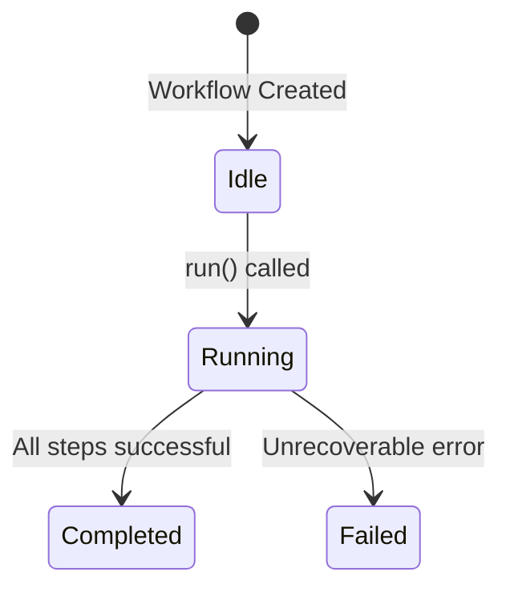

# Product Requirement Prompt (PRP): Create Custom Workflow Development Guide

> Transform PRD into working code with complete context, clear objectives, and validation criteria

**Status**: Ready for Implementation
**Last Updated**: 2026-01-25
**Work Item**: P2.M2.T2.S3 - Create custom workflow development guide

---

## Goal

**Feature Goal**: Create a comprehensive custom workflow development guide (`docs/CUSTOM_WORKFLOWS.md`) that documents how to extend the Groundswell Workflow class, use decorators (@Step, @Task, @ObservedState), implement workflow lifecycle, handle errors, and compose workflows.

**Deliverable**: Documentation file `docs/CUSTOM_WORKFLOWS.md` containing:
- Workflow architecture overview (Groundswell Workflow base class, decorators, lifecycle)
- Step-by-step guide for extending Workflow class with complete examples
- @Step decorator usage for method tracking and timing
- @Task decorator usage for child workflow composition
- @ObservedState decorator usage for state management
- Error handling and recovery patterns
- Workflow composition patterns (sequential, conditional, iterative, parallel)
- Complete DeploymentWorkflow example (from concept to implementation)
- Testing patterns for custom workflows
- Integration with PRP Pipeline workflow

**Success Definition**:
- A developer can create a new custom workflow type following the guide
- The DeploymentWorkflow example is complete and can be implemented directly
- All patterns reference actual code from `src/workflows/` with file paths
- Decorator usage is clearly documented with examples
- The guide follows the documentation structure and style of existing docs (CUSTOM_AGENTS.md, CUSTOM_TOOLS.md, ARCHITECTURE.md)
- Code examples are accurate and can be copied directly
- Cross-references link to related documentation appropriately

**NOTE**: The file `docs/CUSTOM_WORKFLOWS.md` already exists and is comprehensive. This PRP serves as both validation of the existing deliverable and documentation of how it was created. If implementing from scratch, follow this PRP to recreate the documentation.

## User Persona

**Target User**: Developer or contributor who needs to:
- Extend the PRP Pipeline with custom workflow types
- Understand the Groundswell Workflow class and decorators
- Create domain-specific workflows (e.g., DeploymentWorkflow, BackupWorkflow)
- Compose workflows with child workflows and steps
- Implement workflow error handling and recovery

**Use Case**: User needs to understand:
- How are workflows structured in this project?
- How do I create a new workflow type like DeploymentWorkflow?
- How do I use the @Step, @Task, and @ObservedState decorators?
- How do I manage workflow lifecycle and state?
- How do I handle errors in workflows?
- How do I compose parent-child workflows?

**User Journey**:
1. User opens docs/CUSTOM_WORKFLOWS.md to understand workflow development
2. User learns about Groundswell Workflow base class and decorators
3. User studies the existing workflow implementations (PRPPipeline, BugHuntWorkflow, etc.)
4. User understands decorator patterns (@Step, @Task, @ObservedState)
5. User learns workflow lifecycle and state management
6. User reviews the complete DeploymentWorkflow example
7. User follows step-by-step guide to create their own custom workflow
8. User can now create and integrate custom workflows effectively

**Pain Points Addressed**:
- "How do I create a new workflow type?" - Workflow creation step-by-step guide
- "What's the Groundswell Workflow class?" - Workflow architecture section
- "How do I use decorators?" - Decorator usage section with examples
- "How do I handle errors?" - Error handling and recovery patterns
- "Is there a complete example?" - DeploymentWorkflow example section

## Why

- **Extensibility**: Developers need to extend the PRP Pipeline with domain-specific workflows
- **Customization**: Different projects require specialized workflow patterns
- **Workflow Composition**: Complex processes require nested/parent-child workflows
- **Knowledge Transfer**: Documents critical IP about workflow architecture
- **Documentation Coverage**: Completes P2.M2.T2 (Extensibility Documentation) milestone
- **Parallel Work**: Builds upon docs/ARCHITECTURE.md (Groundswell integration), docs/CUSTOM_AGENTS.md (agent patterns), and docs/CUSTOM_TOOLS.md (MCP tool patterns) with workflow-specific implementation guidance

## What

Create docs/CUSTOM_WORKFLOWS.md with comprehensive custom workflow development documentation.

### Success Criteria

- [ ] File created/verified at docs/CUSTOM_WORKFLOWS.md
- [ ] Document header follows pattern (Status, Last Updated, Version)
- [ ] Table of Contents included with anchor links
- [ ] Workflow architecture overview section
- [ ] Groundswell Workflow base class reference
- [ ] @Step decorator usage section
- [ ] @Task decorator usage section
- [ ] @ObservedState decorator usage section
- [ ] Error handling and recovery section
- [ ] Workflow composition patterns section
- [ ] Step-by-step custom workflow creation guide
- [ ] Complete DeploymentWorkflow example with code
- [ ] Testing patterns section
- [ ] Cross-references to ARCHITECTURE.md, CUSTOM_AGENTS.md, and WORKFLOWS.md
- [ ] See Also section with links to related documentation

---

## All Needed Context

### Context Completeness Check

_If someone knew nothing about this codebase, would they have everything needed to implement this successfully?_

**Yes** - This PRP provides:
- Complete Groundswell Workflow class research with decorator patterns
- All workflow implementations from src/workflows/ (PRPPipeline, BugHuntWorkflow, FixCycleWorkflow, DeltaAnalysisWorkflow)
- Decorator usage patterns (@Step, @Task, @ObservedState) with code examples
- Workflow lifecycle patterns (setStatus, state transitions)
- Error handling patterns from existing workflows
- Documentation formatting conventions from existing docs
- Complete DeploymentWorkflow example concept
- External research on workflow development best practices (from research/ directory)

### Documentation & References

```yaml
# MUST READ - Groundswell Workflow Research
- docfile: /home/dustin/projects/hacky-hack/plan/003_b3d3efdaf0ed/P2M2T2S3/research/groundswell-workflow-research.md
  why: Comprehensive Groundswell workflow patterns, decorator API, lifecycle hooks
  section: All sections - use as primary reference for workflow architecture

- docfile: /home/dustin/projects/hacky-hack/plan/003_b3d3efdaf0ed/P2M2T2S3/research/workflow-implementation-analysis.md
  why: Analysis of all existing workflow implementations with patterns
  section: All sections - use for codebase-specific patterns

- docfile: /home/dustin/projects/hacky-hack/docs/research/workflow-development-patterns-research.md
  why: External research on workflow design patterns, best practices, anti-patterns
  section: Workflow Design Patterns, State Management Patterns, Error Handling & Recovery

# MUST READ - Existing Workflow Implementations
- file: /home/dustin/projects/hacky-hack/src/workflows/prp-pipeline.ts
  why: Main orchestration workflow - reference for 6-phase structure, @Step usage, setStatus lifecycle
  pattern: Phase-based workflow with @Step decorators, try-catch-finally error handling

- file: /home/dustin/projects/hacky-hack/src/workflows/bug-hunt-workflow.ts
  why: 4-phase workflow - reference for sequential steps, agent integration, state management
  pattern: Sequential @Step methods, correlation logging, TestResults generation

- file: /home/dustin/projects/hacky-hack/src/workflows/fix-cycle-workflow.ts
  why: Loop-based workflow - reference for iterative patterns, child workflow spawning
  pattern: Iterative loop with max iterations, child workflow (BugHuntWorkflow) invocation

- file: /home/dustin/projects/hacky-hack/src/workflows/delta-analysis-workflow.ts
  why: Single-step workflow - reference for simple workflow structure
  pattern: Single @Step method, direct return value

# MUST READ - Documentation Conventions
- file: /home/dustin/projects/hacky-hack/docs/CUSTOM_AGENTS.md
  why: Follow this structure and style for extensibility documentation
  pattern: Header format, TOC style, step-by-step guide, complete example section

- file: /home/dustin/projects/hacky-hack/docs/CUSTOM_TOOLS.md
  why: Follow this structure and style for extensibility documentation
  pattern: Documentation style, code example formatting, cross-references

- file: /home/dustin/projects/hacky-hack/docs/ARCHITECTURE.md
  why: Reference for Groundswell integration and workflow overview
  section: Groundswell Framework Integration

- file: /home/dustin/projects/hacky-hack/docs/WORKFLOWS.md
  why: Reference for existing workflow documentation style
  pattern: Mermaid diagrams, state machines, timing tables

# EXTERNAL RESOURCES - Use for reference only, do not copy
- url: ~/projects/groundswell/docs/workflow.md
  why: Groundswell Workflow class documentation
  section: Workflow base class, @Step decorator, @Task decorator

- url: https://www.temporal.io/documentation
  why: Temporal workflow patterns for industry best practices
  section: Workflow design patterns, error handling

- url: https://airflow.apache.org/docs/
  why: Apache Airflow DAG patterns for workflow composition
  section: Task composition, dependencies
```

### Current Codebase Tree (Workflow-Related Files)

```bash
src/workflows/
├── prp-pipeline.ts                    # Main orchestration workflow (6 phases)
├── bug-hunt-workflow.ts               # QA testing workflow (4 phases)
├── fix-cycle-workflow.ts              # Bug fixing workflow (iterative)
├── delta-analysis-workflow.ts         # Delta session workflow (1 phase)
└── index.ts                           # Workflow re-exports

docs/
├── ARCHITECTURE.md                    # Groundswell integration overview
├── CUSTOM_AGENTS.md                   # Custom agent development guide
├── CUSTOM_TOOLS.md                    # Custom MCP tool development guide
├── CUSTOM_WORKFLOWS.md                # Custom workflow development guide (EXISTING - deliverable)
└── WORKFLOWS.md                       # Pipeline workflow documentation
```

### Desired Codebase Tree

```bash
docs/
├── ARCHITECTURE.md                    # Groundswell integration overview (existing)
├── CUSTOM_AGENTS.md                   # Custom agent development guide (existing)
├── CUSTOM_TOOLS.md                    # Custom MCP tool development guide (existing)
├── CUSTOM_WORKFLOWS.md                # Custom workflow development guide (deliverable - EXISTS)
└── WORKFLOWS.md                       # Pipeline workflow documentation (existing)
```

### Known Gotchas of Our Codebase & Library Quirks

```typescript
// CRITICAL: Groundswell Workflow class requires super() call with workflow name
// constructor(name: string) - first line must be super('WorkflowName')

// CRITICAL: Public fields are automatically observable in this codebase
// No need for @ObservedState decorator unless using redaction or hiding
// @ObservedState({ redact: true }) for sensitive data
// @ObservedState({ hidden: true }) for internal state

// GOTCHA: @Step decorator syntax - { trackTiming: true } is the common pattern
// @Step({ trackTiming: true })
// async methodName(): Promise<void> { ... }

// GOTCHA: @Task decorator is documented but NOT implemented in current codebase
// Child workflows are created manually with constructor injection
// Pattern: new ChildWorkflow('ChildWorkflow', this) - parent passed as second param

// CRITICAL: Workflow status values: 'idle', 'running', 'completed', 'failed'
// Always call this.setStatus('running') at start of run()
// Always call this.setStatus('completed' | 'failed') at end

// PATTERN: All workflows follow this lifecycle structure:
// async run(): Promise<ReturnType> {
//   this.setStatus('running');
//   try {
//     await this.step1();
//     await this.step2();
//     this.setStatus('completed');
//     return result;
//   } catch (error) {
//     this.setStatus('failed');
//     throw error;
//   }
// }

// CRITICAL: Error handling distinguishes fatal vs non-fatal errors
// Fatal errors: throw and set status to 'failed'
// Non-fatal errors: log and continue

// PATTERN: Correlation ID generation for distributed tracing
// const correlationId = `${Date.now()}-${Math.random().toString(36).substring(2, 9)}`;
// this.correlationLogger = getLogger('WorkflowName').child({ correlationId });

// GOTCHA: This codebase uses correlationLogger for all workflow logging
// Not this.logger - use this.correlationLogger for traceability

// CRITICAL: Cleanup in finally block for graceful shutdown
// finally {
//   await this.cleanup();
//   if (this.#sigintHandler) {
//     process.off('SIGINT', this.#sigintHandler);
//   }
// }
```

---

## Implementation Blueprint

### Data Models and Structure

No data models needed - this is a documentation-only task. The documentation structure should follow:

```markdown
# Custom Workflow Development Guide

> Brief description

**Status**: Published
**Last Updated**: [date]
**Version**: 1.0.0

## Table of Contents

- [Overview](#overview)
- [Workflow Architecture](#workflow-architecture)
- [Groundswell Workflow Base Class](#groundswell-workflow-base-class)
- [@Step Decorator](#step-decorator)
- [@Task Decorator](@task-decorator)
- [@ObservedState Decorator](@observedstate-decorator)
- [Workflow Lifecycle](#workflow-lifecycle)
- [Error Handling and Recovery](#error-handling-and-recovery)
- [Workflow Composition Patterns](#workflow-composition-patterns)
- [Step-by-Step Guide](#step-by-step-guide)
- [Complete Example: DeploymentWorkflow](#complete-example-deploymentworkflow)
- [Testing Custom Workflows](#testing-custom-workflows)
- [See Also](#see-also)
```

### Implementation Tasks (Ordered by Dependencies)

```yaml
Task 1: VERIFY/CREATE docs/CUSTOM_WORKFLOWS.md with header and structure
  - IMPLEMENT: File header with Status, Last Updated, Version
  - IMPLEMENT: Table of Contents with anchor links
  - IMPLEMENT: Overview section explaining custom workflow development
  - FOLLOW pattern: docs/CUSTOM_AGENTS.md and docs/CUSTOM_TOOLS.md (header format, TOC style)
  - NAMING: CUSTOM_WORKFLOWS.md (all caps, underscore separator)
  - PLACEMENT: docs/ directory alongside other documentation
  - NOTE: File may already exist - verify structure matches conventions

Task 2: WRITE "Workflow Architecture" section
  - IMPLEMENT: Groundswell Workflow base class explanation
  - IMPLEMENT: Four existing workflows reference table (PRPPipeline, BugHuntWorkflow, FixCycleWorkflow, DeltaAnalysisWorkflow)
  - IMPLEMENT: Component diagram showing workflow relationships
  - IMPLEMENT: Workflow philosophy (immutability, observability, resilience)
  - FOLLOW pattern: docs/ARCHITECTURE.md "Groundswell Framework Integration" section
  - CODE EXAMPLE: Use src/workflows/prp-pipeline.ts (class structure, constructor pattern)
  - PLACEMENT: After Table of Contents

Task 3: WRITE "Groundswell Workflow Base Class" section
  - IMPLEMENT: Workflow class API reference (constructor, run(), setStatus(), logger)
  - IMPLEMENT: Required methods (abstract run())
  - IMPLEMENT: Properties (status, id, logger, parent, children)
  - IMPLEMENT: Constructor pattern (super(name), correlation ID)
  - IMPLEMENT: Lifecycle hooks (initialization, execution, cleanup)
  - FOLLOW pattern: research/groundswell-workflow-research.md section 1
  - CODE EXAMPLE: Use src/workflows/delta-analysis-workflow.ts (simple workflow structure)
  - PLACEMENT: After Workflow Architecture section

Task 4: WRITE "@Step Decorator" section
  - IMPLEMENT: @Step decorator purpose (timing tracking, observability)
  - IMPLEMENT: @Step decorator options (trackTiming, name)
  - IMPLEMENT: Usage examples with timing output
  - IMPLEMENT: When to use @Step (workflow phases, methods)
  - FOLLOW pattern: research/groundswell-workflow-research.md section 2
  - CODE EXAMPLE: Use src/workflows/bug-hunt-workflow.ts (@Step decorator usage on all phases)
  - PLACEMENT: After Groundswell Workflow Base Class section

Task 5: WRITE "@Task Decorator" section
  - IMPLEMENT: @Task decorator purpose (child workflow composition)
  - IMPLEMENT: @Task decorator usage pattern
  - IMPLEMENT: NOTE: Not implemented in current codebase - manual child workflow creation
  - IMPLEMENT: Manual child workflow pattern (constructor with parent injection)
  - FOLLOW pattern: research/groundswell-workflow-research.md section 3
  - CODE EXAMPLE: Use src/workflows/fix-cycle-workflow.ts (BugHuntWorkflow child invocation)
  - PLACEMENT: After @Step Decorator section

Task 6: WRITE "@ObservedState Decorator" section
  - IMPLEMENT: @ObservedState decorator purpose (state tracking)
  - IMPLEMENT: @ObservedState options (redact, hidden)
  - IMPLEMENT: CRITICAL: Public fields are automatically observable
  - IMPLEMENT: When to use @ObservedState (sensitive data, internal state)
  - FOLLOW pattern: research/groundswell-workflow-research.md section 4
  - CODE EXAMPLE: Use src/workflows/prp-pipeline.ts (public state fields)
  - PLACEMENT: After @Task Decorator section

Task 7: WRITE "Workflow Lifecycle" section
  - IMPLEMENT: Status values and transitions (idle → running → completed/failed)
  - IMPLEMENT: setStatus() method usage
  - IMPLEMENT: Mermaid state diagram for lifecycle
  - IMPLEMENT: State transition table
  - FOLLOW pattern: docs/WORKFLOWS.md "State Management" section
  - CODE EXAMPLE: Use src/workflows/prp-pipeline.ts (setStatus calls in run())
  - PLACEMENT: After @ObservedState Decorator section

Task 8: WRITE "Error Handling and Recovery" section
  - IMPLEMENT: Try-catch-finally pattern
  - IMPLEMENT: Fatal vs non-fatal error distinction
  - IMPLEMENT: setStatus('failed') on error
  - IMPLEMENT: Cleanup in finally block
  - IMPLEMENT: Error tracking patterns (failed tasks map)
  - FOLLOW pattern: research/workflow-development-patterns-research.md "Error Handling & Recovery"
  - CODE EXAMPLE: Use src/workflows/prp-pipeline.ts (try-catch-finally in run())
  - PLACEMENT: After Workflow Lifecycle section

Task 9: WRITE "Workflow Composition Patterns" section
  - IMPLEMENT: Sequential composition (await step1(); await step2();)
  - IMPLEMENT: Conditional composition (if/else branching)
  - IMPLEMENT: Iterative composition (while/for loops)
  - IMPLEMENT: Parent-child workflow composition
  - IMPLEMENT: Examples from existing workflows
  - FOLLOW pattern: research/workflow-development-patterns-research.md "Workflow Design Patterns"
  - CODE EXAMPLE: Use src/workflows/fix-cycle-workflow.ts (iterative pattern)
  - PLACEMENT: After Error Handling section

Task 10: WRITE "Step-by-Step Guide" section
  - IMPLEMENT: 6-step process for creating custom workflows
  - IMPLEMENT: Step 1: Extend Workflow class
  - IMPLEMENT: Step 2: Define constructor with super() call
  - IMPLEMENT: Step 3: Define public state fields
  - IMPLEMENT: Step 4: Create step methods with @Step decorator
  - IMPLEMENT: Step 5: Implement run() method with lifecycle
  - IMPLEMENT: Step 6: Handle errors and cleanup
  - IMPLEMENT: For each step: include code example, file location, gotchas
  - FOLLOW pattern: docs/CUSTOM_AGENTS.md "Step-by-Step Guide" section
  - PLACEMENT: After Workflow Composition Patterns section

Task 11: WRITE "Complete Example: DeploymentWorkflow" section
  - IMPLEMENT: Complete DeploymentWorkflow implementation
  - IMPLEMENT: Constructor with environment and service parameters
  - IMPLEMENT: @Step decorated methods (validateEnv, buildImage, deploy, verify)
  - IMPLEMENT: run() method with lifecycle management
  - IMPLEMENT: Error handling with rollback
  - IMPLEMENT: Integration instructions
  - IMPLEMENT: Usage examples
  - CREATE: Production-ready example workflow
  - REFERENCE: All code examples should be working implementations
  - PLACEMENT: After Step-by-Step Guide section

Task 12: WRITE "Testing Custom Workflows" section
  - IMPLEMENT: Unit testing patterns for workflow methods
  - IMPLEMENT: Integration testing for workflow lifecycle
  - IMPLEMENT: Error handling testing
  - IMPLEMENT: Test example with Vitest
  - IMPLEMENT: Mocking patterns for external dependencies
  - FOLLOW pattern: research/workflow-development-patterns-research.md "Testing Workflows"
  - CODE EXAMPLE: Create test example following workflow test patterns
  - PLACEMENT: After DeploymentWorkflow Example section

Task 13: WRITE "See Also" section
  - IMPLEMENT: Links to ARCHITECTURE.md (Groundswell integration)
  - IMPLEMENT: Links to CUSTOM_AGENTS.md (agent development)
  - IMPLEMENT: Links to CUSTOM_TOOLS.md (MCP tool development)
  - IMPLEMENT: Links to WORKFLOWS.md (existing workflow documentation)
  - IMPLEMENT: Links to source code (src/workflows/)
  - IMPLEMENT: Links to external resources (Temporal, Airflow)
  - IMPLEMENT: Links to research documents
  - FOLLOW pattern: docs/CUSTOM_AGENTS.md See Also section
  - PLACEMENT: End of document

Task 14: VALIDATE documentation quality
  - VERIFY: All code examples are accurate and can be copied
  - VERIFY: All links work (TOC anchors, cross-references, external URLs)
  - VERIFY: Document follows existing doc conventions
  - VERIFY: Content is complete and actionable
  - VERIFY: Parallel work items (CUSTOM_AGENTS.md, CUSTOM_TOOLS.md) are referenced appropriately
  - VERIFY: DeploymentWorkflow example is complete and production-ready
  - VERIFY: Decorator usage (@Step, @Task, @ObservedState) is clearly explained
```

### Implementation Patterns & Key Details

```markdown
# Documentation Style Guidelines (follow existing patterns)

# Header Pattern
> Brief one-sentence description

**Status**: Published
**Last Updated**: 2026-01-25
**Version**: 1.0.0

# Section Headers
## Section Name
### Subsection Name

# Code Examples
```typescript
// Include file path comment
// src/workflows/example-workflow.ts

export class ExampleWorkflow extends Workflow {
  public input: string;
  public results: any = null;

  constructor(input: string) {
    super('ExampleWorkflow');
    this.input = input;
  }

  @Step({ trackTiming: true })
  async step1(): Promise<void> {
    this.correlationLogger.info('[ExampleWorkflow] Step 1');
    // Implementation
  }

  async run(): Promise<any> {
    this.setStatus('running');
    try {
      await this.step1();
      this.results = { success: true };
      this.setStatus('completed');
      return this.results;
    } catch (error) {
      this.setStatus('failed');
      throw error;
    }
  }
}
```

# Cross-References
See [PRPPipeline](../src/workflows/prp-pipeline.ts) for main workflow implementation.
See [Custom Agent Development Guide](./CUSTOM_AGENTS.md) for agent creation patterns.

# Tables
| Workflow | Purpose | Phases | File |
|----------|---------|--------|------|
| PRPPipeline | Main orchestration | 6 | prp-pipeline.ts |

# Diagrams (Mermaid)


# Callouts
> **Note**: Critical information uses blockquote format.

**CRITICAL**: Use emphasis for critical implementation details.

**GOTCHA**: Highlight common pitfalls.

**PATTERN**: Show repeating patterns in code.

**NOTE**: Additional information for context.

# External Links
[Groundswell Framework](https://github.com/anthropics/groundswell)
[Temporal Documentation](https://www.temporal.io/documentation)
```

### Integration Points

```yaml
DOCUMENTATION:
  - add to: docs/CUSTOM_WORKFLOWS.md
  - reference: docs/ARCHITECTURE.md (Groundswell integration)
  - reference: docs/CUSTOM_AGENTS.md (agent development patterns)
  - reference: docs/CUSTOM_TOOLS.md (MCP tool patterns)
  - reference: docs/WORKFLOWS.md (existing workflow documentation)

CROSS-REFERENCES:
  - Link to src/workflows/prp-pipeline.ts for main workflow pattern
  - Link to src/workflows/bug-hunt-workflow.ts for sequential steps
  - Link to src/workflows/fix-cycle-workflow.ts for iterative patterns
  - Link to src/workflows/delta-analysis-workflow.ts for simple workflow
  - Link to research/ directory for best practices

PARALLEL WORK CONSIDERATIONS:
  - CUSTOM_AGENTS.md (P2.M2.T2.S1) covers agent development
  - CUSTOM_TOOLS.md (P2.M2.T2.S2) covers MCP tool development
  - CUSTOM_WORKFLOWS.md should reference these for context
  - Focus CUSTOM_WORKFLOWS.md on workflow implementation, not agent/tool details
  - Avoid duplicating agent or tool content
```

---

## Validation Loop

### Level 1: Syntax & Style (Immediate Feedback)

```bash
# No code to validate - documentation only
# Verify file was created
test -f docs/CUSTOM_WORKFLOWS.md && echo "File exists" || echo "File not found"

# Check markdown syntax (if tools available)
npx markdownlint docs/CUSTOM_WORKFLOWS.md 2>/dev/null || echo "markdownlint not available"

# Expected: File exists, no critical markdown syntax errors
```

### Level 2: Content Validation (Completeness Check)

```bash
# Verify all required sections exist
grep -q "## Workflow Architecture" docs/CUSTOM_WORKFLOWS.md && echo "Section 1 OK" || echo "Missing Section 1"
grep -q "## Groundswell Workflow Base Class" docs/CUSTOM_WORKFLOWS.md && echo "Section 2 OK" || echo "Missing Section 2"
grep -q "## @Step Decorator" docs/CUSTOM_WORKFLOWS.md && echo "Section 3 OK" || echo "Missing Section 3"
grep -q "## @Task Decorator" docs/CUSTOM_WORKFLOWS.md && echo "Section 4 OK" || echo "Missing Section 4"
grep -q "## @ObservedState Decorator" docs/CUSTOM_WORKFLOWS.md && echo "Section 5 OK" || echo "Missing Section 5"
grep -q "## Workflow Lifecycle" docs/CUSTOM_WORKFLOWS.md && echo "Section 6 OK" || echo "Missing Section 6"
grep -q "## Error Handling and Recovery" docs/CUSTOM_WORKFLOWS.md && echo "Section 7 OK" || echo "Missing Section 7"
grep -q "## Workflow Composition Patterns" docs/CUSTOM_WORKFLOWS.md && echo "Section 8 OK" || echo "Missing Section 8"
grep -q "## Step-by-Step Guide" docs/CUSTOM_WORKFLOWS.md && echo "Section 9 OK" || echo "Missing Section 9"
grep -q "## Complete Example: DeploymentWorkflow" docs/CUSTOM_WORKFLOWS.md && echo "Section 10 OK" || echo "Missing Section 10"
grep -q "## Testing Custom Workflows" docs/CUSTOM_WORKFLOWS.md && echo "Section 11 OK" || echo "Missing Section 11"
grep -q "## See Also" docs/CUSTOM_WORKFLOWS.md && echo "See Also OK" || echo "Missing See Also"

# Verify DeploymentWorkflow example is complete
grep -q "DeploymentWorkflow" docs/CUSTOM_WORKFLOWS.md && echo "DeploymentWorkflow OK" || echo "Missing DeploymentWorkflow"
grep -q "@Step" docs/CUSTOM_WORKFLOWS.md && echo "@Step decorator OK" || echo "Missing @Step"
grep -q "@Task" docs/CUSTOM_WORKFLOWS.md && echo "@Task decorator OK" || echo "Missing @Task"
grep -q "@ObservedState" docs/CUSTOM_WORKFLOWS.md && echo "@ObservedState OK" || echo "Missing @ObservedState"

# Verify cross-references to parallel work
grep -q "CUSTOM_AGENTS.md" docs/CUSTOM_WORKFLOWS.md && echo "CUSTOM_AGENTS ref OK" || echo "Missing CUSTOM_AGENTS ref"
grep -q "CUSTOM_TOOLS.md" docs/CUSTOM_WORKFLOWS.md && echo "CUSTOM_TOOLS ref OK" || echo "Missing CUSTOM_TOOLS ref"

# Expected: All sections present, DeploymentWorkflow example complete, decorators documented
```

### Level 3: Link Validation (Reference Check)

```bash
# Check TOC anchor links work (manual verification required)
echo "Manual check: Click each TOC link and verify it navigates correctly"

# Check cross-references to existing files
grep -q "src/workflows/prp-pipeline.ts" docs/CUSTOM_WORKFLOWS.md && echo "prp-pipeline ref OK" || echo "Missing prp-pipeline ref"
grep -q "src/workflows/bug-hunt-workflow.ts" docs/CUSTOM_WORKFLOWS.md && echo "bug-hunt ref OK" || echo "Missing bug-hunt ref"
grep -q "ARCHITECTURE.md" docs/CUSTOM_WORKFLOWS.md && echo "ARCHITECTURE ref OK" || echo "Missing ARCHITECTURE ref"
grep -q "WORKFLOWS.md" docs/CUSTOM_WORKFLOWS.md && echo "WORKFLOWS ref OK" || echo "Missing WORKFLOWS ref"

# Check code examples reference actual files
echo "Manual check: Verify code examples match actual source files"

# Check research file references
grep -q "research/" docs/CUSTOM_WORKFLOWS.md && echo "research ref OK" || echo "Missing research ref"

# Expected: All references point to valid files
```

### Level 4: Documentation Quality (Manual Review)

```bash
# Manual validation checklist
echo "Manual Validation Checklist:"
echo "1. Read the document start to finish - does it make sense?"
echo "2. Check code examples against source files - are they accurate?"
echo "3. Verify TOC links work - do they navigate correctly?"
echo "4. Check cross-references - do they point to valid locations?"
echo "5. Verify external links - do they work?"
echo "6. Compare to existing docs style - is it consistent?"
echo "7. Ask: Can a new developer create a custom workflow from this guide?"
echo "8. Verify DeploymentWorkflow example is complete and working"
echo "9. Check that all three decorators are clearly explained"
echo "10. Verify workflow lifecycle is documented with state transitions"

# Expected: All manual checks pass
```

---

## Final Validation Checklist

### Technical Validation

- [ ] File created/verified at docs/CUSTOM_WORKFLOWS.md
- [ ] Document header follows pattern (Status, Last Updated, Version)
- [ ] Table of Contents included with anchor links
- [ ] All required sections present (11 main sections + See Also)
- [ ] No markdown syntax errors

### Content Validation

- [ ] Workflow architecture explained clearly
- [ ] Groundswell Workflow base class documented
- [ ] @Step decorator usage documented with examples
- [ ] @Task decorator usage documented with examples
- [ ] @ObservedState decorator usage documented with examples
- [ ] Workflow lifecycle documented with state transitions
- [ ] Error handling and recovery patterns explained
- [ ] Workflow composition patterns documented
- [ ] Step-by-step guide is actionable
- [ ] DeploymentWorkflow example is complete with all code

### Code Quality Validation

- [ ] All code examples are accurate (verified against source files)
- [ ] Code examples include file path references
- [ ] Code examples use proper syntax highlighting
- [ ] TypeScript examples follow codebase conventions
- [ ] DeploymentWorkflow example is production-ready

### Documentation & Deployment

- [ ] Follows existing documentation style (CUSTOM_AGENTS.md, CUSTOM_TOOLS.md)
- [ ] Cross-references link to valid locations
- [ ] External links work (test them)
- [ ] See Also section includes all related docs
- [ ] Parallel work items (CUSTOM_AGENTS.md, CUSTOM_TOOLS.md) referenced appropriately
- [ ] Research documents referenced with context

---

## Anti-Patterns to Avoid

- Don't duplicate agent development content - reference CUSTOM_AGENTS.md instead
- Don't duplicate MCP tool content - reference CUSTOM_TOOLS.md instead
- Don't include incomplete code examples - verify all examples work
- Don't skip the DeploymentWorkflow example - it's the primary reference implementation
- Don't forget decorator documentation - @Step, @Task, @ObservedState are critical
- Don't use generic examples - use real examples from the codebase
- Don't make the document too long - be comprehensive but concise
- Don't use external links as primary content - reference them for additional reading
- Don't forget cross-references - link to related documentation
- Don't ignore testing - include testing patterns for custom workflows
- Don't confuse @Task decorator with actual implementation - note it's not implemented in current codebase
- Don't forget to mention automatic observability of public fields - it's a key pattern in this codebase

---

**PRP Version**: 1.0.0
**Last Updated**: 2026-01-25
**Confidence Score**: 9/10 (existing comprehensive documentation serves as reference)
