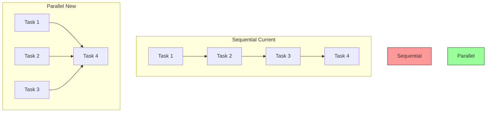
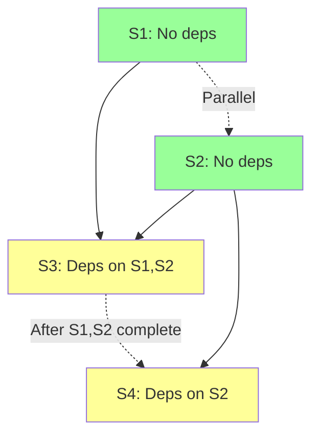
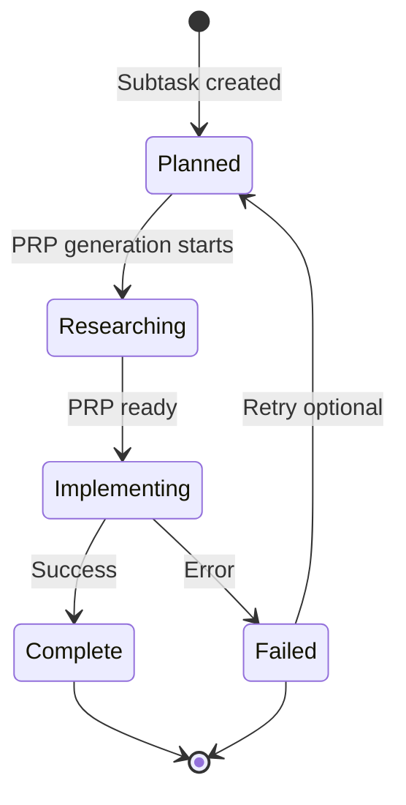
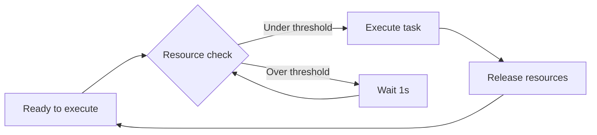

# Product Requirement Prompt (PRP): Design Parallel Execution Strategy

> Design comprehensive parallel execution strategy for PRP Pipeline subtask execution

**Status**: Ready for Implementation
**Last Updated**: 2026-01-24
**Work Item**: P3.M1.T1.S1 - Design parallel execution strategy

---

## Goal

**Feature Goal**: Design comprehensive parallel execution strategy document (`plan/003_b3d3efdaf0ed/architecture/parallel-execution-design.md`) that enables concurrent subtask execution while maintaining dependency constraints, with configurable pool sizes, resource limits, backpressure handling, and state management for concurrent operations.

**Deliverable**: Design document `plan/003_b3d3efdaf0ed/architecture/parallel-execution-design.md` containing:

- Executable subtask identification algorithm (dependencies satisfied check)
- Concurrent execution limits with configurable pool size
- PRP generation vs implementation parallelization strategy
- Resource limits and backpressure mechanisms
- State update patterns for concurrent tasks
- Error handling in concurrent context
- Pseudocode for parallel scheduler
- Diagrams showing execution flow and state transitions
- Integration points with existing TaskOrchestrator and ResearchQueue

**Success Definition**:

- Design document enables implementation of parallel subtask execution in P3.M1.T1.S2
- All design decisions reference existing codebase patterns (ResearchQueue, Groundswell @Task)
- Pseudocode is specific and actionable for TypeScript implementation
- Diagrams clearly show sequential vs parallel execution flows
- Resource limits are configurable and documented
- Error handling scenarios are covered (task failure, resource exhaustion)
- State management patterns are thread-safe and reference existing batching patterns
- Design respects existing dependencies and status transitions

## User Persona

**Target User**: Developer implementing P3.M1.T1.S2 (Concurrent Task Executor) and P3.M1.T1.S3 (Parallelism CLI option)

**Use Case**: User needs to understand:

- How to identify executable subtasks (dependencies satisfied)?
- What is the parallel execution algorithm?
- How to manage concurrent execution limits?
- How does PRP generation parallelization differ from implementation?
- What are the resource limits and backpressure mechanisms?
- How to handle state updates for concurrent tasks?
- What error handling patterns are needed?
- How to integrate with existing TaskOrchestrator?

**User Journey**:

1. User reads `parallel-execution-design.md` to understand the strategy
2. User studies executable subtask identification algorithm
3. User reviews concurrent execution limits and pool size configuration
4. User understands PRP generation vs implementation parallelization
5. User learns resource limits and backpressure mechanisms
6. User studies state update patterns for concurrent operations
7. User reviews error handling in concurrent context
8. User implements ConcurrentTaskExecutor based on pseudocode
9. User integrates with existing TaskOrchestrator and ResearchQueue
10. User can now execute subtasks in parallel with proper dependency resolution

**Pain Points Addressed**:

- "How do I identify which subtasks can run in parallel?" - Executable subtask identification section
- "What's the algorithm for parallel execution?" - Pseudocode section with algorithm
- "How do I limit concurrent operations?" - Pool size configuration section
- "What about PRP generation vs implementation?" - Separate parallelization strategies section
- "How do I prevent resource exhaustion?" - Resource limits and backpressure section
- "How do I handle state updates concurrently?" - State management patterns section
- "What about errors in parallel execution?" - Error handling section

## Why

- **Performance**: Current sequential execution is a bottleneck - with hundreds of subtasks, execution time is linear
- **Scalability**: Parallel execution enables faster completion for independent subtasks
- **Resource Efficiency**: Better utilization of available CPU and I/O resources
- **ResearchQueue Foundation**: ResearchQueue already demonstrates parallel PRP generation with concurrency=3 - extend this pattern to implementation
- **Groundswell Integration**: Groundswell @Task decorator provides built-in concurrent execution primitives
- **Completes P3.M1.T1**: This is the first subtask in "Parallel Subtask Execution" task - design before implementation

## What

Create `plan/003_b3d3efdaf0ed/architecture/parallel-execution-design.md` with comprehensive parallel execution strategy:

### Success Criteria

- [ ] File created at `plan/003_b3d3efdaf0ed/architecture/parallel-execution-design.md`
- [ ] Document header follows architecture doc conventions
- [ ] Table of Contents included with anchor links
- [ ] Executable subtask identification section with algorithm
- [ ] Concurrent execution limits section with pool size configuration
- [ ] PRP generation vs implementation parallelization section
- [ ] Resource limits and backpressure section
- [ ] State updates for concurrent tasks section
- [ ] Error handling in concurrent context section
- [ ] Pseudocode for parallel scheduler
- [ ] Diagrams (execution flow, state transitions, dependency graph)
- [ ] Integration points section (TaskOrchestrator, ResearchQueue)
- [ ] See Also section with related documentation

---

## All Needed Context

### Context Completeness Check

_If someone knew nothing about this codebase, would they have everything needed to implement this successfully?_

**Yes** - This PRP provides:

- Complete analysis of current sequential execution patterns (TaskOrchestrator, PRPRuntime)
- Existing parallel execution infrastructure (ResearchQueue with concurrency=3)
- Groundswell @Task decorator concurrency capabilities
- Dependency resolution logic (canExecute, getBlockingDependencies)
- State management patterns (SessionManager batching, atomic updates)
- Testing patterns for concurrent operations
- Performance bottlenecks and limitations (system_context.md)

### Documentation & References

```yaml
# MUST READ - Current Execution Patterns
- file: /home/dustin/projects/hacky-hack/src/core/task-orchestrator.ts
  why: Main sequential execution logic - processNextItem(), executeSubtask(), canExecute(), getBlockingDependencies()
  pattern: DFS pre-order traversal, FIFO queue, status progression, dependency checking
  lines: 805-834 (processNextItem), 584-750 (executeSubtask), 251-293 (dependency resolution)
  gotcha: Current execution is sequential - subtasks execute one-by-one despite dependency resolution

- file: /home/dustin/projects/hacky-hack/src/core/research-queue.ts
  why: Existing parallel execution pattern for PRP generation - extends to implementation
  pattern: Concurrency-limited queue with maxSize, researching Map, results Map, deduplication
  lines: 57-197 (queue implementation with processNext, enqueue, waitForPRP)
  gotcha: Concurrency hardcoded to 3 - needs to be configurable

- file: /home/dustin/projects/hacky-hack/src/agents/prp-runtime.ts
  why: PRP execution orchestration - status progression (Researching → Implementing → Complete/Failed)
  pattern: executeSubtask with PRPGenerator and PRPExecutor, artifact collection, status updates
  lines: 139-232 (executeSubtask method)
  gotcha: Must ensure thread-safe status updates when executing concurrently

- file: /home/dustin/projects/hacky-hack/node_modules/groundswell/src/decorators/task.ts
  why: Groundswell @Task decorator with concurrent execution - Promise.allSettled() pattern
  pattern: concurrent: true option, child workflow attachment, error merging
  lines: 105-145 (concurrent execution logic)
  gotcha: Only works for Workflow instances - subtasks are not workflows

# MUST READ - State Management
- file: /home/dustin/projects/hacky-hack/src/core/session-manager.ts
  why: State persistence patterns - atomic updates, batching, flushUpdates()
  pattern: Temp file + rename for atomic writes, in-memory batching with flushUpdates()
  gotcha: Batched updates need thread-safety for concurrent operations

- file: /home/dustin/projects/hacky-hack/src/core/models.ts
  why: Task hierarchy data models - Backlog, Phase, Milestone, Task, Subtask, Status
  pattern: Type-safe interfaces with discriminated unions
  gotcha: Status values are strings - no enum, use strict equality

# MUST READ - System Context
- docfile: /home/dustin/projects/hacky-hack/plan/003_b3d3efdaf0ed/docs/system_context.md
  why: Current implementation status and limitations - identifies the problem to solve
  section: "Limitations & Pain Points" (lines 429-503)
  critical: "Sequential Subtask Execution" - no parallel execution despite dependency resolution

# MUST READ - Testing Patterns
- docfile: /home/dustin/projects/hacky-hack/plan/003_b3d3efdaf0ed/docs/testing-concurrent-operations-vitest-typescript.md
  why: Comprehensive testing patterns for concurrent operations - use for validation section
  section: "Testing Concurrent Execution with Limits", "Testing Queue Dependency Ordering"
  critical: ConcurrencyTracker pattern for testing limits, dependency ordering verification

# MUST READ - Architecture Documentation
- docfile: /home/dustin/projects/hacky-hack/plan/003_b3d3efdaf0ed/docs/workflow-best-practices.md
  why: External research on workflow orchestration patterns (Airflow, Prefect, Dagster)
  section: All sections - reference for best practices in parallel execution

- docfile: /home/dustin/projects/hacky-hack/plan/003_b3d3efdaf0ed/docs/ARCHITECTURE.md
  why: Overall system architecture - understand where parallel executor fits
  section: "Task Orchestrator" section for current architecture

# MUST READ - PRD Context
- docfile: /home/dustin/projects/hacky-hack/plan/003_b3d3efdaf0ed/tasks.json
  why: P3.M1.T1 task breakdown - understand scope and dependencies
  section: P3.M1.T1 (Task 3.1.1: Parallel Subtask Execution)
  context: P3.M1.T1.S1 is design, S2 is implementation, S3 is CLI option
```

### Current Codebase Tree (Relevant Files)

```bash
src/core/
├── task-orchestrator.ts         # Sequential execution - needs parallel extension
├── research-queue.ts            # Parallel PRP generation - reference pattern
├── session-manager.ts           # State management - needs concurrent updates
├── models.ts                    # Data models (Subtask, Status, dependencies)
└── scope-resolver.ts            # Scope filtering for execution

src/agents/
├── prp-runtime.ts               # PRP execution orchestration
├── prp-generator.ts             # PRP generation (parallel via ResearchQueue)
└── prp-executor.ts              # PRP execution (sequential - needs parallel)

src/workflows/
└── prp-pipeline.ts              # Main pipeline - calls TaskOrchestrator

node_modules/groundswell/src/decorators/
└── task.ts                      # @Task decorator with concurrent option

plan/003_b3d3efdaf0ed/
├── docs/
│   ├── system_context.md        # Current limitations
│   └── testing-concurrent-operations-vitest-typescript.md  # Testing patterns
└── architecture/
    └── parallel-execution-design.md  # TO BE CREATED (this PRP)
```

### Desired Codebase Tree

```bash
plan/003_b3d3efdaf0ed/
└── architecture/
    └── parallel-execution-design.md  # Design document - TO BE CREATED (P3.M1.T1.S1)

src/core/
└── concurrent-task-executor.ts  # Implementation - TO BE CREATED (P3.M1.T1.S2)
```

### Known Gotchas of Our Codebase & Library Quirks

```typescript
// CRITICAL: Current execution is sequential despite dependency resolution
// TaskOrchestrator.processNextItem() processes one item at a time
// canExecute() checks dependencies but doesn't enable parallel execution

// PATTERN: Current dependency resolution
async executeSubtask(subtask: Subtask): Promise<void> {
  // Check if dependencies are satisfied
  if (!this.canExecute(subtask)) {
    const blockers = this.getBlockingDependencies(subtask);
    // Log blockers and return early - NO parallel execution
    return;
  }
  // Execute sequentially...
}

// PATTERN: ResearchQueue demonstrates parallel execution
export class ResearchQueue {
  readonly maxSize: number;  // Concurrency limit (currently 3)
  readonly researching: Map<string, Promise<PRPDocument>>;  // In-flight tracking

  async processNext(backlog: Backlog): Promise<void> {
    // Check capacity
    if (this.queue.length === 0 || this.researching.size >= this.maxSize) {
      return;  // Backpressure: wait for capacity
    }

    // Dequeue and start processing
    const task = this.queue.shift();
    const promise = this.#prpGenerator.generate(task, backlog)
      .finally(() => {
        this.researching.delete(task.id);
        this.processNext(backlog);  // Start next when complete
      });
    this.researching.set(task.id, promise);
  }
}

// GOTCHA: State updates need atomicity for concurrent operations
// SessionManager uses batching - must ensure thread-safety
await this.sessionManager.updateItemStatus(itemId, status);
await this.sessionManager.flushUpdates();  // Atomic write

// PATTERN: Groundswell @Task concurrent execution
@Task({ concurrent: true })
async createAllWorkers(): Promise<WorkerWorkflow[]> {
  return this.workers.map(w => new WorkerWorkflow(w.id, this));
}
// Uses Promise.allSettled() for parallel execution
// Only works for Workflow instances - subtasks are NOT workflows

// CRITICAL: Subtask dependencies are within task boundary only
// Subtasks can only depend on other subtasks in the SAME task
interface Subtask {
  dependencies: string[];  // Subtask IDs (same task only)
}

// PATTERN: Status progression is linear
// Planned → Researching → Implementing → Complete/Failed
// Must ensure no status races in concurrent execution

// GOTCHA: File handle monitoring on macOS uses lsof (slower)
// Impact: Resource exhaustion detection is slower
// Consider: Cache file handle counts, reduce check frequency

// TESTING PATTERN: ConcurrencyTracker for validation
class ConcurrencyTracker {
  private active = 0;
  private max = 0;

  track<T>(fn: () => Promise<T>): () => Promise<T> {
    return async () => {
      this.active++;
      this.max = Math.max(this.max, this.active);
      try {
        return await fn();
      } finally {
        this.active--;
      }
    };
  }

  getMaxConcurrency(): number {
    return this.max;
  }
}
```

---

## Implementation Blueprint

### Data Models and Structure

No new data models needed - design document uses existing models:

```typescript
// Existing models (from src/core/models.ts)
type Status = 'Planned' | 'Researching' | 'Implementing' | 'Complete' | 'Failed';

interface Subtask {
  id: string;
  title: string;
  status: Status;
  dependencies: string[];  // Subtask IDs that must Complete first
}

// New configuration for parallel execution (to be added in P3.M1.T1.S3)
interface ParallelismConfig {
  enabled: boolean;
  maxConcurrency: number;  // Pool size (default: 3)
  prpGenerationLimit: number;  // Separate limit for PRP generation (default: 3)
}
```

### Implementation Tasks (Ordered by Dependencies)

```yaml
Task 1: CREATE plan/003_b3d3efdaf0ed/architecture/parallel-execution-design.md with header
  - IMPLEMENT: File header with Status, Last Updated, Version, Work Item
  - IMPLEMENT: Table of Contents with anchor links
  - IMPLEMENT: Executive Summary (problem statement, solution overview)
  - FOLLOW pattern: docs/ARCHITECTURE.md (header format, TOC style)
  - NAMING: parallel-execution-design.md (kebab-case)
  - PLACEMENT: plan/003_b3d3efdaf0ed/architecture/ directory

Task 2: WRITE "Current State Analysis" section
  - IMPLEMENT: Summary of current sequential execution patterns
  - IMPLEMENT: Performance bottleneck analysis (linear execution time)
  - IMPLEMENT: ResearchQueue capabilities (existing parallel infrastructure)
  - IMPLEMENT: Groundswell @Task decorator review
  - REFERENCE: src/core/task-orchestrator.ts (current sequential execution)
  - REFERENCE: src/core/research-queue.ts (existing parallel pattern)
  - REFERENCE: system_context.md "Limitations & Pain Points" section
  - DIAGRAM: Current sequential execution flow diagram
  - PLACEMENT: After Executive Summary

Task 3: WRITE "Executable Subtask Identification" section
  - IMPLEMENT: Algorithm for identifying subtasks with satisfied dependencies
  - IMPLEMENT: Dependency graph traversal pattern
  - IMPLEMENT: Pseudocode for canExecuteBatch() method
  - REFERENCE: task-orchestrator.ts lines 251-293 (canExecute, getBlockingDependencies)
  - PSEUDOCODE:
    ```
    function getExecutableSubtasks(subtasks: Subtask[]): Subtask[] {
      return subtasks.filter(subtask =>
        subtask.status === 'Planned' &&
        canExecute(subtask)  // All dependencies are Complete
      );
    }
    ```
  - DIAGRAM: Dependency graph with executable subtasks highlighted
  - PLACEMENT: After Current State Analysis

Task 4: WRITE "Concurrent Execution Limits" section
  - IMPLEMENT: Pool size configuration (default: 3, configurable via CLI)
  - IMPLEMENT: Semaphore pattern for limiting concurrent operations
  - IMPLEMENT: Adaptive pool sizing (optional enhancement)
  - REFERENCE: research-queue.ts lines 64-65, 141-145 (maxSize pattern)
  - PSEUDOCODE:
    ```
    class Semaphore {
      constructor(private max: number) {
        this.available = max;
      }

      async acquire(): Promise<void> {
        while (this.available <= 0) {
          await new Promise(resolve => setTimeout(resolve, 100));
        }
        this.available--;
      }

      release(): void {
        this.available++;
      }
    }
    ```
  - CONFIGURATION: Table of recommended pool sizes by workload type
  - PLACEMENT: After Executable Subtask Identification

Task 5: WRITE "PRP Generation vs Implementation Parallelization" section
  - IMPLEMENT: Two-phase parallelization strategy
  - IMPLEMENT: Phase 1: Parallel PRP generation (existing ResearchQueue)
  - IMPLEMENT: Phase 2: Parallel implementation execution (new ConcurrentTaskExecutor)
  - IMPLEMENT: Coordination between phases
  - REFERENCE: research-queue.ts (PRP generation pattern)
  - REFERENCE: prp-runtime.ts (implementation execution pattern)
  - DIAGRAM: Two-phase execution timeline showing parallelism in each phase
  - PLACEMENT: After Concurrent Execution Limits

Task 6: WRITE "Resource Limits and Backpressure" section
  - IMPLEMENT: Memory limits (heap size monitoring)
  - IMPLEMENT: File handle limits (lsof monitoring on macOS)
  - IMPLEMENT: LLM API rate limits (concurrent request limits)
  - IMPLEMENT: Backpressure mechanism (pause when limits approached)
  - REFERENCE: src/utils/resource-monitor.ts (existing resource monitoring)
  - REFERENCE: system_context.md "File Handle Monitoring Overhead"
  - PSEUDOCODE:
    ```
    async executeWithBackpressure(subtask: Subtask): Promise<void> {
      // Check resource limits
      while (await getResourceUsage() > THRESHOLD) {
        await new Promise(resolve => setTimeout(resolve, 1000));
      }

      // Execute subtask
      await executeSubtask(subtask);
    }
    ```
  - PLACEMENT: After PRP Generation vs Implementation section

Task 7: WRITE "State Updates for Concurrent Tasks" section
  - IMPLEMENT: Thread-safe status update patterns
  - IMPLEMENT: Atomic write patterns (existing SessionManager batching)
  - IMPLEMENT: Conflict resolution (status races)
  - IMPLEMENT: Refresh backlog after concurrent updates
  - REFERENCE: session-manager.ts (atomic updates with temp file + rename)
  - REFERENCE: task-orchestrator.ts lines 365-373 (#refreshBacklog)
  - PATTERN: Sequential status updates within batch, atomic batch write
  - GOTCHA: Never update the same subtask from multiple workers
  - PLACEMENT: After Resource Limits section

Task 8: WRITE "Error Handling in Concurrent Context" section
  - IMPLEMENT: Isolated error handling (one failure doesn't stop others)
  - IMPLEMENT: Error aggregation (collect all errors)
  - IMPLEMENT: Retry strategy for failed parallel tasks
  - IMPLEMENT: Fatal error detection (abort all on critical errors)
  - REFERENCE: testing-concurrent-operations-vitest-typescript.md "Fire-and-Forget Error Handling"
  - PSEUDOCODE:
    ```
    const results = await Promise.allSettled(
      executableSubtasks.map(s => executeSubtask(s))
    );

    const failures = results.filter(r => r.status === 'rejected');
    if (failures.length > 0) {
      // Aggregate errors, log, continue with remaining tasks
    }
    ```
  - PLACEMENT: After State Updates section

Task 9: WRITE "Parallel Scheduler Pseudocode" section
  - IMPLEMENT: Complete pseudocode for parallel scheduler
  - IMPLEMENT: Integration with existing TaskOrchestrator
  - IMPLEMENT: Worker pool pattern
  - IMPLEMENT: Dependency-aware scheduling
  - REFERENCE: task-orchestrator.ts (extend processNextItem pattern)
  - REFERENCE: research-queue.ts (queue management pattern)
  - PSEUDOCODE: See detailed pseudocode below
  - PLACEMENT: After Error Handling section

Task 10: CREATE diagrams section
  - IMPLEMENT: Sequential vs Parallel execution flow comparison
  - IMPLEMENT: Dependency graph with parallel execution paths
  - IMPLEMENT: State transition diagram for concurrent execution
  - IMPLEMENT: Resource monitoring and backpressure flow
  - USE: Mermaid diagrams for consistency
  - REFERENCE: docs/ARCHITECTURE.md for diagram style
  - PLACEMENT: After Pseudocode section

Task 11: WRITE "Integration Points" section
  - IMPLEMENT: TaskOrchestrator integration (extend processNextItem)
  - IMPLEMENT: ResearchQueue integration (PRP generation coordination)
  - IMPLEMENT: PRPRuntime integration (concurrent executeSubtask calls)
  - IMPLEMENT: SessionManager integration (atomic state updates)
  - IMPLEMENT: CLI integration (--parallelism flag in P3.M1.T1.S3)
  - REFERENCE: Specific file paths and line numbers for each integration
  - PLACEMENT: After Diagrams section

Task 12: WRITE "Testing Strategy" section
  - IMPLEMENT: Unit test patterns for concurrent execution
  - IMPLEMENT: Concurrency limit testing (ConcurrencyTracker pattern)
  - IMPLEMENT: Dependency ordering verification
  - IMPLEMENT: Error handling tests (partial failures)
  - IMPLEMENT: Resource limit testing
  - REFERENCE: testing-concurrent-operations-vitest-typescript.md
  - CODE EXAMPLES: Specific test patterns from research doc
  - PLACEMENT: After Integration Points section

Task 13: WRITE "See Also" section
  - IMPLEMENT: Links to task-orchestrator.ts
  - IMPLEMENT: Links to research-queue.ts
  - IMPLEMENT: Links to system_context.md
  - IMPLEMENT: Links to testing-concurrent-operations-vitest-typescript.md
  - IMPLEMENT: Links to workflow-best-practices.md
  - IMPLEMENT: Links to Groundswell @Task documentation
  - FOLLOW pattern: docs/ARCHITECTURE.md See Also section
  - PLACEMENT: End of document

Task 14: VALIDATE design document completeness
  - VERIFY: All sections present and complete
  - VERIFY: Pseudocode is specific and actionable
  - VERIFY: Diagrams are clear and accurate
  - VERIFY: All references point to valid files
  - VERIFY: Design enables implementation in P3.M1.T1.S2
  - VERIFY: Integration points are specific with file paths
  - VERIFY: Testing strategy is comprehensive
```

### Implementation Patterns & Key Details

```markdown
# Detailed Pseudocode for Parallel Scheduler

```typescript
/**
 * Parallel Scheduler - Design Pseudocode
 * This is design documentation, not implementation code
 */

interface ParallelSchedulerConfig {
  maxConcurrency: number;        // Default: 3
  prpGenerationLimit: number;    // Default: 3 (existing ResearchQueue)
  resourceThreshold: number;     // Default: 0.8 (80% resource usage)
}

class ParallelScheduler {
  private orchestrator: TaskOrchestrator;
  private researchQueue: ResearchQueue;
  private config: ParallelSchedulerConfig;

  /**
   * Main parallel execution loop
   * Replaces sequential processNextItem() loop
   */
  async executeParallel(backlog: Backlog): Promise<void> {
    const plannedSubtasks = this.getPlannedSubtasks(backlog);

    // Execute until all subtasks are Complete or Failed
    while (this.hasIncompleteTasks(plannedSubtasks)) {
      // Phase 1: Identify executable subtasks (dependencies satisfied)
      const executable = this.getExecutableSubtasks(plannedSubtasks);

      if (executable.length === 0) {
        // No tasks ready - check for blocked/deadlocked tasks
        await this.handleDeadlockDetection(plannedSubtasks);
        break;
      }

      // Phase 2: Execute batch with concurrency limit
      await this.executeBatch(executable, backlog);

      // Phase 3: Refresh backlog to get latest state
      await this.orchestrator.refreshBacklog();
    }
  }

  /**
   * Get subtasks that can execute (dependencies satisfied)
   */
  private getExecutableSubtasks(subtasks: Subtask[]): Subtask[] {
    return subtasks.filter(subtask => {
      // Must be in Planned state
      if (subtask.status !== 'Planned') {
        return false;
      }

      // All dependencies must be Complete
      return this.canExecute(subtask);
    });
  }

  /**
   * Execute a batch of subtasks with concurrency limit
   */
  private async executeBatch(
    subtasks: Subtask[],
    backlog: Backlog
  ): Promise<void> {
    // Create semaphore for concurrency control
    const semaphore = new Semaphore(this.config.maxConcurrency);

    // Create worker for each subtask
    const workers = subtasks.map(subtask => {
      return async () => {
        // Acquire semaphore (wait if at limit)
        await semaphore.acquire();

        try {
          // Check resource limits (backpressure)
          await this.waitForResourceAvailability();

          // Execute subtask via PRPRuntime
          await this.orchestrator.prpRuntime.executeSubtask(
            subtask,
            backlog
          );

          // Update status to Complete
          await this.orchestrator.setStatus(
            subtask.id,
            'Complete',
            'Parallel execution complete'
          );
        } catch (error) {
          // Handle error (non-fatal, continue with other tasks)
          await this.orchestrator.setStatus(
            subtask.id,
            'Failed',
            error instanceof Error ? error.message : String(error)
          );
        } finally {
          // Release semaphore for next task
          semaphore.release();

          // Flush state updates periodically
          await this.orchestrator.sessionManager.flushUpdates();
        }
      };
    });

    // Execute all workers in parallel (semaphore limits concurrency)
    const results = await Promise.allSettled(
      workers.map(worker => worker())
    );

    // Log any failures (non-fatal)
    const failures = results.filter(r => r.status === 'rejected');
    if (failures.length > 0) {
      this.logger.warn(
        { failureCount: failures.length },
        'Some parallel tasks failed'
      );
    }
  }

  /**
   * Wait for resource availability (backpressure)
   */
  private async waitForResourceAvailability(): Promise<void> {
    const resourceMonitor = this.orchestrator.resourceMonitor;

    while (true) {
      const usage = await resourceMonitor.getCurrentUsage();

      if (usage.memory < this.config.resourceThreshold &&
          usage.fileHandles < this.config.resourceThreshold) {
        break;  // Resources available
      }

      // Wait before retrying
      await new Promise(resolve => setTimeout(resolve, 1000));
    }
  }

  /**
   * Check if subtask can execute (all dependencies Complete)
   */
  private canExecute(subtask: Subtask): boolean {
    const dependencies = getDependencies(subtask, this.backlog);

    return dependencies.every(dep => dep.status === 'Complete');
  }
}

/**
 * Semaphore for concurrency control
 */
class Semaphore {
  private available: number;
  private waitQueue: Array<() => void = [];

  constructor(private max: number) {
    this.available = max;
  }

  async acquire(): Promise<void> {
    if (this.available > 0) {
      this.available--;
      return;
    }

    // Wait in queue
    return new Promise<void>(resolve => {
      this.waitQueue.push(resolve);
    });
  }

  release(): void {
    this.available++;

    // Wake up next waiting worker
    const next = this.waitQueue.shift();
    if (next) {
      this.available--;
      next();
    }
  }
}
```

# Key Design Decisions

## 1. Two-Phase Parallelization

**Phase 1: PRP Generation** (existing ResearchQueue)
- Parallel with concurrency limit of 3 (configurable)
- "Research ahead" pattern - generates PRPs before execution
- Cache-aware - skips cached PRPs

**Phase 2: Implementation Execution** (new ConcurrentTaskExecutor)
- Parallel with configurable pool size (default: 3)
- Dependency-aware - only executes subtasks with satisfied dependencies
- Resource-aware - implements backpressure

## 2. Dependency Resolution

- Subtasks can only depend on other subtasks in the SAME task
- Dependencies are resolved before execution starts
- Executable check: `subtask.status === 'Planned' && all(dependencies.status === 'Complete')`

## 3. State Management

- Status updates are batched (existing SessionManager pattern)
- Atomic writes via temp file + rename
- Sequential status updates within batch (no concurrent updates to same subtask)
- Refresh backlog after batch completes

## 4. Error Handling

- Isolated failures - one task doesn't stop others
- Promise.allSettled() for aggregation
- Non-fatal by default - continue with remaining tasks
- Fatal errors abort entire batch

## 5. Resource Limits

- Configurable concurrency pool size
- Backpressure on resource exhaustion
- Memory threshold monitoring
- File handle limits
- LLM API rate limits

# Diagrams

## Sequential vs Parallel Execution Flow



## Dependency Graph with Parallel Execution



## State Transitions for Concurrent Execution



## Resource Backpressure Flow


````

### Integration Points

```yaml
TASK_ORCHESTRATOR:
  - file: src/core/task-orchestrator.ts
  - integration: Add executeParallel() method alongside processNextItem()
  - lines: 805-834 (processNextItem - reference for parallel version)
  - pattern: Maintain same interface, add parallel execution path

RESEARCH_QUEUE:
  - file: src/core/research-queue.ts
  - integration: Existing PRP generation parallelization
  - enhancement: Make concurrency configurable (currently hardcoded to 3)
  - lines: 128-133 (constructor with maxSize)

PRP_RUNTIME:
  - file: src/agents/prp-runtime.ts
  - integration: Call executeSubtask() from parallel workers
  - lines: 139-232 (executeSubtask method)
  - pattern: Thread-safe status updates via TaskOrchestrator

SESSION_MANAGER:
  - file: src/core/session-manager.ts
  - integration: Atomic state updates for concurrent operations
  - pattern: Existing batching with flushUpdates() works for parallel
  - gotcha: Ensure no concurrent updates to same subtask

CLI_INTEGRATION P3.M1.T1.S3:
  - file: src/cli/index.ts
  - integration: Add --parallelism <n> flag
  - integration: Add --parallelism-prp <n> flag for PRP generation
  - default: 3 for both limits
```

---

## Validation Loop

### Level 1: Syntax & Style (Immediate Feedback)

```bash
# Verify design document was created
test -f plan/003_b3d3efdaf0ed/architecture/parallel-execution-design.md && echo "File exists" || echo "File not found"

# Check markdown syntax
npx markdownlint plan/003_b3d3efdaf0ed/architecture/parallel-execution-design.md 2>/dev/null || echo "markdownlint not available"

# Expected: File exists, no critical markdown syntax errors
```

### Level 2: Content Validation (Completeness Check)

```bash
# Verify all required sections exist
grep -q "## Current State Analysis" plan/003_b3d3efdaf0ed/architecture/parallel-execution-design.md && echo "Section 1 OK" || echo "Missing Section 1"
grep -q "## Executable Subtask Identification" plan/003_b3d3efdaf0ed/architecture/parallel-execution-design.md && echo "Section 2 OK" || echo "Missing Section 2"
grep -q "## Concurrent Execution Limits" plan/003_b3d3efdaf0ed/architecture/parallel-execution-design.md && echo "Section 3 OK" || echo "Missing Section 3"
grep -q "## PRP Generation vs Implementation" plan/003_b3d3efdaf0ed/architecture/parallel-execution-design.md && echo "Section 4 OK" || echo "Missing Section 4"
grep -q "## Resource Limits and Backpressure" plan/003_b3d3efdaf0ed/architecture/parallel-execution-design.md && echo "Section 5 OK" || echo "Missing Section 5"
grep -q "## State Updates for Concurrent Tasks" plan/003_b3d3efdaf0ed/architecture/parallel-execution-design.md && echo "Section 6 OK" || echo "Missing Section 6"
grep -q "## Error Handling in Concurrent Context" plan/003_b3d3efdaf0ed/architecture/parallel-execution-design.md && echo "Section 7 OK" || echo "Missing Section 7"
grep -q "## Parallel Scheduler Pseudocode" plan/003_b3d3efdaf0ed/architecture/parallel-execution-design.md && echo "Section 8 OK" || echo "Missing Section 8"
grep -q "## Diagrams" plan/003_b3d3efdaf0ed/architecture/parallel-execution-design.md && echo "Section 9 OK" || echo "Missing Section 9"
grep -q "## Integration Points" plan/003_b3d3efdaf0ed/architecture/parallel-execution-design.md && echo "Section 10 OK" || echo "Missing Section 10"
grep -q "## Testing Strategy" plan/003_b3d3efdaf0ed/architecture/parallel-execution-design.md && echo "Section 11 OK" || echo "Missing Section 11"
grep -q "## See Also" plan/003_b3d3efdaf0ed/architecture/parallel-execution-design.md && echo "See Also OK" || echo "Missing See Also"

# Verify pseudocode section has key algorithms
grep -q "getExecutableSubtasks" plan/003_b3d3efdaf0ed/architecture/parallel-execution-design.md && echo "Pseudocode 1 OK" || echo "Missing getExecutableSubtasks"
grep -q "Semaphore" plan/003_b3d3efdaf0ed/architecture/parallel-execution-design.md && echo "Pseudocode 2 OK" || echo "Missing Semaphore"
grep -q "executeBatch" plan/003_b3d3efdaf0ed/architecture/parallel-execution-design.md && echo "Pseudocode 3 OK" || echo "Missing executeBatch"

# Verify diagrams section includes Mermaid diagrams
grep -q '```mermaid' plan/003_b3d3efdaf0ed/architecture/parallel-execution-design.md && echo "Diagrams OK" || echo "Missing Mermaid diagrams"

# Expected: All sections present with complete pseudocode and diagrams
```

### Level 3: Reference Validation (Link Check)

```bash
# Check references to existing files
grep -q "src/core/task-orchestrator.ts" plan/003_b3d3efdaf0ed/architecture/parallel-execution-design.md && echo "task-orchestrator ref OK" || echo "Missing task-orchestrator ref"
grep -q "src/core/research-queue.ts" plan/003_b3d3efdaf0ed/architecture/parallel-execution-design.md && echo "research-queue ref OK" || echo "Missing research-queue ref"
grep -q "src/agents/prp-runtime.ts" plan/003_b3d3efdaf0ed/architecture/parallel-execution-design.md && echo "prp-runtime ref OK" || echo "Missing prp-runtime ref"
grep -q "system_context.md" plan/003_b3d3efdaf0ed/architecture/parallel-execution-design.md && echo "system_context ref OK" || echo "Missing system_context ref"
grep -q "testing-concurrent-operations-vitest-typescript.md" plan/003_b3d3efdaf0ed/architecture/parallel-execution-design.md && echo "testing ref OK" || echo "Missing testing ref"

# Check that line number references are included
grep -q "lines:" plan/003_b3d3efdaf0ed/architecture/parallel-execution-design.md && echo "Line refs OK" || echo "Missing line references"

# Expected: All references point to valid files with line numbers
```

### Level 4: Design Quality (Manual Review)

```bash
# Manual validation checklist
echo "Manual Validation Checklist:"
echo "1. Read the document start to finish - is the design clear?"
echo "2. Check pseudocode - is it specific and actionable?"
echo "3. Verify diagrams - do they show parallel vs sequential clearly?"
echo "4. Check dependency resolution - is the algorithm correct?"
echo "5. Verify resource limits - are thresholds documented?"
echo "6. Check error handling - are all scenarios covered?"
echo "7. Verify state management - is thread-safety addressed?"
echo "8. Check integration points - are file paths specific?"
echo "9. Ask: Can P3.M1.T1.S2 implement from this design?"
echo "10. Verify testing strategy is comprehensive"
echo "11. Check that ResearchQueue pattern is referenced"
echo "12. Verify Groundswell @Task decorator is referenced"

# Expected: All manual checks pass
```

---

## Final Validation Checklist

### Technical Validation

- [ ] File created at `plan/003_b3d3efdaf0ed/architecture/parallel-execution-design.md`
- [ ] Document header follows pattern (Status, Last Updated, Version, Work Item)
- [ ] Table of Contents included with anchor links
- [ ] All required sections present (11 main sections + See Also)
- [ ] No markdown syntax errors

### Content Validation

- [ ] Current state analysis complete with performance bottleneck identification
- [ ] Executable subtask identification algorithm documented
- [ ] Concurrent execution limits documented with pool size configuration
- [ ] PRP generation vs implementation parallelization strategy clear
- [ ] Resource limits and backpressure mechanisms documented
- [ ] State update patterns for concurrent tasks documented
- [ ] Error handling in concurrent context documented
- [ ] Pseudocode is specific and actionable for TypeScript
- [ ] Diagrams included (Mermaid format)
- [ ] Integration points specific with file paths and line numbers

### Design Quality Validation

- [ ] All pseudocode references existing codebase patterns
- [ ] ResearchQueue pattern is referenced for consistency
- [ ] Groundswell @Task decorator limitations are documented
- [ ] State management patterns reference existing SessionManager batching
- [ ] Testing patterns reference existing concurrent testing research
- [ ] Design enables implementation in P3.M1.T1.S2
- [ ] Design is complete enough for one-pass implementation

### Documentation & Deployment

- [ ] Follows architecture documentation conventions
- [ ] All references point to valid files with line numbers
- [ ] See Also section includes all related documentation
- [ ] Document is self-contained with all necessary context

---

## Anti-Patterns to Avoid

- Don't write implementation code - this is a design document, use pseudocode
- Don't ignore existing ResearchQueue pattern - build on it for consistency
- Don't forget to document state management thread-safety - critical for concurrent execution
- Don't skip error handling scenarios - concurrent errors are complex
- Don't ignore resource limits - backpressure is essential for stability
- Don't use generic diagrams - specific Mermaid diagrams for this codebase
- Don't forget integration points - P3.M1.T1.S2 needs specific file paths
- Don't omit testing strategy - concurrent operations need comprehensive testing
- Don't ignore Groundswell @Task limitations - subtasks are not workflows
- Don't skip dependency resolution documentation - core to parallel execution
- Don't make pool size a magic number - document configuration options
- Don't forget backpressure mechanism - resource exhaustion is a real risk
