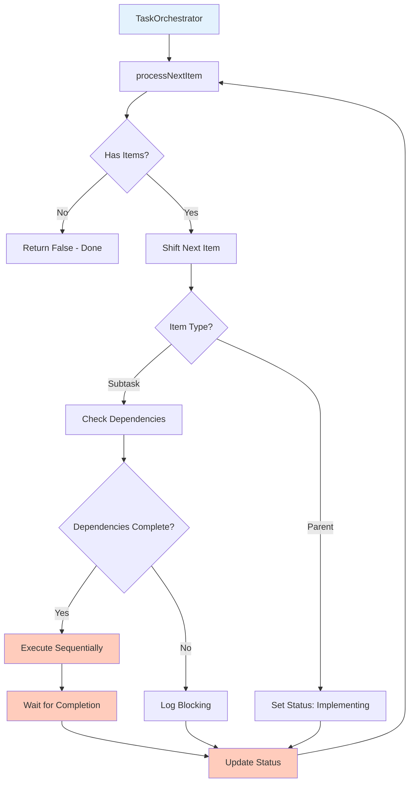
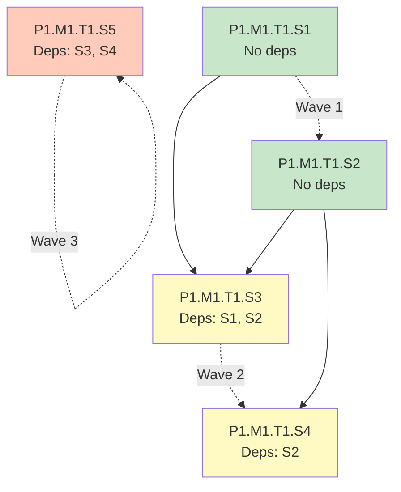
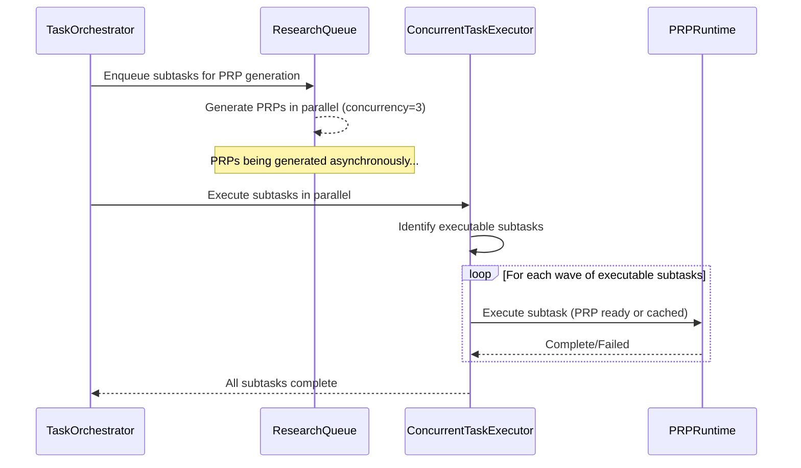
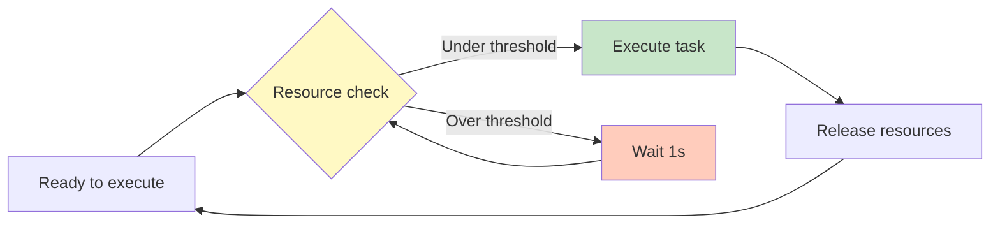
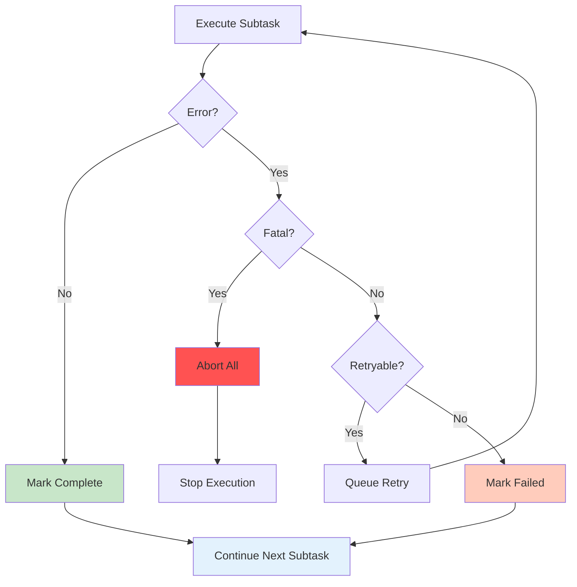
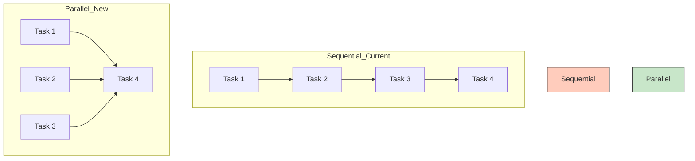
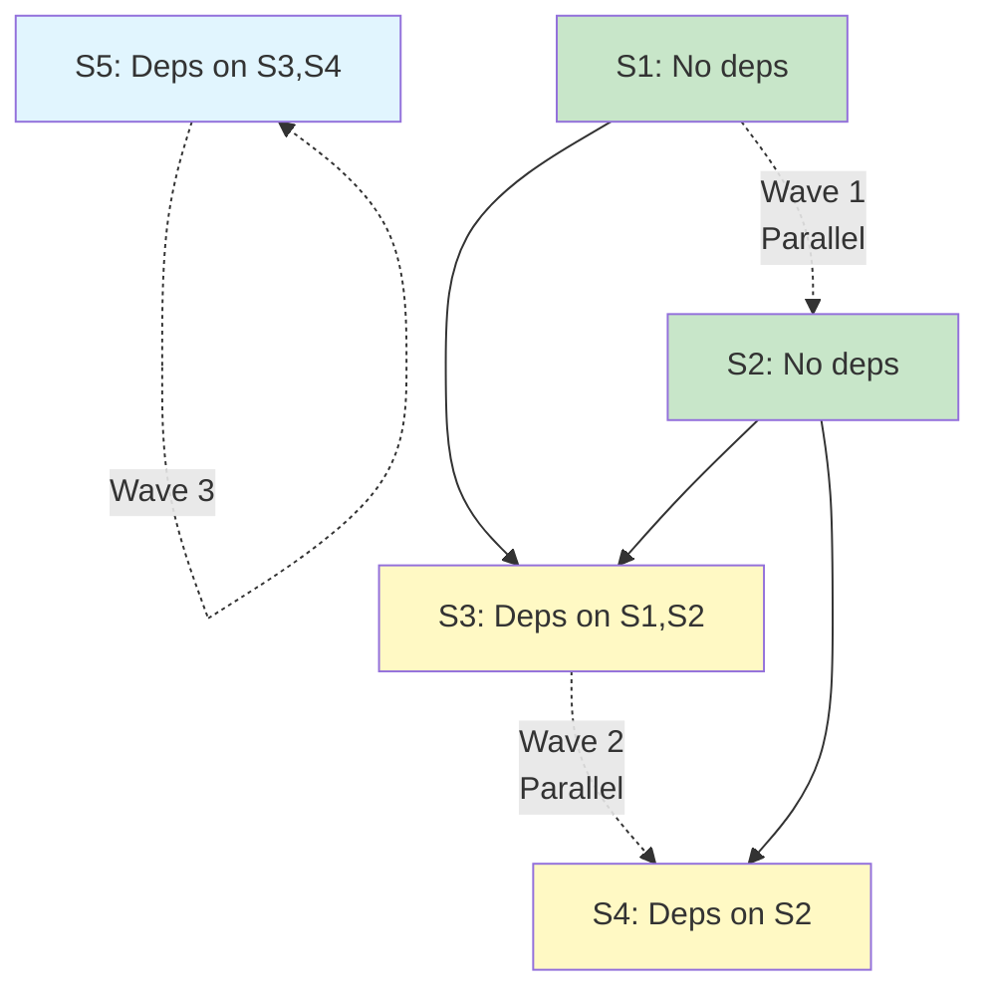
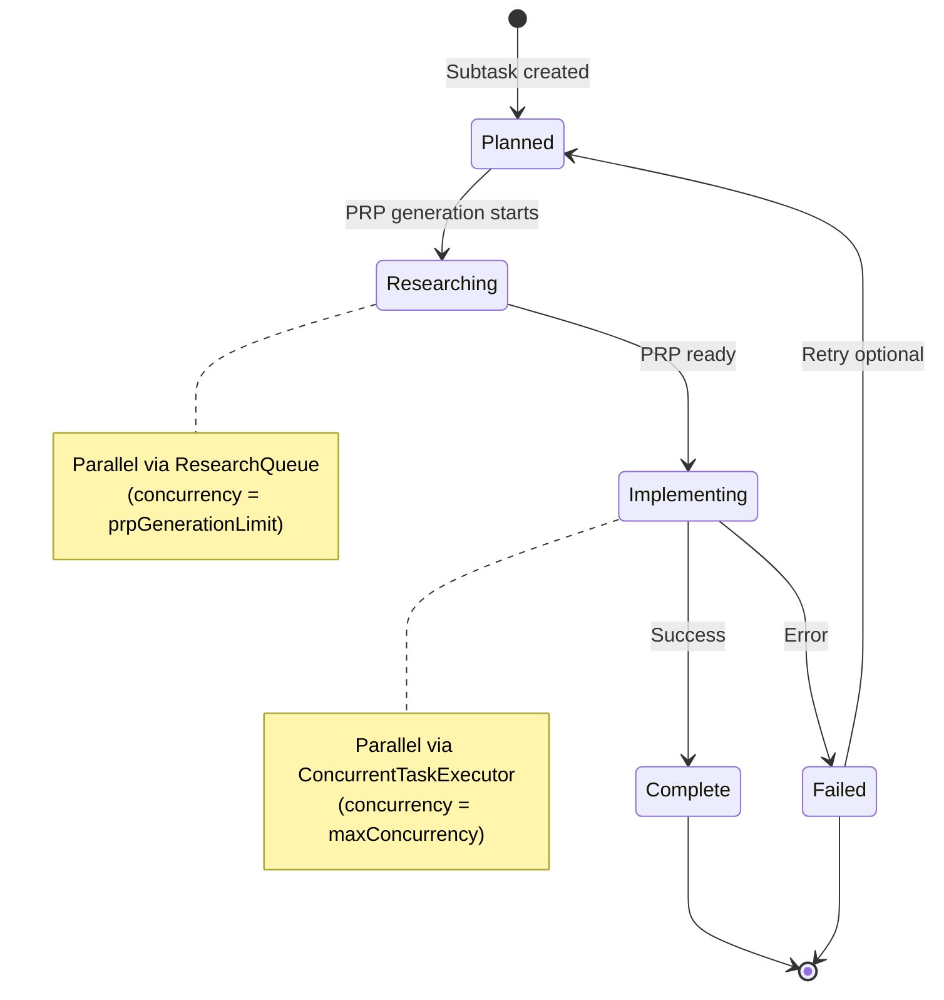
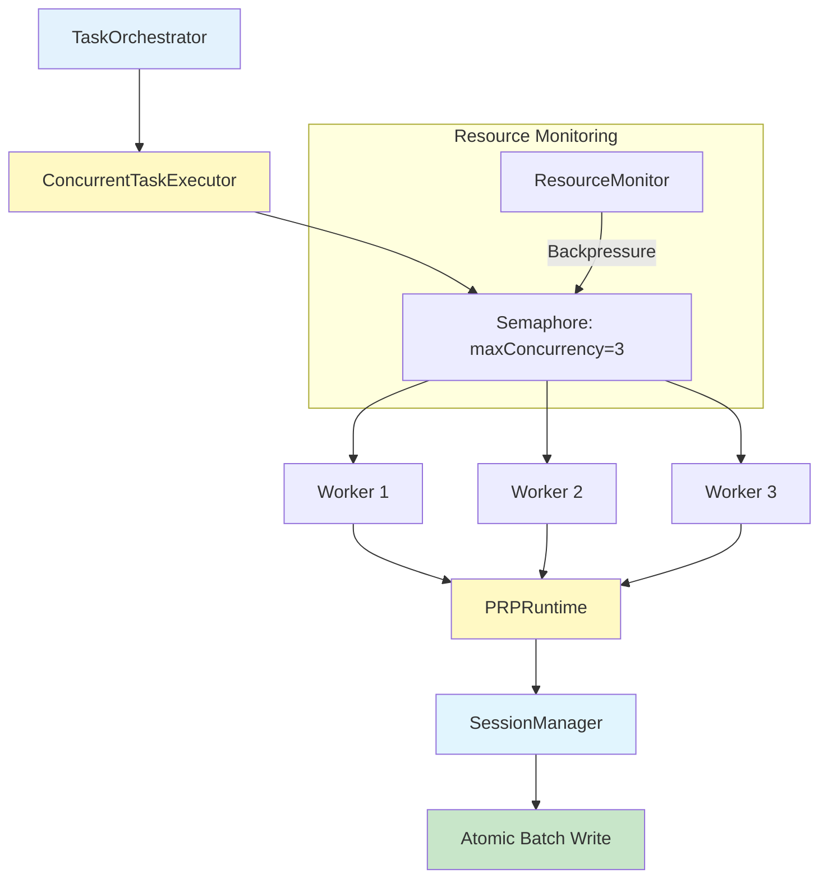

# Parallel Execution Strategy Design

> Comprehensive design for concurrent subtask execution in the PRP Pipeline with dependency-aware scheduling, resource management, and state synchronization

**Status**: Design
**Last Updated**: 2026-01-26
**Version**: 1.0.0
**Work Item**: P3.M1.T1.S1 - Design parallel execution strategy

---

## Table of Contents

- [Executive Summary](#executive-summary)
- [Current State Analysis](#current-state-analysis)
- [Executable Subtask Identification](#executable-subtask-identification)
- [Concurrent Execution Limits](#concurrent-execution-limits)
- [PRP Generation vs Implementation Parallelization](#prp-generation-vs-implementation-parallelization)
- [Resource Limits and Backpressure](#resource-limits-and-backpressure)
- [State Updates for Concurrent Tasks](#state-updates-for-concurrent-tasks)
- [Error Handling in Concurrent Context](#error-handling-in-concurrent-context)
- [Parallel Scheduler Pseudocode](#parallel-scheduler-pseudocode)
- [Diagrams](#diagrams)
- [Integration Points](#integration-points)
- [Testing Strategy](#testing-strategy)
- [See Also](#see-also)

---

## Executive Summary

### Problem Statement

The current PRP Pipeline executes subtasks sequentially through `TaskOrchestrator.processNextItem()`, processing one subtask at a time despite having dependency resolution logic. With hundreds of subtasks, this linear execution creates a significant performance bottleneck. Independent subtasks that could run concurrently must wait for their turn in the sequential queue.

### Solution Overview

This document designs a **parallel execution strategy** that:

1. **Identifies executable subtasks** - Finds subtasks with satisfied dependencies using existing `canExecute()` logic
2. **Executes concurrently** - Runs up to N subtasks in parallel using a semaphore-based pool
3. **Respects dependencies** - Only executes subtasks whose dependencies are Complete
4. **Manages resources** - Implements backpressure when resource thresholds are approached
5. **Maintains state** - Thread-safe status updates via existing SessionManager batching
6. **Handles errors gracefully** - Isolated failures with Promise.allSettled() aggregation

### Key Design Decisions

| Aspect                    | Decision                              | Rationale                                                                     |
| ------------------------- | ------------------------------------- | ----------------------------------------------------------------------------- |
| **Parallelization Scope** | Subtask-level only                    | Subtasks are atomic work units; subtasks only depend on subtasks in same task |
| **Concurrency Control**   | Semaphore pattern                     | Proven by ResearchQueue; simple backpressure mechanism                        |
| **Default Pool Size**     | 3 (configurable)                      | Matches existing ResearchQueue; conservative for LLM API limits               |
| **State Updates**         | Sequential within batch, atomic write | SessionManager batching pattern requires thread-safe updates                  |
| **Error Handling**        | Promise.allSettled()                  | Isolated failures don't stop other parallel tasks                             |

### Success Criteria

- [ ] Design enables concurrent subtask execution while respecting dependencies
- [ ] Pseudocode is specific and actionable for TypeScript implementation
- [ ] All patterns reference existing codebase (ResearchQueue, TaskOrchestrator, SessionManager)
- [ ] Resource limits are configurable and documented
- [ ] State management patterns are thread-safe
- [ ] Error handling scenarios are covered (task failure, resource exhaustion)

---

## Current State Analysis

### Sequential Execution Pattern

The current `TaskOrchestrator` processes subtasks sequentially through `processNextItem()`:

```typescript
// src/core/task-orchestrator.ts:866-895
async processNextItem(): Promise<boolean> {
  if (this.#executionQueue.length === 0) {
    return false; // Done
  }

  const nextItem = this.#executionQueue.shift()!;
  await this.#delegateByType(nextItem); // Executes ONE item
  await this.refreshBacklog();

  return true; // More items may remain
}
```

**Key Characteristic**: One subtask executes at a time, even when multiple subtasks have satisfied dependencies.

### Dependency Resolution Exists

The orchestrator already has dependency checking logic:

```typescript
// src/core/task-orchestrator.ts:308-322
canExecute(subtask: Subtask): boolean {
  const dependencies = getDependencies(subtask, this.#backlog);

  if (dependencies.length === 0) {
    return true; // No dependencies = can execute
  }

  return dependencies.every(dep => dep.status === 'Complete');
}
```

**Gap**: This logic exists but isn't leveraged for parallel execution. Subtasks with satisfied dependencies still wait in the sequential queue.

### ResearchQueue: Existing Parallel Pattern

The `ResearchQueue` already demonstrates parallel execution for PRP generation:

```typescript
// src/core/research-queue.ts:57-203
export class ResearchQueue {
  readonly maxSize: number; // Concurrency limit (default: 3)
  readonly researching: Map<string, Promise<PRPDocument>>; // In-flight tracking

  async processNext(backlog: Backlog): Promise<void> {
    // Backpressure: wait for capacity
    if (this.queue.length === 0 || this.researching.size >= this.maxSize) {
      return;
    }

    const task = this.queue.shift();
    const promise = this.#prpGenerator.generate(task, backlog).finally(() => {
      this.researching.delete(task.id);
      this.processNext(backlog); // Start next when complete
    });

    this.researching.set(task.id, promise);
  }
}
```

**Key Pattern**: Semaphore via `maxSize` limit, Map for in-flight tracking, `finally()` for cleanup and next-start.

### Performance Bottleneck

**Problem**: With hundreds of subtasks, sequential execution time is linear.

**Example**:

- 100 subtasks × 5 minutes each = 500 minutes (8.3 hours) sequentially
- With 3-way parallelism: ~167 minutes (2.8 hours) for independent tasks

**Opportunity**: Many subtasks within a task have no dependencies on each other and can execute concurrently.

### Groundswell @Task Decorator Limitations

The Groundswell framework provides a `@Task({ concurrent: true })` decorator:

```typescript
// node_modules/groundswell/src/decorators/task.ts:105-145
@Task({ concurrent: true })
async createAllWorkers(): Promise<WorkerWorkflow[]> {
  return this.workers.map(w => new WorkerWorkflow(w.id, this));
}
// Uses Promise.allSettled() for parallel execution
```

**Limitation**: Only works for `Workflow` instances. Subtasks are NOT workflows, so this pattern cannot be directly applied.

### Current Sequential Flow Diagram



**Observation**: The sequential wait (L) creates the bottleneck. Multiple subtasks could be in the "Execute" phase simultaneously.

---

## Executable Subtask Identification

### Dependency-Aware Selection Algorithm

To execute subtasks in parallel, we must identify which subtasks are ready to run:

```typescript
/**
 * Gets subtasks that can execute (dependencies satisfied)
 * @param subtasks - All subtasks to filter
 * @param backlog - Current backlog for dependency resolution
 * @returns Subtasks with status='Planned' and all dependencies Complete
 */
function getExecutableSubtasks(
  subtasks: Subtask[],
  backlog: Backlog
): Subtask[] {
  return subtasks.filter(subtask => {
    // Must be in Planned state
    if (subtask.status !== 'Planned') {
      return false;
    }

    // All dependencies must be Complete
    return canExecute(subtask, backlog);
  });
}

/**
 * Check if subtask can execute (all dependencies Complete)
 * Leverages existing TaskOrchestrator.canExecute() logic
 */
function canExecute(subtask: Subtask, backlog: Backlog): boolean {
  const dependencies = getDependencies(subtask, backlog);

  if (dependencies.length === 0) {
    return true; // No dependencies
  }

  return dependencies.every(dep => dep.status === 'Complete');
}
```

### Dependency Graph Traversal Pattern

Subtasks form a directed acyclic graph (DAG) within each task:

```typescript
// Subtask dependencies are within task boundary only
interface Subtask {
  id: string; // e.g., "P1.M1.T1.S2"
  dependencies: string[]; // e.g., ["P1.M1.T1.S1"] - same task only
}
```

**Traversal Strategy**:

1. **Topological Sort**: Process subtasks in dependency order
2. **Parallel Waves**: Execute all ready subtasks in parallel
3. **Barrier Sync**: Wait for wave completion before next wave

### Pseudocode: Parallel Wave Execution

```typescript
async function executeParallelWaves(
  subtasks: Subtask[],
  backlog: Backlog,
  maxConcurrency: number
): Promise<void> {
  const remaining = new Set(subtasks);
  const completed = new Set<string>();

  while (remaining.size > 0) {
    // Find executable subtasks (dependencies satisfied)
    const executable = Array.from(remaining).filter(s => {
      if (s.status !== 'Planned') return false;

      // Check if all dependencies are in completed set
      return s.dependencies.every(depId => completed.has(depId));
    });

    if (executable.length === 0) {
      // Deadlock detection: circular dependencies or all blocked
      throw new Error('Deadlock: no executable subtasks found');
    }

    // Execute this wave with concurrency limit
    await executeWithConcurrencyLimit(executable, maxConcurrency, backlog);

    // Mark completed
    executable.forEach(s => {
      remaining.delete(s);
      completed.add(s.id);
    });
  }
}
```

### Dependency Graph Example



**Wave 1**: S1, S2 execute in parallel (no dependencies)
**Wave 2**: S3, S4 execute in parallel (dependencies S1, S2 satisfied)
**Wave 3**: S5 executes (dependencies S3, S4 satisfied)

### Integration with Existing Code

**Leverage**:

- `TaskOrchestrator.canExecute()` - Already implements dependency checking
- `TaskOrchestrator.getBlockingDependencies()` - Returns incomplete dependencies
- `getDependencies()` from `task-utils.ts` - Resolves dependency IDs to Subtask objects

**Implementation Location**: This logic belongs in the new `ConcurrentTaskExecutor` class (P3.M1.T1.S2).

---

## Concurrent Execution Limits

### Pool Size Configuration

Parallel execution must be bounded to prevent resource exhaustion:

```typescript
interface ParallelismConfig {
  enabled: boolean;
  maxConcurrency: number; // Default: 3
  prpGenerationLimit: number; // Default: 3 (existing ResearchQueue)
  resourceThreshold: number; // Default: 0.8 (80% resource usage)
}
```

**Default Value Rationale**:

- **3** matches existing ResearchQueue concurrency
- Conservative for LLM API rate limits
- Prevents overwhelming system resources
- Can be increased via CLI flag (`--parallelism`)

### Semaphore Pattern Implementation

A semaphore controls concurrent execution:

```typescript
/**
 * Semaphore for concurrency control
 * Based on ResearchQueue maxSize pattern
 */
class Semaphore {
  private available: number;
  private waitQueue: Array<() => void> = [];

  constructor(private max: number) {
    this.available = max;
  }

  async acquire(): Promise<void> {
    if (this.available > 0) {
      this.available--;
      return;
    }

    // Wait in queue until released
    return new Promise<void>(resolve => {
      this.waitQueue.push(resolve);
    });
  }

  release(): void {
    this.available++;

    // Wake up next waiting worker
    const next = this.waitQueue.shift();
    if (next) {
      this.available--;
      next();
    }
  }
}
```

**Usage Pattern**:

```typescript
const semaphore = new Semaphore(config.maxConcurrency);

for (const subtask of executableSubtasks) {
  // These will execute in parallel, up to maxConcurrency
  Promise.resolve().then(async () => {
    await semaphore.acquire(); // Block if at limit

    try {
      await executeSubtask(subtask);
    } finally {
      semaphore.release(); // Allow next to proceed
    }
  });
}
```

### Recommended Pool Sizes

| Workload Type                   | Recommended Pool Size | Rationale                             |
| ------------------------------- | --------------------- | ------------------------------------- |
| **LLM-Bound** (PRP generation)  | 3-5                   | LLM API rate limits, token costs      |
| **I/O-Bound** (file operations) | 5-10                  | File I/O is less restrictive than LLM |
| **CPU-Bound** (build/test)      | 2-4                   | Match CPU core count, avoid thrashing |
| **Mixed**                       | 3-6                   | Balance between LLM and I/O           |

**Adaptive Sizing** (Future Enhancement):

```typescript
function calculateOptimalPoolSize(
  workloadType: 'llm' | 'io' | 'cpu' | 'mixed',
  systemResources: SystemResources
): number {
  const basePoolSize = {
    llm: 3,
    io: 10,
    cpu: Math.max(2, Math.floor(systemResources.cpuCores * 0.75)),
    mixed: 6,
  };

  // Adjust based on available memory
  const memoryFactor = Math.min(1, systemResources.availableMemoryGB / 8);

  return Math.ceil(basePoolSize[workloadType] * memoryFactor);
}
```

### ResearchQueue Concurrency

The existing ResearchQueue has a separate concurrency limit for PRP generation:

```typescript
// src/core/research-queue.ts:94-106
constructor(
  sessionManager: SessionManager,
  maxSize: number = 3,  // PRP generation concurrency
  noCache: boolean = false,
  cacheTtlMs: number = 24 * 60 * 60 * 1000
) {
  this.maxSize = maxSize;
  // ...
}
```

**Two-Phase Parallelization**:

- **Phase 1**: PRP generation via ResearchQueue (concurrency: `prpGenerationLimit`)
- **Phase 2**: Implementation execution via ConcurrentTaskExecutor (concurrency: `maxConcurrency`)

These can operate independently with different limits.

---

## PRP Generation vs Implementation Parallelization

### Two-Phase Parallelization Strategy

The PRP Pipeline has two distinct phases that can be parallelized:

#### Phase 1: PRP Generation (ResearchQueue)

**Status**: Already implemented with concurrency=3

```typescript
// src/core/research-queue.ts:147-167
async processNext(backlog: Backlog): Promise<void> {
  if (this.queue.length === 0 || this.researching.size >= this.maxSize) {
    return;  // Backpressure: wait for capacity
  }

  const task = this.queue.shift();
  const promise = this.#prpGenerator.generate(task, backlog)
    .finally(() => {
      this.researching.delete(task.id);
      this.processNext(backlog);  // Start next when complete
    });

  this.researching.set(task.id, promise);
}
```

**Characteristics**:

- "Research ahead" pattern - generates PRPs before execution
- Cache-aware - skips cached PRPs
- Backpressure via `maxSize` limit

#### Phase 2: Implementation Execution (New - ConcurrentTaskExecutor)

**Status**: To be implemented in P3.M1.T1.S2

```typescript
// src/core/concurrent-executor.ts (new file)
export class ConcurrentTaskExecutor {
  async executeParallel(subtasks: Subtask[]): Promise<void> {
    // Execute subtasks with dependency awareness
    // Semaphore-based concurrency control
    // Resource-aware backpressure
  }
}
```

**Characteristics**:

- Dependency-aware - only executes subtasks with satisfied dependencies
- Resource-aware - monitors memory, file handles, LLM API limits
- Isolated error handling - one failure doesn't stop others

### Coordination Between Phases



**Key Coordination Points**:

1. **PRP Readiness**: Subtask waits for PRP if not yet generated
2. **Cache Hits**: Bypass ResearchQueue if PRP is cached
3. **Status Updates**: Both phases update status through SessionManager

### Timeline Comparison

```mermaid
gantt
    title Sequential vs Parallel Execution Timeline
    dateFormat X
    axisFormat %L

    section Sequential
    S1: 0, 1
    S2: 1, 2
    S3: 2, 3
    S4: 3, 4

    section Parallel (Concurrency=2)
    P1: 0, 1
    P2: 0, 1
    P3: 1, 2
    P4: 2, 3
```



**Sequential**: 4 time units
**Parallel (concurrency=2)**: 3 time units

With 100 subtasks and concurrency=3:

- **Sequential**: 500 minutes
- **Parallel (ideal)**: ~167 minutes (3x speedup for independent tasks)

### Configuration Options

```typescript
interface ParallelismConfig {
  enabled: boolean;
  maxConcurrency: number; // Implementation execution (default: 3)
  prpGenerationLimit: number; // PRP generation (default: 3)
  resourceThreshold: number; // Backpressure threshold (default: 0.8)
}
```

**CLI Flags** (P3.M1.T1.S3):

```bash
# Default: both phases with concurrency=3
prd run

# Increase implementation concurrency
prd run --parallelism 5

# Increase PRP generation concurrency
prd run --parallelism-prp 5

# Disable parallel execution entirely
prd run --parallelism 0
```

---

## Resource Limits and Backpressure

### Resource Categories

Parallel execution must monitor and limit several resource types:

| Resource         | Limit                     | Monitoring Method       | Backpressure Action             |
| ---------------- | ------------------------- | ----------------------- | ------------------------------- |
| **LLM API**      | Rate limit (requests/min) | Request counter         | Delay before next request       |
| **Memory**       | 80% of heap size          | `process.memoryUsage()` | Wait for GC, reduce concurrency |
| **File Handles** | OS limit (ulimit -n)      | `lsof -p $$ \| wc -l`   | Wait for handle release         |
| **Disk I/O**     | IOPS limit                | `iostat` monitoring     | Throttle writes                 |

### Resource Monitoring

```typescript
interface ResourceUsage {
  memory: {
    used: number; // Bytes
    total: number; // Bytes
    percentage: number;
  };
  fileHandles: {
    open: number;
    limit: number;
    percentage: number;
  };
  llmRequests: {
    inFlight: number;
    rateLimitPerMinute: number;
    resetTime: Date;
  };
}

/**
 * Monitors system resource usage
 * Reference: src/utils/resource-monitor.ts (if exists, or new)
 */
class ResourceMonitor {
  async getCurrentUsage(): Promise<ResourceUsage> {
    return {
      memory: await this.#getMemoryUsage(),
      fileHandles: await this.#getFileHandleUsage(),
      llmRequests: this.#getLLMRequestUsage(),
    };
  }

  async #getMemoryUsage(): Promise<ResourceUsage['memory']> {
    const usage = process.memoryUsage();
    const total = usage.heapTotal;
    const used = usage.heapUsed;
    return {
      used,
      total,
      percentage: used / total,
    };
  }

  async #getFileHandleUsage(): Promise<ResourceUsage['fileHandles']> {
    // Use lsof on macOS, /proc on Linux
    const result = await exec('lsof -p $$ | wc -l');
    const open = parseInt(result.stdout.trim());
    const limit = parseInt(await exec('ulimit -n').then(r => r.stdout.trim()));
    return {
      open,
      limit,
      percentage: open / limit,
    };
  }

  #getLLMRequestUsage(): ResourceUsage['llmRequests'] {
    // Track in-flight requests and rate limits
    return this.llmTracker.getCurrentUsage();
  }
}
```

### Backpressure Mechanism

When resource thresholds are approached, execution must slow down:

```typescript
/**
 * Execute with resource backpressure
 * Waits if resources are above threshold before starting
 */
async function executeWithBackpressure(
  subtask: Subtask,
  resourceMonitor: ResourceMonitor,
  threshold: number
): Promise<void> {
  // Wait for resources to be available
  while (true) {
    const usage = await resourceMonitor.getCurrentUsage();

    if (
      usage.memory.percentage < threshold &&
      usage.fileHandles.percentage < threshold &&
      usage.llmRequests.inFlight < usage.llmRequests.rateLimitPerMinute
    ) {
      break; // Resources available
    }

    // Wait before retrying (exponential backoff)
    await new Promise(resolve => setTimeout(resolve, 1000));
  }

  // Execute subtask
  await executeSubtask(subtask);
}
```

### Backpressure Flow Diagram



### Resource Threshold Configuration

```typescript
const DEFAULT_RESOURCE_THRESHOLD = 0.8; // 80%

interface ResourceConfig {
  memoryThreshold: number; // Default: 0.8 (80% of heap)
  fileHandleThreshold: number; // Default: 0.7 (70% of ulimit)
  llmRateLimit: number; // Default: 50 requests/min
  backpressureDelay: number; // Default: 1000ms
}
```

### Gotchas and Considerations

**File Handle Monitoring Overhead** (from system_context.md):

> "File handle monitoring on macOS uses `lsof` which is slower than `/proc` on Linux"

**Mitigation**:

- Cache file handle counts
- Reduce check frequency (every 5 seconds instead of every second)
- Use environment-specific optimizations

**LLM API Rate Limits**:

- Different models have different limits
- Implement per-model rate limiting
- Use exponential backoff for rate limit errors

**Memory Fragmentation**:

- Long-running processes may fragment heap
- Monitor RSS (Resident Set Size) in addition to heap
- Trigger GC if memory usage is high

---

## State Updates for Concurrent Tasks

### Thread-Safe Status Updates

When multiple subtasks execute concurrently, status updates must be coordinated:

**Challenge**: Multiple workers updating the same backlog simultaneously

**Solution**: Sequential status updates within batch + atomic batch write

### Existing Batching Pattern

SessionManager already implements batching for efficient state updates:

```typescript
// src/core/session-manager.ts:1027-1058
async updateItemStatus(itemId: string, status: Status): Promise<Backlog> {
  const currentBacklog = this.#currentSession.taskRegistry;
  const updated = updateItemStatusUtil(currentBacklog, itemId, status);

  // BATCHING: Accumulate in memory instead of immediate write
  this.#pendingUpdates = updated;
  this.#dirty = true;
  this.#updateCount++;

  // Update internal session state
  this.#currentSession = {
    ...this.#currentSession,
    taskRegistry: updated,
  };

  // NOTE: No immediate write - caller must call flushUpdates()
  return updated;
}

// src/core/session-manager.ts:740-882
async flushUpdates(): Promise<void> {
  if (!this.#dirty) {
    return;  // No pending changes
  }

  // Atomic write via temp file + rename
  await this.saveBacklog(this.#pendingUpdates!);

  // Reset batching state
  this.#dirty = false;
  this.#pendingUpdates = null;
  this.#updateCount = 0;
}
```

**Key Pattern**: Updates are accumulated in memory, then flushed atomically.

### Concurrent Update Coordination

**Critical Rule**: Never update the same subtask from multiple workers

```typescript
/**
 * Execute subtasks with coordinated state updates
 */
async function executeWithCoordinatedUpdates(
  subtasks: Subtask[],
  orchestrator: TaskOrchestrator
): Promise<void> {
  // Each worker gets its own subtask
  const workers = subtasks.map(subtask => async () => {
    // CRITICAL: Each worker only updates its own subtask
    await orchestrator.setStatus(
      subtask.id,
      'Implementing',
      'Starting execution'
    );

    try {
      await orchestrator.prpRuntime.executeSubtask(subtask, backlog);

      // Update to Complete
      await orchestrator.setStatus(
        subtask.id,
        'Complete',
        'Execution successful'
      );
    } catch (error) {
      // Update to Failed
      await orchestrator.setStatus(subtask.id, 'Failed', error.message);
    }
  });

  // Execute all workers in parallel
  await Promise.allSettled(workers.map(w => w()));

  // Flush all state updates atomically
  await orchestrator.sessionManager.flushUpdates();
}
```

**Coordination Mechanisms**:

1. **Worker-Subtask Isolation**: Each worker only modifies one subtask
2. **Sequential Updates**: `setStatus()` calls are sequential within a worker
3. **Atomic Flush**: Single `flushUpdates()` at the end

### State Transition Ordering

Even with parallel execution, state transitions must be ordered:

```
Valid:   Planned → Implementing → Complete
Invalid: Planned → Complete (skipped Implementing)
Invalid: Implementing → Planned (backwards)
```

**Enforcement**:

```typescript
// src/core/task-orchestrator.ts:263-287
async setStatus(itemId: string, status: Status, reason?: string): Promise<void> {
  const currentItem = findItem(this.#backlog, itemId);
  const oldStatus = currentItem?.status ?? 'Unknown';

  // Log transition
  this.#logger.info({ itemId, oldStatus, newStatus: status }, 'Status transition');

  // Persist through SessionManager
  await this.sessionManager.updateItemStatus(itemId, status);

  // Reload backlog
  await this.refreshBacklog();
}
```

### Refresh Backlog After Concurrent Updates

After parallel execution, the backlog must be refreshed:

```typescript
// src/core/task-orchestrator.ts:423-431
async refreshBacklog(): Promise<void> {
  const currentSession = this.sessionManager.currentSession;
  if (!currentSession) {
    throw new Error('Cannot refresh backlog: no active session');
  }

  // Reload from session state (not cached value)
  this.#backlog = currentSession.taskRegistry;
}
```

**Usage Pattern**:

```typescript
// 1. Execute batch of subtasks in parallel
await executeBatch(executableSubtasks);

// 2. Flush all status updates
await this.sessionManager.flushUpdates();

// 3. Refresh backlog to get latest state
await this.refreshBacklog();

// 4. Identify next wave of executable subtasks
const nextWave = getExecutableSubtasks(remainingSubtasks, this.#backlog);
```

### Conflict Resolution

**Scenario**: Two workers try to update the same subtask

**Prevention**: Assign each subtask to exactly one worker

```typescript
// Assign subtasks to workers (one-to-one mapping)
const assignments = new Map<string, Subtask>();
for (const subtask of executableSubtasks) {
  if (assignments.has(subtask.id)) {
    throw new Error(`Duplicate subtask assignment: ${subtask.id}`);
  }
  assignments.set(subtask.id, subtask);
}
```

**Detection**: Log if multiple workers try to update same subtask

```typescript
// Add locking mechanism (if needed)
const updating = new Set<string>();

async setStatus(itemId: string, status: Status): Promise<void> {
  if (updating.has(itemId)) {
    this.#logger.warn({ itemId }, 'Concurrent update detected');
  }
  updating.add(itemId);

  try {
    await this.sessionManager.updateItemStatus(itemId, status);
  } finally {
    updating.delete(itemId);
  }
}
```

---

## Error Handling in Concurrent Context

### Isolated Error Handling

In parallel execution, one subtask failure should not stop others:

```typescript
/**
 * Execute subtasks with isolated error handling
 * Uses Promise.allSettled() to continue on failures
 */
async function executeWithIsolation(
  subtasks: Subtask[],
  orchestrator: TaskOrchestrator
): Promise<ExecutionResult[]> {
  const workers = subtasks.map(subtask => async () => {
    try {
      await orchestrator.prpRuntime.executeSubtask(subtask, backlog);
      return { subtaskId: subtask.id, success: true };
    } catch (error) {
      // Log but don't throw - isolate failures
      orchestrator.logger.error(
        { subtaskId: subtask.id, error },
        'Subtask failed (continuing with other tasks)'
      );
      return { subtaskId: subtask.id, success: false, error };
    }
  });

  // Execute all workers, continuing on failures
  const results = await Promise.allSettled(workers.map(w => w()));

  return results.map(r => {
    if (r.status === 'fulfilled') {
      return r.value;
    } else {
      return { success: false, error: r.reason };
    }
  });
}
```

### Error Aggregation

Collect all errors for reporting:

```typescript
interface ExecutionErrors {
  failures: Array<{
    subtaskId: string;
    error: Error;
    timestamp: Date;
  }>;
  total: number;
}

/**
 * Aggregate errors from parallel execution
 */
function aggregateErrors(
  results: PromiseSettledResult<ExecutionResult>[]
): ExecutionErrors {
  const failures: ExecutionErrors['failures'] = [];

  for (const result of results) {
    if (result.status === 'rejected') {
      failures.push({
        subtaskId: result.reason.subtaskId,
        error: result.reason.error,
        timestamp: new Date(),
      });
    } else if (result.value && !result.value.success) {
      failures.push({
        subtaskId: result.value.subtaskId,
        error: result.value.error,
        timestamp: new Date(),
      });
    }
  }

  return {
    failures,
    total: failures.length,
  };
}
```

### Retry Strategy for Failed Parallel Tasks

Not all errors should trigger retries:

```typescript
/**
 * Determine if error is retryable
 */
function isRetryableError(error: Error): boolean {
  const retryablePatterns = [
    /network/i,
    /timeout/i,
    /rate limit/i,
    /ECONNRESET/,
    /ETIMEDOUT/,
  ];

  return retryablePatterns.some(pattern => pattern.test(error.message));
}

/**
 * Retry failed subtasks
 */
async function retryFailedSubtasks(
  failures: ExecutionErrors['failures'],
  orchestrator: TaskOrchestrator,
  maxRetries: number = 3
): Promise<void> {
  for (const failure of failures) {
    if (!isRetryableError(failure.error)) {
      orchestrator.logger.warn(
        { subtaskId: failure.subtaskId },
        'Non-retryable error - skipping retry'
      );
      continue;
    }

    orchestrator.logger.info(
      { subtaskId: failure.subtaskId },
      'Retrying failed subtask'
    );

    // Retry logic...
  }
}
```

### Fatal Error Detection

Some errors should abort all parallel execution:

```typescript
/**
 * Check if error is fatal (should abort all execution)
 */
function isFatalError(error: Error): boolean {
  const fatalPatterns = [
    /out of memory/i,
    /disk full/i,
    /corruption/i,
    /authentication/i,
    /permission denied/i,
  ];

  return fatalPatterns.some(pattern => pattern.test(error.message));
}

/**
 * Execute with fatal error detection
 */
async function executeWithFatalDetection(
  subtasks: Subtask[],
  orchestrator: TaskOrchestrator
): Promise<void> {
  const workers = subtasks.map(subtask => async () => {
    try {
      await orchestrator.prpRuntime.executeSubtask(subtask, backlog);
    } catch (error) {
      if (isFatalError(error)) {
        orchestrator.logger.error(
          { error },
          'Fatal error detected - aborting all execution'
        );
        throw new FatalExecutionError('Fatal error', error);
      }
      throw error; // Re-throw non-fatal errors
    }
  });

  try {
    await Promise.all(workers.map(w => w()));
  } catch (error) {
    if (error instanceof FatalExecutionError) {
      // Abort all execution
      throw error.originalError;
    }
    // Handle non-fatal errors
  }
}
```

### Fire-and-Forget Error Handling Pattern

For background operations (like ResearchQueue.processNext()):

```typescript
// src/core/task-orchestrator.ts:726-733
this.researchQueue.processNext(this.#backlog).catch(error => {
  const errorMessage = error instanceof Error ? error.message : String(error);
  this.#logger.error({ error: errorMessage }, 'Background research error');
  // Don't throw - fire-and-forget
});
```

**Pattern**: Log error, don't throw, continue with other tasks

### Error Handling Flow Diagram



---

## Parallel Scheduler Pseudocode

### Complete Parallel Scheduler Algorithm

The following pseudocode combines all components into a comprehensive parallel scheduler:

```typescript
/**
 * Parallel Scheduler - Design Pseudocode
 * This is design documentation, not implementation code
 */

interface ParallelSchedulerConfig {
  maxConcurrency: number; // Default: 3
  prpGenerationLimit: number; // Default: 3 (existing ResearchQueue)
  resourceThreshold: number; // Default: 0.8 (80% resource usage)
}

class ParallelScheduler {
  private orchestrator: TaskOrchestrator;
  private researchQueue: ResearchQueue;
  private resourceMonitor: ResourceMonitor;
  private config: ParallelSchedulerConfig;

  /**
   * Main parallel execution loop
   * Replaces sequential processNextItem() loop
   */
  async executeParallel(backlog: Backlog): Promise<void> {
    const plannedSubtasks = this.getPlannedSubtasks(backlog);

    // Execute until all subtasks are Complete or Failed
    while (this.hasIncompleteTasks(plannedSubtasks)) {
      // Phase 1: Identify executable subtasks (dependencies satisfied)
      const executable = this.getExecutableSubtasks(plannedSubtasks);

      if (executable.length === 0) {
        // No tasks ready - check for blocked/deadlocked tasks
        await this.handleDeadlockDetection(plannedSubtasks);
        break;
      }

      // Phase 2: Execute batch with concurrency limit
      await this.executeBatch(executable, backlog);

      // Phase 3: Refresh backlog to get latest state
      await this.orchestrator.refreshBacklog();
    }
  }

  /**
   * Get subtasks that can execute (dependencies satisfied)
   */
  private getExecutableSubtasks(subtasks: Subtask[]): Subtask[] {
    return subtasks.filter(subtask => {
      // Must be in Planned state
      if (subtask.status !== 'Planned') {
        return false;
      }

      // All dependencies must be Complete
      return this.canExecute(subtask);
    });
  }

  /**
   * Execute a batch of subtasks with concurrency limit
   */
  private async executeBatch(
    subtasks: Subtask[],
    backlog: Backlog
  ): Promise<void> {
    // Create semaphore for concurrency control
    const semaphore = new Semaphore(this.config.maxConcurrency);

    // Create worker for each subtask
    const workers = subtasks.map(subtask => {
      return async () => {
        // Acquire semaphore (wait if at limit)
        await semaphore.acquire();

        try {
          // Check resource limits (backpressure)
          await this.waitForResourceAvailability();

          // Execute subtask via PRPRuntime
          await this.orchestrator.prpRuntime.executeSubtask(subtask, backlog);

          // Update status to Complete
          await this.orchestrator.setStatus(
            subtask.id,
            'Complete',
            'Parallel execution complete'
          );
        } catch (error) {
          // Handle error (non-fatal, continue with other tasks)
          await this.orchestrator.setStatus(
            subtask.id,
            'Failed',
            error instanceof Error ? error.message : String(error)
          );
        } finally {
          // Release semaphore for next task
          semaphore.release();

          // Flush state updates periodically
          await this.orchestrator.sessionManager.flushUpdates();
        }
      };
    });

    // Execute all workers in parallel (semaphore limits concurrency)
    const results = await Promise.allSettled(workers.map(worker => worker()));

    // Log any failures (non-fatal)
    const failures = results.filter(r => r.status === 'rejected');
    if (failures.length > 0) {
      this.logger.warn(
        { failureCount: failures.length },
        'Some parallel tasks failed'
      );
    }
  }

  /**
   * Wait for resource availability (backpressure)
   */
  private async waitForResourceAvailability(): Promise<void> {
    while (true) {
      const usage = await this.resourceMonitor.getCurrentUsage();

      if (
        usage.memory.percentage < this.config.resourceThreshold &&
        usage.fileHandles.percentage < this.config.resourceThreshold
      ) {
        break; // Resources available
      }

      // Wait before retrying
      await new Promise(resolve => setTimeout(resolve, 1000));
    }
  }

  /**
   * Check if subtask can execute (all dependencies Complete)
   */
  private canExecute(subtask: Subtask): boolean {
    const dependencies = getDependencies(subtask, this.backlog);

    return dependencies.every(dep => dep.status === 'Complete');
  }

  /**
   * Detect deadlock (no executable tasks but incomplete tasks remain)
   */
  private async handleDeadlockDetection(subtasks: Subtask[]): Promise<void> {
    const incomplete = subtasks.filter(
      s => s.status !== 'Complete' && s.status !== 'Failed'
    );
    const blocked = incomplete.filter(s => !this.canExecute(s));

    if (blocked.length > 0 && incomplete.length === blocked.length) {
      // All incomplete tasks are blocked - potential deadlock
      const blockers = blocked.map(s => ({
        subtask: s.id,
        blocking: this.orchestrator.getBlockingDependencies(s).map(d => d.id),
      }));

      throw new Error(
        `Deadlock detected: ${blocked.length} tasks blocked\n` +
          `Blockers: ${JSON.stringify(blockers, null, 2)}`
      );
    }
  }
}

/**
 * Semaphore for concurrency control
 * Based on ResearchQueue maxSize pattern
 */
class Semaphore {
  private available: number;
  private waitQueue: Array<() => void> = [];

  constructor(private max: number) {
    this.available = max;
  }

  async acquire(): Promise<void> {
    if (this.available > 0) {
      this.available--;
      return;
    }

    // Wait in queue
    return new Promise<void>(resolve => {
      this.waitQueue.push(resolve);
    });
  }

  release(): void {
    this.available++;

    // Wake up next waiting worker
    const next = this.waitQueue.shift();
    if (next) {
      this.available--;
      next();
    }
  }
}
```

### Key Design Patterns

1. **Semaphore Pattern**: Limits concurrent execution to `maxConcurrency`
2. **Worker Pattern**: Each subtask gets an async worker function
3. **Promise.allSettled()**: Continues on individual failures
4. **Backpressure Loop**: Waits for resources before starting work
5. **Batch Updates**: Flushes state periodically, not per-task
6. **Deadlock Detection**: Identifies when all remaining tasks are blocked

---

## Diagrams

### Sequential vs Parallel Execution Flow



### Dependency Graph with Parallel Execution



### State Transitions for Concurrent Execution



### Resource Backpressure Flow


### Parallel Execution Architecture



---

## Integration Points

### TaskOrchestrator Integration

**File**: `src/core/task-orchestrator.ts`

**Integration**: Add `executeParallel()` method alongside existing `processNextItem()`

**Lines**: 866-895 (processNextItem reference for parallel version)

**Implementation**:

```typescript
// src/core/task-orchestrator.ts (existing)
public async executeParallel(config: ParallelismConfig): Promise<void> {
  if (!config.enabled) {
    this.#logger.info('Parallel execution disabled, skipping');
    return;
  }

  this.#logger.info(
    { maxConcurrency: config.maxConcurrency },
    'Starting parallel execution'
  );

  // Get all subtasks from backlog
  const subtasks = this.#getAllSubtasks(this.#backlog);

  this.#logger.info(
    { subtaskCount: subtasks.length },
    'Found subtasks for parallel execution'
  );

  // Create executor and run parallel execution
  const executor = new ConcurrentTaskExecutor(this, config);
  await executor.executeParallel(subtasks);

  this.#logger.info('Parallel execution complete');
}

// Helper method (lines 960-972)
#getAllSubtasks(backlog: Backlog): Subtask[] {
  const subtasks: Subtask[] = [];

  for (const phase of backlog.backlog) {
    for (const milestone of phase.milestones) {
      for (const task of milestone.tasks) {
        subtasks.push(...task.subtasks);
      }
    }
  }

  return subtasks;
}
```

**Pattern**: Maintain same interface, add parallel execution path as alternative to sequential.

### ResearchQueue Integration

**File**: `src/core/research-queue.ts`

**Integration**: Existing PRP generation parallelization

**Enhancement**: Make concurrency configurable (currently hardcoded to 3)

**Lines**: 94-106 (constructor with maxSize)

**Current State**:

```typescript
// src/core/research-queue.ts:94-106
constructor(
  sessionManager: SessionManager,
  maxSize: number = 3,  // Hardcoded default
  noCache: boolean = false,
  cacheTtlMs: number = 24 * 60 * 60 * 1000
) {
  this.#logger = getLogger('ResearchQueue');
  this.sessionManager = sessionManager;
  this.maxSize = maxSize;
  this.#noCache = noCache;
  this.#cacheTtlMs = cacheTtlMs;
  this.#prpGenerator = new PRPGenerator(sessionManager, noCache, cacheTtlMs);
}
```

**Integration Point**: ResearchQueue is already integrated with TaskOrchestrator (lines 161-170).

**No Changes Needed**: ResearchQueue works as-is for Phase 1 (PRP generation).

### PRPRuntime Integration

**File**: `src/agents/prp-runtime.ts`

**Integration**: Call `executeSubtask()` from parallel workers

**Lines**: 164-257 (executeSubtask method)

**Pattern**: Thread-safe status updates via TaskOrchestrator.setStatus()

```typescript
// In ConcurrentTaskExecutor worker:
await this.orchestrator.prpRuntime.executeSubtask(subtask, backlog);
```

**Thread-Safety**: PRPRuntime calls `orchestrator.setStatus()` which is thread-safe due to:

1. Sequential status updates within a worker
2. Atomic batch writes via SessionManager

### SessionManager Integration

**File**: `src/core/session-manager.ts`

**Integration**: Atomic state updates for concurrent operations

**Pattern**: Existing batching with `flushUpdates()` works for parallel

**Lines**: 740-882 (flushUpdates method)

**Gotcha**: Ensure no concurrent updates to same subtask (enforced by worker-subtask isolation).

**Usage Pattern**:

```typescript
// In ConcurrentTaskExecutor:
for (const subtask of executableSubtasks) {
  await this.orchestrator.setStatus(subtask.id, 'Implementing');
  await this.orchestrator.prpRuntime.executeSubtask(subtask, backlog);
  await this.orchestrator.setStatus(subtask.id, 'Complete');
}

// Flush all updates atomically
await this.orchestrator.sessionManager.flushUpdates();
```

### CLI Integration (P3.M1.T1.S3)

**File**: `src/cli/index.ts`

**Integration**: Add `--parallelism` and `--parallelism-prp` flags

**Implementation** (Future - P3.M1.T1.S3):

```typescript
// src/cli/index.ts (future addition)
program
  .option('--parallelism <n>', 'Max concurrent subtasks', '3')
  .option('--parallelism-prp <n>', 'Max concurrent PRP generations', '3')
  .action(async (options) => {
    const config: ParallelismConfig = {
      enabled: parseInt(options.parallelism) > 0,
      maxConcurrency: parseInt(options.parallelism) || 3,
      prpGenerationLimit: parseInt(options.parallelismPrp) || 3,
      resourceThreshold: 0.8
    };

    // Pass to TaskOrchestrator
    const orchestrator = new TaskOrchestrator(sessionManager, /* ... */, config);
    await orchestrator.executeParallel(config);
  });
```

### Resource Monitor Integration (New)

**File**: `src/utils/resource-monitor.ts` (or new)

**Integration**: Resource monitoring for backpressure

**Status**: May need to be created if not exists

**Interface**:

```typescript
interface ResourceUsage {
  memory: { used: number; total: number; percentage: number };
  fileHandles: { open: number; limit: number; percentage: number };
}

class ResourceMonitor {
  async getCurrentUsage(): Promise<ResourceUsage> {
    // Implementation...
  }
}
```

---

## Testing Strategy

### Unit Test Patterns for Concurrent Execution

#### Concurrency Limit Testing

**Pattern**: ConcurrencyTracker for validation

```typescript
// Reference: testing-concurrent-operations-vitest-typescript.md
class ConcurrencyTracker {
  private active = 0;
  private max = 0;

  track<T>(fn: () => Promise<T>): () => Promise<T> {
    return async () => {
      this.active++;
      this.max = Math.max(this.max, this.active);
      try {
        return await fn();
      } finally {
        this.active--;
      }
    };
  }

  getMaxConcurrency(): number {
    return this.max;
  }
}

// Test:
test('respects concurrency limit', async () => {
  const tracker = new ConcurrencyTracker();
  const executor = new ConcurrentTaskExecutor(orchestrator, {
    maxConcurrency: 3,
  });

  // Execute 10 subtasks
  const subtasks = createTestSubtasks(10);
  await executor.executeParallel(
    subtasks.map(s => tracker.track(() => executeSubtask(s)))
  );

  // Verify max concurrency was respected
  expect(tracker.getMaxConcurrency()).toBeLessThanOrEqual(3);
});
```

#### Dependency Ordering Verification

**Test**: Subtasks execute in correct dependency order

```typescript
test('executes subtasks in dependency order', async () => {
  const executionOrder: string[] = [];
  const subtasks = [
    createSubtask('S1', [], executionOrder), // No deps
    createSubtask('S2', [], executionOrder), // No deps
    createSubtask('S3', ['S1', 'S2'], executionOrder), // Deps on S1, S2
    createSubtask('S4', ['S2'], executionOrder), // Deps on S2
  ];

  await executor.executeParallel(subtasks);

  // Verify S1, S2 before S3
  const s1Index = executionOrder.indexOf('S1');
  const s2Index = executionOrder.indexOf('S2');
  const s3Index = executionOrder.indexOf('S3');

  expect(s1Index).toBeLessThan(s3Index);
  expect(s2Index).toBeLessThan(s3Index);
});
```

#### Error Handling Tests (Partial Failures)

**Test**: One failure doesn't stop other parallel tasks

```typescript
test('continues on isolated failures', async () => {
  const subtasks = [
    createSubtask('S1', [], async () => {
      throw new Error('S1 failed');
    }),
    createSubtask('S2', [], async () => {
      /* succeed */
    }),
    createSubtask('S3', [], async () => {
      throw new Error('S3 failed');
    }),
    createSubtask('S4', [], async () => {
      /* succeed */
    }),
  ];

  const results = await executor.executeParallel(subtasks);

  // Verify S2 and S4 succeeded despite S1 and S3 failures
  expect(results.filter(r => r.subtaskId === 'S2')[0].success).toBe(true);
  expect(results.filter(r => r.subtaskId === 'S4')[0].success).toBe(true);
  expect(results.filter(r => r.subtaskId === 'S1')[0].success).toBe(false);
  expect(results.filter(r => r.subtaskId === 'S3')[0].success).toBe(false);
});
```

#### Resource Limit Testing

**Test**: Backpressure when resources are exhausted

```typescript
test('applies backpressure when resources exhausted', async () => {
  const resourceMonitor = createMockResourceMonitor({
    memory: { percentage: 0.9 }, // Over threshold
    fileHandles: { percentage: 0.85 },
  });

  const executor = new ConcurrentTaskExecutor(
    orchestrator,
    config,
    resourceMonitor
  );

  const startTime = Date.now();
  await executor.executeWithBackpressure(subtasks);
  const duration = Date.now() - startTime;

  // Verify backpressure delay was applied
  expect(duration).toBeGreaterThan(1000); // At least 1s backpressure delay
});
```

### Integration Test Patterns

#### Full Parallel Execution Flow

**Test**: End-to-end parallel execution with dependencies

```typescript
test('executes backlog in parallel with dependencies', async () => {
  const backlog = createTestBacklog({
    phases: [{
      id: 'P1',
      milestones: [{
        id: 'P1.M1',
        tasks: [{
          id: 'P1.M1.T1',
          subtasks: [
            { id: 'P1.M1.T1.S1', dependencies: [] },
            { id: 'P1.M1.T1.S2', dependencies: [] },
            { id: 'P1.M1.T1.S3', dependencies: ['P1.M1.T1.S1', 'P1.M1.T1.S2'] }
          ]
        }]
      }]
    });

  const orchestrator = new TaskOrchestrator(sessionManager);
  await orchestrator.executeParallel({ enabled: true, maxConcurrency: 2 });

  // Verify all subtasks completed
  const updatedBacklog = sessionManager.currentSession.taskRegistry;
  const s1 = findSubtask(updatedBacklog, 'P1.M1.T1.S1');
  const s2 = findSubtask(updatedBacklog, 'P1.M1.T1.S2');
  const s3 = findSubtask(updatedBacklog, 'P1.M1.T1.S3');

  expect(s1.status).toBe('Complete');
  expect(s2.status).toBe('Complete');
  expect(s3.status).toBe('Complete');
});
```

### Testing Checklist

**Concurrency Testing**:

- [ ] Max concurrency is never exceeded
- [ ] Semaphore correctly limits parallel execution
- [ ] Backpressure applied when resources exhausted

**Dependency Testing**:

- [ ] Subtasks wait for dependencies to complete
- [ ] No deadlock scenarios in normal operation
- [ ] Deadlock detected for circular dependencies

**Fire-and-Forget**:

- [ ] Individual task failures don't stop others
- [ ] Errors are aggregated and logged
- [ ] Fatal errors abort all execution

**Cache Testing**:

- [ ] Cached PRPs bypass ResearchQueue
- [ ] Cache hit improves execution time

**Race Conditions**:

- [ ] No concurrent updates to same subtask
- [ ] State updates are atomic
- [ ] No lost updates

---

## See Also

### Implementation Files

- **[`src/core/task-orchestrator.ts`](../../src/core/task-orchestrator.ts)** - Main sequential execution logic, dependency resolution (`canExecute()`, `getBlockingDependencies()`)
- **[`src/core/research-queue.ts`](../../src/core/research-queue.ts)** - Existing parallel execution pattern for PRP generation with concurrency=3
- **[`src/agents/prp-runtime.ts`](../../src/agents/prp-runtime.ts)** - PRP execution orchestration (status progression, executeSubtask method)
- **[`src/core/session-manager.ts`](../../src/core/session-manager.ts)** - State persistence patterns (atomic updates, batching, flushUpdates())
- **[`src/core/models.ts`](../../src/core/models.ts)** - Task hierarchy data models (Subtask, Status, dependencies)

### Documentation

- **[`docs/system_context.md`](../docs/system_context.md)** - Current implementation status and limitations (see "Limitations & Pain Points" section)
- **[`docs/testing-concurrent-operations-vitest-typescript.md`](../docs/testing-concurrent-operations-vitest-typescript.md)** - Comprehensive testing patterns for concurrent operations
- **[`docs/workflow-best-practices.md`](../docs/workflow-best-practices.md)** - External research on workflow orchestration patterns (Airflow, Prefect, Dagster)
- **[`../docs/ARCHITECTURE.md`](../../docs/ARCHITECTURE.md)** - Overall system architecture

### External References

- **Groundswell @Task Decorator** - Concurrent execution primitives (limited to Workflow instances)
- **Apache Airflow** - DAG-based workflow orchestration patterns
- **Prefect** - Flow and task decorators for parallel execution
- **Research**: "Sagas: A Simple Way to Implement Long-Running Transactions"

### Related Design Documents

- **P3.M1.T1.S2** - ConcurrentTaskExecutor implementation (this design enables that subtask)
- **P3.M1.T1.S3** - CLI options for parallelism configuration

---

**Document Version**: 1.0.0
**Last Updated**: 2026-01-26
**Maintainer**: PRP Pipeline Team
