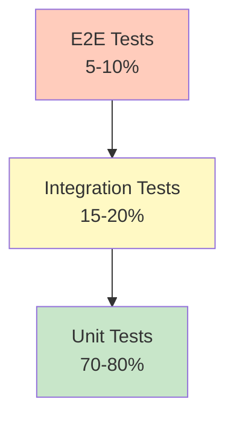

# Product Requirement Prompt (PRP): Create Testing Strategy Documentation

> Transform PRD into working code with complete context, clear objectives, and validation criteria

**Status**: Ready for Implementation
**Last Updated**: 2026-01-23
**Work Item**: P2.M2.T3.S1 - Create testing strategy documentation

---

## Goal

**Feature Goal**: Create a comprehensive testing strategy documentation (`docs/TESTING.md`) that explains the testing philosophy (100% coverage, TDD), test structure and organization (unit/, integration/, e2e/), unit vs integration vs e2e tests, mocking strategies (agents, file system, git), running tests and coverage reports, and includes test writing guidelines and examples.

**Deliverable**: Documentation file `docs/TESTING.md` containing:

- Testing philosophy and principles (100% coverage requirement, TDD approach)
- Test structure and organization (tests/unit/, tests/integration/, tests/e2e/, tests/fixtures/)
- Unit tests: definition, when to use, examples from codebase
- Integration tests: definition, when to use, examples from codebase
- E2E tests: definition, when to use, examples from codebase
- Mocking strategies (agents with Groundswell, file system with fs/promises, git with simple-git, child processes)
- Running tests and coverage reports (test scripts, coverage thresholds)
- Test writing guidelines and examples
- Cross-references to existing documentation and test files

**Success Definition**:

- A developer can understand the testing philosophy and approach from the documentation
- The test structure (unit/integration/e2e) is clearly explained with examples
- Mocking strategies for agents, file system, and git operations are documented
- Test writing guidelines are actionable with concrete examples
- The guide follows the documentation structure and style of existing docs (ARCHITECTURE.md, CUSTOM_AGENTS.md)
- Code examples are accurate and can be referenced directly
- Cross-references link to related documentation appropriately

## User Persona

**Target User**: Developer or contributor who needs to:

- Understand the testing philosophy and approach used in this codebase
- Write tests following the established patterns and conventions
- Mock external dependencies (agents, file system, git) correctly
- Run tests and generate coverage reports
- Understand when to write unit vs integration vs e2e tests

**Use Case**: User needs to understand:

- What is the testing philosophy (100% coverage, TDD)?
- How are tests organized (unit/, integration/, e2e/)?
- How do I mock agents, file system, and git operations?
- How do I run tests and check coverage?
- What are the test writing guidelines and examples?

**User Journey**:

1. User opens docs/TESTING.md to understand testing strategy
2. User learns about testing philosophy (100% coverage, TDD)
3. User studies test structure and organization
4. User reviews unit vs integration vs e2e test distinctions
5. User learns mocking strategies for external dependencies
6. User reviews test writing guidelines and examples
7. User can now write tests following established patterns
8. User can run tests and validate coverage

**Pain Points Addressed**:

- "What is the testing philosophy?" - Testing philosophy section
- "How are tests organized?" - Test structure section
- "When do I write unit vs integration vs e2e tests?" - Test type sections
- "How do I mock agents, file system, git?" - Mocking strategies section
- "How do I run tests and check coverage?" - Running tests section
- "Are there test examples I can follow?" - Test writing guidelines section

## Why

- **Developer Onboarding**: New contributors need to understand testing patterns and conventions
- **Consistency**: Ensures all tests follow the same patterns and quality standards
- **Coverage Maintenance**: Documents the 100% coverage requirement and how to maintain it
- **Knowledge Transfer**: Documents critical IP about testing patterns, mocking strategies, and test organization
- **Documentation Coverage**: Completes P2.M2.T3 (Testing Documentation) milestone
- **Parallel Work**: Builds upon docs/ARCHITECTURE.md (system design) and docs/CUSTOM_AGENTS.md (agent development) with testing-specific guidance

## What

Create docs/TESTING.md with comprehensive testing strategy documentation:

### Success Criteria

- [ ] File created at docs/TESTING.md
- [ ] Document header follows pattern (Status, Last Updated, Version)
- [ ] Table of Contents included with anchor links
- [ ] Testing philosophy section (100% coverage, TDD)
- [ ] Test structure and organization section
- [ ] Unit tests section with examples
- [ ] Integration tests section with examples
- [ ] E2E tests section with examples
- [ ] Mocking strategies section (agents, file system, git)
- [ ] Running tests and coverage section
- [ ] Test writing guidelines section with examples
- [ ] See Also section with links to related documentation

---

## All Needed Context

### Context Completeness Check

_If someone knew nothing about this codebase, would they have everything needed to implement this successfully?_

**Yes** - This PRP provides:

- Complete test structure analysis (137 test files, unit/integration/e2e organization)
- Vitest configuration details (100% coverage thresholds, test patterns)
- Concrete test examples with file paths (unit, integration, e2e)
- Mocking patterns for agents, file system, git, child processes
- Documentation style conventions from existing docs
- Test setup file contents and global test configuration
- Test scripts and coverage requirements

### Documentation & References

```yaml
# MUST READ - Test Configuration and Setup
- file: /home/dustin/projects/hacky-hack/vitest.config.ts
  why: Complete Vitest configuration with coverage thresholds, test patterns, environment setup
  pattern: 100% coverage thresholds, ESM TypeScript support, decorator support, path aliases
  gotcha: Requires experimental decorators for TypeScript, uses v8 coverage provider

- file: /home/dustin/projects/hacky-hack/tests/setup.ts
  why: Global test setup with environment configuration, API safeguards, mock cleanup
  pattern: z.ai API endpoint validation (blocks Anthropic API), promise rejection tracking, mock cleanup
  gotcha: Tests fail if Anthropic official API is detected, only allows z.ai endpoint

# MUST READ - Test Examples by Category
- file: /home/dustin/projects/hacky-hack/tests/unit/config/environment.test.ts
  why: Unit test example with environment variable mocking and validation testing
  pattern: vi.stubEnv() for environment mocking, try/catch for error validation, afterEach cleanup
  gotcha: Use vi.unstubAllEnvs() in afterEach for cleanup

- file: /home/dustin/projects/hacky-hack/tests/integration/architect-agent.test.ts
  why: Integration test example with agent workflow testing and schema validation
  pattern: Agent factory mocking, Zod schema validation, USE_REAL_LLM flag for real vs mock testing
  gotcha: Mock createArchitectAgent to avoid MCP server registration issues

- file: /home/dustin/projects/hacky-hack/tests/e2e/pipeline.test.ts
  why: E2E test example with complete pipeline workflow and temporary directory management
  pattern: Module-level mocking with hoisting, temporary directory with mkdtempSync, cleanup with rmSync
  gotcha: Use recursive: true, force: true for rmSync cleanup

# MUST READ - Mocking Examples
- file: /home/dustin/projects/hacky-hack/tests/unit/tools/bash-mcp.test.ts
  why: Bash MCP tool mocking example with child_process mocking
  pattern: Mock child_process.spawn, createMockChild factory for realistic async behavior
  gotcha: Mock stdout/stderr with setTimeout for realistic async emission

- file: /home/dustin/projects/hacky-hack/tests/unit/tools/git-mcp.test.ts
  why: Git MCP tool mocking example with simple-git mocking
  pattern: Mock simple-git with mock instance, GitError class for error testing
  gotcha: GitError must have name = 'GitError' property

- file: /home/dustin/projects/hacky-hack/tests/unit/tools/filesystem-mcp.test.ts
  why: Filesystem MCP tool mocking example with fs mocking
  pattern: Mock fs/promises and node:fs for file operations
  gotcha: Mock both fs/promises and node:fs for complete coverage

# MUST READ - Test Fixtures
- file: /home/dustin/projects/hacky-hack/tests/fixtures/simple-prd.ts
  why: Test fixture example for test data management
  pattern: Export mock data constants, factory functions for complex test data
  gotcha: Use TypeScript types for type-safe test data

# MUST READ - Documentation Conventions
- file: /home/dustin/projects/hacky-hack/docs/ARCHITECTURE.md
  why: Follow this structure and style (header, TOC, section formatting, code examples, See Also)
  pattern: Status block, Table of Contents, section headers with anchor links, See Also section

- file: /home/dustin/projects/hacky-hack/docs/CUSTOM_AGENTS.md
  why: Reference for developer guide style (being created in parallel)
  pattern: How-to guides, code examples, cross-references

# MUST READ - Research Documents (External Knowledge)
- docfile: /home/dustin/projects/hacky-hack/plan/003_b3d3efdaf0ed/P2M2T2S3/research/tdd-best-practices-research.md
  why: Comprehensive TDD best practices research with testing pyramid, naming conventions, anti-patterns
  section: All sections - use as reference for testing philosophy

# EXTERNAL RESOURCES - Use for reference only, do not copy
- url: https://vitest.dev/guide/why.html
  why: Vitest official documentation for testing framework patterns
  section: Testing concepts, mocking, coverage

- url: https://vitest.dev/api/
  why: Vitest API reference for vi.mock, vi.fn, vi.stubEnv patterns
  section: Mocking functions, globals

- url: https://martinfowler.com/articles/practical-test-pyramid.html
  why: Testing pyramid concept for unit/integration/e2e explanation
  section: Test pyramid concept, layer definitions
```

### Current Codebase Tree (Test-Related Files)

```bash
tests/
├── unit/                           # Unit tests (58 files)
│   ├── config/                     # Configuration tests
│   │   └── environment.test.ts
│   ├── core/                       # Core component tests
│   ├── agents/                     # Agent tests
│   ├── tools/                      # MCP tool tests
│   │   ├── bash-mcp.test.ts
│   │   ├── git-mcp.test.ts
│   │   └── filesystem-mcp.test.ts
│   └── utils/                      # Utility tests
├── integration/                    # Integration tests (65 files)
│   ├── architect-agent.test.ts
│   ├── prp-blueprint-agent.test.ts
│   ├── prp-generator-integration.test.ts
│   ├── prp-executor-integration.test.ts
│   ├── bug-hunt-workflow-integration.test.ts
│   └── agents.test.ts
├── e2e/                            # End-to-end tests (2 files)
│   ├── delta.test.ts
│   └── pipeline.test.ts
├── fixtures/                       # Test data and fixtures (5 files)
│   ├── simple-prd.ts
│   ├── mock-delta-data.ts
│   └── prp-samples.ts
├── manual/                         # Manual verification scripts (6 files)
├── validation/                     # Validation tests (1 file)
└── setup.ts                        # Global test configuration

vitest.config.ts                    # Vitest configuration

docs/
├── ARCHITECTURE.md                 # System architecture - Existing
├── CUSTOM_AGENTS.md                # Agent development guide - P2.M2.T2.S1 (parallel)
└── TESTING.md                      # Testing strategy guide - TO BE CREATED (P2.M2.T3.S1)
```

### Desired Codebase Tree

```bash
docs/
├── ARCHITECTURE.md                 # Multi-agent architecture overview - Existing
├── CUSTOM_AGENTS.md                # Custom agent development guide - P2.M2.T2.S1 (parallel)
├── CUSTOM_TOOLS.md                 # Custom MCP tool development guide - P2.M2.T2.S2 (parallel)
├── CUSTOM_WORKFLOWS.md             # Custom workflow development guide - P2.M2.T2.S3 (parallel)
└── TESTING.md                      # Testing strategy guide - TO BE CREATED (P2.M2.T3.S1)
```

### Known Gotchas of Our Codebase & Library Quirks

```typescript
// CRITICAL: Vitest requires experimental decorators for TypeScript
// vitest.config.ts (lines 52-56)
esbuild: {
  target: 'esnext',
  tsconfigRaw: {
    compilerOptions: {
      experimentalDecorators: true,
      emitDecoratorMetadata: true,
    },
  },
}

// GOTCHA: 100% coverage is enforced - tests will fail if below threshold
// vitest.config.ts (lines 28-35)
coverage: {
  thresholds: {
    global: {
      statements: 100,
      branches: 100,
      functions: 100,
      lines: 100,
    },
  },
}

// PATTERN: Module-level mocking must use hoisting (before imports)
vi.mock('groundswell', async () => {
  const actual = await vi.importActual('groundswell');
  return {
    ...actual,
    createAgent: vi.fn(),
    createPrompt: vi.fn(),
  };
});

// CRITICAL: z.ai API safeguard - tests fail if Anthropic API detected
// tests/setup.ts
const ZAI_ENDPOINT = 'https://api.z.ai/api/anthropic';
const BLOCKED_PATTERNS = [
  'https://api.anthropic.com',
  'http://api.anthropic.com',
  'api.anthropic.com',
];

// PATTERN: Environment variable mocking
beforeEach(() => {
  vi.stubEnv('ANTHROPIC_AUTH_TOKEN', 'test-token');
  vi.stubEnv('ANTHROPIC_BASE_URL', 'https://api.z.ai/api/anthropic');
});

afterEach(() => {
  vi.unstubAllEnvs();
});

// PATTERN: Mock child_process for bash operations
function createMockChild(options: { exitCode?: number; stdout?: string; stderr?: string }) {
  return {
    stdout: {
      on: vi.fn((event, callback) => {
        if (event === 'data') {
          setTimeout(() => callback(Buffer.from(options.stdout || '')), 5);
        }
      }),
    },
    stderr: { /* similar pattern */ },
    on: vi.fn((event, callback) => {
      if (event === 'close') {
        setTimeout(() => callback(options.exitCode || 0), 10);
      }
    }),
    killed: false,
    kill: vi.fn(),
  };
}

// GOTCHA: Temporary directory cleanup requires recursive: true, force: true
const tempDir = mkdtempSync(join(tmpdir(), 'test-'));
// ... test logic ...
rmSync(tempDir, { recursive: true, force: true });

// PATTERN: Mock simple-git for git operations
const mockGitInstance = {
  status: vi.fn().mockResolvedValue({
    current: 'main',
    files: [
      { path: 'src/index.ts', index: 'M', working_dir: ' ' },
    ],
    isClean: () => false,
  }),
  diff: vi.fn(),
  add: vi.fn(),
  commit: vi.fn(),
};

// PATTERN: Agent factory mocking to avoid MCP registration
vi.mock('../../src/agents/agent-factory.js', () => ({
  createArchitectAgent: vi.fn(() => ({
    prompt: vi.fn(),
  })),
}));
```

---

## Implementation Blueprint

### Data Models and Structure

No data models needed - this is a documentation-only task. The documentation structure should follow:

```markdown
# Testing Strategy

> Brief description

**Status**: Published
**Last Updated**: [date]
**Version**: 1.0.0

## Table of Contents

- [Overview](#overview)
- [Testing Philosophy](#testing-philosophy)
- [Test Structure and Organization](#test-structure-and-organization)
- [Unit Tests](#unit-tests)
- [Integration Tests](#integration-tests)
- [E2E Tests](#e2e-tests)
- [Mocking Strategies](#mocking-strategies)
- [Running Tests and Coverage](#running-tests-and-coverage)
- [Test Writing Guidelines](#test-writing-guidelines)
- [See Also](#see-also)
```

### Implementation Tasks (Ordered by Dependencies)

```yaml
Task 1: CREATE docs/TESTING.md with header and structure
  - IMPLEMENT: File header with Status, Last Updated, Version
  - IMPLEMENT: Table of Contents with anchor links
  - IMPLEMENT: Overview section explaining testing strategy
  - FOLLOW pattern: docs/ARCHITECTURE.md (header format, TOC style)
  - NAMING: TESTING.md (all caps, underscore separator)
  - PLACEMENT: docs/ directory alongside other documentation

Task 2: WRITE "Testing Philosophy" section
  - IMPLEMENT: Testing philosophy overview (100% coverage requirement)
  - IMPLEMENT: TDD approach explanation (Red-Green-Refactor)
  - IMPLEMENT: Coverage requirements (statements, branches, functions, lines: 100%)
  - IMPLEMENT: Quality standards (fast unit tests, isolated tests, clear assertions)
  - IMPLEMENT: Testing pyramid (70-80% unit, 15-20% integration, 5-10% e2e)
  - FOLLOW pattern: research/tdd-best-practices-research.md section on TDD workflow
  - REFERENCE: vitest.config.ts lines 28-35 for coverage thresholds
  - PLACEMENT: After Table of Contents

Task 3: WRITE "Test Structure and Organization" section
  - IMPLEMENT: Directory structure explanation (tests/unit/, tests/integration/, tests/e2e/)
  - IMPLEMENT: Test file naming conventions (*.test.ts)
  - IMPLEMENT: Test categories (137 total: 58 unit, 65 integration, 2 e2e, 6 manual, 1 validation)
  - IMPLEMENT: Test fixtures location (tests/fixtures/)
  - IMPLEMENT: Global setup file (tests/setup.ts)
  - CODE EXAMPLE: Directory tree structure
  - REFERENCE: Research summary for test file counts
  - PLACEMENT: After Testing Philosophy section

Task 4: WRITE "Unit Tests" section
  - IMPLEMENT: Unit test definition (fast, isolated, component-level)
  - IMPLEMENT: When to write unit tests (single function/class testing)
  - IMPLEMENT: Unit test patterns (describe blocks, test naming, AAA pattern)
  - IMPLEMENT: Code example from tests/unit/config/environment.test.ts
  - IMPLEMENT: Environment variable mocking pattern (vi.stubEnv)
  - IMPLEMENT: Cleanup pattern (afterEach with vi.unstubAllEnvs)
  - CODE EXAMPLE: Complete unit test example
  - REFERENCE: tests/unit/config/environment.test.ts
  - PLACEMENT: After Test Structure section

Task 5: WRITE "Integration Tests" section
  - IMPLEMENT: Integration test definition (component interaction, medium speed)
  - IMPLEMENT: When to write integration tests (multi-component workflows)
  - IMPLEMENT: Integration test patterns (mock external services, validate data flow)
  - IMPLEMENT: Code example from tests/integration/architect-agent.test.ts
  - IMPLEMENT: Agent factory mocking pattern
  - IMPLEMENT: Schema validation with Zod
  - IMPLEMENT: USE_REAL_LLM flag for real vs mock testing
  - CODE EXAMPLE: Complete integration test example
  - REFERENCE: tests/integration/architect-agent.test.ts
  - PLACEMENT: After Unit Tests section

Task 6: WRITE "E2E Tests" section
  - IMPLEMENT: E2E test definition (full workflow, slow execution)
  - IMPLEMENT: When to write E2E tests (complete user workflows)
  - IMPLEMENT: E2E test patterns (module-level mocking, temporary directories)
  - IMPLEMENT: Code example from tests/e2e/pipeline.test.ts
  - IMPLEMENT: Module-level mocking with hoisting
  - IMPLEMENT: Temporary directory management (mkdtempSync, rmSync)
  - IMPLEMENT: ChildProcess mocking for async behavior
  - CODE EXAMPLE: Complete E2E test example
  - REFERENCE: tests/e2e/pipeline.test.ts
  - PLACEMENT: After Integration Tests section

Task 7: WRITE "Mocking Strategies" section
  - IMPLEMENT: Overview of mocking approach (mock external dependencies)
  - IMPLEMENT: Agent mocking pattern (Groundswell createAgent, createPrompt)
  - IMPLEMENT: File system mocking (fs/promises, node:fs)
  - IMPLEMENT: Git mocking (simple-git)
  - IMPLEMENT: Child process mocking (child_process.spawn)
  - IMPLEMENT: Environment variable mocking (vi.stubEnv)
  - CODE EXAMPLES:
    - Agent mocking: tests/integration/architect-agent.test.ts
    - File system: tests/unit/tools/filesystem-mcp.test.ts
    - Git: tests/unit/tools/git-mcp.test.ts
    - Bash: tests/unit/tools/bash-mcp.test.ts
  - REFERENCE: All mocking test files
  - PLACEMENT: After E2E Tests section

Task 8: WRITE "Running Tests and Coverage" section
  - IMPLEMENT: Test scripts (npm test, npm run test:run, npm run test:coverage)
  - IMPLEMENT: Coverage thresholds explanation (100% requirement)
  - IMPLEMENT: Coverage report formats (text, json, html)
  - IMPLEMENT: Watch mode usage
  - IMPLEMENT: Debugging failing tests
  - REFERENCE: vitest.config.ts for configuration
  - REFERENCE: package.json for test scripts
  - PLACEMENT: After Mocking Strategies section

Task 9: WRITE "Test Writing Guidelines" section
  - IMPLEMENT: Test naming conventions (should pattern)
  - IMPLEMENT: AAA pattern (Arrange-Act-Assert)
  - IMPLEMENT: Test organization (describe blocks, context grouping)
  - IMPLEMENT: Assertion best practices
  - IMPLEMENT: Async testing patterns (promises, async/await)
  - IMPLEMENT: Test fixture usage
  - IMPLEMENT: Common gotchas and anti-patterns
  - CODE EXAMPLES: Good vs bad test patterns
  - PLACEMENT: After Running Tests section

Task 10: WRITE "See Also" section
  - IMPLEMENT: Links to ARCHITECTURE.md (system design)
  - IMPLEMENT: Links to CUSTOM_AGENTS.md (agent development)
  - IMPLEMENT: Links to vitest.config.ts (test configuration)
  - IMPLEMENT: Links to tests/ directory (test examples)
  - IMPLEMENT: Links to test setup files
  - IMPLEMENT: External resources (Vitest documentation)
  - IMPLEMENT: Links to research documents
  - FOLLOW pattern: docs/ARCHITECTURE.md See Also section
  - PLACEMENT: End of document

Task 11: VALIDATE documentation quality
  - VERIFY: All code examples are accurate and can be referenced
  - VERIFY: All links work (TOC anchors, cross-references, external URLs)
  - VERIFY: Document follows existing doc conventions
  - VERIFY: Content is complete and actionable
  - VERIFY: Mocking patterns are clearly documented with examples
  - VERIFY: Test structure is clearly explained
  - VERIFY: Running tests instructions are accurate
```

### Implementation Patterns & Key Details

````markdown
# Documentation Style Guidelines (follow existing patterns)

# Header Pattern

> Brief one-sentence description

**Status**: Published
**Last Updated**: 2026-01-23
**Version**: 1.0.0

# Section Headers

## Section Name

### Subsection Name

# Code Examples

```typescript
// Include file path comment
// tests/unit/config/environment.test.ts

import { describe, expect, it, beforeEach, afterEach, vi } from 'vitest';

describe('Environment Configuration', () => {
  beforeEach(() => {
    vi.stubEnv('ANTHROPIC_AUTH_TOKEN', 'test-token-123');
  });

  afterEach(() => {
    vi.unstubAllEnvs();
  });

  it('should validate environment with all variables set', () => {
    const config = validateEnvironment();
    expect(config.apiKey).toBe('test-token-123');
  });
});
```
````

# Cross-References

See [vitest.config.ts](../vitest.config.ts) for complete test configuration.
See [tests/unit/config/environment.test.ts](../tests/unit/config/environment.test.ts) for unit test example.
See [TDD Best Practices Research](../plan/003_b3d3efdaf0ed/P2M2T2S3/research/tdd-best-practices-research.md) for external research.

# Tables

| Test Type   | Purpose                   | Speed         | Example Location           |
| ----------- | ------------------------- | ------------- | -------------------------- |
| Unit        | Component-level testing   | Fast (< 1s)   | tests/unit/config/         |
| Integration | Multi-component workflows | Medium (1-5s) | tests/integration/         |
| E2E         | Full pipeline validation  | Slow (< 30s)  | tests/e2e/pipeline.test.ts |

# Diagrams (Mermaid)

## Testing Pyramid



# Callouts

> **Note**: Important information uses blockquote format.

**CRITICAL**: Use emphasis for critical implementation details.

**GOTCHA**: Highlight common pitfalls.

**PATTERN**: Show repeating patterns in code.

**BEST PRACTICE**: Show recommended approaches.

# External Links

[Vitest Documentation](https://vitest.dev/guide/why.html)
[Vitest API Reference](https://vitest.dev/api/)
[Martin Fowler: Test Pyramid](https://martinfowler.com/articles/practical-test-pyramid.html)

````

### Integration Points

```yaml
DOCUMENTATION:
  - add to: docs/TESTING.md
  - reference: docs/ARCHITECTURE.md (multi-agent overview)
  - reference: docs/CUSTOM_AGENTS.md (agent development guide) - parallel work P2.M2.T2.S1
  - reference: docs/CUSTOM_TOOLS.md (MCP tool development guide) - parallel work P2.M2.T2.S2
  - reference: docs/CUSTOM_WORKFLOWS.md (workflow development guide) - parallel work P2.M2.T2.S3

CROSS-REFERENCES:
  - Link to vitest.config.ts for test configuration
  - Link to tests/setup.ts for global test setup
  - Link to tests/unit/ for unit test examples
  - Link to tests/integration/ for integration test examples
  - Link to tests/e2e/ for e2e test examples
  - Link to tests/fixtures/ for test fixture patterns
  - Link to src/agents/agent-factory.ts for agent testing patterns
  - Link to src/tools/ for MCP tool testing patterns
  - Link to research/ directory for detailed research

PARALLEL WORK CONSIDERATIONS:
  - CUSTOM_AGENTS.md (P2.M2.T2.S1) covers agent development with testing patterns
  - CUSTOM_TOOLS.md (P2.M2.T2.S2) covers MCP tool development
  - CUSTOM_WORKFLOWS.md (P2.M2.T2.S3) covers workflow development
  - TESTING.md should reference CUSTOM_AGENTS.md for agent-specific testing
  - TESTING.md should reference CUSTOM_TOOLS.md for tool testing patterns
  - Focus TESTING.md on general testing philosophy and patterns
  - Avoid duplicating agent-specific testing content - reference CUSTOM_AGENTS.md instead
  - Avoid duplicating workflow testing content - reference CUSTOM_WORKFLOWS.md instead
````

---

## Validation Loop

### Level 1: Syntax & Style (Immediate Feedback)

```bash
# No code to validate - documentation only
# Verify file was created
test -f docs/TESTING.md && echo "File exists" || echo "File not found"

# Check markdown syntax (if tools available)
npx markdownlint docs/TESTING.md 2>/dev/null || echo "markdownlint not available"

# Expected: File exists, no critical markdown syntax errors
```

### Level 2: Content Validation (Completeness Check)

```bash
# Verify all required sections exist
grep -q "## Testing Philosophy" docs/TESTING.md && echo "Section 1 OK" || echo "Missing Section 1"
grep -q "## Test Structure and Organization" docs/TESTING.md && echo "Section 2 OK" || echo "Missing Section 2"
grep -q "## Unit Tests" docs/TESTING.md && echo "Section 3 OK" || echo "Missing Section 3"
grep -q "## Integration Tests" docs/TESTING.md && echo "Section 4 OK" || echo "Missing Section 4"
grep -q "## E2E Tests" docs/TESTING.md && echo "Section 5 OK" || echo "Missing Section 5"
grep -q "## Mocking Strategies" docs/TESTING.md && echo "Section 6 OK" || echo "Missing Section 6"
grep -q "## Running Tests and Coverage" docs/TESTING.md && echo "Section 7 OK" || echo "Missing Section 7"
grep -q "## Test Writing Guidelines" docs/TESTING.md && echo "Section 8 OK" || echo "Missing Section 8"
grep -q "## See Also" docs/TESTING.md && echo "See Also OK" || echo "Missing See Also"

# Verify key content is present
grep -q "100% coverage" docs/TESTING.md && echo "Coverage mention OK" || echo "Missing coverage"
grep -q "TDD" docs/TESTING.md && echo "TDD mention OK" || echo "Missing TDD"
grep -q "vi.mock" docs/TESTING.md && echo "Mocking pattern OK" || echo "Missing mocking"
grep -q "vitest" docs/TESTING.md && echo "Vitest mention OK" || echo "Missing vitest"

# Verify cross-references to parallel work
grep -q "CUSTOM_AGENTS.md" docs/TESTING.md && echo "CUSTOM_AGENTS ref OK" || echo "Missing CUSTOM_AGENTS ref"

# Expected: All sections present, key content included
```

### Level 3: Link Validation (Reference Check)

```bash
# Check TOC anchor links work (manual verification required)
echo "Manual check: Click each TOC link and verify it navigates correctly"

# Check cross-references to existing files
grep -q "vitest.config.ts" docs/TESTING.md && echo "vitest.config ref OK" || echo "Missing vitest.config ref"
grep -q "tests/setup.ts" docs/TESTING.md && echo "setup.ts ref OK" || echo "Missing setup.ts ref"
grep -q "tests/unit/" docs/TESTING.md && echo "unit tests ref OK" || echo "Missing unit tests ref"
grep -q "tests/integration/" docs/TESTING.md && echo "integration tests ref OK" || echo "Missing integration tests ref"
grep -q "tests/e2e/" docs/TESTING.md && echo "e2e tests ref OK" || echo "Missing e2e tests ref"
grep -q "ARCHITECTURE.md" docs/TESTING.md && echo "ARCHITECTURE ref OK" || echo "Missing ARCHITECTURE ref"

# Check test file references
grep -q "tests/unit/config/environment.test.ts" docs/TESTING.md && echo "env test ref OK" || echo "Missing env test ref"
grep -q "tests/integration/architect-agent.test.ts" docs/TESTING.md && echo "architect test ref OK" || echo "Missing architect test ref"
grep -q "tests/e2e/pipeline.test.ts" docs/TESTING.md && echo "pipeline test ref OK" || echo "Missing pipeline test ref"
grep -q "tests/unit/tools/bash-mcp.test.ts" docs/TESTING.md && echo "bash mcp test ref OK" || echo "Missing bash mcp test ref"

# Check external links
grep -q "vitest.dev" docs/TESTING.md && echo "Vitest docs ref OK" || echo "Missing Vitest docs ref"
grep -q "martinfowler.com" docs/TESTING.md && echo "Test pyramid ref OK" || echo "Missing test pyramid ref"

# Expected: All references point to valid files
```

### Level 4: Documentation Quality (Manual Review)

```bash
# Manual validation checklist
echo "Manual Validation Checklist:"
echo "1. Read the document start to finish - does it make sense?"
echo "2. Check code examples against source files - are they accurate?"
echo "3. Verify TOC links work - do they navigate correctly?"
echo "4. Check cross-references - do they point to valid locations?"
echo "5. Verify external links - do they work?"
echo "6. Compare to existing docs style - is it consistent?"
echo "7. Ask: Can a new developer write tests from this guide?"
echo "8. Verify mocking patterns are documented with examples"
echo "9. Check that test structure is clearly explained"
echo "10. Verify running tests instructions are accurate"
echo "11. Check that all test types (unit/integration/e2e) are covered"
echo "12. Verify TDD philosophy is clearly explained"

# Expected: All manual checks pass
```

---

## Final Validation Checklist

### Technical Validation

- [ ] File created at docs/TESTING.md
- [ ] Document header follows pattern (Status, Last Updated, Version)
- [ ] Table of Contents included with anchor links
- [ ] All required sections present (8 main sections + See Also)
- [ ] No markdown syntax errors

### Content Validation

- [ ] Testing philosophy explained (100% coverage, TDD)
- [ ] Test structure documented with directory tree
- [ ] Unit tests section with example
- [ ] Integration tests section with example
- [ ] E2E tests section with example
- [ ] Mocking strategies documented (agents, file system, git)
- [ ] Running tests section with scripts
- [ ] Test writing guidelines with examples

### Code Quality Validation

- [ ] All code examples are accurate (verified against source files)
- [ ] Code examples include file path references
- [ ] Code examples use proper syntax highlighting
- [ ] TypeScript examples follow codebase conventions
- [ ] Mocking patterns are accurate

### Documentation & Deployment

- [ ] Follows existing documentation style (ARCHITECTURE.md, CUSTOM_AGENTS.md)
- [ ] Cross-references link to valid locations
- [ ] External links work (test them)
- [ ] See Also section includes all related docs
- [ ] Parallel work items (CUSTOM_AGENTS.md, CUSTOM_TOOLS.md, CUSTOM_WORKFLOWS.md) referenced appropriately
- [ ] Research documents referenced with context

---

## Anti-Patterns to Avoid

- Don't duplicate agent development content - reference CUSTOM_AGENTS.md instead
- Don't duplicate workflow testing content - reference CUSTOM_WORKFLOWS.md instead
- Don't use generic examples - use real examples from the codebase
- Don't skip mocking strategies - they're critical for this codebase
- Don't ignore the 100% coverage requirement - it's enforced in vitest.config.ts
- Don't forget the z.ai API safeguard - it's in tests/setup.ts
- Don't include incomplete code examples - verify all examples work
- Don't make the document too long - be comprehensive but concise
- Don't use external links as primary content - reference them for additional reading
- Don't forget cross-references - link to related documentation
- Don't ignore test organization - explain the unit/integration/e2e structure
- Don't skip test writing guidelines - include actionable examples
