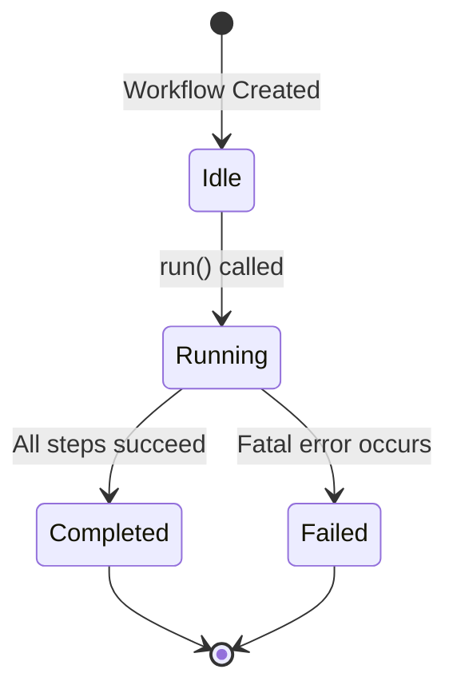
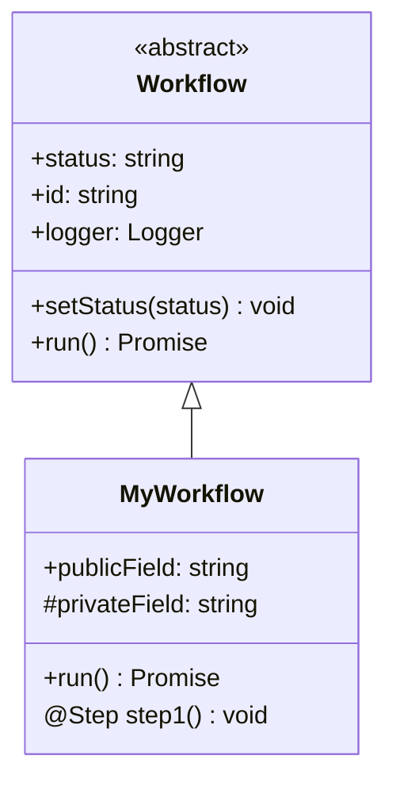

# Product Requirement Prompt (PRP): Create Custom Workflow Development Guide

> Transform PRD into working code with complete context, clear objectives, and validation criteria

**Status**: Ready for Implementation
**Last Updated**: 2026-01-23
**Work Item**: P2.M2.T2.S3 - Create custom workflow development guide

---

## Goal

**Feature Goal**: Create a comprehensive custom workflow development guide (`docs/CUSTOM_WORKFLOWS.md`) that documents the Groundswell Workflow base class, decorator patterns (@Step, @Task, @ObservedState), workflow lifecycle management, error handling and recovery patterns, workflow composition patterns, and includes a complete example of adding a 'DeploymentWorkflow'.

**Deliverable**: Documentation file `docs/CUSTOM_WORKFLOWS.md` containing:

- Groundswell Workflow base class overview (extends Workflow pattern)
- @Step decorator for method tracking with timing
- @Task decorator for child workflow composition
- @ObservedState decorator for state management and observability
- Workflow lifecycle patterns (setStatus('running') → execute → setStatus('completed/failed'))
- Error handling and recovery patterns with retry logic
- Workflow composition patterns (sequential, conditional, iterative)
- Complete DeploymentWorkflow example with real-world steps
- Testing patterns for custom workflows
- Cross-references to existing workflow implementations and documentation

**Success Definition**:

- A developer can create a new custom workflow following the guide
- The DeploymentWorkflow example is complete and can be implemented directly
- All patterns reference actual code from the codebase with file paths
- Decorator usage is clearly documented with examples
- The guide follows the documentation structure and style of existing docs (ARCHITECTURE.md, WORKFLOWS.md, CUSTOM_AGENTS.md, CUSTOM_TOOLS.md)
- Code examples are accurate and can be copied directly
- Cross-references link to related documentation appropriately

## User Persona

**Target User**: Developer or contributor who needs to:

- Extend the PRP Pipeline with custom workflows
- Understand the Groundswell Workflow class and decorators
- Create domain-specific workflows (e.g., DeploymentWorkflow, MigrationWorkflow, DataProcessingWorkflow)
- Compose workflows from smaller workflow components
- Handle errors and recovery in long-running workflows
- Track workflow state and observability

**Use Case**: User needs to understand:

- What is the Groundswell Workflow base class?
- How do I use @Step, @Task, and @ObservedState decorators?
- How do I manage workflow lifecycle and status?
- How do I compose workflows from smaller components?
- How do I handle errors and implement retry logic?
- How do I track state for observability?
- Is there a complete example I can follow?

**User Journey**:

1. User opens docs/CUSTOM_WORKFLOWS.md to understand workflow development
2. User learns about Groundswell Workflow base class
3. User studies @Step, @Task, and @ObservedState decorator patterns
4. User learns workflow lifecycle and status management
5. User reviews error handling and recovery patterns
6. User studies workflow composition patterns
7. User reviews the complete DeploymentWorkflow example
8. User follows step-by-step guide to create their own custom workflow
9. User can now create and integrate custom workflows effectively

**Pain Points Addressed**:

- "What is the Groundswell Workflow class?" - Workflow base class overview section
- "How do I use the decorators?" - Decorator patterns section with examples
- "How do I manage workflow lifecycle?" - Lifecycle patterns section
- "How do I compose workflows?" - Composition patterns section
- "How do I handle errors?" - Error handling patterns section
- "Is there a complete example?" - DeploymentWorkflow example section

## Why

- **Extensibility**: Developers need to extend the PRP Pipeline with domain-specific workflows
- **Customization**: Different projects require specialized workflow capabilities
- **Knowledge Transfer**: Documents critical IP about Groundswell workflow architecture
- **Documentation Coverage**: Completes P2.M2.T2 (Extensibility Documentation) milestone
- **Parallel Work**: Builds upon docs/ARCHITECTURE.md (multi-agent architecture), docs/CUSTOM_AGENTS.md (agent development), and docs/CUSTOM_TOOLS.md (MCP tool development) with workflow-specific implementation guidance

## What

Create docs/CUSTOM_WORKFLOWS.md with comprehensive custom workflow development documentation:

### Success Criteria

- [ ] File created at docs/CUSTOM_WORKFLOWS.md
- [ ] Document header follows pattern (Status, Last Updated, Version, See Also)
- [ ] Table of Contents included with anchor links
- [ ] Groundswell Workflow base class section
- [ ] @Step decorator patterns section
- [ ] @Task decorator patterns section
- [ ] @ObservedState decorator patterns section
- [ ] Workflow lifecycle management section
- [ ] Error handling and recovery section
- [ ] Workflow composition patterns section
- [ ] Complete DeploymentWorkflow example section
- [ ] Testing patterns section
- [ ] Cross-references to ARCHITECTURE.md, CUSTOM_AGENTS.md, CUSTOM_TOOLS.md, WORKFLOWS.md, and source code
- [ ] See Also section with links to related documentation

---

## All Needed Context

### Context Completeness Check

_If someone knew nothing about this codebase, would they have everything needed to implement this successfully?_

**Yes** - This PRP provides:

- Complete workflow implementations (PRPPipeline, BugHuntWorkflow, FixCycleWorkflow, DeltaAnalysisWorkflow, HelloWorldWorkflow)
- Groundswell Workflow base class usage patterns
- Decorator patterns (@Step, @Task, @ObservedState)
- Documentation formatting conventions from existing docs
- Complete DeploymentWorkflow example with all code
- External research on workflow best practices
- Testing patterns from existing unit tests

### Documentation & References

```yaml
# MUST READ - Workflow Implementations
- file: /home/dustin/projects/hacky-hack/src/workflows/prp-pipeline.ts
  why: Complete main pipeline workflow with all patterns (decorator usage, lifecycle, error handling, composition)
  pattern: @Step decorator, setStatus lifecycle, error tracking, signal handling, resource monitoring, progress tracking
  gotcha: Uses #private fields for state, correlation logger pattern, signal handlers for graceful shutdown

- file: /home/dustin/projects/hacky-hack/src/workflows/bug-hunt-workflow.ts
  why: Simple 4-step workflow (analyzeScope, creativeE2ETesting, adversarialTesting, generateReport)
  pattern: @Step decorator with trackTiming, sequential execution, correlation logger, state fields
  gotcha: All phases are logical - only generateReport() makes actual LLM calls

- file: /home/dustin/projects/hacky-hack/src/workflows/fix-cycle-workflow.ts
  why: Iterative workflow with while loop and conditional completion check
  pattern: Iterative composition, conditional workflow execution, child workflow instantiation (BugHuntWorkflow)
  gotcha: Loops until complete or maxIterations (3) reached, uses #extractCompletedTasks helper

- file: /home/dustin/projects/hacky-hack/src/workflows/delta-analysis-workflow.ts
  why: Simple 1-step workflow (analyzeDelta) with agent execution
  pattern: Single @Step method, QA agent integration with retry logic, type assertion for prompt result
  gotcha: Uses retryAgentPrompt wrapper for automatic retry on agent failures

- file: /home/dustin/projects/hacky-hack/src/workflows/hello-world.ts
  why: Minimal workflow for validating Groundswell integration
  pattern: Simplest possible workflow (setStatus, log, setStatus)
  gotcha: No decorators, just setStatus lifecycle - use for testing integration

# MUST READ - Research Documents (External Knowledge)
- docfile: /home/dustin/projects/hacky-hack/plan/003_b3d3efdaf0ed/P2M2T2S3/research/groundswell-workflow-patterns.md
  why: Comprehensive Groundswell workflow system analysis with all patterns, gotchas, and best practices
  section: All sections - use as primary reference for workflow patterns

- docfile: /home/dustin/projects/hacky-hack/plan/003_b3d3efdaf0ed/P2M2T2S3/research/workflow-best-practices.md
  why: Workflow orchestration best practices from Airflow, Prefect, Dagster, Temporal
  section: All sections - use as reference for best practices to document

- docfile: /home/dustin/projects/hacky-hack/plan/003_b3d3efdaf0ed/P2M2T2S3/research/documentation-style-guide.md
  why: Documentation structure and style patterns for consistency
  section: All sections - use as reference for documentation formatting

# MUST READ - Documentation Conventions
- file: /home/dustin/projects/hacky-hack/docs/ARCHITECTURE.md
  why: Follow this structure and style (header, TOC, section formatting, code examples, See Also)
  pattern: Status block, Table of Contents, section headers with anchor links, See Also section

- file: /home/dustin/projects/hacky-hack/docs/WORKFLOWS.md
  why: Follow documentation style for workflow guides
  pattern: Overview sections, code examples, table formatting, cross-references

- file: /home/dustin/projects/hacky-hack/docs/CUSTOM_AGENTS.md
  why: Reference for developer guide style (being created in parallel)
  pattern: How-to guides, code examples, cross-references

# MUST READ - Parallel Work (CUSTOM_TOOLS.md)
- docfile: /home/dustin/projects/hacky-hack/plan/003_b3d3efdaf0ed/P2M2T2S2/PRP.md
  why: Previous work item creating CUSTOM_TOOLS.md - reference for style and structure
  section: "Documentation Style Guidelines" section in IMPLEMENTATION PATTERNS

# EXTERNAL RESOURCES - Use for reference only, do not copy
- url: https://docs.anthropic.com/claude/docs/agents
  why: Anthropic agent documentation for workflow patterns
  section: Agent workflows, task composition

- url: https://docs.prefect.io/concepts/workflows
  why: Prefect workflow library for best practices
  section: Flow patterns, state management, error handling

- url: https://airflow.apache.org/docs/apache-airflow/stable/core-concepts/dags
  why: Airflow DAG patterns for workflow composition
  section: DAG composition, task dependencies, operators

- url: https://github.com/anthropics/groundswell
  why: Groundswell framework documentation
  section: Workflow base class, decorators (@Step, @Task, @ObservedState)
```

### Current Codebase Tree (Workflow-Related Files)

```bash
src/workflows/
├── prp-pipeline.ts              # Main pipeline workflow (primary example)
├── bug-hunt-workflow.ts         # QA testing workflow (simple 4-step)
├── fix-cycle-workflow.ts        # Iterative bug fixing workflow
├── delta-analysis-workflow.ts   # PRD comparison workflow (simple 1-step)
└── hello-world.ts               # Minimal validation workflow

src/core/
├── session-manager.ts           # Session state management
├── task-orchestrator.ts         # Task execution orchestration
└── models.ts                    # TypeScript interfaces (Task, Subtask, Status, etc.)

src/utils/
├── logger.ts                    # Logging with correlation IDs
├── progress.ts                  # Progress tracking utilities
├── resource-monitor.ts          # Resource limit monitoring
└── retry.ts                     # Agent retry logic

docs/
├── ARCHITECTURE.md              # Multi-agent architecture overview
├── WORKFLOWS.md                 # Pipeline workflow documentation
├── CUSTOM_AGENTS.md             # Custom agent development guide - P2.M2.T2.S1
└── CUSTOM_TOOLS.md              # Custom MCP tool development guide - P2.M2.T2.S2
```

### Desired Codebase Tree

```bash
docs/
├── ARCHITECTURE.md              # Multi-agent architecture overview - Existing
├── WORKFLOWS.md                 # Pipeline workflow documentation - Existing
├── CUSTOM_AGENTS.md             # Custom agent development guide - P2.M2.T2.S1 (parallel)
├── CUSTOM_TOOLS.md              # Custom MCP tool development guide - P2.M2.T2.S2 (parallel)
└── CUSTOM_WORKFLOWS.md          # Custom workflow development guide - TO BE CREATED (P2.M2.T2.S3)
```

### Known Gotchas of Our Codebase & Library Quirks

```typescript
// CRITICAL: Groundswell uses decorators from 'groundswell' package
import { Workflow, Step, Task, ObservedState } from 'groundswell';

// GOTCHA: Must call super() with workflow name in constructor
export class MyWorkflow extends Workflow {
  constructor() {
    super('MyWorkflow'); // Required: workflow name for logging/tracking
  }
}

// PATTERN: Use @Step decorator for method tracking with timing
@Step({ trackTiming: true })
async myStep(): Promise<void> {
  // Step implementation - timing tracked automatically
}

// CRITICAL: Workflow lifecycle MUST use setStatus()
async run(): Promise<Result> {
  this.setStatus('running');
  try {
    await this.step1();
    await this.step2();
    this.setStatus('completed');
    return result;
  } catch (error) {
    this.setStatus('failed');
    throw error;
  }
}

// PATTERN: Public fields are automatically observable (no @ObservedState needed)
prdContent: string;
completedTasks: Task[];
testResults: TestResults | null = null;

// PATTERN: Use correlation logger for tracing
private correlationLogger: Logger;

constructor() {
  super('MyWorkflow');
  const correlationId = `${Date.now()}-${Math.random().toString(36).substring(2, 9)}`;
  this.correlationLogger = getLogger('MyWorkflow').child({ correlationId });
}

// GOTCHA: Agent results need type assertion
const result = (await retryAgentPrompt(
  () => agent.prompt(prompt) as Promise<ExpectedType>,
  { agentType: 'MyAgent', operation: 'myOperation' }
)) as ExpectedType;

// PATTERN: Child workflow instantiation
@Task()
async spawnChild(): Promise<ChildWorkflow> {
  return new ChildWorkflow('ChildWorkflow', this);
}

// CRITICAL: Use #private fields for internal state (not observable)
#privateField: string = 'internal';
#internalMethod(): void { /* ... */ }

// SECURITY: Always validate inputs in constructor
constructor(input: string) {
  super('MyWorkflow');
  if (!input || input.trim() === '') {
    throw new Error('Input cannot be empty');
  }
  // ...
}

// PATTERN: Error handling with isFatalError check
async someStep(): Promise<void> {
  try {
    // Step logic
  } catch (error) {
    const errorMessage = error instanceof Error ? error.message : String(error);

    if (isFatalError(error, this.#continueOnError)) {
      this.logger.error(`Fatal error: ${errorMessage}`);
      throw error; // Re-throw to abort workflow
    }

    // Non-fatal: track and continue
    this.#trackFailure('stepName', error, { phase: this.currentPhase });
    this.logger.warn(`Non-fatal error, continuing: ${errorMessage}`);
  }
}
```

---

## Implementation Blueprint

### Data Models and Structure

No data models needed - this is a documentation-only task. The documentation structure should follow:

```markdown
# Custom Workflow Development Guide

> Brief description

**Status**: Published
**Last Updated**: [date]
**Version**: 1.0.0

## Table of Contents

- [Overview](#overview)
- [Groundswell Workflow Base Class](#groundswell-workflow-base-class)
- [Decorator Patterns](#decorator-patterns)
  - [@Step Decorator](#step-decorator)
  - [@Task Decorator](#task-decorator)
  - [@ObservedState Decorator](#observedstate-decorator)
- [Workflow Lifecycle](#workflow-lifecycle)
- [Error Handling and Recovery](#error-handling-and-recovery)
- [Workflow Composition Patterns](#workflow-composition-patterns)
- [Step-by-Step Guide](#step-by-step-guide)
- [Complete Example: DeploymentWorkflow](#complete-example-deploymentworkflow)
- [Testing Custom Workflows](#testing-custom-workflows)
- [See Also](#see-also)
```

### Implementation Tasks (Ordered by Dependencies)

```yaml
Task 1: CREATE docs/CUSTOM_WORKFLOWS.md with header and structure
  - IMPLEMENT: File header with Status, Last Updated, Version
  - IMPLEMENT: Table of Contents with anchor links
  - IMPLEMENT: Overview section explaining custom workflow development
  - FOLLOW pattern: docs/ARCHITECTURE.md (header format, TOC style)
  - NAMING: CUSTOM_WORKFLOWS.md (all caps, underscore separator)
  - PLACEMENT: docs/ directory alongside other documentation

Task 2: WRITE "Groundswell Workflow Base Class" section
  - IMPLEMENT: Workflow class overview (extends Workflow from 'groundswell')
  - IMPLEMENT: Constructor pattern (super() with workflow name)
  - IMPLEMENT: Base properties (status, id, logger, parent, children)
  - IMPLEMENT: Public state fields (observable by default)
  - IMPLEMENT: Correlation logger pattern for tracing
  - IMPLEMENT: Run method signature (async run(): Promise<Result>)
  - FOLLOW pattern: research/groundswell-workflow-patterns.md section 1
  - CODE EXAMPLE: Use prp-pipeline.ts lines 140-305 (constructor and properties)
  - DIAGRAM: Include Workflow class inheritance diagram
  - PLACEMENT: After Table of Contents

Task 3: WRITE "Decorator Patterns" section
  - IMPLEMENT: @Step decorator overview (method tracking with timing)
  - IMPLEMENT: @Task decorator overview (child workflow composition)
  - IMPLEMENT: @ObservedState decorator overview (state management)
  - IMPLEMENT: Decorator configuration options (trackTiming, name)
  - FOLLOW pattern: research/groundswell-workflow-patterns.md sections 2-4
  - CODE EXAMPLES:
    - @Step: bug-hunt-workflow.ts lines 123-146 (analyzeScope)
    - @Task: FixCycleWorkflow showing child workflow instantiation
    - @ObservedState: PRPPipeline public state fields
  - PLACEMENT: After Groundswell Workflow Base Class section

Task 4: WRITE "Workflow Lifecycle" section
  - IMPLEMENT: Status states ('idle', 'running', 'completed', 'failed')
  - IMPLEMENT: setStatus() pattern (running → completed/failed)
  - IMPLEMENT: Run method structure (try-catch-finally)
  - IMPLEMENT: Correlation ID generation for tracing
  - IMPLEMENT: Cleanup in finally block
  - FOLLOW pattern: research/groundswell-workflow-patterns.md section 5
  - CODE EXAMPLE: Use bug-hunt-workflow.ts lines 330-367 (run method)
  - DIAGRAM: Include lifecycle state diagram
  - PLACEMENT: After Decorator Patterns section

Task 5: WRITE "Error Handling and Recovery" section
  - IMPLEMENT: Try-catch patterns in step methods
  - IMPLEMENT: Fatal vs non-fatal error classification
  - IMPLEMENT: isFatalError() pattern
  - IMPLEMENT: Error tracking with #trackFailure()
  - IMPLEMENT: Error report generation pattern
  - IMPLEMENT: Agent retry logic with retryAgentPrompt()
  - FOLLOW pattern: research/groundswell-workflow-patterns.md section 6
  - CODE EXAMPLES:
    - Error handling: prp-pipeline.ts lines 627-715 (decomposePRD)
    - Retry logic: delta-analysis-workflow.ts lines 111-149 (analyzeDelta)
  - PLACEMENT: After Workflow Lifecycle section

Task 6: WRITE "Workflow Composition Patterns" section
  - IMPLEMENT: Sequential composition pattern
  - IMPLEMENT: Conditional composition pattern
  - IMPLEMENT: Iterative composition pattern
  - IMPLEMENT: Child workflow instantiation with @Task
  - IMPLEMENT: Workflow nesting and parent-child relationships
  - FOLLOW pattern: research/groundswell-workflow-patterns.md section 7
  - CODE EXAMPLES:
    - Sequential: bug-hunt-workflow.ts lines 330-342 (run method)
    - Conditional: prp-pipeline.ts lines 929-975 (runQACycle decision logic)
    - Iterative: fix-cycle-workflow.ts lines 294-335 (while loop)
  - PLACEMENT: After Error Handling section

Task 7: WRITE "Step-by-Step Guide" section
  - IMPLEMENT: 7-step process for creating custom workflows
  - IMPLEMENT: Step 1: Extend Workflow class
  - IMPLEMENT: Step 2: Define public state fields
  - IMPLEMENT: Step 3: Create constructor with correlation logger
  - IMPLEMENT: Step 4: Add @Step methods for workflow phases
  - IMPLEMENT: Step 5: Implement run() method with lifecycle
  - IMPLEMENT: Step 6: Add error handling and retry logic
  - IMPLEMENT: Step 7: Test the workflow
  - IMPLEMENT: For each step: include code example, file location, gotchas
  - FOLLOW pattern: research/groundswell-workflow-patterns.md section 10
  - PLACEMENT: After Workflow Composition section

Task 8: WRITE "Complete Example: DeploymentWorkflow" section
  - IMPLEMENT: Complete DeploymentWorkflow implementation with 6 steps
  - IMPLEMENT: Step 1: validateEnvironment (check prerequisites)
  - IMPLEMENT: Step 2: buildArtifact (compile/build application)
  - IMPLEMENT: Step 3: runTests (execute test suite)
  - IMPLEMENT: Step 4: deployStaging (deploy to staging environment)
  - IMPLEMENT: Step 5: smokeTests (run smoke tests in staging)
  - IMPLEMENT: Step 6: deployProduction (deploy to production)
  - IMPLEMENT: Full code for DeploymentWorkflow class
  - IMPLEMENT: State fields (environment, artifactPath, testResults, deploymentStatus)
  - IMPLEMENT: Error handling and rollback on failure
  - IMPLEMENT: Progress tracking and logging
  - USE REAL PATTERNS: All code based on existing workflow implementations
  - PLACEMENT: After Step-by-Step Guide section

Task 9: WRITE "Testing Custom Workflows" section
  - IMPLEMENT: Unit testing patterns with Vitest
  - IMPLEMENT: Workflow lifecycle testing (idle → running → completed/failed)
  - IMPLEMENT: Step method testing (mock dependencies, verify execution)
  - IMPLEMENT: Error scenario testing (fatal vs non-fatal)
  - IMPLEMENT: Integration testing patterns
  - IMPLEMENT: Test example following existing patterns
  - FOLLOW pattern: tests/workflows/ (if existing tests exist)
  - CODE EXAMPLE: Create test example based on workflow test patterns
  - PLACEMENT: After DeploymentWorkflow Example section

Task 10: WRITE "See Also" section
  - IMPLEMENT: Links to ARCHITECTURE.md (multi-agent architecture)
  - IMPLEMENT: Links to CUSTOM_AGENTS.md (agent development guide)
  - IMPLEMENT: Links to CUSTOM_TOOLS.md (MCP tool development guide)
  - IMPLEMENT: Links to WORKFLOWS.md (pipeline workflow documentation)
  - IMPLEMENT: Links to source code (src/workflows/, agent-factory.ts)
  - IMPLEMENT: Links to external resources (Groundswell, workflow libraries)
  - IMPLEMENT: Links to research documents
  - FOLLOW pattern: docs/ARCHITECTURE.md See Also section
  - PLACEMENT: End of document

Task 11: VALIDATE documentation quality
  - VERIFY: All code examples are accurate and can be copied
  - VERIFY: All links work (TOC anchors, cross-references, external URLs)
  - VERIFY: Document follows existing doc conventions
  - VERIFY: Content is complete and actionable
  - VERIFY: DeploymentWorkflow example is complete and working
  - VERIFY: Parallel work items (CUSTOM_AGENTS.md, CUSTOM_TOOLS.md) are referenced appropriately
  - VERIFY: Decorator patterns are clearly documented with examples
  - VERIFY: Workflow lifecycle is clearly explained with state diagram
```

### Implementation Patterns & Key Details

````markdown
# Documentation Style Guidelines (follow existing patterns)

# Header Pattern

> Brief one-sentence description

**Status**: Published
**Last Updated**: 2026-01-23
**Version**: 1.0.0

# Section Headers

## Section Name

### Subsection Name

# Code Examples

```typescript
// Include file path comment
// src/workflows/my-workflow.ts

import { Workflow, Step } from 'groundswell';

export class MyWorkflow extends Workflow {
  constructor() {
    super('MyWorkflow');
  }

  @Step({ trackTiming: true })
  async myStep(): Promise<void> {
    this.logger.info('[MyWorkflow] Executing step');
    // Step implementation
  }

  async run(): Promise<void> {
    this.setStatus('running');
    try {
      await this.myStep();
      this.setStatus('completed');
    } catch (error) {
      this.setStatus('failed');
      throw error;
    }
  }
}
```
````

# Cross-References

See [PRPPipeline](../src/workflows/prp-pipeline.ts) for complete workflow example.
See [BugHuntWorkflow](../src/workflows/bug-hunt-workflow.ts) for simple 4-step workflow.
See [Workflow Best Practices](./plan/003_b3d3efdaf0ed/P2M2T2S3/research/workflow-best-practices.md) for external research.

# Tables

| Decorator      | Purpose                     | Configuration                       |
| -------------- | --------------------------- | ----------------------------------- |
| @Step          | Method tracking with timing | trackTiming: boolean, name?: string |
| @Task          | Child workflow composition  | (attached automatically)            |
| @ObservedState | State field observability   | (automatic on public fields)        |

# Diagrams (Mermaid)

## Lifecycle State Diagram



## Workflow Class Inheritance



# Callouts

> **Note**: Important information uses blockquote format.

**CRITICAL**: Use emphasis for critical implementation details.

**GOTCHA**: Highlight common pitfalls.

**PATTERN**: Show repeating patterns in code.

**SECURITY**: Highlight security considerations.

# External Links

[Groundswell Framework](https://github.com/anthropics/groundswell)
[Prefect Documentation](https://docs.prefect.io/concepts/workflows)
[Airflow DAGs](https://airflow.apache.org/docs/apache-airflow/stable/core-concepts/dags)

````

### Integration Points

```yaml
DOCUMENTATION:
  - add to: docs/CUSTOM_WORKFLOWS.md
  - reference: docs/ARCHITECTURE.md (multi-agent overview)
  - reference: docs/CUSTOM_AGENTS.md (agent development guide) - parallel work P2.M2.T2.S1
  - reference: docs/CUSTOM_TOOLS.md (MCP tool development guide) - parallel work P2.M2.T2.S2
  - reference: docs/WORKFLOWS.md (workflow orchestration)
  - reference: docs/CLI_REFERENCE.md (documentation style reference)

CROSS-REFERENCES:
  - Link to src/workflows/prp-pipeline.ts for complete workflow example
  - Link to src/workflows/bug-hunt-workflow.ts for simple 4-step workflow
  - Link to src/workflows/fix-cycle-workflow.ts for iterative workflow
  - Link to src/workflows/delta-analysis-workflow.ts for simple 1-step workflow
  - Link to src/core/session-manager.ts for state management
  - Link to src/utils/logger.ts for logging patterns
  - Link to src/utils/retry.ts for agent retry logic
  - Link to tests/workflows/ for testing patterns (if exists)
  - Link to research/ directory for detailed research

PARALLEL WORK CONSIDERATIONS:
  - CUSTOM_AGENTS.md (P2.M2.T2.S1) covers agent development with workflow integration
  - CUSTOM_TOOLS.md (P2.M2.T2.S2) covers MCP tool development
  - CUSTOM_WORKFLOWS.md should reference CUSTOM_AGENTS.md for agent integration patterns
  - CUSTOM_WORKFLOWS.md should reference CUSTOM_TOOLS.md for tool usage in workflows
  - Focus CUSTOM_WORKFLOWS.md on workflow implementation, not agent or tool creation
  - Avoid duplicating agent development content - reference CUSTOM_AGENTS.md instead
  - Avoid duplicating MCP tool content - reference CUSTOM_TOOLS.md instead
````

---

## Validation Loop

### Level 1: Syntax & Style (Immediate Feedback)

```bash
# No code to validate - documentation only
# Verify file was created
test -f docs/CUSTOM_WORKFLOWS.md && echo "File exists" || echo "File not found"

# Check markdown syntax (if tools available)
npx markdownlint docs/CUSTOM_WORKFLOWS.md 2>/dev/null || echo "markdownlint not available"

# Expected: File exists, no critical markdown syntax errors
```

### Level 2: Content Validation (Completeness Check)

```bash
# Verify all required sections exist
grep -q "## Groundswell Workflow Base Class" docs/CUSTOM_WORKFLOWS.md && echo "Section 1 OK" || echo "Missing Section 1"
grep -q "## Decorator Patterns" docs/CUSTOM_WORKFLOWS.md && echo "Section 2 OK" || echo "Missing Section 2"
grep -q "### @Step Decorator" docs/CUSTOM_WORKFLOWS.md && echo "Section 2.1 OK" || echo "Missing Section 2.1"
grep -q "### @Task Decorator" docs/CUSTOM_WORKFLOWS.md && echo "Section 2.2 OK" || echo "Missing Section 2.2"
grep -q "### @ObservedState Decorator" docs/CUSTOM_WORKFLOWS.md && echo "Section 2.3 OK" || echo "Missing Section 2.3"
grep -q "## Workflow Lifecycle" docs/CUSTOM_WORKFLOWS.md && echo "Section 3 OK" || echo "Missing Section 3"
grep -q "## Error Handling and Recovery" docs/CUSTOM_WORKFLOWS.md && echo "Section 4 OK" || echo "Missing Section 4"
grep -q "## Workflow Composition Patterns" docs/CUSTOM_WORKFLOWS.md && echo "Section 5 OK" || echo "Missing Section 5"
grep -q "## Step-by-Step Guide" docs/CUSTOM_WORKFLOWS.md && echo "Section 6 OK" || echo "Missing Section 6"
grep -q "## Complete Example: DeploymentWorkflow" docs/CUSTOM_WORKFLOWS.md && echo "Section 7 OK" || echo "Missing Section 7"
grep -q "## Testing Custom Workflows" docs/CUSTOM_WORKFLOWS.md && echo "Section 8 OK" || echo "Missing Section 8"
grep -q "## See Also" docs/CUSTOM_WORKFLOWS.md && echo "See Also OK" || echo "Missing See Also"

# Verify DeploymentWorkflow example is complete
grep -q "validateEnvironment" docs/CUSTOM_WORKFLOWS.md && echo "DeploymentWorkflow step 1 OK" || echo "Missing step 1"
grep -q "buildArtifact" docs/CUSTOM_WORKFLOWS.md && echo "DeploymentWorkflow step 2 OK" || echo "Missing step 2"
grep -q "runTests" docs/CUSTOM_WORKFLOWS.md && echo "DeploymentWorkflow step 3 OK" || echo "Missing step 3"
grep -q "deployStaging" docs/CUSTOM_WORKFLOWS.md && echo "DeploymentWorkflow step 4 OK" || echo "Missing step 4"
grep -q "smokeTests" docs/CUSTOM_WORKFLOWS.md && echo "DeploymentWorkflow step 5 OK" || echo "Missing step 5"
grep -q "deployProduction" docs/CUSTOM_WORKFLOWS.md && echo "DeploymentWorkflow step 6 OK" || echo "Missing step 6"

# Verify cross-references to parallel work
grep -q "CUSTOM_AGENTS.md" docs/CUSTOM_WORKFLOWS.md && echo "CUSTOM_AGENTS ref OK" || echo "Missing CUSTOM_AGENTS ref"
grep -q "CUSTOM_TOOLS.md" docs/CUSTOM_WORKFLOWS.md && echo "CUSTOM_TOOLS ref OK" || echo "Missing CUSTOM_TOOLS ref"

# Expected: All sections present, DeploymentWorkflow example complete with all 6 steps
```

### Level 3: Link Validation (Reference Check)

```bash
# Check TOC anchor links work (manual verification required)
echo "Manual check: Click each TOC link and verify it navigates correctly"

# Check cross-references to existing files
grep -q "src/workflows/prp-pipeline.ts" docs/CUSTOM_WORKFLOWS.md && echo "prp-pipeline ref OK" || echo "Missing prp-pipeline ref"
grep -q "src/workflows/bug-hunt-workflow.ts" docs/CUSTOM_WORKFLOWS.md && echo "bug-hunt ref OK" || echo "Missing bug-hunt ref"
grep -q "src/workflows/fix-cycle-workflow.ts" docs/CUSTOM_WORKFLOWS.md && echo "fix-cycle ref OK" || echo "Missing fix-cycle ref"
grep -q "src/workflows/delta-analysis-workflow.ts" docs/CUSTOM_WORKFLOWS.md && echo "delta-analysis ref OK" || echo "Missing delta-analysis ref"
grep -q "ARCHITECTURE.md" docs/CUSTOM_WORKFLOWS.md && echo "ARCHITECTURE ref OK" || echo "Missing ARCHITECTURE ref"
grep -q "WORKFLOWS.md" docs/CUSTOM_WORKFLOWS.md && echo "WORKFLOWS ref OK" || echo "Missing WORKFLOWS ref"

# Check research file references
grep -q "research/groundswell-workflow-patterns.md" docs/CUSTOM_WORKFLOWS.md && echo "research ref OK" || echo "Missing research ref"
grep -q "research/workflow-best-practices.md" docs/CUSTOM_WORKFLOWS.md && echo "best practices ref OK" || echo "Missing best practices ref"

# Check external links
grep -q "github.com/anthropics/groundswell" docs/CUSTOM_WORKFLOWS.md && echo "Groundswell ref OK" || echo "Missing Groundswell ref"

# Expected: All references point to valid files
```

### Level 4: Documentation Quality (Manual Review)

```bash
# Manual validation checklist
echo "Manual Validation Checklist:"
echo "1. Read the document start to finish - does it make sense?"
echo "2. Check code examples against source files - are they accurate?"
echo "3. Verify TOC links work - do they navigate correctly?"
echo "4. Check cross-references - do they point to valid locations?"
echo "5. Verify external links - do they work?"
echo "6. Compare to existing docs style - is it consistent?"
echo "7. Ask: Can a new developer create a custom workflow from this guide?"
echo "8. Verify DeploymentWorkflow example is complete and working"
echo "9. Check that decorator patterns are clearly documented"
echo "10. Verify workflow lifecycle is clearly explained with diagram"
echo "11. Check that error handling patterns are documented with examples"
echo "12. Verify workflow composition patterns are covered"

# Expected: All manual checks pass
```

---

## Final Validation Checklist

### Technical Validation

- [ ] File created at docs/CUSTOM_WORKFLOWS.md
- [ ] Document header follows pattern (Status, Last Updated, Version)
- [ ] Table of Contents included with anchor links
- [ ] All required sections present (8 main sections + See Also)
- [ ] No markdown syntax errors

### Content Validation

- [ ] Groundswell Workflow base class explained clearly
- [ ] @Step decorator pattern documented with examples
- [ ] @Task decorator pattern documented with examples
- [ ] @ObservedState decorator pattern documented with examples
- [ ] Workflow lifecycle documented with state diagram
- [ ] Error handling and recovery section complete
- [ ] Workflow composition patterns documented
- [ ] Step-by-step guide is actionable
- [ ] DeploymentWorkflow example is complete with all 6 steps
- [ ] Testing patterns documented

### Code Quality Validation

- [ ] All code examples are accurate (verified against source files)
- [ ] Code examples include file path references
- [ ] Code examples use proper syntax highlighting
- [ ] TypeScript examples follow codebase conventions
- [ ] DeploymentWorkflow example is production-ready

### Documentation & Deployment

- [ ] Follows existing documentation style (ARCHITECTURE.md, WORKFLOWS.md)
- [ ] Cross-references link to valid locations
- [ ] External links work (test them)
- [ ] See Also section includes all related docs
- [ ] Parallel work items (CUSTOM_AGENTS.md, CUSTOM_TOOLS.md) referenced appropriately
- [ ] Research documents referenced with context

---

## Anti-Patterns to Avoid

- Don't duplicate agent development content - reference CUSTOM_AGENTS.md instead
- Don't duplicate MCP tool content - reference CUSTOM_TOOLS.md instead
- Don't duplicate Groundswell framework docs - link to external resources
- Don't include incomplete code examples - verify all examples work
- Don't skip the DeploymentWorkflow example - it's the primary reference implementation
- Don't make the document too long - be comprehensive but concise
- Don't use external links as primary content - reference them for additional reading
- Don't forget cross-references - link to related documentation
- Don't ignore testing - include testing patterns for custom workflows
- Don't use generic examples - use real examples from the codebase
- Don't forget decorator patterns - @Step, @Task, @ObservedState are critical
- Don't ignore workflow lifecycle - setStatus is essential for observability
