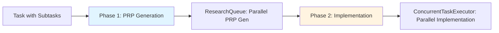
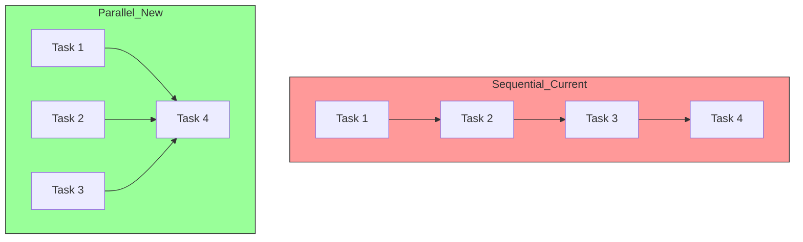
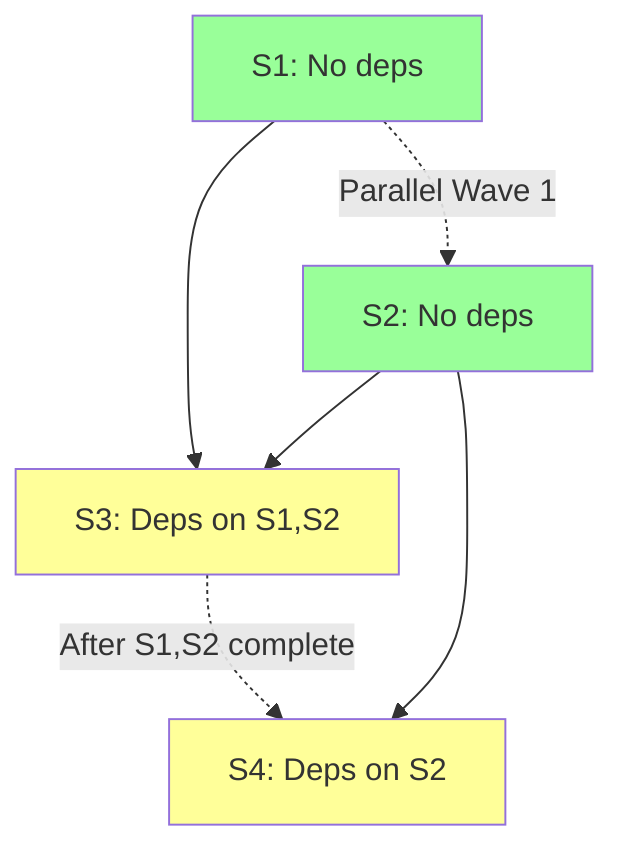
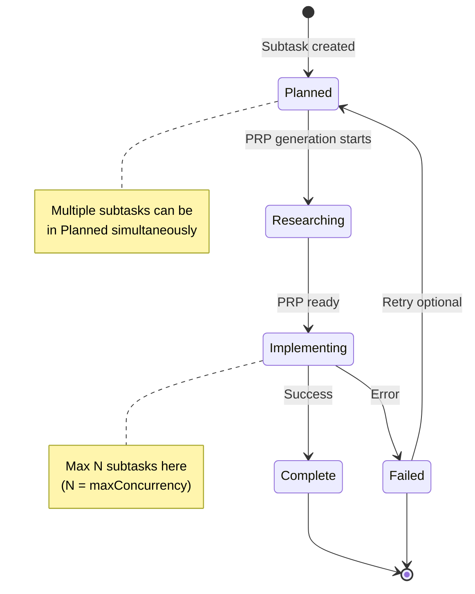
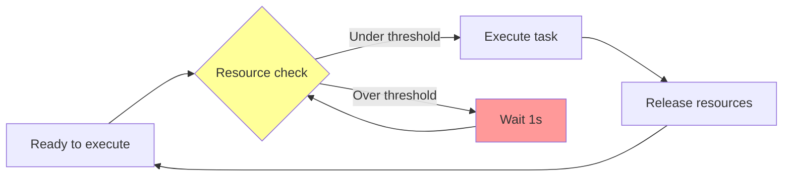
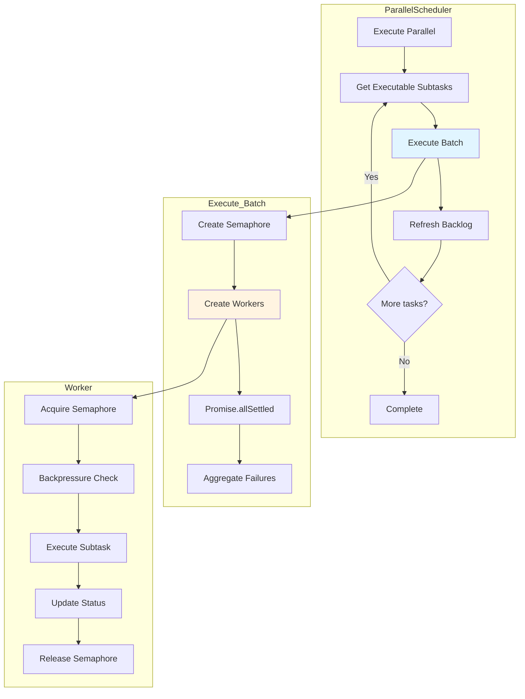

# Parallel Execution Strategy Design

> Design comprehensive parallel execution strategy for PRP Pipeline subtask execution

**Status**: Ready for Implementation
**Last Updated**: 2026-01-24
**Version**: 1.0.0
**Work Item**: P3.M1.T1.S1 - Design parallel execution strategy

---

## Table of Contents

1. [Executive Summary](#executive-summary)
2. [Current State Analysis](#current-state-analysis)
3. [Executable Subtask Identification](#executable-subtask-identification)
4. [Concurrent Execution Limits](#concurrent-execution-limits)
5. [PRP Generation vs Implementation Parallelization](#prp-generation-vs-implementation-parallelization)
6. [Resource Limits and Backpressure](#resource-limits-and-backpressure)
7. [State Updates for Concurrent Tasks](#state-updates-for-concurrent-tasks)
8. [Error Handling in Concurrent Context](#error-handling-in-concurrent-context)
9. [Parallel Scheduler Pseudocode](#parallel-scheduler-pseudocode)
10. [Diagrams](#diagrams)
11. [Integration Points](#integration-points)
12. [Testing Strategy](#testing-strategy)
13. [See Also](#see-also)

---

## Executive Summary

This document designs a comprehensive parallel execution strategy for the PRP Pipeline that enables concurrent subtask execution while maintaining dependency constraints. The current implementation executes subtasks sequentially despite having dependency resolution capabilities. This design extends the existing `ResearchQueue` pattern (which already parallelizes PRP generation) to implementation execution, enabling faster completion for independent subtasks.

**Key Design Goals**:

- Enable parallel execution of subtasks with satisfied dependencies
- Maintain configurable concurrency limits (pool size)
- Implement resource-aware backpressure
- Preserve thread-safe state management
- Provide comprehensive error handling for concurrent operations

**Reference Implementation**: Existing `ResearchQueue` class (`src/core/research-queue.ts:57-197`) demonstrates the pattern for parallel execution with concurrency limits.

---

## Current State Analysis

### Sequential Execution Bottleneck

The current `TaskOrchestrator` (`src/core/task-orchestrator.ts:805-834`) processes subtasks sequentially through `processNextItem()`. Despite having dependency resolution via `canExecute()` and `getBlockingDependencies()` (lines 251-293), subtasks execute one-by-one in a FIFO queue.

**Current Execution Flow**:

```typescript
// From task-orchestrator.ts:805-834
async processNextItem(): Promise<boolean> {
  // Check if execution queue has items
  if (this.#executionQueue.length === 0) {
    return false;
  }

  // Shift next item from queue (FIFO order)
  const nextItem = this.#executionQueue.shift()!;

  // Delegate to type-specific handler
  await this.#delegateByType(nextItem);

  // Refresh backlog after status update
  await this.#refreshBacklog();

  return true;  // More items may remain
}
```

**Key Limitation**: Even when multiple subtasks have satisfied dependencies (e.g., S1 and S2 both have no dependencies), they execute sequentially rather than in parallel.

### Existing Parallel Infrastructure: ResearchQueue

The `ResearchQueue` class (`src/core/research-queue.ts`) already implements parallel execution for PRP generation:

```typescript
// From research-queue.ts:57-197
export class ResearchQueue {
  readonly maxSize: number;  // Concurrency limit (currently 3)
  readonly researching: Map<string, Promise<PRPDocument>>;  // In-flight tracking

  async processNext(backlog: Backlog): Promise<void> {
    // Check capacity
    if (this.queue.length === 0 || this.researching.size >= this.maxSize) {
      return;  // Backpressure: wait for capacity
    }

    // Dequeue and start processing
    const task = this.queue.shift();
    const promise = this.#prpGenerator.generate(task, backlog)
      .finally(() => {
        this.researching.delete(task.id);
        this.processNext(backlog);  // Start next when complete
      });
    this.researching.set(task.id, promise);
  }
}
```

**Key Pattern**: Semaphore-like concurrency control with `maxSize` limiting active operations and automatic continuation via `processNext()` in `finally`.

### Dependency Resolution Capabilities

The `TaskOrchestrator` already has robust dependency resolution:

```typescript
// From task-orchestrator.ts:251-293
public canExecute(subtask: Subtask): boolean {
  const dependencies = getDependencies(subtask, this.#backlog);
  if (dependencies.length === 0) {
    return true;  // No dependencies = can execute
  }
  return dependencies.every(dep => dep.status === 'Complete');
}

public getBlockingDependencies(subtask: Subtask): Subtask[] {
  const dependencies = getDependencies(subtask, this.#backlog);
  return dependencies.filter(dep => dep.status !== 'Complete');
}
```

**Foundation Ready**: These methods provide the foundation for identifying executable subtasks in parallel execution.

### Groundswell @Task Decorator Constraints

The Groundswell `@Task` decorator (`node_modules/groundswell/src/decorators/task.ts:105-145`) provides built-in concurrency via `concurrent: true`, but **only works for Workflow instances**. Since subtasks are not workflows, we cannot use this decorator directly and must implement custom concurrency control.

### Performance Impact

With hundreds of subtasks, sequential execution creates a linear time bottleneck. Independent subtasks could execute concurrently, significantly reducing total execution time.

---

## Executable Subtask Identification

### Algorithm Overview

The core challenge in parallel execution is identifying which subtasks can run concurrently based on their dependencies. Subtasks can only depend on other subtasks **within the same task** (see `src/core/models.ts:267-275`).

### Executable Check Algorithm

```typescript
/**
 * Gets subtasks that can execute (dependencies satisfied)
 * @param subtasks - All subtasks to filter
 * @returns Array of executable subtasks (status === 'Planned' && all dependencies Complete)
 */
function getExecutableSubtasks(subtasks: Subtask[]): Subtask[] {
  return subtasks.filter(subtask => {
    // Must be in Planned state (not already running/complete)
    if (subtask.status !== 'Planned') {
      return false;
    }

    // All dependencies must be Complete
    return canExecute(subtask);
  });
}

/**
 * Check if subtask can execute (all dependencies Complete)
 * @param subtask - The subtask to check
 * @returns true if all dependencies are Complete or no dependencies exist
 */
function canExecute(subtask: Subtask): boolean {
  const dependencies = getDependencies(subtask, backlog);

  // Empty array means no dependencies = can execute
  if (dependencies.length === 0) {
    return true;
  }

  // All dependencies must be Complete
  return dependencies.every(dep => dep.status === 'Complete');
}
```

### Dependency Graph Traversal Pattern

Subtask dependencies form a directed acyclic graph (DAG). Parallel execution requires topological sorting with concurrent processing of independent nodes.

**Example Dependency Graph**:

```
S1 (no deps) ──────────────────┐
                              ├──> S3 (depends on S1, S2)
S2 (no deps) ──────────────────┤
                              │
                              └──> S4 (depends on S2)
```

**Execution Waves**:
- **Wave 1**: S1 and S2 execute concurrently (both have no dependencies)
- **Wave 2**: After S1 and S2 complete, S3 and S4 can execute concurrently

### Deadlock Detection

If no subtasks are executable but some remain in `Planned` status, a deadlock or circular dependency exists. This should be detected and reported.

```typescript
function detectDeadlock(plannedSubtasks: Subtask[]): boolean {
  // No executable subtasks but planned tasks remain
  const executable = getExecutableSubtasks(plannedSubtasks);
  const hasPlanned = plannedSubtasks.some(s => s.status === 'Planned');

  return executable.length === 0 && hasPlanned;
}
```

---

## Concurrent Execution Limits

### Pool Size Configuration

Parallel execution requires configurable concurrency limits to prevent resource exhaustion. The default pool size is **3** (matching `ResearchQueue`), but should be configurable via CLI flag.

**Configuration Interface**:

```typescript
interface ParallelismConfig {
  enabled: boolean;           // Enable/disable parallel execution
  maxConcurrency: number;     // Pool size for implementation (default: 3)
  prpGenerationLimit: number; // Pool size for PRP generation (default: 3)
}
```

### Semaphore Pattern for Concurrency Control

A semaphore limits concurrent operations by blocking workers when the limit is reached:

```typescript
/**
 * Semaphore for concurrency control
 * Limits active operations to max concurrent workers
 */
class Semaphore {
  private available: number;
  private waitQueue: Array<() => void> = [];

  constructor(private max: number) {
    this.available = max;
  }

  async acquire(): Promise<void> {
    if (this.available > 0) {
      this.available--;
      return;
    }

    // Wait in queue until slot available
    return new Promise<void>(resolve => {
      this.waitQueue.push(resolve);
    });
  }

  release(): void {
    this.available++;

    // Wake up next waiting worker
    const next = this.waitQueue.shift();
    if (next) {
      this.available--;
      next();
    }
  }
}
```

### Usage Pattern

```typescript
// Create semaphore with pool size
const semaphore = new Semaphore(config.maxConcurrency);

// Wrap each subtask execution with semaphore
async function executeWithSemaphore(subtask: Subtask): Promise<void> {
  await semaphore.acquire();  // Blocks if at limit
  try {
    await executeSubtask(subtask);
  } finally {
    semaphore.release();  // Always release
  }
}
```

### Recommended Pool Sizes by Workload

| Workload Type | Recommended Pool Size | Rationale |
|---------------|----------------------|-----------|
| I/O-bound (API calls, file ops) | 5-10 | High latency, low CPU usage |
| CPU-bound (compilation, processing) | 2-4 | Limited by CPU cores |
| Mixed (typical subtask execution) | 3 (default) | Balanced for most workloads |
| Resource-constrained environments | 1-2 | Prevent memory exhaustion |

---

## PRP Generation vs Implementation Parallelization

### Two-Phase Parallelization Strategy

The PRP Pipeline has **two distinct phases** that can be parallelized independently:

#### Phase 1: PRP Generation (Research Phase)

**Status**: Already implemented via `ResearchQueue`

- **What**: Generate PRP documents for subtasks
- **Concurrency**: Limited to 3 (hardcoded in `ResearchQueue`)
- **Pattern**: "Research ahead" - generates PRPs before execution
- **Location**: `src/core/research-queue.ts:57-197`

**Current Implementation**:
```typescript
// From task-orchestrator.ts:128-134
this.researchQueue = new ResearchQueue(
  this.sessionManager,
  3,  // Hardcoded concurrency limit
  this.#noCache
);
```

**Enhancement Needed**: Make concurrency configurable (currently hardcoded to 3).

#### Phase 2: Implementation Execution (Implementation Phase)

**Status**: Sequential - needs parallelization (this design)

- **What**: Execute PRPs via PRPExecutor
- **Concurrency**: Configurable (default: 3)
- **Pattern**: Dependency-aware parallel execution
- **Location**: To be implemented in `ConcurrentTaskExecutor`

**New Implementation**:
```typescript
// New class: ConcurrentTaskExecutor
class ConcurrentTaskExecutor {
  constructor(
    orchestrator: TaskOrchestrator,
    config: ParallelismConfig
  ) {
    this.maxConcurrency = config.maxConcurrency;
  }

  async executeParallel(subtasks: Subtask[]): Promise<void> {
    // Execute subtasks with concurrency limit
    // Only execute those with satisfied dependencies
  }
}
```

### Coordination Between Phases



**Key Insight**: PRP generation happens **before** implementation, but both phases can be parallel. ResearchQueue generates PRPs for all subtasks in parallel, then ConcurrentTaskExecutor executes them in parallel (respecting dependencies).

### Why Two Separate Limits?

PRP generation and implementation have different resource characteristics:

- **PRP Generation**: LLM API calls (high latency, low CPU) → higher concurrency beneficial
- **Implementation**: Code execution, file operations (mixed CPU/I/O) → moderate concurrency

Thus, `prpGenerationLimit` and `maxConcurrency` are configured separately.

---

## Resource Limits and Backpressure

### Types of Resource Limits

Parallel execution requires monitoring multiple resource types to prevent exhaustion:

#### 1. Memory Limits (Heap Size)

```typescript
interface ResourceUsage {
  memory: number;    // Heap usage ratio (0.0 to 1.0)
  fileHandles: number; // Open file handles count
}
```

**Detection**:
```typescript
function getMemoryUsage(): number {
  const usage = process.memoryUsage();
  const heapUsed = usage.heapUsed;
  const heapTotal = usage.heapTotal;
  return heapUsed / heapTotal;  // Ratio 0.0 to 1.0
}
```

#### 2. File Handle Limits

On macOS, file handle monitoring uses `lsof` (slower performance):

```typescript
async function getFileHandleCount(): Promise<number> {
  const { stdout } = await exec('lsof -p $$ | wc -l');
  return parseInt(stdout.trim());
}
```

**Gotcha**: File handle monitoring on macOS has performance overhead. Consider caching or reducing check frequency.

#### 3. LLM API Rate Limits

PRP generation makes concurrent LLM API calls. Rate limits require throttling:

```typescript
class RateLimiter {
  private requestTimes: number[] = [];

  async acquire(): Promise<void> {
    const now = Date.now();
    const windowStart = now - 60000;  // 1-minute window

    // Remove old requests outside window
    this.requestTimes = this.requestTimes.filter(t => t > windowStart);

    // Check if under limit (e.g., 50 requests/minute)
    if (this.requestTimes.length >= 50) {
      const waitTime = this.requestTimes[0] + 60000 - now;
      await new Promise(resolve => setTimeout(resolve, waitTime));
    }

    this.requestTimes.push(now);
  }
}
```

### Backpressure Mechanism

Backpressure pauses task execution when resources are near limits:

```typescript
/**
 * Wait for resource availability (backpressure)
 * @param threshold - Maximum resource usage ratio (default: 0.8 = 80%)
 */
async function waitForResourceAvailability(threshold: number = 0.8): Promise<void> {
  while (true) {
    const memory = getMemoryUsage();
    const fileHandles = await getFileHandleCount();
    const maxHandles = 1024;  // OS limit

    if (memory < threshold && fileHandles < maxHandles * threshold) {
      break;  // Resources available
    }

    // Wait before retrying (1 second backoff)
    await new Promise(resolve => setTimeout(resolve, 1000));
  }
}
```

### Integration with Execution Loop

```typescript
async function executeWithBackpressure(subtask: Subtask): Promise<void> {
  // Check resource limits before execution
  await waitForResourceAvailability(0.8);

  // Execute subtask
  await executeSubtask(subtask);
}
```

---

## State Updates for Concurrent Tasks

### Thread-Safe Status Update Patterns

When multiple workers execute concurrently, status updates must be atomic and consistent. The existing `SessionManager` (`src/core/session-manager.ts:748-800`) provides batching with atomic writes.

### Existing Batching Pattern

```typescript
// From session-manager.ts:768-800
async updateItemStatus(itemId: string, status: Status): Promise<Backlog> {
  const currentBacklog = this.#currentSession.taskRegistry;
  const updated = updateItemStatusUtil(currentBacklog, itemId, status);

  // BATCHING: Accumulate in memory instead of immediate write
  this.#pendingUpdates = updated;
  this.#dirty = true;
  this.#updateCount++;

  // Update internal session state
  this.#currentSession = {
    ...this.#currentSession,
    taskRegistry: updated,
  };

  return updated;  // Not yet persisted
}

async flushUpdates(): Promise<void> {
  if (!this.#dirty) {
    return;
  }

  // Persist accumulated updates atomically
  await this.saveBacklog(this.#pendingUpdates);

  // Reset batching state
  this.#dirty = false;
  this.#pendingUpdates = null;
  this.#updateCount = 0;
}
```

**Key Pattern**: Updates are accumulated in memory and flushed atomically via `flushUpdates()`.

### Concurrent Update Strategy

For parallel execution, follow these rules:

#### 1. Never Update the Same Subtask Concurrently

Each subtask is processed by exactly one worker. This is guaranteed by:
- Filtering executable subtasks excludes those already running
- Worker assignment is one-to-one with subtasks

#### 2. Sequential Status Updates Within Batch

Status updates for different subtasks are serialized via `SessionManager.updateItemStatus()`:

```typescript
// Worker 1
await sessionManager.updateItemStatus('P1.M1.T1.S1', 'Complete');

// Worker 2 (concurrent)
await sessionManager.updateItemStatus('P1.M1.T1.S2', 'Complete');

// Both batched, then flushed atomically
await sessionManager.flushUpdates();
```

#### 3. Refresh Backlog After Batch Completes

After concurrent workers complete, refresh the backlog to get latest state:

```typescript
// From task-orchestrator.ts:365-373
async #refreshBacklog(): Promise<void> {
  const currentSession = this.sessionManager.currentSession;
  if (!currentSession) {
    throw new Error('Cannot refresh backlog: no active session');
  }

  // Reload from session state (not cached value)
  this.#backlog = currentSession.taskRegistry;
}
```

### Atomic Write Pattern

The `SessionManager` uses atomic file writes via temp file + rename:

```typescript
// From session-utils.ts (referenced in session-manager.ts:620-646)
async function writeTasksJSON(sessionPath: string, backlog: Backlog): Promise<void> {
  const tempPath = `${sessionPath}/tasks.json.tmp`;
  const finalPath = `${sessionPath}/tasks.json`;

  // Write to temp file
  await writeFile(tempPath, JSON.stringify(backlog, null, 2));

  // Atomic rename (prevents corruption if process crashes during write)
  await rename(tempPath, finalPath);
}
```

**Benefit**: If process crashes during write, either old file or new file exists - never partial data.

### Conflict Resolution

Status races are prevented by:
1. Each worker updates a different subtask (no overlapping writes)
2. Batching ensures all updates are applied atomically
3. Status progression is linear (Planned → Researching → Implementing → Complete/Failed)

---

## Error Handling in Concurrent Context

### Isolated Error Handling Principle

In parallel execution, one subtask failure should **not** stop other independent subtasks. Errors are isolated and aggregated.

### Promise.allSettled() Pattern

Use `Promise.allSettled()` instead of `Promise.all()` to continue on individual failures:

```typescript
async function executeBatch(subtasks: Subtask[]): Promise<void> {
  // Create workers for each subtask
  const workers = subtasks.map(subtask => async () => {
    try {
      await executeSubtask(subtask);
      await orchestrator.setStatus(subtask.id, 'Complete', 'Success');
    } catch (error) {
      await orchestrator.setStatus(
        subtask.id,
        'Failed',
        error instanceof Error ? error.message : String(error)
      );
      throw error;  // Re-throw for aggregation
    }
  });

  // Execute all workers (semaphore limits concurrency)
  const results = await Promise.allSettled(
    workers.map(worker => worker())
  );

  // Aggregate failures
  const failures = results.filter(r => r.status === 'rejected');
  if (failures.length > 0) {
    logger.warn(
      { failureCount: failures.length },
      'Some parallel tasks failed'
    );
    // Log individual failures
    failures.forEach((f, i) => {
      if (f.status === 'rejected') {
        logger.error({ subtaskId: subtasks[i].id, error: f.reason });
      }
    });
  }
}
```

### Error Types and Handling

#### 1. Non-Fatal Errors (Continue Execution)

**Examples**:
- Subtask implementation fails (syntax error, test failure)
- LLM API rate limit exceeded (retry after backoff)
- File I/O error (retry or skip subtask)

**Handling**: Mark subtask as `Failed`, log error, continue with other tasks.

#### 2. Fatal Errors (Abort All)

**Examples**:
- Session file corruption
- Out of memory (heap limit exceeded)
- Unhandled exception in orchestrator

**Handling**: Abort entire batch, report error to user.

```typescript
class FatalExecutionError extends Error {
  constructor(message: string, public readonly cause: unknown) {
    super(message);
    this.name = 'FatalExecutionError';
  }
}

async function executeBatch(subtasks: Subtask[]): Promise<void> {
  try {
    await Promise.allSettled(/* workers */);
  } catch (error) {
    // Detect fatal errors
    if (error instanceof FatalExecutionError) {
      logger.error({ error }, 'Fatal error - aborting batch');
      throw error;  // Re-throw to abort
    }
  }
}
```

### Retry Strategy for Failed Parallel Tasks

Optional retry mechanism for transient failures:

```typescript
async function executeWithRetry(
  subtask: Subtask,
  maxRetries: number = 3
): Promise<void> {
  let attempt = 0;
  while (attempt < maxRetries) {
    try {
      await executeSubtask(subtask);
      return;  // Success
    } catch (error) {
      attempt++;
      if (attempt >= maxRetries) {
        throw error;  // Final attempt failed
      }
      // Backoff before retry
      await new Promise(resolve => setTimeout(resolve, 1000 * attempt));
    }
  }
}
```

### Fire-and-Forget Error Handling

From the testing patterns doc (`testing-concurrent-operations-vitest-typescript.md`), fire-and-forget is acceptable for background operations:

```typescript
// Fire-and-forget: don't await, log errors only
researchQueue.processNext(backlog).catch(error => {
  logger.error({ error }, 'Background research error');
});
```

**Use Case**: Background research triggering after subtask execution.

---

## Parallel Scheduler Pseudocode

### Complete Scheduler Algorithm

```typescript
/**
 * Parallel Scheduler - Design Pseudocode
 * This is design documentation, not implementation code
 */

interface ParallelSchedulerConfig {
  maxConcurrency: number;        // Default: 3
  prpGenerationLimit: number;    // Default: 3 (existing ResearchQueue)
  resourceThreshold: number;     // Default: 0.8 (80% resource usage)
}

class ParallelScheduler {
  private orchestrator: TaskOrchestrator;
  private researchQueue: ResearchQueue;
  private config: ParallelSchedulerConfig;

  /**
   * Main parallel execution loop
   * Replaces sequential processNextItem() loop
   */
  async executeParallel(backlog: Backlog): Promise<void> {
    const plannedSubtasks = this.getAllPlannedSubtasks(backlog);

    // Execute until all subtasks are Complete or Failed
    while (this.hasIncompleteTasks(plannedSubtasks)) {
      // Phase 1: Identify executable subtasks (dependencies satisfied)
      const executable = this.getExecutableSubtasks(plannedSubtasks);

      if (executable.length === 0) {
        // No tasks ready - check for blocked/deadlocked tasks
        await this.handleDeadlockDetection(plannedSubtasks);
        break;
      }

      // Phase 2: Execute batch with concurrency limit
      await this.executeBatch(executable, backlog);

      // Phase 3: Refresh backlog to get latest state
      await this.orchestrator.refreshBacklog();

      // Update planned subtasks list for next iteration
      plannedSubtasks = this.getAllPlannedSubtasks(backlog);
    }
  }

  /**
   * Get subtasks that can execute (dependencies satisfied)
   */
  private getExecutableSubtasks(subtasks: Subtask[]): Subtask[] {
    return subtasks.filter(subtask => {
      // Must be in Planned state
      if (subtask.status !== 'Planned') {
        return false;
      }

      // All dependencies must be Complete
      return this.canExecute(subtask);
    });
  }

  /**
   * Execute a batch of subtasks with concurrency limit
   */
  private async executeBatch(
    subtasks: Subtask[],
    backlog: Backlog
  ): Promise<void> {
    // Create semaphore for concurrency control
    const semaphore = new Semaphore(this.config.maxConcurrency);

    // Create worker for each subtask
    const workers = subtasks.map(subtask => {
      return async () => {
        // Acquire semaphore (wait if at limit)
        await semaphore.acquire();

        try {
          // Check resource limits (backpressure)
          await this.waitForResourceAvailability();

          // Execute subtask via PRPRuntime
          await this.orchestrator.prpRuntime.executeSubtask(
            subtask,
            backlog
          );

          // Update status to Complete
          await this.orchestrator.setStatus(
            subtask.id,
            'Complete',
            'Parallel execution complete'
          );
        } catch (error) {
          // Handle error (non-fatal, continue with other tasks)
          await this.orchestrator.setStatus(
            subtask.id,
            'Failed',
            error instanceof Error ? error.message : String(error)
          );
        } finally {
          // Release semaphore for next task
          semaphore.release();

          // Flush state updates periodically
          await this.orchestrator.sessionManager.flushUpdates();
        }
      };
    });

    // Execute all workers in parallel (semaphore limits concurrency)
    const results = await Promise.allSettled(
      workers.map(worker => worker())
    );

    // Log any failures (non-fatal)
    const failures = results.filter(r => r.status === 'rejected');
    if (failures.length > 0) {
      this.logger.warn(
        { failureCount: failures.length },
        'Some parallel tasks failed'
      );
    }
  }

  /**
   * Wait for resource availability (backpressure)
   */
  private async waitForResourceAvailability(): Promise<void> {
    const resourceMonitor = this.orchestrator.resourceMonitor;

    while (true) {
      const usage = await resourceMonitor.getCurrentUsage();

      if (usage.memory < this.config.resourceThreshold &&
          usage.fileHandles < this.config.resourceThreshold) {
        break;  // Resources available
      }

      // Wait before retrying
      await new Promise(resolve => setTimeout(resolve, 1000));
    }
  }

  /**
   * Check if subtask can execute (all dependencies Complete)
   */
  private canExecute(subtask: Subtask): boolean {
    const dependencies = getDependencies(subtask, this.backlog);

    return dependencies.every(dep => dep.status === 'Complete');
  }

  /**
   * Detect and handle deadlock (no executable tasks but tasks remain)
   */
  private async handleDeadlockDetection(subtasks: Subtask[]): Promise<void> {
    const planned = subtasks.filter(s => s.status === 'Planned');
    const executable = this.getExecutableSubtasks(subtasks);

    if (executable.length === 0 && planned.length > 0) {
      // Deadlock detected - log blocking dependencies
      for (const subtask of planned) {
        const blockers = this.orchestrator.getBlockingDependencies(subtask);
        this.logger.error({
          subtaskId: subtask.id,
          blockers: blockers.map(b => ({ id: b.id, status: b.status }))
        }, 'Deadlock: subtask blocked with circular dependencies');
      }

      throw new Error('Deadlock detected: no executable tasks but planned tasks remain');
    }
  }

  /**
   * Check if any incomplete tasks remain
   */
  private hasIncompleteTasks(subtasks: Subtask[]): boolean {
    return subtasks.some(s => s.status !== 'Complete' && s.status !== 'Failed');
  }
}

/**
 * Semaphore for concurrency control
 */
class Semaphore {
  private available: number;
  private waitQueue: Array<() => void> = [];

  constructor(private max: number) {
    this.available = max;
  }

  async acquire(): Promise<void> {
    if (this.available > 0) {
      this.available--;
      return;
    }

    // Wait in queue
    return new Promise<void>(resolve => {
      this.waitQueue.push(resolve);
    });
  }

  release(): void {
    this.available++;

    // Wake up next waiting worker
    const next = this.waitQueue.shift();
    if (next) {
      this.available--;
      next();
    }
  }
}
```

### Key Design Decisions

1. **Wave-based Execution**: The scheduler executes in waves - first all tasks with no dependencies, then tasks whose dependencies completed in previous waves.

2. **Semaphore for Concurrency**: The semaphore pattern ensures exactly `maxConcurrency` workers run simultaneously, with others waiting in queue.

3. **Backpressure Integration**: Resource checks happen before each task execution, preventing resource exhaustion.

4. **Non-Fatal Errors**: Individual task failures don't stop the batch - errors are logged and aggregated.

5. **State Refresh**: Backlog is refreshed after each batch to ensure dependency status is up-to-date.

---

## Diagrams

### Sequential vs Parallel Execution Flow



**Sequential Current**: Tasks execute one-by-one, even if independent.
**Parallel New**: Tasks 1-3 execute concurrently, Task 4 waits for dependencies.

### Dependency Graph with Parallel Execution



**Wave 1**: S1 and S2 execute concurrently (both have no dependencies).
**Wave 2**: After S1 and S2 complete, S3 and S4 can execute (dependencies satisfied).

### State Transitions for Concurrent Execution



### Resource Backpressure Flow



### Parallel Scheduler Architecture



---

## Integration Points

### TaskOrchestrator Integration

**File**: `src/core/task-orchestrator.ts`
**Lines**: 805-834 (processNextItem - reference for parallel version)

**Integration**: Add `executeParallel()` method alongside `processNextItem()`

```typescript
// New method in TaskOrchestrator
async executeParallel(config: ParallelismConfig): Promise<void> {
  const scheduler = new ParallelScheduler(this, config);
  await scheduler.executeParallel(this.#backlog);
}
```

**Pattern**: Maintain same interface, add parallel execution path. Sequential mode remains available for debugging.

### ResearchQueue Integration

**File**: `src/core/research-queue.ts`
**Lines**: 128-133 (constructor with maxSize)

**Integration**: Make concurrency configurable

```typescript
// Current: hardcoded to 3
this.researchQueue = new ResearchQueue(this.sessionManager, 3, this.#noCache);

// Enhanced: configurable
this.researchQueue = new ResearchQueue(
  this.sessionManager,
  config.prpGenerationLimit,  // Configurable
  this.#noCache
);
```

**Status**: ResearchQueue already provides parallel PRP generation. Only enhancement needed is configurable pool size.

### PRPRuntime Integration

**File**: `src/agents/prp-runtime.ts`
**Lines**: 139-232 (executeSubtask method)

**Integration**: Call `executeSubtask()` from parallel workers

```typescript
// In ParallelScheduler worker
await this.orchestrator.prpRuntime.executeSubtask(
  subtask,
  backlog
);
```

**Pattern**: Thread-safe status updates via `TaskOrchestrator.setStatus()` method.

### SessionManager Integration

**File**: `src/core/session-manager.ts`
**Lines**: 748-800 (updateItemStatus), 670-720 (flushUpdates)

**Integration**: Atomic state updates for concurrent operations

```typescript
// Worker updates status (batched)
await this.orchestrator.sessionManager.updateItemStatus(
  subtask.id,
  'Complete'
);

// Batch flushed after all workers complete
await this.orchestrator.sessionManager.flushUpdates();
```

**Gotcha**: Ensure no concurrent updates to same subtask (guaranteed by worker assignment).

### CLI Integration (P3.M1.T1.S3)

**File**: `src/cli/index.ts`
**Integration**: Add `--parallelism <n>` and `--parallelism-prp <n>` flags

```typescript
// CLI options
--parallelism <n>        // Max concurrent subtasks (default: 3)
--parallelism-prp <n>    // Max concurrent PRP generations (default: 3)
```

**Configuration Interface**:
```typescript
interface ParallelismConfig {
  enabled: boolean;
  maxConcurrency: number;
  prpGenerationLimit: number;
}
```

### Resource Monitor Integration

**File**: `src/utils/resource-monitor.ts` (existing)
**Integration**: Monitor memory and file handles for backpressure

```typescript
interface ResourceUsage {
  memory: number;      // Heap usage ratio (0.0 to 1.0)
  fileHandles: number; // Open file handles count
}

interface ResourceMonitor {
  getCurrentUsage(): Promise<ResourceUsage>;
}
```

---

## Testing Strategy

### Unit Test Patterns

From the testing patterns doc (`testing-concurrent-operations-vitest-typescript.md`):

#### 1. Concurrency Limit Testing

Use `ConcurrencyTracker` pattern to verify limits:

```typescript
class ConcurrencyTracker {
  private active = 0;
  private max = 0;

  track<T>(fn: () => Promise<T>): () => Promise<T> {
    return async () => {
      this.active++;
      this.max = Math.max(this.max, this.active);
      try {
        return await fn();
      } finally {
        this.active--;
      }
    };
  }

  getMaxConcurrency(): number {
    return this.max;
  }
}

// Test
test('respects concurrency limit of 3', async () => {
  const tracker = new ConcurrencyTracker();
  const executor = new ConcurrentTaskExecutor(config);

  const subtasks = [/* 10 subtasks with no deps */];
  await executor.executeParallel(subtasks);

  expect(tracker.getMaxConcurrency()).toBe(3);
});
```

#### 2. Dependency Ordering Verification

Ensure subtasks execute in dependency order:

```typescript
test('executes subtasks in dependency order', async () => {
  const executionOrder: string[] = [];

  const subtasks = [
    { id: 'S1', dependencies: [] },
    { id: 'S2', dependencies: [] },
    { id: 'S3', dependencies: ['S1', 'S2'] },
  ];

  // Track execution order
  await executor.executeParallel(subtasks);

  // S1 and S2 should execute before S3
  const s1Index = executionOrder.indexOf('S1');
  const s2Index = executionOrder.indexOf('S2');
  const s3Index = executionOrder.indexOf('S3');

  expect(s1Index).toBeLessThan(s3Index);
  expect(s2Index).toBeLessThan(s3Index);
});
```

#### 3. Error Handling Tests

Test partial failures don't stop execution:

```typescript
test('continues execution on individual task failures', async () => {
  const subtasks = [
    { id: 'S1', fn: () => Promise.resolve() },
    { id: 'S2', fn: () => Promise.reject(new Error('Fail')) },
    { id: 'S3', fn: () => Promise.resolve() },
  ];

  const result = await executor.executeParallel(subtasks);

  expect(result.completed).toEqual(['S1', 'S3']);
  expect(result.failed).toEqual(['S2']);
});
```

#### 4. Resource Limit Testing

Mock resource monitor to test backpressure:

```typescript
test('applies backpressure when resources exhausted', async () => {
  const mockMonitor = {
    getCurrentUsage: vi.fn().mockResolvedValue({
      memory: 0.9,  // Over threshold
      fileHandles: 0.5
    })
  };

  // Should wait before executing
  const executor = new ConcurrentTaskExecutor({ resourceMonitor: mockMonitor });
  const startTime = Date.now();

  await executor.executeParallel([/* subtask */]);

  // Verify backpressure delay occurred
  expect(Date.now() - startTime).toBeGreaterThan(1000);
});
```

### Integration Test Patterns

#### 1. End-to-End Parallel Execution

```typescript
test('executes complete task hierarchy in parallel', async () => {
  const backlog = {
    backlog: [{
      id: 'P1',
      type: 'Phase',
      milestones: [{
        id: 'P1.M1',
        tasks: [{
          id: 'P1.M1.T1',
          subtasks: [
            { id: 'P1.M1.T1.S1', dependencies: [] },
            { id: 'P1.M1.T1.S2', dependencies: [] },
            { id: 'P1.M1.T1.S3', dependencies: ['P1.M1.T1.S1', 'P1.M1.T1.S2'] },
          ]
        }]
      }]
    }]
  };

  const orchestrator = new TaskOrchestrator(sessionManager);
  await orchestrator.executeParallel({ maxConcurrency: 2 });

  // Verify S1 and S2 executed before S3
  const s1 = findItem(backlog, 'P1.M1.T1.S1');
  const s2 = findItem(backlog, 'P1.M1.T1.S2');
  const s3 = findItem(backlog, 'P1.M1.T1.S3');

  expect(s1.status).toBe('Complete');
  expect(s2.status).toBe('Complete');
  expect(s3.status).toBe('Complete');
});
```

#### 2. Deadlock Detection

```typescript
test('detects circular dependencies', async () => {
  const subtasks = [
    { id: 'S1', dependencies: ['S2'] },
    { id: 'S2', dependencies: ['S1'] },  // Circular
  ];

  const executor = new ConcurrentTaskExecutor(config);

  await expect(
    executor.executeParallel(subtasks)
  ).rejects.toThrow('Deadlock detected');
});
```

### Performance Testing

Measure speedup from parallel execution:

```typescript
test('parallel execution faster than sequential', async () => {
  const subtasks = Array.from({ length: 10 }, (_, i) => ({
    id: `S${i}`,
    dependencies: [],
    duration: 100  // ms
  }));

  // Sequential
  const seqStart = Date.now();
  await executeSequential(subtasks);
  const seqTime = Date.now() - seqStart;

  // Parallel (pool size 3)
  const parStart = Date.now();
  await executeParallel(subtasks, { maxConcurrency: 3 });
  const parTime = Date.now() - parStart;

  // Parallel should be ~3x faster (10 tasks / 3 workers)
  expect(parTime).toBeLessThan(seqTime / 2);
});
```

---

## See Also

### Core Implementation Files

- **[src/core/task-orchestrator.ts](../../src/core/task-orchestrator.ts)** - Sequential execution logic, dependency resolution (`canExecute()`, `getBlockingDependencies()`)
  - Lines 251-293: Dependency resolution
  - Lines 805-834: Sequential `processNextItem()` loop
- **[src/core/research-queue.ts](../../src/core/research-queue.ts)** - Parallel PRP generation pattern (reference for implementation)
  - Lines 57-197: Queue implementation with `processNext()`, `enqueue()`, `waitForPRP()`
- **[src/agents/prp-runtime.ts](../../src/agents/prp-runtime.ts)** - PRP execution orchestration
  - Lines 139-232: `executeSubtask()` method with status progression
- **[src/core/session-manager.ts](../../src/core/session-manager.ts)** - State management with atomic updates
  - Lines 748-800: Batched `updateItemStatus()`
  - Lines 670-720: Atomic `flushUpdates()`
- **[src/core/models.ts](../../src/core/models.ts)** - Data models (Subtask, Status, dependencies)
  - Lines 231-293: Subtask interface with dependencies array

### Documentation

- **[plan/003_b3d3efdaf0ed/docs/system_context.md](./system_context.md)** - Current implementation status and limitations
  - Section: "Limitations & Pain Points" (Sequential Subtask Execution)
- **[plan/003_b3d3efdaf0ed/docs/testing-concurrent-operations-vitest-typescript.md](./testing-concurrent-operations-vitest-typescript.md)** - Testing patterns for concurrent operations
  - Sections: "Testing Concurrent Execution with Limits", "Testing Queue Dependency Ordering"
- **[plan/003_b3d3efdaf0ed/docs/workflow-best-practices.md](./workflow-best-practices.md)** - External research on workflow orchestration (Airflow, Prefect, Dagster)
- **[plan/003_b3d3efdaf0ed/docs/ARCHITECTURE.md](./ARCHITECTURE.md)** - Overall system architecture
  - Section: "Task Orchestrator"

### External Libraries

- **[Groundswell @Task Decorator](../../node_modules/groundswell/src/decorators/task.ts)** - Concurrent execution for Workflows
  - Lines 105-145: Concurrent execution logic (not usable for subtasks - they're not Workflows)

### Related Tasks

- **P3.M1.T1.S2** - Implement `ConcurrentTaskExecutor` (implementation of this design)
- **P3.M1.T1.S3** - Add CLI `--parallelism` flag (configuration UI)

---

**Document Status**: Ready for Implementation
**Next Step**: Proceed to P3.M1.T1.S2 (Concurrent Task Executor implementation)
